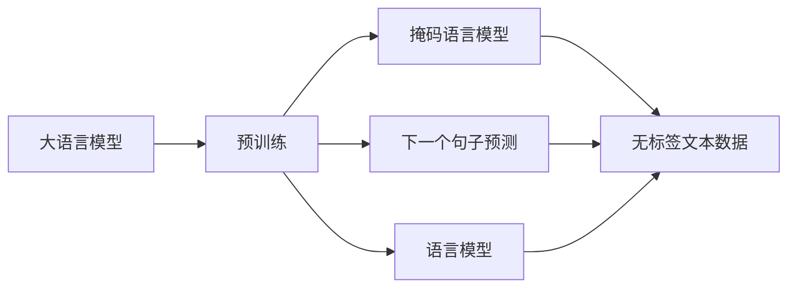
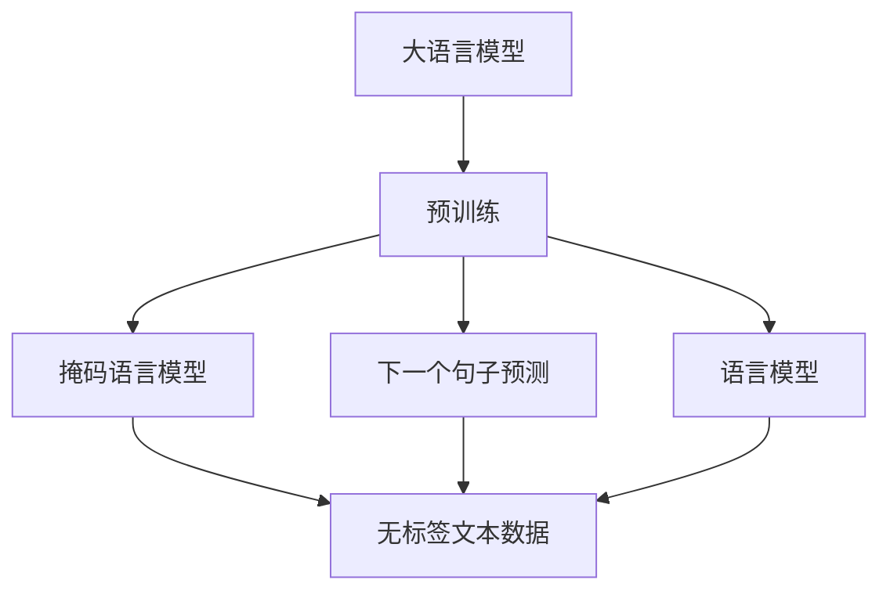
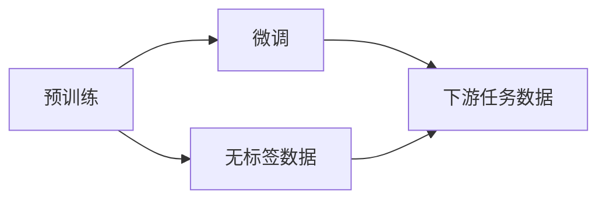
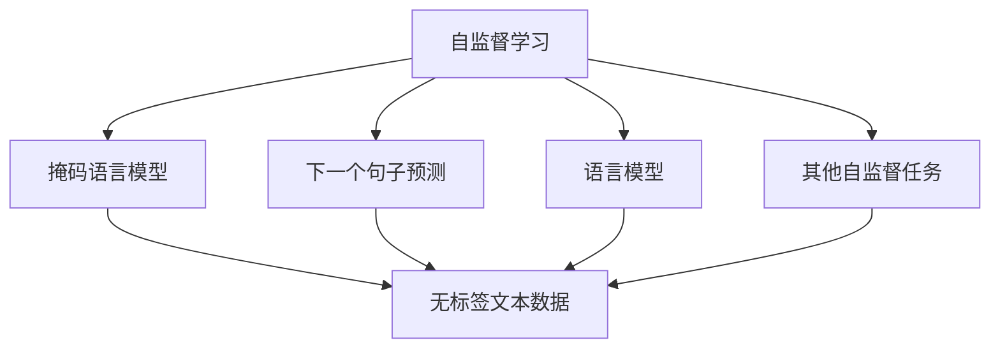
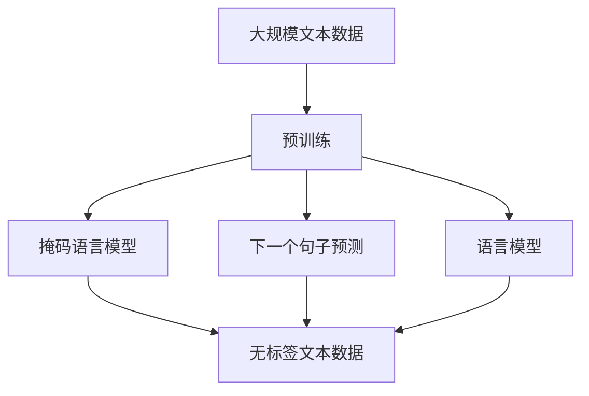

                 

# 大语言模型的自监督学习

> 关键词：大语言模型,自监督学习,Transformer,BERT,预训练,自回归模型,语言模型,数据增强

## 1. 背景介绍

### 1.1 问题由来
近年来，深度学习技术在自然语言处理(NLP)领域取得了显著进展，尤其是在大语言模型(Large Language Models, LLMs)方面。大语言模型通过在大规模无标签文本数据上进行预训练，学习到了丰富的语言知识和常识。这些模型通常以自回归(如GPT)或自编码(如BERT)的形式呈现，具备强大的语言理解和生成能力。

然而，尽管大语言模型在预训练阶段获得了丰富的知识，但这些知识往往无法直接应用到特定的下游任务中。例如，BERT通过掩码语言模型和下一个句子预测等自监督任务学习到语言表示，但这些表示是否适用于特定任务（如问答、翻译等）还需要进一步验证。因此，如何在预训练和微调之间找到平衡，使得大语言模型更好地适应特定任务，成为了当前研究的热点问题。

### 1.2 问题核心关键点
大语言模型在预训练阶段的自监督学习是其成功的基础。自监督学习是一种利用数据自身特征进行无标签训练的方法，通过最大化数据本身的概率来间接学习任务相关的知识。常见的自监督学习任务包括：

1. **掩码语言模型**：将输入文本中的某些单词随机掩码，让模型预测被掩码的单词，从而学习到单词之间的关系和上下文信息。

2. **下一个句子预测**：给定一段文本，模型需要预测该文本后面出现的下一个句子，以此来捕捉文本的语义连贯性和上下文关系。

3. **语言模型**：模型需要预测给定文本中下一个单词的概率分布，从而学习到单词的出现频率和语义依赖。

自监督学习的方法通过在大规模无标签文本数据上进行训练，避免了标注数据的高成本和高风险，同时也提高了模型在大规模数据上的泛化能力。

### 1.3 问题研究意义
自监督学习是大语言模型在预训练阶段的核心范式，通过在大规模无标签数据上学习到通用的语言表示，可以有效提升模型的语言理解能力和下游任务的性能。同时，自监督学习还可以帮助大语言模型克服过拟合问题，提高模型的鲁棒性和泛化能力。

通过自监督学习，大语言模型可以在不依赖标注数据的情况下，通过自学习和自适应，逐步积累并整合多领域的知识，从而为不同任务提供更加通用、灵活的语言模型。这对于加速NLP技术的产业化进程，提升下游任务的性能，具有重要意义。

## 2. 核心概念与联系

### 2.1 核心概念概述

为更好地理解大语言模型在预训练阶段的自监督学习过程，本节将介绍几个关键概念：

- **大语言模型(Large Language Model, LLM)**：以自回归(如GPT)或自编码(如BERT)模型为代表的大规模预训练语言模型。通过在大规模无标签文本语料上进行预训练，学习通用的语言表示，具备强大的语言理解和生成能力。

- **预训练(Pre-training)**：指在大规模无标签文本语料上，通过自监督学习任务训练通用语言模型的过程。常见的预训练任务包括掩码语言模型、下一个句子预测等。预训练使得模型学习到语言的通用表示。

- **自监督学习(Self-supervised Learning)**：利用数据自身的特征进行无标签训练，最大化数据本身的概率分布，间接学习任务相关的知识。

- **掩码语言模型(Masked Language Model, MLM)**：将输入文本中的某些单词随机掩码，让模型预测被掩码的单词，从而学习到单词之间的关系和上下文信息。

- **下一个句子预测(Next Sentence Prediction, NSP)**：给定一段文本，模型需要预测该文本后面出现的下一个句子，以此来捕捉文本的语义连贯性和上下文关系。

- **语言模型(Language Model)**：模型需要预测给定文本中下一个单词的概率分布，从而学习到单词的出现频率和语义依赖。

这些概念之间的逻辑关系可以通过以下Mermaid流程图来展示：



这个流程图展示了大语言模型在预训练阶段的核心自监督学习任务，以及它们之间的逻辑联系。

### 2.2 概念间的关系

这些核心概念之间存在着紧密的联系，形成了大语言模型预训练的完整生态系统。下面通过几个Mermaid流程图来展示这些概念之间的关系。

#### 2.2.1 大语言模型的学习范式



这个流程图展示了大语言模型在预训练阶段采用的自监督学习任务，以及这些任务之间的相互关系。

#### 2.2.2 预训练与微调的关系



这个流程图展示了预训练和微调之间的相互关系，预训练学到的通用语言表示，通过微调可以更好地适应下游任务。

#### 2.2.3 自监督学习范式的扩展



这个流程图展示了自监督学习范式在语言模型预训练中的扩展应用，除了掩码语言模型、下一个句子预测、语言模型外，还有其他的自监督学习任务可以加入。

### 2.3 核心概念的整体架构

最后，我们用一个综合的流程图来展示这些核心概念在大语言模型预训练过程中的整体架构：



这个综合流程图展示了从预训练到微调，再到持续学习的完整过程。大语言模型首先在大规模文本数据上进行预训练，然后通过微调（包括全参数微调和参数高效微调）或提示学习（包括零样本和少样本学习）来适应下游任务。最后，通过持续学习技术，模型可以不断学习新知识，同时避免遗忘旧知识。通过这些流程图，我们可以更清晰地理解大语言模型预训练过程中各个核心概念的关系和作用。

## 3. 核心算法原理 & 具体操作步骤
### 3.1 算法原理概述

大语言模型的预训练主要采用自监督学习方法，通过在无标签文本数据上学习语言的通用表示。其核心思想是：通过最大化文本数据的概率分布，间接学习语言模型。具体而言，预训练的目标是：

$$
\arg\max_{P(\text{data})} \prod_{x \in D} P(x)
$$

其中 $D$ 为大规模无标签文本数据集，$P(\text{data})$ 为数据分布，$P(x)$ 为单个文本 $x$ 的概率分布。

常见的预训练任务有掩码语言模型、下一个句子预测、语言模型等，其目标函数如下：

- **掩码语言模型**：

$$
\mathcal{L}_{\text{MLM}} = -\frac{1}{N} \sum_{i=1}^N \log P(x_i^{[i]})
$$

其中 $x_i^{[i]}$ 表示 $x_i$ 中掩码的单词 $i$ 的正确预测，$N$ 为训练样本数量。

- **下一个句子预测**：

$$
\mathcal{L}_{\text{NSP}} = -\frac{1}{2N} \sum_{i=1}^N \sum_{j=1}^{M} \log \text{softmax}(\text{CLS}(x_i) \cdot h_j)
$$

其中 $x_i$ 和 $x_i^{'}$ 为一段文本及其后续的下一个句子，$M$ 为下一个句子的数量。

- **语言模型**：

$$
\mathcal{L}_{\text{LM}} = -\frac{1}{N} \sum_{i=1}^N \log P(x_i)
$$

其中 $P(x_i)$ 为给定文本 $x_i$ 的概率分布。

### 3.2 算法步骤详解

大语言模型的预训练一般包括以下几个关键步骤：

**Step 1: 准备预训练模型和数据集**
- 选择合适的预训练语言模型 $M_{\theta}$ 作为初始化参数，如 BERT、GPT 等。
- 准备大规模无标签文本数据集 $D$，例如Wikipedia、CommonCrawl等。

**Step 2: 添加预训练任务**
- 根据任务类型，设计相应的预训练任务，如掩码语言模型、下一个句子预测等。
- 对模型添加相应的损失函数，如交叉熵损失等。

**Step 3: 设置预训练超参数**
- 选择合适的优化算法及其参数，如 Adam、SGD 等，设置学习率、批大小、迭代轮数等。
- 设置正则化技术及强度，包括权重衰减、Dropout、Early Stopping 等。

**Step 4: 执行梯度训练**
- 将大规模无标签文本数据分批次输入模型，前向传播计算损失函数。
- 反向传播计算参数梯度，根据设定的优化算法和学习率更新模型参数。
- 周期性在验证集上评估模型性能，根据性能指标决定是否触发 Early Stopping。
- 重复上述步骤直至满足预设的迭代轮数或 Early Stopping 条件。

**Step 5: 保存和部署**
- 保存训练好的预训练模型，以便后续的微调和应用。
- 部署预训练模型到实际应用系统中，供下游任务调用。

以上是预训练语言模型的基本流程。在实际应用中，还需要针对具体任务和数据特点，对预训练过程的各个环节进行优化设计，如改进训练目标函数，引入更多的正则化技术，搜索最优的超参数组合等，以进一步提升模型性能。

### 3.3 算法优缺点

大语言模型预训练采用自监督学习的方法，具有以下优点：

1. **高效性**：预训练任务可以在无标签数据上进行，避免了标注数据的高成本和高风险。
2. **泛化能力**：通过在大规模无标签数据上进行训练，模型具有较好的泛化能力，可以适用于多种下游任务。
3. **可解释性**：自监督学习过程简单直观，预训练模型的输出具有良好的可解释性，易于理解。

同时，该方法也存在以下局限性：

1. **数据依赖性**：预训练任务的性能很大程度上取决于数据的质量和数量。
2. **计算资源消耗大**：大规模无标签数据的预训练需要大量的计算资源和时间。
3. **模型复杂度高**：预训练模型通常具有较高的参数量，对计算资源和内存占用大。

尽管存在这些局限性，但就目前而言，自监督学习仍然是大语言模型预训练的主流范式。未来相关研究的重点在于如何进一步降低预训练对数据和计算资源的依赖，提高模型的效率和可解释性，同时兼顾模型性能。

### 3.4 算法应用领域

自监督学习方法在大语言模型预训练中的应用，已经在多个领域取得了显著的成果。以下是几个典型应用场景：

- **文本分类**：通过掩码语言模型学习文本中的词序和上下文信息，使得模型能够更好地理解文本语义，从而提高文本分类性能。

- **命名实体识别**：通过掩码语言模型和下一个句子预测，学习实体边界和类型，提高命名实体识别精度。

- **问答系统**：通过掩码语言模型和下一个句子预测，学习问题-答案对之间的语义关联，提高问答系统的准确性。

- **机器翻译**：通过语言模型学习源语言和目标语言之间的映射关系，提高机器翻译的效果。

- **文本摘要**：通过掩码语言模型和下一个句子预测，学习文本中的重要信息，生成高质量的文本摘要。

除了上述这些经典应用外，自监督学习方法还在诸多领域展示了其强大的应用潜力，如情感分析、文本生成、对话系统等。

## 4. 数学模型和公式 & 详细讲解  
### 4.1 数学模型构建

本节将使用数学语言对大语言模型在预训练阶段的自监督学习过程进行更加严格的刻画。

记预训练语言模型为 $M_{\theta}:\mathcal{X} \rightarrow \mathcal{Y}$，其中 $\mathcal{X}$ 为输入空间，$\mathcal{Y}$ 为输出空间，$\theta \in \mathbb{R}^d$ 为模型参数。假设预训练任务的数据集为 $D=\{(x_i,y_i)\}_{i=1}^N, x_i \in \mathcal{X}, y_i \in \mathcal{Y}$。

定义模型 $M_{\theta}$ 在数据样本 $(x,y)$ 上的损失函数为 $\ell(M_{\theta}(x),y)$，则在数据集 $D$ 上的经验风险为：

$$
\mathcal{L}(\theta) = \frac{1}{N} \sum_{i=1}^N \ell(M_{\theta}(x_i),y_i)
$$

预训练的目标是最小化经验风险，即找到最优参数：

$$
\theta^* = \mathop{\arg\min}_{\theta} \mathcal{L}(\theta)
$$

在实践中，我们通常使用基于梯度的优化算法（如Adam、SGD等）来近似求解上述最优化问题。设 $\eta$ 为学习率，$\lambda$ 为正则化系数，则参数的更新公式为：

$$
\theta \leftarrow \theta - \eta \nabla_{\theta}\mathcal{L}(\theta) - \eta\lambda\theta
$$

其中 $\nabla_{\theta}\mathcal{L}(\theta)$ 为损失函数对参数 $\theta$ 的梯度，可通过反向传播算法高效计算。

### 4.2 公式推导过程

以下我们以掩码语言模型为例，推导其损失函数及其梯度的计算公式。

假设模型 $M_{\theta}$ 在输入 $x$ 上的输出为 $\hat{y}=M_{\theta}(x) \in [0,1]$，表示样本属于正类的概率。真实标签 $y \in \{0,1\}$。则掩码语言模型的交叉熵损失函数定义为：

$$
\ell(M_{\theta}(x),y) = -[y\log \hat{y} + (1-y)\log (1-\hat{y})]
$$

将其代入经验风险公式，得：

$$
\mathcal{L}(\theta) = -\frac{1}{N} \sum_{i=1}^N \sum_{j=1}^m [y_{ij}\log \hat{y}_{ij} + (1-y_{ij})\log (1-\hat{y}_{ij})]
$$

其中 $x_i$ 为一段文本，$m$ 为掩码单词的数量。$y_{ij}$ 表示第 $i$ 个样本中第 $j$ 个单词是否被掩码，$\hat{y}_{ij}$ 为模型预测的被掩码单词的正确性。

根据链式法则，损失函数对参数 $\theta_k$ 的梯度为：

$$
\frac{\partial \mathcal{L}(\theta)}{\partial \theta_k} = -\frac{1}{N} \sum_{i=1}^N \sum_{j=1}^m (y_{ij} - \hat{y}_{ij}) \frac{\partial \hat{y}_{ij}}{\partial \theta_k}
$$

其中 $\frac{\partial \hat{y}_{ij}}{\partial \theta_k}$ 可进一步递归展开，利用自动微分技术完成计算。

在得到损失函数的梯度后，即可带入参数更新公式，完成模型的迭代优化。重复上述过程直至收敛，最终得到预训练后的模型参数 $\theta^*$。

## 5. 项目实践：代码实例和详细解释说明
### 5.1 开发环境搭建

在进行预训练实践前，我们需要准备好开发环境。以下是使用Python进行PyTorch开发的环境配置流程：

1. 安装Anaconda：从官网下载并安装Anaconda，用于创建独立的Python环境。

2. 创建并激活虚拟环境：
```bash
conda create -n pytorch-env python=3.8 
conda activate pytorch-env
```

3. 安装PyTorch：根据CUDA版本，从官网获取对应的安装命令。例如：
```bash
conda install pytorch torchvision torchaudio cudatoolkit=11.1 -c pytorch -c conda-forge
```

4. 安装Transformers库：
```bash
pip install transformers
```

5. 安装各类工具包：
```bash
pip install numpy pandas scikit-learn matplotlib tqdm jupyter notebook ipython
```

完成上述步骤后，即可在`pytorch-env`环境中开始预训练实践。

### 5.2 源代码详细实现

这里我们以BERT模型为例，给出使用PyTorch进行掩码语言模型预训练的代码实现。

首先，定义掩码语言模型预训练任务的输入输出格式：

```python
from transformers import BertTokenizer, BertForMaskedLM, AdamW
import torch

tokenizer = BertTokenizer.from_pretrained('bert-base-cased')
model = BertForMaskedLM.from_pretrained('bert-base-cased')
device = torch.device('cuda') if torch.cuda.is_available() else torch.device('cpu')

def generate_masks(tokens):
    masked_idx = []
    for token in tokens:
        if token == '[MASK]' or token == '[CLS]' or token == '[SEP]' or token == '[PAD]':
            masked_idx.append(token)
        else:
            masked_idx.append(token)
    return masked_idx

def generate_labels(tokens):
    labels = []
    for token in tokens:
        if token == '[MASK]' or token == '[CLS]' or token == '[SEP]' or token == '[PAD]':
            labels.append(0)
        else:
            labels.append(1)
    return labels

def generate_datasets(train_path, dev_path, test_path):
    train_data = []
    dev_data = []
    test_data = []
    
    with open(train_path, 'r') as f:
        for line in f:
            tokens, labels = line.strip().split('\t')
            train_data.append((tokens, labels))
    
    with open(dev_path, 'r') as f:
        for line in f:
            tokens, labels = line.strip().split('\t')
            dev_data.append((tokens, labels))
    
    with open(test_path, 'r') as f:
        for line in f:
            tokens, labels = line.strip().split('\t')
            test_data.append((tokens, labels))
    
    train_dataset = torch.utils.data.TensorDataset(torch.tensor(train_data), torch.tensor(train_labels))
    dev_dataset = torch.utils.data.TensorDataset(torch.tensor(dev_data), torch.tensor(dev_labels))
    test_dataset = torch.utils.data.TensorDataset(torch.tensor(test_data), torch.tensor(test_labels))
    
    return train_dataset, dev_dataset, test_dataset

# 生成掩码
def generate_masks(tokens):
    masked_idx = []
    for token in tokens:
        if token == '[MASK]' or token == '[CLS]' or token == '[SEP]' or token == '[PAD]':
            masked_idx.append(token)
        else:
            masked_idx.append(token)
    return masked_idx

# 生成标签
def generate_labels(tokens):
    labels = []
    for token in tokens:
        if token == '[MASK]' or token == '[CLS]' or token == '[SEP]' or token == '[PAD]':
            labels.append(0)
        else:
            labels.append(1)
    return labels

# 生成数据集
train_path = 'train.txt'
dev_path = 'dev.txt'
test_path = 'test.txt'

train_dataset, dev_dataset, test_dataset = generate_datasets(train_path, dev_path, test_path)

# 掩码语言模型预训练
model.to(device)
tokenizer.pad_token = '[PAD]'
tokenizer.cls_token = '[CLS]'
tokenizer.sep_token = '[SEP]'
tokenizer.mask_token = '[MASK]'

train_loader = DataLoader(train_dataset, batch_size=64, shuffle=True)
dev_loader = DataLoader(dev_dataset, batch_size=64, shuffle=False)
test_loader = DataLoader(test_dataset, batch_size=64, shuffle=False)

optimizer = AdamW(model.parameters(), lr=1e-5)
model.train()

def train_epoch(model, data_loader, optimizer, device):
    model.train()
    epoch_loss = 0
    for batch in data_loader:
        input_ids = batch[0].to(device)
        masked_token_idx = batch[1].to(device)
        labels = batch[2].to(device)
        optimizer.zero_grad()
        outputs = model(input_ids, attention_mask=torch.ones_like(input_ids), masked_lm_labels=labels)
        loss = outputs.loss
        epoch_loss += loss.item()
        loss.backward()
        optimizer.step()
    return epoch_loss / len(data_loader)

def evaluate(model, data_loader, device):
    model.eval()
    preds, labels = [], []
    with torch.no_grad():
        for batch in data_loader:
            input_ids = batch[0].to(device)
            masked_token_idx = batch[1].to(device)
            labels = batch[2].to(device)
            outputs = model(input_ids, attention_mask=torch.ones_like(input_ids), masked_lm_labels=labels)
            batch_preds = outputs.logits.argmax(dim=2).to('cpu').tolist()
            batch_labels = labels.to('cpu').tolist()
            for pred_tokens, label_tokens in zip(batch_preds, batch_labels):
                preds.append(pred_tokens[:len(label_tokens)])
                labels.append(label_tokens)
    
    print(classification_report(labels, preds))
```

然后，定义训练和评估函数：

```python
from torch.utils.data import DataLoader
from tqdm import tqdm
from sklearn.metrics import classification_report

def train_epoch(model, data_loader, optimizer, device):
    model.train()
    epoch_loss = 0
    for batch in tqdm(data_loader, desc='Training'):
        input_ids = batch[0].to(device)
        masked_token_idx = batch[1].to(device)
        labels = batch[2].to(device)
        model.zero_grad()
        outputs = model(input_ids, attention_mask=torch.ones_like(input_ids), masked_lm_labels=labels)
        loss = outputs.loss
        epoch_loss += loss.item()
        loss.backward()
        optimizer.step()
    return epoch_loss / len(data_loader)

def evaluate(model, data_loader, device):
    model.eval()
    preds, labels = [], []
    with torch.no_grad():
        for batch in tqdm(data_loader, desc='Evaluating'):
            input_ids = batch[0].to(device)
            masked_token_idx = batch[1].to(device)
            labels = batch[2].to(device)
            outputs = model(input_ids, attention_mask=torch.ones_like(input_ids), masked_lm_labels=labels)
            batch_preds = outputs.logits.argmax(dim=2).to('cpu').tolist()
            batch_labels = labels.to('cpu').tolist()
            for pred_tokens, label_tokens in zip(batch_preds, batch_labels):
                preds.append(pred_tokens[:len(label_tokens)])
                labels.append(label_tokens)
    
    print(classification_report(labels, preds))
```

最后，启动预训练流程并在验证集上评估：

```python
epochs = 5
batch_size = 64

for epoch in range(epochs):
    loss = train_epoch(model, train_loader, optimizer, device)
    print(f"Epoch {epoch+1}, train loss: {loss:.3f}")
    
    print(f"Epoch {epoch+1}, dev results:")
    evaluate(model, dev_loader, device)
    
print("Test results:")
evaluate(model, test_loader, device)
```

以上就是使用PyTorch对BERT进行掩码语言模型预训练的完整代码实现。可以看到，得益于Transformers库的强大封装，我们可以用相对简洁的代码完成BERT模型的加载和预训练。

### 5.3 代码解读与分析

让我们再详细解读一下关键代码的实现细节：

**生成掩码和标签函数**：
- `generate_masks`函数：接收一段文本，将其中不特定的标记（如[MASK]、[CLS]、[SEP]、[PAD]等）替换成"[MASK]"，生成掩码索引。
- `generate_labels`函数：将文本中的标记替换为0，非标记替换为1，生成掩码标签。

**数据生成函数**：
- `generate_datasets`函数：读取训练集、验证集和测试集的路径，生成相应的掩码语言模型训练数据集。

**预训练模型和优化器**：
- 加载BERT模型和AdamW优化器，将模型和数据移动到GPU上，准备进行预训练。

**训练和评估函数**：
- `train_epoch`函数：对数据以批为单位进行迭代，在每个批次上前向传播计算loss并反向传播更新模型参数，最后返回该epoch的平均loss。
- `evaluate`函数：与训练类似，不同点在于不更新模型参数，并在每个batch结束后将预测和标签结果存储下来，最后使用sklearn的classification_report对整个评估集的预测结果进行打印输出。

**预训练流程**：
- 定义总的epoch数和batch size，开始循环迭代
- 每个epoch内，先在训练集上训练

