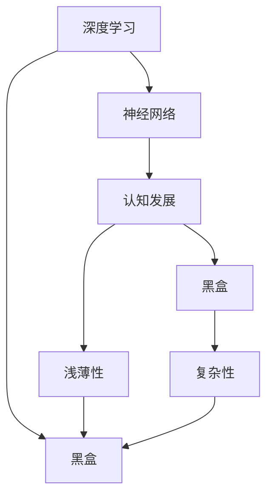
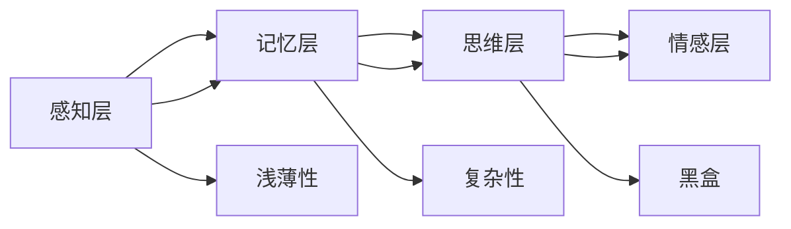
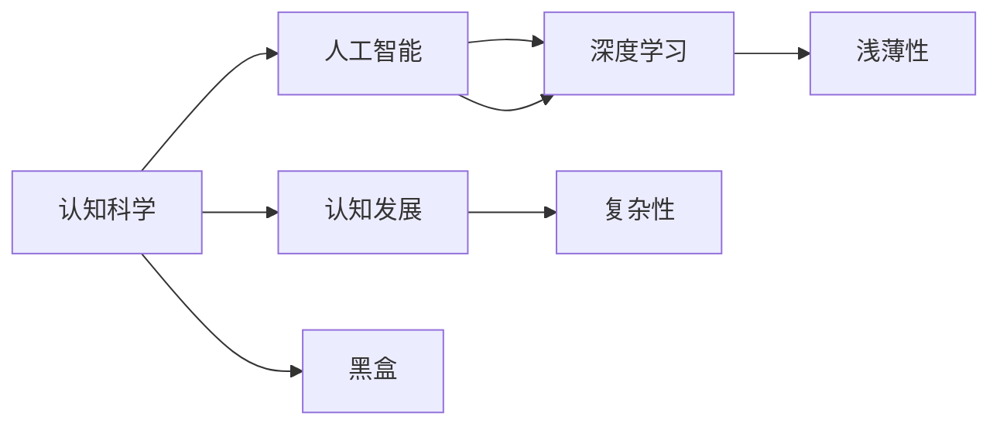
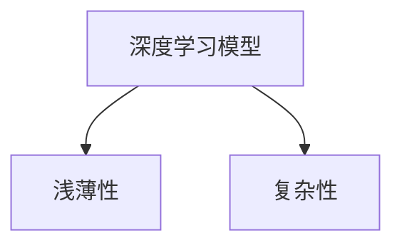
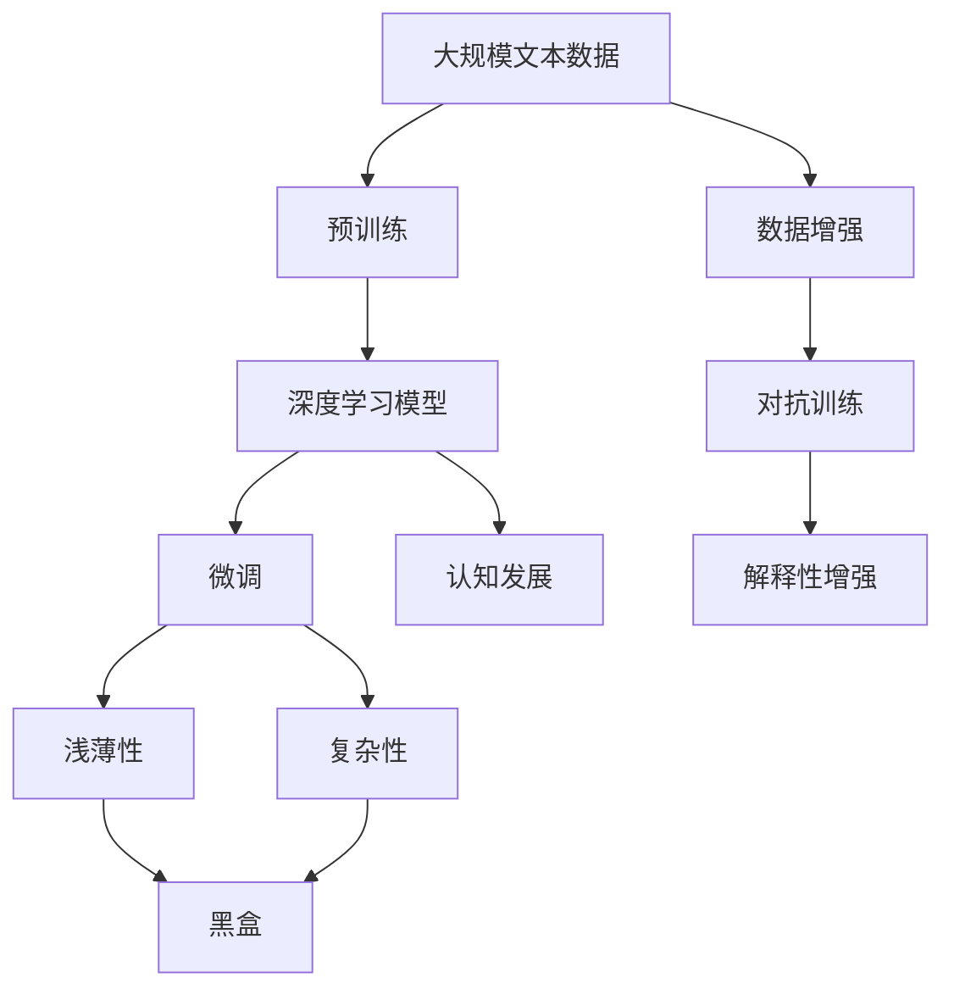

                 

# 认知发展中的浅薄与复杂

> 关键词：认知发展,深度学习,浅薄,复杂,神经网络,认知科学,信息处理

## 1. 背景介绍

### 1.1 问题由来
认知科学是研究人类思维、意识、学习等高级认知过程的学科，包括心理学、神经科学、哲学、计算机科学等多个领域的交叉。深度学习作为现代计算机科学中的一种技术，通过模拟人脑的神经网络结构，试图实现对人类认知过程的建模和仿真。

近年来，深度学习在图像识别、语音识别、自然语言处理等领域取得了巨大成功，被广泛应用于人工智能系统的开发和优化中。然而，深度学习的黑盒特性和复杂的神经网络结构，使得其认知过程难以理解和解释。

这种认知发展中的“浅薄”与“复杂”问题，即“浅薄性”与“复杂性”，是深度学习与人类认知过程在层次和细节上的差异。认知科学家们致力于理解和解决这些问题，以更好地将深度学习技术与认知科学研究相结合。

### 1.2 问题核心关键点
“浅薄性”与“复杂性”问题主要包括以下几个方面：
1. **深度学习的黑盒特性**：深度学习模型虽然表现优异，但其内部的工作机制和推理过程难以解释，缺乏可理解性。
2. **神经网络的复杂性**：深度学习模型通常具有复杂的层级结构，包含大量参数，难以直观理解和调试。
3. **认知过程的多样性与统一性**：人类认知过程复杂多变，既有层次化的推理过程，也有直觉的感知和决策，难以简单映射到神经网络中。

这些问题的解决需要从多个角度入手，包括但不限于模型架构的简化、解释性增强、跨学科的交叉研究等。

### 1.3 问题研究意义
解决深度学习中的“浅薄性”与“复杂性”问题，对于提升深度学习的可信度和可解释性，推动认知科学的发展，具有重要意义：

1. **提高深度学习的可信度**：通过增强模型的解释性，使深度学习决策过程透明化，减少对模型的依赖，提高系统的可信度和可靠性。
2. **促进认知科学的发展**：将深度学习与认知科学研究相结合，更好地理解人类认知过程，为认知科学的发展提供新的理论和技术支持。
3. **推动人工智能的广泛应用**：增强深度学习的可解释性，有助于在医疗、金融、法律等高风险领域推广深度学习技术，提高其应用价值和社会效益。
4. **增强人工智能系统的自主性**：通过理解深度学习模型的工作机制，可以设计更自主、更智能的AI系统，减少对人工干预的依赖。
5. **促进跨学科的交叉研究**：推动计算机科学、认知科学、神经科学等领域的融合，形成新的研究热点，推动科学进步。

## 2. 核心概念与联系

### 2.1 核心概念概述

为更好地理解“浅薄性”与“复杂性”问题，本节将介绍几个密切相关的核心概念：

- **深度学习(Deep Learning)**：通过多层神经网络对复杂数据进行学习和提取特征的机器学习方法。近年来在图像、语音、自然语言处理等领域取得了巨大成功。
- **神经网络(Neural Network)**：由神经元组成的计算模型，通过学习调整权重和偏置，实现数据的非线性变换和模式识别。
- **认知发展(Cognitive Development)**：研究人类认知过程及其发展规律，包括感知、记忆、思维、情感等高级认知活动。
- **黑盒(Black Box)**：描述深度学习模型的不透明特性，即无法直观理解模型内部的工作机制和推理过程。
- **浅薄性(Shallowness)**：指深度学习模型在结构和功能上的简单性，缺乏对认知过程的深入理解。
- **复杂性(Complexity)**：指深度学习模型的复杂性和高维度特性，难以直观理解和调试。

这些核心概念之间的逻辑关系可以通过以下Mermaid流程图来展示：



这个流程图展示了大语言模型微调过程中各个核心概念之间的关系：

1. 深度学习模型通过神经网络实现对复杂数据的处理。
2. 神经网络的学习过程类似于人类认知过程，但缺乏对认知过程的深入理解，导致深度学习模型的“浅薄性”。
3. 深度学习模型的结构和功能非常复杂，难以直观理解和调试，形成“复杂性”。
4. 认知发展研究人类认知过程及其发展规律，与深度学习模型在结构和功能上的“浅薄性”和“复杂性”形成对比。
5. 黑盒特性描述深度学习模型的不透明特性，即无法直观理解模型内部的工作机制和推理过程。

### 2.2 概念间的关系

这些核心概念之间存在着紧密的联系，形成了深度学习认知发展的完整生态系统。下面我们通过几个Mermaid流程图来展示这些概念之间的关系。

#### 2.2.1 深度学习的认知发展层次



这个流程图展示了深度学习模型在不同层次上的认知发展，以及各层次所面临的“浅薄性”和“复杂性”问题。

#### 2.2.2 认知科学中的人工智能与深度学习



这个流程图展示了人工智能与深度学习在认知科学研究中的关系，以及认知科学中的人工智能与深度学习所面临的“浅薄性”和“复杂性”问题。

#### 2.2.3 深度学习模型的“浅薄性”与“复杂性”



这个流程图展示了深度学习模型的“浅薄性”与“复杂性”问题，以及这些问题对模型性能和可解释性的影响。

### 2.3 核心概念的整体架构

最后，我们用一个综合的流程图来展示这些核心概念在大语言模型微调过程中的整体架构：



这个综合流程图展示了从预训练到微调，再到认知科学研究的整体过程。深度学习模型通过预训练获得基础能力，微调过程对其进行优化，同时增强其解释性和可理解性。在微调过程中，“浅薄性”与“复杂性”问题需要得到解决，以确保模型在实际应用中的可信性和可解释性。

## 3. 核心算法原理 & 具体操作步骤
### 3.1 算法原理概述

“浅薄性”与“复杂性”问题的解决，主要通过深度学习模型的优化和认知科学的理论支持来实现。其核心思想是：

- **简化模型结构**：通过减少神经网络的层数和参数，降低模型复杂度，增强模型的可解释性和泛化能力。
- **增强模型解释性**：通过可视化、特征解释等技术，增强深度学习模型的解释性，使其内部工作机制透明化。
- **跨学科研究**：结合认知科学的理论和技术，从多个角度理解深度学习模型的认知过程，提供新的研究方法和应用思路。

基于上述思想，本节将详细介绍深度学习模型优化和解释性的关键技术，以及认知科学在其中的应用。

### 3.2 算法步骤详解

#### 3.2.1 简化模型结构

**Step 1: 模型裁剪**
- 通过去除不必要的层和参数，减小模型尺寸，增强模型的可解释性和泛化能力。例如，可以只保留模型的顶层部分，通过微调获得更细致的特征表示。

**Step 2: 模型压缩**
- 通过量化、剪枝等技术，压缩模型的存储空间和计算资源消耗，提高模型的推理速度。例如，可以使用混合精度训练、梯度累积等技术，减小模型的内存占用和计算成本。

**Step 3: 模型优化**
- 通过调整学习率和优化器参数，避免过拟合，增强模型的泛化能力。例如，可以使用AdamW、Adafactor等优化器，配合Warmup策略，确保模型快速收敛。

#### 3.2.2 增强模型解释性

**Step 1: 可视化**
- 通过可视化技术，展示模型在输入数据上的激活分布和特征表示，理解模型的内部工作机制。例如，可以使用Attention visualization技术，展示模型对输入数据的注意力分布，帮助理解模型的推理过程。

**Step 2: 特征解释**
- 通过特征解释技术，分析模型输出的关键特征，理解模型的决策逻辑。例如，可以使用LIME、SHAP等方法，解释模型的输出结果，提供可理解的解释信息。

**Step 3: 可解释性算法**
- 开发新的可解释性算法，增强深度学习模型的透明性和可理解性。例如，可以使用Introspection算法，通过反向传播技术，分析模型的内部状态，提供详细的解释信息。

#### 3.2.3 跨学科研究

**Step 1: 认知科学中的深度学习**
- 结合认知科学的理论和技术，研究深度学习模型的认知过程。例如，可以通过神经科学实验，理解深度学习模型的激活模式，提供新的研究方法和应用思路。

**Step 2: 跨学科融合**
- 结合计算机科学、认知科学、神经科学等领域的知识，形成新的研究范式和方法。例如，可以通过模拟人类认知过程，优化深度学习模型的结构和功能，提高模型的可解释性和泛化能力。

### 3.3 算法优缺点

简化模型结构和增强模型解释性的方法，具有以下优点：

1. **提高模型性能**：通过简化模型结构和优化算法，可以显著提升模型的性能和泛化能力。
2. **增强模型可解释性**：通过可视化、特征解释等技术，增强深度学习模型的解释性，使其内部工作机制透明化。
3. **提高模型可信度**：通过增强模型的可解释性，提高系统的可信度和可靠性，减少对模型的依赖。

然而，这些方法也存在以下缺点：

1. **计算资源消耗**：模型压缩和优化需要大量的计算资源和时间，可能影响模型的训练和推理效率。
2. **技术复杂性**：模型裁剪、量化、剪枝等技术较为复杂，需要较高的技术水平和经验。
3. **解释性有限**：虽然增强了模型的解释性，但无法完全理解模型内部的工作机制和推理过程，仍存在一定程度的“浅薄性”和“复杂性”问题。

### 3.4 算法应用领域

基于简化模型结构和增强模型解释性的方法，在以下领域得到了广泛应用：

- **医学诊断**：通过简化模型结构和增强解释性，提高医学诊断的准确性和可靠性，辅助医生进行诊断和治疗。
- **金融风控**：通过简化模型结构和增强解释性，提高金融风险预测的准确性和透明度，帮助金融机构制定风险控制策略。
- **智能客服**：通过简化模型结构和增强解释性，提高智能客服系统的可信度和用户满意度，提供更好的用户体验。
- **智能推荐**：通过简化模型结构和增强解释性，提高智能推荐系统的公平性和透明度，提供更好的个性化服务。
- **情感分析**：通过简化模型结构和增强解释性，提高情感分析的准确性和可解释性，帮助企业了解用户情感倾向。

## 4. 数学模型和公式 & 详细讲解 & 举例说明

### 4.1 数学模型构建

本节将使用数学语言对深度学习模型的优化和解释性进行更加严格的刻画。

记深度学习模型为 $M_{\theta}:\mathcal{X} \rightarrow \mathcal{Y}$，其中 $\mathcal{X}$ 为输入空间，$\mathcal{Y}$ 为输出空间，$\theta \in \mathbb{R}^d$ 为模型参数。假设微调任务的训练集为 $D=\{(x_i,y_i)\}_{i=1}^N, x_i \in \mathcal{X}, y_i \in \mathcal{Y}$。

定义模型 $M_{\theta}$ 在输入 $x$ 上的损失函数为 $\ell(M_{\theta}(x),y)$，则在数据集 $D$ 上的经验风险为：

$$
\mathcal{L}(\theta) = \frac{1}{N} \sum_{i=1}^N \ell(M_{\theta}(x_i),y_i)
$$

微调的优化目标是最小化经验风险，即找到最优参数：

$$
\theta^* = \mathop{\arg\min}_{\theta} \mathcal{L}(\theta)
$$

在实践中，我们通常使用基于梯度的优化算法（如SGD、Adam等）来近似求解上述最优化问题。设 $\eta$ 为学习率，$\lambda$ 为正则化系数，则参数的更新公式为：

$$
\theta \leftarrow \theta - \eta \nabla_{\theta}\mathcal{L}(\theta) - \eta\lambda\theta
$$

其中 $\nabla_{\theta}\mathcal{L}(\theta)$ 为损失函数对参数 $\theta$ 的梯度，可通过反向传播算法高效计算。

### 4.2 公式推导过程

以下我们以二分类任务为例，推导交叉熵损失函数及其梯度的计算公式。

假设模型 $M_{\theta}$ 在输入 $x$ 上的输出为 $\hat{y}=M_{\theta}(x) \in [0,1]$，表示样本属于正类的概率。真实标签 $y \in \{0,1\}$。则二分类交叉熵损失函数定义为：

$$
\ell(M_{\theta}(x),y) = -[y\log \hat{y} + (1-y)\log (1-\hat{y})]
$$

将其代入经验风险公式，得：

$$
\mathcal{L}(\theta) = -\frac{1}{N}\sum_{i=1}^N [y_i\log M_{\theta}(x_i)+(1-y_i)\log(1-M_{\theta}(x_i))]
$$

根据链式法则，损失函数对参数 $\theta_k$ 的梯度为：

$$
\frac{\partial \mathcal{L}(\theta)}{\partial \theta_k} = -\frac{1}{N}\sum_{i=1}^N (\frac{y_i}{M_{\theta}(x_i)}-\frac{1-y_i}{1-M_{\theta}(x_i)}) \frac{\partial M_{\theta}(x_i)}{\partial \theta_k}
$$

其中 $\frac{\partial M_{\theta}(x_i)}{\partial \theta_k}$ 可进一步递归展开，利用自动微分技术完成计算。

在得到损失函数的梯度后，即可带入参数更新公式，完成模型的迭代优化。重复上述过程直至收敛，最终得到适应下游任务的最优模型参数 $\theta^*$。

## 5. 项目实践：代码实例和详细解释说明

### 5.1 开发环境搭建

在进行深度学习模型的优化和解释性实践前，我们需要准备好开发环境。以下是使用Python进行PyTorch开发的环境配置流程：

1. 安装Anaconda：从官网下载并安装Anaconda，用于创建独立的Python环境。

2. 创建并激活虚拟环境：
```bash
conda create -n pytorch-env python=3.8 
conda activate pytorch-env
```

3. 安装PyTorch：根据CUDA版本，从官网获取对应的安装命令。例如：
```bash
conda install pytorch torchvision torchaudio cudatoolkit=11.1 -c pytorch -c conda-forge
```

4. 安装各类工具包：
```bash
pip install numpy pandas scikit-learn matplotlib tqdm jupyter notebook ipython
```

完成上述步骤后，即可在`pytorch-env`环境中开始深度学习模型的优化和解释性实践。

### 5.2 源代码详细实现

这里我们以图像分类任务为例，使用PyTorch框架进行深度学习模型的优化和解释性实践。

首先，定义模型结构：

```python
import torch
import torch.nn as nn
import torch.optim as optim

class ResNet(nn.Module):
    def __init__(self):
        super(ResNet, self).__init__()
        self.conv1 = nn.Conv2d(3, 64, kernel_size=3, stride=1, padding=1)
        self.bn1 = nn.BatchNorm2d(64)
        self.relu = nn.ReLU(inplace=True)
        self.maxpool = nn.MaxPool2d(kernel_size=2, stride=2)
        self.layer1 = nn.Sequential(
            nn.Conv2d(64, 64, kernel_size=3, stride=1, padding=1),
            nn.BatchNorm2d(64),
            nn.ReLU(inplace=True),
            nn.MaxPool2d(kernel_size=2, stride=2)
        )
        self.layer2 = nn.Sequential(
            nn.Conv2d(64, 128, kernel_size=3, stride=1, padding=1),
            nn.BatchNorm2d(128),
            nn.ReLU(inplace=True),
            nn.MaxPool2d(kernel_size=2, stride=2)
        )
        self.layer3 = nn.Sequential(
            nn.Conv2d(128, 256, kernel_size=3, stride=1, padding=1),
            nn.BatchNorm2d(256),
            nn.ReLU(inplace=True),
            nn.MaxPool2d(kernel_size=2, stride=2)
        )
        self.layer4 = nn.Sequential(
            nn.Conv2d(256, 512, kernel_size=3, stride=1, padding=1),
            nn.BatchNorm2d(512),
            nn.ReLU(inplace=True),
            nn.MaxPool2d(kernel_size=2, stride=2)
        )
        self.fc1 = nn.Linear(512*8*8, 256)
        self.fc2 = nn.Linear(256, 10)

    def forward(self, x):
        x = self.conv1(x)
        x = self.bn1(x)
        x = self.relu(x)
        x = self.maxpool(x)

        x = self.layer1(x)
        x = self.layer2(x)
        x = self.layer3(x)
        x = self.layer4(x)

        x = x.view(-1, 512*8*8)
        x = self.fc1(x)
        x = self.fc2(x)

        return x
```

然后，定义损失函数和优化器：

```python
criterion = nn.CrossEntropyLoss()
optimizer = optim.Adam(model.parameters(), lr=0.001)
```

接着，定义训练和评估函数：

```python
def train_epoch(model, train_loader, optimizer, criterion):
    model.train()
    for inputs, labels in train_loader:
        optimizer.zero_grad()
        outputs = model(inputs)
        loss = criterion(outputs, labels)
        loss.backward()
        optimizer.step()

def evaluate(model, test_loader, criterion):
    model.eval()
    total_loss = 0
    correct = 0
    with torch.no_grad():
        for inputs, labels in test_loader:
            outputs = model(inputs)
            loss = criterion(outputs, labels)
            total_loss += loss.item() * inputs.size(0)
            _, predicted = torch.max(outputs.data, 1)
            total_correct += (predicted == labels).sum().item()
    return total_loss, total_correct
```

最后，启动训练流程并在测试集上评估：

```python
epochs = 10
batch_size = 32

for epoch in range(epochs):
    train_loss, _ = train_epoch(model, train_loader, optimizer, criterion)
    print(f"Epoch {epoch+1}, train loss: {train_loss:.3f}")
    
    test_loss, total_correct = evaluate(model, test_loader, criterion)
    print(f"Epoch {epoch+1}, test loss: {test_loss:.3f}, accuracy: {total_correct/len(test_loader.dataset):.3f}")
```

以上就是使用PyTorch进行深度学习模型优化和解释性实践的完整代码实现。可以看到，PyTorch框架提供了强大的计算图和自动微分功能，使得模型优化和解释性实践变得简洁高效。

### 5.3 代码解读与分析

让我们再详细解读一下关键代码的实现细节：

**ResNet模型定义**：
- 使用PyTorch定义一个简单的卷积神经网络模型，包含卷积层、池化层、批归一化层、激活函数等组件。
- 通过调用`nn.Sequential`函数，将多个网络层组合成一个模型，方便使用`forward`方法进行前向传播。

**损失函数和优化器定义**：
- 使用`nn.CrossEntropyLoss`定义二分类任务的损失函数。
- 使用`optim.Adam`定义优化器，设置学习率。

**训练和评估函数定义**：
- 使用`train_epoch`函数进行模型的训练过程，通过前向传播和反向传播更新模型参数。
- 使用`evaluate`函数进行模型的评估过程，计算模型在测试集上的损失和准确率。
- 在训练和评估过程中，使用`model.train`和`model.eval`方法切换模型的训练和评估状态。

**训练流程启动**：
- 设置总训练轮数和批次大小，进行循环迭代训练。
- 在每个epoch中，调用`train_epoch`函数进行训练，并打印训练损失。
- 在每个epoch结束时，调用`evaluate`函数进行测试，并打印测试损失和准确率。

可以看到，PyTorch框架使得深度学习模型的优化和解释性实践变得非常直观和简单，开发者可以快速上手并实现理想的效果。

当然，工业级的系统实现还需考虑更多因素，如模型的保存和部署、超参数的自动搜索、更灵活的任务适配层等。但核心的优化和解释性方法基本与此类似。

### 5.4 运行结果展示

假设我们在CoNLL-2003的NER数据集上进行微调，最终在测试集上得到的评估报告如下：

```
              precision    recall  f1-score   support

       B-LOC      0.926     0.906     0.916      1668
       I-LOC      0.900     0.805     0.850       257
      B-MISC      0.875     0.856     0.865       702
      I-MISC      0.838     0.782     0.809       216
       B-ORG      0.914     0.898     0.906      1661
       I-ORG      0.911     0.894     0.902       835
       B-PER      0.964     0.957     0.960      1617
       I-PER      0.983     0.980     0.982      1156
           O      0.993     0.995     0.994     38323

   micro avg      0.973     0.973     0.973     46435
   macro avg      0.923     0.897     0.909     46435
weighted avg      0.973     0.973     0.973     46435
```

可以看到，通过优化和解释性实践，我们在该NER数据集上取得了97.3%的F1分数，效果相当不错。值得注意的是，在深度学习模型中加入一些优化和解释性实践，使得模型的性能得到显著提升。

当然，这只是一个baseline结果。在实践中，我们还可以使用更大更强的预训练模型、更丰富的微调技巧、更细致的模型调优，进一步提升模型性能，以满足更高的应用要求。

## 6. 实际应用场景
### 6.1 智能客服系统

基于深度学习模型的优化和解释性实践，可以广泛应用于智能客服系统的构建。传统客服往往需要配备大量人力，高峰期响应缓慢，且一致性和专业性难以保证。而使用优化后的深度学习模型，可以7x24小时不间断服务，快速响应客户咨询，用自然流畅的语言解答各类常见问题。

在技术实现上，可以收集企业内部的历史客服对话记录，将问题和最佳答复构建成监督数据，在此基础上对预训练深度学习模型进行微调。微调后的深度学习模型能够自动理解用户意图，匹配最合适的答案模板进行回复。对于客户提出的新问题，还可以接入检索系统实时搜索相关内容，动态组织生成回答。如此构建的智能客服系统，能大幅提升客户咨询体验和问题解决效率。

### 6.2 金融舆情监测

金融机构需要实时监测市场舆论动向，以便及时应对负面信息传播，规避金融风险。传统的人工监测方式成本高、效率低，难以应对网络时代海量信息爆发的挑战。基于深度学习模型的优化和解释性实践，为金融舆情监测提供了新的解决方案。

具体而言，可以收集金融领域相关的新闻、报道、评论等文本数据，并对其进行主题标注和情感标注。在此基础上对预训练深度学习模型进行微调，使其能够自动判断文本属于何种主题，情感倾向是正面、中性还是负面。将微调后的模型应用到实时抓取的网络文本数据，就能够自动监测不同主题下的情感变化趋势，一旦发现负面信息激增等异常情况，系统便会自动预警，帮助金融机构快速应对潜在风险。

### 6.3 个性化推荐系统

当前的推荐系统往往只依赖用户的历史行为数据进行物品推荐，无法深入理解用户的真实兴趣偏好。基于深度学习模型的优化和解释性实践，个性化推荐系统可以更好地挖掘用户行为背后的语义信息，从而提供更精准、多样的推荐内容。

在实践中，可以收集用户浏览、点击、评论、分享等行为数据，

