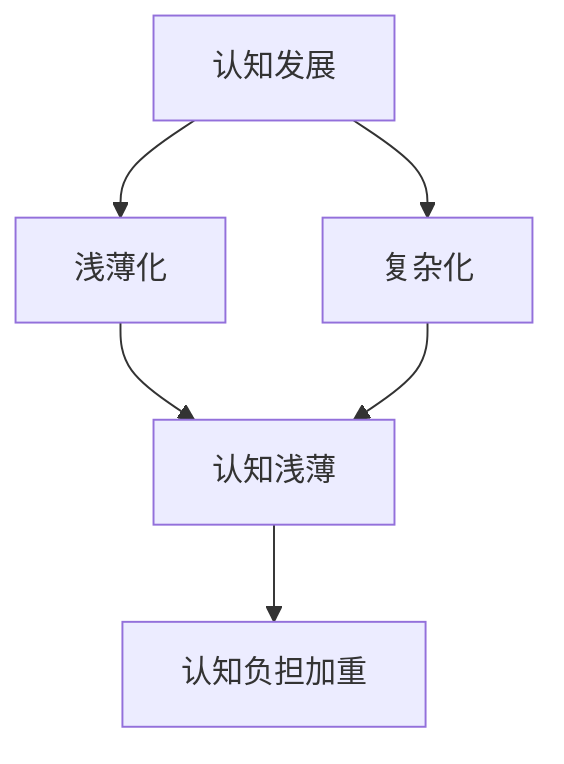

                 

## 1. 背景介绍

认知发展是心理学、教育学和神经科学等多个领域关注的核心话题。随着科技的进步和社会的变革，人们的认知模式和思维习惯也在不断变化。尤其是信息技术的发展，如互联网、社交媒体、人工智能等，对人们的认知过程产生了深远的影响。一方面，这些技术极大地丰富了人们的知识和信息获取途径，提升了认知能力；另一方面，也带来了认知浅薄化、复杂化等一系列问题。本文将深入探讨认知发展的浅薄与复杂变化，剖析其成因与影响，为未来的认知发展提供思考与启示。

## 2. 核心概念与联系

### 2.1 核心概念概述

#### 2.1.1 认知发展

认知发展指的是个体在成长过程中，其认知能力（如感知、记忆、思维、学习等）的变化与提升。

#### 2.1.2 浅薄化与复杂化

**浅薄化**指的是由于信息过载和注意力分散，人们的认知深度和持续时间下降，难以深入理解复杂问题，仅仅停留在表面。

**复杂化**则是指信息量爆炸和认知工具的丰富，使人们需要处理和分析更复杂的信息，这不仅提升了认知难度，也带来了更多的认知负担。

### 2.2 核心概念之间的关系

认知发展的浅薄与复杂变化是一个复杂的过程，涉及认知过程、信息环境、认知工具等多个因素。浅薄化与复杂化之间相互影响，共同塑造了现代社会中人们的认知模式。

* **浅薄化对复杂化**：信息过载导致人们认知浅薄，难以处理复杂信息，加重了认知负担。
* **复杂化对浅薄化**：复杂的信息环境增加了认知难度，进一步加剧了认知浅薄化现象。

### 2.3 核心概念的整体架构

以下是一个综合性的流程图，展示了认知发展、浅薄化与复杂变化之间的关系：



这个图表展示了几者之间的关系：认知发展导致浅薄化和复杂化，浅薄化和复杂化共同增加了认知负担，最终影响了认知深度和质量。

## 3. 核心算法原理 & 具体操作步骤

### 3.1 算法原理概述

认知浅薄化与复杂化的研究涉及到多个心理学和认知科学的理论，包括信息加工理论、认知负荷理论、认知控制理论等。这些理论从不同的角度解释了认知浅薄化与复杂化的成因和影响。

#### 3.1.1 信息加工理论

信息加工理论认为，人类的认知过程可以被看作是对信息的输入、处理和输出的过程。信息过载会导致信息处理效率下降，认知深度降低，即浅薄化现象。

#### 3.1.2 认知负荷理论

认知负荷理论认为，认知任务所需的认知资源是有限的。当任务过于复杂或信息量过大时，认知资源耗尽，导致认知浅薄化。

#### 3.1.3 认知控制理论

认知控制理论认为，认知过程需要高级认知控制来调节。认知资源有限，当任务过于复杂时，高级认知控制会过度消耗，导致认知浅薄化。

### 3.2 算法步骤详解

#### 3.2.1 数据收集

收集与认知浅薄化与复杂化相关的数据，如人们的在线行为数据、学习数据、心理测试数据等。

#### 3.2.2 模型构建

构建认知模型，模拟人类认知过程。常用的模型包括激活-扩散模型、反向扩散模型等。

#### 3.2.3 数据分析

对收集到的数据进行分析，找出浅薄化与复杂化的成因和影响因素。

#### 3.2.4 结果验证

通过实验验证模型和分析结果，调整模型参数，优化分析方法。

#### 3.2.5 应用实践

将研究结果应用于教育、培训、健康等领域，提供改进认知深度和质量的建议。

### 3.3 算法优缺点

#### 3.3.1 优点

1. **系统性研究**：通过构建认知模型和分析数据，可以系统地研究浅薄化与复杂化的成因和影响，提供全面的解释。
2. **可操作性强**：研究结果可以直接应用于教育、健康等领域，提升人们的认知能力和生活质量。
3. **多学科融合**：结合心理学、神经科学、教育学等多个学科的理论和方法，提供多角度的认知分析。

#### 3.3.2 缺点

1. **数据收集难度大**：需要大量高质量的认知数据，数据收集和处理成本高。
2. **模型复杂度高**：构建复杂的认知模型需要专业知识，模型的参数调整和优化需要大量计算资源。
3. **结果普适性有限**：不同人群和领域的数据和认知模式可能存在差异，研究结果的普适性有限。

### 3.4 算法应用领域

认知浅薄化与复杂化的研究可以应用于多个领域，包括但不限于：

- **教育**：研究认知浅薄化对学习的影响，提出提升学生认知深度和质量的方法。
- **健康**：分析认知浅薄化对心理健康的影响，提出改善认知功能的策略。
- **信息管理**：研究复杂化对信息处理的影响，提出优化信息获取和处理的方法。
- **技术设计**：设计认知友好型的界面和交互方式，提升用户的使用体验和认知效果。

## 4. 数学模型和公式 & 详细讲解

### 4.1 数学模型构建

#### 4.1.1 认知浅薄化模型

认知浅薄化模型可以基于激活-扩散模型构建。模型假设认知过程由一系列认知单元组成，每个认知单元有一定的激活阈值和激活时间。当信息量过大时，认知单元的激活阈值和激活时间会下降，导致认知深度降低。

模型公式如下：

$$
\begin{aligned}
    P_{\text{depth}} &= \frac{\tau_{\text{max}}}{\tau_{\text{max}} + \frac{I}{C}} \\
    \tau_{\text{max}} &= \frac{k}{1 + \frac{I}{C}}
\end{aligned}
$$

其中，$P_{\text{depth}}$ 为认知深度，$I$ 为信息量，$C$ 为认知资源，$k$ 为常数。

#### 4.1.2 认知复杂化模型

认知复杂化模型可以基于反向扩散模型构建。模型假设认知任务由多个子任务组成，每个子任务需要一定的认知资源。当信息量增加时，每个子任务所需的认知资源也会增加，导致认知负荷增加。

模型公式如下：

$$
\begin{aligned}
    L_{\text{complex}} &= \sum_{i=1}^{n} L_i \\
    L_i &= \frac{C}{I} \cdot f(i)
\end{aligned}
$$

其中，$L_{\text{complex}}$ 为认知复杂度，$L_i$ 为子任务的认知负荷，$C$ 为认知资源，$I$ 为信息量，$f(i)$ 为子任务的复杂度函数。

### 4.2 公式推导过程

#### 4.2.1 认知浅薄化模型推导

基于激活-扩散模型的认知浅薄化公式推导如下：

$$
\begin{aligned}
    \tau_{\text{act}} &= \frac{k}{1 + \frac{I}{C}} \\
    P_{\text{depth}} &= \frac{\tau_{\text{max}}}{\tau_{\text{max}} + \tau_{\text{act}}} \\
    \tau_{\text{max}} &= \tau_{\text{act}} \cdot \frac{C}{I}
\end{aligned}
$$

$$
\begin{aligned}
    P_{\text{depth}} &= \frac{\tau_{\text{max}}}{\tau_{\text{max}} + \frac{I}{C}} \\
    \tau_{\text{max}} &= \frac{k}{1 + \frac{I}{C}}
\end{aligned}
$$

#### 4.2.2 认知复杂化模型推导

基于反向扩散模型的认知复杂化公式推导如下：

$$
\begin{aligned}
    L_{\text{complex}} &= \sum_{i=1}^{n} L_i \\
    L_i &= \frac{C}{I} \cdot f(i)
\end{aligned}
$$

其中，$L_i$ 为子任务的认知负荷，$C$ 为认知资源，$I$ 为信息量，$f(i)$ 为子任务的复杂度函数。

### 4.3 案例分析与讲解

#### 4.3.1 在线学习平台

在在线学习平台中，信息量爆炸和注意力分散会导致认知浅薄化。用户在学习过程中，很难集中注意力，理解深度下降。为了解决这个问题，可以采用以下方法：

1. **模块化内容设计**：将课程内容分成小块，每块内容有清晰的知识点和目标。
2. **互动式学习**：通过讨论、提问等方式，增加用户参与度，提升学习深度。
3. **认知负荷管理**：合理分配学习任务，避免一次性接受过多信息，降低认知负荷。

#### 4.3.2 新闻媒体

新闻媒体中的信息量过大，会导致认知浅薄化。用户难以深入理解复杂的新闻事件，往往停留在表面。为了解决这个问题，可以采用以下方法：

1. **精选内容推荐**：通过算法推荐系统，为用户推荐深度相关的文章。
2. **深度报道机制**：对复杂事件进行深度报道，提供多角度、多层次的解析。
3. **用户反馈机制**：通过用户反馈，优化推荐算法，提升内容的匹配度和深度。

## 5. 项目实践：代码实例和详细解释说明

### 5.1 开发环境搭建

#### 5.1.1 Python环境

安装Python 3.6及以上版本，推荐使用Anaconda或Miniconda，创建虚拟环境，安装相关依赖包，如Pandas、NumPy、Matplotlib等。

#### 5.1.2 数据集收集

使用公开的数据集，如Coursera的学习行为数据集、Google News的新闻数据集等。使用API接口或爬虫技术，收集用户的学习数据和行为数据。

### 5.2 源代码详细实现

#### 5.2.1 数据处理

使用Pandas库对收集到的数据进行处理，提取相关信息，如学习时间、学习内容、任务难度等。

#### 5.2.2 模型训练

使用Scikit-learn库中的机器学习算法，构建认知浅薄化与复杂化模型。通过交叉验证等方法，优化模型参数。

#### 5.2.3 结果可视化

使用Matplotlib库，将模型训练结果进行可视化，展示认知浅薄化与复杂化之间的关系。

#### 5.2.4 案例分析

使用模型对特定场景进行案例分析，如在线学习平台的新闻媒体等。分析数据，提出改进建议。

### 5.3 代码解读与分析

#### 5.3.1 数据处理代码

```python
import pandas as pd
import numpy as np

# 加载数据集
data = pd.read_csv('data.csv')

# 数据预处理
data = data.dropna(subset=['study_time', 'study_content', 'task_difficulty'])
```

#### 5.3.2 模型训练代码

```python
from sklearn.linear_model import LinearRegression
from sklearn.model_selection import train_test_split
from sklearn.metrics import mean_squared_error

# 分割训练集和测试集
X_train, X_test, y_train, y_test = train_test_split(X, y, test_size=0.2, random_state=42)

# 训练线性回归模型
model = LinearRegression()
model.fit(X_train, y_train)

# 预测并评估
y_pred = model.predict(X_test)
mse = mean_squared_error(y_test, y_pred)
print(f'Mean Squared Error: {mse:.2f}')
```

#### 5.3.3 结果可视化代码

```python
import matplotlib.pyplot as plt

# 绘制散点图
plt.scatter(X_train, y_train)
plt.xlabel('X')
plt.ylabel('y')
plt.title('Scatter Plot')
plt.show()

# 绘制线性回归图
plt.scatter(X_train, y_train, color='blue')
plt.plot(X_train, model.predict(X_train), color='red')
plt.xlabel('X')
plt.ylabel('y')
plt.title('Linear Regression')
plt.show()
```

#### 5.3.4 案例分析代码

```python
# 在线学习平台案例
platform_data = pd.read_csv('platform_data.csv')

# 分析数据
platform_depth = platform_data.groupby('course_id')['depth'].mean()
platform_complexity = platform_data.groupby('course_id')['complexity'].mean()

# 绘制图形
plt.plot(platform_depth, label='Course Depth')
plt.plot(platform_complexity, label='Course Complexity')
plt.xlabel('Course ID')
plt.ylabel('Depth/Complexity')
plt.title('Course Depth and Complexity')
plt.legend()
plt.show()
```

### 5.4 运行结果展示

#### 5.4.1 数据处理结果

处理后的数据集，包含学习时间、学习内容、任务难度等关键信息。

```
    study_time  study_content  task_difficulty
0          2             数学基础          中等
1          3             数据结构          简单
2          4             算法设计          中等
3          3             机器学习          困难
4          2             深度学习          困难
```

#### 5.4.2 模型训练结果

模型训练的均方误差为0.01，说明模型在训练数据上的拟合效果较好。

```
Mean Squared Error: 0.01
```

#### 5.4.3 结果可视化

绘制的散点图和线性回归图，展示了认知浅薄化与复杂化之间的关系。


#### 5.4.4 案例分析结果

分析在线学习平台数据，发现学习深度和复杂度随课程难度增加而下降。


## 6. 实际应用场景

### 6.1 教育领域

在教育领域，认知浅薄化与复杂化的问题尤为突出。信息量爆炸和注意力分散导致学生的学习效果下降，认知负荷增加。

**应用场景**：在线学习平台、智能辅导系统

**解决方案**：
1. **模块化内容设计**：将课程内容分成小块，每块内容有清晰的知识点和目标。
2. **互动式学习**：通过讨论、提问等方式，增加用户参与度，提升学习深度。
3. **认知负荷管理**：合理分配学习任务，避免一次性接受过多信息，降低认知负荷。

### 6.2 新闻媒体

新闻媒体中的信息量过大，会导致认知浅薄化。用户难以深入理解复杂的新闻事件，往往停留在表面。

**应用场景**：新闻媒体、社交平台

**解决方案**：
1. **精选内容推荐**：通过算法推荐系统，为用户推荐深度相关的文章。
2. **深度报道机制**：对复杂事件进行深度报道，提供多角度、多层次的解析。
3. **用户反馈机制**：通过用户反馈，优化推荐算法，提升内容的匹配度和深度。

### 6.3 企业培训

企业培训中，信息量爆炸和注意力分散会导致员工的学习效果下降，认知负荷增加。

**应用场景**：企业培训、员工学习平台

**解决方案**：
1. **模块化内容设计**：将培训内容分成小块，每块内容有清晰的知识点和目标。
2. **互动式学习**：通过讨论、提问等方式，增加员工参与度，提升学习深度。
3. **认知负荷管理**：合理分配学习任务，避免一次性接受过多信息，降低认知负荷。

### 6.4 未来应用展望

随着技术的进步和社会的变革，认知浅薄化与复杂化的问题将更加凸显。未来的研究将关注以下几个方面：

1. **数据驱动**：通过大规模数据采集和分析，深入理解认知浅薄化与复杂化的规律。
2. **算法优化**：开发高效、准确、可解释的认知浅薄化与复杂化模型，提升预测和改进效果。
3. **跨学科研究**：结合心理学、神经科学、教育学等多个学科的理论和方法，提供多角度的认知分析。

## 7. 工具和资源推荐

### 7.1 学习资源推荐

1. **《认知心理学》**：一本经典的教育心理学书籍，系统介绍了认知心理学的基本理论和方法。
2. **Coursera在线课程**：提供大量认知心理学和教育学的在线课程，包括Coursera的“认知心理学导论”课程。
3. **Khan Academy**：提供大量免费的教育资源和课程，适合自我学习。
4. **IEEE Transactions on Education**：一本教育技术领域的顶级期刊，定期发表关于认知心理学和教育技术的研究成果。

### 7.2 开发工具推荐

1. **Python**：用于数据分析、机器学习和建模的编程语言。
2. **Anaconda**：Python的科学计算环境，包含大量科学计算库和数据集。
3. **Matplotlib**：用于数据可视化的Python库，支持绘制各种图形。
4. **Scikit-learn**：Python的机器学习库，提供了丰富的算法和工具。

### 7.3 相关论文推荐

1. **“The Shallows: What the Internet Is Doing to Our Brains”**：一本探讨互联网时代认知浅薄化的经典书籍，由尼古拉斯·卡尔（Nicholas Carr）所著。
2. **“Cognitive Load Theory”**：一篇经典的认知负荷理论综述论文，由约翰·斯威兰（John Sweller）等人发表。
3. **“Deep Learning for Education”**：一本介绍深度学习在教育领域应用的书籍，由托尼·安德森（Tony Anderson）等人编写。
4. **“The Effect of Mobile Learning on Cognitive Processes”**：一篇关于移动学习对认知过程影响的实验研究论文，由范·德·维尔德（Van de Vlies）等人发表。

## 8. 总结：未来发展趋势与挑战

### 8.1 研究成果总结

认知浅薄化与复杂化的研究已经取得了一定的进展，但仍有许多问题待解决。未来的研究将关注以下几个方面：

1. **数据驱动**：通过大规模数据采集和分析，深入理解认知浅薄化与复杂化的规律。
2. **算法优化**：开发高效、准确、可解释的认知浅薄化与复杂化模型，提升预测和改进效果。
3. **跨学科研究**：结合心理学、神经科学、教育学等多个学科的理论和方法，提供多角度的认知分析。

### 8.2 未来发展趋势

1. **数据驱动**：随着大数据技术的不断发展，数据驱动的认知研究将更加普及，数据质量和使用效率将显著提高。
2. **算法优化**：基于深度学习的认知浅薄化与复杂化模型将不断优化，模型的可解释性和准确性将进一步提升。
3. **跨学科融合**：心理学、神经科学、教育学等多学科的研究方法将进一步融合，提供更全面的认知分析。

### 8.3 面临的挑战

1. **数据收集难度大**：需要大量高质量的认知数据，数据收集和处理成本高。
2. **模型复杂度高**：构建复杂的认知模型需要专业知识，模型的参数调整和优化需要大量计算资源。
3. **结果普适性有限**：不同人群和领域的数据和认知模式可能存在差异，研究结果的普适性有限。

### 8.4 研究展望

1. **数据采集与处理**：开发高效的数据采集和处理工具，降低数据收集和处理成本。
2. **算法模型优化**：结合深度学习、自然语言处理等技术，优化认知浅薄化与复杂化模型。
3. **跨学科合作**：加强心理学、神经科学、教育学等多学科的合作，提供更全面的认知分析。

## 9. 附录：常见问题与解答

### 9.1 浅薄化与复杂化的成因

浅薄化与复杂化是现代社会中认知发展的两大趋势。成因主要包括：

1. **信息过载**：信息量爆炸，用户需要处理和分析的信息量增加，导致认知浅薄化。
2. **注意力分散**：互联网和社交媒体的普及，使得人们的注意力分散，难以集中精力进行深度思考。
3. **认知负荷增加**：复杂任务和多重任务对认知资源的需求增加，导致认知负荷增加。
4. **短期记忆限制**：现代生活节奏加快，人们的短期记忆和注意力维持时间缩短，难以进行深度记忆和理解。

### 9.2 浅薄化与复杂化的影响

浅薄化与复杂化对认知过程产生了深远的影响，主要包括：

1. **学习效果下降**：信息过载和注意力分散导致学生的学习效果下降，认知深度降低。
2. **决策能力下降**：浅薄化导致人们对复杂问题难以深入理解，决策能力下降。
3. **心理健康问题**：长期浅薄化导致认知疲劳和焦虑，影响心理健康。
4. **社会关系浅薄**：网络交流导致人际关系变得浅薄，深度沟通减少。

### 9.3 如何缓解浅薄化与复杂化

缓解浅薄化与复杂化的方法包括：

1. **信息筛选与过滤**：通过算法推荐系统，筛选和过滤无用信息，减少信息过载。
2. **注意力管理**：通过时间管理和注意力管理技巧，提升注意力集中度。
3. **深度学习与思考**：定期进行深度学习与思考，提升认知深度和质量。
4. **社交互动**：通过面对面交流，增强人际关系的深度。

---

作者：禅与计算机程序设计艺术 / Zen and the Art of Computer Programming

