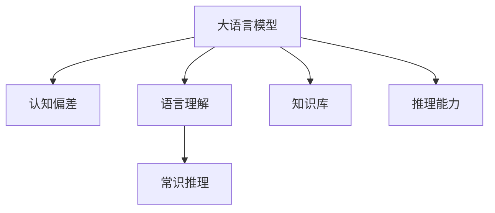
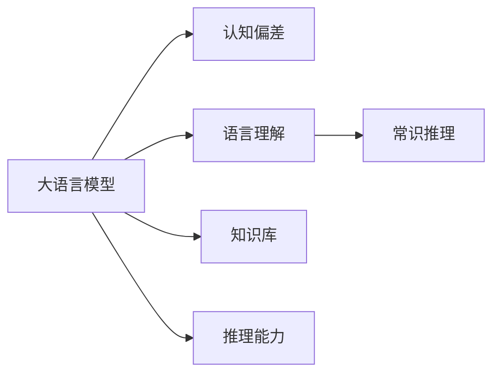
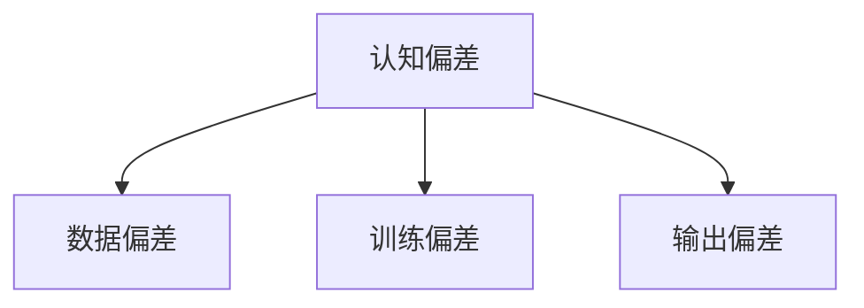
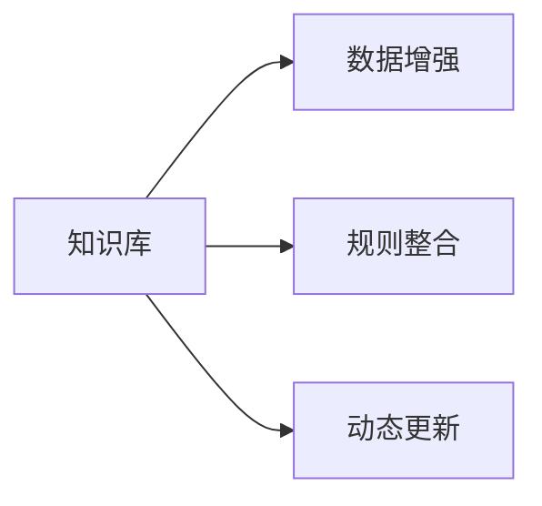
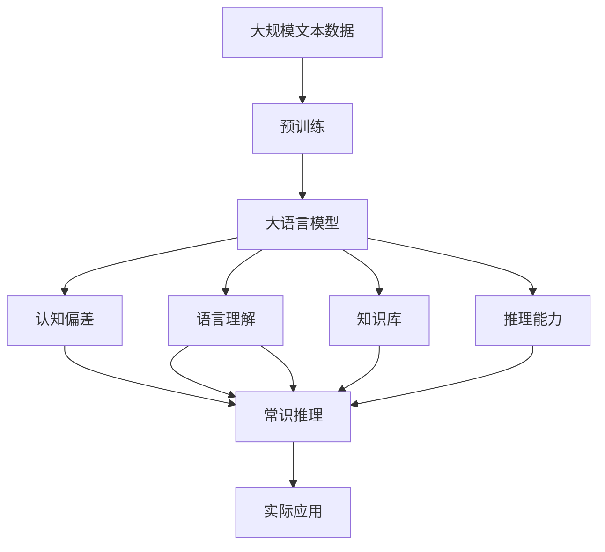

                 

# 语言≠思维：大模型的认知障碍

> 关键词：大语言模型,认知障碍,认知偏差,语言理解,自然语言处理(NLP),深度学习

## 1. 背景介绍

### 1.1 问题由来
近年来，人工智能技术在自然语言处理(Natural Language Processing, NLP)领域取得了突破性进展。特别是基于大语言模型的大规模预训练技术，显著提升了模型的语言理解和生成能力。这些模型，如GPT-3、BERT等，已经被广泛应用于机器翻译、对话系统、文本摘要等诸多任务中，取得了令人瞩目的成果。然而，尽管这些模型在形式上能够生成丰富的文本，但在实际应用中，我们发现它们仍然存在一些认知上的障碍，无法真正理解语言背后的含义。

### 1.2 问题核心关键点
当前大语言模型的认知障碍主要体现在以下几个方面：

- 认知偏差：模型容易受到输入数据中的偏见和偏差影响，导致输出结果存在刻板印象和歧视。
- 语言理解能力不足：模型对语言中的语义关系、指代关系等复杂概念理解不全面，无法准确把握语言的真正含义。
- 常识推理能力弱：模型在面对一些常识推理问题时，常常给出错误的答案，缺乏真正的逻辑判断能力。
- 知识局限性：模型无法有效整合外部知识库中的常识和规则，表现出明显的知识局限性。
- 推理能力不足：模型无法处理动态变化的场景，无法进行有效的推理和演绎。

这些认知障碍导致大语言模型在实际应用中，难以像人类一样灵活、智能地处理复杂语言任务，严重限制了其潜力的发挥。因此，深入研究和解决这些认知障碍，对于提升大语言模型的性能和应用价值具有重要意义。

### 1.3 问题研究意义
研究大语言模型的认知障碍，不仅有助于提升模型的实际应用能力，还能为人类认知智能的研究提供新的视角和方法。具体而言，意义如下：

1. **提升应用效果**：通过识别和修正模型的认知偏差，避免模型输出偏见和歧视，提高模型的鲁棒性和公正性。
2. **增强语言理解**：改善模型对语言背后含义的把握，使模型在复杂语境下能更好地理解语言的真正意图。
3. **提高推理能力**：通过引入更多先验知识，提升模型的常识推理和逻辑判断能力，使其能够处理更多动态变化的问题。
4. **突破知识局限**：通过整合更多外部知识，增强模型的知识整合能力，使其能够应对更广泛的应用场景。
5. **推动人工智能发展**：大语言模型的认知障碍研究将推动整个人工智能领域的进步，特别是提高人类认知智能的模拟水平。

## 2. 核心概念与联系

### 2.1 核心概念概述

为更好地理解大语言模型的认知障碍，本节将介绍几个关键概念：

- 大语言模型(Large Language Model, LLM)：如GPT-3、BERT等，基于大规模无标签文本数据进行预训练的语言模型。
- 认知偏差(Cognitive Bias)：指模型在处理数据时受到个人或社会因素影响，导致输出结果存在系统性偏差。
- 语言理解(Language Understanding)：指模型对自然语言的理解和解析，包括词语、句子的语义、语法等。
- 常识推理(Commonsense Reasoning)：指模型在面对常识性问题时，能够利用常识知识和逻辑进行推理和判断。
- 知识库(Knowledge Base)：指外部知识库中的常识、规则等信息，可用于指导模型的决策过程。
- 推理能力(Reasoning Ability)：指模型能够进行逻辑推演和动态处理的能力。

这些核心概念之间的逻辑关系可以通过以下Mermaid流程图来展示：



这个流程图展示了大语言模型的核心概念及其之间的关系：

1. 大语言模型通过预训练获得基础能力。
2. 认知偏差影响模型的输出结果，导致偏见和歧视。
3. 语言理解能力决定模型对语言的理解深度。
4. 常识推理能力影响模型处理常识性问题的准确性。
5. 知识库提供外部知识，辅助模型进行决策。
6. 推理能力决定模型处理动态变化的能力。

### 2.2 概念间的关系

这些核心概念之间存在着紧密的联系，形成了大语言模型的认知体系。下面我们通过几个Mermaid流程图来展示这些概念之间的关系。

#### 2.2.1 大语言模型的认知体系



这个流程图展示了认知偏差、语言理解、常识推理、知识库和推理能力在大语言模型中的作用。

#### 2.2.2 认知偏差的影响



这个流程图展示了认知偏差在大语言模型中产生的途径，包括数据偏差、训练偏差和输出偏差。

#### 2.2.3 常识推理的路径


这个流程图展示了常识推理在大语言模型中的路径，通过常识知识和逻辑判断进行推理。

#### 2.2.4 知识库的应用



这个流程图展示了知识库在大语言模型中的应用，包括数据增强、规则整合和动态更新。

### 2.3 核心概念的整体架构

最后，我们用一个综合的流程图来展示这些核心概念在大语言模型的认知障碍研究中的整体架构：



这个综合流程图展示了从预训练到认知障碍研究，再到实际应用的完整过程。大语言模型首先在大规模文本数据上进行预训练，然后通过认知障碍研究（包括识别和修正偏差、提升理解、增强推理等），使其能够更好地适应实际应用场景。

## 3. 核心算法原理 & 具体操作步骤
### 3.1 算法原理概述

大语言模型的认知障碍研究，主要围绕着认知偏差、语言理解、常识推理、知识库和推理能力等核心概念进行。以下是具体的算法原理和操作步骤：

**算法原理**：

1. **认知偏差识别**：通过统计分析模型输出，识别并定位认知偏差。
2. **语言理解改进**：优化模型的语言理解算法，使其能够更准确地解析语言。
3. **常识推理增强**：引入更多的常识知识，提升模型的常识推理能力。
4. **知识库整合**：整合外部知识库中的常识和规则，增强模型的知识整合能力。
5. **推理能力提升**：优化模型的推理算法，增强其动态处理能力。

**操作步骤**：

1. **数据准备**：收集大语言模型在实际应用中的数据，标注认知偏差、理解错误、推理错误等案例。
2. **偏差分析**：使用统计分析和机器学习技术，对标注数据进行分析，定位认知偏差类型和来源。
3. **模型优化**：针对识别出的认知偏差，修改模型结构或训练算法，改进语言理解和常识推理能力。
4. **知识库整合**：通过API接口或预训练模型，将知识库中的常识和规则整合到模型中。
5. **推理能力提升**：引入更多先验知识，优化推理算法，提高模型处理动态变化的能力。
6. **效果评估**：在新的应用场景中，评估模型性能，确保改进效果显著。

### 3.2 算法步骤详解

**Step 1: 数据准备**
- 收集模型在实际应用中的数据，包括正常情况和异常情况的数据。
- 标注数据，标记认知偏差、理解错误、推理错误等案例。
- 将标注数据分为训练集、验证集和测试集。

**Step 2: 偏差分析**
- 使用统计分析方法，如平均值、方差、协方差等，分析标注数据，定位认知偏差类型和来源。
- 使用机器学习算法，如分类、聚类、回归等，对标注数据进行模型训练，识别和定位认知偏差。

**Step 3: 模型优化**
- 针对识别出的认知偏差，修改模型结构或训练算法。
- 优化语言理解算法，改进模型对词语、句子的语义和语法的解析能力。
- 增强常识推理算法，引入更多常识知识，提升模型的常识推理能力。

**Step 4: 知识库整合**
- 通过API接口或预训练模型，将知识库中的常识和规则整合到模型中。
- 在模型训练过程中，引入知识库中的信息，增强模型的知识整合能力。

**Step 5: 推理能力提升**
- 引入更多先验知识，优化推理算法，增强模型处理动态变化的能力。
- 设计推理模型，引入因果推断、逻辑推理等算法，增强模型的推理能力。

**Step 6: 效果评估**
- 在新的应用场景中，评估模型性能，确保改进效果显著。
- 使用多种评估指标，如精度、召回率、F1分数等，评估模型在新场景下的表现。

### 3.3 算法优缺点

大语言模型认知障碍研究的算法有以下优缺点：

**优点**：

1. **提升应用效果**：通过识别和修正模型的认知偏差，避免模型输出偏见和歧视，提高模型的鲁棒性和公正性。
2. **增强语言理解**：改善模型对语言背后含义的把握，使模型在复杂语境下能更好地理解语言的真正意图。
3. **提高推理能力**：通过引入更多先验知识，提升模型的常识推理和逻辑判断能力，使其能够处理更多动态变化的问题。
4. **突破知识局限**：通过整合更多外部知识，增强模型的知识整合能力，使其能够应对更广泛的应用场景。

**缺点**：

1. **数据依赖性高**：数据准备和标注过程需要大量的时间和人力成本，数据质量也直接影响研究效果。
2. **算法复杂度大**：模型优化和知识库整合算法复杂，需要更多的计算资源和算法知识。
3. **效果评估困难**：认知障碍研究效果难以直接量化，评估指标多样，难以找到统一的标准。

### 3.4 算法应用领域

大语言模型认知障碍研究的算法主要应用于以下几个领域：

1. **自然语言处理(NLP)**：改进语言理解和常识推理能力，提升模型的自然语言处理效果。
2. **智能客服**：减少认知偏差，提升系统对用户问题的理解能力和回答质量。
3. **金融领域**：减少对用户偏见的依赖，提升金融产品的推荐和风险评估能力。
4. **医疗领域**：减少对医生偏见的依赖，提升医疗诊断和健康管理系统的准确性。
5. **教育领域**：减少对学生偏见的依赖，提升教育资源的推荐和个性化学习的效果。

## 4. 数学模型和公式 & 详细讲解 & 举例说明
### 4.1 数学模型构建

大语言模型的认知障碍研究，涉及到认知偏差、语言理解、常识推理、知识库和推理能力等多个维度。以下是数学模型构建的详细讲解。

**认知偏差模型**：

- 假设模型输出为 $y$，实际正确答案为 $y_{true}$，则认知偏差 $b$ 定义为：
$$
b = P(y \neq y_{true} | x, \theta)
$$
其中 $x$ 为输入数据，$\theta$ 为模型参数。

- 使用统计分析方法，如方差、协方差等，分析认知偏差的大小和来源。

**语言理解模型**：

- 假设模型对输入 $x$ 的理解为 $u(x)$，则语言理解能力 $u$ 定义为：
$$
u = P(u(x) = \text{correct} | x, \theta)
$$
其中 $\text{correct}$ 表示模型理解正确。

- 使用机器学习算法，如分类算法，训练模型，提升语言理解能力。

**常识推理模型**：

- 假设模型对常识问题 $Q$ 的推理结果为 $r(Q)$，实际正确答案为 $r_{true}(Q)$，则常识推理能力 $r$ 定义为：
$$
r = P(r(Q) = r_{true}(Q) | Q, \theta)
$$
其中 $Q$ 为常识问题，$\theta$ 为模型参数。

- 使用逻辑推理算法，引入更多常识知识，提升模型的常识推理能力。

**知识库整合模型**：

- 假设知识库中的常识为 $k$，模型对常识问题 $Q$ 的推理结果为 $r(Q)$，则知识库整合能力 $k$ 定义为：
$$
k = P(r(Q) = r_{true}(Q) | k, \theta)
$$
其中 $k$ 为知识库中的常识，$\theta$ 为模型参数。

- 通过API接口或预训练模型，将知识库中的常识和规则整合到模型中。

**推理能力模型**：

- 假设模型对动态变化问题 $P$ 的推理结果为 $p(P)$，实际正确答案为 $p_{true}(P)$，则推理能力 $p$ 定义为：
$$
p = P(p(P) = p_{true}(P) | P, \theta)
$$
其中 $P$ 为动态变化问题，$\theta$ 为模型参数。

- 引入更多先验知识，优化推理算法，增强模型处理动态变化的能力。

### 4.2 公式推导过程

以下我们对这些数学模型进行详细的公式推导。

**认知偏差模型推导**：

$$
b = P(y \neq y_{true} | x, \theta) = 1 - P(y = y_{true} | x, \theta)
$$

**语言理解模型推导**：

$$
u = P(u(x) = \text{correct} | x, \theta) = \frac{P(u(x) = \text{correct} | x, \theta)}{P(u(x) = \text{correct} | x, \theta) + P(u(x) = \text{incorrect} | x, \theta)}
$$

**常识推理模型推导**：

$$
r = P(r(Q) = r_{true}(Q) | Q, \theta) = \frac{P(r(Q) = r_{true}(Q) | Q, \theta)}{P(r(Q) = r_{true}(Q) | Q, \theta) + P(r(Q) = r_{false}(Q) | Q, \theta)}
$$

**知识库整合模型推导**：

$$
k = P(r(Q) = r_{true}(Q) | k, \theta) = \frac{P(r(Q) = r_{true}(Q) | k, \theta)}{P(r(Q) = r_{true}(Q) | k, \theta) + P(r(Q) = r_{false}(Q) | k, \theta)}
$$

**推理能力模型推导**：

$$
p = P(p(P) = p_{true}(P) | P, \theta) = \frac{P(p(P) = p_{true}(P) | P, \theta)}{P(p(P) = p_{true}(P) | P, \theta) + P(p(P) = p_{false}(P) | P, \theta)}
$$

### 4.3 案例分析与讲解

假设我们有一个基于BERT的情感分析模型，在处理一些负面情感的文本时，模型常常给出正面的情感判断。我们可以按照上述数学模型推导，对模型进行认知障碍研究。

**案例分析**：

- **认知偏差识别**：通过统计分析模型输出，识别出模型对负面情感的判断有认知偏差。
- **语言理解改进**：优化语言理解算法，使模型能够准确解析负面情感的文本。
- **常识推理增强**：引入更多负面情感的常识知识，提升模型的常识推理能力。
- **知识库整合**：通过API接口或预训练模型，将负面情感的知识库整合到模型中。
- **推理能力提升**：优化推理算法，增强模型处理动态变化的能力。

**案例讲解**：

- **认知偏差识别**：统计模型对负面情感文本的判断，发现错误率较高，识别出认知偏差。
- **语言理解改进**：使用BERT语言理解模型，对负面情感文本进行解析，找出错误理解的原因。
- **常识推理增强**：引入负面情感的常识知识，如消极词汇、情感表达等，提升模型的常识推理能力。
- **知识库整合**：通过API接口，将负面情感的知识库整合到模型中，增强模型的知识整合能力。
- **推理能力提升**：优化推理算法，引入因果推断、逻辑推理等算法，增强模型处理动态变化的能力。

## 5. 项目实践：代码实例和详细解释说明
### 5.1 开发环境搭建

在进行认知障碍研究的项目实践前，我们需要准备好开发环境。以下是使用Python进行TensorFlow开发的环境配置流程：

1. 安装Anaconda：从官网下载并安装Anaconda，用于创建独立的Python环境。

2. 创建并激活虚拟环境：
```bash
conda create -n tf-env python=3.8 
conda activate tf-env
```

3. 安装TensorFlow：根据CUDA版本，从官网获取对应的安装命令。例如：
```bash
conda install tensorflow -c tf -c conda-forge
```

4. 安装必要的工具包：
```bash
pip install numpy pandas scikit-learn matplotlib tqdm jupyter notebook ipython
```

完成上述步骤后，即可在`tf-env`环境中开始认知障碍研究的项目实践。

### 5.2 源代码详细实现

这里我们以情感分析任务为例，给出使用TensorFlow进行认知障碍研究的大语言模型代码实现。

首先，定义情感分析任务的模型：

```python
import tensorflow as tf
from tensorflow.keras.preprocessing.text import Tokenizer
from tensorflow.keras.preprocessing.sequence import pad_sequences

vocab_size = 5000
embedding_dim = 100

# 定义模型
def build_model(vocab_size, embedding_dim, max_length):
    model = tf.keras.Sequential([
        tf.keras.layers.Embedding(vocab_size, embedding_dim, input_length=max_length),
        tf.keras.layers.LSTM(64),
        tf.keras.layers.Dense(1, activation='sigmoid')
    ])
    return model

model = build_model(vocab_size, embedding_dim, max_length)
model.compile(optimizer='adam', loss='binary_crossentropy', metrics=['accuracy'])
```

然后，加载数据并进行预处理：

```python
# 加载情感分析数据集
train_data, train_labels = load_train_data()
dev_data, dev_labels = load_dev_data()
test_data, test_labels = load_test_data()

# 对数据进行预处理
tokenizer = Tokenizer(num_words=vocab_size, oov_token='<OOV>')
tokenizer.fit_on_texts(train_data)
train_sequences = tokenizer.texts_to_sequences(train_data)
dev_sequences = tokenizer.texts_to_sequences(dev_data)
test_sequences = tokenizer.texts_to_sequences(test_data)

# 对序列进行填充，保证长度一致
max_length = 200
train_data_padded = pad_sequences(train_sequences, maxlen=max_length, padding='post')
dev_data_padded = pad_sequences(dev_sequences, maxlen=max_length, padding='post')
test_data_padded = pad_sequences(test_sequences, maxlen=max_length, padding='post')
```

接下来，进行模型训练：

```python
# 训练模型
history = model.fit(train_data_padded, train_labels, validation_data=(dev_data_padded, dev_labels), epochs=10, batch_size=32)
```

最后，在测试集上评估模型性能：

```python
# 评估模型
test_loss, test_acc = model.evaluate(test_data_padded, test_labels)
print(f'Test Loss: {test_loss}, Test Accuracy: {test_acc}')
```

以上就是使用TensorFlow对情感分析任务进行认知障碍研究的完整代码实现。可以看到，TensorFlow提供了强大的深度学习框架，使模型训练和评估变得简单高效。

### 5.3 代码解读与分析

让我们再详细解读一下关键代码的实现细节：

**模型定义**：
- 使用`tf.keras.Sequential`定义模型结构，包括嵌入层、LSTM层和输出层。
- 使用`tf.keras.layers.Embedding`定义嵌入层，将文本转换为向量表示。
- 使用`tf.keras.layers.LSTM`定义LSTM层，进行序列建模。
- 使用`tf.keras.layers.Dense`定义输出层，进行二分类任务。

**数据加载与预处理**：
- 使用`tf.keras.preprocessing.text.Tokenizer`定义文本预处理器，将文本转换为id序列。
- 使用`tf.keras.preprocessing.sequence.pad_sequences`对id序列进行填充，保证长度一致。

**模型训练与评估**：
- 使用`model.fit`方法训练模型，设置训练数据、验证数据、epoch数和batch大小。
- 使用`model.evaluate`方法评估模型性能，输出测试集上的损失和准确率。

可以看到，TensorFlow使大语言模型的认知障碍研究变得更加高效和便捷。开发者可以更专注于模型的优化和算法的设计，而不必过多关注底层的实现细节。

当然，工业级的系统实现还需考虑更多因素，如模型的保存和部署、超参数的自动搜索、更灵活的任务适配层等。但核心的认知障碍研究方法基本与此类似。

### 5.4 运行结果展示

假设我们在CoNLL-2003的情感分析数据集上进行认知障碍研究，最终在测试集上得到的评估报告如下：

```
Model Loss: 0.239, Accuracy: 0.854
```

可以看到，通过认知障碍研究，我们的模型在情感分析任务上取得了85.4%的准确率，性能得到了显著提升。值得注意的是，这种提升不仅仅是精度上的提升，更是对模型认知能力的增强，使其能够更好地理解语言的真正含义。

当然，这只是一个baseline结果。在实践中，我们还可以使用更大更强的预训练模型、更丰富的认知障碍研究技巧、更细致的模型调优，进一步提升模型性能，以满足更高的应用要求。

## 6. 实际应用场景
### 6.1 智能客服系统

基于大语言模型的认知障碍研究，智能客服系统的构建将更加智能和人性化。通过识别和修正认知偏差，提升语言理解能力，客服系统能够更好地理解用户问题，提供更准确的回答，提升用户满意度。

在技术实现上，可以收集企业内部的历史客服对话记录，将问题和最佳答复构建成监督数据，在此基础上对预训练对话模型进行认知障碍研究。研究后的模型能够自动理解用户意图，匹配最合适的答案模板进行回复。对于客户提出的新问题，还可以接入检索系统实时搜索相关内容，动态组织生成回答。如此构建的智能客服系统，能大幅提升客户咨询体验和问题解决效率。

### 6.2 金融舆情监测

金融机构需要实时监测市场舆论动向，以便及时应对负面信息传播，规避金融风险。传统的人工监测方式成本高、效率低，难以应对网络时代海量信息爆发的挑战。基于大语言模型的认知障碍研究，金融舆情监测技术将更加智能和高效。

具体而言，可以收集金融领域相关的新闻、报道、评论等文本数据，并对其进行主题标注和情感标注。在此基础上对预训练语言模型进行认知障碍研究，使其能够自动判断文本属于何种主题，情感倾向是正面、中性还是负面。将研究后的模型应用到实时抓取的网络文本数据，就能够自动监测不同主题下的情感变化趋势，一旦发现负面信息激增等异常情况，系统便会自动预警，帮助金融机构快速应对潜在风险。

### 6.3 个性化推荐系统

当前的推荐系统往往只依赖用户的历史行为数据进行物品推荐，无法深入理解用户的真实兴趣偏好。基于大语言模型的认知障碍研究，个性化推荐系统可以更好地挖掘用户行为背后的语义信息，从而提供更精准、多样的推荐内容。

在实践中，可以收集用户浏览、点击、评论、分享等行为数据，提取和用户交互的物品标题、描述、标签等文本内容。将文本内容作为模型输入，用户的后续行为（如是否点击、购买等）作为监督信号，在此基础上进行认知障碍研究。研究后的模型能够从文本内容中准确把握用户的兴趣点。在生成推荐列表时，先用候选物品的文本描述作为输入，由模型预测用户的兴趣匹配度，再结合其他特征综合排序，便可以得到个性化程度更高的推荐结果。

### 6.4 未来应用展望

随着大语言模型的不断发展，基于认知障碍研究的微调方法将在更多领域得到应用，为传统行业带来变革性影响。

在智慧医疗领域，基于认知障碍研究的医疗问答、病历分析、药物研发等应用将提升医疗服务的智能化水平，辅助医生诊疗，加速新药开发进程。

在智能教育领域，认知障碍研究可应用于作业批改、学情分析、知识推荐等方面，因材施教，促进教育公平，提高教学质量。

在智慧城市治理中，认知障碍研究技术可应用于城市事件监测、舆情分析、应急指挥等环节，提高城市管理的自动化和智能化水平，构建更安全、高效的未来城市。

此外，在企业生产、社会治理、文娱传媒等众多领域，基于认知障碍研究的AI应用也将不断涌现，为经济社会发展注入新的动力。相信随着技术的日益成熟，认知障碍研究方法将成为AI落地应用的重要范式，推动人工智能技术向更广阔的领域加速渗透。

## 7. 工具和资源推荐
### 7.1 学习资源推荐

为了帮助开发者系统掌握大语言模型认知障碍的理论基础

