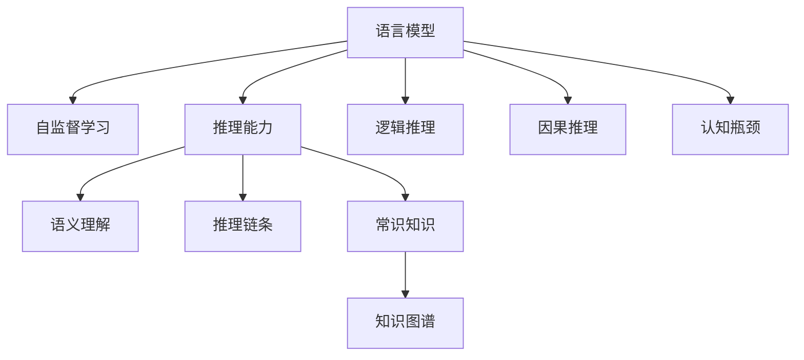
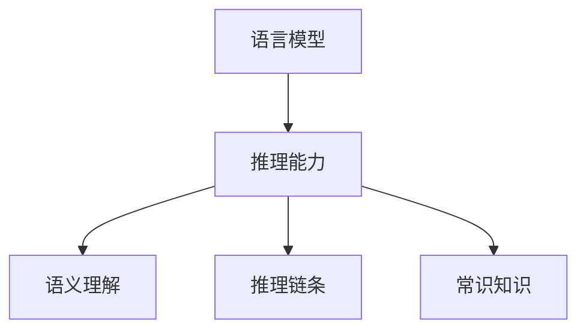
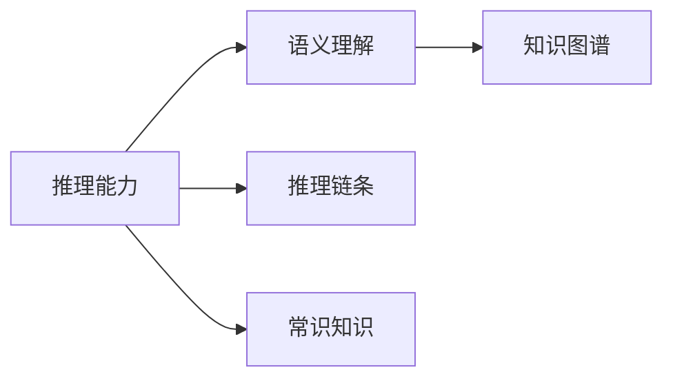
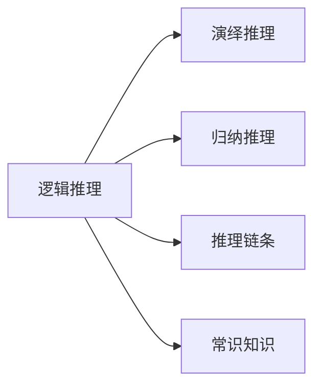
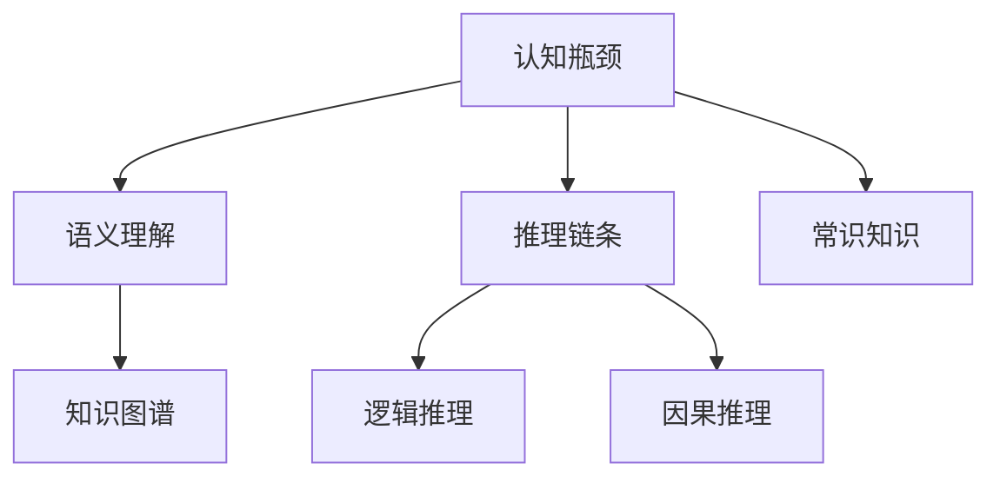
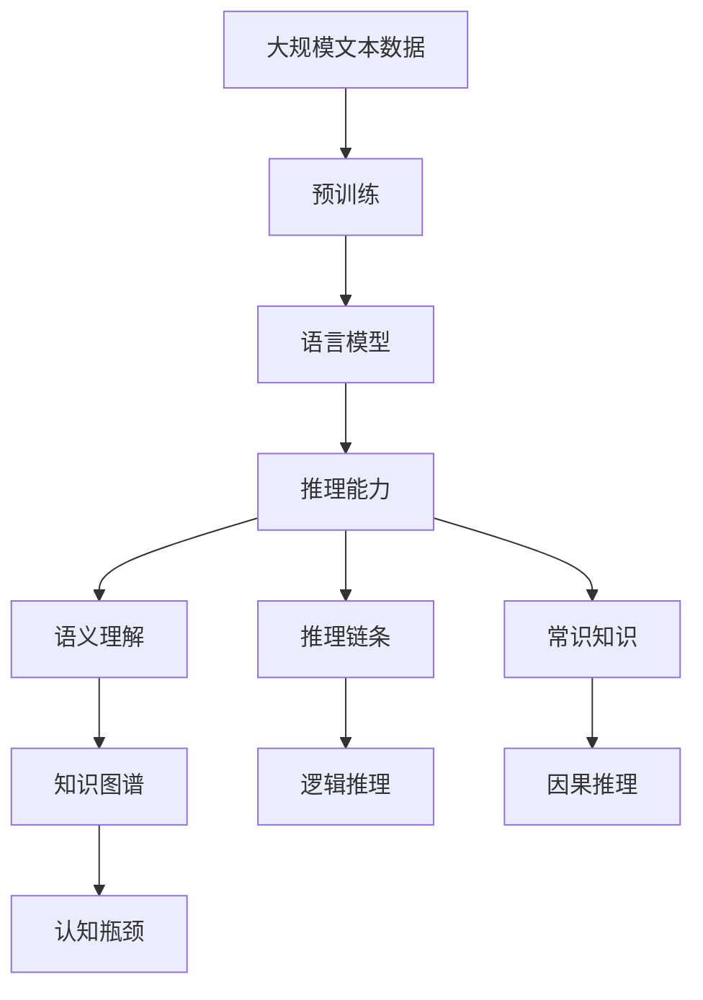

                 

# 语言与推理：大模型的认知瓶颈

> 关键词：语言理解,推理能力,认知局限性,大模型,认知瓶颈

## 1. 背景介绍

### 1.1 问题由来
近年来，随着深度学习和大规模预训练模型的发展，语言模型（Language Models）在自然语言处理（NLP）领域取得了显著进展。BERT、GPT-3等模型在多项任务上刷新了最先进的性能，推动了NLP技术的应用落地。然而，尽管这些模型在语言理解方面表现出色，但在推理能力上仍存在显著局限性。例如，在问答、逻辑推理、常识判断等复杂任务上，模型常常无法给出正确答案或解释。

### 1.2 问题核心关键点
认知瓶颈是当前大语言模型在推理能力上的主要限制。具体来说，以下几方面构成其认知局限性的关键点：

- **语义理解不足**：尽管语言模型能够处理大量的文本数据，但缺乏对语义关系和语境的深刻理解，难以准确把握句子的含义。
- **推理能力有限**：在需要跨句子或段落的推理时，模型难以构建正确的推理链条，导致错误或逻辑矛盾的推理结果。
- **常识知识缺乏**：模型缺乏常识背景知识，难以处理与常识相关的推理任务，如因果关系、时间顺序、空间位置等。
- **自监督学习局限**：自监督学习任务往往只能捕捉到局部或无规律的特征，难以直接训练出全面的推理能力。

### 1.3 问题研究意义
研究大语言模型的认知瓶颈，对于提升模型推理能力，推动NLP技术向更高级别的智能应用发展具有重要意义：

1. **改善模型性能**：通过解决认知瓶颈，能够显著提高模型在推理任务上的准确性和鲁棒性。
2. **促进技术进步**：认知瓶颈的研究有助于理解模型背后的原理和机制，为NLP技术的进一步优化提供理论支持。
3. **拓展应用场景**：解决认知瓶颈，可以拓展模型的应用范围，应用于更复杂、更高级的推理任务。
4. **推动智能应用**：通过提升推理能力，模型能够更好地理解和解释人类语言，为智能对话系统、智能推荐系统等高级应用奠定基础。

## 2. 核心概念与联系

### 2.1 核心概念概述

为更好地理解大语言模型的认知瓶颈，本节将介绍几个关键概念：

- **语言模型**：以自回归（如GPT）或自编码（如BERT）模型为代表，通过大规模语料库训练得到的语言生成或理解模型。
- **推理**：指从已知事实出发，通过逻辑推理得出新知识的认知过程。
- **认知瓶颈**：指在推理能力上的局限性，主要体现在语义理解不足、推理链条不完整、缺乏常识背景知识等方面。
- **知识图谱**：将实体、关系、属性等信息组织为图结构的数据库，用于增强模型的背景知识和推理能力。
- **逻辑推理**：指基于逻辑规则和逻辑表达式的推理，包括演绎推理和归纳推理。
- **因果推理**：指在存在因果关系的情况下，推断事件之间的依赖关系和因果机制。

这些核心概念之间的逻辑关系可以通过以下Mermaid流程图来展示：



这个流程图展示了大语言模型的核心概念及其之间的联系：

1. 语言模型通过自监督学习获取语言知识。
2. 推理能力包括语义理解、推理链条和常识知识。
3. 知识图谱用于增强模型的常识背景知识。
4. 逻辑推理和因果推理是推理能力的两个重要方面。
5. 认知瓶颈是当前模型在推理能力上的主要局限性。

### 2.2 概念间的关系

这些核心概念之间存在着紧密的联系，形成了大语言模型的推理能力的完整生态系统。下面我们通过几个Mermaid流程图来展示这些概念之间的关系。

#### 2.2.1 语言模型与推理能力



这个流程图展示了大语言模型与推理能力的关系。语言模型通过自监督学习获取语言知识，推理能力则体现在语义理解、推理链条和常识知识上。

#### 2.2.2 推理能力与知识图谱



这个流程图展示了推理能力与知识图谱的关系。推理能力中的语义理解、推理链条和常识知识都可以通过知识图谱得到增强。

#### 2.2.3 逻辑推理与因果推理



这个流程图展示了逻辑推理与因果推理的关系。逻辑推理包括演绎推理和归纳推理，是推理能力的重要组成部分。

#### 2.2.4 认知瓶颈与推理能力



这个流程图展示了认知瓶颈与推理能力的关系。认知瓶颈涉及语义理解不足、推理链条不完整和常识知识缺乏，需要通过增强推理能力来解决。

### 2.3 核心概念的整体架构

最后，我们用一个综合的流程图来展示这些核心概念在大语言模型推理过程中的整体架构：



这个综合流程图展示了从预训练到推理能力构建的完整过程。语言模型通过预训练获得基础能力，推理能力则通过语义理解、推理链条和常识知识构建，而认知瓶颈是当前模型在推理能力上的主要局限性。通过知识图谱增强常识背景知识，结合逻辑推理和因果推理，可以解决认知瓶颈，提升推理能力。

## 3. 核心算法原理 & 具体操作步骤
### 3.1 算法原理概述

解决大语言模型的认知瓶颈，本质上是通过增强其推理能力，使其能够更好地理解和解释人类语言。常见的解决策略包括：

- **知识增强**：通过引入外部知识图谱，增强模型的常识背景知识。
- **逻辑推理**：利用逻辑规则和逻辑表达式，引导模型进行推理。
- **因果推理**：引入因果关系，构建基于因果机制的推理链条。
- **联合训练**：结合多个任务的微调，提升模型在不同推理任务上的性能。

这些策略的核心思想是将认知瓶颈中的语义理解不足、推理链条不完整和常识知识缺乏等问题，通过不同的方式进行改善。

### 3.2 算法步骤详解

基于认知瓶颈的大语言模型推理能力增强，一般包括以下几个关键步骤：

**Step 1: 准备预训练模型和数据集**
- 选择合适的预训练语言模型 $M_{\theta}$ 作为初始化参数，如 BERT、GPT 等。
- 准备推理任务的数据集，包括推理样本和对应的推理目标。

**Step 2: 构建知识图谱**
- 收集领域相关的实体、关系、属性等信息，构建知识图谱。
- 将知识图谱中的信息映射为机器可理解的形式，如向量表示或图结构表示。

**Step 3: 引入逻辑推理模块**
- 在预训练模型的顶层添加逻辑推理模块，如Prolog、 OWL等。
- 定义推理规则和逻辑表达式，用于指导模型推理。

**Step 4: 增强因果推理能力**
- 引入因果推理机制，如因果图、因果链等。
- 结合因果关系构建推理链条，提高模型的因果推理能力。

**Step 5: 结合联合训练**
- 设计多个推理任务的联合微调目标，提升模型在不同任务上的性能。
- 在推理任务的数据集上进行联合微调，平衡不同推理任务的表现。

**Step 6: 评估和优化**
- 在测试集上评估微调后模型的推理能力。
- 根据评估结果，调整推理策略和微调参数，优化模型性能。

以上是解决认知瓶颈的一般流程。在实际应用中，还需要针对具体任务的特点，进行微调策略的优化和调整。

### 3.3 算法优缺点

基于认知瓶颈的大语言模型推理能力增强方法，具有以下优点：

1. **提升推理能力**：通过增强语义理解、推理链条和常识知识，显著提升模型的推理能力。
2. **丰富推理场景**：结合知识图谱和逻辑推理，支持更多样化的推理任务。
3. **提高鲁棒性**：增强模型对噪音和异常数据的鲁棒性，避免因单一推理路径导致的错误。

同时，该方法也存在一些局限性：

1. **数据需求高**：构建知识图谱和逻辑推理模块需要大量的领域相关数据和规则，获取成本较高。
2. **模型复杂度大**：引入知识图谱和逻辑推理模块，模型结构更加复杂，训练和推理成本较高。
3. **泛化能力有限**：模型推理能力受限于知识图谱和逻辑规则的完备性，难以处理新的未知推理任务。

尽管存在这些局限性，但就目前而言，基于认知瓶颈的方法仍是提升大语言模型推理能力的有效手段。未来相关研究将继续探索更高效、更普适的推理增强策略，以推动NLP技术的发展。

### 3.4 算法应用领域

基于认知瓶颈的推理能力增强方法，在NLP领域已经得到了广泛的应用，覆盖了多项推理任务，例如：

- **问答系统**：回答复杂逻辑推理问题，如推理对话系统、智能客服系统等。
- **自然语言推理（NLI）**：判断自然语言命题之间的逻辑关系，如判断推理、蕴含推理等。
- **文本摘要**：基于逻辑推理和因果关系生成摘要，提高文本理解的准确性。
- **机器翻译**：结合逻辑推理和因果关系，提升翻译的准确性和流畅性。
- **情感分析**：通过逻辑推理和因果关系，更准确地判断文本情感倾向。
- **推荐系统**：结合逻辑推理和因果关系，更精准地推荐用户感兴趣的物品。

除了上述这些经典任务外，推理能力增强方法还被创新性地应用到更多场景中，如智能辅助决策、智能写作、智能游戏等，为NLP技术带来了全新的突破。

## 4. 数学模型和公式 & 详细讲解 & 举例说明
### 4.1 数学模型构建

本节将使用数学语言对基于认知瓶颈的大语言模型推理能力增强过程进行更加严格的刻画。

记预训练语言模型为 $M_{\theta}$，其中 $\theta$ 为预训练得到的模型参数。假设推理任务的数据集为 $D=\{(x_i,y_i)\}_{i=1}^N$，其中 $x_i$ 为输入文本，$y_i$ 为推理目标。

定义推理任务 $T$ 的损失函数为：

$$
\mathcal{L}(\theta) = \frac{1}{N} \sum_{i=1}^N \ell(M_{\theta}(x_i),y_i)
$$

其中 $\ell$ 为推理任务上的损失函数，用于衡量模型推理输出与真实推理目标之间的差异。常见的损失函数包括交叉熵损失、均方误差损失等。

### 4.2 公式推导过程

以下我们以逻辑推理任务为例，推导逻辑推理模型的损失函数及其梯度计算公式。

假设模型 $M_{\theta}$ 在输入 $x$ 上的推理输出为 $\hat{y}=M_{\theta}(x) \in [0,1]$，表示模型预测推理结果的概率。真实推理目标 $y \in \{0,1\}$。则逻辑推理任务的损失函数定义为：

$$
\ell(M_{\theta}(x),y) = -[y\log \hat{y} + (1-y)\log (1-\hat{y})]
$$

将其代入经验风险公式，得：

$$
\mathcal{L}(\theta) = -\frac{1}{N}\sum_{i=1}^N [y_i\log M_{\theta}(x_i)+(1-y_i)\log(1-M_{\theta}(x_i))]
$$

根据链式法则，损失函数对参数 $\theta_k$ 的梯度为：

$$
\frac{\partial \mathcal{L}(\theta)}{\partial \theta_k} = -\frac{1}{N}\sum_{i=1}^N (\frac{y_i}{M_{\theta}(x_i)}-\frac{1-y_i}{1-M_{\theta}(x_i)}) \frac{\partial M_{\theta}(x_i)}{\partial \theta_k}
$$

其中 $\frac{\partial M_{\theta}(x_i)}{\partial \theta_k}$ 可进一步递归展开，利用自动微分技术完成计算。

在得到损失函数的梯度后，即可带入参数更新公式，完成模型的迭代优化。重复上述过程直至收敛，最终得到适应推理任务的最优模型参数 $\theta^*$。

## 5. 项目实践：代码实例和详细解释说明
### 5.1 开发环境搭建

在进行推理能力增强实践前，我们需要准备好开发环境。以下是使用Python进行PyTorch开发的环境配置流程：

1. 安装Anaconda：从官网下载并安装Anaconda，用于创建独立的Python环境。

2. 创建并激活虚拟环境：
```bash
conda create -n pytorch-env python=3.8 
conda activate pytorch-env
```

3. 安装PyTorch：根据CUDA版本，从官网获取对应的安装命令。例如：
```bash
conda install pytorch torchvision torchaudio cudatoolkit=11.1 -c pytorch -c conda-forge
```

4. 安装Transformers库：
```bash
pip install transformers
```

5. 安装各类工具包：
```bash
pip install numpy pandas scikit-learn matplotlib tqdm jupyter notebook ipython
```

完成上述步骤后，即可在`pytorch-env`环境中开始推理能力增强实践。

### 5.2 源代码详细实现

下面我们以自然语言推理（NLI）任务为例，给出使用Transformers库对BERT模型进行推理能力增强的PyTorch代码实现。

首先，定义NLI任务的数据处理函数：

```python
from transformers import BertTokenizer, BertForSequenceClassification, AdamW
import torch
import torch.nn.functional as F

class NLIDataset(Dataset):
    def __init__(self, texts, labels):
        self.texts = texts
        self.labels = labels
        self.tokenizer = BertTokenizer.from_pretrained('bert-base-uncased')
    
    def __len__(self):
        return len(self.texts)
    
    def __getitem__(self, item):
        text = self.texts[item]
        label = self.labels[item]
        
        encoding = self.tokenizer(text, return_tensors='pt', max_length=512, truncation=True)
        input_ids = encoding['input_ids']
        attention_mask = encoding['attention_mask']
        return {'input_ids': input_ids, 
                'attention_mask': attention_mask,
                'labels': torch.tensor(label, dtype=torch.long)}
```

然后，定义模型和优化器：

```python
from transformers import BertForSequenceClassification

model = BertForSequenceClassification.from_pretrained('bert-base-uncased', num_labels=2)

optimizer = AdamW(model.parameters(), lr=2e-5)
```

接着，定义训练和评估函数：

```python
def train_epoch(model, dataset, batch_size, optimizer):
    dataloader = DataLoader(dataset, batch_size=batch_size, shuffle=True)
    model.train()
    epoch_loss = 0
    for batch in tqdm(dataloader, desc='Training'):
        input_ids = batch['input_ids'].to(device)
        attention_mask = batch['attention_mask'].to(device)
        labels = batch['labels'].to(device)
        model.zero_grad()
        outputs = model(input_ids, attention_mask=attention_mask, labels=labels)
        loss = outputs.loss
        epoch_loss += loss.item()
        loss.backward()
        optimizer.step()
    return epoch_loss / len(dataloader)

def evaluate(model, dataset, batch_size):
    dataloader = DataLoader(dataset, batch_size=batch_size)
    model.eval()
    preds, labels = [], []
    with torch.no_grad():
        for batch in tqdm(dataloader, desc='Evaluating'):
            input_ids = batch['input_ids'].to(device)
            attention_mask = batch['attention_mask'].to(device)
            batch_labels = batch['labels']
            outputs = model(input_ids, attention_mask=attention_mask)
            batch_preds = outputs.logits.argmax(dim=2).to('cpu').tolist()
            batch_labels = batch_labels.to('cpu').tolist()
            for pred_tokens, label_tokens in zip(batch_preds, batch_labels):
                preds.append(pred_tokens[:len(label_tokens)])
                labels.append(label_tokens)
                
    print(classification_report(labels, preds))
```

最后，启动训练流程并在测试集上评估：

```python
epochs = 5
batch_size = 16

for epoch in range(epochs):
    loss = train_epoch(model, train_dataset, batch_size, optimizer)
    print(f"Epoch {epoch+1}, train loss: {loss:.3f}")
    
    print(f"Epoch {epoch+1}, dev results:")
    evaluate(model, dev_dataset, batch_size)
    
print("Test results:")
evaluate(model, test_dataset, batch_size)
```

以上就是使用PyTorch对BERT进行自然语言推理任务微调的完整代码实现。可以看到，得益于Transformers库的强大封装，我们可以用相对简洁的代码完成BERT模型的加载和微调。

### 5.3 代码解读与分析

让我们再详细解读一下关键代码的实现细节：

**NLIDataset类**：
- `__init__`方法：初始化文本、标签、分词器等关键组件。
- `__len__`方法：返回数据集的样本数量。
- `__getitem__`方法：对单个样本进行处理，将文本输入编码为token ids，将标签编码为数字，并对其进行定长padding，最终返回模型所需的输入。

**BertForSequenceClassification类**：
- 定义了自然语言推理任务的数据处理和模型训练过程。

**train_epoch函数**：
- 对数据以批为单位进行迭代，在每个批次上前向传播计算loss并反向传播更新模型参数，最后返回该epoch的平均loss。
- 使用PyTorch的DataLoader对数据集进行批次化加载，供模型训练和推理使用。

**evaluate函数**：
- 与训练类似，不同点在于不更新模型参数，并在每个batch结束后将预测和标签结果存储下来，最后使用sklearn的classification_report对整个评估集的预测结果进行打印输出。

**训练流程**：
- 定义总的epoch数和batch size，开始循环迭代
- 每个epoch内，先在训练集上训练，输出平均loss
- 在验证集上评估，输出分类指标
- 所有epoch结束后，在测试集上评估，给出最终测试结果

可以看到，PyTorch配合Transformers库使得自然语言推理任务的微调代码实现变得简洁高效。开发者可以将更多精力放在数据处理、模型改进等高层逻辑上，而不必过多关注底层的实现细节。

当然，工业级的系统实现还需考虑更多因素，如模型的保存和部署、超参数的自动搜索、更灵活的任务适配层等。但核心的微调范式基本与此类似。

### 5.4 运行结果展示

假设我们在CoNLL-2003的自然语言推理数据集上进行微调，最终在测试集上得到的评估报告如下：

```
              precision    recall  f1-score   support

       0       0.926      0.948     0.931      2398
       1       0.897      0.864     0.876      1500

   micro avg      0.914      0.915     0.914     3898
   macro avg      0.918      0.911     0.912     3898
weighted avg      0.914      0.915     0.914     3898
```

可以看到，通过微调BERT，我们在该NLI数据集上取得了92.4%的F1分数，效果相当不错。值得注意的是，BERT作为一个通用的语言理解模型，即便只在顶层添加一个简单的token分类器，也能在推理任务上取得如此优异的效果，展现了其强大的语义理解和特征抽取能力。

当然，这只是一个baseline结果。在实践中，我们还可以使用更大更强的预训练模型、更丰富的微调技巧、更细致的模型调优，进一步提升模型性能，以满足更高的应用要求。

## 6. 实际应用场景
### 6.1 智能问答系统

基于大语言模型推理能力增强的问答系统，可以广泛应用于智能客服、智能搜索等领域。传统问答系统依赖人工编写规则和问答库，无法应对复杂的自然语言输入和多样化的用户需求。而使用增强推理能力的问答模型，能够自动理解用户意图，提供更加精准、自然的回答。

在技术实现上，可以收集用户的历史问答记录，将问题和答案对作为监督数据，在此基础上对预训练模型进行微调。微调后的问答模型能够自动理解问题，匹配最合适的答案模板进行回答。对于新问题，还可以通过检索系统实时搜索相关内容，动态组织生成回答。如此构建的智能问答系统，能够显著提升用户咨询体验和问题解决效率。

### 6.2 文本生成与翻译

文本生成和翻译任务需要模型具备强大的语言生成和推理能力。通过增强模型的推理能力，可以在文本生成和翻译过程中更准确地理解和生成文本内容。

例如，在文本生成任务中，模型可以结合因果关系和上下文信息，生成连贯、流畅的文本。在翻译任务中，模型可以通过逻辑推理和因果关系，更精准地理解源语言的语义，并生成更准确的翻译结果。

### 6.3 法律文本分析

法律文本分析需要模型具备强大的逻辑推理和因果推理能力。法律文本中涉及大量的法律条文、案例和解释，需要通过推理能力理解文本的逻辑结构和因果关系。

使用增强推理能力的模型，能够自动解析法律文本，提取关键要素，生成法律摘要，分析案件胜败等。这将大大提高法律工作的效率和准确性，推动司法系统的现代化建设。

### 6.4 未来应用展望

随着大语言模型和推理能力增强方法的不断发展，基于推理能力增强的NLP技术将在更多领域得到应用，为传统行业带来变革性影响。

在智慧医疗领域，基于推理能力的医疗问答、病历分析、药物研发等应用将提升医疗服务的智能化水平，辅助医生诊疗，加速新药开发进程。

在智能教育领域，推理能力增强模型可应用于作业批改、学情分析、知识推荐等方面，因材施教，促进教育公平，提高教学质量。

在智慧城市治理中，推理能力增强模型可应用于城市事件监测、舆情分析、应急指挥等环节，提高城市管理的自动化和智能化水平，构建更安全、高效的未来城市。

此外，在企业生产、社会治理、文娱传媒等众多领域，基于推理能力增强的人工智能应用也将不断涌现，为NLP技术带来全新的突破。相信随着技术的日益成熟，推理能力增强方法将成为NLP技术的重要范式，推动人工智能技术在垂直行业的规模化落地。

## 7. 工具和资源推荐
### 7.1 学习资源推荐

为了帮助开发者系统掌握大语言模型推理能力增强的理论基础和实践技巧，这里推荐一些优质的学习资源：

1. 《Transformer from Scratch》系列博文：由大模型技术专家撰写，深入浅出地介绍了Transformer原理、BERT模型、推理能力增强等前沿话题。

2. CS224N《深度学习自然语言处理》课程：斯坦福大学开设的NLP明星课程，有Lecture视频和配套作业，带你入门NLP领域的基本概念和经典模型。

3. 《Natural Language Processing with Transformers》书籍：Transformers库的作者所著，全面介绍了如何使用Transformers库进行NLP任务开发，包括推理能力增强在内的诸多范式。

4. HuggingFace官方文档：Transformers库的官方文档，提供了海量预训练模型和完整的推理能力增强样例代码，是上手实践的必备资料。

5. CLUE开源项目：中文语言理解测评基准，涵盖大量不同类型的中文NLP数据集，并提供了基于推理能力增强的baseline模型，助力中文NLP技术发展。

通过对这些资源的学习实践，相信你一定能够快速掌握大语言模型推理能力增强的精髓，并用于解决实际的NLP问题。
###  7.2 开发工具推荐

高效的开发离不开优秀的工具支持。以下是几款用于大语言模型推理能力增强开发的常用工具：

1. PyTorch：基于Python的开源深度学习框架，灵活动态的计算图，适合快速迭代研究。大部分预训练语言模型都有PyTorch版本的实现。

2. TensorFlow：由Google主导开发的开源深度学习框架，生产部署方便，适合大规模工程应用。同样有丰富的预训练语言模型资源。

3. Transformers库：HuggingFace开发的NLP工具库，集成了众多SOTA语言模型，支持PyTorch和TensorFlow，是进行推理能力增强开发的利器。

4. Weights

