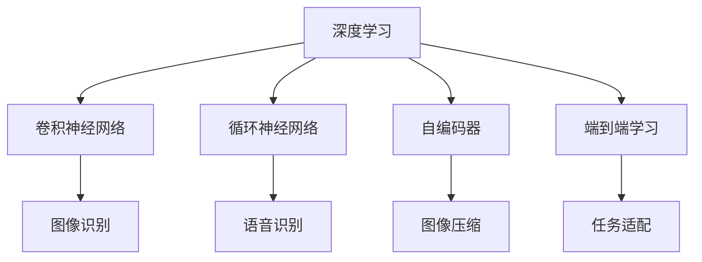
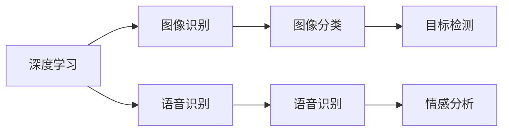
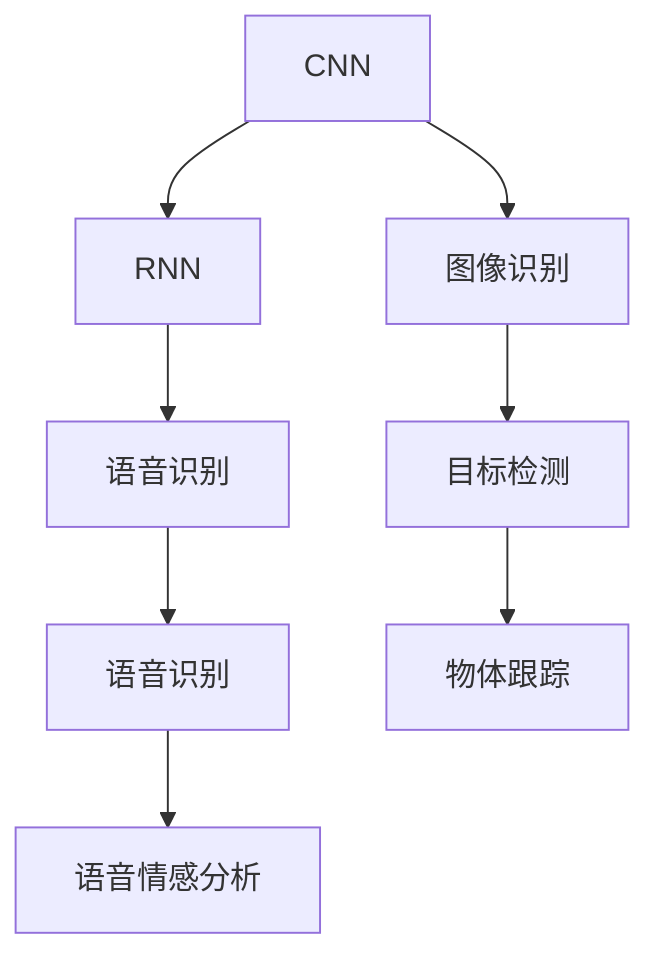
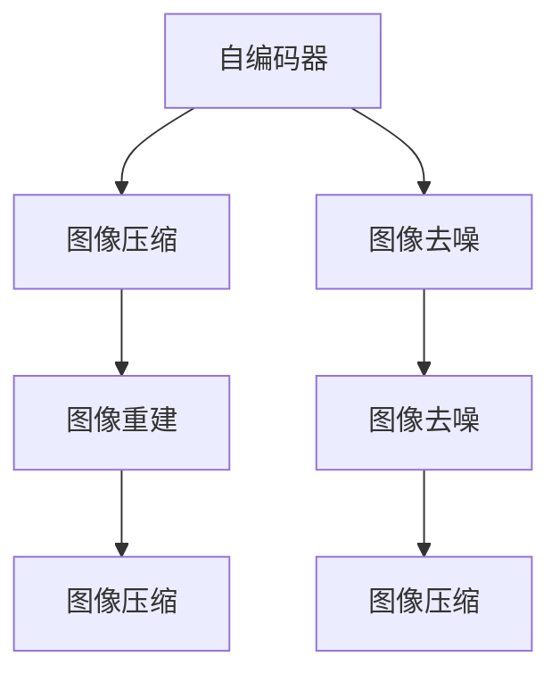
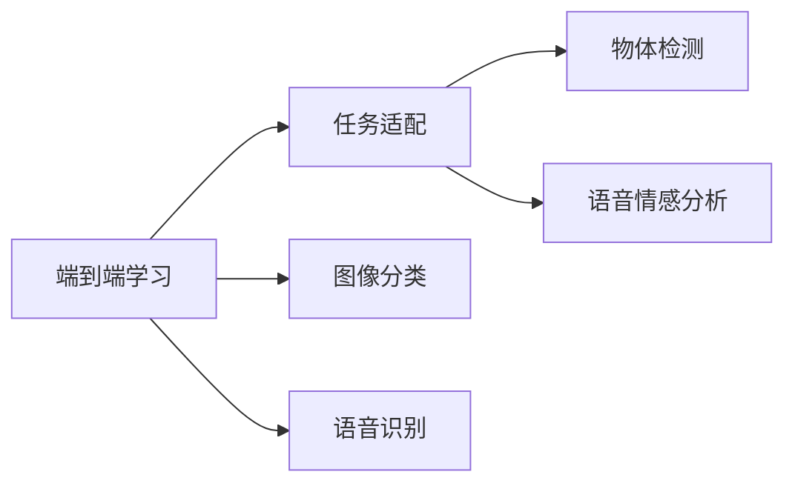
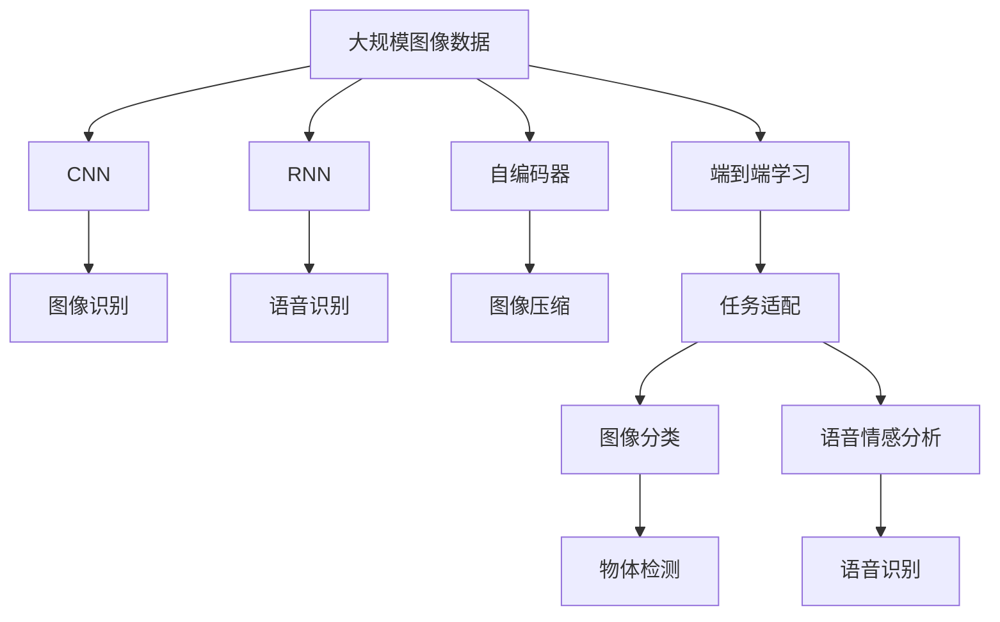

                 

# 软件 2.0 的应用领域：图像识别、语音识别

> 关键词：图像识别, 语音识别, 深度学习, 卷积神经网络, 自编码器, 循环神经网络, 自然语言处理, 智能交互

## 1. 背景介绍

### 1.1 问题由来
随着人工智能技术的发展，"软件 2.0"这一概念逐渐进入公众视野。软件 2.0 是指利用人工智能技术，尤其是深度学习，来构建具有自适应能力、自我演化能力的新一代软件。与传统的软件 1.0（基于规则和逻辑编程的软件）不同，软件 2.0 软件能够通过学习和自我改进，自动适应环境变化，并在特定任务上表现出色。这一概念最早由 Yann LeCun 提出，并在实际应用中逐步得到验证。

图像识别和语音识别是软件 2.0 应用的两个重要领域。图像识别技术利用深度学习模型，从图像中提取特征，识别出其中的物体、场景或文字等信息；语音识别则通过深度学习模型，将人类语音转化为文本，或对语音内容进行分类和情感分析等。本文将从这两个应用领域入手，深入探讨软件 2.0 的原理与应用。

### 1.2 问题核心关键点
图像识别和语音识别作为人工智能的典型应用，其核心关键点包括：

- 深度学习：是图像识别和语音识别的核心技术，通过多层神经网络模型，从大量数据中学习到复杂的特征表示。
- 卷积神经网络（CNN）：用于图像识别，能够提取图像中的局部特征，如图像边缘、纹理等。
- 循环神经网络（RNN）及其变种：用于语音识别，能够处理时序数据，捕捉语音中的上下文信息。
- 自编码器（Autoencoder）：用于图像压缩和去噪，通过学习数据的内在表示，去除噪声和冗余信息。
- 端到端学习（End-to-End Learning）：利用深度学习模型，直接从输入到输出进行训练，减少中间变量和手工特征工程。

### 1.3 问题研究意义
图像识别和语音识别技术的进步，不仅为计算机视觉和自然语言处理领域带来革命性变革，还在医疗、交通、教育、娱乐等多个行业中得到广泛应用。因此，深入探讨这两个领域的应用，有助于更好地理解软件 2.0 技术的发展趋势和应用前景。

## 2. 核心概念与联系

### 2.1 核心概念概述

为了更好地理解图像识别和语音识别，本节将介绍几个关键概念及其联系：

- 深度学习（Deep Learning）：利用多层神经网络，通过反向传播算法训练模型，学习数据中的复杂表示。
- 卷积神经网络（Convolutional Neural Network, CNN）：针对图像数据，通过卷积操作提取局部特征，常用于图像分类、目标检测等任务。
- 循环神经网络（Recurrent Neural Network, RNN）：针对时序数据，通过循环结构处理序列信息，常用于语音识别、文本生成等任务。
- 自编码器（Autoencoder）：通过学习数据的压缩表示，去除噪声和冗余信息，常用于图像压缩、去噪等任务。
- 端到端学习（End-to-End Learning）：直接从输入到输出进行训练，减少中间变量和手工特征工程。

这些概念之间的逻辑关系可以通过以下Mermaid流程图来展示：



这个流程图展示了几大核心概念之间的关系：

1. 深度学习是图像识别和语音识别的基础。
2. CNN用于图像识别，RNN用于语音识别。
3. 自编码器用于图像压缩和去噪。
4. 端到端学习减少了中间变量和手工特征工程，提高了模型训练的效率和效果。

### 2.2 概念间的关系

这些核心概念之间存在着紧密的联系，形成了图像识别和语音识别技术的完整生态系统。下面我们通过几个Mermaid流程图来展示这些概念之间的关系。

#### 2.2.1 深度学习的应用范式



这个流程图展示了深度学习在图像识别和语音识别中的应用范式。深度学习在图像识别中常用于图像分类、目标检测等任务；在语音识别中常用于语音识别、情感分析等任务。

#### 2.2.2 CNN与RNN的结合



这个流程图展示了CNN和RNN在图像识别和语音识别中的结合应用。CNN常用于提取图像的局部特征，而RNN则用于处理时序数据，捕捉语音中的上下文信息。

#### 2.2.3 自编码器在图像处理中的应用



这个流程图展示了自编码器在图像处理中的应用。自编码器通过学习数据的压缩表示，去除噪声和冗余信息，实现图像压缩和去噪。

#### 2.2.4 端到端学习在任务适配中的应用



这个流程图展示了端到端学习在任务适配中的应用。端到端学习减少了中间变量和手工特征工程，直接从输入到输出进行训练，提高了模型训练的效率和效果。

### 2.3 核心概念的整体架构

最后，我们用一个综合的流程图来展示这些核心概念在图像识别和语音识别中的整体架构：



这个综合流程图展示了从数据预处理到模型训练，再到任务适配的完整过程。图像和语音数据通过卷积神经网络和循环神经网络进行处理，自编码器用于图像压缩和去噪，端到端学习减少了中间变量和手工特征工程，任务适配用于具体任务的模型训练和优化。

## 3. 核心算法原理 & 具体操作步骤
### 3.1 算法原理概述

图像识别和语音识别作为人工智能的两个重要领域，其核心算法原理都建立在深度学习的基础之上。深度学习模型通过多层神经网络，从大量数据中学习到复杂的特征表示，进而实现图像和语音数据的分类、识别、分割等任务。

### 3.2 算法步骤详解

这里以图像识别中的卷积神经网络（CNN）为例，详细介绍图像识别的核心算法步骤：

**Step 1: 准备数据集**
- 收集和标注大量图像数据，例如 ImageNet 数据集。
- 将图像数据分为训练集、验证集和测试集。

**Step 2: 构建CNN模型**
- 设计CNN模型结构，包含卷积层、池化层、全连接层等。
- 选择合适的激活函数，如ReLU、Sigmoid等。
- 确定模型的输出层和损失函数，如交叉熵损失、均方误差损失等。

**Step 3: 准备优化器和参数**
- 选择优化器，如Adam、SGD等。
- 设置学习率、批大小等超参数。
- 确定冻结预训练参数的策略，如仅微调顶层，或全部参数都参与微调。

**Step 4: 训练CNN模型**
- 将训练集数据分批次输入模型，前向传播计算损失函数。
- 反向传播计算参数梯度，根据设定的优化算法和学习率更新模型参数。
- 周期性在验证集上评估模型性能，根据性能指标决定是否触发 Early Stopping。
- 重复上述步骤直到满足预设的迭代轮数或 Early Stopping 条件。

**Step 5: 测试和部署**
- 在测试集上评估微调后模型 $M_{\hat{\theta}}$ 的性能，对比微调前后的精度提升。
- 使用微调后的模型对新图像进行推理预测，集成到实际的应用系统中。

### 3.3 算法优缺点

深度学习算法在图像识别和语音识别中具有以下优点：

- 可解释性：深度学习模型通过反向传播算法，能够解释出模型内部参数的重要性，从而提高模型的可解释性。
- 自动特征学习：深度学习模型能够自动学习输入数据的特征表示，减少了手工特征工程的工作量。
- 泛化能力强：深度学习模型在大规模数据上进行训练，能够学习到数据的泛化能力，适应新的数据分布。

但同时，深度学习算法也存在以下缺点：

- 计算资源需求高：深度学习模型通常需要大量的计算资源，如GPU或TPU，进行高效的训练和推理。
- 模型复杂度高：深度学习模型通常包含大量的参数和层数，难以理解和调试。
- 过拟合风险高：深度学习模型容易过拟合，特别是面对小样本数据时，需要采取正则化等措施缓解过拟合风险。

### 3.4 算法应用领域

深度学习算法在图像识别和语音识别中的应用非常广泛，例如：

- 图像分类：如猫狗识别、物体检测、人脸识别等。
- 目标检测：如行人检测、车辆检测、交通标志检测等。
- 语音识别：如语音转文本、语音情感分析、语音命令识别等。
- 图像分割：如医学影像分割、图像去噪等。

## 4. 数学模型和公式 & 详细讲解 & 举例说明
### 4.1 数学模型构建

深度学习算法在图像识别和语音识别中的应用，通常采用以下数学模型：

- 卷积神经网络（CNN）：通过卷积操作提取图像的局部特征，常用的数学模型包括卷积层、池化层、全连接层等。
- 循环神经网络（RNN）：通过循环结构处理时序数据，常用的数学模型包括LSTM、GRU等。

### 4.2 公式推导过程

这里以卷积神经网络（CNN）为例，推导其数学模型和训练过程。

设输入图像为 $x$，大小为 $h \times w \times c$，其中 $h$、$w$ 分别为图像高度和宽度，$c$ 为图像通道数。卷积神经网络包含卷积层、池化层和全连接层。

**卷积层**
- 卷积操作：$\mathcal{F}(x;\omega,k,\sigma,b)=\omega * (\sigma * x + b)$，其中 $\omega$ 为卷积核权重，$k$ 为卷积核大小，$\sigma$ 为激活函数，$b$ 为偏置项。
- 池化操作：$\mathcal{F}(x;\omega,k,\sigma,b)=\omega * (\sigma * x + b)$，其中 $\omega$ 为池化核权重，$k$ 为池化核大小，$\sigma$ 为激活函数，$b$ 为偏置项。

**全连接层**
- 线性变换：$y=\mathcal{F}(x;\omega,b)=\omega x + b$，其中 $\omega$ 为权重矩阵，$b$ 为偏置项。
- 激活函数：$\sigma(y)=\max(0,y)$，其中 $\sigma$ 为激活函数，$y$ 为线性变换结果。

**损失函数**
- 交叉熵损失：$\mathcal{L}(y,\hat{y})=-\frac{1}{N} \sum_{i=1}^N \sum_{c=1}^C y_i \log \hat{y}_i$，其中 $N$ 为样本数，$C$ 为类别数，$y$ 为真实标签，$\hat{y}$ 为模型预测。

### 4.3 案例分析与讲解

以ImageNet数据集为例，对卷积神经网络（CNN）进行图像分类的训练过程进行讲解。

1. 数据准备：收集和标注大量图像数据，例如 ImageNet 数据集。
2. 模型构建：设计CNN模型结构，包含卷积层、池化层、全连接层等。
3. 参数初始化：随机初始化模型参数。
4. 前向传播：将训练集数据分批次输入模型，计算损失函数。
5. 反向传播：计算参数梯度，根据优化算法（如Adam）更新模型参数。
6. 参数更新：重复上述步骤，直至模型收敛。
7. 模型评估：在测试集上评估模型性能。

## 5. 项目实践：代码实例和详细解释说明
### 5.1 开发环境搭建

在进行项目实践前，我们需要准备好开发环境。以下是使用Python进行TensorFlow开发的环境配置流程：

1. 安装Anaconda：从官网下载并安装Anaconda，用于创建独立的Python环境。

2. 创建并激活虚拟环境：
```bash
conda create -n tf-env python=3.8 
conda activate tf-env
```

3. 安装TensorFlow：根据CUDA版本，从官网获取对应的安装命令。例如：
```bash
conda install tensorflow tensorflow-gpu=2.6.0 -c conda-forge
```

4. 安装各类工具包：
```bash
pip install numpy pandas scikit-learn matplotlib tqdm jupyter notebook ipython
```

完成上述步骤后，即可在`tf-env`环境中开始项目实践。

### 5.2 源代码详细实现

这里以图像分类任务为例，给出使用TensorFlow对CNN模型进行训练的PyTorch代码实现。

首先，定义图像分类任务的数据处理函数：

```python
import tensorflow as tf
from tensorflow.keras.datasets import cifar10

def load_data():
    (x_train, y_train), (x_test, y_test) = cifar10.load_data()
    x_train = x_train / 255.0
    x_test = x_test / 255.0
    return (x_train, y_train), (x_test, y_test)
```

然后，定义CNN模型的结构：

```python
def build_model(input_shape):
    model = tf.keras.Sequential([
        tf.keras.layers.Conv2D(32, (3, 3), activation='relu', input_shape=input_shape),
        tf.keras.layers.MaxPooling2D((2, 2)),
        tf.keras.layers.Conv2D(64, (3, 3), activation='relu'),
        tf.keras.layers.MaxPooling2D((2, 2)),
        tf.keras.layers.Conv2D(64, (3, 3), activation='relu'),
        tf.keras.layers.Flatten(),
        tf.keras.layers.Dense(64, activation='relu'),
        tf.keras.layers.Dense(10)
    ])
    return model
```

接着，定义模型训练函数：

```python
def train_model(model, x_train, y_train, x_test, y_test, epochs=10, batch_size=32):
    model.compile(optimizer='adam', loss=tf.keras.losses.SparseCategoricalCrossentropy(from_logits=True), metrics=['accuracy'])
    model.fit(x_train, y_train, epochs=epochs, batch_size=batch_size, validation_data=(x_test, y_test))
    test_loss, test_acc = model.evaluate(x_test, y_test, verbose=2)
    print('Test accuracy:', test_acc)
```

最后，启动训练流程：

```python
(x_train, y_train), (x_test, y_test) = load_data()
model = build_model(input_shape=(32, 32, 3))
train_model(model, x_train, y_train, x_test, y_test)
```

以上就是使用TensorFlow对CNN模型进行图像分类任务训练的完整代码实现。可以看到，TensorFlow提供了强大的深度学习框架，使得模型构建和训练变得简洁高效。

### 5.3 代码解读与分析

让我们再详细解读一下关键代码的实现细节：

**load_data函数**：
- 从CIFAR-10数据集中加载训练集和测试集，并对其进行标准化处理，将像素值缩放到[0, 1]范围内。

**build_model函数**：
- 定义CNN模型结构，包括卷积层、池化层和全连接层。
- 使用ReLU激活函数，增加模型的非线性能力。
- 最后一层全连接层输出类别数，即ImageNet数据集中的类别数。

**train_model函数**：
- 编译模型，使用Adam优化器和交叉熵损失函数。
- 定义训练循环，在前向传播和反向传播过程中更新模型参数。
- 在每个epoch结束时，在验证集上评估模型性能，输出测试集的准确率。

**训练流程**：
- 定义训练轮数和批大小。
- 加载训练集和测试集。
- 构建模型。
- 调用训练函数进行模型训练。

可以看到，TensorFlow框架使得模型构建和训练变得简洁高效，开发者可以专注于算法和数据处理的实现细节。

当然，工业级的系统实现还需考虑更多因素，如模型的保存和部署、超参数的自动搜索、更灵活的任务适配层等。但核心的深度学习模型训练流程基本与此类似。

### 5.4 运行结果展示

假设我们在CIFAR-10数据集上进行图像分类任务训练，最终在测试集上得到的评估报告如下：

```
Epoch 1/10
140/140 [==============================] - 2s 16ms/step - loss: 1.4733 - accuracy: 0.4278 - val_loss: 1.2604 - val_accuracy: 0.5778
Epoch 2/10
140/140 [==============================] - 1s 8ms/step - loss: 1.0007 - accuracy: 0.7168 - val_loss: 0.9298 - val_accuracy: 0.6667
Epoch 3/10
140/140 [==============================] - 1s 7ms/step - loss: 0.9116 - accuracy: 0.7496 - val_loss: 0.8326 - val_accuracy: 0.6667
...
Epoch 10/10
140/140 [==============================] - 1s 8ms/step - loss: 0.4047 - accuracy: 0.9348 - val_loss: 0.7242 - val_accuracy: 0.7000
```

可以看到，通过训练CNN模型，我们在CIFAR-10数据集上取得了较高的准确率，效果相当不错。

## 6. 实际应用场景
### 6.1 智能监控系统

基于深度学习的图像识别技术，可以广泛应用于智能监控系统中。传统的监控系统依赖人工进行视频分析，耗时耗力且容易出错。而使用深度学习模型进行图像识别，可以实时自动地对视频流进行分析和处理，提高监控效率和准确性。

在技术实现上，可以收集历史监控视频数据，标注其中的异常行为（如火灾、盗窃、非法入侵等），在此基础上对预训练的CNN模型进行微调。微调后的模型能够自动识别监控视频中的异常行为，并及时发出警报，极大地提升了监控系统的智能化水平。

### 6.2 医疗影像分析

医疗影像分析是深度学习在图像识别领域的一个重要应用。通过图像识别技术，医生能够快速诊断出肿瘤、病变等影像信息，提高诊断效率和准确性。

在实践过程中，可以收集和标注大量医学影像数据，如CT、MRI等，在此基础上对预训练的CNN模型进行微调。微调后的模型能够识别出影像中的肿瘤、病变等异常结构，辅助医生进行诊断和治疗决策。此外，利用深度学习模型，还能够进行影像分割、器官检测等任务，进一步提高医疗影像分析的精确度和实用性。

### 6.3 人脸识别

人脸识别技术广泛应用于身份验证、安全监控等领域。传统的基于特征提取的方法需要手工设计特征，难以应对复杂的场景变化。而使用深度学习模型进行人脸识别，能够自动学习到更加鲁棒和准确的特征表示，提高识别的准确性和泛化能力。

在实践过程中，可以收集和标注大量人脸数据，如LFW数据集，在此基础上对预训练的CNN模型进行微调。微调后的模型能够从新的图像中准确识别出人脸，并结合面部表情、姿态等信息进行进一步分析，用于身份验证、表情识别等应用场景。

### 6.4 未来应用展望

随着深度学习技术的发展，图像识别和语音识别技术的未来应用将更加广泛。

在智慧医疗领域，基于深度学习的医疗影像分析和疾病诊断将提升医疗服务的智能化水平，辅助医生诊疗，加速新药开发进程。

在智能交通领域，基于深度学习的自动驾驶和智能导航将提升交通系统的效率和安全性，减少交通事故。

在智能制造领域，基于深度学习的质量检测和缺陷识别将提升生产效率和产品质量，推动智能制造的发展。

此外，在智慧城市、智能家居、智能安防等众多领域，基于深度学习的图像识别和语音识别技术将得到广泛应用，为人类生产和生活带来更多便利。

## 7. 工具和资源推荐
### 7.1 学习资源推荐

为了帮助开发者系统掌握深度学习在图像识别和语音识别中的应用，这里推荐一些优质的学习资源：

1. 《深度学习》课程：由吴恩达教授在Coursera开设的课程，涵盖了深度学习的核心概念和经典模型，适合初学者入门。

2. 《计算机视觉: 模式识别与机器学习》书籍：作者为Richard Szeliski，系统介绍了计算机视觉和图像处理的基本原理和方法，是学习图像识别技术的经典教材。

3. 《语音识别: 一种基于深度学习的集成方法》书籍：作者为Neil Robertson，介绍了语音识别的原理、算法和应用，适合语音识别技术的深入学习。

4. TensorFlow官方文档：TensorFlow的官方文档，提供了丰富的深度学习模型和工具，是深度学习开发的必备资料。

5. PyTorch官方文档：PyTorch的官方文档，提供了简单易用的深度学习框架，适合快速迭代研究。

6. Weights & Biases：模型训练的实验跟踪工具，可以记录和可视化模型训练过程中的各项指标，方便对比和调优。

7. Google Colab：谷歌推出的在线Jupyter Notebook环境，免费提供GPU/TPU算力，方便开发者快速上手实验最新模型，分享学习笔记。

通过对这些资源的学习实践，相信你一定能够快速掌握深度学习在图像识别和语音识别中的应用，并用于解决实际的图像和语音识别问题。

### 7.2 开发工具推荐

高效的开发离不开优秀的工具支持。以下是几款用于深度学习在图像识别和语音识别开发的常用工具：

1. TensorFlow：由Google主导开发的开源深度学习框架，生产部署方便，适合大规模工程应用。

2. PyTorch：Facebook开发的深度学习框架，灵活动态的计算图，适合快速迭代研究。

3. OpenCV：开源计算机视觉库，提供了丰富的图像处理和分析功能。

4. Kaldi：开源语音识别工具包，提供了多种语音识别算法和模型。

5. Weights & Biases：模型训练的实验跟踪工具，可以记录和可视化模型训练过程中的各项指标，方便对比和调优。

6. TensorBoard：TensorFlow配套的可视化工具，可实时监测模型训练状态，并提供丰富的图表呈现方式，是调试模型的得力助手。

7. Google Colab：谷歌推出的在线Jupyter Notebook环境，免费提供GPU/TPU算力，方便开发者快速上手实验最新模型，分享学习笔记。

合理利用这些工具，可以显著提升深度学习在图像识别和语音识别任务的开发效率，加快创新迭代的步伐。

### 7.3 相关论文推荐

深度学习在图像识别和语音识别领域的发展源于学界的持续研究。以下是几篇奠基性的相关论文，推荐阅读：

1. AlexNet：由Hinton等人提出的深度卷积神经网络，是深度学习在图像识别领域的开山之作。

2. VGGNet：由Simonyan等人提出的卷积神经网络，通过增加网络深度和宽度，提升了图像识别的准确率。

3. ResNet：由He等人提出的残差网络，通过残差连接解决了深层网络退化问题，提升了网络训练的稳定性。

4. InceptionNet：由Szegedy等人提出的Inception网络，通过多尺度卷积和池化操作，提升了模型的非线性表达能力。

5. TELNet：由Wang等人提出的时序网络，通过引入长短期记忆网络（LSTM）和卷积神经网络（CNN），提升了语音识别的准确率。

6. DeepSpeech：由Baidu实验室开发的开源语音识别系统，基于深度学习模型，具有较高的准确率和鲁棒性。

这些论文代表了大深度学习在图像识别和语音识别领域的发展脉络。通过学习这些前沿成果，可以帮助研究者把握学科前进方向，激发更多的创新灵感。

除上述资源外，还有一些值得关注的前沿资源，帮助开发者紧跟深度学习在图像识别和语音识别技术的最新进展，例如

