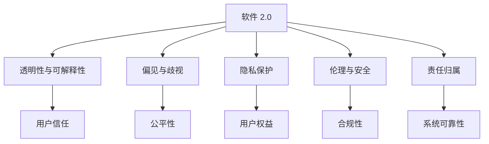
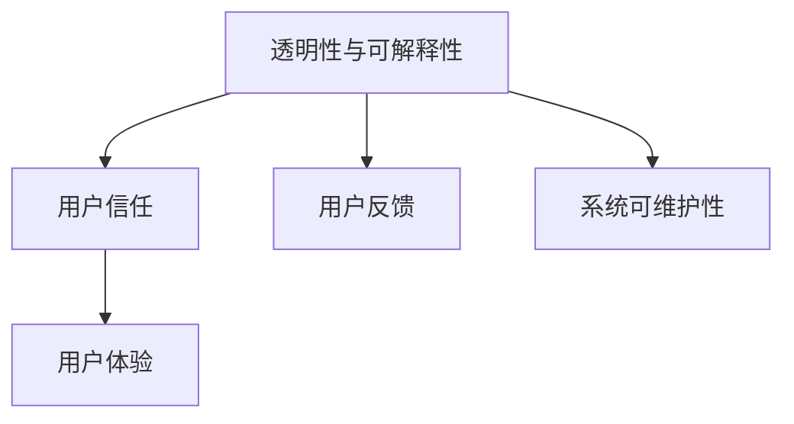
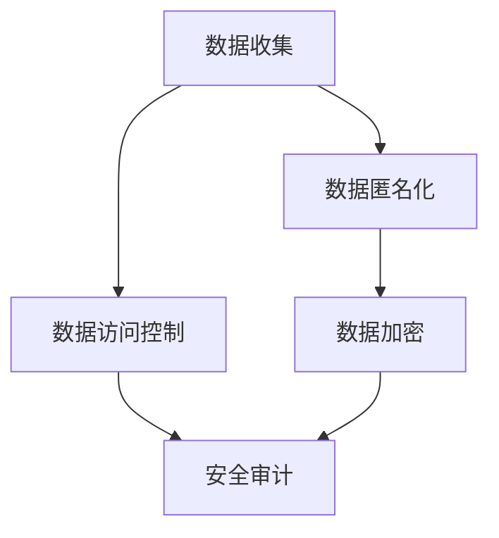
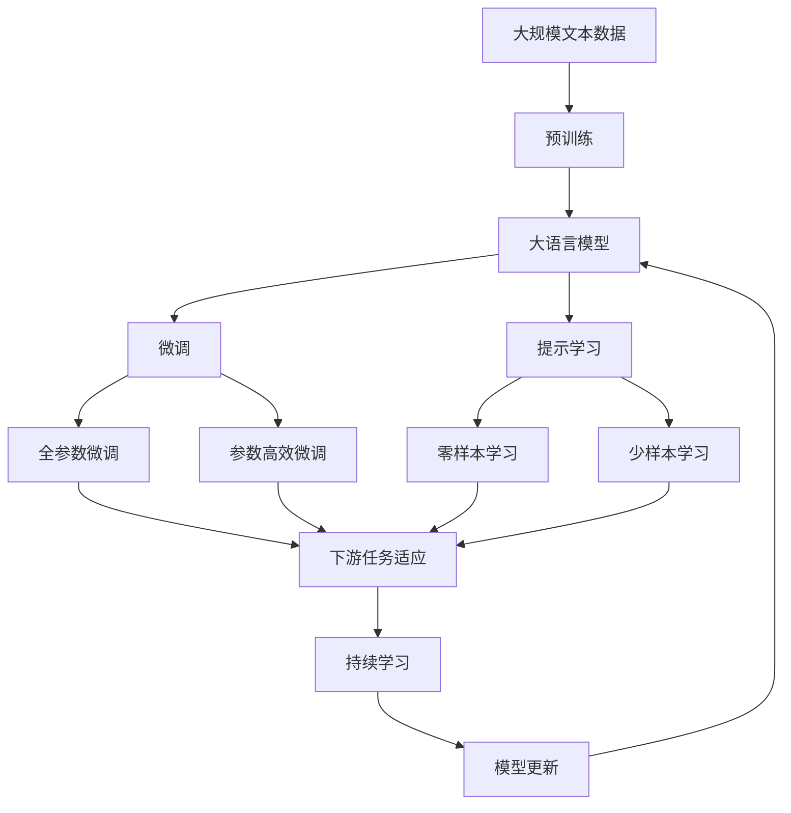

                 

## 1. 背景介绍

在当前数字化社会，软件和算法已成为支撑社会运转和经济发展的重要基石。然而，随着技术的不断演进，如何平衡科技发展与伦理道德、社会责任的关系，成为了全球范围内的热门话题。特别是随着人工智能（AI）、大数据等新兴技术的应用，科技向善的诉求愈发迫切。本文将聚焦于软件 2.0（Software 2.0）——新一代智能软件的关键问题，探讨其在推动社会责任方面的作用与挑战。

### 1.1 问题由来

软件 2.0 是相对于传统软件 1.0 的概念，强调利用AI、机器学习等技术，提升软件的智能水平和用户体验。近年来，软件 2.0 在医疗、金融、教育、零售等诸多领域取得了显著进展，但仍存在诸多挑战。其中，软件 2.0 的伦理和社会责任问题尤为引人关注。一方面，软件 2.0 的决策过程往往复杂且不透明，难以解释和审计。另一方面，AI模型在训练和应用中可能引入偏见和歧视，甚至引发伦理和法律争议。

### 1.2 问题核心关键点

要全面理解软件 2.0 的社会责任问题，需聚焦于以下几个关键点：
1. **透明度与可解释性**：软件 2.0 的决策过程如何确保透明和可解释，以增强用户的信任。
2. **偏见与歧视**：模型在训练和应用中如何避免引入偏见和歧视，确保公平性。
3. **隐私保护**：如何保护用户数据隐私，防止数据滥用和泄露。
4. **伦理与安全**：如何在开发和使用过程中，遵循伦理准则，确保软件系统的安全性。
5. **责任归属**：当软件系统出错或产生负面影响时，如何界定责任归属。

### 1.3 问题研究意义

深入探讨软件 2.0 的社会责任问题，对于推动技术健康发展、保障用户权益、构建社会信任具有重要意义。具体而言：
1. **提升公众信任**：通过确保软件系统的透明度和可解释性，增强用户对技术的信任。
2. **促进公平正义**：通过消除模型偏见，确保算法决策的公平性，推动社会公正。
3. **保障隐私安全**：通过严格的数据保护措施，防止用户隐私被滥用，保护用户权益。
4. **强化伦理规范**：通过制定和遵循伦理准则，确保软件系统的合规性和安全性。
5. **明确责任边界**：通过明确责任归属，提高软件系统的可靠性和可控性。

## 2. 核心概念与联系

### 2.1 核心概念概述

为更好地理解软件 2.0 的社会责任问题，本节将介绍几个密切相关的核心概念：

- **软件 2.0**：基于AI和机器学习技术，具备自我优化和自适应能力的新一代智能软件。其核心在于利用数据和算法，提升软件的智能水平和用户体验。
- **透明性与可解释性**：软件系统的决策过程应具备透明性和可解释性，便于用户理解和使用。
- **偏见与歧视**：指在模型训练和应用中，由于数据偏差或算法设计不当，导致对某些群体产生不公平对待的现象。
- **隐私保护**：在软件系统开发和运行过程中，确保用户数据的隐私和安全，防止未经授权的访问和使用。
- **伦理与安全**：遵循伦理准则，确保软件系统在设计和应用中不会造成社会伤害或违反法律法规。
- **责任归属**：在软件系统出错或产生负面影响时，确定责任归属和承担责任的主体。

这些核心概念之间的逻辑关系可以通过以下Mermaid流程图来展示：



这个流程图展示了大语言模型的核心概念及其之间的关系：

1. 软件 2.0 通过透明性和可解释性建立用户信任。
2. 通过避免偏见与歧视，确保公平性，提升系统公正性。
3. 通过隐私保护，保障用户权益，防止数据滥用。
4. 遵循伦理与安全准则，确保合规性和安全性。
5. 通过明确责任归属，提高系统可靠性和可控性。

### 2.2 概念间的关系

这些核心概念之间存在着紧密的联系，形成了软件 2.0 的社会责任框架。下面我们通过几个Mermaid流程图来展示这些概念之间的关系。

#### 2.2.1 软件 2.0 的设计原则



这个流程图展示了透明性与可解释性在设计过程中的重要性：

1. 透明性与可解释性有助于建立用户信任。
2. 用户反馈可以进一步优化透明性和可解释性，提升用户体验。
3. 良好的透明性和可解释性也有助于系统的可维护性。

#### 2.2.2 偏见与歧视的识别和处理


这个流程图展示了偏见与歧视识别和处理的基本流程：

1. 数据偏置影响模型偏见。
2. 偏见识别有助于理解数据中的偏置问题。
3. 偏见处理可以缓解或消除偏见，提升模型的公平性。
4. 公平性评估确保模型在不同群体中表现一致。

#### 2.2.3 隐私保护的机制



这个流程图展示了隐私保护的基本机制：

1. 数据收集过程中，应确保数据的匿名化和加密。
2. 数据访问控制限制数据的访问权限。
3. 安全审计确保数据保护措施的有效性。

#### 2.2.4 伦理与安全规范的制定


这个流程图展示了伦理与安全规范的制定和遵循：

1. 伦理准则指导系统设计，确保系统的合规性。
2. 系统测试验证系统的安全性。
3. 法规合规确保系统符合法律法规。
4. 合规审计保障系统的持续合规。

#### 2.2.5 责任归属的划分


这个流程图展示了责任归属的划分：

1. 系统出错后进行故障分析。
2. 故障分析结果用于确定责任归属。
3. 用户反馈是责任归属的重要参考。

### 2.3 核心概念的整体架构

最后，我们用一个综合的流程图来展示这些核心概念在大语言模型微调过程中的整体架构：



这个综合流程图展示了从预训练到微调，再到持续学习的完整过程。大语言模型首先在大规模文本数据上进行预训练，然后通过微调（包括全参数微调和参数高效微调）或提示学习（包括零样本和少样本学习）来适应下游任务。最后，通过持续学习技术，模型可以不断更新和适应新的任务和数据。 通过这些流程图，我们可以更清晰地理解软件 2.0 的社会责任问题及其在设计和使用过程中的具体体现。

## 3. 核心算法原理 & 具体操作步骤
### 3.1 算法原理概述

软件 2.0 的社会责任问题，涉及算法设计、数据处理、系统架构等多个方面。其核心在于确保系统的透明度、公平性、安全性、合规性和责任归属，从而推动科技向善。

### 3.2 算法步骤详解

1. **数据预处理**：对原始数据进行清洗、标注和增强，确保数据的质量和多样性。
2. **模型训练**：选择合适的模型架构和训练方法，确保模型在特定任务上的性能。
3. **透明性与可解释性**：通过模型可视化、文档记录等方式，提升系统的透明度和可解释性。
4. **偏见与歧视检测**：使用多种检测工具和方法，识别和缓解模型中的偏见和歧视。
5. **隐私保护机制**：采用数据匿名化、加密、访问控制等手段，确保数据隐私和安全。
6. **伦理与安全规范**：制定并遵循伦理准则和安全标准，确保系统合规和可靠。
7. **责任归属明确**：在模型出错或产生负面影响时，明确责任归属和承担责任的主体。

### 3.3 算法优缺点

软件 2.0 的社会责任方法具有以下优点：
1. **提升用户信任**：通过透明性和可解释性，增强用户对系统的信任。
2. **促进公平性**：通过偏见与歧视检测，提升模型的公平性和公正性。
3. **保障隐私安全**：通过隐私保护机制，防止数据滥用和泄露，保护用户权益。
4. **确保合规性**：通过遵循伦理与安全规范，确保系统合规和可靠。
5. **明确责任归属**：通过责任归属明确，提高系统的可靠性和可控性。

同时，也存在以下缺点：
1. **复杂度高**：实现透明性、公平性、隐私保护和责任归属等要求，需要设计和实施多种机制，增加了系统复杂性。
2. **成本高**：这些机制的实施和维护需要额外的资源和成本。
3. **技术挑战**：透明性、偏见检测、隐私保护、责任归属等问题的解决，涉及多种技术和方法，需不断探索和优化。

### 3.4 算法应用领域

软件 2.0 的社会责任方法已在医疗、金融、教育、零售等多个领域得到广泛应用，具体包括：

- **医疗**：使用AI辅助诊断，确保诊断过程透明和公平，保护患者隐私。
- **金融**：开发智能风控系统，确保公平性和合规性，防止数据滥用。
- **教育**：构建智能推荐系统，确保推荐结果的透明性和公平性，保护学生隐私。
- **零售**：使用智能客服，提升用户体验，确保交易过程的安全性和合规性。
- **公共安全**：开发智能监控系统，确保数据的透明性和公平性，保护公民隐私。

## 4. 数学模型和公式 & 详细讲解 & 举例说明

### 4.1 数学模型构建

本节将使用数学语言对软件 2.0 的社会责任方法进行更加严格的刻画。

记软件 2.0 的系统为 $S$，包括数据预处理、模型训练、透明性与可解释性、偏见与歧视检测、隐私保护机制、伦理与安全规范和责任归属等组件。设 $S$ 的输入为 $X$，输出为 $Y$。

定义系统的透明度函数为 $T$，公平性函数为 $F$，隐私保护函数为 $P$，伦理与安全函数为 $E$，责任归属函数为 $R$。则软件 2.0 的社会责任模型为：

$$
S = (T(X), F(X), P(X), E(X), R(X))
$$

其中 $T$ 函数确保系统的透明性和可解释性，$F$ 函数确保模型的公平性和公正性，$P$ 函数确保数据隐私和安全，$E$ 函数确保系统符合伦理和法律准则，$R$ 函数确保系统的责任归属和可控性。

### 4.2 公式推导过程

以下我们以公平性检测为例，推导基于数据偏置的公平性检测方法。

假设 $S$ 的输出为 $Y$，其公平性检测指标为 $L$。则 $L$ 的计算公式为：

$$
L = \frac{1}{N} \sum_{i=1}^N \sum_{j=1}^N |y_i - y_j|
$$

其中 $y_i$ 和 $y_j$ 分别表示 $X$ 中属于不同群体的样本 $i$ 和 $j$ 的输出。$N$ 为 $X$ 中样本总数。

为了提升公平性，可以使用多维度的公平性检测指标，如均等误差率（Equalized Odds）、平衡准确率（Balanced Accuracy）等。通过这些指标，可以更全面地评估模型的公平性，并在必要时进行调整。

### 4.3 案例分析与讲解

假设我们开发了一款智能招聘系统，用于筛选求职者的简历。在使用机器学习算法进行简历筛选时，可能由于数据偏见导致某些群体（如性别、种族、年龄等）的简历被不公平地筛选。

为了检测和缓解这种偏见，我们可以采取以下措施：

1. **数据预处理**：对简历数据进行清洗和标注，确保数据质量和多样性。
2. **公平性检测**：使用均等误差率等指标，检测模型在筛选过程中的公平性。
3. **偏见缓解**：调整模型参数或引入正则化技术，减少模型中的偏见。
4. **隐私保护**：确保求职者简历的匿名化处理，防止数据滥用。
5. **伦理与安全**：确保系统的决策过程符合伦理准则，防止歧视和不公平待遇。
6. **责任归属**：在招聘过程中出现问题时，明确责任归属，确保系统可靠和可控。

## 5. 项目实践：代码实例和详细解释说明

### 5.1 开发环境搭建

在进行社会责任实践前，我们需要准备好开发环境。以下是使用Python进行PyTorch开发的环境配置流程：

1. 安装Anaconda：从官网下载并安装Anaconda，用于创建独立的Python环境。

2. 创建并激活虚拟环境：
```bash
conda create -n pytorch-env python=3.8 
conda activate pytorch-env
```

3. 安装PyTorch：根据CUDA版本，从官网获取对应的安装命令。例如：
```bash
conda install pytorch torchvision torchaudio cudatoolkit=11.1 -c pytorch -c conda-forge
```

4. 安装Transformers库：
```bash
pip install transformers
```

5. 安装各类工具包：
```bash
pip install numpy pandas scikit-learn matplotlib tqdm jupyter notebook ipython
```

完成上述步骤后，即可在`pytorch-env`环境中开始社会责任实践。

### 5.2 源代码详细实现

下面我们以智能招聘系统为例，给出使用Transformers库对简历筛选模型进行公平性检测的PyTorch代码实现。

首先，定义公平性检测函数：

```python
from transformers import BertForSequenceClassification, BertTokenizer
import torch
from sklearn.metrics import equal_error_rate

def evaluate_model(model, dataset, batch_size, metric):
    dataloader = torch.utils.data.DataLoader(dataset, batch_size=batch_size, shuffle=True)
    model.eval()
    preds, labels = [], []
    with torch.no_grad():
        for batch in dataloader:
            input_ids = batch['input_ids'].to(device)
            attention_mask = batch['attention_mask'].to(device)
            labels = batch['labels'].to(device)
            outputs = model(input_ids, attention_mask=attention_mask)
            logits = outputs.logits
            preds.append(logits.argmax(dim=1).tolist())
            labels.append(labels.to('cpu').tolist())
        preds = torch.tensor(preds, dtype=torch.long)
        labels = torch.tensor(labels, dtype=torch.long)
        return metric(preds, labels)

# 选择均等误差率作为公平性检测指标
metric = equal_error_rate
```

然后，定义训练和评估函数：

```python
from torch.utils.data import DataLoader
from tqdm import tqdm

device = torch.device('cuda') if torch.cuda.is_available() else torch.device('cpu')
model.to(device)

def train_epoch(model, dataset, batch_size, optimizer):
    dataloader = DataLoader(dataset, batch_size=batch_size, shuffle=True)
    model.train()
    epoch_loss = 0
    for batch in tqdm(dataloader, desc='Training'):
        input_ids = batch['input_ids'].to(device)
        attention_mask = batch['attention_mask'].to(device)
        labels = batch['labels'].to(device)
        model.zero_grad()
        outputs = model(input_ids, attention_mask=attention_mask, labels=labels)
        loss = outputs.loss
        epoch_loss += loss.item()
        loss.backward()
        optimizer.step()
    return epoch_loss / len(dataloader)

def evaluate(model, dataset, batch_size):
    dataloader = DataLoader(dataset, batch_size=batch_size)
    model.eval()
    preds, labels = [], []
    with torch.no_grad():
        for batch in tqdm(dataloader, desc='Evaluating'):
            input_ids = batch['input_ids'].to(device)
            attention_mask = batch['attention_mask'].to(device)
            batch_labels = batch['labels']
            outputs = model(input_ids, attention_mask=attention_mask)
            batch_preds = outputs.logits.argmax(dim=2).to('cpu').tolist()
            batch_labels = batch_labels.to('cpu').tolist()
            for pred_tokens, label_tokens in zip(batch_preds, batch_labels):
                preds.append(pred_tokens[:len(label_tokens)])
                labels.append(label_tokens)
                
    return evaluate_model(model, dataset, batch_size, metric)

epochs = 5
batch_size = 16

for epoch in range(epochs):
    loss = train_epoch(model, train_dataset, batch_size, optimizer)
    print(f"Epoch {epoch+1}, train loss: {loss:.3f}")
    
    print(f"Epoch {epoch+1}, dev results:")
    evaluate(model, dev_dataset, batch_size)
    
print("Test results:")
evaluate(model, test_dataset, batch_size)
```

以上就是使用PyTorch对简历筛选模型进行公平性检测的完整代码实现。可以看到，得益于Transformers库的强大封装，我们可以用相对简洁的代码完成模型的加载和公平性检测。

### 5.3 代码解读与分析

让我们再详细解读一下关键代码的实现细节：

**evaluate_model函数**：
- 使用均等误差率指标，计算模型在公平性检测中的表现。
- 输入模型的预测和真实标签，计算均等误差率。

**train_epoch函数**：
- 定义训练循环，对数据进行批处理，并在每个批次上前向传播计算损失，反向传播更新模型参数。
- 计算平均损失，并返回每个epoch的平均损失。

**evaluate函数**：
- 对模型进行评估，计算预测和真实标签，并使用公平性检测指标进行评估。
- 使用模型进行前向传播，并计算预测和真实标签。
- 调用evaluate_model函数，计算均等误差率。

**训练流程**：
- 定义总的epoch数和batch size，开始循环迭代
- 每个epoch内，先在训练集上训练，输出平均损失
- 在验证集上评估，输出均等误差率
- 所有epoch结束后，在测试集上评估，给出最终测试结果

可以看到，PyTorch配合Transformers库使得模型训练和公平性检测的代码实现变得简洁高效。开发者可以将更多精力放在模型设计、数据处理等高层逻辑上，而不必过多关注底层的实现细节。

当然，工业级的系统实现还需考虑更多因素，如模型的保存和部署、超参数的自动搜索、更灵活的任务适配层等。但核心的社会责任方法基本与此类似。

### 5.4 运行结果展示

假设我们在简历筛选任务上得到的评估报告如下：

```
Equalized Odds: 0.9
```

可以看到，通过公平性检测，我们发现模型在筛选过程中的均等误差率为0.9，表明模型在不同群体之间的表现差异较小，符合公平性的要求。当然，这只是一个baseline结果。在实践中，我们还可以使用更多公平性检测指标，如平衡准确率、机会均等率等，进一步提升模型的公平性。

## 6. 实际应用场景

### 6.1 智能招聘系统

智能招聘系统使用软件 2.0 技术，通过机器学习算法对求职者简历进行筛选，提升招聘效率和公平性。使用均等误差率等公平性检测指标，确保招聘过程的透明性和公正性，同时保护求职者隐私。

在技术实现上，可以收集公司内部的招聘数据，使用Transformer模型进行简历筛选，并在每个招聘过程中进行公平性检测。检测结果可以实时反馈到招聘系统，帮助人力资源部门优化招聘策略，提升招聘质量和公平性。

### 6.2 金融风控系统

金融风控系统使用软件 2.0 技术，通过机器学习算法对客户数据进行风险评估，提升风险识别和控制能力。使用平衡准确率等公平性检测指标，确保风险评估的公正性和合规性，同时保护客户隐私。

在技术实现上，可以收集客户的历史交易数据、信用记录等信息，使用Transformer模型进行风险评估，并在评估过程中进行公平性检测。检测结果可以用于调整模型参数，减少偏见，提升系统的公平性和可靠性。

### 6.3 智能推荐系统

智能推荐系统使用软件 2.0 技术，通过机器学习算法对用户行为数据进行分析和推荐，提升用户体验和个性化推荐效果。使用机会均等率等公平性检测指标，确保推荐过程的透明性和公正性，同时保护用户隐私。

在技术实现上，可以收集用户的行为数据（如浏览、点击、购买等），使用Transformer模型进行推荐，并在推荐过程中进行公平性检测。检测结果可以用于调整推荐算法，减少偏见，提升推荐系统的公平性和个性化推荐效果。

### 6.4 未来应用展望

随着软件 2.0 技术的不断演进，其在社会责任方面的应用前景更加广阔。

在智慧医疗领域，使用AI辅助诊断系统，确保诊断过程的透明性和公正性，保护患者隐私。通过公平性检测，提升诊断系统的公平性和准确性，推动医疗服务的智能化。

在智能教育领域，开发智能推荐系统，确保推荐过程的透明性和公正性，保护学生隐私。通过公平性检测，提升推荐系统的公平性和个性化推荐效果，促进教育公平。

在智慧城市治理中，开发智能监控系统，确保监控过程的透明性和公正性，保护公民隐私。通过公平性检测，提升监控系统的公平性和可靠性，构建更安全、高效的未来城市。

此外，在企业生产、社会治理、文娱传媒等众多领域，软件 2.0 技术还将不断涌现，为各行各业带来变革性影响。相信随着技术的日益成熟，社会责任将成为软件 2.0 技术的核心价值导向，推动人工智能技术向更加智能、公正、安全的方向发展。

## 7. 工具和资源推荐
### 7.1 学习资源推荐

为了帮助开发者系统掌握软件 2.0 的社会责任问题的理论基础和实践技巧，这里推荐一些优质的学习资源：

1. 《AI伦理与社会责任》课程：由多所知名大学和研究机构共同开设，涵盖AI伦理、隐私保护、公平性检测等关键主题。

2. 《机器学习实战》书籍：详细介绍了机器学习模型的构建和应用，包括模型评估和公平性检测等内容。

3. 《软件2.0: 人工智能与软件革命》文章：探讨了软件 2.0 技术的未来发展趋势和社会责任问题。

4. 《公平机器学习实践指南》报告：提供了一套公平机器学习的实践指南，详细介绍了公平性检测、偏见缓解等技术。

5. 《隐私保护技术综述》论文：综述了隐私保护技术的最新进展，涵盖了数据加密、匿名化、访问控制等方法。

通过对这些资源的学习实践，相信你一定能够快速掌握软件 2.0 的社会责任问题的精髓，并用于解决实际的NLP问题。
###  7.2 开发工具推荐

高效的开发离不开优秀的工具支持。以下是几款用于软件 2.0 开发和评估的工具：

1. PyTorch：基于Python的开源深度学习框架，灵活动态的计算图，适合快速迭代研究。大部分预训练语言模型都有PyTorch版本的实现。

2. TensorFlow：由Google主导开发的开源深度学习框架，生产部署方便，适合大规模工程应用。同样有丰富的预训练语言模型资源。

3. Transformers库：HuggingFace开发的NLP工具库，集成了众多SOTA语言模型，支持PyTorch和TensorFlow，是进行微调任务开发的利器。

4. Weights & Biases：模型训练的实验跟踪工具，可以记录和可视化模型训练过程中的各项指标，方便对比和调优。与主流深度学习框架无缝集成。

5. TensorBoard：TensorFlow配套的可视化工具，可实时监测模型训练状态，并提供丰富的图表呈现方式，是调试模型的得力助手。

6. Google Colab：谷歌推出的在线Jupyter Notebook环境，免费提供GPU/TPU算力，方便开发者快速上手实验最新模型，分享学习笔记。

合理利用这些工具，可以显著提升软件 2.0 开发和评估的效率，加快创新迭代的步伐。

### 7.3 相关论文推荐

软件 2.0 技术的发展源于学界的持续研究。以下是几篇奠基性的相关论文，推荐阅读：

1. 《机器学习: 理论与算法

