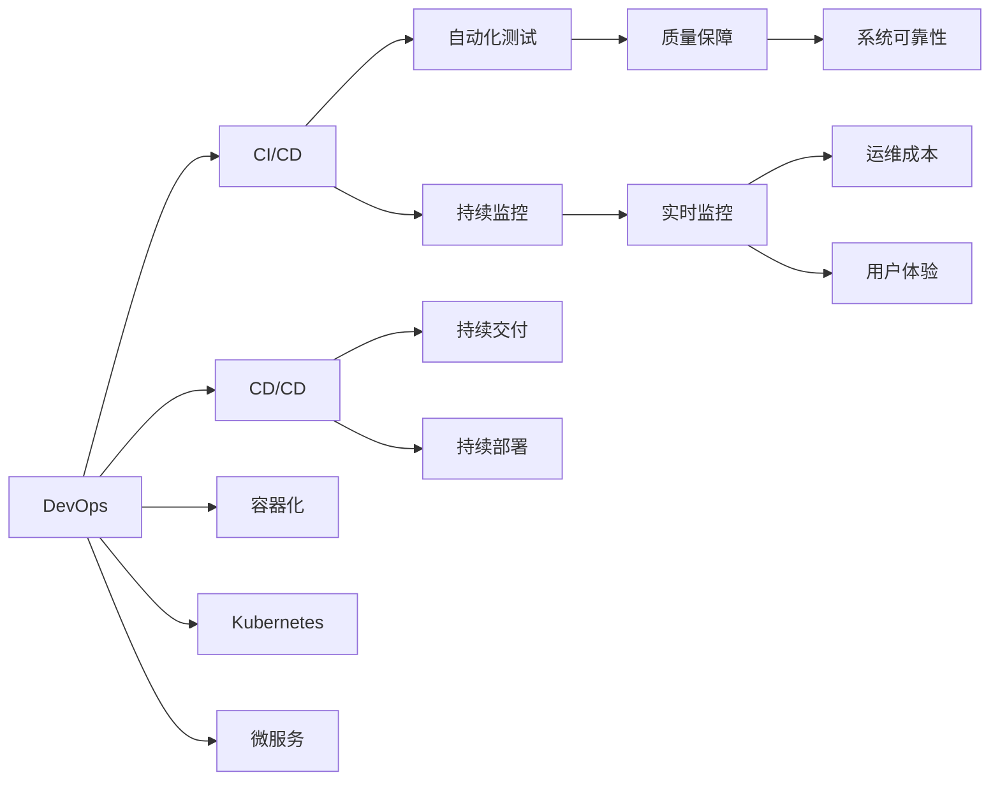

                 

# 软件2.0的DevOps实践与工具链

> 关键词：DevOps, CI/CD, 容器化, Kubernetes, 自动化, 持续交付, 软件2.0

## 1. 背景介绍

### 1.1 问题由来

随着软件产业的迅猛发展，DevOps（Development and Operations，开发与运维）已成为现代软件工程不可或缺的一部分。DevOps倡导将开发和运维两个环节紧密结合，通过持续集成（Continuous Integration, CI）、持续交付（Continuous Delivery, CD）、持续监控（Continuous Monitoring, CM）等技术，提高软件交付效率和质量，缩短开发周期，提升用户体验。

传统软件工程中，开发和运维环节分离，导致沟通不畅、反馈延迟、问题定位困难等问题。而DevOps通过自动化和协作，实现了快速迭代、实时反馈、持续优化，使软件工程从“以开发为中心”转变为“以交付为中心”。

然而，DevOps的实现并非一蹴而就。它需要企业在组织文化、技术栈、工具链等方面进行全面升级。本文将介绍DevOps的核心概念、关键实践、以及实用的工具链，以期为读者提供全面、系统、实用的DevOps实践指南。

### 1.2 问题核心关键点

DevOps的核心在于将开发和运维紧密结合，实现快速、可靠、高效的软件交付。其核心关键点包括：

1. 自动化：通过自动化工具链，实现持续集成和持续交付。
2. 持续监控：实时监控系统运行状态，及时发现和解决问题。
3. 协作文化：鼓励跨部门沟通协作，形成“开发运维一体”的文化。
4. 标准化流程：建立标准化的开发和运维流程，提升整体效率。
5. 质量保证：通过自动化测试和质量保障，提升软件质量和用户体验。

DevOps的实践，不仅改变了软件开发和运维的方式，更推动了整个软件产业的数字化转型，加速了新应用的推出，提升了企业的竞争力和市场响应速度。

### 1.3 问题研究意义

DevOps技术的应用，对于提升软件开发和运维效率，缩短产品上市时间，降低运维成本，提升系统可靠性和用户体验，具有重要意义：

1. 提升交付速度：通过自动化流程，加快软件交付速度，缩短上市周期。
2. 提高软件质量：通过持续测试和质量保证，降低缺陷率，提升用户满意度。
3. 降低运维成本：通过自动化工具，减少人工干预，降低运维成本。
4. 优化团队协作：通过协作工具，促进开发和运维团队的有效沟通和协作。
5. 提升系统可靠性：通过持续监控和自动化修复，减少系统故障，提升用户信任。

随着云计算、微服务、容器化等新兴技术的发展，DevOps的应用场景更加广泛，其对软件工程的推动作用也日益凸显。

## 2. 核心概念与联系

### 2.1 核心概念概述

为更好地理解DevOps实践，本节将介绍几个关键概念及其相互关系：

- DevOps：一种以自动化、协作和文化为核心的软件工程实践。
- CI/CD：持续集成和持续交付，通过自动化流程提高软件交付效率。
- CD/CD：持续交付和持续部署，通过自动化流程实现快速部署。
- 容器化：将应用打包到容器中，实现跨平台、高可靠性和高效部署。
- Kubernetes：开源容器编排系统，提供强大的资源管理、调度和服务发现功能。
- 微服务：将应用拆分为多个独立的服务，提高系统的可扩展性和可靠性。
- 自动化测试：通过自动化测试工具，实现高效、全面的软件质量保障。
- 持续监控：实时监控系统运行状态，及时发现和解决问题，提升系统可靠性。
- 质量保障（QA）：通过自动化测试、代码审查、性能测试等手段，提升软件质量。
- DevSecOps：将安全融入DevOps流程，保障软件安全。
- 基础设施即代码（IaC）：通过代码形式描述和自动化管理基础设施，提高资源利用效率。

这些概念之间有着紧密的联系，共同构成了DevOps的完整实践框架。接下来，我们将详细探讨这些概念的核心原理和架构。

### 2.2 概念间的关系

通过以下Mermaid流程图，我们可以更清晰地理解DevOps各概念之间的关系：



这个流程图展示了DevOps中各个核心概念的关系。通过持续集成和持续交付，开发和运维团队可以协同工作，高效交付高质量的软件。容器化、微服务、Kubernetes等技术，提供了强大的部署和管理能力，提高了系统的可扩展性和可靠性。持续监控和自动化测试，保障了系统的稳定性和质量，提升了用户体验和系统可靠性。

## 3. 核心算法原理 & 具体操作步骤

### 3.1 算法原理概述

DevOps的核心算法原理主要体现在以下几个方面：

1. 自动化：通过自动化工具链，实现持续集成和持续交付，减少人工干预，提高交付效率。
2. 持续监控：通过实时监控工具，监测系统运行状态，及时发现和解决问题，保障系统稳定性。
3. 协作文化：通过协作工具，促进开发和运维团队的有效沟通和协作，提升团队协作效率。
4. 标准化流程：通过标准化的开发和运维流程，提升整体效率和质量，降低错误率。
5. 质量保障：通过自动化测试和质量保障工具，提升软件质量和用户体验。

这些原理共同构成了DevOps的核心算法框架，使得软件交付过程更加高效、可靠和可控。

### 3.2 算法步骤详解

以下，我们将详细介绍DevOps实践中的关键步骤和具体操作步骤：

**Step 1: 定义DevOps流程**

- 定义开发流程：包括需求分析、代码编写、单元测试、集成测试等。
- 定义运维流程：包括环境搭建、部署、监控、回滚等。

**Step 2: 选择合适的工具**

- 选择CI工具：如Jenkins、Travis CI、GitHub Actions等。
- 选择CD工具：如Jenkins、CircleCI、Bamboo等。
- 选择容器化工具：如Docker、Kubernetes等。
- 选择监控工具：如Prometheus、Grafana、ELK Stack等。

**Step 3: 实现自动化流程**

- 集成代码：将代码集成到CI系统，自动触发构建和测试。
- 自动化测试：通过自动化测试工具，实现代码级和系统级的全面测试。
- 自动化部署：通过容器化和CD工具，实现快速部署和回滚。
- 自动化监控：通过持续监控工具，实时监测系统运行状态，及时发现和解决问题。

**Step 4: 建立协作文化**

- 使用协作工具：如Slack、Confluence、Trello等，促进团队沟通和协作。
- 进行代码审查：通过代码审查工具，如GitHub、Bitbucket等，提升代码质量。
- 进行持续反馈：通过持续反馈机制，及时解决问题，优化流程。

**Step 5: 质量保障**

- 自动化测试：通过自动化测试工具，提升测试效率和覆盖率。
- 持续集成：通过CI系统，实现代码集成和构建自动化。
- 持续部署：通过CD系统，实现快速、可靠、高效的软件交付。

**Step 6: 持续监控**

- 实时监控：通过持续监控工具，实时监测系统运行状态。
- 问题定位：通过日志分析、告警机制，快速定位和解决问题。
- 性能优化：通过性能监控，优化系统性能，提升用户体验。

**Step 7: 持续改进**

- 定期回顾：定期回顾DevOps流程，总结经验教训，不断改进。
- 持续优化：根据反馈和问题，持续优化流程和工具。
- 持续学习：不断学习新技术和新工具，提升团队能力。

通过以上步骤，企业可以全面实现DevOps实践，提升软件交付效率和质量，降低运维成本，提升用户体验和系统可靠性。

### 3.3 算法优缺点

DevOps实践的优点包括：

1. 提高交付效率：通过自动化流程，快速交付高质量软件。
2. 降低运维成本：通过自动化工具，减少人工干预，降低运维成本。
3. 提升系统可靠性：通过持续监控和自动化修复，减少系统故障，提升用户信任。
4. 优化团队协作：通过协作工具，促进开发和运维团队的有效沟通和协作。
5. 提升质量保障：通过自动化测试和质量保障工具，提升软件质量和用户体验。

DevOps实践的缺点包括：

1. 需要大量投入：实现DevOps需要大量资源和人力投入，初期成本较高。
2. 流程复杂：DevOps流程涉及多个环节，管理复杂，需要细致规划和组织。
3. 工具依赖：DevOps实践高度依赖于各种工具和插件，需要定期更新和维护。
4. 风险管理：DevOps实践涉及自动部署和持续交付，需要严格的风险管理策略。
5. 文化变革：DevOps需要企业内部文化的变革，需要全员参与和支持。

尽管存在这些缺点，DevOps仍被广泛认为是提升软件交付效率和质量的有效手段，值得企业投入资源进行实践。

### 3.4 算法应用领域

DevOps实践广泛应用于软件开发、运维、测试、部署等多个环节，具体应用领域包括：

1. 软件开发：包括需求分析、设计、编码、测试等。
2. 运维管理：包括环境搭建、部署、监控、回滚等。
3. 测试自动化：包括单元测试、集成测试、系统测试等。
4. 持续交付：通过自动化流程，实现快速、可靠、高效的软件交付。
5. 系统可靠性：通过持续监控和自动化修复，提升系统可靠性和用户体验。
6. 安全保障：通过DevSecOps，保障软件安全。
7. 数据治理：通过IaC工具，提升数据治理效率和质量。

通过DevOps实践，企业可以显著提升软件交付效率和质量，降低运维成本，提升用户体验和系统可靠性。

## 4. 数学模型和公式 & 详细讲解 & 举例说明

### 4.1 数学模型构建

DevOps的核心算法原理涉及自动化、协作、质量保障等多个方面，可以通过数学模型进行建模和分析。以下是几个核心模型的构建：

**模型1：持续集成和持续交付（CI/CD）**

$$
CI/CD = \{Auto Build, Auto Test, Auto Deploy, Auto Rollback\}
$$

其中，Auto Build表示自动化构建，Auto Test表示自动化测试，Auto Deploy表示自动化部署，Auto Rollback表示自动化回滚。

**模型2：持续监控（CM）**

$$
CM = \{Real-Time Monitoring, Log Analysis, Alerts\}
$$

其中，Real-Time Monitoring表示实时监控，Log Analysis表示日志分析，Alerts表示告警机制。

**模型3：质量保障（QA）**

$$
QA = \{Automated Testing, Code Review, Performance Testing\}
$$

其中，Automated Testing表示自动化测试，Code Review表示代码审查，Performance Testing表示性能测试。

### 4.2 公式推导过程

以下，我们将对上述模型的公式推导过程进行详细讲解：

**模型1：持续集成和持续交付（CI/CD）**

假设开发流程中的每个环节耗时为 $t_i$，总耗时为 $T$，则持续集成和持续交付的效率可以表示为：

$$
\text{Efficiency} = \frac{T}{\sum_{i=1}^{n} t_i}
$$

其中 $n$ 为开发流程中的环节数。

**模型2：持续监控（CM）**

假设系统的故障率为 $f$，修复时间为 $t_r$，监控频率为 $m$，则系统的可靠性可以表示为：

$$
\text{Reliability} = (1 - f) \times (1 - m \times t_r)
$$

**模型3：质量保障（QA）**

假设代码缺陷率为 $d$，测试覆盖率为 $c$，则软件的质量可以表示为：

$$
\text{Quality} = (1 - d) \times c
$$

通过以上数学模型，我们可以更清晰地理解DevOps实践中的关键步骤和操作步骤，以及各个环节对整体效率和质量的影响。

### 4.3 案例分析与讲解

以下，我们将通过一个具体案例，展示DevOps实践在企业中的应用。

**案例：某电商公司的DevOps实践**

某电商公司采用DevOps实践，实现了快速、可靠的软件交付。其主要步骤如下：

1. 定义开发流程：包括需求分析、设计、编码、测试等环节，通过CI工具自动集成和构建。
2. 定义运维流程：包括环境搭建、部署、监控、回滚等环节，通过CD工具自动部署和回滚。
3. 实现自动化测试：通过自动化测试工具，提升测试效率和覆盖率。
4. 实现持续监控：通过持续监控工具，实时监测系统运行状态，及时发现和解决问题。
5. 建立协作文化：通过协作工具，促进开发和运维团队的有效沟通和协作。
6. 质量保障：通过自动化测试和代码审查，提升代码质量和软件质量。

通过以上步骤，该电商公司实现了快速、可靠的软件交付，显著提升了用户体验和系统可靠性。

## 5. 项目实践：代码实例和详细解释说明

### 5.1 开发环境搭建

在进行DevOps实践前，我们需要准备好开发环境。以下是使用Docker和Kubernetes搭建DevOps环境的步骤：

1. 安装Docker：从官网下载并安装Docker，用于构建和管理容器镜像。
2. 安装Kubernetes：从官网下载并安装Kubernetes，用于管理容器集群和调度服务。
3. 安装CI/CD工具：如Jenkins、Travis CI、GitHub Actions等，用于持续集成和持续交付。
4. 安装监控工具：如Prometheus、Grafana、ELK Stack等，用于实时监控系统运行状态。

完成上述步骤后，即可在Docker和Kubernetes环境中开始DevOps实践。

### 5.2 源代码详细实现

这里我们以Jenkins为例，展示如何使用Jenkins实现持续集成和持续交付。

**第一步：安装Jenkins**

```bash
sudo apt-get update
sudo apt-get install jenkins
sudo systemctl start jenkins
```

**第二步：配置Jenkins**

1. 安装插件：在Jenkins中安装必要的插件，如Maven、Git等。
2. 配置系统环境：配置Jenkins的系统环境，如Maven、JDK、Jenkins Pipeline等。
3. 配置源代码：将源代码上传到Jenkins，配置SCM插件，指定Git仓库地址和分支。

**第三步：编写Jenkins Pipeline**

以下是一个简单的Jenkins Pipeline代码示例：

```groovy
pipeline {
    agent any
    stages {
        stage('Build') {
            steps {
                withMaven {
                    // 配置Maven环境
                }
                sh 'mvn clean install'
            }
        }
        stage('Test') {
            steps {
                sh 'mvn test'
            }
        }
        stage('Deploy') {
            steps {
                withMaven {
                    // 配置Maven环境
                }
                sh 'mvn spring-boot:run'
            }
        }
    }
}
```

**第四步：运行Jenkins Pipeline**

通过Jenkins Pipeline，可以实现持续集成和持续交付，具体步骤如下：

1. 在Jenkins中配置 Pipeline，指定代码地址和分支。
2. 提交代码到Git仓库，触发Pipeline运行。
3. Jenkins会自动执行Pipeline，包括构建、测试、部署等步骤。
4. 通过持续监控工具，实时监测Pipeline运行状态，及时发现和解决问题。

### 5.3 代码解读与分析

让我们再详细解读一下关键代码的实现细节：

**Pipeline脚本**：
- `pipeline` 表示Jenkins Pipeline。
- `agent any` 表示可以使用任意代理执行Pipeline。
- `stages` 表示Pipeline的多个阶段，包括构建、测试、部署等。
- `steps` 表示每个阶段的执行步骤，包括Maven配置、构建、测试、部署等。

**代码执行流程**：
1. Jenkins通过SCM插件获取Git仓库的最新代码。
2. Jenkins自动执行Pipeline，包括构建、测试、部署等步骤。
3. Jenkins通过持续监控工具，实时监测Pipeline运行状态，及时发现和解决问题。
4. Jenkins Pipeline通过自动化流程，实现快速、可靠、高效的软件交付。

### 5.4 运行结果展示

假设我们有一个简单的Spring Boot应用，通过Jenkins Pipeline实现持续集成和持续交付。运行Pipeline后，我们观察到以下结果：

1. Jenkins自动构建应用，生成jar包。
2. Jenkins自动运行单元测试，生成测试报告。
3. Jenkins自动部署应用到生产环境。
4. Jenkins通过监控工具，实时监测应用运行状态。

## 6. 实际应用场景

### 6.1 软件开发

DevOps实践在软件开发中的应用主要体现在以下几个方面：

1. 需求分析：通过DevOps工具，实现需求自动化管理，提升需求分析效率。
2. 设计编码：通过DevOps工具，实现设计自动化和代码自动化，提升设计编码效率。
3. 测试自动化：通过DevOps工具，实现自动化测试，提升测试效率和覆盖率。
4. 持续交付：通过DevOps工具，实现持续交付，提升软件交付效率。
5. 质量保障：通过DevOps工具，实现质量保障，提升软件质量。

### 6.2 运维管理

DevOps实践在运维管理中的应用主要体现在以下几个方面：

1. 环境搭建：通过DevOps工具，实现自动化环境搭建，提升环境搭建效率。
2. 部署管理：通过DevOps工具，实现自动化部署和回滚，提升部署管理效率。
3. 监控告警：通过DevOps工具，实现实时监控和告警，提升系统可靠性。
4. 故障处理：通过DevOps工具，实现自动化故障处理，提升故障处理效率。
5. 资源管理：通过DevOps工具，实现资源管理，提升资源利用效率。

### 6.3 测试自动化

DevOps实践在测试自动化中的应用主要体现在以下几个方面：

1. 单元测试：通过DevOps工具，实现自动化单元测试，提升测试效率。
2. 集成测试：通过DevOps工具，实现自动化集成测试，提升测试覆盖率。
3. 系统测试：通过DevOps工具，实现自动化系统测试，提升测试效率。
4. 性能测试：通过DevOps工具，实现自动化性能测试，提升性能保障。
5. 质量保障：通过DevOps工具，实现质量保障，提升软件质量。

### 6.4 持续交付

DevOps实践在持续交付中的应用主要体现在以下几个方面：

1. 持续集成：通过DevOps工具，实现持续集成，提升软件交付效率。
2. 持续部署：通过DevOps工具，实现持续部署，提升软件部署效率。
3. 自动化测试：通过DevOps工具，实现自动化测试，提升软件质量。
4. 持续监控：通过DevOps工具，实现持续监控，提升系统可靠性。
5. 持续反馈：通过DevOps工具，实现持续反馈，提升软件交付质量。

### 6.5 系统可靠性

DevOps实践在系统可靠性中的应用主要体现在以下几个方面：

1. 实时监控：通过DevOps工具，实现实时监控，及时发现系统问题。
2. 告警机制：通过DevOps工具，实现告警机制，及时通知运维团队。
3. 故障处理：通过DevOps工具，实现自动化故障处理，提升故障处理效率。
4. 性能优化：通过DevOps工具，实现性能优化，提升系统性能。
5. 系统安全：通过DevOps工具，实现系统安全保障，提升系统安全性。

### 6.6 未来应用展望

随着DevOps技术的不断演进，其在软件开发和运维中的应用将更加广泛和深入。以下是未来应用展望：

1. 全栈DevOps：实现软件开发、运维、测试、安全等全栈DevOps实践，提升整体效率和质量。
2. DevSecOps：将安全融入DevOps流程，保障软件安全，提升系统可靠性。
3. 无服务器架构：采用无服务器架构，提高资源利用效率，降低运维成本。
4. 微服务架构：采用微服务架构，提升系统可扩展性和可靠性。
5. 云原生DevOps：采用云原生技术，提升云上部署效率和可靠性。
6. 人工智能：将人工智能融入DevOps实践，提升软件交付效率和质量。

## 7. 工具和资源推荐

### 7.1 学习资源推荐

为了帮助开发者系统掌握DevOps实践的理论基础和实践技巧，这里推荐一些优质的学习资源：

1. DevOps相关书籍：如《DevOps实践指南》、《持续交付：构建高质量的软件实践》等。
2. DevOps在线课程：如Coursera、Udemy、edX等平台上的DevOps课程，提供系统化的学习路径。
3. DevOps博客和社区：如DZone、DevOpsDays、GitHub等社区，提供最新的DevOps资讯和案例。
4. DevOps技术博客：如Docker、Kubernetes等官方博客，提供最新的DevOps技术和最佳实践。
5. DevOps技术白皮书：如Docker、Kubernetes等技术白皮书，提供全面的DevOps技术介绍。

通过对这些资源的学习实践，相信你一定能够快速掌握DevOps实践的精髓，并用于解决实际的DevOps问题。

### 7.2 开发工具推荐

为了帮助开发者更高效地进行DevOps实践，以下是几款实用的开发工具：

1. Jenkins：开源的持续集成工具，支持CI/CD流程，具有强大的插件生态系统。
2. Docker：开源的容器化工具，支持跨平台部署，具有强大的容器管理能力。
3. Kubernetes：开源的容器编排系统，提供强大的资源管理和调度功能。
4. Prometheus：开源的监控工具，提供实时的系统监控和告警功能。
5. Grafana：开源的可视化工具，支持多维度数据展示和告警。
6. ELK Stack：开源的日志管理和分析工具，支持实时日志收集和分析。

通过这些工具的组合使用，可以大大提升DevOps实践的效率和质量，实现快速、可靠、高效的软件交付。

### 7.3 相关论文推荐

DevOps技术的演进涉及大量的研究和实践，以下是几篇奠基性的相关论文，推荐阅读：

1. Continuous Integration: Software Development and Maintenance: A Failure Study（Cacchiani & Tailor, 1994）：首次提出持续集成（CI）的概念，探讨了持续集成在软件开发中的应用。
2. Continuous Deployment and Operational Support: A Study of Parallel Architecture（Campbell & Fowler, 2006）：探讨了持续交付（CD）在软件开发中的应用，提出了并行架构的设计。
3. The State of the Art of Software Testing（Cockburn & Myers, 2003）：探讨了软件测试的发展趋势和未来方向，强调了自动化测试的重要性。
4. The Pragmatic Programmer: From Journeyman to Master（Andrew Hunt & David Thomas, 1997）：介绍了一系列的编程实践和技巧，包括持续集成和持续交付。
5. Continuous Delivery: Reliable Software Releases through Automated Builds and Deployments（Martin Fowler, 2006）：探讨了持续交付（CD）在软件开发中的应用，提出了持续交付的实践。

这些论文代表了大规模DevOps技术的发展脉络。通过学习这些前沿成果，可以帮助研究者把握学科前进方向，激发更多的创新灵感。

除上述资源外，还有一些值得关注的前沿资源，帮助开发者紧跟DevOps技术的最新进展，例如：

1. DevOps博客和社区：如DZone、DevOpsDays、GitHub等社区，提供最新的DevOps资讯和案例。
2. DevOps技术博客：如Docker、Kubernetes等官方博客，提供最新的DevOps技术和最佳实践。
3. DevOps技术白皮书：如Docker、Kubernetes等技术白皮书，提供全面的DevOps技术介绍。

总之，对于DevOps实践的学习和实践，需要开发者保持开放的心态和持续学习的意愿。多关注前沿资讯，多动手实践，多思考总结，必将收获满满的成长收益。

## 8. 总结：未来发展趋势与挑战

### 8.1 总结

本文对DevOps的核心概念、关键实践、以及实用的工具链进行了全面系统的介绍。通过系统梳理，我们可以看到DevOps实践在提升软件开发和运维效率、降低运维成本、提升用户体验和系统可靠性方面的巨大潜力。

DevOps技术的应用，使得软件交付过程更加高效、可靠和可控，大大提升了软件工程的整体效率和质量。随着云计算、微服务、容器化等新兴技术的发展，DevOps的应用场景更加广泛，其对软件工程的推动作用也日益凸显。

### 8.2 未来发展趋势

展望未来，DevOps技术将呈现以下几个发展趋势：

1. 全栈DevOps：实现软件开发、运维、测试、安全等全栈DevOps实践，提升整体效率和质量。
2. DevSecOps：将安全融入DevOps流程，保障软件安全，提升系统可靠性。
3. 无服务器架构：采用无服务器架构，提高资源利用效率，降低运维成本。
4. 微服务架构：采用微服务架构，提升系统可扩展性和可靠性。
5. 云原生DevOps：采用云原生技术，提升云上部署效率和可靠性。
6. 人工智能：将人工智能融入DevOps实践，提升软件交付效率和质量。

以上趋势凸显了DevOps技术的广阔前景。这些方向的探索发展，必将进一步提升DevOps实践的效率和质量，为软件开发和

