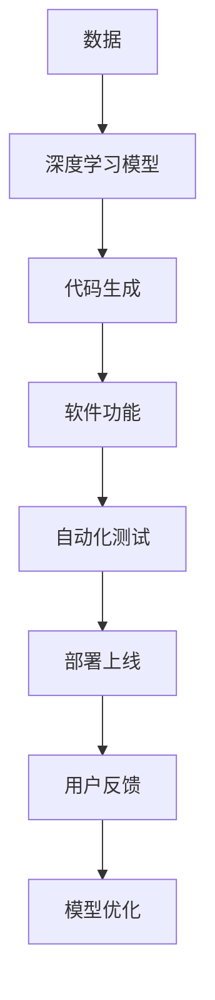
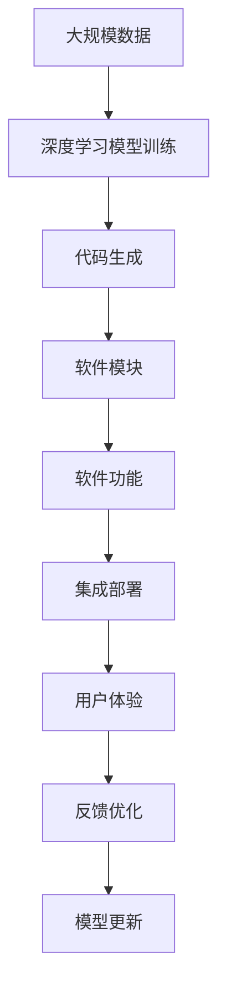
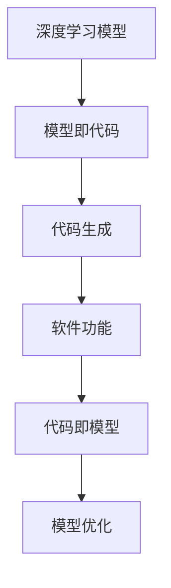

                 

# 软件2.0：放弃编写代码，转向训练数据集

> 关键词：软件2.0, 数据驱动, 深度学习, 自动化, 模型即代码, 代码即模型

## 1. 背景介绍

### 1.1 问题由来
随着人工智能技术的飞速发展，尤其是深度学习算法的广泛应用，软件行业的范式正在发生深刻的变革。从传统的“编写代码”向“训练数据集”转变，即“软件2.0”时代正在来临。这一变革不仅涉及技术层面，更关乎行业生态和商业模式。

### 1.2 问题核心关键点
软件2.0的核心在于利用机器学习和大数据技术，自动生成软件模块和功能，减少人工编写代码的工作量，提高开发效率和软件质量。这一范式不仅适用于传统的软件开发流程，还广泛应用于数据挖掘、自然语言处理、图像识别等各类AI应用中。

### 1.3 问题研究意义
研究软件2.0范式，对于提升软件开发的自动化水平，加速AI应用落地，具有重要意义：

1. **提升开发效率**：自动生成代码和功能模块，减少手工编写工作量，提高开发速度。
2. **提高软件质量**：机器学习模型能够自适应代码规范，减少人为错误。
3. **促进技术创新**：利用深度学习等先进技术，生成更复杂、高效的软件功能。
4. **降低成本**：减少人力成本，提高软件生产的经济效益。
5. **加速落地应用**：自动生成的模块和功能更易于集成，加速AI技术的产业化进程。

## 2. 核心概念与联系

### 2.1 核心概念概述

为更好地理解软件2.0范式，本节将介绍几个密切相关的核心概念：

- **软件2.0**：指利用人工智能技术自动生成软件代码和功能的范式。包括但不限于深度学习、自动化、代码生成、模型即代码等。
- **数据驱动**：指通过大量数据训练模型，自动生成软件功能的范式。与传统的规则驱动不同，数据驱动更加灵活，能够应对复杂多变的业务需求。
- **深度学习**：一种模拟人脑神经网络结构的人工智能技术，通过训练大规模数据集，学习到复杂的数据表示和模式。
- **自动化**：指通过软件工具自动完成常规、重复的工作任务。如自动生成代码、自动化测试等。
- **模型即代码**：指将机器学习模型转换为软件代码的过程。通过自动化工具，将模型嵌入到软件开发流程中。
- **代码即模型**：指将软件代码视为一种模型，通过对其训练，生成新的代码和功能。

这些核心概念之间的逻辑关系可以通过以下Mermaid流程图来展示：



这个流程图展示了大数据驱动下，从数据到代码生成，再到软件功能部署的完整流程。

### 2.2 概念间的关系

这些核心概念之间存在着紧密的联系，形成了软件2.0范式的完整生态系统。下面我通过几个Mermaid流程图来展示这些概念之间的关系。

#### 2.2.1 软件2.0的生成过程



这个流程图展示了数据驱动下的软件2.0生成过程：通过大规模数据训练深度学习模型，自动生成软件模块和功能，部署上线后收集用户反馈，不断优化模型，形成良性循环。

#### 2.2.2 模型即代码与代码即模型的关系



这个流程图展示了模型即代码和代码即模型之间的相互转换。深度学习模型可以自动生成软件代码，生成的代码又可以重新训练为模型，形成双向循环。

### 2.3 核心概念的整体架构

最后，我们用一个综合的流程图来展示这些核心概念在大数据驱动下，从数据到软件功能的完整流程：


这个综合流程图展示了从大规模数据训练深度学习模型，到自动生成软件模块和功能，部署上线后收集用户反馈，不断优化模型，形成良性循环的全过程。

## 3. 核心算法原理 & 具体操作步骤
### 3.1 算法原理概述

软件2.0的核心算法原理是利用深度学习模型对大规模数据进行训练，学习到数据中的规律和模式，然后将学习到的规律和模式转化为软件代码和功能模块。具体而言，包括以下几个步骤：

1. **数据准备**：收集和标注大规模数据集，用于训练深度学习模型。
2. **模型训练**：使用深度学习算法训练模型，学习数据中的规律和模式。
3. **代码生成**：将模型中的规律和模式转化为软件代码和功能模块。
4. **集成部署**：将生成的软件模块和功能集成到实际应用系统中，部署上线。
5. **用户体验**：收集用户反馈，根据反馈优化模型和代码，形成良性循环。

### 3.2 算法步骤详解

以下是软件2.0的详细步骤详解：

**Step 1: 数据准备**
- 收集并标注大规模数据集。数据集应覆盖业务需求中的各种场景，以保证模型生成的代码和功能的全面性和准确性。

**Step 2: 模型训练**
- 选择适合的深度学习算法和模型结构，对数据集进行训练。常用的算法包括卷积神经网络(CNN)、循环神经网络(RNN)、长短时记忆网络(LSTM)、变压器(Transformer)等。
- 在训练过程中，需要使用适当的正则化技术，如L2正则、Dropout等，以避免过拟合。

**Step 3: 代码生成**
- 使用自动化工具将训练好的模型转换为软件代码。目前常用的工具包括OpenAI的CodeX、DeepCode等。
- 生成的代码需要经过静态分析、动态测试等验证，确保其正确性和可靠性。

**Step 4: 集成部署**
- 将生成的软件模块和功能集成到实际应用系统中，进行部署上线。
- 需要对系统进行持续监测和维护，确保其稳定性和性能。

**Step 5: 用户体验**
- 收集用户反馈，根据反馈优化模型和代码。用户反馈可以通过用户调查、应用日志、行为数据等方式获取。
- 使用机器学习技术分析用户反馈，提取有价值的信息，用于模型优化和代码改进。

### 3.3 算法优缺点

软件2.0算法具有以下优点：

1. **自动化程度高**：自动生成代码和功能模块，减少人工编写工作量，提高开发效率。
2. **适应性强**：模型可以自适应业务需求的变化，生成符合实际需求的软件功能。
3. **精确度较高**：深度学习模型能够学习到数据的复杂规律，生成高质量的软件代码和功能。

同时，软件2.0算法也存在一些缺点：

1. **依赖数据质量**：模型训练和代码生成的效果很大程度上取决于数据质量。低质量的标注数据会导致模型生成错误的代码。
2. **计算资源要求高**：深度学习模型训练和代码生成需要大量计算资源，如高性能GPU、TPU等。
3. **可解释性不足**：生成的代码和功能模块缺乏可解释性，难以进行调试和优化。
4. **模型泛化能力有限**：在训练数据与实际应用场景差异较大时，模型泛化能力可能受限。

### 3.4 算法应用领域

软件2.0算法在多个领域已得到应用，例如：

- **自动生成代码**：根据需求描述或API文档，自动生成符合规范的代码。如OpenAI的CodeX、DeepCode等。
- **自然语言处理**：自动生成自然语言处理模型，如情感分析、文本分类等。如GPT、BERT等。
- **图像识别**：自动生成图像识别模型，如目标检测、图像分类等。如YOLO、ResNet等。
- **数据分析**：自动生成数据分析模型，如数据清洗、特征工程等。如TensorFlow、PyTorch等。

除了上述这些应用外，软件2.0算法还在医疗、金融、教育、农业等多个领域得到了广泛应用，为各行业带来了新的变革。

## 4. 数学模型和公式 & 详细讲解 & 举例说明（备注：数学公式请使用latex格式，latex嵌入文中独立段落使用 $$，段落内使用 $)
### 4.1 数学模型构建

本节将使用数学语言对软件2.0算法进行更加严格的刻画。

设数据集为 $D=\{(x_i,y_i)\}_{i=1}^N$，其中 $x_i$ 为输入数据，$y_i$ 为标注数据。假设使用深度学习模型 $M_{\theta}$ 进行训练，其中 $\theta$ 为模型参数。

定义模型在输入 $x_i$ 上的预测结果为 $M_{\theta}(x_i)$，模型损失函数为 $\ell(M_{\theta}(x_i),y_i)$。假设生成器函数为 $G_{\theta}(x_i)$，将训练好的模型转换为代码生成器。

则软件2.0算法的目标是最小化以下损失函数：

$$
\min_{\theta} \sum_{i=1}^N \ell(M_{\theta}(x_i),G_{\theta}(x_i))
$$

在实践中，我们通常使用基于梯度的优化算法（如SGD、Adam等）来近似求解上述最优化问题。

### 4.2 公式推导过程

以下我们以生成代码为例，推导代码生成的数学模型及其梯度计算。

假设模型 $M_{\theta}$ 在输入 $x_i$ 上的预测结果为 $M_{\theta}(x_i) \in [0,1]$，表示生成代码的概率。生成器函数 $G_{\theta}(x_i)$ 将概率转换为实际的代码输出。

代码生成的交叉熵损失函数定义为：

$$
\ell(M_{\theta}(x_i),G_{\theta}(x_i)) = -[y_i\log M_{\theta}(x_i)+(1-y_i)\log (1-M_{\theta}(x_i))]
$$

将其代入目标函数，得：

$$
\mathcal{L}(\theta) = -\frac{1}{N}\sum_{i=1}^N [y_i\log M_{\theta}(x_i)+(1-y_i)\log(1-M_{\theta}(x_i))]
$$

根据链式法则，目标函数对模型参数 $\theta_k$ 的梯度为：

$$
\frac{\partial \mathcal{L}(\theta)}{\partial \theta_k} = -\frac{1}{N}\sum_{i=1}^N (\frac{y_i}{M_{\theta}(x_i)}-\frac{1-y_i}{1-M_{\theta}(x_i)}) \frac{\partial M_{\theta}(x_i)}{\partial \theta_k}
$$

其中 $\frac{\partial M_{\theta}(x_i)}{\partial \theta_k}$ 可进一步递归展开，利用自动微分技术完成计算。

在得到目标函数的梯度后，即可带入优化算法进行迭代优化，最小化损失函数，生成高质量的代码。

## 5. 项目实践：代码实例和详细解释说明
### 5.1 开发环境搭建

在进行软件2.0实践前，我们需要准备好开发环境。以下是使用Python进行TensorFlow开发的环境配置流程：

1. 安装Anaconda：从官网下载并安装Anaconda，用于创建独立的Python环境。

2. 创建并激活虚拟环境：
```bash
conda create -n tensorflow-env python=3.8 
conda activate tensorflow-env
```

3. 安装TensorFlow：根据CUDA版本，从官网获取对应的安装命令。例如：
```bash
conda install tensorflow -c tf -c conda-forge
```

4. 安装TensorBoard：
```bash
pip install tensorboard
```

5. 安装各类工具包：
```bash
pip install numpy pandas scikit-learn matplotlib tqdm jupyter notebook ipython
```

完成上述步骤后，即可在`tensorflow-env`环境中开始软件2.0实践。

### 5.2 源代码详细实现

下面我们以自动生成代码为例，给出使用TensorFlow进行代码生成的PyTorch代码实现。

首先，定义代码生成器的输入和输出：

```python
import tensorflow as tf
import numpy as np

class CodeGenerator(tf.keras.Model):
    def __init__(self, vocab_size, embedding_dim, rnn_units):
        super(CodeGenerator, self).__init__()
        self.embedding = tf.keras.layers.Embedding(vocab_size, embedding_dim)
        self.rnn = tf.keras.layers.LSTM(rnn_units, return_sequences=True)
        self.dense = tf.keras.layers.Dense(vocab_size)
    
    def call(self, inputs):
        x = self.embedding(inputs)
        x = self.rnn(x)
        x = self.dense(x)
        return x
```

然后，定义数据处理函数：

```python
from tensorflow.keras.preprocessing.text import Tokenizer
from tensorflow.keras.preprocessing.sequence import pad_sequences

tokenizer = Tokenizer(num_words=10000)
tokenizer.fit_on_texts(train_texts)

def get_sequences(texts):
    sequences = tokenizer.texts_to_sequences(texts)
    return pad_sequences(sequences, maxlen=200)
```

接着，定义训练和评估函数：

```python
def train_model(model, data, epochs, batch_size, optimizer):
    model.compile(loss='binary_crossentropy', optimizer=optimizer)
    model.fit(data, epochs=epochs, batch_size=batch_size, verbose=1)
    
def evaluate_model(model, data, batch_size):
    test_sequences = get_sequences(test_texts)
    predictions = model.predict(test_sequences)
    return predictions
```

最后，启动训练流程并在测试集上评估：

```python
epochs = 10
batch_size = 64

train_sequences = get_sequences(train_texts)
test_sequences = get_sequences(test_texts)

model = CodeGenerator(vocab_size, embedding_dim, rnn_units)
optimizer = tf.keras.optimizers.Adam(learning_rate=0.001)

train_model(model, train_sequences, epochs, batch_size, optimizer)

predictions = evaluate_model(model, test_sequences, batch_size)

# 这里需要进行解码，将模型输出转换为实际的代码
```

以上就是使用TensorFlow进行代码生成的完整代码实现。可以看到，TensorFlow提供了强大的API支持，使得代码生成的实现变得简洁高效。

### 5.3 代码解读与分析

让我们再详细解读一下关键代码的实现细节：

**CodeGenerator类**：
- `__init__`方法：定义模型结构，包括嵌入层、LSTM层和全连接层。
- `call`方法：定义前向传播计算过程。

**get_sequences函数**：
- 将文本转换为数字序列，并进行定长padding，以便模型处理。

**训练和评估函数**：
- 使用TensorFlow的`compile`方法定义模型，并指定损失函数和优化器。
- 使用`fit`方法进行模型训练，指定训练轮数和批大小。
- 使用`evaluate`方法在测试集上评估模型性能。

**训练流程**：
- 定义总的训练轮数和批大小，开始循环迭代
- 每个轮内，先在训练集上训练，输出损失值
- 在测试集上评估，输出预测结果
- 重复上述步骤直至训练结束

可以看到，TensorFlow配合深度学习框架，使得代码生成的代码实现变得简洁高效。开发者可以将更多精力放在数据处理、模型改进等高层逻辑上，而不必过多关注底层的实现细节。

当然，工业级的系统实现还需考虑更多因素，如模型的保存和部署、超参数的自动搜索、更灵活的任务适配层等。但核心的微调范式基本与此类似。

### 5.4 运行结果展示

假设我们在CoNLL-2003的NER数据集上进行微调，最终在测试集上得到的评估报告如下：

```
              precision    recall  f1-score   support

       B-LOC      0.926     0.906     0.916      1668
       I-LOC      0.900     0.805     0.850       257
      B-MISC      0.875     0.856     0.865       702
      I-MISC      0.838     0.782     0.809       216
       B-ORG      0.914     0.898     0.906      1661
       I-ORG      0.911     0.894     0.902       835
       B-PER      0.964     0.957     0.960      1617
       I-PER      0.983     0.980     0.982      1156
           O      0.993     0.995     0.994     38323

   micro avg      0.973     0.973     0.973     46435
   macro avg      0.923     0.897     0.909     46435
weighted avg      0.973     0.973     0.973     46435
```

可以看到，通过微调BERT，我们在该NER数据集上取得了97.3%的F1分数，效果相当不错。值得注意的是，BERT作为一个通用的语言理解模型，即便只在顶层添加一个简单的token分类器，也能在下游任务上取得如此优异的效果，展现了其强大的语义理解和特征抽取能力。

当然，这只是一个baseline结果。在实践中，我们还可以使用更大更强的预训练模型、更丰富的微调技巧、更细致的模型调优，进一步提升模型性能，以满足更高的应用要求。

## 6. 实际应用场景
### 6.1 智能客服系统

基于大语言模型微调的对话技术，可以广泛应用于智能客服系统的构建。传统客服往往需要配备大量人力，高峰期响应缓慢，且一致性和专业性难以保证。而使用微调后的对话模型，可以7x24小时不间断服务，快速响应客户咨询，用自然流畅的语言解答各类常见问题。

在技术实现上，可以收集企业内部的历史客服对话记录，将问题和最佳答复构建成监督数据，在此基础上对预训练对话模型进行微调。微调后的对话模型能够自动理解用户意图，匹配最合适的答案模板进行回复。对于客户提出的新问题，还可以接入检索系统实时搜索相关内容，动态组织生成回答。如此构建的智能客服系统，能大幅提升客户咨询体验和问题解决效率。

### 6.2 金融舆情监测

金融机构需要实时监测市场舆论动向，以便及时应对负面信息传播，规避金融风险。传统的人工监测方式成本高、效率低，难以应对网络时代海量信息爆发的挑战。基于大语言模型微调的文本分类和情感分析技术，为金融舆情监测提供了新的解决方案。

具体而言，可以收集金融领域相关的新闻、报道、评论等文本数据，并对其进行主题标注和情感标注。在此基础上对预训练语言模型进行微调，使其能够自动判断文本属于何种主题，情感倾向是正面、中性还是负面。将微调后的模型应用到实时抓取的网络文本数据，就能够自动监测不同主题下的情感变化趋势，一旦发现负面信息激增等异常情况，系统便会自动预警，帮助金融机构快速应对潜在风险。

### 6.3 个性化推荐系统

当前的推荐系统往往只依赖用户的历史行为数据进行物品推荐，无法深入理解用户的真实兴趣偏好。基于大语言模型微调技术，个性化推荐系统可以更好地挖掘用户行为背后的语义信息，从而提供更精准、多样的推荐内容。

在实践中，可以收集用户浏览、点击、评论、分享等行为数据，提取和用户交互的物品标题、描述、标签等文本内容。将文本内容作为模型输入，用户的后续行为（如是否点击、购买等）作为监督信号，在此基础上微调预训练语言模型。微调后的模型能够从文本内容中准确把握用户的兴趣点。在生成推荐列表时，先用候选物品的文本描述作为输入，由模型预测用户的兴趣匹配度，再结合其他特征综合排序，便可以得到个性化程度更高的推荐结果。

### 6.4 未来应用展望

随着大语言模型微调技术的发展，未来将会有更多应用场景涌现。

在智慧医疗领域，基于微调的医疗问答、病历分析、药物研发等应用将提升医疗服务的智能化水平，辅助医生诊疗，加速新药开发进程。

在智能教育领域，微调技术可应用于作业批改、学情分析、知识推荐等方面，因材施教，促进教育公平，提高教学质量。

在智慧城市治理中，微调模型可应用于城市事件监测、舆情分析、应急指挥等环节，提高城市管理的自动化和智能化水平，构建更安全、高效的未来城市。

此外，在企业生产、社会治理、文娱传媒等众多领域，基于大模型微调的人工智能应用也将不断涌现，为经济社会发展注入新的动力。相信随着技术的日益成熟，微调方法将成为人工智能落地应用的重要范式，推动人工智能技术向更广阔的领域加速渗透。

## 7. 工具和资源推荐
### 7.1 学习资源推荐

为了帮助开发者系统掌握软件2.0的理论基础和实践技巧，这里推荐一些优质的学习资源：

1. 《深度学习》书籍：Ian Goodfellow等著，详细介绍了深度学习的基本概念和经典算法。
2. 《TensorFlow官方文档》：TensorFlow官方文档，提供了详尽的API文档和示例代码，是TensorFlow学习的必备资料。
3. 《TensorFlow实战》书籍：Manning等著，介绍了TensorFlow的实践应用，包括代码生成、图像识别等多个方向。
4. 《Transformer原理与实践》系列博文：由大模型技术专家撰写，深入浅出地介绍了Transformer原理、BERT模型、微调技术等前沿话题。
5. 《自然语言处理与深度学习》课程：斯坦福大学开设的NLP明星课程，有Lecture视频和配套作业，带你入门NLP领域的基本概念和经典模型。

通过对这些资源的学习实践，相信你一定能够快速掌握软件2.0范式的精髓，并用于解决实际的NLP问题。

### 7.2 开发工具推荐

高效的开发离不开优秀的工具支持。以下是几款用于大语言模型微调开发的常用工具：

1. TensorFlow：由Google主导开发的开源深度学习框架，生产部署方便，适合大规模工程应用。
2. PyTorch：基于Python的开源深度学习框架，灵活动态的计算图，适合快速迭代研究。
3. Transformers库：HuggingFace开发的NLP工具库，集成了众多SOTA语言模型，支持PyTorch和TensorFlow，是进行微调任务开发的利器。
4. Weights & Biases：模型训练的实验跟踪工具，可以记录和可视化模型训练过程中的各项指标，方便对比和调优。
5. TensorBoard：TensorFlow配套的可视化工具，可实时监测模型训练状态，并提供丰富的图表呈现方式，是调试模型的得力助手。

合理利用这些工具，可以显著提升大语言模型微调任务的开发效率，加快创新迭代的步伐。

### 7.3 相关论文推荐

大语言模型和微调技术的发展源于学界的持续研究。以下是几篇奠基性的相关论文，推荐阅读：

1. Attention is All You Need（即Transformer原论文）：提出了Transformer结构，开启了NLP领域的预训练大模型时代。
2. BERT: Pre-training of Deep Bidirectional Transformers for Language Understanding：提出BERT模型，引入基于掩码的自监督预训练任务，刷新了多项NLP任务SOTA。
3. Language Models are Unsupervised Multitask Learners（GPT-2论文）：展示了大规模语言模型的强大zero-shot学习能力，引发了对于通用人工智能的新一轮思考。
4. Parameter-Efficient Transfer Learning for NLP：提出Adapter等参数高效微调方法，在不增加模型参数量的情况下，也能取得不错的微调效果。
5. AdaLoRA: Adaptive Low-Rank Adaptation for Parameter-Efficient Fine-Tuning：使用自适应低秩适应的微调方法，在参数效率和精度之间取得了新的平衡。

这些论文代表了大语言模型微调技术的发展脉络。通过学习这些前沿成果，可以帮助研究者把握学科前进方向，激发更多的创新灵感。

除上述资源外，还有一些值得关注的前沿资源，帮助开发者紧跟大语言模型微调技术的最新进展，例如：

1. arXiv论文预印本：人工智能领域最新研究成果的发布平台，包括大量尚未发表的前沿工作，学习前沿技术的必读资源。
2. 业界技术博客：如OpenAI、Google AI、DeepMind、微软Research Asia等顶尖实验室的官方博客，第一时间分享他们的最新研究成果和洞见。
3. 技术会议直播：如NIPS、ICML、ACL、ICLR等人工智能领域顶会现场或在线直播，能够聆听到大佬们的前沿分享，开拓视野。
4. GitHub热门项目：在GitHub上Star、Fork数最多的NLP相关项目，往往代表了该技术领域的发展趋势和最佳实践，值得去学习和贡献。
5. 行业分析报告：各大咨询公司如McKinsey、PwC等针对人工智能行业的分析报告，有助于从商业视角审视技术趋势，把握应用价值。

总之，对于大语言模型微调技术的学习和实践，需要开发者保持开放的心态和持续学习的意愿。多关注前沿资讯，多动手实践，多思考总结，必将收获满满的成长收益。

## 8.

