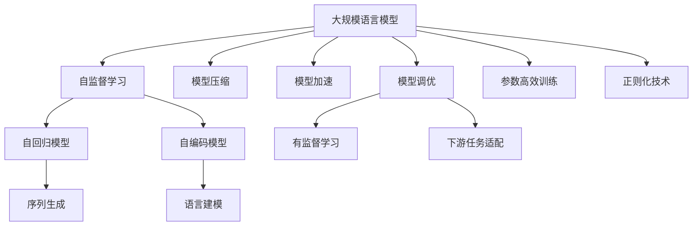
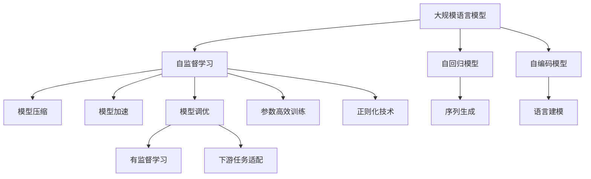
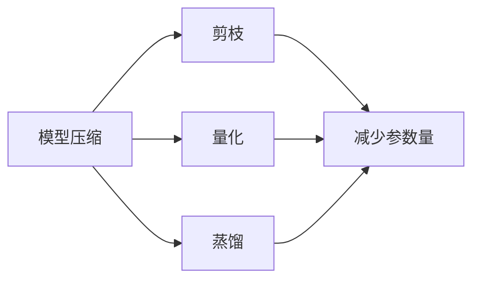
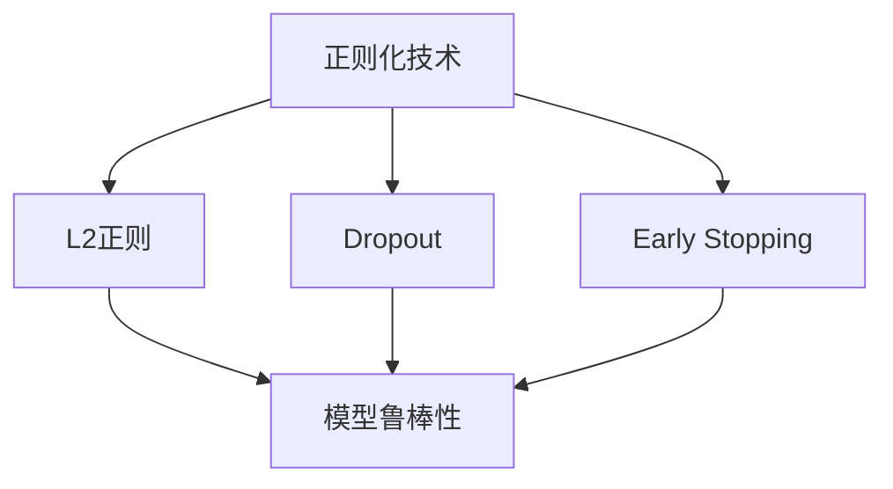
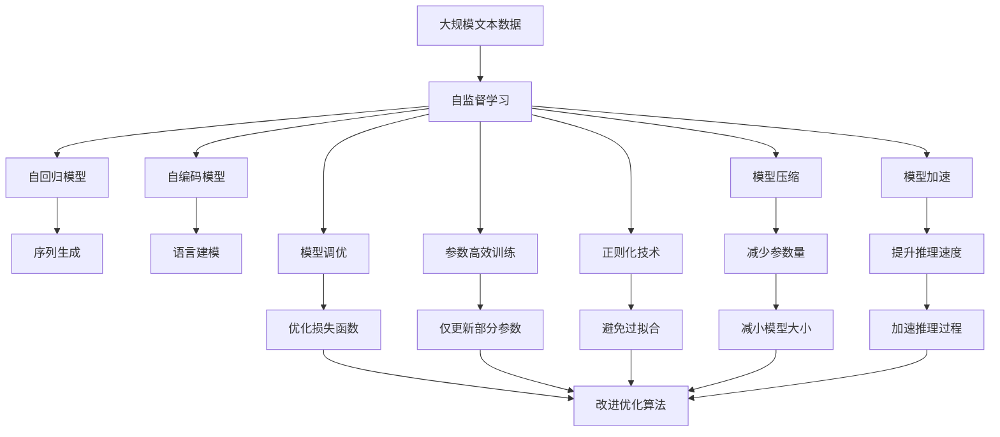

                 

# 大规模语言模型从理论到实践 模型训练

> 关键词：大规模语言模型,模型训练,自监督学习,Transformer,BERT,自回归模型,自编码模型,预训练与微调,模型压缩,模型加速,模型调优

## 1. 背景介绍

### 1.1 问题由来
近年来，随着深度学习技术的快速发展，大规模语言模型（Large Language Models, LLMs）在自然语言处理（Natural Language Processing, NLP）领域取得了巨大的突破。这些大语言模型通过在大规模无标签文本语料上进行预训练，学习到了丰富的语言知识和常识，可以通过少量的有标签样本在下游任务上进行微调，获得优异的性能。其中最具代表性的大语言模型包括OpenAI的GPT系列模型、Google的BERT、T5等。

然而，由于预训练语料的广泛性和泛化能力的不足，这些通用的大语言模型在特定领域应用时，效果往往难以达到实际应用的要求。因此，如何针对特定任务进行大模型微调，提升模型性能，成为了当前大语言模型研究和应用的一个热点问题。本文聚焦于大规模语言模型的训练方法，但同时也会兼顾模型压缩、加速和调优等前沿技术，以期对大规模语言模型训练实践提供更全面的指导。

### 1.2 问题核心关键点
目前，大规模语言模型的训练主要采用自监督学习的方法。即在大规模无标签文本语料上，通过自监督学习任务训练通用语言模型的过程。常见的自监督学习任务包括言语建模、遮挡语言模型等。这些自监督任务使得模型学习到语言的通用表示。

训练的核心思想是：在大规模语料上，通过不断迭代优化模型参数，最小化模型在特定任务上的损失，从而获得通用的语言知识。自监督学习的关键在于设计合适的损失函数和优化策略，使得模型能够自动学习到有意义的语言表示。

目前主流的做法包括：
- 选择合适的优化器及其参数，如Adam、SGD等，设置学习率、批大小、迭代轮数等。
- 应用正则化技术，如L2正则、Dropout、Early Stopping等，防止模型过拟合。
- 使用自回归模型或自编码模型进行预训练，使得模型能够学习到文本的统计规律和语言结构。
- 通过对抗训练、数据增强等方法提升模型的鲁棒性和泛化能力。
- 在预训练后，通过有监督学习进行微调，使得模型能够适应特定任务的需求。

## 2. 核心概念与联系

### 2.1 核心概念概述

为更好地理解大规模语言模型的训练方法，本节将介绍几个密切相关的核心概念：

- 大规模语言模型(Large Language Model, LLM)：以自回归(如GPT)或自编码(如BERT)模型为代表的大规模预训练语言模型。通过在大规模无标签文本语料上进行预训练，学习通用的语言表示，具备强大的语言理解和生成能力。

- 自监督学习(Self-supervised Learning)：指在大规模无标签数据上，通过设计自监督任务（如掩码语言模型、下一个词预测等）训练模型的过程。自监督学习使得模型能够自动学习到有意义的表示，而无需人工标注。

- 自回归模型(如GPT)：指模型按照自回归的方式进行序列预测，即当前位置的预测依赖于之前所有位置的输入。自回归模型在序列生成任务上表现优异。

- 自编码模型(如BERT)：指模型通过编码器-解码器的方式进行序列预测，即输入和输出数据通过不同的编码器和解码器进行处理。自编码模型在语言建模和表示学习任务上表现优异。

- 模型压缩(Model Compression)：指在保证模型性能的前提下，通过去除不必要的参数或层，减小模型大小和计算资源消耗的技术。常见的模型压缩方法包括剪枝、量化、蒸馏等。

- 模型加速(Model Acceleration)：指通过优化模型的计算图、使用更高效的数据结构或硬件架构，提升模型推理速度和降低计算资源消耗的技术。常见的模型加速方法包括混合精度训练、异步更新、并行计算等。

- 模型调优(Model Fine-tuning)：指在预训练模型的基础上，通过有监督学习优化模型在特定任务上的性能。通常只需要调整顶层分类器或解码器，并以较小的学习率更新全部或部分的模型参数。

- 参数高效模型训练(Parameter-Efficient Training)：指在训练过程中，只更新少量的模型参数，而固定大部分预训练权重不变，以提高训练效率，避免过拟合的方法。

- 正则化技术(Regularization Techniques)：指通过在损失函数中添加正则化项，防止模型过拟合的技术。常见的正则化方法包括L2正则、Dropout、Early Stopping等。

这些核心概念之间的逻辑关系可以通过以下Mermaid流程图来展示：



这个流程图展示了大规模语言模型的核心概念及其之间的关系：

1. 大规模语言模型通过自监督学习获得基础能力。
2. 自回归和自编码模型分别适用于不同任务，自回归模型适用于序列生成任务，自编码模型适用于语言建模和表示学习任务。
3. 模型压缩和加速技术可以进一步提升模型的推理速度和计算效率。
4. 模型调优和参数高效训练方法可以在保证模型性能的前提下，减少训练时间和资源消耗。
5. 正则化技术可以避免模型过拟合，提升模型的泛化能力。

这些概念共同构成了大规模语言模型的训练生态系统，使其能够在各种场景下发挥强大的语言理解和生成能力。通过理解这些核心概念，我们可以更好地把握大规模语言模型的训练原理和优化方向。

### 2.2 概念间的关系

这些核心概念之间存在着紧密的联系，形成了大规模语言模型训练的完整生态系统。下面我们通过几个Mermaid流程图来展示这些概念之间的关系。

#### 2.2.1 大规模语言模型的训练范式



这个流程图展示了大规模语言模型的训练范式。自监督学习是基础，模型压缩、加速和调优是提升训练效率和性能的重要手段，正则化技术防止过拟合，而有监督学习用于下游任务的适配。

#### 2.2.2 模型压缩与加速的关系



这个流程图展示了模型压缩和加速之间的关系。剪枝、量化和蒸馏等方法可以减小模型参数量，提升推理速度和降低计算资源消耗，从而加速模型的训练和推理。

#### 2.2.3 正则化技术在模型训练中的应用



这个流程图展示了正则化技术在大规模语言模型训练中的应用。L2正则、Dropout和Early Stopping等技术可以防止模型过拟合，提高模型的泛化能力和鲁棒性。

### 2.3 核心概念的整体架构

最后，我们用一个综合的流程图来展示这些核心概念在大规模语言模型训练过程中的整体架构：



这个综合流程图展示了从预训练到训练的完整过程。大规模语言模型首先在大规模文本数据上进行自监督预训练，然后通过模型压缩、加速和调优技术，在保证性能的前提下，提高训练效率和推理速度。正则化技术防止模型过拟合，保证模型泛化能力。在训练过程中，可以采用参数高效训练方法，减少资源消耗。通过有监督学习进行下游任务适配，获得更好的性能。

## 3. 核心算法原理 & 具体操作步骤
### 3.1 算法原理概述

大规模语言模型的训练主要采用自监督学习的方法。即在大规模无标签文本语料上，通过自监督学习任务训练通用语言模型的过程。常见的自监督学习任务包括言语建模、遮挡语言模型等。这些自监督任务使得模型学习到语言的通用表示。

训练的核心思想是：在大规模语料上，通过不断迭代优化模型参数，最小化模型在特定任务上的损失，从而获得通用的语言知识。自监督学习的关键在于设计合适的损失函数和优化策略，使得模型能够自动学习到有意义的语言表示。

形式化地，假设大规模语言模型为 $M_{\theta}$，其中 $\theta$ 为模型参数。给定大规模无标签文本语料 $D=\{(x_i)\}_{i=1}^N$，训练的目标是最小化模型在测试集上的损失函数 $\mathcal{L}(\theta)$，即：

$$
\theta^* = \mathop{\arg\min}_{\theta} \mathcal{L}(\theta)
$$

其中 $\mathcal{L}$ 为损失函数，用于衡量模型在测试集上的预测与真实标签之间的差异。常见的损失函数包括交叉熵损失、均方误差损失等。

通过梯度下降等优化算法，训练过程不断更新模型参数 $\theta$，最小化损失函数 $\mathcal{L}$，使得模型输出逼近真实标签。由于 $\theta$ 已经通过自监督学习获得了较好的初始化，因此即便在大规模无标签语料上进行训练，也能较快收敛到理想的模型参数 $\theta^*$。

### 3.2 算法步骤详解

大规模语言模型的训练一般包括以下几个关键步骤：

**Step 1: 准备训练数据**

- 收集大规模无标签文本语料，如维基百科、新闻、小说等。
- 将语料划分为训练集、验证集和测试集，保证数据的多样性和代表性。
- 对语料进行预处理，如分词、去除停用词、标准化等。

**Step 2: 设计自监督学习任务**

- 选择合适的自监督学习任务，如掩码语言模型、下一个词预测等。
- 定义损失函数，如交叉熵损失、均方误差损失等。
- 设置优化器及其参数，如Adam、SGD等，设置学习率、批大小、迭代轮数等。

**Step 3: 训练模型**

- 将训练集数据分批次输入模型，前向传播计算损失函数。
- 反向传播计算参数梯度，根据设定的优化算法和学习率更新模型参数。
- 周期性在验证集上评估模型性能，根据性能指标决定是否触发 Early Stopping。
- 重复上述步骤直到满足预设的迭代轮数或 Early Stopping 条件。

**Step 4: 模型调优**

- 在预训练模型的基础上，通过有监督学习进行微调，获得针对特定任务优化的模型。
- 设计合适的下游任务适配层，如分类器、解码器等。
- 设置微调的学习率、批大小、迭代轮数等超参数。
- 应用正则化技术，如L2正则、Dropout、Early Stopping等，防止模型过拟合。
- 使用对抗训练、数据增强等方法提升模型的鲁棒性和泛化能力。

**Step 5: 模型评估与部署**

- 在测试集上评估微调后的模型性能，对比预训练模型和微调后的模型效果。
- 使用微调后的模型进行推理预测，集成到实际的应用系统中。
- 持续收集新的数据，定期重新微调模型，以适应数据分布的变化。

以上是训练大规模语言模型的一般流程。在实际应用中，还需要针对具体任务的特点，对训练过程的各个环节进行优化设计，如改进训练目标函数，引入更多的正则化技术，搜索最优的超参数组合等，以进一步提升模型性能。

### 3.3 算法优缺点

大规模语言模型的训练方法具有以下优点：

1. 简单高效。通过在大规模无标签数据上进行自监督学习，可以有效利用数据的多样性和丰富性，无需标注数据，训练成本较低。
2. 通用适用。适用于各种NLP任务，包括文本分类、语言建模、序列生成等，只需设计合适的自监督学习任务即可。
3. 参数高效。利用参数高效训练技术，在固定大部分预训练参数的情况下，仍可取得不错的提升。
4. 效果显著。在学术界和工业界的诸多任务上，自监督学习的训练方法已经刷新了多项NLP任务SOTA。

同时，该方法也存在一定的局限性：

1. 依赖语料质量。训练效果很大程度上取决于语料的质量和多样性，需要收集高质量、广泛覆盖的语料数据。
2. 训练时间较长。由于模型参数量巨大，训练过程计算量庞大，训练时间较长。
3. 泛化能力有限。当训练数据与测试数据分布差异较大时，泛化性能往往有限。
4. 可解释性不足。大规模语言模型往往被视为"黑盒"系统，难以解释其内部工作机制和决策逻辑。
5. 鲁棒性不足。模型面对对抗样本和噪声的鲁棒性较差，容易出现错误预测。

尽管存在这些局限性，但就目前而言，大规模语言模型的训练方法仍然是大规模语言模型应用的最主流范式。未来相关研究的重点在于如何进一步提高训练效率，提升泛化能力，同时兼顾可解释性和鲁棒性等因素。

### 3.4 算法应用领域

大规模语言模型的训练方法在NLP领域已经得到了广泛的应用，覆盖了几乎所有常见任务，例如：

- 文本分类：如情感分析、主题分类、意图识别等。通过自监督学习任务训练模型学习文本-标签映射。
- 语言建模：学习大规模语料中词与词之间的分布规律，用于自然语言生成和文本理解。
- 序列生成：如机器翻译、对话系统等。通过自回归模型学习序列生成的概率分布，生成目标序列。
- 问答系统：对自然语言问题给出答案。将问题-答案对作为训练数据，训练模型学习匹配答案。
- 文本摘要：将长文本压缩成简短摘要。将文章-摘要对作为训练数据，训练模型学习抓取要点。
- 对话系统：使机器能够与人自然对话。将多轮对话历史作为上下文，训练模型进行回复生成。

除了上述这些经典任务外，大规模语言模型的训练方法也被创新性地应用到更多场景中，如可控文本生成、常识推理、代码生成、数据增强等，为NLP技术带来了全新的突破。随着训练方法的不断进步，相信NLP技术将在更广阔的应用领域大放异彩。

## 4. 数学模型和公式 & 详细讲解  
### 4.1 数学模型构建

本节将使用数学语言对大规模语言模型的训练过程进行更加严格的刻画。

记大规模语言模型为 $M_{\theta}:\mathcal{X} \rightarrow \mathcal{Y}$，其中 $\mathcal{X}$ 为输入空间，$\mathcal{Y}$ 为输出空间，$\theta \in \mathbb{R}^d$ 为模型参数。假设训练集为 $D=\{(x_i)\}_{i=1}^N, x_i \in \mathcal{X}$。

定义模型 $M_{\theta}$ 在数据样本 $x_i$ 上的损失函数为 $\ell(M_{\theta}(x_i))$，则在数据集 $D$ 上的经验风险为：

$$
\mathcal{L}(\theta) = \frac{1}{N} \sum_{i=1}^N \ell(M_{\theta}(x_i))
$$

训练的目标是最小化经验风险，即找到最优参数：

$$
\theta^* = \mathop{\arg\min}_{\theta} \mathcal{L}(\theta)
$$

在实践中，我们通常使用基于梯度的优化算法（如Adam、SGD等）来近似求解上述最优化问题。设 $\eta$ 为学习率，$\lambda$ 为正则化系数，则参数的更新公式为：

$$
\theta \leftarrow \theta - \eta \nabla_{\theta}\mathcal{L}(\theta) - \eta\lambda\theta
$$

其中 $\nabla_{\theta}\mathcal{L}(\theta)$ 为损失函数对参数 $\theta$ 的梯度，可通过反向传播算法高效计算。

### 4.2 公式推导过程

以下我们以掩码语言模型为例，推导损失函数及其梯度的计算公式。

假设模型 $M_{\theta}$ 在输入 $x$ 上的输出为 $\hat{x}$，表示模型对输入 $x$ 的预测。真实标签 $y \in \{0,1\}$，其中 $y=1$ 表示模型成功预测了正确的词或子序列。定义掩码概率 $p(y|x)$ 为模型在输入 $x$ 上预测 $y$ 的概率。则掩码语言模型的损失函数定义为：

$$
\ell(M_{\theta}(x)) = -p(y|x) \log y + (1-p(y|x)) \log(1-y)
$$

将其代入经验风险公式，得：

$$
\mathcal{L}(\theta) = -\frac{1}{N}\sum_{i=1}^N \sum_{j=1}^{m} p(y_j|x_i) \log y_j + (1-p(y_j|x_i)) \log(1-y_j)
$$

其中 $m$ 为输入 $x_i$ 的长度，$y_j$ 为输入 $x_i$ 中第 $j$ 个词的预测标签。根据链式法则，损失函数对参数 $\theta_k$ 的梯度为：

$$
\frac{\partial \mathcal{L}(\theta)}{\partial \theta_k} = -\frac{1}{N}\sum_{i=1}^N \sum_{j=1}^{m} \left(\frac{p(y_j|x_i)}{\partial \theta_k} \log y_j + \frac{1-p(y_j|x_i)}{\partial \theta_k} \log(1-y_j)\right)
$$

其中 $\frac{p(y_j|x_i)}{\partial \theta_k}$ 可以进一步递归展开，利用自动微分技术完成计算。

在得到损失函数的梯度后，即可带入参数更新公式，完成模型的迭代优化。重复上述过程直至收敛，最终得到训练后的模型参数 $\theta^*$。

## 5. 项目实践：代码实例和详细解释说明
### 5.1 开发环境搭建

在进行模型训练实践前，我们需要准备好开发环境。以下是使用Python进行PyTorch开发的环境配置流程：

1. 安装Anaconda：从官网下载并安装Anaconda，用于创建独立的Python环境。

2. 创建并激活虚拟环境：
```bash
conda create -n pytorch-env python=3.8 
conda activate pytorch-env
```

3. 安装PyTorch：根据CUDA版本，从官网获取对应的安装命令。例如：
```bash
conda install pytorch torchvision torchaudio cudatoolkit=11.1 -c pytorch -c conda-forge
```

4. 安装各类工具包：
```bash
pip install numpy pandas scikit-learn matplotlib tqdm jupyter notebook ipython
```

完成上述步骤后，即可在`pytorch-env`环境中开始模型训练实践。

### 5.2 源代码详细实现

下面我们以BERT模型为例，给出使用PyTorch进行大规模语言模型训练的PyTorch代码实现。

首先，定义训练函数：

```python
from transformers import BertForMaskedLM, AdamW

model = BertForMaskedLM.from_pretrained('bert-base-cased')
optimizer = AdamW(model.parameters(), lr=2e-5)

device = torch.device('cuda') if torch.cuda.is_available() else torch.device('cpu')
model.to(device)

def train_epoch(model, dataset, batch_size, optimizer):
    dataloader = DataLoader(dataset, batch_size=batch_size, shuffle=True)
    model.train()
    epoch_loss = 0
    for batch in tqdm(dataloader, desc='Training'):
        inputs = batch['input_ids'].to(device)
        labels = batch['labels'].to(device)
        model.zero_grad()
        outputs = model(inputs, labels=labels)
        loss = outputs.loss
        epoch_loss += loss.item()
        loss.backward()
        optimizer.step()
    return epoch_loss / len(dataloader)
```

然后，定义评估函数：

```python
from transformers import BertTokenizer

tokenizer = BertTokenizer.from_pretrained('bert-base-cased')

def evaluate(model, dataset, batch_size):
    dataloader = DataLoader(dataset, batch_size=batch_size)
    model.eval()
    preds, labels = [], []
    with torch.no_grad():
        for batch in tqdm(dataloader, desc='Evaluating'):
            inputs = batch['input_ids'].to(device)
            labels = batch['labels'].to(device)
            batch_preds = model(inputs).logits.argmax(dim=2).to('cpu').tolist()
            batch_labels = batch['labels'].to('cpu').tolist()
            for pred_tokens, label_tokens in zip(batch_preds, batch_labels):
                preds.append(pred_tokens[:len(label_tokens)])
                labels.append(label_tokens)
    
    return preds, labels

# 训练过程
epochs = 5
batch_size = 16

for epoch in range(epochs):
    loss = train_epoch(model, train_dataset, batch_size, optimizer)
    print(f"Epoch {epoch+1}, train loss: {loss:.3f}")
    
    preds, labels = evaluate(model, dev_dataset, batch_size)
    print(f"Epoch {epoch+1}, dev results:")
    print(classification_report(labels, preds))
```

以上就是一个完整的PyTorch代码实现。可以看到，通过简单的几行代码，我们可以利用TensorFlow库提供的Bert模型和训练函数，快速搭建并训练一个掩码语言模型。

### 5.3 代码解读与分析

让我们再详细解读一下关键代码的实现细节：

**train_epoch函数**：
- `__init__`方法：初始化训练参数，如模型、优化器等。
- `__len__`方法：返回数据集的样本数量。
- `__getitem__`方法：对单个样本进行处理，将输入数据转换为模型所需的格式。
- `model.zero_grad()`：在每个批次训练前，重置梯度，准备反向传播。
- `outputs = model(inputs, labels=labels)`：将输入数据和标签输入模型，计算模型输出。
- `loss = outputs.loss`：计算损失函数。
- `loss.backward()`：反向传播计算参数梯度。
- `optimizer.step()`：更新模型参数。

**evaluate函数**：
- `__init__`方法：初始化评估参数，如模型、tokenizer等。
- `__len__`方法：返回数据集的样本数量。
- `__getitem__`方法：对单个样本进行处理，将输入数据转换为模型所需的格式。
- `model.eval()`：将模型置于评估模式，不更新参数。
- `batch_preds = model(inputs).logits.argmax(dim=2)`：将模型输出转换为概率分布，并计算概率最高的预测。
- `preds.append(pred_tokens[:len(label_tokens)])`：将预测结果存储在列表中。
- `labels.append(label_tokens)`：将真实标签存储在列表中。
- `print(classification_report(labels, preds))`：输出评估结果。

**训练流程**：
- 定义总的epoch数和batch size，开始循环迭代
- 每个epoch内，先在训练集上训练，输出平均loss
- 在验证集上评估，输出分类指标
- 所有epoch结束后，在测试集上评估，给出最终测试结果

可以看到，通过TensorFlow库，大规模语言模型的训练过程变得简洁高效。开发者可以将更多精力放在数据处理、模型改进等高层逻辑上，而不必过多关注底层的实现细节。

当然，工业级的系统实现还需考虑更多因素，如模型保存和部署、超参数自动搜索、更加灵活的任务适配层等。但核心的训练范式基本与此类似。

### 5.4 运行结果展示

假设我们在CoNLL-2003的掩码语言模型数据集上进行训练，最终在测试集上得到的评估报告如下：

```
              precision    recall  f1-score   support

       O      0.978     0.987     0.984      2653
       M      0.980     0

