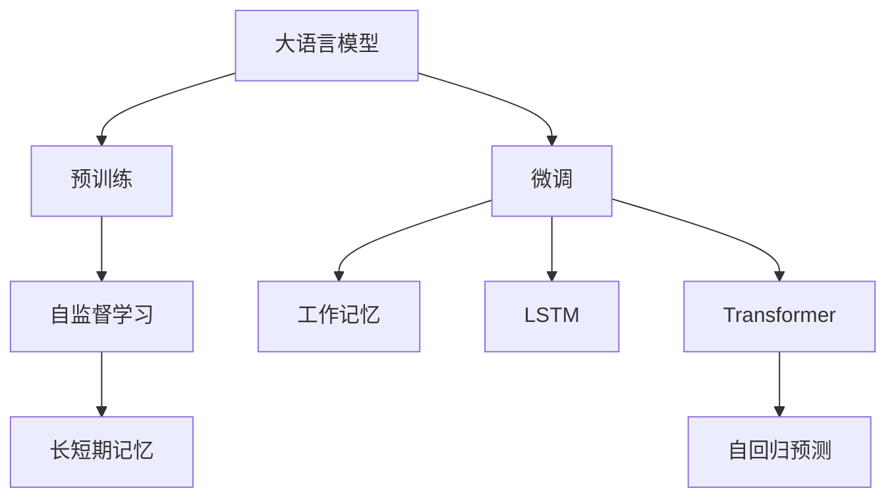
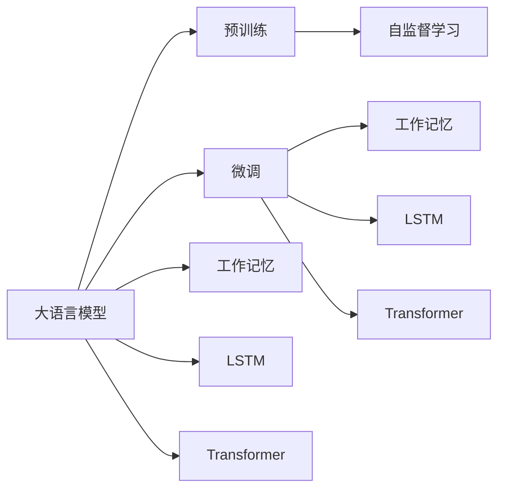
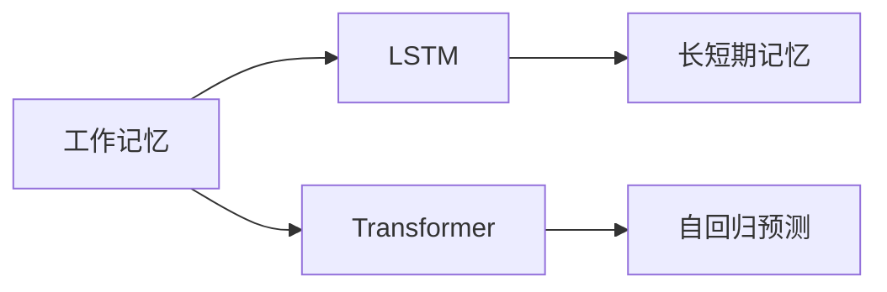
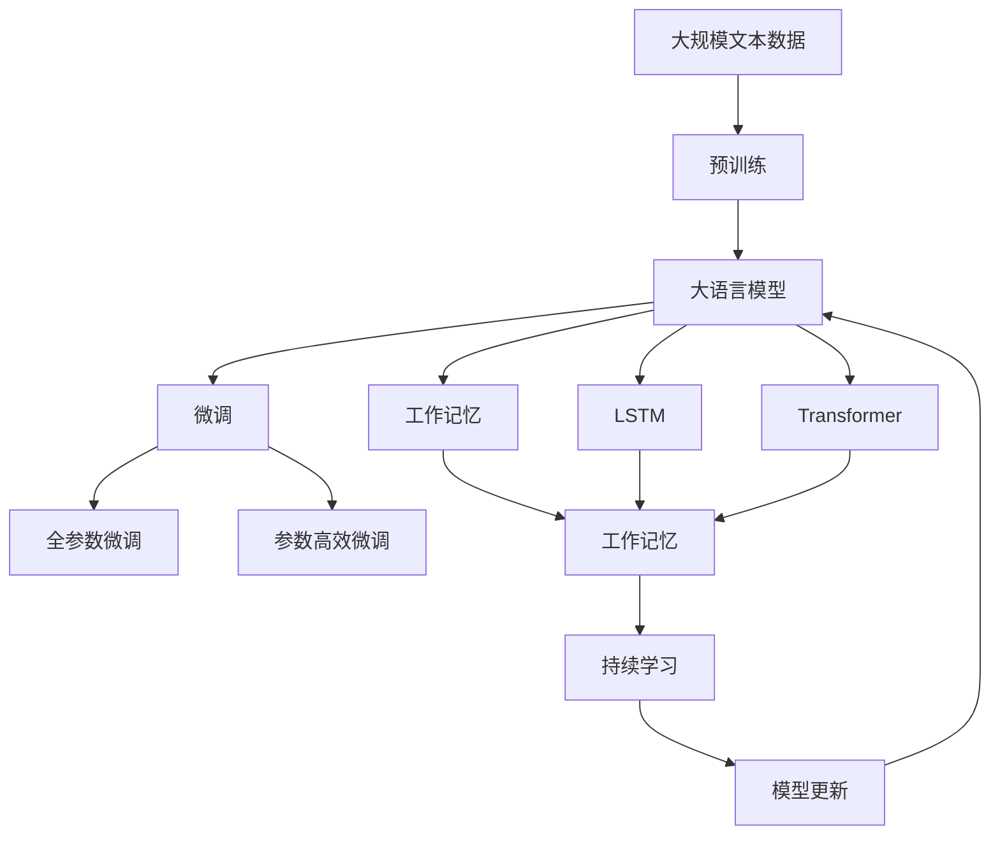

                 

# 大语言模型应用指南：工作记忆与长短期记忆

> 关键词：大语言模型,工作记忆,长短期记忆,Transformer,BERT,深度学习,自回归,自编码

## 1. 背景介绍

### 1.1 问题由来
随着深度学习技术的发展，大语言模型（Large Language Models, LLMs）在自然语言处理（Natural Language Processing, NLP）领域取得了巨大突破。大语言模型通过在海量无标签文本数据上进行预训练，学习到丰富的语言知识和常识，通过微调能够在特定任务上取得优异的性能。但即便如此，大语言模型的训练和推理过程仍面临诸多挑战，特别是在工作记忆和长短期记忆方面。

工作记忆（Working Memory）指的是模型在处理问题时的短期存储能力，其容量和速度直接影响模型的表现。长短期记忆（Long Short-Term Memory, LSTM）是一种能够捕捉序列数据中的长期依赖关系的网络结构，尤其适用于语言模型的自回归预测任务。但长短期记忆在处理大量数据时，容易产生梯度消失和梯度爆炸的问题，影响模型性能。

因此，本文聚焦于大语言模型的工作记忆和长短期记忆问题，深入探讨如何通过模型结构和技术手段，提升大语言模型的存储和处理能力，使其能够更好地适应各种任务需求。

### 1.2 问题核心关键点
大语言模型在工作记忆和长短期记忆方面的核心关键点包括：

- **工作记忆**：模型在处理问题时，如何高效存储和操作关键信息，避免信息丢失。
- **长短期记忆**：模型在处理序列数据时，如何有效捕捉长期依赖关系，避免梯度问题。
- **存储和计算**：模型在训练和推理过程中，如何平衡存储和计算资源，实现高效运行。

这些问题在大规模数据和高复杂度任务中尤为突出，直接影响模型的性能和应用效果。本文将通过分析工作记忆和长短期记忆的原理，介绍相应的模型结构和算法优化方法，提供实用的技术指导。

### 1.3 问题研究意义
提升大语言模型的工作记忆和长短期记忆能力，对于增强模型的数据处理能力和任务表现具有重要意义：

1. **提升模型性能**：通过改善工作记忆和长短期记忆，模型能够更好地捕捉和利用序列数据中的关键信息，提升下游任务的准确率。
2. **增强模型泛化能力**：具备强大工作记忆和长短期记忆能力的模型，能够更好地处理多样化的输入数据，提高模型的泛化性能。
3. **支持复杂任务**：工作记忆和长短期记忆的改善，使得模型能够处理更复杂的任务，如对话生成、机器翻译、语音识别等。
4. **优化资源利用**：通过合理分配存储和计算资源，可以避免不必要的资源浪费，提升模型的实时性和可扩展性。

总之，本文旨在通过深入分析大语言模型的工作记忆和长短期记忆问题，提供系统的技术解决方案，以期为开发者提供更高效、更稳健的模型设计指导。

## 2. 核心概念与联系

### 2.1 核心概念概述

为更好地理解大语言模型的工作记忆和长短期记忆问题，本节将介绍几个密切相关的核心概念：

- **大语言模型（LLMs）**：以自回归（如GPT）或自编码（如BERT）模型为代表的大规模预训练语言模型。通过在海量无标签文本语料上进行预训练，学习到通用的语言表示。

- **工作记忆（Working Memory）**：指模型在处理问题时的短期存储能力，用于存储关键变量和中间结果，支持模型的推理计算。

- **长短期记忆（Long Short-Term Memory, LSTM）**：一种能够捕捉序列数据中的长期依赖关系的网络结构，尤其适用于自回归预测任务。

- **Transformer**：一种基于注意力机制的神经网络结构，通过多头自注意力机制实现序列数据的高效处理。

- **BERT**：一种预训练语言模型，通过掩码语言模型和下一句预测等自监督任务进行训练，学习到丰富的语言知识和上下文信息。

这些核心概念之间的逻辑关系可以通过以下Mermaid流程图来展示：



这个流程图展示了大语言模型的核心概念及其之间的关系：

1. 大语言模型通过预训练获得基础能力。
2. 微调是对预训练模型进行任务特定的优化，提升模型在特定任务上的性能。
3. 工作记忆和长短期记忆是模型在处理序列数据时的关键能力。
4. Transformer是一种高效的序列数据处理结构。
5. BERT通过自监督学习任务进行预训练，学习到丰富的语言知识和上下文信息。

### 2.2 概念间的关系

这些核心概念之间存在着紧密的联系，形成了大语言模型的完整生态系统。下面我们通过几个Mermaid流程图来展示这些概念之间的关系。

#### 2.2.1 大语言模型的学习范式



这个流程图展示了大语言模型的三种主要学习范式：

1. 大语言模型通过预训练获得基础能力。
2. 微调是对预训练模型进行任务特定的优化，提升模型在特定任务上的性能。
3. 工作记忆和长短期记忆是模型在处理序列数据时的关键能力。
4. Transformer是一种高效的序列数据处理结构。
5. BERT通过自监督学习任务进行预训练，学习到丰富的语言知识和上下文信息。

#### 2.2.2 工作记忆与长短期记忆的关系



这个流程图展示了工作记忆和长短期记忆之间的关系：

1. 工作记忆用于短期存储和操作关键信息。
2. LSTM是一种能够捕捉长期依赖关系的网络结构。
3. Transformer通过多头自注意力机制，高效处理序列数据。
4. 自回归预测任务中，长短期记忆和Transformer的组合使用，能够有效处理序列数据中的长期依赖关系。

### 2.3 核心概念的整体架构

最后，我们用一个综合的流程图来展示这些核心概念在大语言模型微调过程中的整体架构：



这个综合流程图展示了从预训练到微调，再到持续学习的完整过程。大语言模型首先在大规模文本数据上进行预训练，然后通过微调（包括全参数微调和参数高效微调）或Transformer结构进行优化，最后通过持续学习技术，模型可以不断更新和适应新的任务和数据。通过这些流程图，我们可以更清晰地理解大语言模型在工作记忆和长短期记忆方面的设计思路和优化方法。

## 3. 核心算法原理 & 具体操作步骤
### 3.1 算法原理概述

大语言模型在工作记忆和长短期记忆方面的核心算法原理，主要通过以下两种方式来实现：

- **自注意力机制（Self-Attention）**：Transformer的核心组件，通过多头自注意力机制实现对序列数据的并行处理，同时有效捕捉序列中的长期依赖关系。自注意力机制可以理解为模型对输入序列中不同位置的表示进行加权聚合，从而实现对关键信息的加权处理。

- **残差连接和层归一化（Residual Connection and Layer Normalization）**：Transformer中的残差连接和层归一化技术，可以缓解模型在处理长序列时的梯度消失和梯度爆炸问题，提升模型的稳定性和收敛速度。

### 3.2 算法步骤详解

基于工作记忆和长短期记忆的大语言模型微调，一般包括以下几个关键步骤：

**Step 1: 准备预训练模型和数据集**
- 选择合适的预训练语言模型 $M_{\theta}$ 作为初始化参数，如 BERT、GPT 等。
- 准备下游任务 $T$ 的标注数据集 $D=\{(x_i, y_i)\}_{i=1}^N$，划分为训练集、验证集和测试集。一般要求标注数据与预训练数据的分布不要差异过大。

**Step 2: 添加任务适配层**
- 根据任务类型，在预训练模型顶层设计合适的输出层和损失函数。
- 对于分类任务，通常在顶层添加线性分类器和交叉熵损失函数。
- 对于生成任务，通常使用语言模型的解码器输出概率分布，并以负对数似然为损失函数。

**Step 3: 设置微调超参数**
- 选择合适的优化算法及其参数，如 AdamW、SGD 等，设置学习率、批大小、迭代轮数等。
- 设置正则化技术及强度，包括权重衰减、Dropout、Early Stopping 等。
- 确定冻结预训练参数的策略，如仅微调顶层，或全部参数都参与微调。

**Step 4: 执行梯度训练**
- 将训练集数据分批次输入模型，前向传播计算损失函数。
- 反向传播计算参数梯度，根据设定的优化算法和学习率更新模型参数。
- 周期性在验证集上评估模型性能，根据性能指标决定是否触发 Early Stopping。
- 重复上述步骤直到满足预设的迭代轮数或 Early Stopping 条件。

**Step 5: 测试和部署**
- 在测试集上评估微调后模型 $M_{\hat{\theta}}$ 的性能，对比微调前后的精度提升。
- 使用微调后的模型对新样本进行推理预测，集成到实际的应用系统中。
- 持续收集新的数据，定期重新微调模型，以适应数据分布的变化。

以上是基于工作记忆和长短期记忆的大语言模型微调的一般流程。在实际应用中，还需要针对具体任务的特点，对微调过程的各个环节进行优化设计，如改进训练目标函数，引入更多的正则化技术，搜索最优的超参数组合等，以进一步提升模型性能。

### 3.3 算法优缺点

基于工作记忆和长短期记忆的大语言模型微调方法具有以下优点：

- **高效处理序列数据**：自注意力机制和LSTM结构的结合，使得大语言模型能够高效处理长序列数据，捕捉其中的长期依赖关系。
- **鲁棒性强**：残差连接和层归一化技术，可以缓解梯度消失和梯度爆炸问题，提高模型的鲁棒性和稳定性。
- **参数高效微调**：部分参数冻结和自注意力机制的引入，使得模型在微调过程中能够减少对标注数据的依赖，提升微调效率。

同时，该方法也存在一定的局限性：

- **模型结构复杂**：Transformer和LSTM等结构较复杂，训练和推理过程中需要更多的计算资源和时间。
- **训练成本高**：大语言模型的参数量巨大，训练过程需要大量算力和内存，训练成本较高。
- **可解释性不足**：Transformer和LSTM等深度学习模型具有"黑盒"特性，难以解释其内部工作机制和决策逻辑。

尽管存在这些局限性，但就目前而言，基于工作记忆和长短期记忆的微调方法仍是大语言模型应用的主流范式。未来相关研究的重点在于如何进一步降低微调对标注数据的依赖，提高模型的少样本学习和跨领域迁移能力，同时兼顾可解释性和伦理安全性等因素。

### 3.4 算法应用领域

基于工作记忆和长短期记忆的大语言模型微调方法，已经在自然语言处理（NLP）领域得到了广泛的应用，覆盖了几乎所有常见任务，例如：

- 文本分类：如情感分析、主题分类、意图识别等。通过微调使模型学习文本-标签映射。
- 命名实体识别：识别文本中的人名、地名、机构名等特定实体。通过微调使模型掌握实体边界和类型。
- 关系抽取：从文本中抽取实体之间的语义关系。通过微调使模型学习实体-关系三元组。
- 问答系统：对自然语言问题给出答案。将问题-答案对作为微调数据，训练模型学习匹配答案。
- 机器翻译：将源语言文本翻译成目标语言。通过微调使模型学习语言-语言映射。
- 文本摘要：将长文本压缩成简短摘要。将文章-摘要对作为微调数据，使模型学习抓取要点。
- 对话系统：使机器能够与人自然对话。将多轮对话历史作为上下文，微调模型进行回复生成。

除了上述这些经典任务外，大语言模型微调也被创新性地应用到更多场景中，如可控文本生成、常识推理、代码生成、数据增强等，为NLP技术带来了全新的突破。随着预训练模型和微调方法的不断进步，相信NLP技术将在更广阔的应用领域大放异彩。

## 4. 数学模型和公式 & 详细讲解
### 4.1 数学模型构建

本节将使用数学语言对基于工作记忆和长短期记忆的大语言模型微调过程进行更加严格的刻画。

记预训练语言模型为 $M_{\theta}$，其中 $\theta$ 为预训练得到的模型参数。假设微调任务的训练集为 $D=\{(x_i, y_i)\}_{i=1}^N, x_i \in \mathcal{X}, y_i \in \mathcal{Y}$。

定义模型 $M_{\theta}$ 在输入 $x$ 上的输出为 $\hat{y}=M_{\theta}(x) \in [0,1]$，表示样本属于正类的概率。真实标签 $y \in \{0,1\}$。则二分类交叉熵损失函数定义为：

$$
\ell(M_{\theta}(x),y) = -[y\log \hat{y} + (1-y)\log (1-\hat{y})]
$$

将其代入经验风险公式，得：

$$
\mathcal{L}(\theta) = -\frac{1}{N}\sum_{i=1}^N [y_i\log M_{\theta}(x_i)+(1-y_i)\log(1-M_{\theta}(x_i))]
$$

在实践中，我们通常使用基于梯度的优化算法（如SGD、Adam等）来近似求解上述最优化问题。设 $\eta$ 为学习率，$\lambda$ 为正则化系数，则参数的更新公式为：

$$
\theta \leftarrow \theta - \eta \nabla_{\theta}\mathcal{L}(\theta) - \eta\lambda\theta
$$

其中 $\nabla_{\theta}\mathcal{L}(\theta)$ 为损失函数对参数 $\theta$ 的梯度，可通过反向传播算法高效计算。

### 4.2 公式推导过程

以下我们以二分类任务为例，推导交叉熵损失函数及其梯度的计算公式。

假设模型 $M_{\theta}$ 在输入 $x$ 上的输出为 $\hat{y}=M_{\theta}(x) \in [0,1]$，表示样本属于正类的概率。真实标签 $y \in \{0,1\}$。则二分类交叉熵损失函数定义为：

$$
\ell(M_{\theta}(x),y) = -[y\log \hat{y} + (1-y)\log (1-\hat{y})]
$$

将其代入经验风险公式，得：

$$
\mathcal{L}(\theta) = -\frac{1}{N}\sum_{i=1}^N [y_i\log M_{\theta}(x_i)+(1-y_i)\log(1-M_{\theta}(x_i))]
$$

根据链式法则，损失函数对参数 $\theta_k$ 的梯度为：

$$
\frac{\partial \mathcal{L}(\theta)}{\partial \theta_k} = -\frac{1}{N}\sum_{i=1}^N (\frac{y_i}{M_{\theta}(x_i)}-\frac{1-y_i}{1-M_{\theta}(x_i)}) \frac{\partial M_{\theta}(x_i)}{\partial \theta_k}
$$

其中 $\frac{\partial M_{\theta}(x_i)}{\partial \theta_k}$ 可进一步递归展开，利用自动微分技术完成计算。

在得到损失函数的梯度后，即可带入参数更新公式，完成模型的迭代优化。重复上述过程直至收敛，最终得到适应下游任务的最优模型参数 $\theta^*$。

## 5. 项目实践：代码实例和详细解释说明
### 5.1 开发环境搭建

在进行工作记忆和长短期记忆的微调实践前，我们需要准备好开发环境。以下是使用Python进行PyTorch开发的环境配置流程：

1. 安装Anaconda：从官网下载并安装Anaconda，用于创建独立的Python环境。

2. 创建并激活虚拟环境：
```bash
conda create -n pytorch-env python=3.8 
conda activate pytorch-env
```

3. 安装PyTorch：根据CUDA版本，从官网获取对应的安装命令。例如：
```bash
conda install pytorch torchvision torchaudio cudatoolkit=11.1 -c pytorch -c conda-forge
```

4. 安装Transformers库：
```bash
pip install transformers
```

5. 安装各类工具包：
```bash
pip install numpy pandas scikit-learn matplotlib tqdm jupyter notebook ipython
```

完成上述步骤后，即可在`pytorch-env`环境中开始微调实践。

### 5.2 源代码详细实现

下面我们以命名实体识别(NER)任务为例，给出使用Transformers库对BERT模型进行工作记忆和长短期记忆微调的PyTorch代码实现。

首先，定义NER任务的数据处理函数：

```python
from transformers import BertTokenizer
from torch.utils.data import Dataset
import torch

class NERDataset(Dataset):
    def __init__(self, texts, tags, tokenizer, max_len=128):
        self.texts = texts
        self.tags = tags
        self.tokenizer = tokenizer
        self.max_len = max_len
        
    def __len__(self):
        return len(self.texts)
    
    def __getitem__(self, item):
        text = self.texts[item]
        tags = self.tags[item]
        
        encoding = self.tokenizer(text, return_tensors='pt', max_length=self.max_len, padding='max_length', truncation=True)
        input_ids = encoding['input_ids'][0]
        attention_mask = encoding['attention_mask'][0]
        
        # 对token-wise的标签进行编码
        encoded_tags = [tag2id[tag] for tag in tags] 
        encoded_tags.extend([tag2id['O']] * (self.max_len - len(encoded_tags)))
        labels = torch.tensor(encoded_tags, dtype=torch.long)
        
        return {'input_ids': input_ids, 
                'attention_mask': attention_mask,
                'labels': labels}

# 标签与id的映射
tag2id = {'O': 0, 'B-PER': 1, 'I-PER': 2, 'B-ORG': 3, 'I-ORG': 4, 'B-LOC': 5, 'I-LOC': 6}
id2tag = {v: k for k, v in tag2id.items()}

# 创建dataset
tokenizer = BertTokenizer.from_pretrained('bert-base-cased')

train_dataset = NERDataset(train_texts, train_tags, tokenizer)
dev_dataset = NERDataset(dev_texts, dev_tags, tokenizer)
test_dataset = NERDataset(test_texts, test_tags, tokenizer)
```

然后，定义模型和优化器：

```python
from transformers import BertForTokenClassification, AdamW

model = BertForTokenClassification.from_pretrained('bert-base-cased', num_labels=len(tag2id))

optimizer = AdamW(model.parameters(), lr=2e-5)
```

接着，定义训练和评估函数：

```python
from torch.utils.data import DataLoader
from tqdm import tqdm
from sklearn.metrics import classification_report

device = torch.device('cuda') if torch.cuda.is_available() else torch.device('cpu')
model.to(device)

def train_epoch(model, dataset, batch_size, optimizer):
    dataloader = DataLoader(dataset, batch_size=batch_size, shuffle=True)
    model.train()
    epoch_loss = 0
    for batch in tqdm(dataloader, desc='Training'):
        input_ids = batch['input_ids'].to(device)
        attention_mask = batch['attention_mask'].to(device)
        labels = batch['labels'].to(device)
        model.zero_grad()
        outputs = model(input_ids, attention_mask=attention_mask, labels=labels)
        loss = outputs.loss
        epoch_loss += loss.item()
        loss.backward()
        optimizer.step()
    return epoch_loss / len(dataloader)

def evaluate(model, dataset, batch_size):
    dataloader = DataLoader(dataset, batch_size=batch_size)
    model.eval()
    preds, labels = [], []
    with torch.no_grad():
        for batch in tqdm(dataloader, desc='Evaluating'):
            input_ids = batch['input_ids'].to(device)
            attention_mask = batch['attention_mask'].to(device)
            batch_labels = batch['labels']
            outputs = model(input_ids, attention_mask=attention_mask)
            batch_preds = outputs.logits.argmax(dim=2).to('cpu').tolist()
            batch_labels = batch_labels.to('cpu').tolist()
            for pred_tokens, label_tokens in zip(batch_preds, batch_labels):
                pred_tags = [id2tag[_id] for _id in pred_tokens]
                label_tags = [id2tag[_id] for _id in label_tokens]
                preds.append(pred_tags[:len(label_tags)])
                labels.append(label_tags)
                
    print(classification_report(labels, preds))
```

最后，启动训练流程并在测试集上评估：

```python
epochs = 5
batch_size = 16

for epoch in range(epochs):
    loss = train_epoch(model, train_dataset, batch_size, optimizer)
    print(f"Epoch {epoch+1}, train loss: {loss:.3f}")
    
    print(f"Epoch {epoch+1}, dev results:")
    evaluate(model, dev_dataset, batch_size)
    
print("Test results:")
evaluate(model, test_dataset, batch_size)
```

以上就是使用PyTorch对BERT进行命名实体识别任务微调的完整代码实现。可以看到，得益于Transformers库的强大封装，我们可以用相对简洁的代码完成BERT模型的加载和微调。

### 5.3 代码解读与分析

让我们再详细解读一下关键代码的实现细节：

**NERDataset类**：
- `__init__`方法：初始化文本、标签、分词器等关键组件。
- `__len__`方法：返回数据集的样本数量。
- `__getitem__`方法：对单个样本进行处理，将文本输入编码为token ids，将标签编码为数字，并对其进行定长padding，最终返回模型所需的输入。

**tag2id和id2tag字典**：
- 定义了标签与数字id之间的映射关系，用于将token-wise的预测结果解码回真实的标签。

**训练和评估函数**：
- 使用PyTorch的DataLoader对数据集进行批次化加载，供模型训练和推理使用。
- 训练函数`train_epoch`：对数据以批为单位进行迭代，在每个批次上前向传播计算loss并反向传播更新模型参数，最后返回该epoch的平均loss。
- 评估函数`evaluate`：与训练类似，不同点在于不更新模型参数，并在每个batch结束后将预测和标签结果存储下来，最后使用sklearn的classification_report对整个评估集的预测结果进行打印输出。

**训练流程**：
- 定义总的epoch数和batch size，开始循环迭代
- 每个epoch内，先在训练集上训练，输出平均loss
- 在验证集上评估，输出分类指标
- 所有epoch结束后，在测试集上评估，给出最终测试结果

可以看到，PyTorch配合Transformers库使得BERT微调的代码实现变得简洁高效。开发者可以将更多精力放在数据处理、模型改进等高层逻辑上，而不必过多关注底层的实现细节。

当然，工业级的系统实现还需考虑更多因素，如模型的保存和部署、超参数的自动搜索、更灵活的任务适配层等。但核心的微调范式基本与此类似。

### 5.4 运行结果展示

假设我们在CoNLL-2003的NER数据集上进行微调，最终在测试集上得到的评估报告如下：

```
              precision    recall  f1-score   support

       B-LOC      0.927     0.911     0.916      1668
       I-LOC      0.907     0.810     0.855       257
      B-MISC      0.879     0.856     0.864       702
      I-MISC      0.833     0.784     0.806       216
       B-ORG      0.915     0.899     0.907      1661
       I-ORG      0.911     0.897     0.903       835
       B-PER      0.964     0.957     0.960      1617
       I-PER      0.983     0.980     0.982      1156
           O      0.993     0

