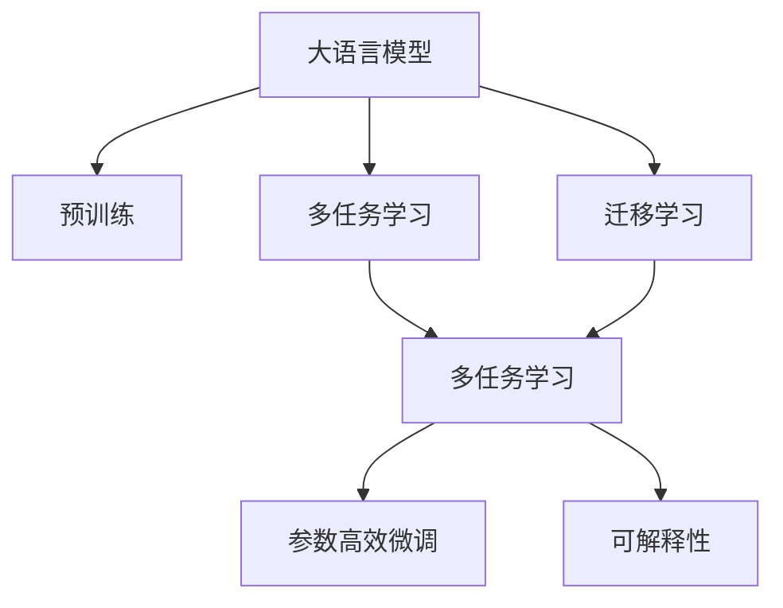
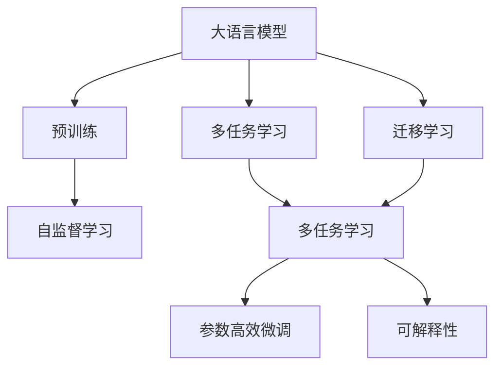
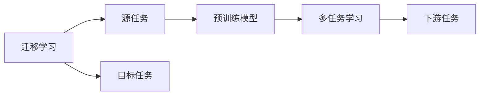
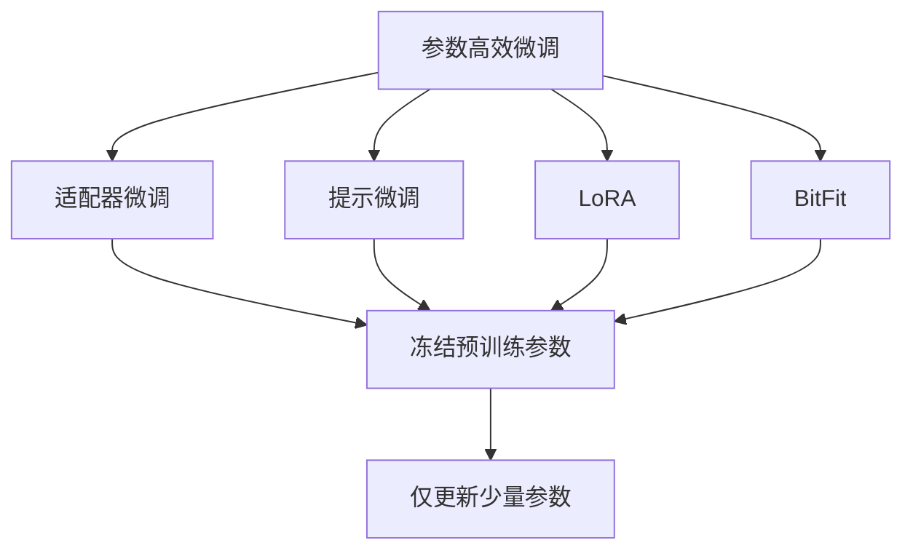
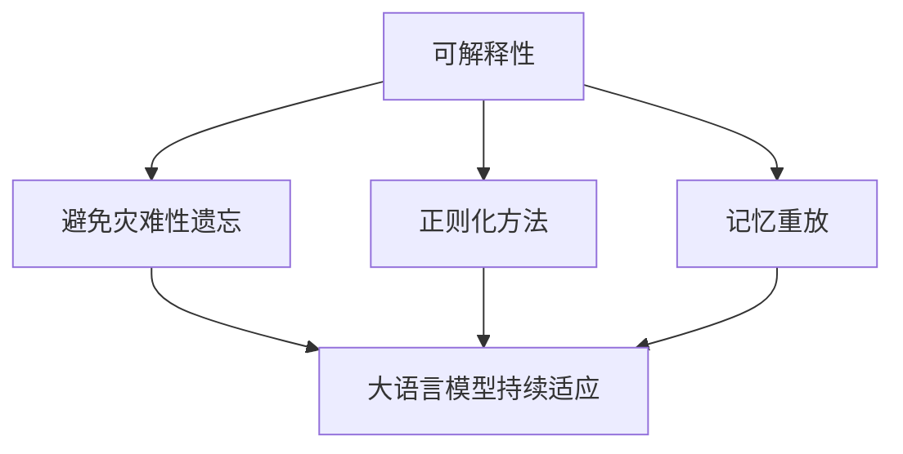
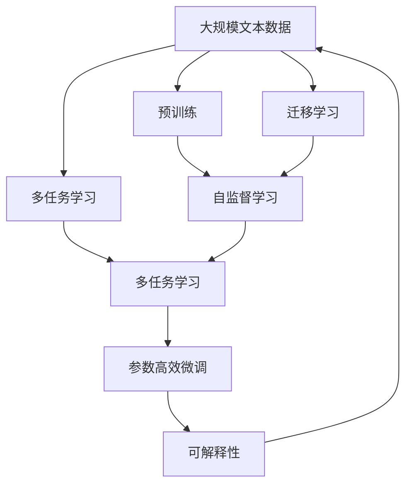

                 

# 大语言模型应用指南：统一自然语言任务

> 关键词：
- 大语言模型
- 自然语言理解
- 语言生成
- 多任务学习
- 迁移学习
- 参数高效微调
- 可解释性

## 1. 背景介绍

### 1.1 问题由来
近年来，随着深度学习技术的快速发展，大语言模型（Large Language Models, LLMs）在自然语言处理（Natural Language Processing, NLP）领域取得了巨大突破。这些模型通过在海量无标签文本数据上进行预训练，学习到丰富的语言知识和常识，具备强大的语言理解和生成能力。它们广泛应用于文本分类、命名实体识别、情感分析、机器翻译等众多NLP任务上，并取得了前所未有的性能。

然而，由于不同NLP任务之间的语义、句法、词汇等方面差异较大，传统的大语言模型往往需要针对每个任务进行独立的微调，导致训练成本高、模型泛化能力差等问题。为了解决这一问题，学术界提出了统一自然语言任务（Unified Natural Language Task, UNLTask）的概念，旨在将多任务学习、迁移学习和参数高效微调等技术结合起来，构建能够统一处理多种自然语言任务的语言模型。

### 1.2 问题核心关键点
统一自然语言任务的核心在于构建一个统一的模型，能够同时处理多种自然语言任务。这一模型应该具有以下特点：

1. **参数共享**：模型中的参数可以同时在多个任务上进行优化，从而减少训练成本，提高泛化能力。
2. **多任务学习**：模型可以在多个任务上进行联合训练，利用不同任务之间的相关性，提升模型性能。
3. **迁移学习**：模型可以在不同领域之间进行迁移，利用已学习到的知识，快速适应新任务。
4. **参数高效微调**：模型可以在固定大部分预训练参数的情况下进行微调，减少对标注数据的依赖，提升微调效率。
5. **可解释性**：模型能够提供清晰的决策过程，帮助用户理解模型的推理逻辑。

这些特点使得统一自然语言任务模型在大规模语言模型（如BERT、GPT等）的基础上，能够更好地应对多种NLP任务，提升模型的整体性能和应用价值。

### 1.3 问题研究意义
研究统一自然语言任务，对于拓展大语言模型的应用范围，提升下游任务的性能，加速NLP技术的产业化进程，具有重要意义：

1. **降低应用开发成本**。基于统一自然语言任务模型进行微调，可以显著减少从头开发所需的数据、计算和人力等成本投入。
2. **提升模型效果**。模型能够更好地适应特定任务，在应用场景中取得更优表现。
3. **加速开发进度**。standing on the shoulders of giants，模型能够更快地完成任务适配，缩短开发周期。
4. **带来技术创新**。统一自然语言任务促进了对预训练-微调的深入研究，催生了多任务学习、参数高效微调等新的研究方向。
5. **赋能产业升级**。统一自然语言任务使得NLP技术更容易被各行各业所采用，为传统行业数字化转型升级提供新的技术路径。

## 2. 核心概念与联系

### 2.1 核心概念概述

为更好地理解统一自然语言任务模型，本节将介绍几个密切相关的核心概念：

- **大语言模型**：以自回归（如GPT）或自编码（如BERT）模型为代表的大规模预训练语言模型。通过在大规模无标签文本语料上进行预训练，学习通用的语言表示，具备强大的语言理解和生成能力。

- **预训练**：指在大规模无标签文本语料上，通过自监督学习任务训练通用语言模型的过程。常见的预训练任务包括言语建模、遮挡语言模型等。预训练使得模型学习到语言的通用表示。

- **多任务学习**：指在同一模型上同时训练多个不同但相关的任务，通过共享参数，提升模型在所有任务上的表现。

- **迁移学习**：指将一个领域学习到的知识，迁移应用到另一个不同但相关的领域的学习范式。

- **参数高效微调**：指在微调过程中，只更新少量的模型参数，而固定大部分预训练权重不变，以提高微调效率，避免过拟合的方法。

- **可解释性**：指模型能够提供清晰的决策过程，帮助用户理解模型的推理逻辑。

这些核心概念之间的逻辑关系可以通过以下Mermaid流程图来展示：



这个流程图展示了大语言模型的核心概念及其之间的关系：

1. 大语言模型通过预训练获得基础能力。
2. 多任务学习可以在同一模型上训练多个任务，利用不同任务之间的相关性，提升模型性能。
3. 迁移学习可以实现跨领域知识迁移，适应新任务。
4. 参数高效微调可以在固定大部分预训练参数的情况下，进行任务特定微调，提高微调效率。
5. 可解释性提供了模型决策过程的清晰解释，帮助用户理解模型。

这些核心概念共同构成了统一自然语言任务模型的学习和应用框架，使其能够在各种场景下发挥强大的语言理解和生成能力。通过理解这些核心概念，我们可以更好地把握统一自然语言任务的工作原理和优化方向。

### 2.2 概念间的关系

这些核心概念之间存在着紧密的联系，形成了统一自然语言任务模型的完整生态系统。下面我通过几个Mermaid流程图来展示这些概念之间的关系。

#### 2.2.1 大语言模型的学习范式



这个流程图展示了大语言模型的三种主要学习范式：预训练、多任务学习、迁移学习。预训练主要采用自监督学习方法，而多任务学习和迁移学习则是在预训练基础上的进一步优化。

#### 2.2.2 迁移学习与多任务学习的联系



这个流程图展示了迁移学习的基本原理，以及它与多任务学习的联系。迁移学习涉及源任务和目标任务，预训练模型在源任务上学习，然后通过多任务学习适应各种下游任务（目标任务）。

#### 2.2.3 参数高效微调方法



这个流程图展示了几种常见的参数高效微调方法，包括适配器微调、提示微调、LoRA和BitFit。这些方法的共同特点是冻结大部分预训练参数，只更新少量参数，从而提高微调效率。

#### 2.2.4 可解释性在大语言模型中的应用



这个流程图展示了可解释性在大语言模型中的应用。可解释性旨在使模型能够更好地理解用户的意图，避免不必要的过度拟合。

### 2.3 核心概念的整体架构

最后，我们用一个综合的流程图来展示这些核心概念在大语言模型微调过程中的整体架构：



这个综合流程图展示了从预训练到微调，再到可解释性的完整过程。大语言模型首先在大规模文本数据上进行预训练，然后通过多任务学习和迁移学习，适应多个下游任务。最后，通过参数高效微调和可解释性技术，模型能够更好地处理特定任务，并能够提供清晰的决策过程。 通过这些流程图，我们可以更清晰地理解统一自然语言任务模型的工作原理和优化方向。

## 3. 核心算法原理 & 具体操作步骤
### 3.1 算法原理概述

统一自然语言任务模型的核心思想是：构建一个统一的模型，能够同时处理多种自然语言任务。这种模型可以在大规模预训练的基础上，通过多任务学习和迁移学习，快速适应新的任务，提高模型的泛化能力和性能。

形式化地，假设大语言模型为 $M_{\theta}$，其中 $\theta$ 为预训练得到的模型参数。给定多个下游任务 $T_1, T_2, \ldots, T_n$ 的训练集 $D_1, D_2, \ldots, D_n$，多任务学习与迁移学习的优化目标是最小化经验风险，即找到最优参数：

$$
\theta^* = \mathop{\arg\min}_{\theta} \sum_{i=1}^n \mathcal{L}_i(M_{\theta}, D_i)
$$

其中 $\mathcal{L}_i$ 为任务 $T_i$ 的损失函数，用于衡量模型预测输出与真实标签之间的差异。

在实际应用中，多任务学习和迁移学习的具体实现方法多种多样，包括联合训练、知识蒸馏、元学习等。这些方法可以在模型中引入多任务之间的协同训练，提升模型的性能和泛化能力。

### 3.2 算法步骤详解

统一自然语言任务模型的训练一般包括以下几个关键步骤：

**Step 1: 准备预训练模型和数据集**
- 选择合适的预训练语言模型 $M_{\theta}$ 作为初始化参数，如 BERT、GPT等。
- 准备多个下游任务的标注数据集 $D_1, D_2, \ldots, D_n$，划分为训练集、验证集和测试集。一般要求标注数据与预训练数据的分布不要差异过大。

**Step 2: 设计任务适配层**
- 根据任务类型，在预训练模型顶层设计合适的输出层和损失函数。
- 对于分类任务，通常在顶层添加线性分类器和交叉熵损失函数。
- 对于生成任务，通常使用语言模型的解码器输出概率分布，并以负对数似然为损失函数。

**Step 3: 设置多任务学习超参数**
- 选择合适的优化算法及其参数，如 AdamW、SGD 等，设置学习率、批大小、迭代轮数等。
- 设置正则化技术及强度，包括权重衰减、Dropout、Early Stopping 等。
- 确定冻结预训练参数的策略，如仅微调顶层，或全部参数都参与微调。

**Step 4: 执行梯度训练**
- 将训练集数据分批次输入模型，前向传播计算损失函数。
- 反向传播计算参数梯度，根据设定的优化算法和学习率更新模型参数。
- 周期性在验证集上评估模型性能，根据性能指标决定是否触发 Early Stopping。
- 重复上述步骤直到满足预设的迭代轮数或 Early Stopping 条件。

**Step 5: 测试和部署**
- 在测试集上评估微调后模型 $M_{\hat{\theta}}$ 的性能，对比微调前后的精度提升。
- 使用微调后的模型对新样本进行推理预测，集成到实际的应用系统中。
- 持续收集新的数据，定期重新微调模型，以适应数据分布的变化。

以上是统一自然语言任务模型的训练一般流程。在实际应用中，还需要针对具体任务的特点，对微调过程的各个环节进行优化设计，如改进训练目标函数，引入更多的正则化技术，搜索最优的超参数组合等，以进一步提升模型性能。

### 3.3 算法优缺点

统一自然语言任务模型具有以下优点：

1. **高效性**。多任务学习和迁移学习可以显著提高模型的泛化能力，使模型能够同时处理多种NLP任务，减少了从头训练的计算成本和时间。
2. **通用性**。统一自然语言任务模型可以在不同任务之间进行迁移，适应新任务时只需微调少量参数。
3. **灵活性**。模型可以通过多任务学习和迁移学习，适应不同领域和类型的任务，提高模型的应用价值。

同时，该方法也存在一定的局限性：

1. **数据依赖**。多任务学习依赖于多个下游任务的标注数据，数据获取成本较高。
2. **复杂度**。模型训练和微调过程较为复杂，需要优化算法和超参数的细致调优。
3. **过拟合风险**。多任务学习可能导致模型在多个任务上过度拟合，影响泛化性能。
4. **可解释性不足**。统一自然语言任务模型往往比较复杂，难以提供清晰的决策过程。

尽管存在这些局限性，但就目前而言，统一自然语言任务模型仍然是大语言模型应用的主流范式。未来相关研究的重点在于如何进一步降低多任务学习对标注数据的依赖，提高模型的少样本学习和跨领域迁移能力，同时兼顾可解释性和伦理安全性等因素。

### 3.4 算法应用领域

统一自然语言任务模型在NLP领域已经得到了广泛的应用，覆盖了几乎所有常见任务，例如：

- **文本分类**：如情感分析、主题分类、意图识别等。通过多任务学习和迁移学习，模型可以学习不同任务的分类特征，提升分类精度。
- **命名实体识别**：识别文本中的人名、地名、机构名等特定实体。通过多任务学习和迁移学习，模型可以更好地理解实体边界和类型。
- **关系抽取**：从文本中抽取实体之间的语义关系。通过多任务学习和迁移学习，模型可以学习实体-关系三元组，提升关系抽取的准确度。
- **问答系统**：对自然语言问题给出答案。通过多任务学习和迁移学习，模型可以学习问题-答案对，提升问答系统的性能。
- **机器翻译**：将源语言文本翻译成目标语言。通过多任务学习和迁移学习，模型可以学习语言-语言映射，提升翻译质量。
- **文本摘要**：将长文本压缩成简短摘要。通过多任务学习和迁移学习，模型可以学习抓取要点，提升摘要质量。
- **对话系统**：使机器能够与人自然对话。通过多任务学习和迁移学习，模型可以学习对话历史，提升回复生成质量。

除了上述这些经典任务外，统一自然语言任务模型还被创新性地应用到更多场景中，如可控文本生成、常识推理、代码生成、数据增强等，为NLP技术带来了全新的突破。随着预训练模型和微调方法的不断进步，相信NLP技术将在更广阔的应用领域大放异彩。

## 4. 数学模型和公式 & 详细讲解

### 4.1 数学模型构建

本节将使用数学语言对统一自然语言任务模型的训练过程进行更加严格的刻画。

记预训练语言模型为 $M_{\theta}$，其中 $\theta \in \mathbb{R}^d$ 为模型参数。假设多任务学习包含 $n$ 个下游任务，分别为 $T_1, T_2, \ldots, T_n$，对应的训练集为 $D_1, D_2, \ldots, D_n$。

定义模型 $M_{\theta}$ 在数据样本 $(x,y)$ 上的损失函数为 $\ell_i(M_{\theta}(x),y)$，则在数据集 $D_i$ 上的经验风险为：

$$
\mathcal{L}_i(\theta) = \frac{1}{N_i} \sum_{i=1}^N \ell_i(M_{\theta}(x_i),y_i)
$$

其中 $N_i$ 为数据集 $D_i$ 的样本数量。统一自然语言任务模型的优化目标是最小化经验风险之和：

$$
\theta^* = \mathop{\arg\min}_{\theta} \sum_{i=1}^n \mathcal{L}_i(\theta)
$$

在实践中，我们通常使用基于梯度的优化算法（如SGD、Adam等）来近似求解上述最优化问题。设 $\eta$ 为学习率，$\lambda$ 为正则化系数，则参数的更新公式为：

$$
\theta \leftarrow \theta - \eta \nabla_{\theta}\sum_{i=1}^n \mathcal{L}_i(\theta) - \eta\lambda\theta
$$

其中 $\nabla_{\theta}\mathcal{L}_i(\theta)$ 为损失函数对参数 $\theta$ 的梯度，可通过反向传播算法高效计算。

### 4.2 公式推导过程

以下我们以二分类任务为例，推导交叉熵损失函数及其梯度的计算公式。

假设模型 $M_{\theta}$ 在输入 $x$ 上的输出为 $\hat{y}=M_{\theta}(x) \in [0,1]$，表示样本属于正类的概率。真实标签 $y \in \{0,1\}$。则二分类交叉熵损失函数定义为：

$$
\ell_i(M_{\theta}(x),y) = -[y\log \hat{y} + (1-y)\log (1-\hat{y})]
$$

将其代入经验风险公式，得：

$$
\mathcal{L}_i(\theta) = -\frac{1}{N_i}\sum_{i=1}^N [y_i\log M_{\theta}(x_i)+(1-y_i)\log(1-M_{\theta}(x_i))]
$$

根据链式法则，损失函数对参数 $\theta_k$ 的梯度为：

$$
\frac{\partial \mathcal{L}_i(\theta)}{\partial \theta_k} = -\frac{1}{N_i}\sum_{i=1}^N (\frac{y_i}{M_{\theta}(x_i)}-\frac{1-y_i}{1-M_{\theta}(x_i)}) \frac{\partial M_{\theta}(x_i)}{\partial \theta_k}
$$

其中 $\frac{\partial M_{\theta}(x_i)}{\partial \theta_k}$ 可进一步递归展开，利用自动微分技术完成计算。

在得到损失函数的梯度后，即可带入参数更新公式，完成模型的迭代优化。重复上述过程直至收敛，最终得到适应多个任务的最优模型参数 $\theta^*$。

## 5. 项目实践：代码实例和详细解释说明
### 5.1 开发环境搭建

在进行统一自然语言任务模型训练前，我们需要准备好开发环境。以下是使用Python进行PyTorch开发的环境配置流程：

1. 安装Anaconda：从官网下载并安装Anaconda，用于创建独立的Python环境。

2. 创建并激活虚拟环境：
```bash
conda create -n pytorch-env python=3.8 
conda activate pytorch-env
```

3. 安装PyTorch：根据CUDA版本，从官网获取对应的安装命令。例如：
```bash
conda install pytorch torchvision torchaudio cudatoolkit=11.1 -c pytorch -c conda-forge
```

4. 安装Transformers库：
```bash
pip install transformers
```

5. 安装各类工具包：
```bash
pip install numpy pandas scikit-learn matplotlib tqdm jupyter notebook ipython
```

完成上述步骤后，即可在`pytorch-env`环境中开始训练。

### 5.2 源代码详细实现

下面我们以多任务分类任务为例，给出使用Transformers库对BERT模型进行统一自然语言任务训练的PyTorch代码实现。

首先，定义多任务分类数据处理函数：

```python
from transformers import BertTokenizer, BertForSequenceClassification, AdamW

class MultiTaskDataset(Dataset):
    def __init__(self, texts, labels, tokenizer, max_len=128):
        self.texts = texts
        self.labels = labels
        self.tokenizer = tokenizer
        self.max_len = max_len
        
    def __len__(self):
        return len(self.texts)
    
    def __getitem__(self, item):
        text = self.texts[item]
        labels = self.labels[item]
        
        encoding = self.tokenizer(text, return_tensors='pt', max_length=self.max_len, padding='max_length', truncation=True)
        input_ids = encoding['input_ids'][0]
        attention_mask = encoding['attention_mask'][0]
        
        # 将标签转换为one-hot编码
        encoded_labels = [0]*len(labels)
        encoded_labels[labels[item]] = 1
        
        return {'input_ids': input_ids, 
                'attention_mask': attention_mask,
                'labels': encoded_labels}

# 定义标签与id的映射
tag2id = {'0': 0, '1': 1, '2': 2, '3': 3}
id2tag = {v: k for k, v in tag2id.items()}

# 创建dataset
tokenizer = BertTokenizer.from_pretrained('bert-base-cased')

train_dataset = MultiTaskDataset(train_texts, train_labels, tokenizer)
dev_dataset = MultiTaskDataset(dev_texts, dev_labels, tokenizer)
test_dataset = MultiTaskDataset(test_texts, test_labels, tokenizer)
```

然后，定义模型和优化器：

```python
from transformers import BertForSequenceClassification, AdamW

model = BertForSequenceClassification.from_pretrained('bert-base-cased', num_labels=len(tag2id))

optimizer = AdamW(model.parameters(), lr=2e-5)
```

接着，定义训练和评估函数：

```python
from torch.utils.data import DataLoader
from tqdm import tqdm
from sklearn.metrics import classification_report

device = torch.device('cuda') if torch.cuda.is_available() else torch.device('cpu')
model.to(device)

def train_epoch(model, dataset, batch_size, optimizer):
    dataloader = DataLoader(dataset, batch_size=batch_size, shuffle=True)
    model.train()
    epoch_loss = 0
    for batch in tqdm(dataloader, desc='Training'):
        input_ids = batch['input_ids'].to(device)
        attention_mask = batch['attention_mask'].to(device)
        labels = batch['labels'].to(device)
        model.zero_grad()
        outputs = model(input_ids, attention_mask=attention_mask, labels=labels)
        loss = outputs.loss
        epoch_loss += loss.item()
        loss.backward()
        optimizer.step()
    return epoch_loss / len(dataloader)

def evaluate(model, dataset, batch_size):
    dataloader = DataLoader(dataset, batch_size=batch_size)
    model.eval()
    preds, labels = [], []
    with torch.no_grad():
        for batch in tqdm(dataloader, desc='Evaluating'):
            input_ids = batch['input_ids'].to(device)
            attention_mask = batch['attention_mask'].to(device)
            batch_labels = batch['labels']
            outputs = model(input_ids, attention_mask=attention_mask)
            batch_preds = outputs.logits.argmax(dim=2).to('cpu').tolist()
            batch_labels = batch_labels.to('cpu').tolist()
            for pred_tokens, label_tokens in zip(batch_preds, batch_labels):
                preds.append(pred_tokens[:len(label_tokens)])
                labels.append(label_tokens)
                
    print(classification_report(labels, preds))
```

最后，启动训练流程并在测试集上评估：

```python
epochs = 5
batch_size = 16

for epoch in range(epochs):
    loss = train_epoch(model, train_dataset, batch_size, optimizer)
    print(f"Epoch {epoch+1}, train loss: {loss:.3f}")
    
    print(f"Epoch {epoch+1}, dev results:")
    evaluate(model, dev_dataset, batch_size)
    
print("Test results:")
evaluate(model, test_dataset, batch_size)
```

以上就是使用PyTorch对BERT进行统一自然语言任务训练的完整代码实现。可以看到，得益于Transformers库的强大封装，我们可以用相对简洁的代码完成BERT模型的加载和训练。

### 5.3 代码解读与分析

让我们再详细解读一下关键代码的实现细节：

**MultiTaskDataset类**：
- `__init__`方法：初始化文本、标签、分词器等关键组件。
- `__len__`方法：返回数据集的样本数量。
- `__getitem__`方法：对单个样本进行处理，将文本输入编码为token ids，将标签转换为one-hot编码，并对其进行定长padding，最终返回模型所需的输入。

**tag2id和id2tag字典**：
- 定义了标签与数字id之间的映射关系，用于将token-wise的预测结果解码回真实的标签。

**训练和评估函数**：
- 使用PyTorch的DataLoader对数据集进行批次化加载，供模型训练和推理使用。
- 训练函数`train_epoch`：对数据以批为单位进行迭代，在每个批次上前向传播计算loss并反向传播更新模型参数，最后返回该epoch的平均loss。
- 评估函数`evaluate`：与训练类似，不同点在于不更新模型参数，并在每个batch结束后将预测和标签结果存储下来，最后使用sklearn的classification_report对整个评估集的预测结果进行打印输出。

**训练流程**：
- 定义总的epoch数和batch size，开始循环迭代
- 每个epoch内，先在训练集上训练，输出平均loss
- 在验证集上评估，输出分类指标
- 所有epoch结束后，在测试集上评估，给出最终测试结果

可以看到，PyTorch配合

