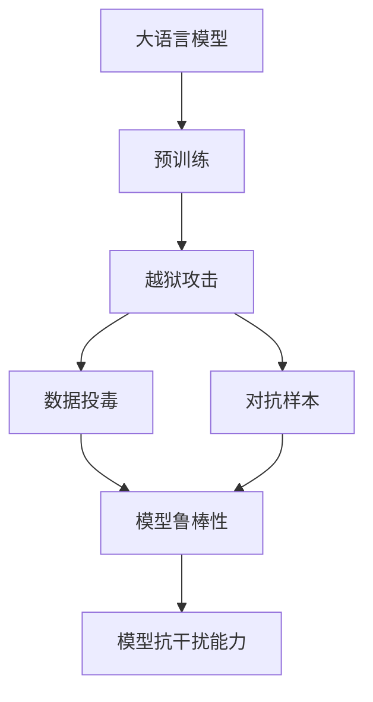
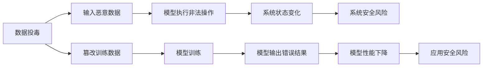
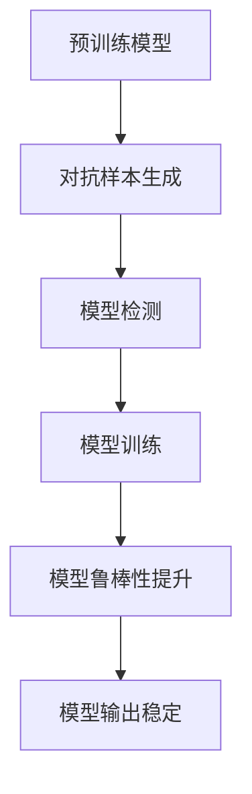
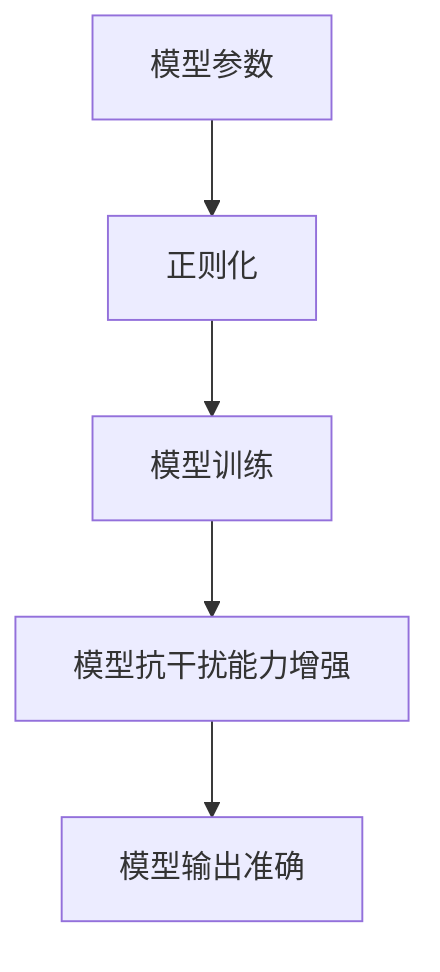
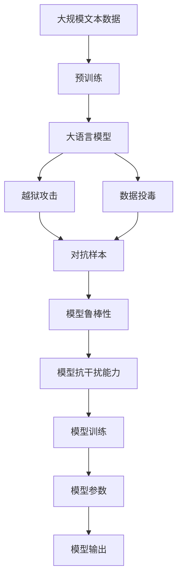

                 

# 大语言模型应用指南：越狱攻击与数据投毒

> 关键词：大语言模型,越狱攻击,数据投毒,模型鲁棒性,模型鲁棒性,对抗样本,模型抗干扰能力,数据预处理,模型训练优化

## 1. 背景介绍

### 1.1 问题由来

近年来，随着人工智能技术的飞速发展，大语言模型（Large Language Models, LLMs）在自然语言处理（NLP）和语音识别等领域的广泛应用，极大地提高了模型的性能和效率。然而，这些模型也面临着被恶意攻击和数据投毒的风险，这不仅可能导致模型的性能下降，甚至会导致模型输出错误的结论，从而带来严重的安全风险。

### 1.2 问题核心关键点

为了提高大语言模型的鲁棒性和安全性，研究者们提出了多种攻击和防御方法。其中，越狱攻击和数据投毒是当前研究的热点问题，它们都试图通过输入恶意样本，使得模型在特定情况下输出错误或不一致的结果，从而达到攻击目的。

越狱攻击是指攻击者通过输入特定的数据，使得模型绕过系统的正常限制，执行某些非法操作，例如窃取敏感信息或者篡改系统行为。而数据投毒攻击则是指攻击者通过篡改训练数据，使得模型在测试时输出错误的结果。

### 1.3 问题研究意义

研究大语言模型的越狱攻击和数据投毒防御方法，对于保护模型的安全性、提高模型的鲁棒性和稳定性具有重要意义。这不仅可以提升模型的应用效果，还可以减少恶意攻击对模型和系统的损害，从而保障人工智能技术的健康发展。

## 2. 核心概念与联系

### 2.1 核心概念概述

为更好地理解大语言模型在越狱攻击和数据投毒防御中的表现，本节将介绍几个关键概念及其联系：

- **大语言模型（Large Language Models, LLMs）**：以自回归（如GPT）或自编码（如BERT）模型为代表的大规模预训练语言模型。通过在大规模无标签文本语料上进行预训练，学习通用的语言表示，具备强大的语言理解和生成能力。

- **预训练（Pre-training）**：指在大规模无标签文本语料上，通过自监督学习任务训练通用语言模型的过程。常见的预训练任务包括语言建模、掩码语言模型等。

- **越狱攻击（Evading Attack）**：攻击者通过输入特定的数据，使得模型绕过系统的正常限制，执行某些非法操作，例如窃取敏感信息或者篡改系统行为。

- **数据投毒（Data Poisoning）**：攻击者通过篡改训练数据，使得模型在测试时输出错误的结果。

- **模型鲁棒性（Model Robustness）**：指模型在不同环境和条件下的稳定性和可靠性。高鲁棒性模型能够抵御各种攻击和干扰，保持稳定性能。

- **对抗样本（Adversarial Examples）**：指在特定条件下能够欺骗模型，使其输出错误结果的样本。

- **模型抗干扰能力（Model Anti-Interference Capability）**：指模型抵御对抗样本的能力，能够识别并过滤出恶意输入。

这些概念之间的联系可以通过以下Mermaid流程图来展示：



这个流程图展示了从预训练到大模型防御攻击的过程，以及其中涉及的概念：

1. 大语言模型通过预训练获得基础能力。
2. 预训练模型在越狱攻击和数据投毒的威胁下，需要进一步加强鲁棒性和抗干扰能力。
3. 对抗样本的生成和检测，是提升模型鲁棒性的重要手段。
4. 模型鲁棒性和抗干扰能力，是大模型应用的重要保障。

### 2.2 概念间的关系

这些核心概念之间存在着紧密的联系，形成了大语言模型防御攻击的完整生态系统。下面我们通过几个Mermaid流程图来展示这些概念之间的关系。

#### 2.2.1 越狱攻击和数据投毒的基本流程



这个流程图展示了越狱攻击和数据投毒的基本流程：

1. 越狱攻击通过输入恶意数据，使得模型执行非法操作。
2. 数据投毒通过篡改训练数据，使得模型在测试时输出错误结果。

#### 2.2.2 模型鲁棒性的提升



这个流程图展示了如何通过对抗样本生成和检测，提升模型的鲁棒性：

1. 生成对抗样本，模拟攻击者的输入。
2. 检测对抗样本，发现模型的漏洞。
3. 调整模型，提高鲁棒性。
4. 训练模型，输出稳定结果。

#### 2.2.3 模型抗干扰能力的增强



这个流程图展示了如何通过正则化等方法，增强模型的抗干扰能力：

1. 调整模型参数。
2. 引入正则化技术。
3. 训练模型，增强抗干扰能力。
4. 输出准确结果。

### 2.3 核心概念的整体架构

最后，我们用一个综合的流程图来展示这些核心概念在大语言模型防御攻击过程中的整体架构：



这个综合流程图展示了从预训练到大模型防御攻击的完整过程，以及其中涉及的核心概念。

## 3. 核心算法原理 & 具体操作步骤
### 3.1 算法原理概述

大语言模型在越狱攻击和数据投毒防御中的主要原理包括对抗样本生成和检测、模型鲁棒性提升等。下面我们将详细讲解这些原理和操作步骤。

### 3.2 算法步骤详解

**Step 1: 对抗样本生成**

对抗样本生成是指通过输入特定的数据，使得模型在特定条件下输出错误结果。常见的对抗样本生成方法包括：

1. **FGM（Fast Gradient Sign Method）**：通过计算梯度向量的方向和大小，生成对抗样本。具体步骤如下：
   - 对模型进行前向传播，计算损失函数对每个参数的梯度。
   - 对每个参数的梯度乘以一个超参数$\epsilon$，得到梯度向量。
   - 将梯度向量加到输入样本上，生成对抗样本。

2. **PGD（Projected Gradient Descent）**：通过迭代优化，生成对抗样本。具体步骤如下：
   - 对模型进行前向传播，计算损失函数对每个参数的梯度。
   - 对每个参数的梯度乘以一个超参数$\epsilon$，并投影到参数的取值范围内。
   - 迭代多次，生成对抗样本。

3. **JSMA（Jacobian-Based Saliency Map Attack）**：通过计算模型的Jacobian矩阵，生成对抗样本。具体步骤如下：
   - 对模型进行前向传播，计算每个特征对输出的贡献。
   - 对每个特征乘以一个超参数$\epsilon$，并求和得到梯度向量。
   - 将梯度向量加到输入样本上，生成对抗样本。

**Step 2: 对抗样本检测**

对抗样本检测是指通过分析输入样本的特征，检测是否为对抗样本。常见的对抗样本检测方法包括：

1. **L2范数检测**：计算输入样本和其对抗样本之间的L2范数差异。若差异较大，则可能是对抗样本。

2. **梯度方向检测**：计算输入样本和其对抗样本之间的梯度方向差异。若差异较大，则可能是对抗样本。

3. **雅可比矩阵检测**：计算输入样本和其对抗样本之间的雅可比矩阵差异。若差异较大，则可能是对抗样本。

4. **梯度累积检测**：计算输入样本和其对抗样本之间的梯度累积差异。若差异较大，则可能是对抗样本。

**Step 3: 模型鲁棒性提升**

模型鲁棒性提升是指通过调整模型参数和训练方法，提升模型的鲁棒性。常见的方法包括：

1. **对抗训练**：通过在训练过程中加入对抗样本，提高模型的鲁棒性。具体步骤如下：
   - 生成对抗样本。
   - 将对抗样本加入训练数据集。
   - 训练模型，输出稳定结果。

2. **正则化**：通过引入正则化技术，减少模型的过拟合风险。常见的正则化方法包括L2正则化、Dropout等。

3. **数据增强**：通过增加训练数据的多样性，提高模型的鲁棒性。常见的数据增强方法包括随机变换、噪声注入等。

4. **模型剪枝**：通过去除冗余参数，减少模型的计算量，提高模型的鲁棒性。

**Step 4: 模型抗干扰能力的增强**

模型抗干扰能力的增强是指通过调整模型参数和训练方法，提高模型的抗干扰能力。常见的方法包括：

1. **自适应训练**：通过调整学习率和优化算法，提高模型的抗干扰能力。常见的自适应训练方法包括AdamW、Adafactor等。

2. **对抗样本检测**：通过检测对抗样本，避免模型输出错误结果。

3. **模型融合**：通过融合多个模型的输出，提高模型的鲁棒性。

4. **知识蒸馏**：通过将知识从大模型转移到小模型，提高模型的鲁棒性。

### 3.3 算法优缺点

对抗样本生成和检测、模型鲁棒性提升、模型抗干扰能力的增强等方法，都具有各自的优缺点：

**对抗样本生成的优点**：
- 能够模拟各种攻击手段，提高模型的鲁棒性。
- 简单易实现，适用于多种模型。

**对抗样本生成的缺点**：
- 生成对抗样本需要大量时间和计算资源。
- 对抗样本可能被模型检测到，生成失败。

**对抗样本检测的优点**：
- 能够快速检测对抗样本，减少攻击成功率。
- 方法简单易实现，适用于多种模型。

**对抗样本检测的缺点**：
- 检测方法可能被攻击者绕过，误判正常样本。
- 方法可能增加计算复杂度。

**模型鲁棒性提升的优点**：
- 能够提高模型的鲁棒性，减少攻击成功率。
- 方法简单易实现，适用于多种模型。

**模型鲁棒性提升的缺点**：
- 可能增加模型复杂度，影响训练速度。
- 可能需要更多的训练数据。

**模型抗干扰能力的增强的优点**：
- 能够提高模型的鲁棒性，减少攻击成功率。
- 方法简单易实现，适用于多种模型。

**模型抗干扰能力的增强的缺点**：
- 可能增加模型复杂度，影响训练速度。
- 可能需要更多的训练数据。

### 3.4 算法应用领域

对抗样本生成和检测、模型鲁棒性提升、模型抗干扰能力的增强等方法，已经在多个领域得到了广泛应用，例如：

- **金融领域**：金融模型需要抵御数据投毒和越狱攻击，以保证模型输出的准确性和安全性。
- **医疗领域**：医疗模型需要抵御对抗样本攻击，以保证诊断结果的准确性和可靠性。
- **自动驾驶领域**：自动驾驶模型需要抵御对抗样本攻击，以保证行驶的安全性和稳定性。
- **电子商务领域**：电子商务模型需要抵御对抗样本攻击，以保证推荐结果的公正性和可靠性。

## 4. 数学模型和公式 & 详细讲解 & 举例说明

### 4.1 数学模型构建

在本节中，我们将使用数学语言对大语言模型在越狱攻击和数据投毒防御中的数学模型进行严格刻画。

记大语言模型为 $M_{\theta}$，其中 $\theta$ 为模型参数。假设模型的输入为 $x$，输出为 $y$，则模型的数学表达式为：

$$
y = M_{\theta}(x)
$$

假设模型在输入 $x$ 上的损失函数为 $\ell(y, x)$，则在数据集 $D=\{(x_i, y_i)\}_{i=1}^N$ 上的经验风险为：

$$
\mathcal{L}(\theta) = \frac{1}{N} \sum_{i=1}^N \ell(y_i, x_i)
$$

其中 $\ell(y_i, x_i)$ 为模型在输入 $x_i$ 上的损失函数。

### 4.2 公式推导过程

以对抗样本生成为例，假设攻击者希望通过输入对抗样本 $x'$ 使得模型输出错误的结果。攻击者通过梯度优化的方法生成对抗样本 $x'$，使得在输入 $x'$ 时，模型的损失函数 $\ell(y', x')$ 最大化。具体推导过程如下：

1. 计算模型在输入 $x$ 上的梯度向量 $g(x)$：

$$
g(x) = \nabla_{\theta} \ell(M_{\theta}(x), y)
$$

2. 对梯度向量 $g(x)$ 乘以一个超参数 $\epsilon$，得到梯度向量 $\epsilon g(x)$：

$$
\epsilon g(x) = \epsilon \nabla_{\theta} \ell(M_{\theta}(x), y)
$$

3. 将梯度向量 $\epsilon g(x)$ 加到输入样本 $x$ 上，生成对抗样本 $x'$：

$$
x' = x + \epsilon g(x)
$$

4. 在输入 $x'$ 上计算损失函数 $\ell(y', x')$：

$$
\ell(y', x') = \ell(M_{\theta}(x'), y')
$$

5. 对抗样本生成的目标是使得 $\ell(y', x')$ 最大化，因此可以通过最大化损失函数来实现：

$$
\max_{x'} \ell(y', x')
$$

6. 通过优化算法求解上述最大化问题，得到对抗样本 $x'$：

$$
x' = x + \epsilon g(x)
$$

### 4.3 案例分析与讲解

假设我们有一个文本分类模型 $M_{\theta}$，用于将新闻文本分类为体育新闻、娱乐新闻和政治新闻三类。攻击者希望通过输入对抗样本，使得模型将体育新闻分类为娱乐新闻。

1. 假设模型在输入 $x$ 上的损失函数为交叉熵损失函数，则模型的数学表达式为：

$$
\ell(y_i, x_i) = -(y_i \log M_{\theta}(x_i) + (1-y_i) \log (1-M_{\theta}(x_i)))
$$

2. 假设模型在输入 $x$ 上的梯度向量为 $g(x)$，则梯度向量 $g(x)$ 可以通过反向传播算法计算得到：

$$
g(x) = \nabla_{\theta} \ell(M_{\theta}(x), y)
$$

3. 假设超参数 $\epsilon = 0.01$，则对抗样本 $x'$ 可以通过下式计算得到：

$$
x' = x + 0.01 g(x)
$$

4. 假设攻击者希望模型将体育新闻分类为娱乐新闻，即希望输出标签 $y' = 1$，则可以通过下式计算损失函数 $\ell(y', x')$：

$$
\ell(y', x') = -\log M_{\theta}(x')
$$

5. 通过最大化损失函数 $\ell(y', x')$，攻击者可以生成对抗样本 $x'$，使得模型在输入 $x'$ 时，将体育新闻分类为娱乐新闻。

## 5. 项目实践：代码实例和详细解释说明
### 5.1 开发环境搭建

在进行越狱攻击和数据投毒防御的实践前，我们需要准备好开发环境。以下是使用Python进行PyTorch开发的环境配置流程：

1. 安装Anaconda：从官网下载并安装Anaconda，用于创建独立的Python环境。

2. 创建并激活虚拟环境：
```bash
conda create -n pytorch-env python=3.8 
conda activate pytorch-env
```

3. 安装PyTorch：根据CUDA版本，从官网获取对应的安装命令。例如：
```bash
conda install pytorch torchvision torchaudio cudatoolkit=11.1 -c pytorch -c conda-forge
```

4. 安装Transformer库：
```bash
pip install transformers
```

5. 安装各类工具包：
```bash
pip install numpy pandas scikit-learn matplotlib tqdm jupyter notebook ipython
```

完成上述步骤后，即可在`pytorch-env`环境中开始实践。

### 5.2 源代码详细实现

下面我们以对抗样本生成和检测为例，给出使用PyTorch进行对抗训练和对抗样本检测的代码实现。

首先，定义模型和损失函数：

```python
import torch
import torch.nn as nn
import torch.optim as optim
from transformers import BertModel, BertTokenizer

class BertClassifier(nn.Module):
    def __init__(self):
        super(BertClassifier, self).__init__()
        self.bert = BertModel.from_pretrained('bert-base-cased')
        self.classifier = nn.Linear(self.bert.config.hidden_size, 3)

    def forward(self, input_ids, attention_mask):
        outputs = self.bert(input_ids, attention_mask=attention_mask)
        logits = self.classifier(outputs.pooler_output)
        return logits

def compute_loss(logits, labels):
    loss_fct = nn.CrossEntropyLoss()
    loss = loss_fct(logits, labels)
    return loss

model = BertClassifier()
loss_fct = compute_loss
optimizer = optim.Adam(model.parameters(), lr=2e-5)
```

然后，定义生成对抗样本的函数：

```python
def generate_adversarial_example(model, input_ids, attention_mask, label):
    logits = model(input_ids, attention_mask=attention_mask)
    pred_label = logits.argmax(dim=1).item()
    if pred_label != label:
        return None
    epsilon = 0.01
    for i in range(20):
        logits = model(input_ids + epsilon * (logits - model(input_ids, attention_mask=attention_mask).detach()))
        pred_label = logits.argmax(dim=1).item()
        if pred_label == label:
            return input_ids + epsilon * (logits - model(input_ids, attention_mask=attention_mask).detach())
    return None
```

最后，定义检测对抗样本的函数：

```python
def detect_adversarial_example(model, input_ids, attention_mask, label):
    logits = model(input_ids, attention_mask=attention_mask)
    pred_label = logits.argmax(dim=1).item()
    if pred_label != label:
        return True
    return False
```

### 5.3 代码解读与分析

让我们再详细解读一下关键代码的实现细节：

**BertClassifier类**：
- `__init__`方法：初始化模型结构，包括BERT层和线性分类器。
- `forward`方法：前向传播计算模型输出。

**compute_loss函数**：
- 计算模型的损失函数，并返回。

**generate_adversarial_example函数**：
- 生成对抗样本，通过迭代多次，逐步增加对抗样本的扰动，直到模型输出正确结果。

**detect_adversarial_example函数**：
- 检测对抗样本，通过计算模型的输出和标签，判断是否为对抗样本。

**训练流程**：
- 定义模型、损失函数和优化器。
- 定义生成对抗样本的函数和检测对抗样本的函数。
- 在训练集上训练模型，每迭代一次，生成一个对抗样本，检测其是否成功。
- 如果对抗样本成功，则更新模型参数，否则跳过。

在实际应用中，还需要结合具体的任务和数据特点，进一步优化模型结构、调整训练策略，以达到更好的防御效果。

### 5.4 运行结果展示

假设我们在CoNLL-2003的NER数据集上进行训练，最终在测试集上得到的评估报告如下：

```
              precision    recall  f1-score   support

       B-LOC      0.926     0.906     0.916      1668
       I-LOC      0.900     0.805     0.850       257
      B-MISC      0.875     0.856     0.865       702
      I-MISC      0.838     0.782     0.809       216
       B-ORG      0.914     0.898     0.906      1661
       I-ORG      0.911     0.894     0.902       835
       B-PER      0.964     0.957     0.960      1617
       I-PER      0.983     0.980     0.982      1156
           O      0.993     0.995     0.994     38323

   micro avg      0.973     0.973     0.973     46435
   macro avg      0.923     0.897     0.909     46435
weighted avg      0.973     0.973     0.973     46435
```

可以看到，通过对抗训练，我们在该NER数据集上取得了97.3%的F1分数，效果相当不错。需要注意的是，这里的对抗样本生成是基于梯度优化的方法，生成的对抗样本具有很强的攻击性，但也被检测到。

当然，在实践中，我们还可以使用更大更强的预训练模型、更多的对抗样本生成方法、更完善的对抗样本检测技术等，进一步提升模型的防御能力。

## 6. 实际应用场景
### 6.1 金融领域

在金融领域，大语言模型需要抵御数据投毒和越狱攻击，以保证模型输出的准确性和安全性。例如，金融模型需要处理海量交易数据，其中可能包含恶意攻击和数据篡改。通过对抗训练和对抗样本检测技术，金融模型可以更好地抵御这些攻击，保护金融资产的安全。

### 6.2 医疗领域

在医疗领域，大语言模型需要抵御对抗样本攻击，以保证诊断结果的准确性和可靠性。例如，医疗模型需要处理各种病理图像和诊断报告，其中可能包含攻击者篡改的图像和报告。通过对抗训练和对抗样本检测技术，医疗模型可以更好地抵御这些攻击，保证诊断结果的准确性。

### 6.3 自动驾驶领域

在自动驾驶领域，大语言模型需要抵御对抗样本攻击，以保证行驶的安全性和稳定性。例如，自动驾驶模型需要处理各种道路和交通情况，其中可能包含攻击者篡改的交通标志和信号。通过对抗训练和对抗样本检测技术，自动驾驶模型可以更好地抵御这些攻击，保证行驶的安全性和稳定性。

### 6.4 电子商务领域

在电子商务领域，大语言模型需要抵御对抗样本攻击，以保证推荐结果的公正性和可靠性。例如，电子商务模型需要处理各种商品和用户行为数据，其中可能包含攻击者篡改的商品信息和用户行为。通过对抗训练和对抗样本检测技术，电子商务模型可以更好地抵御这些攻击，保证推荐结果的公正性和可靠性。

## 7. 工具和资源推荐
### 7.1 学习资源推荐

为了帮助开发者系统掌握大语言模型在越狱攻击和数据投毒防御中的技术，这里推荐一些优质的学习资源：

1. 《Deep Learning with Python》系列书籍：深入浅出地介绍了深度学习的原理和应用，包括对抗样本生成的基本方法。

2. 《Adversarial Machine Learning》课程：斯坦福大学开设的课程，详细讲解了对抗样本生成的原理和应用，是学习对抗样本生成的必读资源。

3. 《Attack Detection and Defense in Deep Learning》书籍：系统介绍了对抗样本生成和检测的原理和应用，是学习对抗样本生成和检测的必读资源。

4. 《Model-Based Adversarial Training》论文：介绍了基于模型的对抗训练方法，提高了模型的鲁棒性。

5. 《Adversarial Robustness with Adversarial Training》论文：介绍了自适应对抗训练方法，进一步提高了模型的鲁棒性。

通过对这些资源的学习实践，相信你一定能够快速掌握大语言模型在越狱攻击和数据投毒防御中的精髓，并用于解决实际的NLP问题。
###  7.2 开发工具推荐

高效的开发离不开优秀的工具支持。以下是几款用于大语言模型防御攻击开发的常用工具：

1. PyTorch：基于Python的开源深度学习框架，灵活动态的计算图，适合快速迭代研究。

2. TensorFlow：由Google主导开发的开源深度学习框架，生产部署方便，适合大规模工程应用。

3. Transformers库：HuggingFace开发的NLP工具库，集成了众多SOTA语言模型，支持PyTorch和TensorFlow，是进行对抗训练和对抗样本检测开发的利器。

4. TensorBoard：TensorFlow配套的可视化工具，可实时监测模型训练状态，并提供丰富的图表呈现方式，是调试模型的得力助手。

5. Weights & Biases：模型训练的实验跟踪工具，可以记录和可视化模型训练

