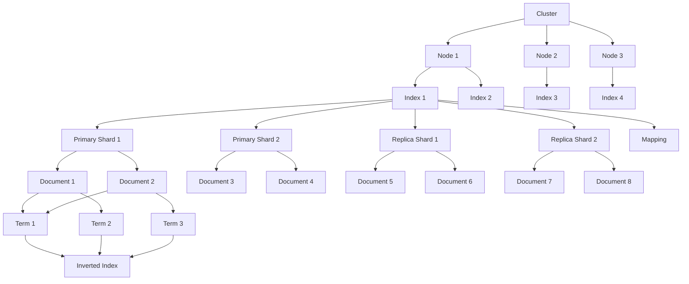

# ElasticSearch Index原理与代码实例讲解

## 1. 背景介绍

### 1.1 问题的由来

在当今大数据时代，海量数据的存储和高效检索成为了一个巨大的挑战。传统的关系型数据库在处理结构化数据方面表现出色,但在处理非结构化、半结构化数据时却显得力不从心。这种数据通常来自日志文件、社交媒体、电子邮件等多种来源,具有海量、多样性和不确定性等特点。为了有效地管理和利用这些数据,我们需要一种全新的解决方案。

### 1.2 研究现状

近年来,随着开源搜索引擎 Elasticsearch 的兴起,它为大数据场景下的数据存储、检索和分析提供了一种高效、可扩展和分布式的解决方案。Elasticsearch 基于 Lucene 库,采用倒排索引的数据结构,支持全文检索、结构化搜索、分析和聚合等功能。它不仅能够处理结构化数据,还能够处理非结构化数据,如文本、地理位置数据和嵌套对象等。

### 1.3 研究意义

深入理解 Elasticsearch 的索引原理对于充分利用其强大的搜索和分析能力至关重要。索引是 Elasticsearch 的核心,它决定了数据的组织方式、查询效率和可扩展性。通过研究索引的内部机制,我们可以更好地优化索引结构、提高查询性能,并根据具体的应用场景进行定制化优化。

### 1.4 本文结构

本文将全面探讨 Elasticsearch 索引的原理和实现细节。首先,我们将介绍 Elasticsearch 中的核心概念和它们之间的关系。接下来,我们将深入探讨索引的核心算法原理和具体操作步骤,包括倒排索引的构建过程、分词器的工作原理等。然后,我们将详细讲解与索引相关的数学模型和公式,并通过实际案例进行说明。此外,我们还将提供一个完整的项目实践,包括代码实例和详细解释。最后,我们将探讨 Elasticsearch 在实际应用场景中的应用,介绍相关工具和资源,并总结未来发展趋势和面临的挑战。

## 2. 核心概念与联系

在深入探讨 Elasticsearch 索引原理之前,我们需要先了解一些核心概念及它们之间的关系。

### 2.1 集群 (Cluster)

Elasticsearch 是一个分布式系统,可以由一个或多个节点组成集群。集群中的每个节点都是一个独立的 Elasticsearch 实例,它们共同协作,存储和处理整个数据集。集群提供了高可用性、容错能力和可扩展性。

### 2.2 节点 (Node)

节点是构成 Elasticsearch 集群的单个服务器实例。每个节点都可以存储数据,参与集群的索引和搜索功能。节点分为以下几种类型:

- 主节点 (Master Node): 负责集群管理,如创建或删除索引、添加或移除节点等。
- 数据节点 (Data Node): 用于存储数据的节点,负责数据相关的操作,如 CRUD、搜索和聚合。
- 协调节点 (Coordinating Node): 处理客户端请求,将请求转发到相应的数据节点,并将结果返回给客户端。
- 机器学习节点 (Machine Learning Node): 执行机器学习任务,如anomaly detection。

### 2.3 索引 (Index)

索引是 Elasticsearch 中存储关联数据的地方,相当于关系型数据库中的"数据库"概念。每个索引都有一个或多个主分片 (Primary Shard),以及可选的副本分片 (Replica Shard)。

### 2.4 分片 (Shard)

分片是 Elasticsearch 中的数据分布单位。每个索引都被水平划分为多个分片,这些分片分布在集群中的不同节点上,从而实现了数据的分布式存储和并行处理。分片分为主分片和副本分片两种类型。

### 2.5 映射 (Mapping)

映射类似于关系型数据库中的"schema"概念,它定义了索引中文档的结构,包括字段名、字段数据类型、分词器等。映射可以在创建索引时静态定义,也可以在索引文档时动态构建。

### 2.6 文档 (Document)

文档是 Elasticsearch 中的最小数据单元,相当于关系型数据库中的一行记录。每个文档都属于一个索引,并被存储在其中的一个主分片上。文档由一组键值对组成,这些键值对描述了文档的数据。

### 2.7 倒排索引 (Inverted Index)

倒排索引是 Elasticsearch 的核心数据结构,它将文档中的每个词条 (Term) 与包含该词条的文档列表相关联。这种数据结构使得全文搜索和结构化搜索变得高效和快速。

这些核心概念之间的关系如下所示:

## 3. 核心算法原理 & 具体操作步骤

### 3.1 算法原理概述

Elasticsearch 的核心算法是基于倒排索引的全文搜索算法。倒排索引是一种数据结构,它将文档中的每个词条与包含该词条的文档列表相关联。这种数据结构使得全文搜索和结构化搜索变得高效和快速。

在构建倒排索引时,Elasticsearch 会对文档进行分词 (Tokenization)、归一化 (Normalization)、过滤 (Filtering) 等一系列预处理操作。然后,它将每个词条与包含该词条的文档列表相关联,并存储在倒排索引中。

当用户发起搜索查询时,Elasticsearch 会将查询字符串进行相同的预处理操作,得到一系列查询词条。然后,它会在倒排索引中查找与这些词条相关联的文档列表,并根据相关性算分模型 (Relevance Scoring Model) 对结果进行排序。

### 3.2 算法步骤详解

1. **分词 (Tokenization)**

   分词是将文本按照一定的规则分解成一个个词条 (Term) 的过程。Elasticsearch 使用分词器 (Analyzer) 来执行分词操作。分词器由三个功能组件组成:

   - 字符过滤器 (Character Filter): 用于去除HTML标记、转换大小写等预处理操作。
   - 分词器 (Tokenizer): 将文本按照一定的规则分解成词条。常用的分词器有标准分词器 (Standard Tokenizer)、字符分词器 (Letter Tokenizer) 等。
   - 词条过滤器 (Token Filter): 用于进一步处理词条,如去除停用词、同义词替换等。

2. **归一化 (Normalization)**

   归一化是将词条转换为标准形式的过程,以便在搜索时能够匹配到相关文档。常见的归一化操作包括:

   - 小写转换 (Lowercasing)
   - 去除标点符号 (Removing Punctuation)
   - 词干提取 (Stemming)

3. **倒排索引构建**

   经过分词和归一化后,Elasticsearch 会构建倒排索引。倒排索引是一种数据结构,它将每个词条与包含该词条的文档列表相关联。构建过程如下:

   - 遍历每个文档
   - 对每个文档进行分词和归一化
   - 对于每个词条,将包含该词条的文档信息 (如文档 ID、词条位置等) 添加到该词条的倒排索引列表中

4. **查询处理**

   当用户发起搜索查询时,Elasticsearch 会执行以下步骤:

   - 对查询字符串进行分词和归一化
   - 在倒排索引中查找与查询词条相关联的文档列表
   - 根据相关性算分模型 (Relevance Scoring Model) 对结果进行排序
   - 返回排序后的搜索结果

### 3.3 算法优缺点

**优点:**

- 高效的全文搜索和结构化搜索能力
- 支持分布式存储和并行处理,具有良好的可扩展性
- 支持近实时 (Near Real-Time, NRT) 搜索,数据更新后几秒内即可被搜索到
- 提供丰富的查询语言和聚合功能,满足复杂的业务需求

**缺点:**

- 不适合存储大量需要频繁更新的数据,因为每次更新都需要重建倒排索引
- 不支持事务和复杂的联合查询,不适合作为主数据库使用
- 对于低选择性的查询 (如搜索常见词条),性能可能会受到影响
- 需要合理规划索引结构和分片策略,否则可能导致数据倾斜和性能下降

### 3.4 算法应用领域

Elasticsearch 的倒排索引算法广泛应用于以下领域:

- 全文搜索: 如电商网站的商品搜索、网站内容搜索等
- 日志分析: 对海量日志数据进行集中存储和分析
- 指标监控: 收集和分析各种系统和应用指标数据
- 安全分析: 检测和分析安全事件和威胁
- 地理位置数据处理: 存储和查询地理位置相关数据
- 自动补全: 实现搜索建议和自动补全功能

## 4. 数学模型和公式 & 详细讲解 & 举例说明

### 4.1 数学模型构建

Elasticsearch 使用 BM25 (Best Matching 25) 相关性算分模型来评估文档与查询的相关程度。BM25 是一种基于概率模型的排序算法,它考虑了以下几个主要因素:

- 词条频率 (Term Frequency, TF): 词条在文档中出现的次数
- 反向文档频率 (Inverse Document Frequency, IDF): 词条在整个索引中的稀有程度
- 字段长度归一化 (Field-Length Norm): 文档字段长度的影响
- 查询词条权重 (Query Term Weight): 查询中每个词条的重要性

BM25 算分函数的数学表达式如下:

$$score(D, Q) = \sum_{q \in Q} \mathrm{IDF}(q) \cdot \frac{f(q, D) \cdot (k_1 + 1)}{f(q, D) + k_1 \cdot \left( 1 - b + b \cdot \frac{|D|}{avgdl} \right)}$$

其中:

- $D$ 表示文档
- $Q$ 表示查询
- $q$ 表示查询中的词条
- $\mathrm{IDF}(q)$ 表示词条 $q$ 的反向文档频率
- $f(q, D)$ 表示词条 $q$ 在文档 $D$ 中出现的次数
- $|D|$ 表示文档 $D$ 的字段长度
- $avgdl$ 表示索引中所有文档的平均字段长度
- $k_1$ 和 $b$ 是可调参数,用于控制词条频率和字段长度的影响程度

### 4.2 公式推导过程

BM25 算分函数的推导过程基于以下假设:

1. 文档相关性与查询词条的出现次数成正比
2. 文档相关性与文档长度成反比
3. 文档相关性与词条的稀有程度成正比

根据这些假设,我们可以推导出 BM25 算分函数的各个组成部分。

**词条频率 (TF) 部分**

$$\mathrm{TF}(q, D) = \frac{f(q, D)}{f(q, D)