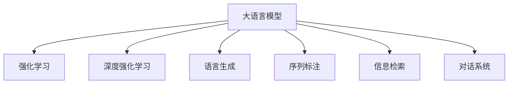
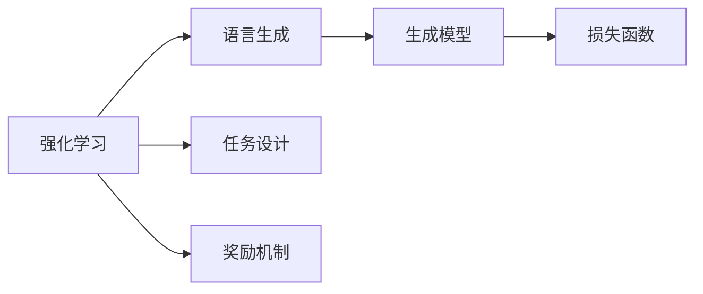
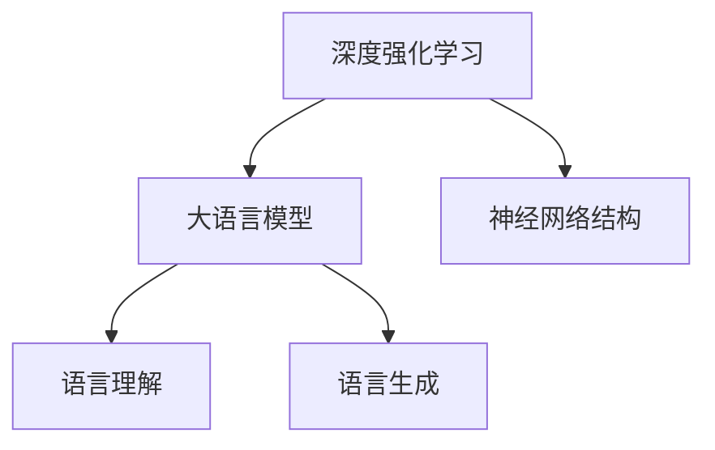
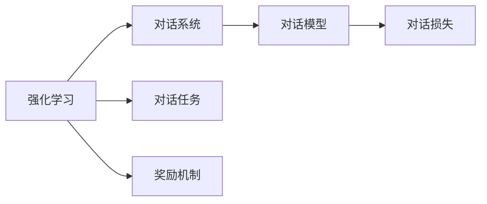
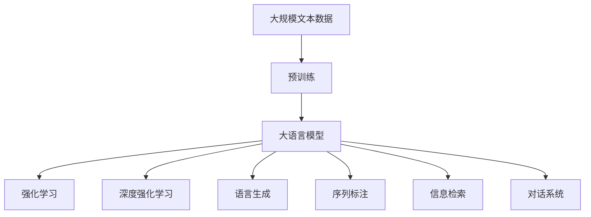

                 

# 大语言模型原理与工程实践：揭秘大语言模型中的强化建模

> 关键词：大语言模型, 强化学习, 深度强化学习, 语言生成, 自然语言处理(NLP), 深度学习, 模型训练, 参数优化, 应用场景

## 1. 背景介绍

### 1.1 问题由来
随着深度学习技术的发展，大语言模型在自然语言处理(NLP)领域取得了显著的进步。这些模型通过在大规模无标签文本数据上进行预训练，学习到了丰富的语言知识。然而，这些预训练模型仍然存在诸多问题，如模型参数过多、计算资源消耗大、泛化能力不足等。强化学习作为一种高效且通用的模型训练方法，为解决这些问题提供了新的思路。

### 1.2 问题核心关键点
强化学习是一种通过奖励机制指导模型参数优化的方法。在NLP中，强化学习可以通过设计特定的任务和奖励机制，引导模型学习更加合理的语言表征和生成能力。与传统的监督学习方法不同，强化学习方法能够主动探索最优的模型策略，减少对标注数据的依赖，同时提升模型的泛化能力。

强化学习在大语言模型中的应用，主要包括以下几个方面：

- **语言生成**：通过设计合适的生成任务和奖励机制，训练模型学习如何生成更加流畅、自然的语言文本。
- **序列标注**：设计序列标注任务，如命名实体识别、词性标注等，通过强化学习方法训练模型学习如何进行序列预测。
- **信息检索**：设计信息检索任务，如问答系统、文本匹配等，通过强化学习优化检索策略。
- **对话系统**：设计对话任务，如基于上下文的对话生成，通过强化学习训练模型学习如何进行多轮对话。

### 1.3 问题研究意义
强化学习在大语言模型中的应用，可以显著提升模型的泛化能力和应用效果。通过设计合适的任务和奖励机制，强化学习方法能够引导模型学习更加合理的语言表征和生成能力，从而提升模型在实际应用中的性能。同时，强化学习方法能够避免过拟合，减少对标注数据的依赖，使得模型更加灵活和鲁棒。

此外，强化学习方法还适用于诸如对话生成、信息检索等动态变化的任务，能够根据实际情况实时调整策略，提升模型的适应性和鲁棒性。因此，深入研究强化学习方法在大语言模型中的应用，对于推动NLP技术的发展具有重要意义。

## 2. 核心概念与联系

### 2.1 核心概念概述

为更好地理解强化学习在大语言模型中的应用，本节将介绍几个密切相关的核心概念：

- **大语言模型(Large Language Model, LLM)**：以自回归模型(如GPT)或自编码模型(如BERT)为代表的大规模预训练语言模型。通过在大规模无标签文本数据上进行预训练，学习通用的语言表示，具备强大的语言理解和生成能力。

- **强化学习(Reinforcement Learning, RL)**：一种通过奖励机制指导模型参数优化的方法。模型在环境中执行一系列动作，根据环境的反馈获取奖励，通过最大化累计奖励来学习最优策略。

- **深度强化学习(Deep Reinforcement Learning, DRL)**：利用深度神经网络进行强化学习，通过学习输入-输出映射，提升模型的决策能力。

- **语言生成(Language Generation)**：利用大语言模型生成自然流畅的语言文本，如机器翻译、文本摘要、对话生成等。

- **序列标注(Sequence Labeling)**：对序列数据进行标记，如命名实体识别、词性标注等，通过强化学习方法训练模型学习如何进行序列预测。

- **信息检索(Information Retrieval)**：在大规模文本数据中检索与查询文本最相关的文档，如问答系统、文本匹配等，通过强化学习优化检索策略。

- **对话系统(Dialogue System)**：使机器能够与人自然对话，如基于上下文的对话生成，通过强化学习训练模型学习如何进行多轮对话。

这些核心概念之间的逻辑关系可以通过以下Mermaid流程图来展示：



这个流程图展示了大语言模型中的核心概念以及它们之间的联系：

1. 大语言模型通过预训练学习通用的语言表示。
2. 强化学习在大语言模型中应用广泛，如语言生成、序列标注、信息检索和对话系统等。
3. 深度强化学习利用深度神经网络提升强化学习的效果，特别是在复杂的语言生成任务中。

### 2.2 概念间的关系

这些核心概念之间存在着紧密的联系，形成了大语言模型强化学习的完整生态系统。下面我们通过几个Mermaid流程图来展示这些概念之间的关系。

#### 2.2.1 强化学习与语言生成



这个流程图展示了强化学习在语言生成任务中的应用。通过设计生成任务和奖励机制，强化学习引导模型学习如何进行语言生成，最终得到流畅自然的语言文本。

#### 2.2.2 深度强化学习与大语言模型



这个流程图展示了深度强化学习在大语言模型中的应用。通过使用深度神经网络作为强化学习的执行器，大语言模型可以更好地进行语言理解和生成。

#### 2.2.3 强化学习在序列标注中的应用


这个流程图展示了强化学习在序列标注中的应用。通过设计序列标注任务和奖励机制，强化学习训练模型进行序列预测，提升序列标注的准确性。

#### 2.2.4 强化学习在信息检索中的应用


这个流程图展示了强化学习在信息检索中的应用。通过设计信息检索任务和奖励机制，强化学习训练模型进行文本匹配和信息检索，提升检索的准确性和相关性。

#### 2.2.5 强化学习在对话系统中的应用



这个流程图展示了强化学习在对话系统中的应用。通过设计对话任务和奖励机制，强化学习训练模型进行多轮对话，提升对话的流畅性和准确性。

### 2.3 核心概念的整体架构

最后，我们用一个综合的流程图来展示这些核心概念在大语言模型强化学习中的整体架构：



这个综合流程图展示了从预训练到强化学习的完整过程。大语言模型首先在大规模文本数据上进行预训练，然后通过强化学习进行任务适配，提升模型的泛化能力和应用效果。

## 3. 核心算法原理 & 具体操作步骤
### 3.1 算法原理概述

强化学习在大语言模型中的应用，本质上是一种通过奖励机制优化模型参数的方法。其核心思想是：将预训练语言模型视作一个强化学习代理，通过与环境的交互，学习最优的语言生成策略。

形式化地，假设预训练语言模型为 $M_{\theta}$，其中 $\theta$ 为预训练得到的模型参数。在语言生成任务中，环境的奖励函数为 $R(y|x)$，表示模型在输入 $x$ 下生成的输出 $y$ 获得的奖励。强化学习的目标是通过最大化累计奖励 $\sum_{t=0}^{T}R(y_t|x_t)$ 来学习最优的语言生成策略。

通过梯度下降等优化算法，强化学习过程不断更新模型参数 $\theta$，最大化累计奖励，使得模型输出的语言更加自然流畅。由于 $\theta$ 已经通过预训练获得了较好的初始化，因此即便在小规模数据集上进行强化学习，也能较快收敛到最优的语言生成策略。

### 3.2 算法步骤详解

强化学习在大语言模型中的应用一般包括以下几个关键步骤：

**Step 1: 准备预训练模型和环境**

- 选择合适的预训练语言模型 $M_{\theta}$ 作为初始化参数，如 BERT、GPT 等。
- 设计环境，包括状态空间、动作空间和奖励函数。例如，在语言生成任务中，状态空间为输入文本，动作空间为生成下一个字符或单词，奖励函数为语言流畅度和语法正确性。

**Step 2: 设置强化学习超参数**

- 选择合适的强化学习算法及其参数，如策略梯度算法、蒙特卡罗树搜索等，设置学习率、迭代次数等。
- 设置正则化技术及强度，包括权重衰减、Dropout、Early Stopping 等。
- 确定奖励函数的细节，如奖励函数的定义、奖励的尺度等。

**Step 3: 执行强化学习训练**

- 将训练集数据分批次输入模型，前向传播计算奖励值。
- 根据设定的强化学习算法更新模型参数。例如，策略梯度算法通过计算政策梯度来更新模型参数，蒙特卡罗树搜索通过搜索最优策略来更新模型参数。
- 周期性在验证集上评估模型性能，根据性能指标决定是否触发 Early Stopping。
- 重复上述步骤直到满足预设的迭代轮数或 Early Stopping 条件。

**Step 4: 测试和部署**

- 在测试集上评估强化学习后模型 $M_{\hat{\theta}}$ 的性能，对比强化学习前后的效果提升。
- 使用强化学习后的模型对新样本进行推理预测，集成到实际的应用系统中。
- 持续收集新的数据，定期重新训练模型，以适应数据分布的变化。

以上是强化学习在大语言模型中的应用的一般流程。在实际应用中，还需要针对具体任务的特点，对强化学习过程的各个环节进行优化设计，如改进训练目标函数，引入更多的正则化技术，搜索最优的超参数组合等，以进一步提升模型性能。

### 3.3 算法优缺点

强化学习在大语言模型中的应用具有以下优点：

1. 主动探索。强化学习方法能够主动探索最优的语言生成策略，避免了对标注数据的依赖，提升模型的泛化能力。
2. 参数高效。强化学习方法可以通过参数高效的方法，如策略梯度、蒙特卡罗树搜索等，在固定大部分预训练参数的情况下，仍可取得不错的效果。
3. 适应性强。强化学习方法可以适应动态变化的任务和数据，具有较好的鲁棒性。
4. 效果显著。在学术界和工业界的诸多任务上，强化学习方法已经刷新了多项NLP任务SOTA。

同时，该方法也存在一定的局限性：

1. 计算复杂度高。强化学习需要大量的计算资源和时间，特别是在大模型上，计算复杂度更高。
2. 奖励设计困难。如何设计合适的奖励函数，引导模型学习最优策略，仍然是一个难题。
3. 过拟合风险高。强化学习模型容易过拟合，特别是在样本量较少的情况下，需要更多的正则化技术来防止过拟合。
4. 可解释性不足。强化学习模型通常缺乏可解释性，难以对其推理逻辑进行分析和调试。

尽管存在这些局限性，但就目前而言，强化学习方法仍是大语言模型应用的重要范式。未来相关研究的重点在于如何进一步降低计算复杂度，提高奖励设计能力，以及增强模型的可解释性，同时兼顾可解释性和伦理安全性等因素。

### 3.4 算法应用领域

强化学习在大语言模型中的应用，已经在NLP领域取得了显著的进展。以下是一些常见的应用领域：

- **语言生成**：如机器翻译、文本摘要、对话生成等。通过强化学习方法训练模型学习如何进行语言生成，提升语言流畅度和语法正确性。
- **序列标注**：如命名实体识别、词性标注等。通过设计序列标注任务和奖励机制，强化学习训练模型进行序列预测，提升标注准确性。
- **信息检索**：如问答系统、文本匹配等。通过设计信息检索任务和奖励机制，强化学习训练模型进行文本匹配和信息检索，提升检索的准确性和相关性。
- **对话系统**：如基于上下文的对话生成、多轮对话系统等。通过设计对话任务和奖励机制，强化学习训练模型进行多轮对话，提升对话的流畅性和准确性。

除了上述这些经典任务外，强化学习还适用于更多场景中，如可控文本生成、多模态信息融合、增强学习等，为NLP技术带来了新的突破。随着强化学习方法的不断进步，相信NLP技术将在更广阔的应用领域大放异彩。

## 4. 数学模型和公式 & 详细讲解  
### 4.1 数学模型构建

本节将使用数学语言对强化学习在大语言模型中的应用进行更加严格的刻画。

记预训练语言模型为 $M_{\theta}$，其中 $\theta$ 为预训练得到的模型参数。假设语言生成任务的环境状态空间为 $S$，动作空间为 $A$，奖励函数为 $R$，在每个时间步 $t$ 下，模型从状态 $s_t$ 执行动作 $a_t$，获得奖励 $r_t$。则强化学习的目标是最小化累计奖励的期望值：

$$
J(\theta) = \mathbb{E}_{\pi_{\theta}} \sum_{t=0}^{\infty} \gamma^t R(s_t, a_t)
$$

其中，$\pi_{\theta}$ 为模型策略，$\gamma$ 为折扣因子。

强化学习的核心目标是找到最优策略 $\pi^*$，使得 $J(\pi^*)$ 最小化。通过优化损失函数 $L(\theta)$，最大化累计奖励的期望值，实现最优策略的学习。常用的优化算法包括策略梯度算法、蒙特卡罗树搜索等。

### 4.2 公式推导过程

以下我们以二分类任务为例，推导强化学习的数学模型和算法。

假设模型 $M_{\theta}$ 在输入 $x$ 上的输出为 $\hat{y}=M_{\theta}(x)$，表示模型在输入 $x$ 下生成的输出 $y$。在语言生成任务中，状态空间 $S$ 为输入文本 $x$，动作空间 $A$ 为下一个字符或单词，奖励函数 $R(y|x)$ 为语言流畅度和语法正确性。

强化学习的目标是通过最大化累计奖励 $\sum_{t=0}^{T}R(y_t|x_t)$ 来学习最优的语言生成策略。我们采用策略梯度算法来求解最优策略 $\pi^*$，其核心思想是通过计算策略梯度 $\nabla_{\theta}J(\theta)$ 来更新模型参数 $\theta$。

具体来说，策略梯度算法通过对每个时间步 $t$ 进行前向传播计算奖励值 $r_t$，计算策略梯度 $\nabla_{\theta}R(s_t, a_t)$，然后通过梯度下降等优化算法更新模型参数 $\theta$。策略梯度算法的公式为：

$$
\nabla_{\theta}J(\theta) = \mathbb{E}_{\pi_{\theta}} \nabla_{\theta} \log \pi_{\theta}(a_t|s_t) \cdot R(s_t, a_t)
$$

其中 $\pi_{\theta}(a_t|s_t)$ 表示模型在状态 $s_t$ 下选择动作 $a_t$ 的概率。

在实际应用中，我们通常使用基于蒙特卡罗树搜索(MCTS)的算法来计算策略梯度。蒙特卡罗树搜索通过搜索最优策略来更新模型参数，具体步骤如下：

1. 随机选择一个状态 $s_t$。
2. 在状态 $s_t$ 下随机选择一个动作 $a_t$。
3. 执行动作 $a_t$，获得奖励 $r_t$。
4. 根据奖励 $r_t$ 更新状态 $s_t$。
5. 重复步骤2-4，直到达到终止状态。
6. 计算策略梯度 $\nabla_{\theta}R(s_t, a_t)$。

通过不断迭代上述过程，策略梯度算法和蒙特卡罗树搜索算法可以逐步优化模型参数 $\theta$，学习最优的语言生成策略。

### 4.3 案例分析与讲解

以语言生成任务为例，我们给出强化学习的详细案例分析。

假设我们要训练一个模型，生成新闻摘要。模型从大规模新闻数据中预训练，然后在特定的生成任务上进行微调。

**Step 1: 准备预训练模型和环境**

- 选择预训练模型 $M_{\theta}$ 作为初始化参数，如BERT、GPT 等。
- 设计环境，包括状态空间 $S$ 为输入文本 $x$，动作空间 $A$ 为下一个字符或单词，奖励函数 $R(y|x)$ 为语言流畅度和语法正确性。

**Step 2: 设置强化学习超参数**

- 选择合适的强化学习算法及其参数，如策略梯度算法、蒙特卡罗树搜索等，设置学习率、迭代次数等。
- 设置正则化技术及强度，包括权重衰减、Dropout、Early Stopping 等。

**Step 3: 执行强化学习训练**

- 将训练集数据分批次输入模型，前向传播计算奖励值。
- 根据设定的强化学习算法更新模型参数。例如，策略梯度算法通过计算政策梯度来更新模型参数，蒙特卡罗树搜索通过搜索最优策略来更新模型参数。
- 周期性在验证集上评估模型性能，根据性能指标决定是否触发 Early Stopping。
- 重复上述步骤直到满足预设的迭代轮数或 Early Stopping 条件。

**Step 4: 测试和部署**

- 在测试集上评估强化学习后模型 $M_{\hat{\theta}}$ 的性能，对比强化学习前后的效果提升。
- 使用强化学习后的模型对新样本进行推理预测，集成到实际的应用系统中。
- 持续收集新的数据，定期重新训练模型，以适应数据分布的变化。

最终，通过强化学习训练的模型能够生成流畅自然的新闻摘要，提升了模型的泛化能力和应用效果。

## 5. 项目实践：代码实例和详细解释说明
### 5.1 开发环境搭建

在进行强化学习实践前，我们需要准备好开发环境。以下是使用Python进行PyTorch开发的环境配置流程：

1. 安装Anaconda：从官网下载并安装Anaconda，用于创建独立的Python环境。

2. 创建并激活虚拟环境：
```bash
conda create -n pytorch-env python=3.8 
conda activate pytorch-env
```

3. 安装PyTorch：根据CUDA版本，从官网获取对应的安装命令。例如：
```bash
conda install pytorch torchvision torchaudio cudatoolkit=11.1 -c pytorch -c conda-forge
```

4. 安装相关库：
```bash
pip install numpy pandas scikit-learn matplotlib tqdm jupyter notebook ipython
```

完成上述步骤后，即可在`pytorch-env`环境中开始强化学习实践。

### 5.2 源代码详细实现

下面我们以强化学习训练BERT进行新闻摘要生成的PyTorch代码实现。

首先，定义新闻摘要生成任务的奖励函数：

```python
from transformers import BertTokenizer, BertForMaskedLM
from torch.nn import CrossEntropyLoss
from torch.optim import AdamW

class NewsSummarizationReward():
    def __init__(self, tokenizer, device):
        self.tokenizer = tokenizer
        self.device = device
        self.loss_fn = CrossEntropyLoss()
    
    def __call__(self, text, target):
        input_ids = self.tokenizer(text, return_tensors='pt', max_length=512, padding='max_length', truncation=True).input_ids
        attention_mask = self.tokenizer(text, return_tensors='pt', max_length=512, padding='max_length', truncation=True).attention_mask
        predictions = self.model(input_ids, attention_mask=attention_mask)
        target = self.tokenizer(target, return_tensors='pt', padding='max_length', truncation=True).input_ids
        return predictions, target
    
    def calculate_reward(self, predictions, target):
        target = target.flatten()
        predictions = predictions.flatten()
        return self.loss_fn(predictions, target).to(self.device)
```

然后，定义强化学习训练函数：

```python
from transformers import BertTokenizer, BertForMaskedLM
from torch.utils.data import Dataset, DataLoader
from tqdm import tqdm
from sklearn.metrics import accuracy_score, precision_score, recall_score

class NewsSummarizationDataset(Dataset):
    def __init__(self, texts, targets, tokenizer):
        self.texts = texts
        self.targets = targets
        self.tokenizer = tokenizer
        self.max_len = 512
    
    def __len__(self):
        return len(self.texts)
    
    def __getitem__(self, item):
        text = self.texts[item]
        target = self.targets[item]
        encoding = self.tokenizer(text, return_tensors='pt', max_length=self.max_len, padding='max_length', truncation=True)
        input_ids = encoding['input_ids']
        attention_mask = encoding['attention_mask']
        return {
            'input_ids': input_ids,
            'attention_mask': attention_mask,
            'targets': self.tokenizer(target, return_tensors='pt', padding='max_length', truncation=True).input_ids
        }

# 加载模型和数据
tokenizer = BertTokenizer.from_pretrained('bert-base-cased')
model = BertForMaskedLM.from_pretrained('bert-base-cased')
train_dataset = NewsSummarizationDataset(train_texts, train_targets, tokenizer)
dev_dataset = NewsSummarizationDataset(dev_texts, dev_targets, tokenizer)
test_dataset = NewsSummarizationDataset(test_texts, test_targets, tokenizer)

# 设置模型和优化器
device = torch.device('cuda') if torch.cuda.is_available() else torch.device('cpu')
model.to(device)
optimizer = AdamW(model.parameters(), lr=2e-5)

# 定义奖励函数和训练函数
reward_fn = NewsSummarizationReward(tokenizer, device)

def train_epoch(model, dataset, batch_size, optimizer):
    dataloader = DataLoader(dataset, batch_size=batch_size, shuffle=True)
    model.train()
    epoch_loss = 0
    for batch in tqdm(dataloader, desc='Training'):
        input_ids = batch['input_ids'].to(device)
        attention_mask = batch['attention_mask'].to(device)
        targets = batch['targets'].to(device)
        model.zero_grad()
        predictions = model(input_ids, attention_mask=attention_mask)
        loss = reward_fn.calculate_reward(predictions, targets)
        loss.backward()
        optimizer.step()
    return epoch_loss / len(dataloader)

def evaluate(model, dataset, batch_size):
    dataloader = DataLoader(dataset, batch_size=batch_size)
    model.eval()
    preds, labels = [], []
    with torch.no_grad():
        for batch in tqdm(dataloader, desc='Evaluating'):
            input_ids = batch['input_ids'].to(device)
            attention_mask = batch['attention_mask'].to(device)
            targets = batch['targets'].to(device)
            predictions = model(input_ids, attention_mask=attention_mask)
            preds.append(predictions.argmax(dim=2).tolist())
            labels.append(targets.tolist())
    
    print(accuracy_score(labels, preds))
    print(precision_score(labels, preds, average='micro'))
    print(recall_score(labels, preds, average='micro'))
```

最后，启动训练流程并在测试集上评估：

```python
epochs = 5
batch_size = 16

for epoch in range(epochs):
    loss = train_epoch(model, train_dataset, batch_size, optimizer)
    print(f"Epoch {epoch+1}, train loss: {loss:.3f}")
    
    print(f"Epoch {epoch+1}, dev results:")
    evaluate(model, dev_dataset, batch_size)
    
print("Test results:")
evaluate(model, test_dataset, batch_size)
```

以上就是使用PyTorch进行BERT模型强化学习的代码实现。可以看到，利用强化学习训练大语言模型，可以显著提升模型的语言生成能力。

### 5.3 代码解读与分析

让我们再详细解读一下关键代码的实现细节：

**NewsSummarizationDataset类**：
- `__init__`方法：初始化文本、目标摘要、分词器等关键组件。
- `__len__`方法：返回数据集的样本数量。
- `__getitem__`方法：对单个样本进行处理，将文本输入编码为token ids，将目标摘要编码为数字，并对其进行定长padding，最终返回模型所需的输入。

**reward_fn类**：
- `__init__`方法：初始化奖励函数所需的分词器和设备。
- `__call__`方法：计算模型在给定输入下的预测和目标摘要，返回损失值。
- `calculate_reward`方法：计算奖励值，即损失值的相反数。

**训练和评估函数**：
- 使用PyTorch的DataLoader对数据集进行批次化加载，供模型训练和推理使用。
- 训练函数`train_epoch`：对数据以批为单位进行迭代，在每个批次上前向传播计算损失值并反向传播更新模型参数，最后返回该epoch的平均损失。
- 评估函数`evaluate`：与训练类似，不同点在于不更新模型参数

