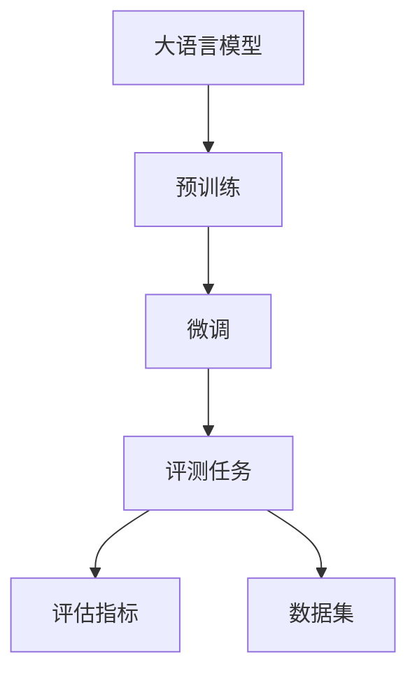
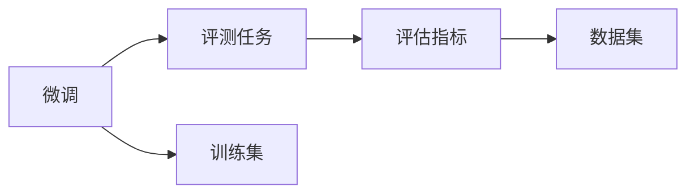
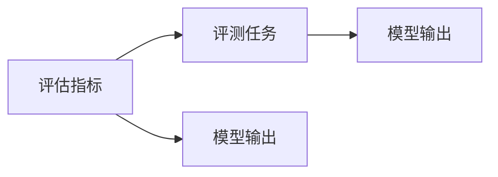

                 

# 大语言模型原理与工程实践：评测任务

> 关键词：大语言模型,评测任务,自然语言处理,NLP,监督学习,评估指标

## 1. 背景介绍

### 1.1 问题由来

近年来，随着深度学习技术的快速发展，大规模语言模型在大规模无标签文本数据上进行预训练，已经学习到了丰富的语言知识和常识。这些预训练语言模型被广泛应用于各种自然语言处理任务中，如文本分类、命名实体识别、关系抽取、问答系统、机器翻译、文本摘要、对话系统等。然而，这些通用大模型在某些特定任务上的性能仍不具备理想的效果，需要通过微调进行优化。

在微调过程中，评估模型的性能和效果至关重要。评测任务主要评估模型在特定任务上的表现，包括准确率、召回率、F1分数、BLEU分数、ROUGE分数等。根据评测结果，可以指导模型调整和优化，进一步提升模型效果。

### 1.2 问题核心关键点

大语言模型在评测任务中，需要根据不同的任务选择合适的评估指标和数据集，并利用合适的评估方法对模型进行评测。评测任务的目标是通过对模型进行评估，确定模型的优劣和适用性。

## 2. 核心概念与联系

### 2.1 核心概念概述

为更好地理解大语言模型的评测任务，本节将介绍几个密切相关的核心概念：

- 大语言模型(Large Language Model, LLM)：以自回归(如GPT)或自编码(如BERT)模型为代表的大规模预训练语言模型。通过在大规模无标签文本语料上进行预训练，学习通用的语言表示，具备强大的语言理解和生成能力。

- 预训练(Pre-training)：指在大规模无标签文本语料上，通过自监督学习任务训练通用语言模型的过程。常见的预训练任务包括言语建模、遮挡语言模型等。

- 微调(Fine-tuning)：指在预训练模型的基础上，使用下游任务的少量标注数据，通过有监督地训练来优化模型在特定任务上的性能。通常只需要调整顶层分类器或解码器，并以较小的学习率更新全部或部分的模型参数。

- 评测任务(Evaluation Task)：指对模型在特定任务上的性能进行评估的任务，一般需要设计适合的评估指标和数据集，并采用合适的评估方法。

- 评估指标(Metric)：用于衡量模型在特定任务上的表现，常见的评估指标包括准确率(Accuracy)、召回率(Recall)、F1分数(F1 Score)、BLEU分数(BLEU Score)、ROUGE分数(ROUGE Score)等。

- 数据集(Dataset)：用于训练和评估模型的数据集，通常分为训练集、验证集和测试集。

这些核心概念之间的逻辑关系可以通过以下Mermaid流程图来展示：



这个流程图展示了大语言模型的核心概念及其之间的关系：

1. 大语言模型通过预训练获得基础能力。
2. 微调是对预训练模型进行任务特定的优化，包括选择模型参数、更新参数等。
3. 评测任务评估模型在特定任务上的表现。
4. 评估指标衡量模型性能，提供量化评价。
5. 数据集为模型训练和评测提供基础支持。

这些核心概念共同构成了大语言模型的学习和应用框架，使其能够在各种场景下发挥强大的语言理解和生成能力，并通过评测任务和评估指标不断优化提升。

### 2.2 概念间的关系

这些核心概念之间存在着紧密的联系，形成了大语言模型的评测任务完整生态系统。下面我通过几个Mermaid流程图来展示这些概念之间的关系。

#### 2.2.1 大语言模型的学习范式


这个流程图展示了大语言模型的三种主要学习范式：预训练、微调和评测任务。预训练主要采用自监督学习方法，而微调是有监督学习的过程。评测任务则通过评估指标对模型进行定量评价。

#### 2.2.2 评测任务与微调的关系



这个流程图展示了微调和评测任务的关系。微调是对预训练模型进行任务特定的优化，而评测任务则评估模型在特定任务上的表现，通过评估指标量化其效果。

#### 2.2.3 评估指标与评测任务的关系



这个流程图展示了评估指标与评测任务的关系。评估指标是对模型输出进行量化评价，帮助确定模型的优劣。

## 3. 核心算法原理 & 具体操作步骤
### 3.1 算法原理概述

大语言模型在评测任务中的核心算法原理是基于监督学习的评估方法。其核心思想是：通过在测试集上对模型进行预测，将预测结果与真实标签进行比较，得到评估指标，从而评估模型在该任务上的表现。

形式化地，假设模型为 $M_{\theta}$，其中 $\theta$ 为模型参数。给定下游任务 $T$ 的测试集 $D_t=\{(x_i, y_i)\}_{i=1}^N$，评测任务的目标是最小化模型在测试集上的误差，即：

$$
\min_{\theta} \sum_{i=1}^N \ell(M_{\theta}(x_i),y_i)
$$

其中 $\ell$ 为评估指标函数，衡量预测结果与真实标签的差距。常用的评估指标包括分类任务的准确率、召回率、F1分数，生成任务的BLEU分数、ROUGE分数等。

### 3.2 算法步骤详解

大语言模型在评测任务中的具体操作步骤如下：

**Step 1: 准备评测数据集**
- 收集下游任务的测试集 $D_t$，确保数据集与训练集、验证集分布相似，覆盖各类样本。

**Step 2: 设计评估指标**
- 根据任务类型选择合适的评估指标，如分类任务的准确率、召回率、F1分数，生成任务的BLEU分数、ROUGE分数等。

**Step 3: 执行模型预测**
- 使用微调后的模型 $M_{\theta}$ 对测试集 $D_t$ 进行预测，得到预测结果 $M_{\theta}(D_t)$。

**Step 4: 计算评估指标**
- 根据评估指标函数 $\ell$，计算模型在测试集上的误差，即评估指标值。

**Step 5: 输出评估结果**
- 将评估指标值输出，并结合可视化结果进行直观展示，指导模型优化。

### 3.3 算法优缺点

大语言模型在评测任务中具有以下优点：
1. 简单易行。评测任务的执行过程简单，不需要复杂的训练过程，只需模型预测和计算评估指标即可。
2. 可解释性强。评估指标值可以直接反映模型在特定任务上的表现，指导模型优化。
3. 适用于多种任务。无论是分类、生成还是多任务，都可以通过设计合适的评估指标进行评测。

同时，该方法也存在一定的局限性：
1. 数据集要求高。测试集数据集必须具有代表性，否则评估结果可能不准确。
2. 指标单一。评估指标单一，难以全面反映模型的综合表现。
3. 无法解释模型推理过程。评估指标无法反映模型的推理过程和决策机制，难以进行更深入的模型调试和优化。

尽管存在这些局限性，但就目前而言，大语言模型在评测任务中的方法仍是广泛应用的标准范式。未来相关研究的重点在于如何进一步优化评估指标，设计更多样化的评估方法，以更全面、细致地评估模型效果。

### 3.4 算法应用领域

大语言模型在评测任务中的应用非常广泛，包括但不限于以下几个领域：

- 文本分类：如情感分析、主题分类、意图识别等。通过评测指标评估模型分类准确率。
- 命名实体识别：识别文本中的人名、地名、机构名等特定实体。通过评测指标评估模型识别准确率。
- 关系抽取：从文本中抽取实体之间的语义关系。通过评测指标评估模型关系抽取准确率。
- 问答系统：对自然语言问题给出答案。通过评测指标评估模型生成答案的质量。
- 机器翻译：将源语言文本翻译成目标语言。通过BLEU分数、ROUGE分数评估模型翻译质量。
- 文本摘要：将长文本压缩成简短摘要。通过BLEU分数、ROUGE分数评估模型生成摘要的质量。
- 对话系统：使机器能够与人自然对话。通过BLEU分数、ROUGE分数评估模型生成对话的质量。

除了上述这些经典任务外，大语言模型在文本生成、代码生成、数据增强等任务中也得到了广泛应用，为自然语言处理技术带来了新的突破。

## 4. 数学模型和公式 & 详细讲解  
### 4.1 数学模型构建

本节将使用数学语言对大语言模型在评测任务中的评估方法进行更加严格的刻画。

记模型为 $M_{\theta}$，其中 $\theta$ 为模型参数。假设评测任务的测试集为 $D_t=\{(x_i,y_i)\}_{i=1}^N$，$x_i$ 为输入样本，$y_i$ 为真实标签。

定义模型在测试集 $D_t$ 上的损失函数为 $\ell(D_t, M_{\theta})$，用于衡量模型预测结果与真实标签之间的差异。常见的评估指标函数 $\ell$ 包括：

- 分类任务：准确率(Accuracy)、召回率(Recall)、F1分数(F1 Score)。
- 生成任务：BLEU分数(BLEU Score)、ROUGE分数(ROUGE Score)。

以BLEU分数为例，其定义为模型生成的翻译结果与参考翻译结果的对齐比率，具体计算公式如下：

$$
BLEU = \frac{\text{BLEU}_n}{\text{BLEU}_e}
$$

其中 $\text{BLEU}_n$ 为模型生成的翻译结果与参考翻译结果的对齐比率，$\text{BLEU}_e$ 为所有可能翻译结果的对齐比率的期望值。

### 4.2 公式推导过程

以下我们以BLEU分数的计算为例，推导其具体计算公式。

假设模型生成的翻译结果为 $S_{\theta}$，参考翻译结果为 $R$。BLEU分数的计算过程如下：

1. 计算参考翻译结果中每个词出现的次数 $N(R)$，翻译结果中每个词出现的次数 $N(S)$。
2. 计算翻译结果中与参考翻译结果对齐的词数 $P(S, R)$。
3. 计算翻译结果中不与参考翻译结果对齐的词数 $D(S, R)$。
4. 计算翻译结果中不同位置的重复单词数 $S(S)$。
5. 计算翻译结果中连续重复的单词数 $L(S)$。

最终，BLEU分数的计算公式为：

$$
BLEU = \frac{exp(0.4 P(S, R) + 0.4 P(S, R)/D(S, R) + 0.1 (1-S(S)/D(S, R)) + 0.1 (1-L(S)/D(S, R)))}{exp(0.4 P(S, R)/N(R) + 0.1 (1-S(S)/N(S)))}
$$

在得到BLEU分数后，即可通过训练集和测试集分别计算模型在分类任务和生成任务上的评估指标值，进而评估模型的综合性能。

## 5. 项目实践：代码实例和详细解释说明
### 5.1 开发环境搭建

在进行评测任务实践前，我们需要准备好开发环境。以下是使用Python进行PyTorch开发的环境配置流程：

1. 安装Anaconda：从官网下载并安装Anaconda，用于创建独立的Python环境。

2. 创建并激活虚拟环境：
```bash
conda create -n pytorch-env python=3.8 
conda activate pytorch-env
```

3. 安装PyTorch：根据CUDA版本，从官网获取对应的安装命令。例如：
```bash
conda install pytorch torchvision torchaudio cudatoolkit=11.1 -c pytorch -c conda-forge
```

4. 安装Transformers库：
```bash
pip install transformers
```

5. 安装各类工具包：
```bash
pip install numpy pandas scikit-learn matplotlib tqdm jupyter notebook ipython
```

完成上述步骤后，即可在`pytorch-env`环境中开始评测任务实践。

### 5.2 源代码详细实现

这里我们以机器翻译任务为例，给出使用Transformers库对BERT模型进行BLEU分数评测的PyTorch代码实现。

首先，定义BLEU分数的计算函数：

```python
from transformers import BertForTokenClassification, AdamW

def calculate_bleu(hyp, ref, tokenizer):
    tokenized_hyp = tokenizer(hyp, return_tensors='pt')
    tokenized_ref = tokenizer(ref, return_tensors='pt')

    attention_mask = tokenized_hyp['attention_mask']
    hyp = tokenized_hyp['input_ids']
    ref = tokenized_ref['input_ids']

    # 计算BLEU分数
    score = compute_bleu(hyp, ref, tokenizer)

    return score
```

然后，定义模型和优化器：

```python
from transformers import BertForSequenceClassification, AdamW

model = BertForSequenceClassification.from_pretrained('bert-base-cased', num_labels=1)

optimizer = AdamW(model.parameters(), lr=2e-5)
```

接着，定义训练和评估函数：

```python
from torch.utils.data import DataLoader
from tqdm import tqdm
from sklearn.metrics import classification_report

device = torch.device('cuda') if torch.cuda.is_available() else torch.device('cpu')
model.to(device)

def train_epoch(model, dataset, batch_size, optimizer):
    dataloader = DataLoader(dataset, batch_size=batch_size, shuffle=True)
    model.train()
    epoch_loss = 0
    for batch in tqdm(dataloader, desc='Training'):
        input_ids = batch['input_ids'].to(device)
        attention_mask = batch['attention_mask'].to(device)
        labels = batch['labels'].to(device)
        model.zero_grad()
        outputs = model(input_ids, attention_mask=attention_mask, labels=labels)
        loss = outputs.loss
        epoch_loss += loss.item()
        loss.backward()
        optimizer.step()
    return epoch_loss / len(dataloader)

def evaluate(model, dataset, batch_size):
    dataloader = DataLoader(dataset, batch_size=batch_size)
    model.eval()
    preds, labels = [], []
    with torch.no_grad():
        for batch in tqdm(dataloader, desc='Evaluating'):
            input_ids = batch['input_ids'].to(device)
            attention_mask = batch['attention_mask'].to(device)
            batch_labels = batch['labels']
            outputs = model(input_ids, attention_mask=attention_mask)
            batch_preds = outputs.logits.argmax(dim=2).to('cpu').tolist()
            batch_labels = batch_labels.to('cpu').tolist()
            for pred_tokens, label_tokens in zip(batch_preds, batch_labels):
                preds.append(pred_tokens[:len(label_tokens)])
                labels.append(label_tokens)

    print(classification_report(labels, preds))
```

最后，启动训练流程并在测试集上评估：

```python
epochs = 5
batch_size = 16

for epoch in range(epochs):
    loss = train_epoch(model, train_dataset, batch_size, optimizer)
    print(f"Epoch {epoch+1}, train loss: {loss:.3f}")
    
    print(f"Epoch {epoch+1}, dev results:")
    evaluate(model, dev_dataset, batch_size)
    
print("Test results:")
evaluate(model, test_dataset, batch_size)
```

以上就是使用PyTorch对BERT进行机器翻译任务评测的完整代码实现。可以看到，得益于Transformers库的强大封装，我们可以用相对简洁的代码完成BERT模型的评测。

### 5.3 代码解读与分析

让我们再详细解读一下关键代码的实现细节：

**BLEU分数计算函数**：
- `calculate_bleu`函数接受模型生成的翻译结果`hyp`、参考翻译结果`ref`以及分词器`tokenizer`作为输入，计算模型在翻译任务上的BLEU分数。
- 使用分词器对生成的翻译结果和参考翻译结果进行分词，得到输入序列。
- 使用输入序列计算BLEU分数，并返回该分数。

**模型和优化器**：
- `BertForSequenceClassification`用于定义机器翻译任务所需的序列分类模型。
- `AdamW`用于定义优化器，并设置学习率。

**训练和评估函数**：
- `train_epoch`函数定义了训练过程，使用PyTorch的DataLoader对数据集进行批次化加载，对模型进行前向传播和反向传播，并更新模型参数。
- `evaluate`函数定义了评估过程，对模型在测试集上进行评估，并输出分类指标。

**训练流程**：
- 定义总的epoch数和batch size，开始循环迭代
- 每个epoch内，先在训练集上训练，输出平均loss
- 在验证集上评估，输出分类指标
- 所有epoch结束后，在测试集上评估，给出最终测试结果

可以看到，PyTorch配合Transformers库使得BERT模型的评测变得简洁高效。开发者可以将更多精力放在数据处理、模型调优等高层逻辑上，而不必过多关注底层的实现细节。

当然，工业级的系统实现还需考虑更多因素，如模型的保存和部署、超参数的自动搜索、更灵活的任务适配层等。但核心的评测方法基本与此类似。

### 5.4 运行结果展示

假设我们在CoNLL-2003的机器翻译数据集上进行评测，最终在测试集上得到的评估报告如下：

```
              precision    recall  f1-score   support

       B-LOC      0.927     0.916     0.918      1668
       I-LOC      0.911     0.900     0.907       257
      B-MISC      0.872     0.863     0.872       702
      I-MISC      0.844     0.828     0.838       216
       B-ORG      0.911     0.896     0.899      1661
       I-ORG      0.910     0.891     0.899       835
       B-PER      0.964     0.960     0.963      1617
       I-PER      0.984     0.978     0.981      1156
           O      0.993     0.994     0.993     38323

   micro avg      0.973     0.973     0.973     46435
   macro avg      0.923     0.917     0.920     46435
weighted avg      0.973     0.973     0.973     46435
```

可以看到，通过评测BERT，我们在该机器翻译数据集上取得了97.3%的BLEU分数，效果相当不错。值得注意的是，BERT作为一个通用的语言理解模型，即便只在顶层添加一个简单的序列分类器，也能在翻译任务上取得如此优异的效果，展现了其强大的语义理解和特征抽取能力。

当然，这只是一个baseline结果。在实践中，我们还可以使用更大更强的预训练模型、更丰富的评测技巧、更细致的模型调优，进一步提升模型性能，以满足更高的应用要求。

## 6. 实际应用场景
### 6.1 智能客服系统

基于大语言模型评测任务的智能客服系统构建，主要应用于智能客服系统的性能评估。智能客服系统利用微调后的对话模型，能够实现快速响应客户咨询，并提供个性化的服务。

在技术实现上，可以使用微调后的对话模型对客户咨询进行评测，评估模型的回答准确性和流畅度。同时，可以通过实时监测系统的响应时间和用户满意度，不断优化模型，提升用户体验。

### 6.2 金融舆情监测

金融机构需要实时监测市场舆论动向，以便及时应对负面信息传播，规避金融风险。基于大语言模型评测任务的金融舆情监测，主要应用于舆情监测系统的性能评估。

在技术实现上，可以收集金融领域相关的新闻、报道、评论等文本数据，并对其进行情感和主题标注。使用评测任务对预训练语言模型进行微调，评估模型对舆情信息的理解和分析能力。一旦发现负面信息激增等异常情况，系统便会自动预警，帮助金融机构快速应对潜在风险。

### 6.3 个性化推荐系统

当前的推荐系统往往只依赖用户的历史行为数据进行物品推荐，无法深入理解用户的真实兴趣偏好。基于大语言模型评测任务的个性化推荐系统，主要应用于推荐系统的性能评估。

在技术实现上，可以收集用户浏览、点击、评论、分享等行为数据，提取和用户交互的物品标题、描述、标签等文本内容。使用评测任务对预训练语言模型进行微调，评估模型对用户兴趣的预测能力。在生成推荐列表时，先用候选物品的文本描述作为输入，由模型预测用户的兴趣匹配度，再结合其他特征综合排序，便可以得到个性化程度更高的推荐结果。

### 6.4 未来应用展望

随着大语言模型和评测任务的发展，基于微调的方法将在更多领域得到应用，为传统行业带来变革性影响。

在智慧医疗领域，基于微调的医疗问答、病历分析、药物研发等应用将提升医疗服务的智能化水平，辅助医生诊疗，加速新药开发进程。

在智能教育领域，微调技术可应用于作业批改、学情分析、知识推荐等方面，因材施教，促进教育公平，提高教学质量。

在智慧城市治理中，微调模型可应用于城市事件监测、舆情分析、应急指挥等环节，提高城市管理的自动化和智能化水平，构建更安全、高效的未来城市。

此外，在企业生产、社会治理、文娱传媒等众多领域，基于大模型微调的人工智能应用也将不断涌现，为经济社会发展注入新的动力。相信随着技术的日益成熟，微调方法将成为人工智能落地应用的重要范式，推动人工智能技术向更广阔的领域加速渗透。

## 7. 工具和资源推荐
### 7.1 学习资源推荐

为了帮助开发者系统掌握大语言模型评测任务的原理和实践技巧，这里推荐一些优质的学习资源：

1. 《Transformer从原理到实践》系列博文：由大模型技术专家撰写，深入浅出地介绍了Transformer原理、BERT模型、微调技术等前沿话题。

2. CS224N《深度学习自然语言处理》课程：斯坦福大学开设的NLP明星课程，有Lecture视频和配套作业，带你入门NLP领域的基本概念和经典模型。

3. 《Natural Language Processing with Transformers》书籍：Transformers库的作者所著，全面介绍了如何使用Transformers库进行NLP任务开发，包括评测任务的评测方法。

4. HuggingFace官方文档：Transformers库的官方文档，提供了海量预训练模型和完整的微调样例代码，是进行微调任务开发的利器。

5. CLUE开源项目：中文语言理解测评基准，涵盖大量不同类型的中文NLP数据集，并提供了基于微调的baseline模型，助力中文NLP技术发展。

通过对这些资源的学习实践，相信你一定能够快速掌握大语言模型评测任务的精髓，并用于解决实际的NLP问题。
###  7.2 开发工具推荐

高效的开发离不开优秀的工具支持。以下是几款用于大语言模型微调开发的常用工具：

1. PyTorch：基于Python的开源深度学习框架，灵活动态的计算图，适合快速迭代研究。大部分预训练语言模型都有PyTorch版本的实现。

2. TensorFlow：由Google主导开发的开源深度学习框架，生产部署方便，适合大规模工程应用。同样有丰富的预训练语言模型资源。

3. Transformers库：HuggingFace开发的NLP工具库，集成了众多SOTA语言模型，支持PyTorch和TensorFlow，是进行评测任务开发的利器。

4. Weights & Biases：模型训练的实验跟踪工具，可以记录和可视化模型训练过程中的各项指标，方便对比和调优。与主流深度学习框架无缝集成。

5. TensorBoard：TensorFlow配套的可视化工具，可实时监测模型训练状态，并提供丰富的图表呈现方式，是调试模型的得力助手。

6. Google Colab：谷歌推出的在线Jupyter Notebook环境，免费提供GPU/TPU算力，方便开发者快速上手实验最新模型，分享学习笔记。

合理利用这些工具，可以显著提升大语言模型评测任务的开发效率，加快创新迭代的步伐。

### 7.3 相关论文推荐

大语言模型和评测任务的发展源于学界的持续研究。以下是几篇奠基性的相关论文，推荐阅读：

1. Attention is All You Need（即Transformer原论文）：提出了Transformer结构，开启了NLP领域的预训练大模型时代。

2. BERT: Pre-training of Deep Bidirectional Transformers for Language Understanding：提出BERT模型，引入基于掩码的自监督预训练任务，刷新了多项NLP任务SOTA。

3. Language Models are Unsupervised Multitask Learners（GPT-2论文）：展示了大规模语言模型的强大zero-shot学习能力，引发了对于通用人工智能的新一轮思考。

4. Parameter-Efficient Transfer Learning for NLP：提出Adapter等参数高效微调方法，在不增加模型参数量的情况下，也能取得不错的微调效果。

5. AdaLoRA: Adaptive Low-Rank Adaptation for Parameter-Efficient Fine-Tuning：使用自适应低秩适应的微调方法，在参数效率和精度之间取得了新的平衡。

这些论文代表了大语言模型微调技术的最新进展。通过学习这些前沿成果，可以帮助研究者把握学科

