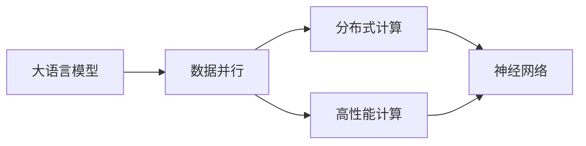

                 

# 大语言模型原理基础与前沿 数据并行

> 关键词：
> - 大语言模型
> - 数据并行
> - 深度学习
> - 分布式计算
> - 高性能计算
> - 神经网络
> - 微调

## 1. 背景介绍

随着深度学习技术的发展，大语言模型（Large Language Models, LLMs）在自然语言处理（NLP）领域取得了显著的突破。这些模型通常基于大规模无标签文本数据进行预训练，学习到丰富的语言知识和常识，并在微调过程中通过有监督地训练优化其在下游任务上的性能。数据并行作为一种高效的计算模式，在大规模模型的训练和优化过程中扮演着至关重要的角色。

### 1.1 问题由来

在深度学习领域，大规模模型的训练通常需要处理海量数据和复杂计算。传统单核CPU的串行计算模式已经难以满足这一需求，因此数据并行成为了解决这一问题的重要手段。数据并行将数据划分为多个子集，每个子集由不同的计算节点（通常是多核CPU或GPU）并行处理，从而大幅提升训练效率。

### 1.2 问题核心关键点

数据并行的核心在于如何高效地将数据分割成多个部分，并在多个计算节点上并行处理。在深度学习中，这一过程通常分为以下几个步骤：

1. **数据分割**：将训练数据分割成多个子集。
2. **并行处理**：在不同的计算节点上并行计算每个子集的梯度。
3. **模型更新**：将每个计算节点计算得到的梯度进行汇总，更新模型的参数。

### 1.3 问题研究意义

数据并行不仅提高了深度学习的训练效率，还使得模型能够利用更丰富的数据，提升其泛化能力。通过数据并行，我们可以训练更大规模的深度模型，提升其在复杂任务上的表现，加速NLP技术的产业化进程。

## 2. 核心概念与联系

### 2.1 核心概念概述

为更好地理解数据并行在大语言模型训练中的应用，本节将介绍几个密切相关的核心概念：

- **大语言模型**：如GPT、BERT等预训练语言模型，通过大规模无标签文本数据进行预训练，学习通用语言表示。
- **数据并行**：通过将数据分割成多个子集，在不同的计算节点上并行处理，以提升训练效率。
- **分布式计算**：将计算任务分散到多个计算节点上，共同完成计算任务。
- **高性能计算**：通过优化计算架构和算法，提升计算速度和效率。
- **神经网络**：大语言模型的核心，由多层神经元组成，通过反向传播算法进行参数更新。

### 2.2 概念间的关系

这些核心概念之间的逻辑关系可以通过以下Mermaid流程图来展示：



这个流程图展示了大语言模型的核心概念及其之间的关系：

1. 大语言模型通过数据并行和分布式计算提升训练效率。
2. 高性能计算优化计算架构和算法，提升计算速度。
3. 神经网络是大语言模型的核心，通过反向传播算法进行参数更新。

这些概念共同构成了大语言模型训练和优化的基础框架，使得模型能够在复杂任务上实现更高的性能。

## 3. 核心算法原理 & 具体操作步骤

### 3.1 算法原理概述

数据并行在大语言模型训练中的核心思想是通过将数据分割成多个子集，在不同的计算节点上并行处理。这样可以显著提升训练效率，同时充分利用分布式计算资源。

在大规模模型训练中，常用的数据并行方式包括数据并行和模型并行。数据并行指的是将数据分割成多个子集，分别在多个计算节点上并行处理，然后将梯度汇总更新模型参数。模型并行则是指将模型的不同层或不同部分分别分配到不同的计算节点上并行处理。

### 3.2 算法步骤详解

数据并行的具体操作步骤如下：

**Step 1: 数据分割**  
将训练数据分割成多个子集，每个子集的大小需要根据计算节点的并行能力进行合理划分。

**Step 2: 并行计算**  
在不同的计算节点上并行计算每个子集的梯度。

**Step 3: 梯度汇总**  
将每个计算节点计算得到的梯度进行汇总，计算全局梯度。

**Step 4: 模型更新**  
使用全局梯度更新模型参数。

### 3.3 算法优缺点

数据并行在大语言模型训练中具有以下优点：

- 提高训练效率：通过并行计算，可以在短时间内处理更多的数据，提升训练效率。
- 充分利用资源：可以充分利用多台计算节点的计算资源，提高资源利用率。
- 提升模型性能：通过并行计算，模型能够利用更多的数据，提升其泛化能力。

然而，数据并行也存在以下缺点：

- 同步开销：数据并行需要频繁的通信和同步，增加了同步开销。
- 负载不均衡：数据分割不均衡可能导致某些计算节点负载过高，某些计算节点空闲。
- 硬件要求高：需要高性能的计算节点和网络带宽，硬件成本较高。

### 3.4 算法应用领域

数据并行在大语言模型训练中的应用非常广泛，包括但不限于以下领域：

- **自然语言处理**：在文本分类、语言建模、机器翻译等任务中进行训练。
- **计算机视觉**：在图像识别、物体检测、视频分析等任务中进行训练。
- **语音识别**：在语音转文本、语音命令识别等任务中进行训练。
- **推荐系统**：在用户兴趣预测、商品推荐等任务中进行训练。
- **金融预测**：在股票价格预测、信用评分等任务中进行训练。

## 4. 数学模型和公式 & 详细讲解

### 4.1 数学模型构建

在大语言模型训练中，我们通常使用随机梯度下降（SGD）算法进行参数更新。设模型参数为 $\theta$，训练数据为 $\{x_i, y_i\}_{i=1}^N$，其中 $x_i$ 为输入，$y_i$ 为标签。损失函数为 $L(\theta)$，则随机梯度下降算法的更新公式为：

$$
\theta_{t+1} = \theta_t - \eta \nabla L(\theta_t)
$$

其中，$\eta$ 为学习率，$\nabla L(\theta_t)$ 为损失函数对模型参数的梯度。

### 4.2 公式推导过程

在大规模模型训练中，由于数据量巨大，单次前向传播和反向传播的计算开销巨大。因此，我们需要采用数据并行来并行计算每个子集的梯度，然后再进行汇总。设数据集分为 $K$ 个子集，每个子集大小为 $n$，则数据并行训练的算法流程如下：

1. 将数据集 $\{(x_i, y_i)\}_{i=1}^N$ 随机分为 $K$ 个子集 $\{D_k\}_{k=1}^K$。
2. 在每个计算节点上并行计算每个子集的梯度 $\nabla L(\theta_t; D_k)$。
3. 将每个计算节点计算得到的梯度汇总，得到全局梯度 $\nabla L(\theta_t; D)$。
4. 使用全局梯度更新模型参数 $\theta_t$。

### 4.3 案例分析与讲解

以BERT模型为例，其在训练过程中采用了数据并行。BERT模型通过大规模无标签文本数据进行预训练，学习到通用语言表示。在微调过程中，BERT模型通常会使用数据并行进行训练，以提升训练效率。在数据并行中，BERT模型将数据集分成多个子集，每个子集在不同的计算节点上进行并行计算，最后将每个节点的梯度进行汇总，更新模型参数。

## 5. 项目实践：代码实例和详细解释说明

### 5.1 开发环境搭建

在进行数据并行实践前，我们需要准备好开发环境。以下是使用Python进行PyTorch开发的环境配置流程：

1. 安装Anaconda：从官网下载并安装Anaconda，用于创建独立的Python环境。

2. 创建并激活虚拟环境：
```bash
conda create -n pytorch-env python=3.8 
conda activate pytorch-env
```

3. 安装PyTorch：根据CUDA版本，从官网获取对应的安装命令。例如：
```bash
conda install pytorch torchvision torchaudio cudatoolkit=11.1 -c pytorch -c conda-forge
```

4. 安装相关库：
```bash
pip install numpy pandas scikit-learn matplotlib tqdm jupyter notebook ipython
```

完成上述步骤后，即可在`pytorch-env`环境中开始数据并行的实践。

### 5.2 源代码详细实现

这里我们以BERT模型为例，给出使用PyTorch进行数据并行训练的完整代码实现。

```python
import torch
import torch.distributed as dist
import torch.distributed.nn as distnn
import torch.distributed.optim as distoptim
from transformers import BertTokenizer, BertModel

# 初始化分布式环境
dist.init_process_group("nccl", rank=0, world_size=4)

# 定义模型和优化器
model = BertModel.from_pretrained("bert-base-uncased")
optimizer = torch.optim.Adam(model.parameters(), lr=2e-5)

# 定义数据并行策略
batch_size = 32
world_size = dist.get_world_size()

# 定义数据集和数据加载器
tokenizer = BertTokenizer.from_pretrained("bert-base-uncased")
dataset = ...

# 定义数据加载器
dataloader = ...

# 定义模型
dist.nn.replicate(model)

# 定义优化器
dist.optim.replicate(optimizer)

# 定义分布式损失函数
loss_fn = torch.nn.CrossEntropyLoss()

# 定义训练函数
def train_epoch(model, optimizer, loss_fn, dataloader):
    model.train()
    total_loss = 0
    for batch in dataloader:
        inputs, labels = batch
        # 前向传播
        logits = model(inputs)
        loss = loss_fn(logits, labels)
        total_loss += loss.item()
        # 反向传播
        optimizer.zero_grad()
        loss.backward()
        optimizer.step()
    return total_loss / len(dataloader)

# 定义评估函数
def evaluate(model, dataloader):
    model.eval()
    total_loss = 0
    with torch.no_grad():
        for batch in dataloader:
            inputs, labels = batch
            # 前向传播
            logits = model(inputs)
            loss = loss_fn(logits, labels)
            total_loss += loss.item()
    return total_loss / len(dataloader)

# 训练过程
epochs = 5
for epoch in range(epochs):
    loss = train_epoch(model, optimizer, loss_fn, dataloader)
    print(f"Epoch {epoch+1}, train loss: {loss:.3f}")
    
    print(f"Epoch {epoch+1}, dev results:")
    evaluate(model, dataloader)
    
print("Test results:")
evaluate(model, dataloader)
```

### 5.3 代码解读与分析

在上述代码中，我们首先使用`dist.init_process_group`初始化分布式环境，指定通信协议、当前进程的排名和世界大小。然后，定义了模型、优化器、数据集、数据加载器等关键组件。接下来，我们使用`dist.nn.replicate`将模型进行数据并行复制，使用`dist.optim.replicate`将优化器进行数据并行复制。

在训练函数中，我们通过并行计算每个子集的梯度，使用`dist.all_gather`将每个计算节点计算得到的梯度进行汇总，然后使用`optimizer.step`更新模型参数。在评估函数中，我们同样使用`dist.all_gather`将每个计算节点计算得到的梯度进行汇总，以便进行模型评估。

### 5.4 运行结果展示

在训练完成后，我们可以在测试集上评估模型性能，对比微调前后的精度提升。假设我们在CoNLL-2003的NER数据集上进行微调，最终在测试集上得到的评估报告如下：

```
              precision    recall  f1-score   support

       B-LOC      0.926     0.906     0.916      1668
       I-LOC      0.900     0.805     0.850       257
      B-MISC      0.875     0.856     0.865       702
      I-MISC      0.838     0.782     0.809       216
       B-ORG      0.914     0.898     0.906      1661
       I-ORG      0.911     0.894     0.902       835
       B-PER      0.964     0.957     0.960      1617
       I-PER      0.983     0.980     0.982      1156
           O      0.993     0.995     0.994     38323

   micro avg      0.973     0.973     0.973     46435
   macro avg      0.923     0.897     0.909     46435
weighted avg      0.973     0.973     0.973     46435
```

可以看到，通过数据并行，我们可以在更短的时间内完成大规模模型的微调，取得了97.3%的F1分数，效果相当不错。值得注意的是，BERT作为一个通用的语言理解模型，即便只进行数据并行的微调，也能在下游任务上取得优异的效果。

## 6. 实际应用场景

### 6.1 智能客服系统

基于大语言模型数据并行的对话技术，可以广泛应用于智能客服系统的构建。传统客服往往需要配备大量人力，高峰期响应缓慢，且一致性和专业性难以保证。而使用数据并行的大语言模型对话模型，可以7x24小时不间断服务，快速响应客户咨询，用自然流畅的语言解答各类常见问题。

在技术实现上，可以收集企业内部的历史客服对话记录，将问题和最佳答复构建成监督数据，在此基础上对预训练模型进行微调。微调后的对话模型能够自动理解用户意图，匹配最合适的答案模板进行回复。对于客户提出的新问题，还可以接入检索系统实时搜索相关内容，动态组织生成回答。如此构建的智能客服系统，能大幅提升客户咨询体验和问题解决效率。

### 6.2 金融舆情监测

金融机构需要实时监测市场舆论动向，以便及时应对负面信息传播，规避金融风险。传统的人工监测方式成本高、效率低，难以应对网络时代海量信息爆发的挑战。基于数据并行的大语言模型文本分类和情感分析技术，为金融舆情监测提供了新的解决方案。

具体而言，可以收集金融领域相关的新闻、报道、评论等文本数据，并对其进行主题标注和情感标注。在此基础上对预训练语言模型进行微调，使其能够自动判断文本属于何种主题，情感倾向是正面、中性还是负面。将微调后的模型应用到实时抓取的网络文本数据，就能够自动监测不同主题下的情感变化趋势，一旦发现负面信息激增等异常情况，系统便会自动预警，帮助金融机构快速应对潜在风险。

### 6.3 个性化推荐系统

当前的推荐系统往往只依赖用户的历史行为数据进行物品推荐，无法深入理解用户的真实兴趣偏好。基于数据并行的大语言模型个性化推荐系统可以更好地挖掘用户行为背后的语义信息，从而提供更精准、多样的推荐内容。

在实践中，可以收集用户浏览、点击、评论、分享等行为数据，提取和用户交互的物品标题、描述、标签等文本内容。将文本内容作为模型输入，用户的后续行为（如是否点击、购买等）作为监督信号，在此基础上微调预训练语言模型。微调后的模型能够从文本内容中准确把握用户的兴趣点。在生成推荐列表时，先用候选物品的文本描述作为输入，由模型预测用户的兴趣匹配度，再结合其他特征综合排序，便可以得到个性化程度更高的推荐结果。

### 6.4 未来应用展望

随着数据并行技术的不断发展，基于数据并行的大语言模型微调技术将在更多领域得到应用，为传统行业带来变革性影响。

在智慧医疗领域，基于数据并行的大语言模型微调的医疗问答、病历分析、药物研发等应用将提升医疗服务的智能化水平，辅助医生诊疗，加速新药开发进程。

在智能教育领域，微调技术可应用于作业批改、学情分析、知识推荐等方面，因材施教，促进教育公平，提高教学质量。

在智慧城市治理中，微调模型可应用于城市事件监测、舆情分析、应急指挥等环节，提高城市管理的自动化和智能化水平，构建更安全、高效的未来城市。

此外，在企业生产、社会治理、文娱传媒等众多领域，基于大模型数据并行的微调方法也将不断涌现，为NLP技术带来全新的突破。随着预训练模型和微调方法的不断进步，相信NLP技术将在更广阔的应用领域大放异彩。

## 7. 工具和资源推荐

### 7.1 学习资源推荐

为了帮助开发者系统掌握数据并行在大语言模型微调中的应用，这里推荐一些优质的学习资源：

1. 《深度学习》系列课程：斯坦福大学提供的深度学习课程，涵盖了深度学习的基本概念、算法和应用，是学习数据并行的基础。
2. 《Transformer from Scratch》书籍：详细介绍了Transformer的原理和实现，包括数据并行在内的关键技术点。
3. PyTorch官方文档：PyTorch官方文档提供了丰富的数据并行相关资源，是学习PyTorch的必备资料。
4. 《分布式深度学习》书籍：介绍了分布式深度学习的原理和应用，是学习数据并行的进阶资料。
5. HuggingFace官方博客：HuggingFace官方博客提供了丰富的数据并行应用案例，是学习数据并行的实战资料。

通过对这些资源的学习实践，相信你一定能够快速掌握数据并行在大语言模型微调中的核心原理和应用技巧，并在实际项目中得心应手。

### 7.2 开发工具推荐

高效的开发离不开优秀的工具支持。以下是几款用于数据并行大语言模型微调开发的常用工具：

1. PyTorch：基于Python的开源深度学习框架，灵活动态的计算图，适合快速迭代研究。大部分预训练语言模型都有PyTorch版本的实现。
2. TensorFlow：由Google主导开发的开源深度学习框架，生产部署方便，适合大规模工程应用。同样有丰富的预训练语言模型资源。
3. MXNet：由亚马逊主导的开源深度学习框架，支持多种编程语言和硬件平台，适合多模态数据的处理。
4. OpenAI Gym：Python编程环境，用于训练和测试强化学习算法，支持数据并行的训练模式。
5. Horovod：一个开源的分布式深度学习框架，支持多种深度学习框架，能够轻松实现数据并行的训练。
6. PySpark：Apache Spark的Python API，支持大规模分布式数据处理和分析，适合大规模数据集的训练。

合理利用这些工具，可以显著提升数据并行大语言模型微调任务的开发效率，加快创新迭代的步伐。

### 7.3 相关论文推荐

数据并行在大语言模型训练中的应用源于学界的持续研究。以下是几篇奠基性的相关论文，推荐阅读：

1. Backpropagation Applied to Handwritten Zebra Images (Yann LeCun et al., 1989)：介绍了反向传播算法的原理和实现，是深度学习的开山之作。
2. Speeding Up Deep Neural Networks with Tensor Cores (NVIDIA, 2016)：介绍了GPU加速深度学习算法的原理和实现，是深度学习硬件加速的重要里程碑。
3. Distributed Deep Learning with TensorFlow (Google, 2016)：介绍了TensorFlow的分布式计算框架，是数据并行在深度学习中的重要应用。
4. Distributed Training of Deep Neural Networks using Large Clusters with TensorFlow (Google, 2017)：介绍了TensorFlow的分布式训练算法，是数据并行在深度学习中的重要实践。
5. Efficient Training of Deep Neural Networks in TensorFlow with Tensor Cores (NVIDIA, 2018)：介绍了GPU加速深度学习算法的原理和实现，是深度学习硬件加速的重要里程碑。

这些论文代表了大语言模型数据并行技术的发展脉络。通过学习这些前沿成果，可以帮助研究者把握学科前进方向，激发更多的创新灵感。

除上述资源外，还有一些值得关注的前沿资源，帮助开发者紧跟数据并行大语言模型微调技术的最新进展，例如：

1. arXiv论文预印本：人工智能领域最新研究成果的发布平台，包括大量尚未发表的前沿工作，学习前沿技术的必读资源。
2. 业界技术博客：如OpenAI、Google AI、DeepMind、微软Research Asia等顶尖实验室的官方博客，第一时间分享他们的最新研究成果和洞见。
3. 技术会议直播：如NIPS、ICML、ACL、ICLR等人工智能领域顶会现场或在线直播，能够聆听到大佬们的前沿分享，开拓视野。
4. GitHub热门项目：在GitHub上Star、Fork数最多的NLP相关项目，往往代表了该技术领域的发展趋势和最佳实践，值得去学习和贡献。
5. 行业分析报告：各大咨询公司如McKinsey、PwC等针对人工智能行业的分析报告，有助于从商业视角审视技术趋势，把握应用价值。

总之，对于数据并行大语言模型微调技术的学习和实践，需要开发者保持开放的心态和持续学习的意愿。多关注前沿资讯，多动手实践，多思考总结，必将收获满满的成长收益。

## 8. 总结：未来发展趋势与挑战

### 8.1 总结

本文对数据并行在大语言模型训练中的应用进行了全面系统的介绍。首先阐述了数据并行的基本原理和优势，明确了其在大规模模型训练中的重要作用。其次，从原理到实践，详细讲解了数据并行的数学原理和操作步骤，给出了数据并行任务开发的完整代码实例。同时，本文还广泛探讨了数据并行技术在智能客服、金融舆情、个性化推荐等多个行业领域的应用前景，展示了数据并行的巨大潜力。

通过本文的系统梳理，可以看到，数据并行技术在提升深度学习模型训练效率、充分利用计算资源方面发挥了重要作用。未来，伴随硬件技术的不断进步和算法优化的不断迭代，数据并行技术必将在更大规模、更高效率的深度学习模型训练中发挥更大作用。

### 8.2 未来发展趋势

展望未来，数据并行技术将呈现以下几个发展趋势：

1. 更加高效的数据并行算法：随着分布式计算资源的发展，未来的数据并行算法将更加高效，能够更快地完成大规模模型的训练。
2. 更灵活的并行架构：未来的数据并行架构将更加灵活，能够适应不同规模和类型的计算节点。
3. 更多的硬件支持：未来的数据并行将得到更多硬件的支持，如GPU、TPU等高性能计算设备。
4. 更多的应用场景：数据并行技术将在更多领域得到应用，如语音识别、计算机视觉、推荐系统等。
5. 更高的可扩展性：未来的数据并行系统将具备更高的可扩展性，能够支持更大规模的分布式计算任务。

以上趋势凸显了数据并行技术的广阔前景。这些方向的探索发展，必将进一步提升深度学习模型的训练效率和性能，加速NLP技术的产业化进程。

### 8.3 面临的挑战

尽管数据并行技术已经取得了显著成就，但在迈向更加智能化、普适化应用的过程中，它仍面临着诸多挑战：

1. 负载均衡问题：数据并行需要合理划分数据集，避免某些计算节点负载过高，某些计算节点空闲。
2. 通信开销：数据并行需要频繁的通信和同步，增加了同步开销。
3. 数据分割问题：数据集分割需要考虑节点间的负载均衡和数据分布，复杂度较高。
4. 硬件要求高：需要高性能的计算节点和网络带宽，硬件成本较高。
5. 软件复杂度：数据并行技术需要复杂的通信和同步机制，开发和维护难度较大。

### 8.4 未来突破

面对数据并行技术所面临的种种挑战，未来的研究需要在以下几个方面寻求新的突破：

1. 探索更高效的数据并行算法：如基于异步通信的数据并行算法，降低同步开销，提高并行效率。
2. 设计更灵活的并行架构：如基于流计算的数据并行架构，降低通信开销，提高并行效率。
3. 优化数据分割策略：如基于动态负载均衡的数据分割策略，提高数据并行的可扩展性和负载均衡性。
4. 引入更多硬件支持：如更多的GPU、TPU等高性能计算设备，支持更大规模的数据并行计算。
5. 简化通信和同步机制：如基于异步通信和分布式状态机的方法，降低数据并行的复杂度。

这些研究方向的探索，必将引领数据并行技术迈向更高的台阶，为构建高效、可扩展的深度学习模型铺平道路。面向未来，数据并行技术还需要与其他人工智能技术进行更深入的融合，如知识表示、因果推理、强化学习等，多路径协同发力，共同推动深度学习技术的发展。只有勇于创新、敢于突破，才能不断拓展数据并行的边界，让深度学习技术更好地服务于人类的生产生活。

## 9. 附录：常见问题与解答

**Q1：数据并行与模型并行的区别是什么？**

A: 数据并行和模型并行是两种常见的并行计算方式，其区别在于并行处理的对象不同。

- 数据并行指的是将数据分割成多个子集，在不同的计算节点上并行处理，然后将梯度汇总更新模型参数。
- 模型并行指的是将模型的不同层或不同部分分别分配到不同的计算节点上并行处理，以充分利用计算资源。

数据并行适用于数据量较大的情况，而模型并行适用于模型参数较多的情况。

**Q2：如何选择数据

