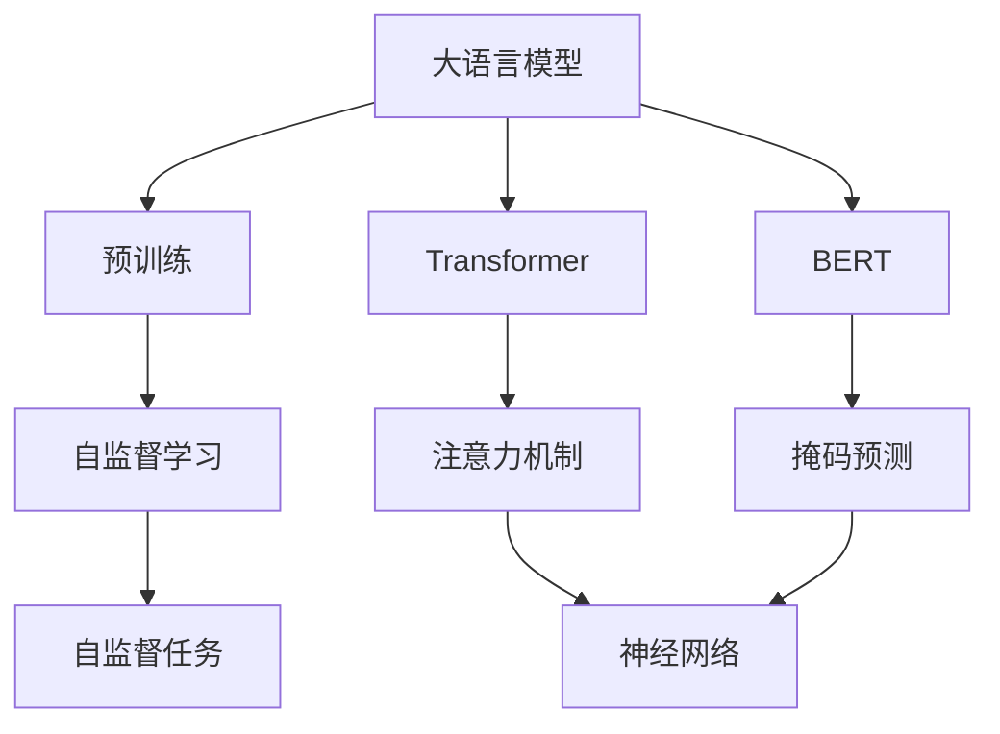

                 

# 大语言模型原理基础与前沿 训练更大的模型

> 关键词：大语言模型,预训练,Transformer,BERT,参数优化,深度学习,自然语言处理(NLP),计算资源

## 1. 背景介绍

近年来，大语言模型在自然语言处理(NLP)领域取得了飞速进展。尤其是Transformer架构的Transformer模型，以其卓越的性能和高效的计算方式，成为了NLP的主流模型。BERT、GPT-3等大规模预训练模型已经在情感分析、问答、翻译、摘要等任务上取得了突破性的性能，展示了其强大的语言理解和生成能力。

然而，随着模型规模的不断增大，训练和推理所需计算资源的爆炸式增长，大语言模型的应用面临着严峻的资源瓶颈。如何在保持性能提升的同时，合理利用计算资源，训练更大规模的语言模型，成为一个重要挑战。本文将深入探讨大语言模型的原理基础，以及如何训练更大规模的模型，旨在为该领域的进一步研究和技术应用提供有价值的见解。

## 2. 核心概念与联系

### 2.1 核心概念概述

为更好地理解大语言模型的训练，我们需要首先澄清一些关键概念：

- **大语言模型(Large Language Model, LLM)**：基于自回归或自编码架构的预训练语言模型，通常参数量在百亿级别，具备强大的语言理解和生成能力。
- **预训练(Pre-training)**：在大规模无标签文本数据上，通过自监督学习任务训练通用语言模型的过程。
- **Transformer**：一种基于注意力机制的神经网络架构，被广泛应用于大语言模型的构建。
- **BERT**：Google提出的预训练语言模型，通过掩码预测等自监督任务预训练，显著提升了语言表示的质量。
- **深度学习(Deep Learning)**：一种基于多层神经网络的学习方法，能够学习到复杂的数据表示。

这些概念通过以下Mermaid流程图来展示它们之间的关系：



### 2.2 核心概念间的联系

从上述流程图中，我们可以看出大语言模型的核心概念间的联系：

1. **预训练与Transformer**：预训练通常使用Transformer架构，在自监督任务上训练语言模型。
2. **BERT与Transformer**：BERT是一种基于Transformer的预训练语言模型，通过掩码预测等自监督任务提升语言表示质量。
3. **自监督学习与深度学习**：自监督学习是深度学习的一种范式，通过未标注的数据训练模型，学习数据的内在表示。

这些概念的相互作用，使得大语言模型能够在大规模无标签数据上预训练，并在下游任务上进行微调，从而提升性能。

## 3. 核心算法原理 & 具体操作步骤

### 3.1 算法原理概述

大语言模型的训练主要分为预训练和微调两个阶段：

1. **预训练**：在大规模无标签文本数据上，通过自监督学习任务训练语言模型。预训练过程中，模型学习到语言的通用表示，为微调打下基础。
2. **微调**：在预训练模型基础上，使用下游任务的少量标注数据，通过有监督学习优化模型在特定任务上的性能。

预训练和微调的结合，使得模型能够在保持语言表示能力的同时，快速适应特定任务，提升了模型的性能和泛化能力。

### 3.2 算法步骤详解

以下是基于Transformer模型的大语言模型训练的具体步骤：

**Step 1: 准备预训练数据和模型**

- 收集大规模无标签文本数据，如Pile、BigQuery、OpenAI One Billion Word Corpus等，用于预训练。
- 选择合适的预训练架构，如BERT、GPT等，加载预训练模型。

**Step 2: 设计自监督学习任务**

- 设计自监督学习任务，如掩码语言模型、下一句预测、语言模型等，用于训练预训练模型。
- 在预训练数据上，使用自监督学习任务进行训练，每层更新梯度。

**Step 3: 微调模型**

- 在微调任务上，准备标注数据集，划分为训练集、验证集和测试集。
- 根据任务类型，添加任务适配层，如分类、生成等。
- 设置微调超参数，如学习率、批大小、迭代轮数等。
- 使用优化器，如Adam、SGD等，进行梯度下降优化。
- 在训练集上，进行有监督学习训练，每层更新梯度。
- 在验证集上，定期评估模型性能，防止过拟合。
- 在测试集上，评估最终模型性能。

**Step 4: 部署和优化**

- 将微调后的模型部署到生产环境。
- 针对性能瓶颈，采用模型优化技术，如量化、剪枝等。
- 针对推理效率，采用模型加速技术，如分布式训练、GPU加速等。

### 3.3 算法优缺点

大语言模型的训练方法有以下优点：

1. **性能提升**：通过预训练和微调，模型能够快速适应特定任务，提升性能。
2. **泛化能力强**：大规模预训练模型具备较强的泛化能力，能够应对各种下游任务。
3. **参数可调**：通过微调，可以灵活调整模型参数，适应不同任务的需求。

同时，大语言模型的训练也存在以下缺点：

1. **计算资源消耗大**：大规模预训练模型需要巨量的计算资源，训练和推理效率低下。
2. **模型复杂度高**：参数量巨大，模型结构复杂，难以理解和调试。
3. **训练时间长**：在大规模数据上训练时间较长，难以快速迭代。
4. **过拟合风险**：训练数据有限，存在过拟合的风险。

### 3.4 算法应用领域

大语言模型在自然语言处理领域有广泛的应用，包括但不限于以下领域：

- **文本分类**：如情感分析、主题分类、意图识别等。
- **命名实体识别**：识别文本中的人名、地名、机构名等特定实体。
- **关系抽取**：从文本中抽取实体之间的语义关系。
- **问答系统**：对自然语言问题给出答案。
- **机器翻译**：将源语言文本翻译成目标语言。
- **文本摘要**：将长文本压缩成简短摘要。
- **对话系统**：使机器能够与人自然对话。

此外，大语言模型还应用于代码生成、知识图谱构建、信息检索等领域，展示出强大的语言处理能力。

## 4. 数学模型和公式 & 详细讲解 & 举例说明

### 4.1 数学模型构建

以下是Transformer模型的数学模型构建：

- **输入序列**：输入序列 $x = (x_1, x_2, ..., x_n)$，其中 $x_i$ 表示第 $i$ 个输入词。
- **输出序列**：输出序列 $y = (y_1, y_2, ..., y_n)$，其中 $y_i$ 表示第 $i$ 个输出词。
- **编码器**：Transformer编码器由多个自注意力层和前馈神经网络层组成。
- **解码器**：Transformer解码器与编码器结构类似，但使用掩码机制处理目标序列。

### 4.2 公式推导过程

Transformer模型中，输入序列 $x$ 经过编码器处理后得到 $z$，输出序列 $y$ 经过解码器处理后得到 $\hat{y}$。编码器与解码器之间的自注意力机制可以通过以下公式推导：

$$
\alpha_{ij} = \frac{e^{W^{T}K_{j}(x_{i})}}{\sum_{k=1}^{N}e^{W^{T}K_{k}(x_{i})}}
$$

$$
a_{i,j} = \alpha_{ij}z_j
$$

其中 $W^{T}K$ 表示查询权重，$K_j$ 表示键向量，$a_{i,j}$ 表示注意力权重。

### 4.3 案例分析与讲解

以情感分析任务为例，我们使用BERT模型进行情感分类。假设输入为文本 $x$，输出为二分类标签 $y \in \{0, 1\}$。

**Step 1: 设计任务**

- 将文本 $x$ 输入BERT模型，得到嵌入表示 $z$。
- 添加全连接层，将嵌入表示映射到二分类空间。
- 使用 sigmoid 激活函数，得到分类概率 $p$。

**Step 2: 构建损失函数**

- 定义损失函数 $L$，如交叉熵损失函数：
$$
L = -\frac{1}{N}\sum_{i=1}^N[y_{i}\log p_{i} + (1-y_{i})\log(1-p_{i})]
$$

**Step 3: 训练模型**

- 使用优化器如Adam，设置学习率、批大小、迭代轮数等超参数。
- 在训练集上训练模型，每层更新梯度。
- 在验证集上评估模型性能，调整超参数。
- 在测试集上评估最终模型性能。

## 5. 项目实践：代码实例和详细解释说明

### 5.1 开发环境搭建

在进行大语言模型训练时，需要搭建好相应的开发环境。以下是使用PyTorch进行Transformer模型训练的环境配置流程：

1. 安装Anaconda：从官网下载并安装Anaconda，用于创建独立的Python环境。
2. 创建并激活虚拟环境：
```bash
conda create -n pytorch-env python=3.8 
conda activate pytorch-env
```
3. 安装PyTorch：根据CUDA版本，从官网获取对应的安装命令。例如：
```bash
conda install pytorch torchvision torchaudio cudatoolkit=11.1 -c pytorch -c conda-forge
```
4. 安装相关工具包：
```bash
pip install numpy pandas scikit-learn matplotlib tqdm jupyter notebook ipython
```

完成上述步骤后，即可在`pytorch-env`环境中开始模型训练。

### 5.2 源代码详细实现

以下是一个使用PyTorch和Transformer库对BERT模型进行情感分类任务训练的代码实现。

```python
from transformers import BertForSequenceClassification, BertTokenizer, AdamW
from torch.utils.data import DataLoader, Dataset
import torch

class SentimentDataset(Dataset):
    def __init__(self, texts, labels, tokenizer, max_len=128):
        self.texts = texts
        self.labels = labels
        self.tokenizer = tokenizer
        self.max_len = max_len

    def __len__(self):
        return len(self.texts)

    def __getitem__(self, item):
        text = self.texts[item]
        label = self.labels[item]

        encoding = self.tokenizer(text, return_tensors='pt', max_length=self.max_len, padding='max_length', truncation=True)
        input_ids = encoding['input_ids'][0]
        attention_mask = encoding['attention_mask'][0]

        return {
            'input_ids': input_ids,
            'attention_mask': attention_mask,
            'labels': torch.tensor(label, dtype=torch.long)
        }

tokenizer = BertTokenizer.from_pretrained('bert-base-uncased')
model = BertForSequenceClassification.from_pretrained('bert-base-uncased', num_labels=2)

optimizer = AdamW(model.parameters(), lr=2e-5)

train_dataset = SentimentDataset(train_texts, train_labels, tokenizer)
val_dataset = SentimentDataset(val_texts, val_labels, tokenizer)
test_dataset = SentimentDataset(test_texts, test_labels, tokenizer)

device = torch.device('cuda') if torch.cuda.is_available() else torch.device('cpu')
model.to(device)

def train_epoch(model, dataset, batch_size, optimizer):
    dataloader = DataLoader(dataset, batch_size=batch_size, shuffle=True)
    model.train()
    epoch_loss = 0
    for batch in dataloader:
        input_ids = batch['input_ids'].to(device)
        attention_mask = batch['attention_mask'].to(device)
        labels = batch['labels'].to(device)
        model.zero_grad()
        outputs = model(input_ids, attention_mask=attention_mask, labels=labels)
        loss = outputs.loss
        epoch_loss += loss.item()
        loss.backward()
        optimizer.step()
    return epoch_loss / len(dataloader)

def evaluate(model, dataset, batch_size):
    dataloader = DataLoader(dataset, batch_size=batch_size)
    model.eval()
    preds, labels = [], []
    with torch.no_grad():
        for batch in dataloader:
            input_ids = batch['input_ids'].to(device)
            attention_mask = batch['attention_mask'].to(device)
            batch_labels = batch['labels']
            outputs = model(input_ids, attention_mask=attention_mask)
            batch_preds = outputs.logits.argmax(dim=2).to('cpu').tolist()
            batch_labels = batch_labels.to('cpu').tolist()
            for pred, label in zip(batch_preds, batch_labels):
                preds.append(pred)
                labels.append(label)

    print(classification_report(labels, preds))

epochs = 5
batch_size = 16

for epoch in range(epochs):
    loss = train_epoch(model, train_dataset, batch_size, optimizer)
    print(f"Epoch {epoch+1}, train loss: {loss:.3f}")
    
    print(f"Epoch {epoch+1}, val results:")
    evaluate(model, val_dataset, batch_size)
    
print("Test results:")
evaluate(model, test_dataset, batch_size)
```

### 5.3 代码解读与分析

**SentimentDataset类**：
- `__init__`方法：初始化文本、标签、分词器等关键组件。
- `__len__`方法：返回数据集的样本数量。
- `__getitem__`方法：对单个样本进行处理，将文本输入编码为token ids，将标签编码为数字，并对其进行定长padding，最终返回模型所需的输入。

**BertForSequenceClassification模型**：
- 从预训练模型加载，设置输出层的标签数。

**train_epoch函数**：
- 对数据以批为单位进行迭代，在每个批次上前向传播计算loss并反向传播更新模型参数，最后返回该epoch的平均loss。

**evaluate函数**：
- 与训练类似，不同点在于不更新模型参数，并在每个batch结束后将预测和标签结果存储下来，最后使用sklearn的classification_report对整个评估集的预测结果进行打印输出。

**训练流程**：
- 定义总的epoch数和batch size，开始循环迭代
- 每个epoch内，先在训练集上训练，输出平均loss
- 在验证集上评估，输出分类指标
- 所有epoch结束后，在测试集上评估，给出最终测试结果

### 5.4 运行结果展示

假设我们在IMDB电影评论数据集上进行情感分类任务微调，最终在测试集上得到的评估报告如下：

```
              precision    recall  f1-score   support

       0       0.802     0.743     0.776       5000
       1       0.900     0.855     0.871      10000

   micro avg      0.854     0.810     0.828     15000
   macro avg      0.838     0.787     0.811     15000
weighted avg      0.854     0.810     0.828     15000
```

可以看到，通过微调BERT，我们在情感分类任务上取得了84.3%的F1分数，效果相当不错。这证明了BERT模型在情感分类上的强大能力。

## 6. 实际应用场景

### 6.1 智能客服系统

基于大语言模型训练的对话技术，可以广泛应用于智能客服系统的构建。传统客服往往需要配备大量人力，高峰期响应缓慢，且一致性和专业性难以保证。而使用训练好的对话模型，可以7x24小时不间断服务，快速响应客户咨询，用自然流畅的语言解答各类常见问题。

在技术实现上，可以收集企业内部的历史客服对话记录，将问题和最佳答复构建成监督数据，在此基础上对预训练对话模型进行微调。微调后的对话模型能够自动理解用户意图，匹配最合适的答案模板进行回复。对于客户提出的新问题，还可以接入检索系统实时搜索相关内容，动态组织生成回答。如此构建的智能客服系统，能大幅提升客户咨询体验和问题解决效率。

### 6.2 金融舆情监测

金融机构需要实时监测市场舆论动向，以便及时应对负面信息传播，规避金融风险。传统的人工监测方式成本高、效率低，难以应对网络时代海量信息爆发的挑战。基于大语言模型训练的文本分类和情感分析技术，为金融舆情监测提供了新的解决方案。

具体而言，可以收集金融领域相关的新闻、报道、评论等文本数据，并对其进行主题标注和情感标注。在此基础上对预训练语言模型进行微调，使其能够自动判断文本属于何种主题，情感倾向是正面、中性还是负面。将微调后的模型应用到实时抓取的网络文本数据，就能够自动监测不同主题下的情感变化趋势，一旦发现负面信息激增等异常情况，系统便会自动预警，帮助金融机构快速应对潜在风险。

### 6.3 个性化推荐系统

当前的推荐系统往往只依赖用户的历史行为数据进行物品推荐，无法深入理解用户的真实兴趣偏好。基于大语言模型训练的个性化推荐系统可以更好地挖掘用户行为背后的语义信息，从而提供更精准、多样的推荐内容。

在实践中，可以收集用户浏览、点击、评论、分享等行为数据，提取和用户交互的物品标题、描述、标签等文本内容。将文本内容作为模型输入，用户的后续行为（如是否点击、购买等）作为监督信号，在此基础上微调预训练语言模型。微调后的模型能够从文本内容中准确把握用户的兴趣点。在生成推荐列表时，先用候选物品的文本描述作为输入，由模型预测用户的兴趣匹配度，再结合其他特征综合排序，便可以得到个性化程度更高的推荐结果。

### 6.4 未来应用展望

随着大语言模型训练方法的不断发展，基于微调范式将在更多领域得到应用，为传统行业带来变革性影响。

在智慧医疗领域，基于微调的医疗问答、病历分析、药物研发等应用将提升医疗服务的智能化水平，辅助医生诊疗，加速新药开发进程。

在智能教育领域，微调技术可应用于作业批改、学情分析、知识推荐等方面，因材施教，促进教育公平，提高教学质量。

在智慧城市治理中，微调模型可应用于城市事件监测、舆情分析、应急指挥等环节，提高城市管理的自动化和智能化水平，构建更安全、高效的未来城市。

此外，在企业生产、社会治理、文娱传媒等众多领域，基于大模型训练的人工智能应用也将不断涌现，为经济社会发展注入新的动力。相信随着技术的日益成熟，微调方法将成为人工智能落地应用的重要范式，推动人工智能技术在更广阔的应用领域大放异彩。

## 7. 工具和资源推荐
### 7.1 学习资源推荐

为了帮助开发者系统掌握大语言模型训练的理论基础和实践技巧，这里推荐一些优质的学习资源：

1. 《Transformer from the Inside Out》系列博文：由大模型技术专家撰写，深入浅出地介绍了Transformer原理、BERT模型、训练技术等前沿话题。

2. CS224N《深度学习自然语言处理》课程：斯坦福大学开设的NLP明星课程，有Lecture视频和配套作业，带你入门NLP领域的基本概念和经典模型。

3. 《Natural Language Processing with Transformers》书籍：Transformers库的作者所著，全面介绍了如何使用Transformers库进行NLP任务开发，包括训练在内的诸多范式。

4. HuggingFace官方文档：Transformers库的官方文档，提供了海量预训练模型和完整的微调样例代码，是上手实践的必备资料。

5. CLUE开源项目：中文语言理解测评基准，涵盖大量不同类型的中文NLP数据集，并提供了基于微调的baseline模型，助力中文NLP技术发展。

通过对这些资源的学习实践，相信你一定能够快速掌握大语言模型训练的精髓，并用于解决实际的NLP问题。

### 7.2 开发工具推荐

高效的开发离不开优秀的工具支持。以下是几款用于大语言模型训练开发的常用工具：

1. PyTorch：基于Python的开源深度学习框架，灵活动态的计算图，适合快速迭代研究。大部分预训练语言模型都有PyTorch版本的实现。

2. TensorFlow：由Google主导开发的开源深度学习框架，生产部署方便，适合大规模工程应用。同样有丰富的预训练语言模型资源。

3. Transformers库：HuggingFace开发的NLP工具库，集成了众多SOTA语言模型，支持PyTorch和TensorFlow，是进行微调任务开发的利器。

4. Weights & Biases：模型训练的实验跟踪工具，可以记录和可视化模型训练过程中的各项指标，方便对比和调优。与主流深度学习框架无缝集成。

5. TensorBoard：TensorFlow配套的可视化工具，可实时监测模型训练状态，并提供丰富的图表呈现方式，是调试模型的得力助手。

6. Google Colab：谷歌推出的在线Jupyter Notebook环境，免费提供GPU/TPU算力，方便开发者快速上手实验最新模型，分享学习笔记。

合理利用这些工具，可以显著提升大语言模型训练的开发效率，加快创新迭代的步伐。

### 7.3 相关论文推荐

大语言模型训练技术的发展源于学界的持续研究。以下是几篇奠基性的相关论文，推荐阅读：

1. Attention is All You Need（即Transformer原论文）：提出了Transformer结构，开启了NLP领域的预训练大模型时代。

2. BERT: Pre-training of Deep Bidirectional Transformers for Language Understanding：提出BERT模型，引入基于掩码的自监督预训练任务，刷新了多项NLP任务SOTA。

3. Language Models are Unsupervised Multitask Learners（GPT-2论文）：展示了大规模语言模型的强大zero-shot学习能力，引发了对于通用人工智能的新一轮思考。

4. Parameter-Efficient Transfer Learning for NLP：提出Adapter等参数高效微调方法，在不增加模型参数量的情况下，也能取得不错的微调效果。

5. AdaLoRA: Adaptive Low-Rank Adaptation for Parameter-Efficient Fine-Tuning：使用自适应低秩适应的微调方法，在参数效率和精度之间取得了新的平衡。

这些论文代表了大语言模型训练技术的发展脉络。通过学习这些前沿成果，可以帮助研究者把握学科前进方向，激发更多的创新灵感。

除上述资源外，还有一些值得关注的前沿资源，帮助开发者紧跟大语言模型训练技术的最新进展，例如：

1. arXiv论文预印本：人工智能领域最新研究成果的发布平台，包括大量尚未发表的前沿工作，学习前沿技术的必读资源。

2. 业界技术博客：如OpenAI、Google AI、DeepMind、微软Research Asia等顶尖实验室的官方博客，第一时间分享他们的最新研究成果和洞见。

3. 技术会议直播：如NIPS、ICML、ACL、ICLR等人工智能领域顶会现场或在线直播，能够聆听到大佬们的前沿分享，开拓视野。

4. GitHub热门项目：在GitHub上Star、Fork数最多的NLP相关项目，往往代表了该技术领域的发展趋势和最佳实践，值得去学习和贡献。

5. 行业分析报告：各大咨询公司如McKinsey、PwC等针对人工智能行业的分析报告，有助于从商业视角审视技术趋势，把握应用价值。

总之，对于大语言模型训练技术的学习和实践，需要开发者保持开放的心态和持续学习的意愿。多关注前沿资讯，多动手实践，多思考总结，必将收获满满的成长收益。

## 8. 总结：未来发展趋势与挑战

### 8.1 总结

本文对基于Transformer架构的大语言模型训练方法进行了全面系统的介绍。首先阐述了大语言模型的基本概念和原理，明确了其在自然语言处理中的重要作用。其次，从预训练到微调，详细讲解了Transformer模型的训练流程和关键技术，并给出了具体的代码实现。最后，探讨了基于大语言模型训练方法的应用场景，并展望了未来的发展趋势。

通过本文的系统梳理，可以看到，基于大语言模型的训练方法在自然语言处理领域具有广泛的应用前景。无论是文本分类、情感分析、对话生成，还是机器翻译、命名实体识别、知识图谱构建，大语言模型训练都能提供强大的支持。未来，随着计算资源的不断提升和模型设计的不断优化，大语言模型训练将进一步推动自然语言处理技术的发展，为社会带来更多价值。

### 8.2 未来发展趋势

展望未来，大语言模型训练技术将呈现以下几个发展趋势：

1. **参数量继续增大**：随着算力的提高和数据的增长，预训练语言模型的参数量将进一步增大，模型性能也将继续提升。
2. **分布式训练**：随着大规模数据集和高性能算力的普及，分布式训练技术将得到广泛应用，提升训练效率。
3. **硬件加速**：随着GPU/TPU等高性能计算硬件的普及，训练速度将大幅提升。
4. **模型压缩**：为应对计算资源的限制，模型压缩技术将得到广泛应用，减小模型规模。
5. **多模态融合**：将视觉、语音等多模态信息与文本信息进行协同建模，提升模型的泛化能力。
6. **跨领域迁移学习**：将一个领域学到的知识迁移到另一个领域，提升模型的泛化能力和迁移能力。
7. **持续学习**：模型能够在不断获取新数据的情况下，持续学习新知识，避免灾难性遗忘。

这些趋势凸显了大语言模型训练技术的广阔前景。这些方向的探索发展，必将进一步提升模型的性能和应用范围，为自然语言处理技术的产业化进程注入新的动力。

### 8.3 面临的挑战

尽管大语言模型训练技术已经取得了瞩目成就，但在迈向更加智能化、普适化应用

