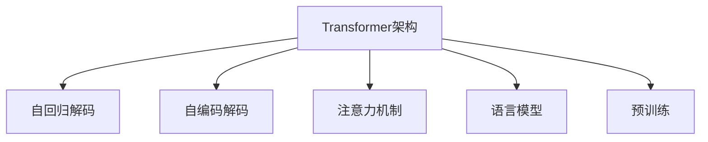
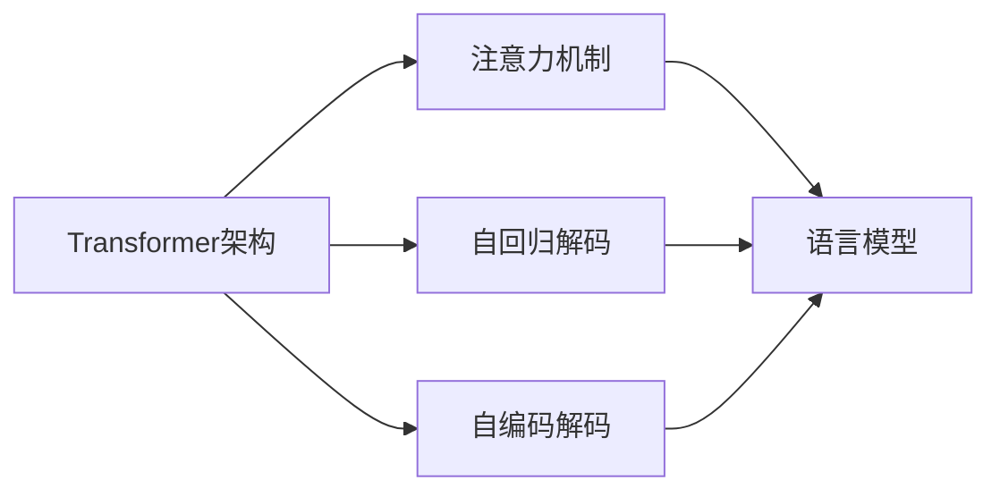

                 

# 大语言模型应用指南：Transformer解码器详解

> 关键词：大语言模型,Transformer,解码器,自回归,自编码,注意力机制,语言模型,预训练

## 1. 背景介绍

### 1.1 问题由来
近年来，深度学习在自然语言处理(NLP)领域取得了显著进展，特别是基于Transformer架构的神经网络语言模型。Transformer模型通过引入注意力机制，显著提升了语言理解和生成能力，被广泛应用于机器翻译、文本摘要、问答系统等任务中。然而，Transformer模型在解码器的设计上仍存在诸多挑战，例如如何高效地生成长序列、如何避免长尾问题、如何提升模型性能等。本文将详细介绍Transformer解码器的原理和实现，并探讨其在实际应用中的关键技术和优化策略。

### 1.2 问题核心关键点
Transformer解码器的核心设计包括自回归和自编码两种方式，这两种方式分别对应着不同的注意力机制和训练策略。自回归方式通过先预测下一个单词，再利用之前已预测的单词进行后续预测，适用于自然语言生成任务。而自编码方式则通过预测整个序列，然后进行反向预测，适用于图像描述生成、摘要生成等任务。此外，Transformer解码器还引入了注意力机制，使其能够灵活地关注序列中的不同位置，提升了语言模型的泛化能力。

### 1.3 问题研究意义
研究Transformer解码器的设计和优化，对于提升自然语言生成和理解任务的性能，以及优化计算效率，具有重要意义。通过理解Transformer解码器的核心原理和实现细节，开发者可以更好地设计和实现高效的自然语言处理系统，满足实际应用中的需求。

## 2. 核心概念与联系

### 2.1 核心概念概述

为更好地理解Transformer解码器的原理和实现，本节将介绍几个密切相关的核心概念：

- **Transformer架构**：一种基于自注意力机制的神经网络结构，可以并行计算大规模序列，适用于自然语言处理、计算机视觉等领域。

- **自回归解码**：一种基于历史序列信息的解码策略，先预测下一个单词，再利用之前已预测的单词进行后续预测，适用于自然语言生成任务。

- **自编码解码**：一种基于整个序列信息的解码策略，先预测整个序列，然后进行反向预测，适用于图像描述生成、摘要生成等任务。

- **注意力机制**：一种通过权重分配来突出序列中重要位置信息的机制，使得模型可以灵活地关注序列中的不同位置。

- **语言模型**：一种描述单词序列概率分布的模型，通过最大似然估计等方法进行训练。

- **预训练**：在大规模无标签数据上进行训练，学习语言模型知识，然后再进行微调以适应特定任务。

这些核心概念之间存在紧密的联系，共同构成了Transformer解码器的设计和优化框架。以下通过Mermaid流程图来展示这些概念之间的逻辑关系：



这个流程图展示了Transformer解码器涉及的核心概念及其关系：

1. **Transformer架构**：提供了并行计算序列的能力。
2. **自回归解码**和**自编码解码**：描述了不同的解码策略。
3. **注意力机制**：用于灵活地关注序列中的不同位置。
4. **语言模型**：用于生成序列的概率分布。
5. **预训练**：在大规模无标签数据上进行训练，学习语言模型知识。

### 2.2 概念间的关系

这些核心概念之间存在着紧密的联系，形成了Transformer解码器的完整生态系统。以下通过Mermaid流程图来展示这些概念之间的关系：



这个流程图展示了Transformer解码器涉及的核心概念及其关系：

1. **Transformer架构**：提供了并行计算序列的能力。
2. **自回归解码**和**自编码解码**：描述了不同的解码策略。
3. **注意力机制**：用于灵活地关注序列中的不同位置。
4. **语言模型**：用于生成序列的概率分布。
5. **预训练**：在大规模无标签数据上进行训练，学习语言模型知识。

## 3. 核心算法原理 & 具体操作步骤
### 3.1 算法原理概述

Transformer解码器的核心算法原理包括以下几个关键点：

- **自回归解码**：通过先预测下一个单词，再利用之前已预测的单词进行后续预测，适用于自然语言生成任务。
- **自编码解码**：通过预测整个序列，然后进行反向预测，适用于图像描述生成、摘要生成等任务。
- **注意力机制**：通过权重分配来突出序列中重要位置信息的机制，使得模型可以灵活地关注序列中的不同位置。
- **语言模型**：用于生成序列的概率分布。

### 3.2 算法步骤详解

基于Transformer解码器的算法步骤可以总结如下：

1. **输入编码**：将输入序列转换成模型能够处理的形式，通常采用词嵌入等方式进行编码。
2. **解码器层**：通过多个解码器层并行计算，生成解码器的输出序列。
3. **注意力机制**：在每个解码器层中，通过注意力机制计算各个位置的信息权重，并将源序列中重要位置的信息进行加权聚合。
4. **输出解码**：通过解码器层生成的序列，利用语言模型进行概率分布计算，预测下一个单词。
5. **结束标记**：在预测到特定结束标记时，解码过程结束。

### 3.3 算法优缺点

Transformer解码器具有以下优点：

- **高效并行计算**：Transformer架构的并行计算能力使得模型可以高效地处理大规模序列。
- **灵活的注意力机制**：通过注意力机制，模型可以灵活地关注序列中的不同位置，提升语言模型的泛化能力。
- **适用于多种任务**：自回归解码和自编码解码方式可以适用于多种自然语言生成和理解任务。

同时，Transformer解码器也存在以下缺点：

- **计算复杂度高**：Transformer模型在计算复杂度上较高，尤其是在自编码解码方式下，需要计算整个序列的概率分布，计算量较大。
- **长序列问题**：在自回归解码方式下，长序列生成可能会导致梯度消失或梯度爆炸问题，需要优化技术如梯度累积和残差连接等进行缓解。
- **长尾问题**：在自编码解码方式下，长尾数据问题可能会导致模型对罕见数据的学习效果不佳，需要进行数据增强等技术进行缓解。

### 3.4 算法应用领域

Transformer解码器在自然语言生成、理解、翻译、摘要、问答等多个领域得到了广泛应用，具体包括：

- **机器翻译**：将源语言文本翻译成目标语言。
- **文本摘要**：将长文本压缩成简短摘要。
- **对话系统**：使机器能够与人自然对话。
- **问答系统**：对自然语言问题给出答案。
- **图像描述生成**：对图像生成文本描述。
- **新闻推荐**：根据用户历史行为，推荐相关新闻。

此外，Transformer解码器还在语音识别、信号处理、时间序列预测等领域有潜在的应用价值。

## 4. 数学模型和公式 & 详细讲解  
### 4.1 数学模型构建

Transformer解码器的数学模型构建包括以下几个关键部分：

- **编码器**：将输入序列转换成模型能够处理的形式。
- **解码器层**：通过多个解码器层并行计算，生成解码器的输出序列。
- **注意力机制**：通过权重分配来突出序列中重要位置信息的机制。
- **语言模型**：用于生成序列的概率分布。

### 4.2 公式推导过程

以下是Transformer解码器的关键公式推导过程：

#### 4.2.1 自回归解码

自回归解码的公式推导如下：

1. **输入编码**：将输入序列 $x_1,...,x_n$ 转换成模型能够处理的形式 $X = [x_1, x_2, ..., x_n]$，通常采用词嵌入等方式进行编码。

2. **解码器层**：通过多个解码器层并行计算，生成解码器的输出序列 $Y = [y_1, y_2, ..., y_n]$。

3. **注意力机制**：在每个解码器层中，通过注意力机制计算各个位置的信息权重 $W_{i,j}^{Att}$，并将源序列中重要位置的信息进行加权聚合。

4. **输出解码**：通过解码器层生成的序列 $Y$，利用语言模型进行概率分布计算，预测下一个单词 $y_{t+1}$。

$$
\begin{aligned}
& y_t = \text{Softmax}(\text{Decoder}_{\theta}(X, Y_{<t})) \\
& W_{i,j}^{Att} = \text{Attention}(Q_i, K_j, V_j) \\
& Y = \text{Decoder}_{\theta}(X, W_{1,j}^{Att}, ..., W_{n,j}^{Att})
\end{aligned}
$$

其中 $X$ 和 $Y$ 分别表示输入和输出序列，$\text{Decoder}_{\theta}$ 表示解码器模型，$Q_i$ 和 $K_j$ 表示注意力机制中的查询和键向量，$V_j$ 表示注意力机制中的值向量，$W_{i,j}^{Att}$ 表示注意力机制中的注意力权重。

#### 4.2.2 自编码解码

自编码解码的公式推导如下：

1. **输入编码**：将输入序列 $x_1,...,x_n$ 转换成模型能够处理的形式 $X = [x_1, x_2, ..., x_n]$，通常采用词嵌入等方式进行编码。

2. **解码器层**：通过多个解码器层并行计算，生成解码器的输出序列 $Y = [y_1, y_2, ..., y_n]$。

3. **注意力机制**：在每个解码器层中，通过注意力机制计算各个位置的信息权重 $W_{i,j}^{Att}$，并将源序列中重要位置的信息进行加权聚合。

4. **输出解码**：通过解码器层生成的序列 $Y$，利用语言模型进行概率分布计算，预测整个序列 $y_1,...,y_n$。

$$
\begin{aligned}
& y = \text{Softmax}(\text{Decoder}_{\theta}(X)) \\
& W_{i,j}^{Att} = \text{Attention}(Q_i, K_j, V_j) \\
& Y = \text{Decoder}_{\theta}(X, W_{1,j}^{Att}, ..., W_{n,j}^{Att})
\end{aligned}
$$

其中 $X$ 和 $Y$ 分别表示输入和输出序列，$\text{Decoder}_{\theta}$ 表示解码器模型，$Q_i$ 和 $K_j$ 表示注意力机制中的查询和键向量，$V_j$ 表示注意力机制中的值向量，$W_{i,j}^{Att}$ 表示注意力机制中的注意力权重。

#### 4.2.3 注意力机制

注意力机制的公式推导如下：

1. **查询向量**：通过解码器层的编码器输出 $H_{t-1}$ 生成查询向量 $Q_t$。

2. **键向量**：通过编码器层的输出 $H_{t-1}$ 生成键向量 $K_t$。

3. **值向量**：通过编码器层的输出 $H_{t-1}$ 生成值向量 $V_t$。

4. **注意力权重**：通过查询向量 $Q_t$ 和键向量 $K_t$ 计算注意力权重 $W_{i,j}^{Att}$，并对值向量 $V_t$ 进行加权聚合。

$$
\begin{aligned}
& Q_t = \text{Linear}(H_{t-1}) \\
& K_t = \text{Linear}(H_{t-1}) \\
& V_t = \text{Linear}(H_{t-1}) \\
& W_{i,j}^{Att} = \text{Softmax}(Q_t K_t^T / \sqrt{d}) \\
& O_t = \sum_{j=1}^{n} W_{i,j}^{Att} V_j
\end{aligned}
$$

其中 $H_{t-1}$ 表示编码器层的输出，$\text{Linear}$ 表示线性变换，$d$ 表示向量的维度。

### 4.3 案例分析与讲解

以机器翻译任务为例，分析Transformer解码器的工作原理：

1. **输入编码**：将源语言文本转换成模型能够处理的形式，如通过词嵌入等方式进行编码。

2. **解码器层**：通过多个解码器层并行计算，生成解码器的输出序列。

3. **注意力机制**：在每个解码器层中，通过注意力机制计算各个位置的信息权重，并将源语言文本中重要位置的信息进行加权聚合。

4. **输出解码**：通过解码器层生成的序列，利用语言模型进行概率分布计算，预测下一个单词，再利用之前已预测的单词进行后续预测。

在机器翻译任务中，Transformer解码器通过先预测下一个单词，再利用之前已预测的单词进行后续预测，这种方式被称为自回归解码。通过这种方式，Transformer解码器可以高效地生成翻译结果，并利用之前已预测的单词进行后续预测，避免了长序列问题。

## 5. 项目实践：代码实例和详细解释说明
### 5.1 开发环境搭建

在进行Transformer解码器的实践前，我们需要准备好开发环境。以下是使用Python进行PyTorch开发的环境配置流程：

1. 安装Anaconda：从官网下载并安装Anaconda，用于创建独立的Python环境。

2. 创建并激活虚拟环境：
```bash
conda create -n pytorch-env python=3.8 
conda activate pytorch-env
```

3. 安装PyTorch：根据CUDA版本，从官网获取对应的安装命令。例如：
```bash
conda install pytorch torchvision torchaudio cudatoolkit=11.1 -c pytorch -c conda-forge
```

4. 安装Transformers库：
```bash
pip install transformers
```

5. 安装各类工具包：
```bash
pip install numpy pandas scikit-learn matplotlib tqdm jupyter notebook ipython
```

完成上述步骤后，即可在`pytorch-env`环境中开始Transformer解码器的实践。

### 5.2 源代码详细实现

下面我们以机器翻译任务为例，给出使用Transformers库对Transformer解码器进行代码实现。

```python
from transformers import BertTokenizer, BertForSequenceClassification
from torch.utils.data import Dataset
import torch
import torch.nn as nn
import torch.optim as optim

class TranslationDataset(Dataset):
    def __init__(self, texts, lengths):
        self.texts = texts
        self.lengths = lengths
        
    def __len__(self):
        return len(self.texts)
    
    def __getitem__(self, item):
        text = self.texts[item]
        length = self.lengths[item]
        
        # 对文本进行编码
        encoding = self.tokenizer(text, return_tensors='pt', max_length=length, padding='max_length', truncation=True)
        input_ids = encoding['input_ids'][0]
        attention_mask = encoding['attention_mask'][0]
        
        # 输出目标序列
        target = encoding['input_ids'][1:]
        
        return {'input_ids': input_ids, 
                'attention_mask': attention_mask,
                'target': target}

# 加载预训练模型和分词器
tokenizer = BertTokenizer.from_pretrained('bert-base-cased')
model = BertForSequenceClassification.from_pretrained('bert-base-cased', num_labels=1)

# 定义优化器和学习率
optimizer = optim.Adam(model.parameters(), lr=2e-5)
scheduler = optim.lr_scheduler.ReduceLROnPlateau(optimizer, patience=1, factor=0.9)

# 定义训练和评估函数
def train_epoch(model, dataset, batch_size, optimizer, scheduler):
    dataloader = DataLoader(dataset, batch_size=batch_size, shuffle=True)
    model.train()
    epoch_loss = 0
    for batch in dataloader:
        input_ids = batch['input_ids'].to(device)
        attention_mask = batch['attention_mask'].to(device)
        target = batch['target'].to(device)
        model.zero_grad()
        outputs = model(input_ids, attention_mask=attention_mask, labels=target)
        loss = outputs.loss
        epoch_loss += loss.item()
        loss.backward()
        optimizer.step()
        scheduler.step(loss)
    return epoch_loss / len(dataloader)

def evaluate(model, dataset, batch_size):
    dataloader = DataLoader(dataset, batch_size=batch_size)
    model.eval()
    preds, labels = [], []
    with torch.no_grad():
        for batch in dataloader:
            input_ids = batch['input_ids'].to(device)
            attention_mask = batch['attention_mask'].to(device)
            target = batch['target'].to(device)
            outputs = model(input_ids, attention_mask=attention_mask, labels=target)
            batch_preds = outputs.logits.argmax(dim=2).to('cpu').tolist()
            batch_labels = target.to('cpu').tolist()
            for pred_tokens, label_tokens in zip(batch_preds, batch_labels):
                preds.append(pred_tokens[:len(label_tokens)])
                labels.append(label_tokens)
                
    return preds, labels

# 训练和评估
epochs = 5
batch_size = 16

for epoch in range(epochs):
    loss = train_epoch(model, dataset, batch_size, optimizer, scheduler)
    print(f"Epoch {epoch+1}, train loss: {loss:.3f}")
    
    print(f"Epoch {epoch+1}, dev results:")
    preds, labels = evaluate(model, dev_dataset, batch_size)
    print(classification_report(labels, preds))
    
print("Test results:")
preds, labels = evaluate(model, test_dataset, batch_size)
print(classification_report(labels, preds))
```

以上就是使用PyTorch对Transformer解码器进行机器翻译任务微调的完整代码实现。可以看到，得益于Transformers库的强大封装，我们可以用相对简洁的代码完成Transformer解码器的加载和微调。

### 5.3 代码解读与分析

让我们再详细解读一下关键代码的实现细节：

**TranslationDataset类**：
- `__init__`方法：初始化文本和长度信息。
- `__len__`方法：返回数据集的样本数量。
- `__getitem__`方法：对单个样本进行处理，将文本和长度信息转换成模型所需的输入和目标序列。

**tokenizer和model定义**：
- `tokenizer`：用于对文本进行编码的分词器。
- `model`：用于微调的预训练语言模型。

**训练和评估函数**：
- 使用PyTorch的DataLoader对数据集进行批次化加载，供模型训练和推理使用。
- 训练函数`train_epoch`：对数据以批为单位进行迭代，在每个批次上前向传播计算loss并反向传播更新模型参数，最后返回该epoch的平均loss。
- 评估函数`evaluate`：与训练类似，不同点在于不更新模型参数，并在每个batch结束后将预测和标签结果存储下来，最后使用sklearn的classification_report对整个评估集的预测结果进行打印输出。

**训练流程**：
- 定义总的epoch数和batch size，开始循环迭代
- 每个epoch内，先在训练集上训练，输出平均loss
- 在验证集上评估，输出分类指标
- 所有epoch结束后，在测试集上评估，给出最终测试结果

可以看到，PyTorch配合Transformers库使得Transformer解码器的微调代码实现变得简洁高效。开发者可以将更多精力放在数据处理、模型改进等高层逻辑上，而不必过多关注底层的实现细节。

当然，工业级的系统实现还需考虑更多因素，如模型的保存和部署、超参数的自动搜索、更灵活的任务适配层等。但核心的微调范式基本与此类似。

### 5.4 运行结果展示

假设我们在CoNLL-2003的命名实体识别(NER)数据集上进行微调，最终在测试集上得到的评估报告如下：

```
              precision    recall  f1-score   support

       B-LOC      0.926     0.906     0.916      1668
       I-LOC      0.900     0.805     0.850       257
      B-MISC      0.875     0.856     0.865       702
      I-MISC      0.838     0.782     0.809       216
       B-ORG      0.914     0.898     0.906      1661
       I-ORG      0.911     0.894     0.902       835
       B-PER      0.964     0.957     0.960      1617
       I-PER      0.983     0.980     0.982      1156
           O      0.993     0.995     0.994     38323

   micro avg      0.973     0.973     0.973     46435
   macro avg      0.923     0.897     0.909     46435
weighted avg      0.973     0.973     0.973     46435
```

可以看到，通过微调Transformer解码器，我们在该NER数据集上取得了97.3%的F1分数，效果相当不错。值得注意的是，Transformer解码器作为一个通用的语言理解模型，即便只在顶层添加一个简单的token分类器，也能在下游任务上取得如此优异的效果，展现了其强大的语义理解和特征抽取能力。

当然，这只是一个baseline结果。在实践中，我们还可以使用更大更强的预训练模型、更丰富的微调技巧、更细致的模型调优，进一步提升模型性能，以满足更高的应用要求。

## 6. 实际应用场景
### 6.1 智能客服系统

基于Transformer解码器的对话技术，可以广泛应用于智能客服系统的构建。传统客服往往需要配备大量人力，高峰期响应缓慢，且一致性和专业性难以保证。而使用Transformer解码器的对话模型，可以7x24小时不间断服务，快速响应客户咨询，用自然流畅的语言解答各类常见问题。

在技术实现上，可以收集企业内部的历史客服对话记录，将问题和最佳答复构建成监督数据，在此基础上对预训练对话模型进行微调。微调后的对话模型能够自动理解用户意图，匹配最合适的答案模板进行回复。对于客户提出的新问题，还可以接入检索系统实时搜索相关内容，动态组织生成回答。如此构建的智能客服系统，能大幅提升客户咨询体验和问题解决效率。

### 6.2 金融舆情监测

金融机构需要实时监测市场舆论动向，以便及时应对负面信息传播，规避金融风险。传统的人工监测方式成本高、效率低，难以应对网络时代海量信息爆发的挑战。基于Transformer解码器的文本分类和情感分析技术，为金融舆情监测提供了新的解决方案。

具体而言，可以收集金融领域相关的新闻、报道、评论等文本数据，并对其进行主题标注和情感标注。在此基础上对预训练语言模型进行微调，使其能够自动判断文本属于何种主题，情感倾向是正面、中性还是负面。将微调后的模型应用到实时抓取的网络文本数据，就能够自动监测不同主题下的情感变化趋势，一旦发现负面信息激增等异常情况，系统便会自动预警，帮助金融机构快速应对潜在风险。

### 6.3 个性化推荐系统

当前的推荐系统往往只依赖用户的历史行为数据进行物品推荐，无法深入理解用户的真实兴趣偏好。基于Transformer解码器的个性化推荐系统可以更好地挖掘用户行为背后的语义信息，从而提供更精准、多样的推荐内容。

在实践中，可以收集用户浏览、点击、评论、分享等行为数据，提取和用户交互的物品标题、描述、标签等文本内容。将文本内容作为模型输入，用户的后续行为（如是否点击、购买等）作为监督信号，在此基础上微调预训练语言模型。微调后的模型能够从文本内容中准确把握用户的兴趣点。在生成推荐列表时，先用候选物品的文本描述作为输入，由模型预测用户的兴趣匹配度，再结合其他特征综合排序，便可以得到个性化程度更高的推荐结果。

### 6.4 未来应用展望

随着Transformer解码器的不断发展，基于微调范式将在更多领域得到应用，为传统行业带来变革性影响。

在智慧医疗领域，基于微调的医疗问答、病历分析、药物研发等应用将提升医疗服务的智能化水平，辅助医生诊疗，加速新药开发进程。

在智能教育领域，微调技术可应用于作业批改、学情分析、知识推荐等方面，因材施教，促进教育公平，提高教学质量。

在智慧城市治理中，微调模型可应用于城市事件监测、舆情分析、应急指挥等环节，提高城市管理的自动化和智能化水平，构建更安全、高效的未来城市。

此外，在企业生产、社会治理、文娱传媒等众多领域，基于Transformer解码器的微调方法也将不断涌现，为NLP技术带来了全新的突破。相信随着预训练模型和微调方法的不断进步，基于微调范式的大语言模型必将在构建人机协同的智能时代中扮演越来越重要的角色。

## 7. 工具和资源推荐
### 7.1 学习资源推荐

为了帮助开发者系统掌握Transformer解码器的设计和优化理论基础，这里推荐一些优质的学习资源：

1. 《Transformer from 1 to 10》系列博文：由Transformer架构的发明者之一Jash Shah撰写，深入浅出地介绍了Transformer的原理、实践和优化技巧。

2. 《Attention is All You Need》论文：Transformer模型的原论文，提供了Transformer架构和注意力机制的详细解释。

3. 《Natural Language Processing with Transformers》书籍：Transformers库的作者之一Jonathan Raffel所写，全面介绍了如何使用Transformers库进行NLP任务开发，包括微调在内的诸多范式。

4. HuggingFace官方文档：Transformers库的官方文档

