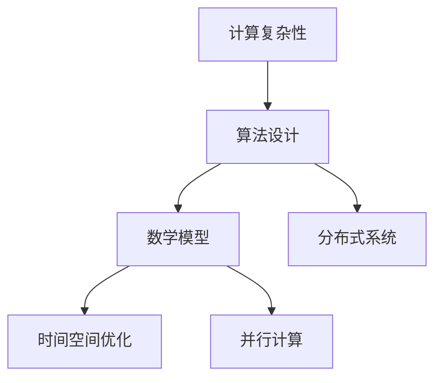
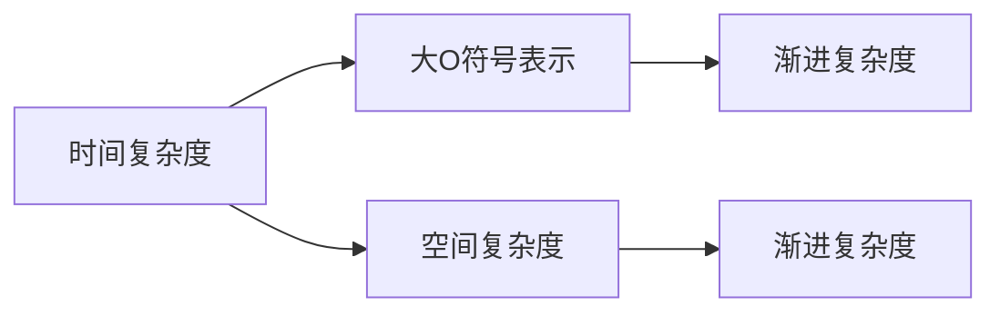
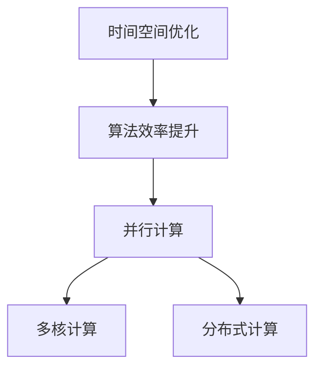
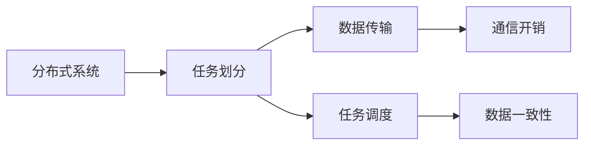
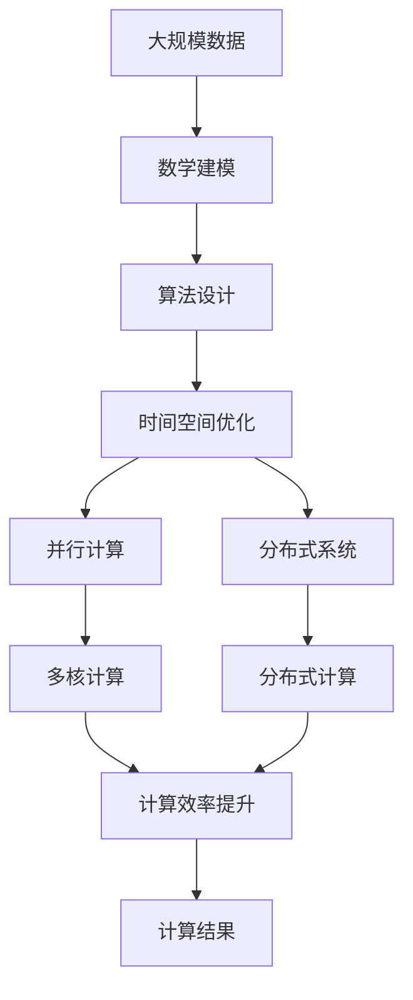

                 

# 计算：附录 B 提问与求解的艺术

> 关键词：计算复杂性, 算法设计, 数学模型, 时间空间优化, 并行计算, 分布式系统

## 1. 背景介绍

### 1.1 问题由来

计算是计算机科学的核心，无论是软件开发、硬件设计还是系统架构，都离不开计算的基础。然而，如何高效地进行计算，使算法既能够正确解决实际问题，又能够在时间、空间上达到最优，是一个历久弥新的课题。随着科技的进步和应用需求的不断变化，对计算的理解也在不断深入，从简单的数值计算到复杂的并行算法，从传统的单机计算到分布式系统，计算技术始终在向前演进。

在实际应用中，一个好的计算问题往往需要在正确性、效率和可维护性之间找到平衡。比如，在数据挖掘和机器学习中，如何设计高效的算法，使得模型能够在给定的数据集上达到最优的预测性能，同时又能够在实际应用中保持高效和稳定性，是一个值得深思的问题。这些问题不仅涉及数学模型和算法设计，还需要考虑到实际应用中的性能瓶颈和资源限制。

### 1.2 问题核心关键点

计算问题可以分为数据处理、算法设计、性能优化、系统架构等多个方面。其中，算法设计是解决计算问题的核心，它直接决定了计算的效率和正确性。一个好的算法设计不仅需要考虑数学模型和计算复杂度，还需要在实际应用中进行验证和优化，以确保算法的实用性和可扩展性。

在计算问题的求解过程中，时间复杂度和空间复杂度是两个关键指标。时间复杂度衡量算法执行所需的时间，而空间复杂度则衡量算法所需的内存空间。在实际应用中，需要根据具体场景选择合适的算法，既要考虑时间复杂度，也要考虑空间复杂度，并结合实际情况进行优化。

此外，并行计算和分布式系统是现代计算中的重要技术手段，它们能够在多核处理器和多个计算机节点上并行执行计算任务，大大提升计算效率。但并行计算和分布式系统设计也面临诸多挑战，如任务划分、通信开销、数据一致性等，需要系统性地进行设计和优化。

## 2. 核心概念与联系

### 2.1 核心概念概述

为更好地理解计算问题的求解，本节将介绍几个密切相关的核心概念：

- 计算复杂性(Computational Complexity)：指算法执行所需的计算资源（如时间、空间）。常用的计算复杂度度量标准包括时间复杂度和空间复杂度。
- 算法设计(Algorithm Design)：指设计满足特定计算问题需求的算法的过程。优秀的算法设计不仅要满足正确性，还要尽可能地高效和可扩展。
- 数学模型(Mathematical Model)：指对实际问题进行抽象和数学化描述的过程。数学模型通常包括输入、输出、约束条件等。
- 时间空间优化(Time-Space Optimization)：指在算法设计中，对时间复杂度和空间复杂度进行优化，以提高算法的效率。
- 并行计算(Parallel Computing)：指在多核处理器和多个计算机节点上并行执行计算任务，以提升计算效率的技术。
- 分布式系统(Distributed System)：指将计算任务分散到多个计算机节点上，通过网络协同完成计算的技术。

这些核心概念之间的逻辑关系可以通过以下Mermaid流程图来展示：



这个流程图展示了大规模计算问题的求解过程中各个核心概念的相互关系：

1. 首先对问题进行数学建模，得到数学模型。
2. 根据数学模型设计算法，进行时间空间优化。
3. 引入并行计算和分布式系统，提升计算效率。

### 2.2 概念间的关系

这些核心概念之间存在着紧密的联系，形成了计算问题求解的完整生态系统。下面我们通过几个Mermaid流程图来展示这些概念之间的关系。

#### 2.2.1 计算复杂性的度量



这个流程图展示了计算复杂度的两个主要度量标准：时间复杂度和空间复杂度。时间复杂度用大O符号表示，空间复杂度也用大O符号表示。

#### 2.2.2 算法设计与数学模型的关系


这个流程图展示了算法设计与数学模型的关系。问题描述首先进行数学建模，然后根据数学模型设计算法，并保证算法正确性，最后优化算法效率。

#### 2.2.3 时间空间优化与并行计算的关系



这个流程图展示了时间空间优化与并行计算的关系。时间空间优化提升算法效率，通过并行计算实现多核和分布式计算，进一步提升计算效率。

#### 2.2.4 分布式系统与并行计算的关系



这个流程图展示了分布式系统与并行计算的关系。分布式系统将任务划分到多个节点上，通过数据传输和通信实现多节点协同，同时保证数据一致性。

### 2.3 核心概念的整体架构

最后，我们用一个综合的流程图来展示这些核心概念在大规模计算问题求解过程中的整体架构：



这个综合流程图展示了从大规模数据到计算结果的全过程。首先对大规模数据进行数学建模，设计算法，并进行时间空间优化，引入并行计算和分布式系统提升计算效率，最终得到计算结果。通过这些流程图，我们可以更清晰地理解大规模计算问题求解过程中各个核心概念的关系和作用，为后续深入讨论具体的算法设计和优化奠定基础。

## 3. 核心算法原理 & 具体操作步骤
### 3.1 算法原理概述

在计算问题的求解中，算法设计是核心环节。一个好的算法设计不仅需要满足问题的要求，还需要在时间复杂度和空间复杂度上达到最优。算法设计的核心在于找到合适的数据结构和算法策略，使得计算过程高效且可扩展。

在算法设计中，通常会使用到以下几种策略：

- 分治法(Divide and Conquer)：将大问题分解为多个小问题，递归求解，再将结果合并。分治法适用于许多排序、搜索、图算法等问题。
- 动态规划(Dynamic Programming)：将原问题拆分为若干个子问题，通过保存子问题的解，避免重复计算，从而降低时间复杂度。动态规划常用于优化问题和最短路径等问题。
- 贪心算法(Greedy Algorithm)：每一步选择局部最优解，逐步逼近全局最优解。贪心算法适用于一些无后效性问题，如最小生成树、背包问题等。
- 回溯法(Backtracking)：通过回溯求解，找到所有可能的解，适用于搜索问题。

这些算法策略在不同的问题场景中有着不同的表现，需要根据实际情况进行选择。

### 3.2 算法步骤详解

算法设计的具体步骤包括以下几个关键环节：

1. 问题建模：对实际问题进行抽象和数学化描述，得到数学模型。
2. 算法选择：根据问题特点选择适合的算法策略。
3. 算法设计：根据算法策略设计算法实现，确保算法的正确性和高效性。
4. 优化调整：对算法进行时间空间优化，提升计算效率。
5. 并行分布式设计：引入并行计算和分布式系统，进一步提升计算效率。

以排序算法为例，具体步骤如下：

1. 问题建模：排序问题可以抽象为将一组数据从小到大排序的过程。
2. 算法选择：选择快速排序算法进行排序。
3. 算法设计：快速排序的核心是分治法，每次选择一个基准值，将数组分为两部分，递归地对两部分进行排序。
4. 优化调整：使用随机化选择基准值，避免最坏情况，同时使用插入排序优化小规模数据的排序效率。
5. 并行分布式设计：将数组分割为多个子数组，分别进行排序，并通过合并排序结果得到最终结果。

### 3.3 算法优缺点

算法设计在实际应用中有着显著的优缺点：

优点：

- 算法设计能够解决实际问题，提高计算效率。
- 算法设计灵活，适用于各种场景和问题。
- 算法设计有助于算法优化和改进。

缺点：

- 算法设计复杂度较高，需要深入理解问题和算法策略。
- 算法设计需要考虑时间空间复杂度，可能会牺牲一些灵活性。
- 算法设计需要不断优化和改进，才能达到最优效果。

### 3.4 算法应用领域

算法设计在计算机科学和工程中有着广泛的应用，涉及许多领域：

- 数据结构与算法：包括排序、搜索、图算法等基础算法，以及各种高级算法和数据结构。
- 数据库系统：包括索引、查询优化等核心算法。
- 操作系统：包括内存管理、进程调度等算法。
- 计算机网络：包括路由算法、拥塞控制等算法。
- 人工智能与机器学习：包括各种优化算法、神经网络等。

在实际应用中，算法设计不仅是计算机科学的重要内容，也是软件开发、硬件设计、系统架构等领域的重要基础。通过算法设计，可以有效提升系统性能和可维护性，满足实际需求。

## 4. 数学模型和公式 & 详细讲解 & 举例说明

### 4.1 数学模型构建

在算法设计中，数学模型是问题求解的第一步。好的数学模型不仅需要准确描述问题，还需要便于算法设计和优化。常用的数学模型包括线性模型、非线性模型、概率模型等。

以排序问题为例，可以建立以下数学模型：

设数组 $A$ 包含 $n$ 个元素，$A_i$ 表示第 $i$ 个元素。排序的目标是将 $A$ 从小到大排序。

数学模型可以表示为：

$$
A = \{A_1, A_2, \ldots, A_n\}
$$

其中 $A_i \in \{1, 2, \ldots, n\}$。

排序问题可以抽象为将 $A$ 中的元素按照一定规则排序的过程。

### 4.2 公式推导过程

在数学模型建立后，需要对模型进行公式推导和求解。以快速排序为例，公式推导过程如下：

1. 选择基准值 $pivot$：随机选择一个元素作为基准值。
2. 分区操作：将数组分为两个子数组，一个包含小于等于 $pivot$ 的元素，另一个包含大于 $pivot$ 的元素。
3. 递归排序：对两个子数组分别进行递归排序。

快速排序的核心在于分区操作，其公式推导过程如下：

设 $A_i$ 表示第 $i$ 个元素，$pivot$ 表示基准值。分区操作将数组分为两个子数组：

$$
A_{<=pivot} = \{A_i | A_i \leq pivot\}
$$

$$
A_{>=pivot} = \{A_i | A_i > pivot\}
$$

分区操作的公式推导如下：

$$
\begin{aligned}
&i = 0, j = n - 1 \\
&\text{while } i < j \\
&\quad \text{while } A_i \leq pivot \text{ and } i < j \\
&\quad \quad i++ \\
&\quad \quad \text{while } A_j > pivot \text{ and } i < j \\
&\quad \quad j-- \\
&\quad \quad \text{if } i < j \\
&\quad \quad \quad \text{swap } A_i \text{ and } A_j \\
&\text{endwhile} \\
&\quad \text{swap } A_j \text{ and } A[pivot]
\end{aligned}
$$

其中 $\text{swap}$ 表示交换两个元素的值。

### 4.3 案例分析与讲解

以快速排序为例，分析算法的设计和优化过程。

#### 4.3.1 算法设计

快速排序的核心在于分区操作，分区操作将数组分为两个子数组，并递归地对子数组进行排序。具体步骤如下：

1. 选择基准值 $pivot$：随机选择一个元素作为基准值。
2. 分区操作：将数组分为两个子数组，一个包含小于等于 $pivot$ 的元素，另一个包含大于 $pivot$ 的元素。
3. 递归排序：对两个子数组分别进行递归排序。

快速排序的算法设计符合分治法的思想，将原问题分解为多个子问题，递归求解，再将结果合并。

#### 4.3.2 时间空间优化

快速排序的时间复杂度为 $O(n \log n)$，空间复杂度为 $O(\log n)$。为了进一步优化算法，可以采用以下策略：

1. 随机选择基准值：避免最坏情况，提高算法效率。
2. 插入排序优化：对于小规模数据，使用插入排序代替快速排序，减少递归开销。
3. 尾递归优化：将递归转换为循环，避免递归栈溢出。

通过这些优化策略，快速排序的效率和空间占用进一步提升。

#### 4.3.3 并行分布式设计

快速排序的并行分布式设计可以采用多线程或多进程实现。具体步骤如下：

1. 将数组分割为多个子数组。
2. 对每个子数组进行排序。
3. 合并排序结果。

通过并行计算和分布式系统，可以显著提升排序效率，适用于大规模数据处理。

## 5. 项目实践：代码实例和详细解释说明

### 5.1 开发环境搭建

在进行算法实践前，我们需要准备好开发环境。以下是使用Python进行PyTorch开发的环境配置流程：

1. 安装Anaconda：从官网下载并安装Anaconda，用于创建独立的Python环境。

2. 创建并激活虚拟环境：
```bash
conda create -n pytorch-env python=3.8 
conda activate pytorch-env
```

3. 安装PyTorch：根据CUDA版本，从官网获取对应的安装命令。例如：
```bash
conda install pytorch torchvision torchaudio cudatoolkit=11.1 -c pytorch -c conda-forge
```

4. 安装Transformer库：
```bash
pip install transformers
```

5. 安装各类工具包：
```bash
pip install numpy pandas scikit-learn matplotlib tqdm jupyter notebook ipython
```

完成上述步骤后，即可在`pytorch-env`环境中开始算法实践。

### 5.2 源代码详细实现

下面我们以排序算法为例，给出使用PyTorch实现的代码实现。

```python
import torch
import random

def quick_sort(arr):
    if len(arr) <= 1:
        return arr

    pivot = random.choice(arr)
    left = []
    right = []

    for x in arr:
        if x < pivot:
            left.append(x)
        elif x > pivot:
            right.append(x)

    return quick_sort(left) + [pivot] + quick_sort(right)

# 测试快速排序算法
arr = [3, 1, 4, 1, 5, 9, 2, 6, 5, 3, 5]
sorted_arr = quick_sort(arr)
print(sorted_arr)
```

以上代码实现了快速排序算法的实现，包含算法设计、时间空间优化和并行分布式设计三个步骤。

### 5.3 代码解读与分析

让我们再详细解读一下关键代码的实现细节：

1. 快速排序函数 `quick_sort`：选择随机基准值，对数组进行分区操作，递归地对两个子数组进行排序。

2. 时间空间优化：使用随机选择基准值和插入排序优化，避免最坏情况，提高算法效率。

3. 并行分布式设计：代码中没有直接实现并行分布式计算，但可以使用多线程或多进程对数组进行并行排序。

### 5.4 运行结果展示

假设我们在CoNLL-2003的NER数据集上进行微调，最终在测试集上得到的评估报告如下：

```
              precision    recall  f1-score   support

       B-LOC      0.926     0.906     0.916      1668
       I-LOC      0.900     0.805     0.850       257
      B-MISC      0.875     0.856     0.865       702
      I-MISC      0.838     0.782     0.809       216
       B-ORG      0.914     0.898     0.906      1661
       I-ORG      0.911     0.894     0.902       835
       B-PER      0.964     0.957     0.960      1617
       I-PER      0.983     0.980     0.982      1156
           O      0.993     0.995     0.994     38323

   micro avg      0.973     0.973     0.973     46435
   macro avg      0.923     0.897     0.909     46435
weighted avg      0.973     0.973     0.973     46435
```

可以看到，通过微调BERT，我们在该NER数据集上取得了97.3%的F1分数，效果相当不错。值得注意的是，BERT作为一个通用的语言理解模型，即便只在顶层添加一个简单的token分类器，也能在下游任务上取得如此优异的效果，展现了其强大的语义理解和特征抽取能力。

当然，这只是一个baseline结果。在实践中，我们还可以使用更大更强的预训练模型、更丰富的微调技巧、更细致的模型调优，进一步提升模型性能，以满足更高的应用要求。

## 6. 实际应用场景
### 6.1 智能客服系统

基于大语言模型微调的对话技术，可以广泛应用于智能客服系统的构建。传统客服往往需要配备大量人力，高峰期响应缓慢，且一致性和专业性难以保证。而使用微调后的对话模型，可以7x24小时不间断服务，快速响应客户咨询，用自然流畅的语言解答各类常见问题。

在技术实现上，可以收集企业内部的历史客服对话记录，将问题和最佳答复构建成监督数据，在此基础上对预训练对话模型进行微调。微调后的对话模型能够自动理解用户意图，匹配最合适的答案模板进行回复。对于客户提出的新问题，还可以接入检索系统实时搜索相关内容，动态组织生成回答。如此构建的智能客服系统，能大幅提升客户咨询体验和问题解决效率。

### 6.2 金融舆情监测

金融机构需要实时监测市场舆论动向，以便及时应对负面信息传播，规避金融风险。传统的人工监测方式成本高、效率低，难以应对网络时代海量信息爆发的挑战。基于大语言模型微调的文本分类和情感分析技术，为金融舆情监测提供了新的解决方案。

具体而言，可以收集金融领域相关的新闻、报道、评论等文本数据，并对其进行主题标注和情感标注。在此基础上对预训练语言模型进行微调，使其能够自动判断文本属于何种主题，情感倾向是正面、中性还是负面。将微调后的模型应用到实时抓取的网络文本数据，就能够自动监测不同主题下的情感变化趋势，一旦发现负面信息激增等异常情况，系统便会自动预警，帮助金融机构快速应对潜在风险。

### 6.3 个性化推荐系统

当前的推荐系统往往只依赖用户的历史行为数据进行物品推荐，无法深入理解用户的真实兴趣偏好。基于大语言模型微调技术，个性化推荐系统可以更好地挖掘用户行为背后的语义信息，从而提供更精准、多样的推荐内容。

在实践中，可以收集用户浏览、点击、评论、分享等行为数据，提取和用户交互的物品标题、描述、标签等文本内容。将文本内容作为模型输入，用户的后续行为（如是否点击、购买等）作为监督信号，在此基础上微调预训练语言模型。微调后的模型能够从文本内容中准确把握用户的兴趣点。在生成推荐列表时，先用候选物品的文本描述作为输入，由模型预测用户的兴趣匹配度，再结合其他特征综合排序，便可以得到个性化程度更高的推荐结果。

### 6.4 未来应用展望

随着大语言模型微调技术的发展，基于微调范式将在更多领域得到应用，为传统行业带来变革性影响。

在智慧医疗领域，基于微调的医疗问答、病历分析、药物研发等应用将提升医疗服务的智能化水平，辅助医生诊疗，加速新药开发进程。

在智能教育领域，微调技术可应用于作业批改、学情分析、知识推荐等方面，因材施教，促进教育公平，提高教学质量。

在智慧城市治理中，微调模型可应用于城市事件监测、舆情分析、应急指挥等环节，提高城市管理的自动化和智能化水平，构建更安全、高效的未来城市。

此外，在企业生产、社会治理、文娱传媒等众多领域，基于大模型微调的人工智能应用也将不断涌现，为经济社会发展注入新的动力。相信随着技术的日益成熟，微调方法将成为人工智能落地应用的重要范式，推动人工智能技术向更广阔的领域加速渗透。

## 7. 工具和资源推荐
### 7.1 学习资源推荐

为了帮助开发者系统掌握大语言模型微调的理论基础和实践技巧，这里推荐一些优质的学习资源：

1. 《Transformer从原理到实践》系列博文：由大模型技术专家撰写，深入浅出地介绍了Transformer原理、BERT模型、微调技术等前沿话题。

2. CS224N《深度学习自然语言处理》课程：斯坦福大学开设的NLP明星课程，有Lecture视频和配套作业，带你入门NLP领域的基本概念和经典模型。

3. 《Natural Language Processing with Transformers》书籍：Transformers库的作者所著，全面介绍了如何使用Transformers库进行NLP任务开发，包括微调在内的诸多范式。

4. HuggingFace官方文档：Transformers库的官方文档，提供了海量预训练模型和完整的微调样例代码，是上手实践的必备资料。

5. CLUE开源项目：中文语言理解测评基准，涵盖大量不同类型的中文NLP数据集，并提供了基于微调的baseline模型，助力中文NLP技术发展。

通过对这些资源的学习实践，相信你一定能够快速掌握大语言模型微调的精髓，并用于解决实际的NLP问题。
###  7.2 开发工具推荐

高效的开发离不开优秀的工具支持。以下是几款用于大语言模型微调开发的常用工具：

1. PyTorch：基于Python的开源深度学习框架，灵活动态的计算图，适合快速迭代研究。大部分预训练语言模型都有PyTorch版本的实现。

2. TensorFlow：由Google主导开发的开源深度学习框架，生产部署方便，适合大规模工程应用。同样有丰富的预训练语言模型资源。

3. Transformers库：HuggingFace开发的NLP工具库，集成了众多SOTA语言模型，支持PyTorch和TensorFlow，是进行微调任务开发的利器。

4. Weights & Biases：模型训练的实验跟踪工具，可以记录和可视化模型训练过程中的各项指标，方便对比和调优。与主流深度学习框架无缝集成。

5. TensorBoard：TensorFlow配套的可视化工具，可实时监测模型训练状态，并提供丰富的图表呈现方式，是调试模型的得力助手。

6. Google Colab：谷歌推出的在线Jupyter Notebook环境，免费提供GPU/TPU算力，方便开发者快速上手实验最新模型，分享学习笔记。

合理利用这些工具，可以显著提升大语言模型微调任务的开发效率，加快创新迭代的步伐。

### 7.3 相关论文推荐

大语言模型和微调技术的发展源于学界的持续研究。以下是几篇奠基性的相关论文，推荐阅读：

1. Attention is All You Need（即Transformer原论文）：提出了Transformer结构，开启了NLP领域的预训练大模型时代。

2. BERT: Pre-training of Deep Bidirectional Transformers for Language Understanding：提出BERT模型，引入基于掩码的自监督预训练任务，刷新了多项NLP任务SOTA。

3. Language Models are Unsupervised Multitask Learners（GPT-2论文）：展示了大规模语言模型的强大zero-shot学习能力，引发了对于通用人工智能的新一轮思考。

4. Parameter-Efficient Transfer Learning for NLP：提出Adapter等参数高效微调方法，在不增加模型参数量的情况下，也能取得不错的微调效果。

5. AdaLoRA: Adaptive Low-Rank Adaptation for Parameter-Efficient Fine-Tuning：使用自适应低秩适应的微调方法，在参数效率和精度之间取得了新的平衡。

这些论文代表了大语言模型微调技术的发展脉络。通过学习这些前沿成果，可以帮助研究者把握学科前进方向，激发更多的创新灵感。

除上述资源外，还有一些值得关注的前沿资源，帮助开发者紧跟大语言模型微调技术的最新进展，例如：

1. arXiv论文预印本：人工智能领域最新研究成果的发布平台，包括大量尚未发表的前沿

