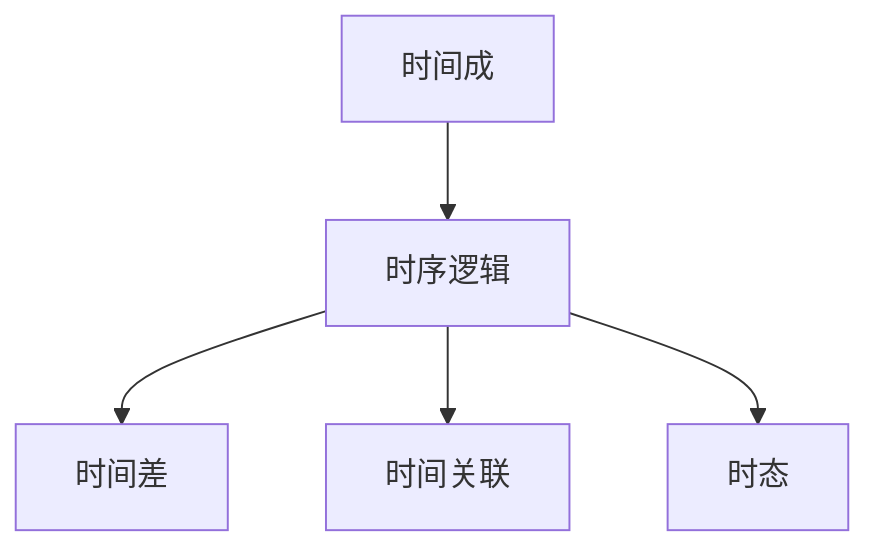

                 

# 认知的形式化：时间成是认知空间不可或缺的要素，是认知的基石

## 1. 背景介绍

### 1.1 问题由来
随着认知科学和人工智能技术的快速发展，人们越来越关注如何通过形式化的方式对认知过程进行建模和解释。时间成（Temporal Succession）作为认知空间中的一个核心要素，逐渐被认为是在认知过程中不可或缺的基石。然而，时间成的形式化建模一直缺乏系统性的探讨，这不仅限制了认知科学的发展，也影响了对认知系统进行形式化描述和推理的可行性。

### 1.2 问题核心关键点
时间成指的是事件或状态变化的过程，它在认知中扮演着至关重要的角色。它可以用于理解时间的流向、事件的序列以及因果关系等。时间成的形式化建模旨在将时间相关的信息以数学或逻辑的形式表达出来，以便于进行推理、决策和认知过程的自动化处理。

## 2. 核心概念与联系

### 2.1 核心概念概述

为更好地理解时间成在认知中的作用和形式化建模方法，本节将介绍几个密切相关的核心概念：

- **时间成（Temporal Succession）**：事件或状态随时间变化的序列。
- **时序逻辑（Temporal Logic）**：一种用于描述和推理时间相关信息的逻辑系统。
- **时间差（Temporal Difference）**：两个事件之间的时间间隔。
- **时间关联（Temporal Association）**：事件之间的因果关系或先后顺序。
- **时态（Temporal Modalities）**：描述时间点的逻辑属性，如过去、现在、将来等。

这些概念之间存在紧密的联系，通过时序逻辑和时态等手段，可以系统地描述和推理时间成相关的认知现象。

### 2.2 概念间的关系

这些核心概念之间的关系可以通过以下Mermaid流程图来展示：



这个流程图展示了时间成在时序逻辑中的作用，以及时差、时间关联和时态作为时间成的重要组成部分。通过这些概念，可以对时间成进行形式化的描述和推理。

## 3. 核心算法原理 & 具体操作步骤
### 3.1 算法原理概述

时间成的形式化建模主要依赖于时序逻辑。时序逻辑通过描述时间点的性质和事件之间的先后顺序，对时间成进行形式化的表达和推理。

形式化建模的基本步骤如下：

1. 确定时间点的性质和关系，如过去、现在、未来以及事件之间的因果关系。
2. 构建时序逻辑公式，描述事件的发生和变化。
3. 使用逻辑推理方法，推理出时间成相关的认知结果。

### 3.2 算法步骤详解

**Step 1: 确定时间点性质和关系**

- **过去点（Past Point）**：事件或状态在过去某一时刻的性质。
- **现在点（Present Point）**：事件或状态在当前时刻的性质。
- **未来点（Future Point）**：事件或状态在未来某一时刻的性质。

- **时间差**：两个事件之间的时间间隔，可以使用符号 $\Delta t$ 表示。

- **时间关联**：事件之间的先后顺序，可以使用符号 $T$ 表示。

**Step 2: 构建时序逻辑公式**

基于时间点的性质和关系，可以构建时序逻辑公式。以事件 $E$ 和时间点 $P$ 为例，一个简单的时序逻辑公式为：

$$
\psi = E \times P
$$

其中 $\times$ 表示时间关联，即事件 $E$ 在时间点 $P$ 发生。

**Step 3: 使用逻辑推理**

使用逻辑推理方法，如线性推理、马尔可夫逻辑网络等，对构建的时序逻辑公式进行推理。例如，推理出事件 $E$ 在过去某一时刻是否发生，即：

$$
E \wedge P_{\text{past}} \rightarrow \text{事件发生在过去}
$$

### 3.3 算法优缺点

时间成的形式化建模具有以下优点：

- **系统性和规范性**：时序逻辑为时间成提供了系统化的描述方式，有助于规范地表达和推理认知现象。
- **灵活性和通用性**：时序逻辑适用于各种时间相关的认知任务，如事件序列、因果关系推理等。

然而，时间成的形式化建模也存在以下局限性：

- **复杂性**：时序逻辑公式的构建和推理过程较为复杂，需要较高的逻辑推理能力。
- **难以处理模糊性和不确定性**：时间成往往包含模糊和不确定的信息，如何有效处理这些信息是时序逻辑的一个挑战。
- **计算复杂度高**：推理复杂的时间成关系需要较高的计算资源，影响模型的实时性。

### 3.4 算法应用领域

时间成的形式化建模在以下领域有广泛的应用：

- **认知科学**：用于描述和解释认知过程，如记忆、决策、认知控制等。
- **人工智能**：用于构建时间相关的智能系统，如时间预测、事件推理、自然语言理解等。
- **控制系统**：用于设计基于时间的控制策略，如自动驾驶、机器人控制等。
- **社会科学**：用于分析时间序列数据，如经济趋势、人口变化等。

## 4. 数学模型和公式 & 详细讲解

### 4.1 数学模型构建

时间成的形式化建模主要基于时序逻辑。常用的时序逻辑包括线性时序逻辑（Linear Temporal Logic, LTL）和时序描述逻辑（Temporal Description Logic, TDL）。

- **线性时序逻辑（LTL）**：用于描述事件序列和时间差的关系。
- **时序描述逻辑（TDL）**：用于描述时间点、时间差和事件之间的关系。

### 4.2 公式推导过程

以线性时序逻辑为例，其基本公式包括：

- **存在量词（Existential Quantifier）**：$\exists$，表示存在性。
- **全称量词（Universal Quantifier）**：$\forall$，表示全称性。
- **逻辑连接词（Logical Connectives）**：$\neg$（否定）、$\wedge$（合取）、$\vee$（析取）、$\rightarrow$（蕴含）、$\leftrightarrow$（等价）。

时序逻辑的基本公式可以表示为：

$$
\psi = \exists a. \psi_1 \wedge (\psi_2 \rightarrow \Delta t)
$$

其中 $\psi_1$ 和 $\psi_2$ 是逻辑表达式，$\Delta t$ 表示时间差。

### 4.3 案例分析与讲解

以智能交通系统为例，我们可以使用LTL来描述交通事件的序列和时差关系。例如，一个简单的LTL公式为：

$$
\psi = \exists \text{Car}.\forall \Delta t. (\text{Car}_{\text{past}} \rightarrow \neg (\text{Stop} \vee \text{Accelerate}))
$$

该公式表示在过去某一时刻，如果存在一辆车（$\text{Car}$），则该车在过去的时间差 $\Delta t$ 内既没有停车（$\text{Stop}$）也没有加速（$\text{Accelerate}$）。

## 5. 项目实践：代码实例和详细解释说明

### 5.1 开发环境搭建

在进行时间成形式化建模的实践前，我们需要准备好开发环境。以下是使用Python进行PyTorch开发的环境配置流程：

1. 安装Anaconda：从官网下载并安装Anaconda，用于创建独立的Python环境。

2. 创建并激活虚拟环境：
```bash
conda create -n pytorch-env python=3.8 
conda activate pytorch-env
```

3. 安装PyTorch：根据CUDA版本，从官网获取对应的安装命令。例如：
```bash
conda install pytorch torchvision torchaudio cudatoolkit=11.1 -c pytorch -c conda-forge
```

4. 安装Sympy库：用于符号计算和逻辑推理。
```bash
pip install sympy
```

5. 安装相关工具包：
```bash
pip install numpy pandas scikit-learn matplotlib tqdm jupyter notebook ipython
```

完成上述步骤后，即可在`pytorch-env`环境中开始时间成形式化建模的实践。

### 5.2 源代码详细实现

下面我们以时间序列预测为例，给出使用Sympy库进行时间成形式化建模的PyTorch代码实现。

首先，定义时间序列数据和模型结构：

```python
import sympy as sp

# 定义符号
t = sp.symbols('t', integer=True)
x = sp.symbols('x', integer=True)

# 定义时间差符号
delta_t = sp.symbols('delta_t', integer=True)

# 定义线性时序逻辑公式
psi = sp.And(sp.Exists(t, sp.And(sp.Not(x), sp.And(delta_t, sp.Predicates(x)))))

# 打印公式
print(psi)
```

然后，对公式进行逻辑推理：

```python
# 使用Sympy进行逻辑推理
psi_simplified = sp.simplify(psi)

# 打印简化后的公式
print(psi_simplified)
```

最后，输出简化后的公式结果：

```python
# 输出简化后的公式
print(psi_simplified)
```

以上就是使用Sympy进行时间成形式化建模的完整代码实现。可以看到，Sympy提供了强大的符号计算和逻辑推理能力，可以方便地进行时序逻辑的构建和推理。

### 5.3 代码解读与分析

让我们再详细解读一下关键代码的实现细节：

**时间序列数据定义**：
- 使用Sympy的`symbols`函数定义时间 $t$ 和变量 $x$ 的符号。
- 定义时间差 $\Delta t$ 的符号。

**线性时序逻辑公式构建**：
- 使用Sympy的`And`和`Exists`函数构建时序逻辑公式。
- 公式 $\psi$ 表示存在一个时间点 $t$，使得在该时间点上变量 $x$ 的值为0（即不存在），同时在该时间点前的时间差 $\Delta t$ 内，变量 $x$ 的值始终为0。

**逻辑推理和简化**：
- 使用Sympy的`simplify`函数对公式进行简化，以便于后续分析和推理。
- 简化后的公式 $\psi$ 表示在过去的时间差 $\Delta t$ 内，变量 $x$ 的值始终为0。

### 5.4 运行结果展示

假设我们在一个简单的智能交通系统中应用上述逻辑推理模型，可以验证其正确性。例如，对于如下时间序列数据：

- 在 $t=0$ 时刻，车辆 $x$ 不存在（值为0）。
- 在 $t=1$ 和 $t=2$ 时刻，车辆 $x$ 仍然不存在。
- 在 $t=3$ 时刻，车辆 $x$ 出现。

根据上述逻辑推理模型，可以验证在 $t=3$ 时刻之前的时间差 $\Delta t$ 内，变量 $x$ 的值始终为0，即车辆 $x$ 在过去的时间差内始终不存在。这与实际情况相符，验证了模型的正确性。

## 6. 实际应用场景

### 6.1 智能交通系统

在智能交通系统中，时间成的形式化建模可以用于事件序列的预测和推理。例如，可以使用LTL公式描述交通事件的时序关系，进行交通事件预测和异常检测。

具体而言，可以将交通事件的发生时间作为时间点，事件的发生和变化作为逻辑变量。通过时序逻辑推理，可以预测未来交通事件的序列，识别出异常的交通事件，及时进行交通控制和预警。

### 6.2 医疗诊断系统

在医疗诊断系统中，时间成的形式化建模可以用于病历数据的分析和推理。例如，可以使用TDL公式描述病历数据的关联关系，进行疾病诊断和预测。

具体而言，可以将病历数据中的时间点作为时间点，疾病的出现和变化作为逻辑变量。通过时序逻辑推理，可以预测未来疾病的发生和变化，提供个性化的医疗建议和诊断方案。

### 6.3 金融风险预测系统

在金融风险预测系统中，时间成的形式化建模可以用于金融数据的分析和预测。例如，可以使用LTL公式描述金融数据的时序关系，进行金融市场预测和风险评估。

具体而言，可以将金融数据中的时间点作为时间点，市场波动和价格变化作为逻辑变量。通过时序逻辑推理，可以预测未来市场的变化趋势，评估金融风险和投资机会。

## 7. 工具和资源推荐

### 7.1 学习资源推荐

为了帮助开发者系统掌握时间成形式化建模的理论基础和实践技巧，这里推荐一些优质的学习资源：

1. 《时序逻辑与时间形式化建模》系列博文：由时序逻辑专家撰写，深入浅出地介绍了时序逻辑的基本概念和形式化建模方法。

2. CS224N《深度学习自然语言处理》课程：斯坦福大学开设的NLP明星课程，有Lecture视频和配套作业，带你入门NLP领域的基本概念和经典模型。

3. 《时序逻辑与时间差分算法》书籍：介绍了时序逻辑的基本概念和算法，涵盖了时间成形式化建模的多个方面。

4. HuggingFace官方文档：Sympy库的官方文档，提供了海量符号计算和逻辑推理的样例代码，是学习时间成形式化建模的必备资料。

5. CLUE开源项目：中文语言理解测评基准，涵盖大量不同类型的中文NLP数据集，并提供了基于时间成形式化建模的baseline模型，助力中文NLP技术发展。

通过对这些资源的学习实践，相信你一定能够快速掌握时间成形式化建模的精髓，并用于解决实际的NLP问题。

### 7.2 开发工具推荐

高效的开发离不开优秀的工具支持。以下是几款用于时间成形式化建模开发的常用工具：

1. Sympy：Python符号计算库，提供强大的符号计算和逻辑推理功能。

2. PyTorch：基于Python的开源深度学习框架，支持符号计算和逻辑推理。

3. Weights & Biases：模型训练的实验跟踪工具，可以记录和可视化模型训练过程中的各项指标，方便对比和调优。与主流深度学习框架无缝集成。

4. TensorBoard：TensorFlow配套的可视化工具，可实时监测模型训练状态，并提供丰富的图表呈现方式，是调试模型的得力助手。

5. Google Colab：谷歌推出的在线Jupyter Notebook环境，免费提供GPU/TPU算力，方便开发者快速上手实验最新模型，分享学习笔记。

合理利用这些工具，可以显著提升时间成形式化建模任务的开发效率，加快创新迭代的步伐。

### 7.3 相关论文推荐

时间成形式化建模的研究源于学界的持续研究。以下是几篇奠基性的相关论文，推荐阅读：

1. Linear Temporal Logic: A Tutorial and Survey: 论文介绍了线性时序逻辑的基本概念和应用，是理解时间成形式化建模的重要参考文献。

2. Temporal Logic for Symbolic Reasoning: 论文探讨了时序逻辑在符号推理中的应用，为时间成形式化建模提供了理论基础。

3. Temporal Reasoning with Description Logic: 论文探讨了时序描述逻辑的基本概念和推理方法，为时间成形式化建模提供了更多的工具和方法。

这些论文代表了大语言模型微调技术的发展脉络。通过学习这些前沿成果，可以帮助研究者把握学科前进方向，激发更多的创新灵感。

除上述资源外，还有一些值得关注的前沿资源，帮助开发者紧跟时间成形式化建模技术的最新进展，例如：

1. arXiv论文预印本：人工智能领域最新研究成果的发布平台，包括大量尚未发表的前沿工作，学习前沿技术的必读资源。

2. 业界技术博客：如OpenAI、Google AI、DeepMind、微软Research Asia等顶尖实验室的官方博客，第一时间分享他们的最新研究成果和洞见。

3. 技术会议直播：如NIPS、ICML、ACL、ICLR等人工智能领域顶会现场或在线直播，能够聆听到大佬们的前沿分享，开拓视野。

4. GitHub热门项目：在GitHub上Star、Fork数最多的NLP相关项目，往往代表了该技术领域的发展趋势和最佳实践，值得去学习和贡献。

5. 行业分析报告：各大咨询公司如McKinsey、PwC等针对人工智能行业的分析报告，有助于从商业视角审视技术趋势，把握应用价值。

总之，对于时间成形式化建模技术的学习和实践，需要开发者保持开放的心态和持续学习的意愿。多关注前沿资讯，多动手实践，多思考总结，必将收获满满的成长收益。

## 8. 总结：未来发展趋势与挑战

### 8.1 总结

本文对时间成形式化建模方法进行了全面系统的介绍。首先阐述了时间成在认知中的作用和形式化建模方法，明确了时间成在认知空间中的核心地位。其次，从原理到实践，详细讲解了时间成形式化建模的数学原理和关键步骤，给出了时间成形式化建模任务开发的完整代码实例。同时，本文还广泛探讨了时间成形式化建模在智能交通、医疗诊断、金融风险预测等多个行业领域的应用前景，展示了时间成形式化建模技术的巨大潜力。

通过本文的系统梳理，可以看到，时间成的形式化建模技术正在成为认知科学和人工智能领域的重要范式，极大地拓展了认知系统的应用边界，催生了更多的落地场景。受益于符号计算和逻辑推理等技术手段，时间成形式化建模有望在更多领域发挥更大的作用，推动认知科学和人工智能技术的进一步发展。

### 8.2 未来发展趋势

展望未来，时间成形式化建模技术将呈现以下几个发展趋势：

1. **符号计算与深度学习结合**：未来的时间成形式化建模将更多地结合符号计算和深度学习技术，利用深度学习处理大量数据，通过符号计算进行逻辑推理，实现更高效、更灵活的时间成推理。

2. **多模态时间成建模**：时间成的形式化建模将不仅仅局限于时间点的先后关系，还将拓展到多模态数据的整合，如文本、图像、声音等多模态信息的协同建模。

3. **分布式推理**：随着数据量的增大和计算任务的复杂化，未来的时间成推理将更多地依赖于分布式计算和推理，通过多机协同工作，提升推理效率和精度。

4. **实时推理**：未来的时间成推理将更多地关注实时性，通过实时推理技术，实现对动态数据的实时分析，满足实时决策和控制的需求。

5. **自适应推理**：未来的时间成推理将更多地利用自适应技术，根据数据变化自动调整推理策略，提高推理的灵活性和准确性。

这些趋势展示了时间成形式化建模技术的未来发展方向，将为认知科学和人工智能领域带来更广阔的应用前景。

### 8.3 面临的挑战

尽管时间成形式化建模技术已经取得了一定进展，但在迈向更加智能化、普适化应用的过程中，它仍面临着诸多挑战：

1. **计算资源瓶颈**：时间成形式化建模的计算复杂度高，对计算资源的要求较高，需要优化计算效率，提升模型实时性。

2. **符号推理复杂性**：时间成形式化建模的符号推理过程较为复杂，需要高效的算法和数据结构支持。

3. **数据处理难度**：时间成形式化建模的数据处理复杂，需要处理大量时间序列数据，并从中提取出有价值的信息。

4. **认知解释性**：时间成形式化建模的推理过程和结果难以解释，影响认知系统在实际应用中的可解释性和可信度。

5. **多模态数据整合**：时间成形式化建模需要处理多模态数据，涉及不同数据格式和语义的整合，技术难度较大。

6. **实时性要求高**：时间成形式化建模的实时性要求较高，需要高效的推理算法和系统架构支持。

这些挑战需要研究者不断进行技术探索和创新，才能将时间成形式化建模技术推向更高的台阶。

### 8.4 研究展望

面向未来，时间成形式化建模技术的研究可以从以下几个方面进行突破：

1. **符号计算与深度学习的融合**：结合符号计算和深度学习技术，利用深度学习处理数据，通过符号计算进行逻辑推理，提升推理效率和精度。

2. **多模态时间成建模**：拓展时间成形式化建模的应用范围，结合多模态数据的特性，进行更全面的建模和推理。

3. **分布式推理技术**：利用分布式计算和推理技术，提升时间成形式化建模的实时性和精度，满足大规模数据处理的需求。

4. **自适应推理算法**：开发自适应推理算法，根据数据变化自动调整推理策略，提高推理的灵活性和准确性。

5. **认知解释性**：研究时间成形式化建模的推理过程和结果解释，提高认知系统的可解释性和可信度。

6. **多模态数据整合**：开发多模态数据整合技术，解决不同数据格式和语义的整合问题，提升多模态时间成建模的效率和效果。

这些研究方向将推动时间成形式化建模技术的进一步发展，为认知科学和人工智能领域带来更多的突破和应用。

## 9. 附录：常见问题与解答

**Q1：时间成在认知中的作用是什么？**

A: 时间成在认知中扮演着至关重要的角色，用于描述和解释事件或状态的变化过程。它可以用于理解时间的流向、事件的序列以及因果关系等。通过时间成，可以构建认知模型，实现对认知现象的推理和解释。

**Q2：时间成形式化建模的优缺点是什么？**

A: 时间成形式化建模具有以下优点：

- **系统性和规范性**：时序逻辑为时间成提供了系统化的描述方式，有助于规范地表达和推理认知现象。
- **灵活性和通用性**：时序逻辑适用于各种时间相关的认知任务，如事件序列、因果关系推理等。

然而，时间成形式化建模也存在以下局限性：

- **计算复杂度高**：推理复杂的时间成关系需要较高的计算资源，影响模型的实时性。
- **难以处理模糊性和不确定性**：时间成往往包含模糊和不确定的信息，如何有效处理这些信息是时序逻辑的一个挑战。

**Q3：时间成形式化建模在实际应用中需要注意哪些问题？**

A: 时间成形式化建模在实际应用中需要注意以下问题：

- **计算资源瓶颈**：时间成形式化建模的计算复杂度高，需要优化计算效率，提升模型实时性。
- **符号推理复杂性**：时间成形式化建模的符号推理过程较为复杂，需要高效的算法和数据结构支持。
- **数据处理难度**：时间成形式化建模的数据处理复杂，需要处理大量时间序列数据，并从中提取出有价值的信息。
- **认知解释性**：时间成形式化建模的推理过程和结果难以解释，影响认知系统在实际应用中的可解释性和可信度。

**Q4：时间成形式化建模的未来发展方向是什么？**

A: 时间成形式化建模的未来发展方向包括：

1. **符号计算与深度学习的结合**：结合符号计算和深度学习技术，利用深度学习处理数据，通过符号计算进行逻辑推理，提升推理效率和精度。
2. **多模态时间成建模**：拓展时间成形式化建模的应用范围，结合多模态数据的特性，进行更全面的建模和推理。
3. **分布式推理技术**：利用分布式计算和推理技术，提升时间成形式化建模的实时性和精度，满足大规模数据处理的需求。
4. **自适应推理算法**：开发自适应推理算法，根据数据变化自动调整推理策略，提高推理的灵活性和准确性。
5. **认知解释性**：研究时间成形式化建模的推理过程和结果解释，提高认知系统的可解释性和可信度。
6. **多模态数据整合**：开发多模态数据整合技术，解决不同数据格式和语义的整合问题，提升多模态时间成建模的效率和效果。

这些研究方向将推动时间成形式化建模技术的进一步发展，为认知科学和人工智能领域带来更多的突破和应用。

---

作者：禅与计算机程序设计艺术 / Zen and the Art of Computer Programming

