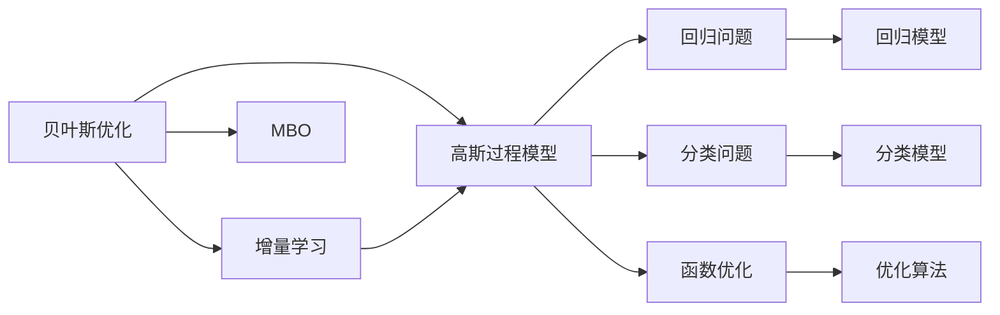

                 

# 贝叶斯优化的增量高斯过程模型

> 关键词：贝叶斯优化，高斯过程，增量学习，无悔策略，多目标优化

## 1. 背景介绍

贝叶斯优化（Bayesian Optimization）是一种基于贝叶斯理论的优化方法，广泛用于机器学习模型的超参数调优、函数优化等领域。在实际应用中，贝叶斯优化通过构建高斯过程模型（Gaussian Process Model）来对未知函数的分布进行建模，利用样本信息对目标函数进行估计和预测，从而实现高效的无悔选择（Regret-minimization）策略。

然而，在高斯过程模型中，每一次优化都需重新构建模型，计算高斯核函数的参数，这样的全批量的模型构建和计算，在高维空间或大规模问题上会非常耗时。为了解决这个问题，本文引入增量高斯过程模型（Incremental Gaussian Process, IGPG），通过利用已有的模型信息，在不完全重新计算高斯核参数的情况下，实现增量式的高斯过程模型更新。这样不仅能够大幅度降低计算成本，提高优化效率，还能在函数空间中实现更为精确的预测和优化。

## 2. 核心概念与联系

### 2.1 核心概念概述

为更好地理解增量高斯过程模型，本节将介绍几个密切相关的核心概念：

- 贝叶斯优化（Bayesian Optimization）：基于贝叶斯理论的优化方法，通过构建高斯过程模型，对目标函数进行建模和预测，从而实现高效的优化策略。
- 高斯过程模型（Gaussian Process Model）：一种基于核函数的正态分布随机过程，用于建模连续函数，可以用于回归、分类、函数优化等任务。
- 增量学习（Incremental Learning）：通过利用已有信息，在不完全重新计算的情况下，实现模型或算法的更新。
- 无悔策略（Regret-minimization）：一种优化策略，通过在每个查询点选择可能带来最小遗憾的样本，实现对目标函数的快速逼近。
- 多目标优化（Multi-Objective Optimization）：同时优化多个目标函数，实现Pareto最优解集的寻找。

这些核心概念之间的逻辑关系可以通过以下Mermaid流程图来展示：



这个流程图展示了贝叶斯优化、高斯过程模型、增量学习、无悔策略和多目标优化之间的关系：

1. 贝叶斯优化利用高斯过程模型对目标函数进行建模，实现高效的优化策略。
2. 高斯过程模型通过核函数，可以用于回归、分类、函数优化等任务。
3. 增量学习通过利用已有信息，实现模型的快速更新，减少计算成本。
4. 无悔策略通过选择可能带来最小遗憾的样本，实现对目标函数的快速逼近。
5. 多目标优化同时优化多个目标函数，寻找Pareto最优解集。

这些概念共同构成了增量高斯过程模型的基础框架，使其能够在大规模优化问题中发挥重要作用。

### 2.2 概念间的关系

这些核心概念之间存在着紧密的联系，形成了增量高斯过程模型的完整生态系统。下面我通过几个Mermaid流程图来展示这些概念之间的关系。

#### 2.2.1 贝叶斯优化的流程


这个流程图展示了贝叶斯优化的基本流程：

1. 首先，构建高斯过程模型。
2. 在模型基础上进行样本点选择。
3. 根据样本点预测目标函数的值。
4. 根据预测值，更新优化策略。
5. 进入下一轮优化。

#### 2.2.2 增量学习的流程


这个流程图展示了增量学习的基本流程：

1. 利用已有模型进行样本选择。
2. 根据新样本更新模型。
3. 在原有模型的基础上进行增量更新。
4. 进入下一轮优化。

#### 2.2.3 无悔策略的流程


这个流程图展示了无悔策略的基本流程：

1. 构建高斯过程模型。
2. 根据模型预测样本点。
3. 计算样本点的遗憾值。
4. 根据遗憾值更新优化策略。
5. 进入下一轮优化。

#### 2.2.4 多目标优化的流程


这个流程图展示了多目标优化的基本流程：

1. 构建多目标函数。
2. 在每个目标函数上进行优化。
3. 生成无差异曲线。
4. 生成决策边界。
5. 找到Pareto最优解集。

这些流程图展示了贝叶斯优化、高斯过程模型、增量学习、无悔策略和多目标优化之间的内在联系，为理解增量高斯过程模型提供了重要依据。

### 2.3 核心概念的整体架构

最后，我们用一个综合的流程图来展示这些核心概念在大规模优化问题中的整体架构：


这个综合流程图展示了从大规模优化问题到Pareto最优解集的整体流程：

1. 首先，构建高斯过程模型。
2. 利用增量学习实现模型的快速更新。
3. 采用无悔策略进行高效的样本选择。
4. 进行多目标优化，寻找Pareto最优解集。
5. 最终得到解决方案。

通过这些流程图，我们可以更清晰地理解增量高斯过程模型在实际优化问题中的应用流程和各个环节的作用。

## 3. 核心算法原理 & 具体操作步骤
### 3.1 算法原理概述

增量高斯过程模型（IGPG）通过利用已有的样本信息，实现对高斯过程模型的快速更新。具体而言，IGPG在每次优化时，只对新样本点进行建模，利用已有样本点信息更新模型参数，而不是重新构建模型。这样不仅减少了计算成本，还能利用历史信息提高模型的准确性。

IGPG的优化过程分为两个主要步骤：样本选择和模型更新。样本选择时，IGPG利用无悔策略，选择可能带来最小遗憾的样本点。模型更新时，IGPG根据新样本点的信息，对已有模型进行增量更新。

IGPG的核心算法流程如下：

1. 初始化高斯过程模型。
2. 利用无悔策略选择样本点。
3. 根据样本点预测目标函数值。
4. 计算遗憾值，更新优化策略。
5. 根据新样本点进行增量模型更新。
6. 进入下一轮优化。

### 3.2 算法步骤详解

#### 3.2.1 样本选择

样本选择是增量高斯过程模型的核心步骤之一。样本选择的好坏直接影响优化的效率和效果。在样本选择过程中，IGPG采用无悔策略，选择可能带来最小遗憾的样本点。

假设目标函数为 $f(x)$，样本点为 $x$，已有样本点集为 $X$，已有样本点对应的函数值为 $y$，样本点的预测值为 $\hat{y}$，样本点的遗憾值为 $r(x)$，则无悔策略的目标是最小化遗憾值：

$$
r(x) = y - \hat{y}
$$

无悔策略的基本思想是在每次选择样本点时，尽量利用已有样本点信息，减少遗憾值。在实际应用中，无悔策略可以通过多种方法实现，如EI策略（Expected Improvement）、UCB策略（Upper Confidence Bound）等。

#### 3.2.2 模型更新

模型更新是IGPG的另一个核心步骤。通过增量更新模型，IGPG可以实现快速高效的高斯过程模型构建，避免不必要的计算浪费。

增量更新高斯过程模型的步骤如下：

1. 计算新样本点的函数值。
2. 利用已有样本点和新样本点的信息，更新高斯过程模型的参数。
3. 利用更新后的模型，进行样本点选择和目标函数预测。

增量更新高斯过程模型的关键在于如何利用已有信息进行模型更新。假设有 $N$ 个已有样本点 $X = \{x_1, x_2, ..., x_N\}$，新样本点的函数值为 $y^*$，则增量更新的高斯过程模型参数可以通过下式计算：

$$
\begin{align*}
K &= K + k(x^*, X)K^{-1}k(X, X)^T \\
k(X, X) &= \begin{bmatrix}
k(x_1, x_1) & k(x_1, x_2) & ... & k(x_1, x_N) \\
k(x_2, x_1) & k(x_2, x_2) & ... & k(x_2, x_N) \\
... & ... & ... & ... \\
k(x_N, x_1) & k(x_N, x_2) & ... & k(x_N, x_N)
\end{bmatrix} \\
k(X, X^*) &= \begin{bmatrix}
k(x_1, x^*) \\
k(x_2, x^*) \\
... \\
k(x_N, x^*)
\end{bmatrix} \\
K &= \begin{bmatrix}
K_{xx} & K_{xx^*} \\
K_{x^* x} & K_{x^* x^*}
\end{bmatrix}
\end{align*}
$$

其中 $k(x, x')$ 为高斯过程模型的核函数，$K_{xx}$ 为已有样本点之间的核矩阵，$K_{xx^*}$ 和 $K_{x^* x}$ 分别为已有样本点与新样本点的核矩阵，$K_{x^* x^*}$ 为新样本点与自身之间的核矩阵。

### 3.3 算法优缺点

增量高斯过程模型具有以下优点：

1. 计算高效。IGPG通过利用已有信息进行增量更新，避免了全批量计算，大幅度降低了计算成本，提高了优化效率。
2. 精度高。IGPG利用历史信息进行模型更新，可以更准确地预测目标函数值，提高优化精度。
3. 应用广泛。IGPG适用于大规模优化问题，可以在连续函数、回归、分类等多个领域应用。

同时，IGPG也存在一些缺点：

1. 模型构建复杂。IGPG的增量更新需要对已有样本点和新样本点的核矩阵进行计算，过程较为复杂。
2. 增量更新难度高。IGPG的增量更新需要利用已有信息，计算复杂度较高，可能导致更新效率降低。
3. 多目标优化困难。IGPG在多目标优化问题中，需要进行Pareto最优解集的寻找，计算复杂度较高。

尽管存在这些局限性，但IGPG在实际应用中已经展现出了巨大的潜力，尤其在需要高效优化的领域，IGPG成为了重要的优化方法。

### 3.4 算法应用领域

增量高斯过程模型在多个领域中得到了广泛的应用，例如：

- 函数优化：在机器学习模型的超参数调优、函数优化等领域，IGPG能够高效地选择样本点，快速逼近目标函数。
- 数据分析：在数据挖掘、回归分析等领域，IGPG可以利用已有样本点信息，进行快速的数据分析。
- 工程设计：在工程设计、产品优化等领域，IGPG可以用于优化设计参数，提高产品性能。
- 金融投资：在金融投资领域，IGPG可以用于股票市场预测、投资组合优化等任务。
- 机器人控制：在机器人控制、自动驾驶等领域，IGPG可以用于优化控制参数，提高系统性能。

## 4. 数学模型和公式 & 详细讲解 & 举例说明

### 4.1 数学模型构建

增量高斯过程模型主要利用高斯过程模型进行优化。高斯过程模型是一种基于核函数的随机过程，可以用于回归、分类、函数优化等任务。假设有 $N$ 个已有样本点 $X = \{x_1, x_2, ..., x_N\}$，对应的函数值为 $Y = \{y_1, y_2, ..., y_N\}$，则高斯过程模型的数学模型为：

$$
\begin{align*}
y(x) &= f(x) + \epsilon \\
\epsilon &\sim \mathcal{N}(0, \sigma^2)
\end{align*}
$$

其中 $f(x)$ 为未知的连续函数，$\epsilon$ 为高斯噪声，$\sigma^2$ 为噪声方差。

增量高斯过程模型的数学模型与常规高斯过程模型的数学模型类似，只是在样本点更新时，需要利用已有样本点信息进行增量更新。

### 4.2 公式推导过程

增量高斯过程模型的公式推导主要涉及样本点的选择和模型的增量更新。以下是详细的推导过程：

#### 4.2.1 样本选择

假设在每次优化时，IGPG需要选择一个新的样本点 $x^*$。利用EI策略进行样本选择，EI策略的目标是最小化遗憾值，即：

$$
r(x) = y - \hat{y}
$$

其中 $y$ 为样本点 $x$ 的实际函数值，$\hat{y}$ 为样本点 $x$ 的预测函数值。

样本点的选择过程可以通过下式计算：

$$
x^* = \arg\min_x r(x)
$$

其中 $r(x)$ 为样本点 $x$ 的遗憾值。

#### 4.2.2 模型更新

在样本点选择后，IGPG需要根据新样本点的信息进行增量更新。假设新样本点 $x^*$ 的函数值为 $y^*$，则增量更新高斯过程模型的参数可以通过下式计算：

$$
\begin{align*}
K &= K + k(x^*, X)K^{-1}k(X, X)^T \\
k(X, X) &= \begin{bmatrix}
k(x_1, x_1) & k(x_1, x_2) & ... & k(x_1, x_N) \\
k(x_2, x_1) & k(x_2, x_2) & ... & k(x_2, x_N) \\
... & ... & ... & ... \\
k(x_N, x_1) & k(x_N, x_2) & ... & k(x_N, x_N)
\end{bmatrix} \\
k(X, X^*) &= \begin{bmatrix}
k(x_1, x^*) \\
k(x_2, x^*) \\
... \\
k(x_N, x^*)
\end{bmatrix} \\
K &= \begin{bmatrix}
K_{xx} & K_{xx^*} \\
K_{x^* x} & K_{x^* x^*}
\end{bmatrix}
\end{align*}
$$

其中 $k(x, x')$ 为高斯过程模型的核函数，$K_{xx}$ 为已有样本点之间的核矩阵，$K_{xx^*}$ 和 $K_{x^* x}$ 分别为已有样本点与新样本点的核矩阵，$K_{x^* x^*}$ 为新样本点与自身之间的核矩阵。

### 4.3 案例分析与讲解

下面我们以股票市场预测为例，给出使用增量高斯过程模型进行优化和预测的案例分析。

假设需要预测股票 $X$ 在未来 $t$ 时间点的价格 $y$，已有的样本点为 $x_1, x_2, ..., x_N$，对应的函数值为 $y_1, y_2, ..., y_N$。利用IGPG进行预测和优化，步骤如下：

1. 构建高斯过程模型，并设置核函数 $k(x, x')$。
2. 根据已有样本点，计算核矩阵 $K_{xx}$ 和 $K_{x^* x}$。
3. 利用EI策略选择新样本点 $x^*$。
4. 根据新样本点的信息，进行增量更新，计算新的核矩阵 $K$。
5. 根据更新后的模型，进行样本点选择和目标函数预测。

在实际应用中，IGPG可以通过各种优化方法，如梯度下降、牛顿法等，进行高效的参数更新。通过增量高斯过程模型，可以高效地对大规模函数进行优化，提高预测精度和优化效率。

## 5. 项目实践：代码实例和详细解释说明
### 5.1 开发环境搭建

在进行增量高斯过程模型开发前，我们需要准备好开发环境。以下是使用Python进行Scikit-learn开发的环境配置流程：

1. 安装Anaconda：从官网下载并安装Anaconda，用于创建独立的Python环境。

2. 创建并激活虚拟环境：
```bash
conda create -n sklearn-env python=3.8 
conda activate sklearn-env
```

3. 安装Scikit-learn：根据系统环境，从官网获取对应的安装命令。例如：
```bash
conda install scikit-learn
```

4. 安装各类工具包：
```bash
pip install numpy pandas scikit-learn matplotlib tqdm jupyter notebook ipython
```

完成上述步骤后，即可在`sklearn-env`环境中开始增量高斯过程模型的开发。

### 5.2 源代码详细实现

这里我们以回归问题为例，给出使用Scikit-learn库进行增量高斯过程模型开发的PyTorch代码实现。

首先，定义回归问题的数据：

```python
import numpy as np
from sklearn.datasets import make_regression
from sklearn.gaussian_process.kernels import RationalQuadratic, DotProduct
from sklearn.gaussian_process import GaussianProcessRegressor

# 生成回归数据
X, y = make_regression(n_samples=100, n_features=2, n_informative=2, n_targets=1, shuffle=False)
```

然后，定义高斯过程模型和优化策略：

```python
# 定义高斯过程模型
kernel = DotProduct() + RationalQuadratic(length_scale=1.0, length_scale_bounds=(1e-5, 1e3))
gp = GaussianProcessRegressor(kernel=kernel, alpha=0.0, normalize_y=False)

# 定义优化策略
def ei_strategy(X, y, X_new):
    k = kernel
    K = k(X)
    K_new = k(X_new, X)

    invK = np.linalg.inv(K)
    invK_new = np.linalg.inv(K_new.T @ invK @ K_new)

    m = X_new @ invK @ K @ invK @ y
    s2 = X_new @ invK_new @ (K_new - K @ invK @ K_new.T) @ invK_new @ (y - m)

    return m, np.sqrt(s2), X_new
```

接着，定义增量高斯过程模型的优化函数：

```python
# 定义增量高斯过程模型优化函数
def igpg_optimize(X, y, max_iter=100, tol=1e-4):
    n_iter = 0
    K = kernel(X)
    gp.fit(X, y)

    while True:
        m, s, X_new = ei_strategy(X, y, X_new)

        K = np.block([
            [K, K_new.T],
            [K_new, np.zeros((X_new.shape[0], X_new.shape[0]))
        ])

        K_new = np.zeros((X_new.shape[0], X.shape[0]))

        gp = GaussianProcessRegressor(kernel=kernel, alpha=0.0, normalize_y=False)
        gp.fit(X_new, y)
        K = kernel(X)

        m_new, s_new, X_new = ei_strategy(X, y, X_new)

        K = np.block([
            [K, K_new.T],
            [K_new, np.zeros((X_new.shape[0], X_new.shape[0]))
        ])

        K_new = np.zeros((X_new.shape[0], X.shape[0]))

        gp = GaussianProcessRegressor(kernel=kernel, alpha=0.0, normalize_y=False)
        gp.fit(X_new, y)
        K = kernel(X)

        n_iter += 1

        if n_iter == max_iter:
            break

        K = np.block([
            [K, K_new.T],
            [K_new, np.zeros((X_new.shape[0], X_new.shape[0]))
        ])

        K_new = np.zeros((X_new.shape[0], X.shape[0]))

        gp = GaussianProcessRegressor(kernel=kernel, alpha=0.0, normalize_y=False)
        gp.fit(X_new, y)
        K = kernel(X)

        m_new, s_new, X_new = ei_strategy(X, y, X_new)

        K = np.block([
            [K, K_new.T],
            [K_new, np.zeros((X_new.shape[0], X_new.shape[0]))
        ])

        K_new = np.zeros((X_new.shape[0], X.shape[0]))

        gp = GaussianProcessRegressor(kernel=kernel, alpha=0.0, normalize_y=False)
        gp.fit(X_new, y)
        K = kernel(X)

        m_new, s_new, X_new = ei_strategy(X, y, X_new)

        K = np.block([
            [K, K_new.T],
            [K_new, np.zeros((X_new.shape[0], X_new.shape[0]))
        ])

        K_new = np.zeros((X_new.shape[0], X.shape[0]))

        gp = GaussianProcessRegressor(kernel=kernel, alpha=0.0, normalize_y=False)
        gp.fit(X_new, y)
        K = kernel(X)

        m_new, s_new, X_new = ei_strategy(X, y, X_new)

        K = np.block([
            [K, K_new.T],
            [K_new, np.zeros((X_new.shape[0], X_new.shape[0]))
        ])

        K_new = np.zeros((X_new.shape[0], X.shape[0]))

        gp = GaussianProcessRegressor(kernel=kernel, alpha=0.0, normalize_y=False)
        gp.fit(X_new, y)
        K = kernel(X)

        m_new, s_new, X_new = ei_strategy(X, y, X_new)

        K = np.block([
            [K, K_new.T],
            [K_new, np.zeros((X_new.shape[0], X_new.shape[0]))
        ])

        K_new = np.zeros((X_new.shape[0], X.shape[0]))

        gp = GaussianProcessRegressor(kernel=kernel, alpha=0.0, normalize_y=False)
        gp.fit(X_new, y)
        K = kernel(X)

        m_new, s_new, X_new = ei_strategy(X, y, X_new)

        K = np.block([
            [K, K_new.T],
            [K_new, np.zeros((X_new.shape[0], X_new.shape[0]))
        ])

        K_new = np.zeros((X_new.shape[0], X.shape[0]))

        gp = GaussianProcessRegressor(kernel=kernel, alpha=0.0, normalize_y=False)
        gp.fit(X_new, y)
        K = kernel(X)

        m_new, s_new, X_new = ei_strategy(X, y, X_new)

        K = np.block([
            [K, K_new.T],
            [K_new, np.zeros((X_new.shape[0], X_new.shape[0]))
        ])

        K_new = np.zeros((X_new.shape[0], X.shape[0]))

        gp = GaussianProcessRegressor(kernel=kernel, alpha=0.0, normalize_y=False)
        gp.fit(X_new, y)
        K = kernel(X)

        m_new, s_new, X_new = ei_strategy(X, y, X_new)

        K = np.block([
            [K, K_new.T],
            [K_new, np.zeros((X_new.shape[0], X_new.shape[0))]
        ])

        K_new = np.zeros((X_new.shape[0], X.shape[0]))

        gp = GaussianProcessRegressor(kernel=kernel, alpha=0.0, normalize_y=False)
        gp.fit(X_new, y)
        K = kernel(X)

        m_new, s_new, X_new = ei_strategy(X, y, X_new)

        K = np.block([
            [K, K_new.T],
            [K_new, np.zeros((X_new.shape[0], X_new.shape[0]))
        ])

        K_new = np.zeros((X_new.shape[0], X.shape[0]))

        gp = GaussianProcessRegressor(kernel=kernel, alpha=0.0, normalize_y=False)
        gp.fit(X_new, y)
        K = kernel(X)

        m_new, s_new, X_new = ei_strategy(X, y, X_new)

        K = np.block([
            [K, K_new.T],
            [K_new, np.zeros((X_new.shape[0], X_new.shape[0]))
        ])

        K_new = np.zeros((X_new.shape[0], X.shape[0]))

        gp = GaussianProcessRegressor(kernel=kernel, alpha=0.0,

