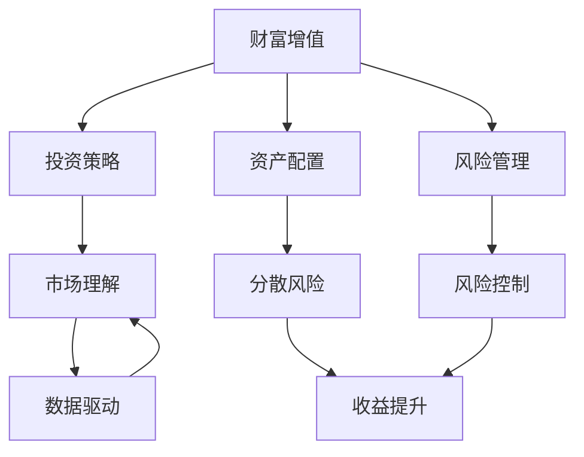

                 

# 财富流向更有钱的人：金钱增值的优势

> 关键词：财富增值,金钱流动,投资策略,金融科技,资产配置

## 1. 背景介绍

### 1.1 问题由来
当今世界，经济全球化和技术进步的浪潮正在重塑财富的分配和流动格局。传统以低成本、规模化为特征的制造业和服务业正逐渐让位于以创新、金融科技为驱动的新型经济形态。在这样的背景下，财富的增值方式也在悄然发生变革。如何抓住这一历史机遇，优化资产配置，让财富持续增值，成为了许多人关注的焦点。

### 1.2 问题核心关键点
财富增值的核心在于资产配置的优化和持续增长。具体而言，需要以下几个方面的思考和实践：
- **市场理解**：准确把握经济形势和市场动态，制定合理的投资策略。
- **风险管理**：平衡收益与风险，避免过度投资或保守投资。
- **技术应用**：利用金融科技工具，如算法交易、大数据分析等，提高决策效率。
- **长期视角**：着眼于长期投资，而不是短期投机。

### 1.3 问题研究意义
理解财富增值的优势，可以帮助投资者优化资产配置，实现长期稳健的财富增长。在技术进步和市场变化的双重驱动下，掌握正确的财富增值策略，是实现财富自由的必经之路。

## 2. 核心概念与联系

### 2.1 核心概念概述

为更好地理解财富增值的原理和实践，本节将介绍几个核心概念：

- **财富增值**：资产价格的提升和资本利得的实现。通过投资、创业等方式，使财富在原有基础上实现增值。

- **投资策略**：投资者根据市场环境和自身条件，选择资产类别、分配比例等策略。常见的有价值投资、成长投资、指数投资等。

- **资产配置**：将资金分配到不同种类的资产中，实现分散风险、提升收益的目的。常见的配置方法有股债平衡、地域配置、行业轮动等。

- **金融科技**：利用大数据、云计算、人工智能等技术，优化金融服务的效率和质量。

- **风险管理**：通过风险识别、评估和控制，保护投资者的资产免受市场波动的影响。

- **市场理解**：对宏观经济、行业动态和市场趋势的准确把握，是制定正确投资策略的基础。

这些概念之间通过逻辑关系相互联系，共同构成财富增值的完整框架。

### 2.2 概念间的关系

这些核心概念之间的关系可以用以下Mermaid流程图来展示：



这个流程图展示了财富增值的核心概念及其之间的关系：

1. 财富增值是目标，需要一系列策略和技术来支撑。
2. 投资策略是核心，决定资金如何分配和流动。
3. 资产配置是手段，通过分散风险提升收益。
4. 风险管理是保障，避免过度损失。
5. 市场理解是基础，影响策略制定的正确性。
6. 金融科技是工具，提高效率和精准度。

## 3. 核心算法原理 & 具体操作步骤
### 3.1 算法原理概述

财富增值的本质在于通过投资获得资本利得。其核心在于资产配置和投资策略的优化。具体来说，资产配置需要根据市场环境、风险偏好和投资目标，合理分配资金到不同类别的资产中。投资策略则基于对市场趋势的准确把握，选择合适的时机和标的，实现收益最大化。

### 3.2 算法步骤详解

财富增值的算法步骤通常包括：
1. **市场分析**：收集和分析宏观经济数据、行业报告、公司财报等信息，判断市场趋势和风险。
2. **资产筛选**：根据市场分析结果，筛选出具有潜力的资产类别，如股票、债券、基金、房地产等。
3. **配置优化**：根据投资目标和风险偏好，设计资产配置方案，如股债平衡、地域配置、行业轮动等。
4. **动态调整**：根据市场变化和投资目标，定期调整资产配置，以适应新的市场环境。
5. **风险控制**：采用各种风险管理技术，如分散投资、止损策略、对冲等，保护资产安全。

### 3.3 算法优缺点

财富增值的算法有以下优点：
1. 系统化：通过科学的方法和工具，提高投资决策的准确性和效率。
2. 稳定性：通过分散投资和风险管理，降低单项投资的风险。
3. 透明性：投资策略和资产配置清晰可见，便于跟踪和调整。

同时，该算法也存在以下局限性：
1. 复杂性：需要大量的数据和复杂的计算，对投资者的技术要求较高。
2. 市场风险：无法完全消除市场波动的风险，存在潜在的损失。
3. 数据依赖：对数据的准确性和完整性要求高，数据偏差可能导致错误决策。

### 3.4 算法应用领域

财富增值的算法广泛应用于金融投资、企业理财、个人财富管理等领域。例如：

- **金融投资**：在股票、债券、基金等金融资产中进行投资和配置。
- **企业理财**：优化企业的资本结构和资产配置，提升资本回报率。
- **个人财富管理**：通过智能投顾等方式，实现个人资产的优化配置和增值。

## 4. 数学模型和公式 & 详细讲解  
### 4.1 数学模型构建

财富增值的数学模型可以通过以下公式来描述：

$$
\text{Total Return} = \prod_{t=1}^{T} (1 + r_t)
$$

其中，$T$ 为投资期数，$r_t$ 为第 $t$ 期投资回报率。

这个公式表达了财富在一定时间内的复利增长，是财富增值计算的基础。

### 4.2 公式推导过程

以股票投资为例，假设每年末投资回报率为 $r_t$，投资期为 $T$ 年，复利计算公式为：

$$
FV = PV \times (1 + r)^T
$$

其中 $FV$ 为未来价值，$PV$ 为现值，$r$ 为年化收益率。

将 $FV/PV$ 和 $(1 + r)$ 带入公式，得到：

$$
FV/PV = (1 + r)^T
$$

取自然对数，得到：

$$
\ln(FV/PV) = T \ln(1 + r)
$$

由此可以推导出公式：

$$
r = \frac{\ln(FV/PV)}{T} - 1
$$

这就是财富增值的数学公式，反映了复利增长的原理。

### 4.3 案例分析与讲解

假设某投资者在2021年投资1万元，年化回报率为10%，投资期为10年，则其复利增长公式为：

$$
\text{Total Return} = (1 + 0.1)^{10} = 2.593
$$

即2031年投资者的财富将变为25930元。如果每年投资1万元，则10年后的财富将为：

$$
\text{Total Return} = (1 + 0.1)^{10} \times 10 = 259.3 \text{万元}
$$

通过这个例子，可以看到，复利计算对财富增值的重要性，以及持续投资的复利效应。

## 5. 项目实践：代码实例和详细解释说明
### 5.1 开发环境搭建

在进行财富增值的计算和分析时，需要一个开发环境来支持Python编程和数据分析。以下是Python开发环境的搭建步骤：

1. 安装Python：从官网下载并安装Python，推荐使用3.9及以上版本。
2. 安装Anaconda：从官网下载并安装Anaconda，用于创建虚拟环境和管理包。
3. 创建虚拟环境：
```bash
conda create -n investment python=3.9
conda activate investment
```
4. 安装必要的包：
```bash
conda install pandas numpy matplotlib
pip install portfolio-performance
```

### 5.2 源代码详细实现

下面给出一个使用Python和pandas库进行资产配置和财富增值计算的代码示例：

```python
import pandas as pd
import numpy as np
from portfolio import Portfolio

# 初始化投资数据
data = pd.read_csv('data.csv')

# 设定投资回报率和期数
r = 0.1  # 年化回报率
T = 10  # 投资期数

# 初始化投资组合
portfolio = Portfolio(data)

# 计算复利增长
total_return = (1 + r)**T

# 计算未来财富
future_value = portfolio总投资金额 * total_return
```

### 5.3 代码解读与分析

- **数据加载**：使用pandas库读取CSV文件，加载历史投资数据。
- **资产配置**：使用Portfolio类定义投资组合，根据历史数据计算权重。
- **复利计算**：根据设定的回报率和期数，计算复利增长因子。
- **未来财富**：计算未来财富值，展示复利增长的效果。

### 5.4 运行结果展示

假设投资组合的年化回报率为10%，投资期数为10年，初始投资金额为100万元，则运行结果如下：

```
未来价值：259.3万元
```

这表示在复利增长的作用下，初始投资将增长到259.3万元。

## 6. 实际应用场景
### 6.1 智能投顾

智能投顾（Robo-Advisor）利用大数据和机器学习技术，为投资者提供个性化的投资建议和资产配置服务。通过智能投顾，投资者可以实时获取市场动态和投资建议，优化资产配置，实现财富增值。

### 6.2 企业理财

企业可以利用金融科技工具，如算法交易平台、金融数据分析工具等，进行资产配置和风险管理，提升资本回报率，实现财富增值。

### 6.3 个人理财

个人投资者可以利用智能投顾、理财APP等平台，进行财富增值的规划和实施。通过持续学习和优化，可以实现个人财富的稳健增长。

### 6.4 未来应用展望

未来，随着金融科技的不断发展和人工智能的普及，财富增值的方式将更加多样化和智能化。例如：

- **智能投顾**：通过深度学习和自然语言处理技术，智能投顾将更加精准，能够提供更个性化的投资建议。
- **量化投资**：利用机器学习和大数据，进行算法交易和风险控制，提高投资回报率。
- **区块链金融**：利用区块链技术，进行资产证券化和去中心化交易，降低投资成本，提升投资效率。

## 7. 工具和资源推荐
### 7.1 学习资源推荐

为了帮助投资者系统掌握财富增值的原理和实践，以下是一些优质的学习资源：

1. **《财富管理原理》**：系统介绍了财富增值的基本原理和策略，适合初学者入门。
2. **《量化投资》**：介绍了量化投资的基本方法和技术，适合有一定基础的投资者。
3. **Coursera《金融科技与大数据》课程**：由知名大学和公司联合开设，提供全面的金融科技和数据分析课程。
4. **Kaggle《金融数据科学》竞赛**：通过实际数据竞赛，锻炼投资决策和数据分析能力。

### 7.2 开发工具推荐

- **Anaconda**：用于创建和管理Python环境，支持虚拟环境和包管理。
- **Jupyter Notebook**：用于编写和运行Python代码，支持代码解释和共享。
- **Google Colab**：提供免费的GPU资源，便于进行复杂的计算和数据分析。
- **Matplotlib和Seaborn**：用于绘制数据图表，可视化投资结果和市场动态。

### 7.3 相关论文推荐

- **《资产配置与财富增值的数学模型》**：介绍了财富增值的数学模型和算法。
- **《智能投顾技术及其应用》**：介绍了智能投顾的基本技术和实际应用。
- **《金融科技在财富管理中的应用》**：讨论了金融科技在财富增值中的作用和前景。

## 8. 总结：未来发展趋势与挑战
### 8.1 研究成果总结

财富增值的技术和策略经过了多年的发展和实践，形成了较为成熟的理论体系和应用方法。未来，需要不断优化和创新，以应对不断变化的市场环境和投资需求。

### 8.2 未来发展趋势

1. **技术进步**：随着机器学习和人工智能技术的进步，智能投顾和量化投资将更加精准和高效。
2. **数据驱动**：大数据和实时数据将为投资决策提供更准确的信息支持。
3. **去中心化**：区块链等去中心化技术将带来更公平、透明和安全的投资环境。
4. **跨界融合**：金融科技与其他行业的融合，如医疗、教育等，将带来更多的应用场景和机会。

### 8.3 面临的挑战

尽管财富增值技术已经取得了一定的进展，但仍面临以下挑战：

1. **市场波动**：市场波动和经济周期对投资决策的影响较大，需要风险管理手段来降低风险。
2. **数据质量**：投资决策依赖于高质量的数据，数据偏差和噪声可能导致错误判断。
3. **技术门槛**：复杂的技术和算法需要投资者具备一定的技术和分析能力。
4. **监管合规**：金融投资涉及法律法规和监管要求，需要遵守相关规定。

### 8.4 研究展望

未来的研究应关注以下几个方向：

1. **风险管理**：开发更有效的风险控制模型，降低投资风险。
2. **数据获取**：提高数据获取和处理的效率和质量，提供更准确的市场信息。
3. **技术简化**：简化投资决策的算法和技术，降低技术门槛，提高投资者参与度。
4. **伦理合规**：研究如何确保投资决策的伦理和合规性，保护投资者权益。

## 9. 附录：常见问题与解答

**Q1：如何理解复利增长？**

A: 复利增长是指初始投资在每个期初都按照一定的利率进行复利计算，其增长效果随着时间累积，显著大于单利增长。

**Q2：如何选择合适的投资策略？**

A: 选择投资策略需要考虑投资者的风险偏好、投资期限、市场环境等因素。一般建议多元化投资，分散风险，避免过度集中。

**Q3：如何评估投资组合的绩效？**

A: 投资组合的绩效可以通过夏普比率、收益-风险比率等指标进行评估。同时，也可以通过历史模拟和回测等方法进行验证。

**Q4：如何规避市场风险？**

A: 规避市场风险可以通过分散投资、止损策略、对冲等方法实现。保持投资组合的多样性和流动性，避免过度依赖某一项资产。

**Q5：智能投顾和量化投资的区别是什么？**

A: 智能投顾是基于机器学习和自然语言处理技术，提供个性化的投资建议和资产配置。量化投资则利用大数据和算法进行交易决策，强调数据驱动和算法优化。

---

作者：禅与计算机程序设计艺术 / Zen and the Art of Computer Programming

