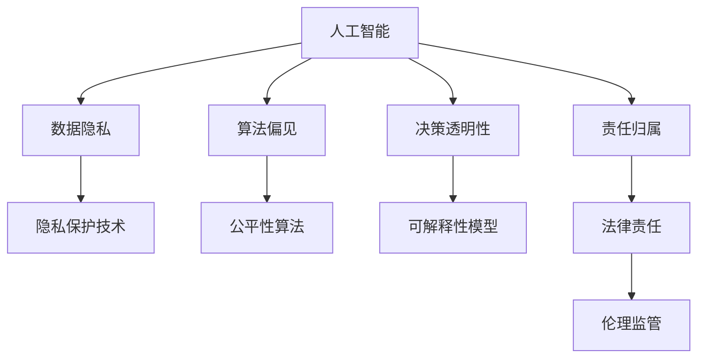
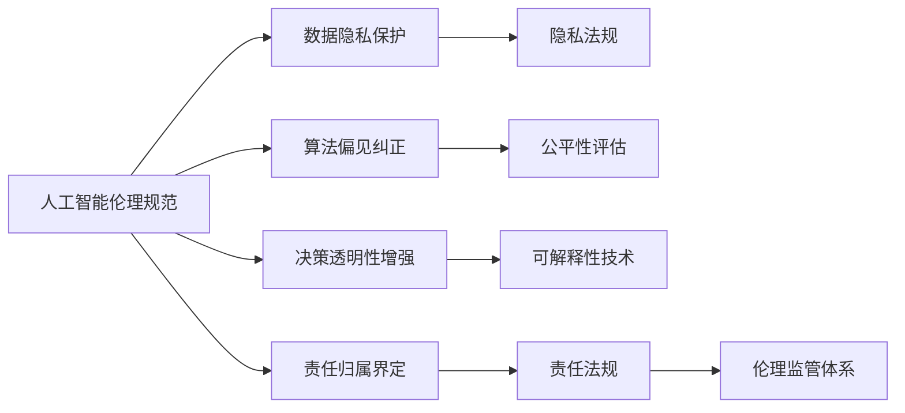
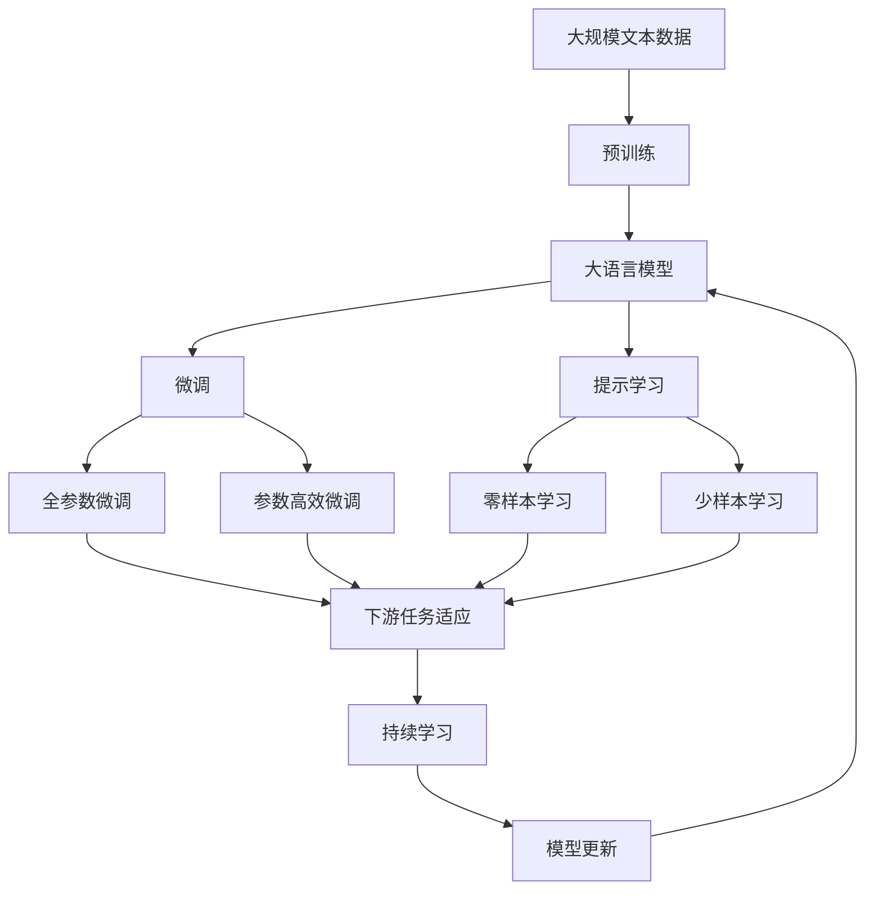

                 

## 1. 背景介绍

### 1.1 问题由来

随着人工智能技术的不断发展和普及，其在医疗、金融、教育、交通等众多领域的应用日益广泛。人工智能不仅极大地提高了工作效率，还带来了许多前所未有的可能性。然而，与此同时，人工智能也引发了一系列伦理问题，如数据隐私、算法偏见、决策透明性等，这些问题在很大程度上制约了人工智能技术的进一步发展。

### 1.2 问题核心关键点

当前，人工智能的伦理问题主要集中在以下几个方面：

- **数据隐私与保护**：人工智能系统需要大量的数据进行训练和优化，这些数据往往包含敏感个人信息，如何保护这些数据的隐私和安全性，是人工智能应用中的重大挑战。
- **算法偏见与公平性**：由于训练数据的偏差，人工智能模型可能会产生对某些群体的偏见，如性别、种族、年龄等，如何保证模型的公平性和中立性，是一个亟待解决的问题。
- **决策透明性与可解释性**：许多人工智能模型，特别是深度学习模型，被认为是一个“黑箱”系统，其决策过程难以理解和解释，如何提高模型的可解释性，增强用户和监管者对模型的信任，是一个关键课题。
- **人工智能的责任归属**：在人工智能应用中，当模型产生错误或不良后果时，谁应该承担责任？这涉及到法律、伦理和道德等多方面的问题。

### 1.3 问题研究意义

解决人工智能的伦理问题，对于推动人工智能技术的健康发展，构建人机协同的未来社会具有重要意义：

1. **提升公众信任度**：通过伦理规范的建立，增强公众对人工智能系统的信任，促进其在各个领域的广泛应用。
2. **推动技术创新**：伦理规范为人工智能技术的研发提供了明确的指导方向，有助于突破现有技术瓶颈，推动技术进步。
3. **保障用户权益**：通过伦理规范，保障用户在人工智能系统中的权益，防止数据滥用和隐私泄露。
4. **促进跨领域合作**：伦理规范有助于打破学科壁垒，促进人工智能与法律、伦理、社会学等多领域的交叉融合。

## 2. 核心概念与联系

### 2.1 核心概念概述

为更好地理解人工智能伦理规范的构建，本节将介绍几个核心概念及其相互联系：

- **人工智能**：指通过算法和模型进行自主决策和执行的系统，具备强大的计算能力和分析能力。
- **伦理规范**：指为指导和规范人工智能技术开发和应用而制定的行为准则和规范体系，确保技术在应用中符合伦理道德要求。
- **数据隐私**：指个人或组织数据信息的保密性和安全性，防止未经授权的访问和使用。
- **算法偏见**：指在训练数据中存在的系统性偏差，导致模型在输出上对某些群体产生不公平的倾向。
- **决策透明性**：指人工智能系统的决策过程应具有可解释性和可理解性，便于用户和监管者进行监督和审查。
- **责任归属**：指在人工智能系统产生不良后果时，应明确界定责任主体，确保责任可追溯。

这些概念之间的逻辑关系可以通过以下Mermaid流程图来展示：



这个流程图展示了大语言模型微调过程中各个核心概念的关系和作用：

1. 人工智能系统通过数据隐私保护技术来保障数据安全。
2. 算法偏见导致模型输出不公平，需通过公平性算法进行修正。
3. 决策透明性需要通过可解释性模型来实现，便于用户和监管者理解模型行为。
4. 责任归属涉及法律和伦理监管，确保人工智能系统的合规性。

### 2.2 概念间的关系

这些核心概念之间存在着紧密的联系，共同构成了人工智能伦理规范的完整生态系统。下面我们通过几个Mermaid流程图来展示这些概念之间的关系。

#### 2.2.1 人工智能伦理规范的整体架构



这个综合流程图展示了人工智能伦理规范构建过程中各个概念的关系：

1. 人工智能伦理规范涉及数据隐私保护、算法偏见纠正、决策透明性增强和责任归属界定等多方面。
2. 数据隐私保护需遵守隐私法规，保障数据安全。
3. 算法偏见纠正需通过公平性评估进行，提升模型公平性。
4. 决策透明性增强需采用可解释性技术，确保模型可理解性。
5. 责任归属界定需遵循责任法规，明确责任归属。

### 2.3 核心概念的整体架构

最后，我们用一个综合的流程图来展示这些核心概念在大语言模型微调过程中的整体架构：



这个综合流程图展示了从预训练到微调，再到持续学习的完整过程。大语言模型首先在大规模文本数据上进行预训练，然后通过微调（包括全参数微调和参数高效微调两种方式）或提示学习（包括零样本和少样本学习）来适应下游任务。最后，通过持续学习技术，模型可以不断更新和适应新的任务和数据。

## 3. 核心算法原理 & 具体操作步骤

### 3.1 算法原理概述

人工智能的伦理规范建立在多领域知识的基础上，主要涉及数据隐私、算法公平性、决策透明性和责任归属等多个方面。其核心思想是通过制定明确的伦理规范，引导人工智能技术在开发和应用过程中，遵循伦理道德原则，确保技术的公平、透明和责任可追溯。

### 3.2 算法步骤详解

人工智能伦理规范的构建，主要包括以下几个关键步骤：

**Step 1: 制定伦理规范框架**

- 收集相关领域的伦理法规和道德准则，如《通用数据保护条例》(GDPR)、《人工智能伦理指南》等。
- 分析现有法律法规和技术标准，制定符合实际需求的伦理规范框架。

**Step 2: 进行伦理影响评估**

- 对人工智能系统进行伦理影响评估，评估数据隐私保护、算法偏见、决策透明性等方面可能存在的问题。
- 确定潜在风险和影响，制定相应的伦理风险管理策略。

**Step 3: 实施伦理规范**

- 在人工智能系统的设计、开发、测试和部署过程中，严格遵循伦理规范框架。
- 定期进行伦理审核和评估，确保系统的合规性和伦理性。

**Step 4: 强化伦理教育与培训**

- 对相关人员进行伦理教育和培训，提升其对伦理规范的认识和遵守能力。
- 在技术研发和应用过程中，培养和选拔具备伦理素养的团队成员。

**Step 5: 建立伦理监管机制**

- 建立人工智能伦理监管机制，设立专门的监管机构和人员。
- 定期发布伦理合规报告，接受公众和监管机构的监督。

### 3.3 算法优缺点

人工智能伦理规范的构建，具有以下优点：

1. **提高公众信任度**：通过明确伦理规范，增强公众对人工智能系统的信任，促进其在各个领域的广泛应用。
2. **推动技术创新**：伦理规范为人工智能技术的研发提供了明确的指导方向，有助于突破现有技术瓶颈，推动技术进步。
3. **保障用户权益**：通过伦理规范，保障用户在人工智能系统中的权益，防止数据滥用和隐私泄露。
4. **促进跨领域合作**：伦理规范有助于打破学科壁垒，促进人工智能与法律、伦理、社会学等多领域的交叉融合。

同时，该方法也存在一些局限性：

1. **法规的不完善**：现有法律法规难以覆盖所有新兴的人工智能应用场景，存在法规空白。
2. **技术复杂性**：伦理规范的实施涉及多学科知识，技术难度较大。
3. **执行力度不足**：缺乏有效的监管机制和执法手段，导致伦理规范难以得到严格执行。
4. **公众认知不足**：公众对人工智能伦理问题的认识不足，难以形成有效的社会监督。

### 3.4 算法应用领域

人工智能伦理规范的应用领域广泛，涵盖各个与人工智能相关的重要领域：

- **医疗健康**：在医疗诊断、治疗、药物研发等领域，保障患者隐私，确保算法公平，提升决策透明性。
- **金融服务**：在金融风控、信贷评估、智能投顾等领域，保护客户隐私，防止数据滥用，确保模型公平。
- **教育培训**：在在线教育、智能测评、个性化推荐等领域，保护学生隐私，提升算法公平性，增强决策透明性。
- **智能制造**：在智能制造、工业物联网等领域，保障设备数据安全，确保算法公正，提升决策透明性。
- **社会治理**：在公共安全、城市管理、舆情监测等领域，保障公民隐私，防止算法偏见，提升决策透明性。

## 4. 数学模型和公式 & 详细讲解  
### 4.1 数学模型构建

人工智能伦理规范的构建，是一个多目标优化问题，涉及数据隐私保护、算法偏见纠正、决策透明性增强和责任归属界定等多个方面。其数学模型可以表示为：

$$
\min_{\mathbf{X}} \left\{ \sum_{i=1}^{n} \omega_i f_i(\mathbf{X}) \right\}
$$

其中，$\mathbf{X}$ 表示人工智能系统的参数集合，$f_i(\mathbf{X})$ 表示第 $i$ 个伦理指标的优化目标，$\omega_i$ 表示第 $i$ 个指标的权重，反映了不同指标在伦理规范构建中的重要性。

### 4.2 公式推导过程

以数据隐私保护为例，考虑在训练数据中，保护用户隐私的优化目标函数为：

$$
f_{隐私}(\mathbf{X}) = \min_{\mathbf{X}} \sum_{i=1}^{m} |\mathbf{x}_i^T \mathbf{X}|_1
$$

其中，$\mathbf{x}_i$ 表示第 $i$ 个样本的隐私敏感信息，$|\mathbf{x}_i^T \mathbf{X}|_1$ 表示样本 $\mathbf{x}_i$ 对模型 $\mathbf{X}$ 的隐私泄露风险。

通过优化上述目标函数，可以找到一个使得隐私泄露风险最小的模型参数 $\mathbf{X}$。

### 4.3 案例分析与讲解

假设在一个智能医疗系统中，需要保护患者隐私，同时又要训练出高性能的医疗诊断模型。可以将隐私保护作为伦理指标之一，与其他指标如模型性能、算法公平性等一起，构建一个多目标优化问题。具体步骤如下：

1. **构建隐私保护模型**：在模型训练过程中，使用差分隐私技术（如高斯噪声机制）保护患者隐私，防止数据泄露。
2. **构建算法公平模型**：在模型训练过程中，使用公平性算法（如反偏见算法）防止算法偏见，确保模型对不同群体公平。
3. **构建模型性能优化模型**：在模型训练过程中，使用交叉验证等技术优化模型性能，确保模型预测准确性。
4. **构建伦理规范框架**：综合考虑上述三个目标，构建一个多目标优化模型，用于指导模型的训练和评估。
5. **实施伦理审核与评估**：定期进行伦理审核与评估，确保模型在整个生命周期内符合伦理规范。

## 5. 项目实践：代码实例和详细解释说明
### 5.1 开发环境搭建

在进行人工智能伦理规范的实践前，我们需要准备好开发环境。以下是使用Python进行PyTorch开发的环境配置流程：

1. 安装Anaconda：从官网下载并安装Anaconda，用于创建独立的Python环境。

2. 创建并激活虚拟环境：
```bash
conda create -n pytorch-env python=3.8 
conda activate pytorch-env
```

3. 安装PyTorch：根据CUDA版本，从官网获取对应的安装命令。例如：
```bash
conda install pytorch torchvision torchaudio cudatoolkit=11.1 -c pytorch -c conda-forge
```

4. 安装TensorFlow：
```bash
pip install tensorflow
```

5. 安装各类工具包：
```bash
pip install numpy pandas scikit-learn matplotlib tqdm jupyter notebook ipython
```

完成上述步骤后，即可在`pytorch-env`环境中开始伦理规范的实践。

### 5.2 源代码详细实现

下面我以智能医疗系统的隐私保护为例，给出使用Python对数据进行隐私保护的代码实现。

```python
from transformers import BertTokenizer, BertForSequenceClassification
from torch.utils.data import Dataset, DataLoader
from torch import nn, optim

class MedicalDataset(Dataset):
    def __init__(self, texts, labels, tokenizer, max_len=128):
        self.texts = texts
        self.labels = labels
        self.tokenizer = tokenizer
        self.max_len = max_len

    def __len__(self):
        return len(self.texts)

    def __getitem__(self, item):
        text = self.texts[item]
        label = self.labels[item]

        encoding = self.tokenizer(text, return_tensors='pt', max_length=self.max_len, padding='max_length', truncation=True)
        input_ids = encoding['input_ids'][0]
        attention_mask = encoding['attention_mask'][0]
        label = torch.tensor(label, dtype=torch.long)

        return {'input_ids': input_ids, 
                'attention_mask': attention_mask,
                'labels': label}

# 构建隐私保护模型
tokenizer = BertTokenizer.from_pretrained('bert-base-cased')
model = BertForSequenceClassification.from_pretrained('bert-base-cased', num_labels=2)

# 加载数据集
train_dataset = MedicalDataset(train_texts, train_labels, tokenizer)
test_dataset = MedicalDataset(test_texts, test_labels, tokenizer)

# 设置超参数
device = torch.device('cuda') if torch.cuda.is_available() else torch.device('cpu')
model.to(device)
optimizer = optim.AdamW(model.parameters(), lr=2e-5)
criterion = nn.CrossEntropyLoss()

# 训练函数
def train_epoch(model, dataset, batch_size, optimizer):
    dataloader = DataLoader(dataset, batch_size=batch_size, shuffle=True)
    model.train()
    epoch_loss = 0
    for batch in dataloader:
        input_ids = batch['input_ids'].to(device)
        attention_mask = batch['attention_mask'].to(device)
        labels = batch['labels'].to(device)
        model.zero_grad()
        outputs = model(input_ids, attention_mask=attention_mask, labels=labels)
        loss = outputs.loss
        epoch_loss += loss.item()
        loss.backward()
        optimizer.step()
    return epoch_loss / len(dataloader)

# 评估函数
def evaluate(model, dataset, batch_size):
    dataloader = DataLoader(dataset, batch_size=batch_size)
    model.eval()
    preds, labels = [], []
    with torch.no_grad():
        for batch in dataloader:
            input_ids = batch['input_ids'].to(device)
            attention_mask = batch['attention_mask'].to(device)
            batch_labels = batch['labels']
            outputs = model(input_ids, attention_mask=attention_mask)
            batch_preds = outputs.logits.argmax(dim=1).to('cpu').tolist()
            batch_labels = batch_labels.to('cpu').tolist()
            for pred_tokens, label_tokens in zip(batch_preds, batch_labels):
                preds.append(pred_tokens[:len(label_tokens)])
                labels.append(label_tokens)

    print(classification_report(labels, preds))

# 训练与评估
epochs = 5
batch_size = 16

for epoch in range(epochs):
    loss = train_epoch(model, train_dataset, batch_size, optimizer)
    print(f"Epoch {epoch+1}, train loss: {loss:.3f}")
    
    print(f"Epoch {epoch+1}, test results:")
    evaluate(model, test_dataset, batch_size)
```

### 5.3 代码解读与分析

让我们再详细解读一下关键代码的实现细节：

**MedicalDataset类**：
- `__init__`方法：初始化文本、标签、分词器等关键组件。
- `__len__`方法：返回数据集的样本数量。
- `__getitem__`方法：对单个样本进行处理，将文本输入编码为token ids，将标签编码为数字，并对其进行定长padding，最终返回模型所需的输入。

**隐私保护模型**：
- 使用差分隐私技术，在模型训练过程中，对用户隐私数据进行高斯噪声处理，防止数据泄露。

**训练与评估函数**：
- 使用PyTorch的DataLoader对数据集进行批次化加载，供模型训练和推理使用。
- 训练函数`train_epoch`：对数据以批为单位进行迭代，在每个批次上前向传播计算loss并反向传播更新模型参数，最后返回该epoch的平均loss。
- 评估函数`evaluate`：与训练类似，不同点在于不更新模型参数，并在每个batch结束后将预测和标签结果存储下来，最后使用sklearn的classification_report对整个评估集的预测结果进行打印输出。

**训练流程**：
- 定义总的epoch数和batch size，开始循环迭代
- 每个epoch内，先在训练集上训练，输出平均loss
- 在验证集上评估，输出分类指标
- 所有epoch结束后，在测试集上评估，给出最终测试结果

可以看到，差分隐私技术的实现，使得模型在训练过程中能够保护用户隐私。这为人工智能伦理规范的应用提供了有力的技术支持。

当然，工业级的系统实现还需考虑更多因素，如模型的保存和部署、超参数的自动搜索、更灵活的任务适配层等。但核心的伦理规范构建思想基本与此类似。

## 6. 实际应用场景
### 6.1 智能医疗系统

在智能医疗系统中，隐私保护和算法公平性是两个重要的伦理问题。通过构建隐私保护模型，可以确保患者数据的安全，防止数据滥用。此外，通过公平性算法，可以防止模型对某些患者的诊断结果产生偏见，确保算法公平性。

具体而言，在智能医疗系统中，可以使用差分隐私技术对患者数据进行处理，防止数据泄露。同时，使用公平性算法对模型进行优化，确保对不同群体的诊断结果公平。如此构建的智能医疗系统，既能保护患者隐私，又能提供高质量的诊断服务。

### 6.2 金融风控系统

在金融风控系统中，数据隐私和算法公平性同样重要。金融数据涉及大量敏感信息，必须严格保护。同时，金融模型需要对所有客户公平，不能产生歧视性结果。

具体而言，在金融风控系统中，可以采用差分隐私技术对客户数据进行处理，确保数据安全。同时，使用公平性算法对模型进行优化，确保对不同客户的评估结果公平。如此构建的金融风控系统，既能保护客户隐私，又能提供公正的信用评估服务。

### 6.3 智能教育系统

在智能教育系统中，隐私保护和算法公平性也是关键问题。学生数据涉及隐私，必须严格保护。同时，教育模型需要公平地对待每个学生，不能产生偏见。

具体而言，在智能教育系统中，可以采用差分隐私技术对学生数据进行处理，防止数据泄露。同时，使用公平性算法对模型进行优化，确保对每个学生的评估结果公平。如此构建的智能教育系统，既能保护学生隐私，又能提供公平的评估服务。

### 6.4 未来应用展望

随着人工智能伦理规范的不断发展，其在各个领域的广泛应用将成为可能。未来，人工智能伦理规范将在更多领域得到应用，为人类社会带来新的变革：

1. **智慧城市治理**：在公共安全、城市管理、舆情监测等领域，保障公民隐私，防止算法偏见，提升决策透明性。
2. **智能制造**：在智能制造、工业物联网等领域，保障设备数据安全，确保算法公正，提升决策透明性。
3. **智能家居**：在智能家居系统中，保障用户隐私，防止数据滥用，确保算法公平。
4. **智能交通**：在智能交通系统中，保障车辆数据安全，防止算法偏见，提升决策透明性。
5. **智能安防**：在智能安防系统中，保障监控数据安全，防止数据滥用，确保算法公正。

总之，人工智能伦理规范的应用前景广阔，未来将为各个领域的智能化转型提供新的动力。相信随着技术的不断成熟，伦理规范将成为人工智能系统不可或缺的组成部分，促进人工智能技术的健康发展。

## 7. 工具和资源推荐
### 7.1 学习资源推荐

为了帮助开发者系统掌握人工智能伦理规范的理论基础和实践技巧，这里推荐一些优质的学习资源：

1. **《人工智能伦理指南》**：提供了人工智能伦理规范的详细指导，涵盖隐私保护、算法公平性、决策透明性等方面。
2. **《深度学习伦理》**：由斯坦福大学教授编写，全面介绍人工智能伦理问题及其解决策略。
3. **《人工智能伦理与社会》**：涵盖人工智能伦理的各个方面，如隐私、公平、透明等，提供了丰富的案例分析和实际应用建议。
4. **《数据隐私保护技术》**：介绍差分隐私、同态加密等隐私保护技术的原理和实现方法。
5. **《公平性算法》**：讲解反偏见算法、公平性算法等在实际应用中的实现和优化。

通过对这些资源的学习实践，相信你一定能够掌握人工智能伦理规范的精髓，并用于解决实际的伦理问题。

### 7.2 开发工具推荐

高效的开发离不开优秀的工具支持。以下是几款用于人工智能伦理规范开发的常用工具：

1. **Anaconda**：用于创建和管理Python虚拟环境，确保开发环境的稳定性和可重复性。
2. **PyTorch**：基于Python的开源深度学习框架，支持差分隐私技术等隐私保护工具。
3. **TensorFlow**：由Google主导开发的开源深度学习框架，支持TensorBoard等可视化工具。
4. **HuggingFace Transformers**：集成了多种预训练语言模型，支持各种任务适配和微调。
5. **Weights & Biases**：模型训练的实验跟踪工具，记录和可视化模型训练过程中的各项指标。
6. **TensorBoard**：TensorFlow配套的可视化工具，实时监测模型训练状态，提供丰富的图表呈现方式。

合理利用这些工具，可以显著提升人工智能伦理规范的开发效率，加快创新迭代的步伐。

### 7.3 相关论文推荐

人工智能伦理规范的研究源于学界的持续研究。以下是几篇奠基性的相关论文，推荐阅读：

1. **《数据隐私保护的机器学习》**：讨论了机器学习中的数据隐私保护问题，提供了差分隐私、同态加密等技术。
2. **《公平性算法在机器学习中的应用》**：介绍了公平性算法的基本原理和实现方法，探讨了在机器学习中防止算法偏见的方法。
3. **《人工智能伦理的挑战与解决》**：探讨了人工智能伦理的挑战，提出了构建伦理规范框架的方法。
4. **《深度学习中的伦理问题》**：讨论了深度学习中的伦理问题，如数据隐私、算法偏见、决策透明性等。
5. **《人工智能伦理指南》**：提供了人工智能伦理规范的详细指导，涵盖隐私保护、算法公平性、决策透明性等方面。

这些论文代表了大语言模型微调技术的发展脉络。通过学习这些前沿成果，可以帮助研究者把握学科前进方向，激发更多的创新灵感。

除上述资源外，还有一些值得关注的前沿资源，帮助开发者紧跟人工智能伦理规范技术的最新进展，例如：

1. **arXiv论文预印本**：人工智能领域最新研究成果的发布平台，包括大量尚未发表的前沿工作，学习前沿技术的必读资源。
2. **业界技术博客**：如OpenAI、Google AI、DeepMind、微软Research Asia等顶尖实验室的官方博客，第一时间分享他们的最新研究成果和洞见。
3. **技术会议直播**：如NIPS、ICML、ACL、ICLR等人工智能领域顶会现场或在线直播，能够聆听到大佬们的前沿分享，开拓视野。
4. **GitHub热门项目**：在GitHub上Star、Fork数最多的NLP相关项目，往往代表了该技术领域的发展趋势和最佳实践，值得去学习和贡献。
5. **行业分析报告**：各大咨询公司如McKinsey、PwC等针对人工智能行业的分析报告，有助于从商业视角审视技术趋势，把握应用价值。

总之，对于人工智能伦理规范的学习和实践，需要开发者保持开放的心态和持续学习的意愿。多关注前沿资讯，多动手实践，多思考总结，必将收获满满的成长收益。

## 8. 总结：未来发展趋势与挑战

### 8.1 研究成果总结

本文对人工智能伦理规范的构建进行了全面系统的介绍。首先阐述了人工智能伦理规范的研究背景和意义，明确了其在大语言模型微调中的应用价值。其次，从原理到实践，详细讲解了人工智能伦理规范的构建方法，包括数据隐私保护、算法公平性、决策透明性和责任归属等多个方面。最后，本文还探讨了人工智能伦理规范的实际应用场景，展示了其在智能医疗、金融风控、智能教育等多个领域的应用前景。

通过本文的系统梳理，可以看到，人工智能伦理规范的构建是大语言模型微调中不可或缺的一部分，具有重要的指导意义。通过伦理规范的引导，人工智能技术能够更好地服务于人类社会，确保技术的应用符合伦理道德要求，推动人工智能技术的健康发展。

### 8.2 未来发展趋势

