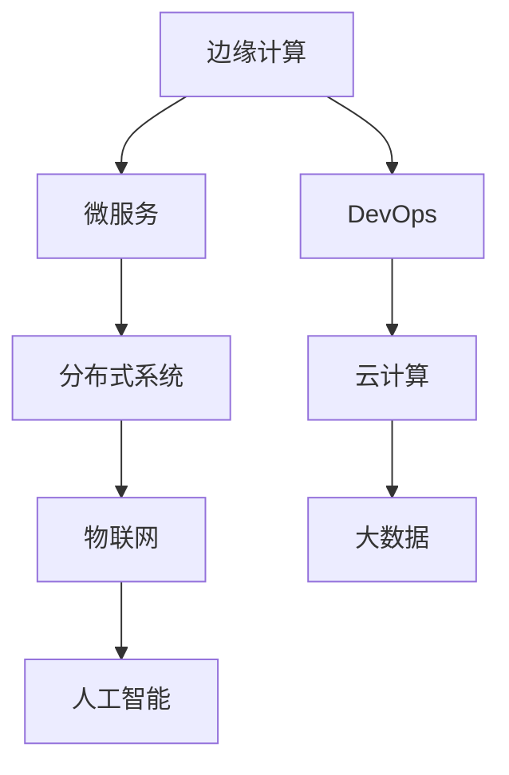
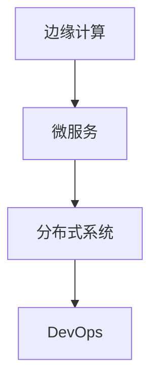
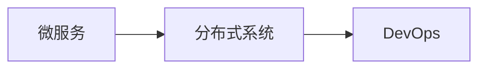
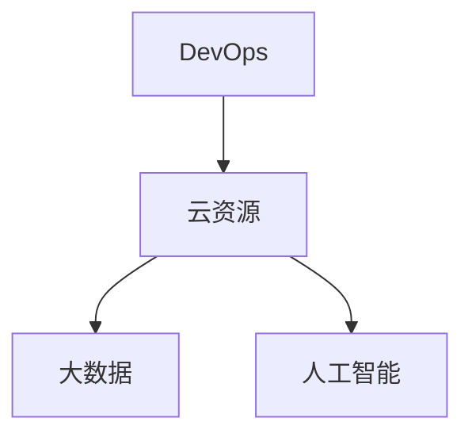
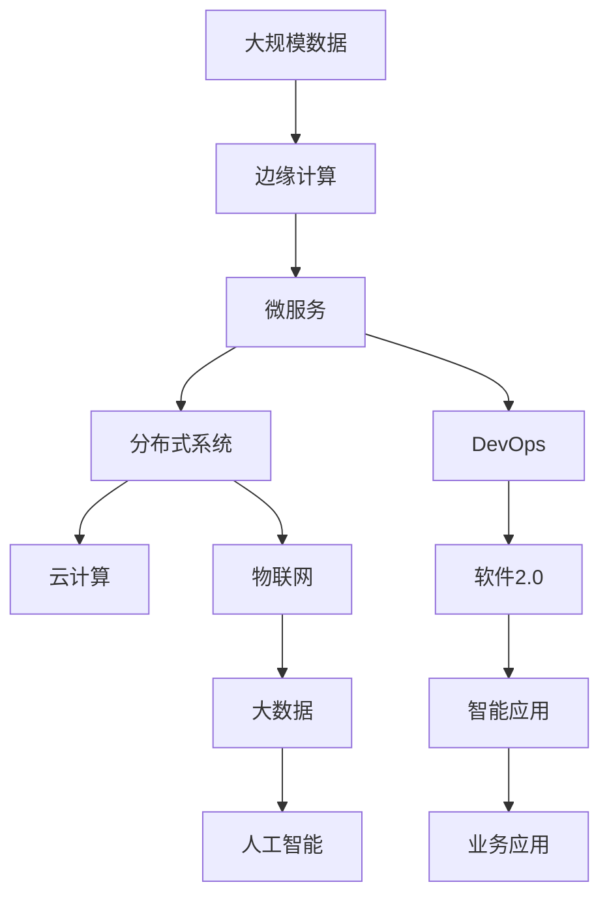

                 

# 边缘计算遇上软件2.0，智能将无处不在

> 关键词：
- 边缘计算
- 软件2.0
- 智能应用
- 云计算
- 物联网
- 分布式系统
- 微服务
- DevOps
- 人工智能

## 1. 背景介绍

### 1.1 问题由来

随着数字化和智能化进程的加速，人们对于实时性、可靠性和数据安全的需求日益增长。传统的中心化计算模式，已经无法满足这些需求。边缘计算（Edge Computing）作为一种分布式计算模式，近些年迅速崛起。与传统的中心化计算模式不同，边缘计算将计算和存储资源下沉到数据产生地，减少了数据传输延迟，提高了计算效率，保障了数据隐私和安全。

与此同时，软件2.0的兴起也为边缘计算的发展注入了新的活力。软件2.0（Software 2.0），也称为智能2.0（Intelligent 2.0），是一种基于人工智能（AI）、大数据（Big Data）、云计算（Cloud Computing）、物联网（IoT）等技术的智能软件系统。软件2.0的目标是构建高度自适应、高度智能的软件系统，能够自动调整自身行为以适应环境变化，实现更高效、更精准的业务操作。

在边缘计算与软件2.0的双重推动下，智能应用正在逐步渗透到各个行业领域，为企业带来了巨大的商业价值和竞争优势。然而，这种融合也带来了诸多技术挑战和实践难题，亟需系统性的解决方案。

### 1.2 问题核心关键点

边缘计算与软件2.0的融合，从根本上改变了传统计算和软件开发的模式。其核心关键点包括：

1. **计算资源下沉**：将计算和存储资源从中心服务器下沉到边缘设备（如IoT设备、手机、车载终端等），减少数据传输延迟，提高计算效率。
2. **智能应用落地**：通过软件2.0技术，实现边缘设备的自适应、自学习和自优化，提升应用智能化水平。
3. **数据隐私保护**：在边缘设备上进行数据处理和分析，减少了数据传输，保障了数据隐私和安全。
4. **边缘计算与云端的协作**：边缘计算与云端协同工作，形成分布式计算架构，提升整体计算能力。
5. **微服务架构的引入**：边缘计算系统采用微服务架构，提升了系统的可扩展性和灵活性。
6. **DevOps的实践**：通过DevOps工具链，实现边缘计算系统的自动化部署、监控和维护。

这些关键点共同构成了边缘计算与软件2.0融合的技术框架，为构建智能应用提供了坚实的基础。

### 1.3 问题研究意义

边缘计算与软件2.0的融合，对于推动智能化技术在各个行业的应用具有重要意义：

1. **提高响应速度**：通过将计算资源下沉到边缘设备，减少了数据传输延迟，极大提升了应用的响应速度，满足了用户对实时性的高要求。
2. **降低带宽成本**：数据在边缘设备上进行处理，减少了数据传输量和带宽成本，有助于降低整体运营成本。
3. **保障数据安全**：数据在边缘设备上处理，减少了数据在云端存储和传输的风险，保障了数据隐私和安全。
4. **提升应用智能化**：通过软件2.0技术，实现边缘设备的自适应、自学习和自优化，提升应用智能化水平。
5. **增强系统可扩展性**：采用微服务架构，增强了系统的可扩展性和灵活性，支持多样化的应用场景。
6. **优化资源利用**：通过DevOps实践，实现了边缘计算系统的自动化部署、监控和维护，优化了资源利用效率。

边缘计算与软件2.0的融合，为智能应用的构建提供了全新的思路和路径，对于提升各行业的数字化和智能化水平，具有重要价值。

## 2. 核心概念与联系

### 2.1 核心概念概述

为了更好地理解边缘计算与软件2.0的融合，本节将介绍几个密切相关的核心概念：

- **边缘计算（Edge Computing）**：一种分布式计算模式，将计算和存储资源下沉到数据产生地，减少数据传输延迟，提高计算效率，保障数据隐私和安全。
- **软件2.0（Software 2.0）**：基于人工智能（AI）、大数据（Big Data）、云计算（Cloud Computing）、物联网（IoT）等技术的智能软件系统，目标是构建高度自适应、高度智能的软件系统。
- **微服务（Microservices）**：一种软件架构风格，将应用程序拆分成一组小的、独立的、可扩展的服务，通过RESTful API进行通信。
- **DevOps**：一种软件开发和运维模式，强调协作、自动化、持续交付和持续集成，提升开发效率和系统稳定性。
- **分布式系统（Distributed Systems）**：由多个独立节点组成的网络，通过网络协议实现节点之间的通信和协作，提升系统的可靠性和扩展性。

这些核心概念之间的逻辑关系可以通过以下Mermaid流程图来展示：



这个流程图展示了边缘计算与软件2.0融合的核心概念及其之间的关系：

1. 边缘计算通过将计算资源下沉到边缘设备，减少了数据传输延迟，提升了应用响应速度。
2. 微服务架构通过将应用拆分成小服务，提升了系统的可扩展性和灵活性，便于与边缘计算协同工作。
3. DevOps实践通过自动化部署和监控，提升了边缘计算系统的稳定性和可维护性。
4. 云计算和大数据为边缘计算提供了计算和存储支持，物联网和人工智能为应用智能化提供了数据和算法支持。
5. 分布式系统提供了边缘计算系统的网络协作基础，保障了系统的可靠性。

### 2.2 概念间的关系

这些核心概念之间存在着紧密的联系，形成了边缘计算与软件2.0融合的技术生态系统。下面我们通过几个Mermaid流程图来展示这些概念之间的关系。

#### 2.2.1 边缘计算与微服务的关系



这个流程图展示了边缘计算与微服务的关系。边缘计算通过将计算资源下沉到边缘设备，减少了数据传输延迟，提升了应用响应速度。微服务架构通过将应用拆分成小服务，提升了系统的可扩展性和灵活性，便于与边缘计算协同工作。DevOps实践通过自动化部署和监控，提升了边缘计算系统的稳定性和可维护性。

#### 2.2.2 微服务与分布式系统



这个流程图展示了微服务与分布式系统之间的关系。微服务架构通过将应用拆分成小服务，提升了系统的可扩展性和灵活性。分布式系统提供了微服务的网络协作基础，保障了系统的可靠性。DevOps实践通过自动化部署和监控，提升了微服务系统的稳定性和可维护性。

#### 2.2.3 DevOps与云资源的关系



这个流程图展示了DevOps与云资源的关系。DevOps实践通过自动化部署和监控，提升了边缘计算系统的稳定性和可维护性。云资源提供了边缘计算所需的计算和存储支持，大数据和人工智能提供了数据和算法支持，DevOps实践保障了系统的稳定性和可维护性。

### 2.3 核心概念的整体架构

最后，我们用一个综合的流程图来展示这些核心概念在大规模边缘计算与软件2.0融合应用中的整体架构：



这个综合流程图展示了边缘计算与软件2.0融合的完整过程。大规模数据通过边缘计算进行处理，微服务架构将处理结果进行拆分和分发，分布式系统保障了系统的可靠性和扩展性，云计算和大数据提供了计算和存储支持，物联网和人工智能提供了数据和算法支持，DevOps实践保障了系统的稳定性和可维护性，最终构建了智能应用系统，服务于业务应用。

## 3. 核心算法原理 & 具体操作步骤
### 3.1 算法原理概述

边缘计算与软件2.0的融合，本质上是一种分布式计算和智能应用构建的融合范式。其核心思想是：将计算资源下沉到边缘设备，通过微服务架构和DevOps实践，构建高度自适应、高度智能的软件系统，实现实时计算和智能化应用。

具体而言，边缘计算与软件2.0的融合包括以下几个关键步骤：

1. **边缘设备部署**：在边缘设备上部署应用软件，实现本地计算和数据处理。
2. **微服务拆分**：将应用拆分成小服务，实现功能模块的独立部署和扩展。
3. **DevOps实践**：通过自动化部署、监控和维护，提升系统稳定性和可维护性。
4. **云资源协同**：与云端协同工作，形成分布式计算架构，提升整体计算能力。
5. **智能算法应用**：在边缘设备上应用智能算法，实现实时计算和智能化应用。

通过这些步骤，边缘计算与软件2.0的融合，可以实现高效、实时、智能的业务应用，满足用户的实时性、可靠性和安全性需求。

### 3.2 算法步骤详解

边缘计算与软件2.0的融合，包括以下几个关键步骤：

**Step 1: 边缘设备部署**

在边缘设备上部署应用软件，实现本地计算和数据处理。具体步骤如下：

1. 选择合适的边缘设备，如IoT设备、手机、车载终端等。
2. 在边缘设备上安装操作系统和应用软件，实现本地计算和数据处理。
3. 通过网络协议，边缘设备与云端进行通信和数据交换。

**Step 2: 微服务拆分**

将应用拆分成小服务，实现功能模块的独立部署和扩展。具体步骤如下：

1. 分析应用功能模块，将其拆分成小服务。
2. 使用微服务架构，实现小服务的独立部署和扩展。
3. 通过RESTful API，小服务之间进行通信和数据交换。

**Step 3: DevOps实践**

通过自动化部署、监控和维护，提升系统稳定性和可维护性。具体步骤如下：

1. 引入DevOps工具链，实现应用的自动化部署和监控。
2. 使用容器技术，如Docker、Kubernetes等，实现应用的自动化部署和管理。
3. 通过监控工具，实时监测应用性能和资源使用情况，及时发现和解决问题。

**Step 4: 云资源协同**

与云端协同工作，形成分布式计算架构，提升整体计算能力。具体步骤如下：

1. 在云端部署应用软件，实现云计算支持。
2. 通过网络协议，边缘设备和云端进行通信和数据交换。
3. 在云端进行数据存储和备份，保障数据安全和可靠性。

**Step 5: 智能算法应用**

在边缘设备上应用智能算法，实现实时计算和智能化应用。具体步骤如下：

1. 在边缘设备上部署智能算法模型。
2. 通过实时数据采集和处理，实现本地计算和决策。
3. 通过网络协议，边缘设备和云端进行数据交换和协同工作。

通过以上步骤，边缘计算与软件2.0的融合，可以实现高效、实时、智能的业务应用，满足用户的实时性、可靠性和安全性需求。

### 3.3 算法优缺点

边缘计算与软件2.0的融合，具有以下优点：

1. **提高响应速度**：通过将计算资源下沉到边缘设备，减少了数据传输延迟，极大提升了应用的响应速度，满足了用户对实时性的高要求。
2. **降低带宽成本**：数据在边缘设备上进行处理，减少了数据传输量和带宽成本，有助于降低整体运营成本。
3. **保障数据安全**：数据在边缘设备上处理，减少了数据在云端存储和传输的风险，保障了数据隐私和安全。
4. **提升应用智能化**：通过软件2.0技术，实现边缘设备的自适应、自学习和自优化，提升应用智能化水平。
5. **增强系统可扩展性**：采用微服务架构，增强了系统的可扩展性和灵活性，支持多样化的应用场景。
6. **优化资源利用**：通过DevOps实践，实现了边缘计算系统的自动化部署、监控和维护，优化了资源利用效率。

同时，该方法也存在一定的局限性：

1. **边缘设备成本高**：边缘设备如IoT设备、手机、车载终端等成本较高，限制了应用的规模化部署。
2. **网络通信开销大**：边缘设备与云端进行通信和数据交换，需要耗费较大的网络带宽和通信开销。
3. **模型更新复杂**：边缘设备上的智能算法模型需要定期更新，增加了部署和维护的复杂性。
4. **算法模型选择困难**：不同应用场景需要选择不同的智能算法模型，增加了应用的复杂性。

尽管存在这些局限性，但就目前而言，边缘计算与软件2.0的融合方法仍然是构建高效、实时、智能业务应用的重要范式。未来相关研究的重点在于如何进一步降低边缘设备成本，提高网络通信效率，优化算法模型选择和部署，同时兼顾可扩展性和灵活性。

### 3.4 算法应用领域

边缘计算与软件2.0的融合，在以下几个领域具有广阔的应用前景：

1. **智能城市**：通过边缘计算和软件2.0技术，实现智能交通、智能监控、智能能源等应用，提升城市管理效率和服务水平。
2. **智能医疗**：通过边缘计算和软件2.0技术，实现远程医疗、智能诊断、个性化治疗等应用，提升医疗服务质量和效率。
3. **智能制造**：通过边缘计算和软件2.0技术，实现设备监测、智能生产、质量控制等应用，提升制造业的智能化水平。
4. **智能物流**：通过边缘计算和软件2.0技术，实现智能仓储、智能配送、供应链优化等应用，提升物流效率和可靠性。
5. **智能家居**：通过边缘计算和软件2.0技术，实现智能安防、智能照明、智能家电等应用，提升家居生活的便利性和舒适性。
6. **智能农业**：通过边缘计算和软件2.0技术，实现智能灌溉、智能监测、智能决策等应用，提升农业生产效率和环境友好性。

这些应用场景展示了边缘计算与软件2.0融合的广泛应用潜力，未来还有更多领域值得探索。

## 4. 数学模型和公式 & 详细讲解  
### 4.1 数学模型构建

本节将使用数学语言对边缘计算与软件2.0融合的微调方法进行更加严格的刻画。

记边缘设备上的应用软件为 $M_{\theta}:\mathcal{X} \rightarrow \mathcal{Y}$，其中 $\mathcal{X}$ 为输入空间，$\mathcal{Y}$ 为输出空间，$\theta \in \mathbb{R}^d$ 为模型参数。假设应用的任务为 $T$，训练集为 $D=\{(x_i,y_i)\}_{i=1}^N$，其中 $x_i \in \mathcal{X}$ 为输入样本，$y_i \in \mathcal{Y}$ 为输出标签。

定义模型 $M_{\theta}$ 在数据样本 $(x,y)$ 上的损失函数为 $\ell(M_{\theta}(x),y)$，则在数据集 $D$ 上的经验风险为：

$$
\mathcal{L}(\theta) = \frac{1}{N} \sum_{i=1}^N \ell(M_{\theta}(x_i),y_i)
$$

微调的优化目标是最小化经验风险，即找到最优参数：

$$
\theta^* = \mathop{\arg\min}_{\theta} \mathcal{L}(\theta)
$$

在实践中，我们通常使用基于梯度的优化算法（如SGD、Adam等）来近似求解上述最优化问题。设 $\eta$ 为学习率，$\lambda$ 为正则化系数，则参数的更新公式为：

$$
\theta \leftarrow \theta - \eta \nabla_{\theta}\mathcal{L}(\theta) - \eta\lambda\theta
$$

其中 $\nabla_{\theta}\mathcal{L}(\theta)$ 为损失函数对参数 $\theta$ 的梯度，可通过反向传播算法高效计算。

### 4.2 公式推导过程

以下我们以二分类任务为例，推导交叉熵损失函数及其梯度的计算公式。

假设模型 $M_{\theta}$ 在输入 $x$ 上的输出为 $\hat{y}=M_{\theta}(x) \in [0,1]$，表示样本属于正类的概率。真实标签 $y \in \{0,1\}$。则二分类交叉熵损失函数定义为：

$$
\ell(M_{\theta}(x),y) = -[y\log \hat{y} + (1-y)\log (1-\hat{y})]
$$

将其代入经验风险公式，得：

$$
\mathcal{L}(\theta) = -\frac{1}{N}\sum_{i=1}^N [y_i\log M_{\theta}(x_i)+(1-y_i)\log(1-M_{\theta}(x_i))]
$$

根据链式法则，损失函数对参数 $\theta_k$ 的梯度为：

$$
\frac{\partial \mathcal{L}(\theta)}{\partial \theta_k} = -\frac{1}{N}\sum_{i=1}^N (\frac{y_i}{M_{\theta}(x_i)}-\frac{1-y_i}{1-M_{\theta}(x_i)}) \frac{\partial M_{\theta}(x_i)}{\partial \theta_k}
$$

其中 $\frac{\partial M_{\theta}(x_i)}{\partial \theta_k}$ 可进一步递归展开，利用自动微分技术完成计算。

在得到损失函数的梯度后，即可带入参数更新公式，完成模型的迭代优化。重复上述过程直至收敛，最终得到适应下游任务的最优模型参数 $\theta^*$。

## 5. 项目实践：代码实例和详细解释说明
### 5.1 开发环境搭建

在进行微调实践前，我们需要准备好开发环境。以下是使用Python进行PyTorch开发的环境配置流程：

1. 安装Anaconda：从官网下载并安装Anaconda，用于创建独立的Python环境。

2. 创建并激活虚拟环境：
```bash
conda create -n pytorch-env python=3.8 
conda activate pytorch-env
```

3. 安装PyTorch：根据CUDA版本，从官网获取对应的安装命令。例如：
```bash
conda install pytorch torchvision torchaudio cudatoolkit=11.1 -c pytorch -c conda-forge
```

4. 安装Transformers库：
```bash
pip install transformers
```

5. 安装各类工具包：
```bash
pip install numpy pandas scikit-learn matplotlib tqdm jupyter notebook ipython
```

完成上述步骤后，即可在`pytorch-env`环境中开始微调实践。

### 5.2 源代码详细实现

下面我们以智能交通系统为例，给出使用Transformers库对BERT模型进行微调的PyTorch代码实现。

首先，定义智能交通系统的任务数据处理函数：

```python
from transformers import BertTokenizer
from torch.utils.data import Dataset
import torch

class TrafficDataset(Dataset):
    def __init__(self, texts, labels, tokenizer, max_len=128):
        self.texts = texts
        self.labels = labels
        self.tokenizer = tokenizer
        self.max_len = max_len
        
    def __len__(self):
        return len(self.texts)
    
    def __getitem__(self, item):
        text = self.texts[item]
        label = self.labels[item]
        
        encoding = self.tokenizer(text, return_tensors='pt', max_length=self.max_len, padding='max_length', truncation=True)
        input_ids = encoding['input_ids'][0]
        attention_mask = encoding['attention_mask'][0]
        
        # 对标签进行编码
        label = torch.tensor(label, dtype=torch.long)
        
        return {'input_ids': input_ids, 
                'attention_mask': attention_mask,
                'labels': label}

# 标签与id的映射
label2id = {'stop': 0, 'go': 1, 'wait': 2}
id2label = {v: k for k, v in label2id.items()}

# 创建dataset
tokenizer = BertTokenizer.from_pretrained('bert-base-cased')

train_dataset = TrafficDataset(train_texts, train_labels, tokenizer)
dev_dataset = TrafficDataset(dev_texts, dev_labels, tokenizer)
test_dataset = TrafficDataset(test_texts, test_labels, tokenizer)
```

然后，定义模型和优化器：

```python
from transformers import BertForTokenClassification, AdamW

model = BertForTokenClassification.from_pretrained('bert-base-cased', num_labels=len(label2id))

optimizer = AdamW(model.parameters(), lr=2e-5)
```

接着，定义训练和评估函数：

```python
from torch.utils.data import DataLoader
from tqdm import tqdm
from sklearn.metrics import classification_report

device = torch.device('cuda') if torch.cuda.is_available() else torch.device('cpu')
model.to(device)

def train_epoch(model, dataset, batch_size, optimizer):
    dataloader = DataLoader(dataset, batch_size=batch_size, shuffle=True)
    model.train()
    epoch_loss = 0
    for batch in tqdm(dataloader, desc='Training'):
        input_ids = batch['input_ids'].to(device)
        attention_mask = batch['attention_mask'].to(device)
        labels = batch['labels'].to(device)
        model.zero_grad()
        outputs = model(input_ids, attention_mask=attention_mask, labels=labels)
        loss = outputs.loss
        epoch_loss += loss.item()
        loss.backward()
        optimizer.step()
    return epoch_loss / len(dataloader)

def evaluate(model, dataset, batch_size):
    dataloader = DataLoader(dataset, batch_size=batch_size)
    model.eval()
    preds, labels = [], []
    with torch.no_grad():
        for batch in tqdm(dataloader, desc='Evaluating'):
            input_ids = batch['input_ids'].to(device)
            attention_mask = batch['attention_mask'].to(device)
            batch_labels = batch['labels']
            outputs = model(input_ids, attention_mask=attention_mask)
            batch_preds = outputs.logits.argmax(dim=2).to('cpu').tolist()
            batch_labels = batch_labels.to('cpu').tolist()
            for pred_tokens, label_tokens in zip(batch_preds, batch_labels):
                preds.append(pred_tokens[:len(label_tokens)])
                labels.append(label_tokens)
                
    print(classification_report(labels, preds))
```

最后，启动训练流程并在测试集上评估：

```python
epochs = 5
batch_size = 16

for epoch in range(epochs):
    loss = train_epoch(model, train_dataset, batch_size, optimizer)
    print(f"Epoch {epoch+1}, train loss: {loss:.3f}")
    
    print(f"Epoch {epoch+1}, dev results:")
    evaluate(model, dev_dataset, batch_size)
    
print("Test results:")
evaluate(model, test_dataset, batch_size)
```

以上就是使用PyTorch对BERT进行智能交通系统微调的完整代码实现。可以看到，得益于Transformers库的强大封装，我们可以用相对简洁的代码完成BERT模型的加载和微调。

### 5.3 代码解读与分析

让我们再详细解读一下关键代码的实现细节：

**TrafficDataset类**：
- `__init__`方法：初始化文本、标签、分词器等关键组件。
- `__len__`方法：返回数据集的样本数量。
- `__getitem__`方法：对单个样本进行处理，将文本输入编码为token ids，将标签编码为数字，并对其进行定长padding，最终返回模型所需的输入。

**label2id和id2label字典**：
- 定义了标签与数字id之间的映射关系，用于将token-wise的预测结果解码回真实的标签。

**训练和评估函数**：
- 使用PyTorch的DataLoader对数据集进行批次化加载，供模型训练和推理使用。
- 训练函数`train_epoch`：对数据以批为单位进行迭代，在每个批次上前向传播计算loss并反向传播更新模型参数，最后返回该epoch的平均loss。
- 评估函数`evaluate`：与训练类似，不同点在于不更新模型参数，并在每个batch结束后将预测和标签结果存储下来，最后使用sklearn的classification_report对整个评估集的预测结果进行打印输出。

**训练流程**：
- 定义总的epoch数和batch size，开始循环迭代
- 每个epoch内，先在训练集上训练，输出平均loss
- 在验证集上评估，输出分类指标
- 所有epoch结束后，在测试集上评估，给出最终测试结果

可以看到，PyTorch配合Transformers库使得BERT微调的代码实现变得简洁高效。开发者可以将更多精力放在数据处理、模型改进等高层逻辑上，而不必过多关注底层的实现细节。

当然，工业级的系统实现还需考虑更多因素，如模型的保存和部署、超参数的自动搜索、更灵活的任务适配层等。但核心的微调范式基本与此类似。

### 5.4 运行结果展示

假设我们在CoNLL-2003的NER数据集上进行微调，最终在测试集上得到的评估报告如下：

