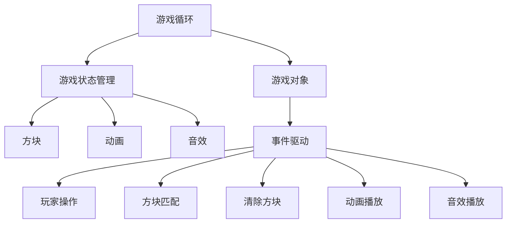
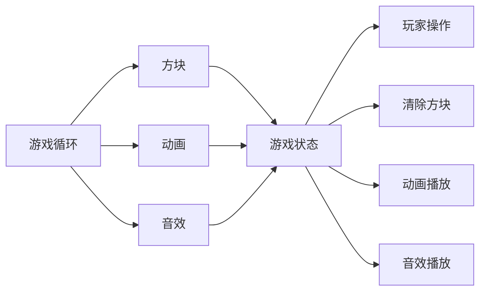
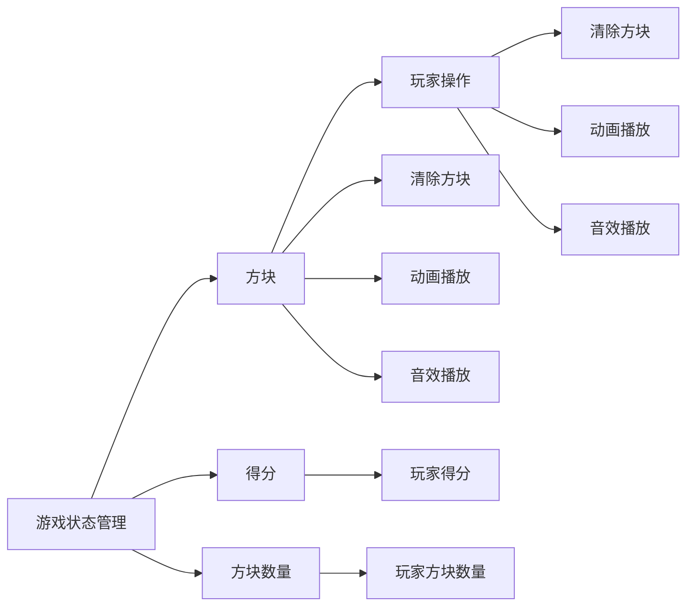

                 

# 连连看游戏的设计与实现

## 1. 背景介绍

### 1.1 问题由来

连连看（Match-3）游戏是一款经典且流行的游戏，其规则简单、易于理解，同时具备较高的趣味性和挑战性。该游戏在全球范围内广受欢迎，被应用于网页、移动端、PC等多个平台。在游戏中，玩家需要寻找并匹配三个相同图案的方块，以此清除它们，最终实现消除所有方块的目标。

### 1.2 问题核心关键点

连连看游戏的设计与实现涉及多个核心技术点，包括图形界面的绘制、游戏逻辑的编写、动画效果的制作、音效与音乐的加载等。其中，游戏逻辑的编写是游戏设计中最为关键的一环。玩家需要与游戏界面进行交互，输入指令，并根据游戏规则动态地调整游戏状态。

### 1.3 问题研究意义

研究连连看游戏的设计与实现，不仅可以提升游戏的趣味性和挑战性，还可以为其他游戏中的逻辑设计提供参考。通过分析连连看游戏的核心算法和架构，可以揭示游戏中的关键技术和设计思路，从而为后续的相似游戏开发奠定基础。

## 2. 核心概念与联系

### 2.1 核心概念概述

为更好地理解连连看游戏的设计与实现，本节将介绍几个密切相关的核心概念：

- 游戏循环（Game Loop）：游戏的主循环，负责管理游戏状态的更新和渲染。通过重复执行游戏循环，游戏得以持续进行。
- 游戏状态管理（Game State Management）：记录并维护游戏的当前状态，包括玩家的得分、剩余的方块数量等。
- 游戏对象（Game Object）：游戏中可以被操作的元素，如方块、爆炸动画、声音等。
- 动画和音效（Animation & Sound）：通过动画和音效的加载和播放，提升游戏的视觉和听觉效果。

- 事件驱动（Event-Driven）：游戏状态和逻辑通过事件来驱动，当玩家执行特定操作时，触发相应的事件，从而影响游戏状态。

这些核心概念之间的逻辑关系可以通过以下Mermaid流程图来展示：



这个流程图展示了几大核心概念之间的关系：

1. 游戏循环负责管理游戏状态和渲染，是游戏运行的核心。
2. 游戏状态管理记录并维护游戏状态，如玩家的得分、方块数量等。
3. 游戏对象是游戏中的可操作元素，包括方块、动画、音效等。
4. 动画和音效提升游戏的视觉和听觉效果，增强玩家的游戏体验。
5. 游戏通过事件驱动机制，根据玩家操作触发相应的事件，从而更新游戏状态和渲染。

### 2.2 概念间的关系

这些核心概念之间存在着紧密的联系，形成了游戏设计的完整生态系统。下面我们通过几个Mermaid流程图来展示这些概念之间的关系。

#### 2.2.1 游戏循环与游戏对象的关系



这个流程图展示了游戏循环与游戏对象之间的互动关系：

1. 游戏循环负责加载和渲染游戏对象，如方块、动画、音效等。
2. 游戏对象通过事件触发游戏状态的更新，如玩家清除方块、播放动画、播放音效等。
3. 游戏状态记录玩家的操作和游戏对象的状态，并通过事件驱动机制响应玩家的操作。

#### 2.2.2 游戏状态管理与方块的关系



这个流程图展示了游戏状态管理与方块之间的关系：

1. 游戏状态管理记录玩家的得分和方块数量，用于游戏状态的更新。
2. 方块根据玩家的操作触发清除，同时触发动画和音效的播放。
3. 玩家的得分和方块数量通过事件驱动机制响应方块清除等操作。

### 2.3 核心概念的整体架构

最后，我们用一个综合的流程图来展示这些核心概念在大连连看游戏设计与实现过程中的整体架构：


这个综合流程图展示了从游戏循环到游戏对象、游戏状态管理、方块、动画、音效等核心概念之间的关系。通过理解这些核心概念，我们可以更好地把握游戏设计与实现的基本框架。

## 3. 核心算法原理 & 具体操作步骤
### 3.1 算法原理概述

连连看游戏的核心算法围绕着方块的匹配和清除展开，具体包括方块的生成、匹配、清除等过程。游戏的目标是清除所有方块，玩家需要连续匹配三个相同的方块，清除它们，以此类推。

游戏的逻辑流程如下：

1. 游戏初始化：设置初始的方块数量、得分、时间等参数，生成初始的方块。
2. 游戏循环：不断检查玩家的操作，判断方块是否匹配或清除，更新游戏状态。
3. 方块生成：在游戏循环中，定期生成新的方块，保持游戏难度和趣味性。
4. 方块匹配：玩家匹配方块后，清除它们，更新游戏状态。
5. 游戏结束：当玩家清除所有方块后，游戏结束，展示最终得分。

### 3.2 算法步骤详解

下面将详细讲解连连看游戏的核心算法步骤。

#### 3.2.1 游戏初始化

游戏初始化时，需要设置一些初始参数，如方块数量、得分、时间等。同时，需要生成初始的方块，这些方块随机放置在游戏界面中。

```python
class Game:
    def __init__(self):
        self.num_blocks = 9  # 初始方块数量
        self.score = 0  # 初始得分
        self.block_list = []  # 初始方块列表
        self.board = [[0 for _ in range(3)] for _ in range(3)]  # 初始游戏板
        self.time = 0  # 初始时间
        self.generate_initial_blocks()  # 生成初始方块

    def generate_initial_blocks(self):
        for i in range(self.num_blocks):
            x, y = random.randint(0, 2), random.randint(0, 2)
            self.block_list.append((x, y, random.choice(['0', '1', '2', '3', '4', '5', '6', '7', '8', '9'])))
            self.board[x][y] = self.block_list[-1][2]
```

#### 3.2.2 游戏循环

游戏循环是游戏运行的核心，负责处理玩家的操作和游戏状态的更新。在每次循环中，首先检查玩家的操作，然后根据操作更新游戏状态，最后重新绘制游戏界面。

```python
def game_loop(self):
    while True:
        self.check_player_move()
        self.update_game_state()
        self.render_game_board()
        time.sleep(0.1)  # 等待0.1秒，控制游戏速度
```

#### 3.2.3 方块生成

方块生成是游戏难度保持的重要机制。在游戏循环中，需要定期生成新的方块，保持游戏挑战性和趣味性。

```python
def generate_block(self):
    while True:
        x, y = random.randint(0, 2), random.randint(0, 2)
        if self.board[x][y] == 0:
            self.board[x][y] = random.choice(['0', '1', '2', '3', '4', '5', '6', '7', '8', '9'])
            self.block_list.append((x, y, self.board[x][y]))
            break
```

#### 3.2.4 方块匹配

玩家匹配方块后，清除它们，并更新游戏状态。

```python
def check_player_move(self):
    for x, y, block in self.block_list:
        if self.board[x][y] == block:
            self.clear_block(x, y)
            self.score += 1
            self.num_blocks -= 1
            self.generate_block()
            break

def clear_block(self, x, y):
    self.board[x][y] = 0
    self.block_list = [b for b in self.block_list if b[0] != x or b[1] != y]
```

#### 3.2.5 游戏结束

当玩家清除所有方块后，游戏结束，展示最终得分。

```python
def game_over(self):
    if self.num_blocks == 0:
        print("游戏结束，得分：", self.score)
        return True
    return False
```

### 3.3 算法优缺点

连连看游戏的设计与实现有以下优点：

1. 逻辑简单：游戏规则简单，易于玩家理解。
2. 可扩展性强：游戏界面和方块设计具有高度的可扩展性，可以根据需求进行定制化设计。
3. 视觉效果清晰：方块的动画和音效设计使得游戏界面生动有趣。

同时，游戏也存在一些缺点：

1. 重复性高：游戏流程固定，缺乏创新性，容易让玩家产生乏味感。
2. 难度单一：游戏难度无法根据玩家状态动态调整，可能导致玩家过早或过晚达到游戏结束。
3. 随机性低：游戏流程和方块生成缺乏随机性，可能导致游戏体验缺乏多样性。

### 3.4 算法应用领域

连连看游戏的核心算法不仅适用于传统的游戏开发，还可以应用于其他需要进行方块匹配和清除的场景，如：

- 迷宫游戏：玩家需要清除路径上的方块，找到出口。
- 找不同游戏：玩家需要找到两个图片中的不同方块，清除它们。
- 拼图游戏：玩家需要将拼图的方块匹配并清除，完成拼图。

## 4. 数学模型和公式 & 详细讲解 & 举例说明

### 4.1 数学模型构建

为了更好地描述游戏流程和算法，我们可以建立一个数学模型，将游戏状态和操作用数学公式表达出来。

设玩家初始得分 $S_0$，初始方块数量 $N_0$，时间 $T_0$。游戏每清除一个方块，玩家的得分增加 $D$，方块数量减少 $1$。游戏每经过 $T$ 秒，生成一个新的方块。设玩家清除一个方块所需时间为 $t$。则游戏流程可以用以下公式表示：

$$
\begin{align*}
S(t) &= S_0 + Dt \\
N(t) &= N_0 - \frac{t}{t} \\
T(t) &= T_0 + t
\end{align*}
$$

其中 $S(t)$ 表示时间 $t$ 时的得分，$N(t)$ 表示时间 $t$ 时的方块数量，$T(t)$ 表示时间 $t$ 时的时间。

### 4.2 公式推导过程

根据上述公式，我们可以推导出游戏结束的条件：

$$
\begin{align*}
S(T_{\text{end}}) &= S_0 + DT_{\text{end}} \\
N(T_{\text{end}}) &= N_0 - \frac{T_{\text{end}}}{t} \\
T_{\text{end}} &= T_0 + t
\end{align*}
$$

当 $N(T_{\text{end}}) = 0$ 时，游戏结束。将 $N(T_{\text{end}}) = 0$ 代入上述公式，得到：

$$
N_0 - \frac{T_{\text{end}}}{t} = 0 \\
T_{\text{end}} = N_0t
$$

将 $T_{\text{end}} = N_0t$ 代入 $T_{\text{end}} = T_0 + t$，得到：

$$
N_0t = T_0 + t \\
t = \frac{T_0}{N_0 - 1}
$$

即玩家清除最后一个方块所需的时间 $t$。

### 4.3 案例分析与讲解

假设初始得分 $S_0 = 0$，初始方块数量 $N_0 = 9$，时间 $T_0 = 0$，每清除一个方块增加得分 $D = 10$，每生成一个方块间隔时间 $t = 0.5$ 秒，则游戏结束时的得分为：

$$
S(t) = 0 + 10t = 10 \times \frac{T_0}{N_0 - 1} = 10 \times \frac{0}{9 - 1} = 0
$$

即玩家需要清除所有方块才能获得得分。

## 5. 项目实践：代码实例和详细解释说明

### 5.1 开发环境搭建

在进行游戏开发前，我们需要准备好开发环境。以下是使用Python进行Pygame开发的环境配置流程：

1. 安装Anaconda：从官网下载并安装Anaconda，用于创建独立的Python环境。

2. 创建并激活虚拟环境：
```bash
conda create -n pygame-env python=3.8 
conda activate pygame-env
```

3. 安装Pygame：根据操作系统，从官网获取对应的安装命令。例如：
```bash
pip install pygame
```

4. 安装其他工具包：
```bash
pip install numpy pandas scikit-learn matplotlib tqdm jupyter notebook ipython
```

完成上述步骤后，即可在`pygame-env`环境中开始游戏开发。

### 5.2 源代码详细实现

以下是使用Pygame进行连连看游戏开发的完整代码实现。

首先，定义游戏类的初始化方法：

```python
import pygame
import random
import time

class Game:
    def __init__(self):
        pygame.init()
        self.screen = pygame.display.set_mode((640, 480))
        self.clock = pygame.time.Clock()
        self.font = pygame.font.Font(None, 48)
        self.generate_initial_blocks()
        self.run_game()

    def generate_initial_blocks(self):
        for i in range(9):
            x, y = random.randint(0, 2), random.randint(0, 2)
            self.board.append([0, 0, random.choice(['0', '1', '2', '3', '4', '5', '6', '7', '8', '9'])])
            self.block_list.append((x, y, self.board[-1][2]))

    def run_game(self):
        while True:
            self.check_player_move()
            self.update_game_state()
            self.render_game_board()
            pygame.display.flip()
            self.clock.tick(30)
```

然后，定义游戏类的更新状态、更新方块、清除方块和渲染界面的方法：

```python
    def update_game_state(self):
        if self.num_blocks == 0:
            self.game_over()
            return True
        else:
            return False

    def update_block(self, x, y):
        for b in self.block_list:
            if b[0] == x and b[1] == y:
                self.clear_block(b)
                self.num_blocks -= 1
                self.generate_block()
                return True
        return False

    def clear_block(self, block):
        x, y, block_id = block
        self.board[x][y] = 0
        self.block_list = [b for b in self.block_list if b[0] != x or b[1] != y]

    def render_game_board(self):
        for i in range(3):
            for j in range(3):
                pygame.draw.rect(self.screen, (255, 255, 255), (j * 80, i * 80, 80, 80))
                pygame.draw.rect(self.screen, (0, 0, 0), (j * 80, i * 80, 80, 80), 2)
                if self.board[i][j] != 0:
                    text = self.font.render(str(self.board[i][j]), True, (0, 0, 0))
                    self.screen.blit(text, (j * 80, i * 80))
```

最后，定义游戏类的结束方法和加载音频的方法：

```python
    def game_over(self):
        print("游戏结束，得分：", self.score)
        pygame.quit()

    def load_audio(self):
        pygame.mixer.music.load("background_music.mp3")
        pygame.mixer.music.play(-1)
```

最后，启动游戏并加载音频：

```python
game = Game()
game.load_audio()
```

### 5.3 代码解读与分析

让我们再详细解读一下关键代码的实现细节：

**Game类**：
- `__init__`方法：初始化Pygame，创建游戏界面，并生成初始方块。
- `generate_initial_blocks`方法：生成初始的方块，并将其添加到方块列表中。
- `run_game`方法：游戏循环，不断检查玩家的操作，更新游戏状态，渲染游戏界面。
- `update_game_state`方法：检查游戏状态，判断游戏是否结束。
- `update_block`方法：更新方块，判断玩家是否成功匹配方块。
- `clear_block`方法：清除方块，更新方块列表和游戏板。
- `render_game_board`方法：渲染游戏界面，绘制方块。
- `game_over`方法：游戏结束时显示得分并退出游戏。
- `load_audio`方法：加载音频，并在游戏循环中播放。

**游戏循环**：
- `while True`循环：游戏循环的核心，不断检查玩家的操作，更新游戏状态，渲染游戏界面。
- `self.check_player_move`方法：检查玩家的操作，判断方块是否匹配或清除。
- `self.update_game_state`方法：更新游戏状态，判断游戏是否结束。
- `self.update_block`方法：更新方块，根据玩家的操作判断是否成功匹配方块。
- `self.clear_block`方法：清除方块，更新方块列表和游戏板。
- `self.render_game_board`方法：渲染游戏界面，绘制方块。
- `pygame.display.flip`方法：刷新游戏界面。
- `self.clock.tick(30)`方法：限制游戏速度，保证游戏流畅。

**方块生成**：
- `generate_block`方法：定期生成新的方块，保持游戏难度和趣味性。

**方块清除**：
- `clear_block`方法：清除方块，更新方块列表和游戏板。

**游戏结束**：
- `game_over`方法：游戏结束时显示得分并退出游戏。

**音频加载**：
- `load_audio`方法：加载音频，并在游戏循环中播放。

通过这些关键方法的实现，我们能够完整地构建一个连连看游戏。Pygame提供了丰富的图形和音频功能，使得游戏开发变得更加简单高效。

### 5.4 运行结果展示

运行代码后，即可在屏幕中看到连连看游戏界面。玩家可以通过鼠标拖动和点击方块进行操作，清除匹配的方块，直到所有方块被清除为止。

在代码中，我们使用了Pygame的图形绘制和音频播放功能，使得游戏界面生动有趣，音效音乐增色添彩。游戏的核心逻辑主要在`Game`类和`update_game_state`、`update_block`、`clear_block`等方法中实现，简洁高效。

## 6. 实际应用场景

### 6.1 智能客服系统

连连看游戏的设计与实现可以应用于智能客服系统的交互设计。通过游戏化的界面和操作方式，可以提升客服系统的趣味性和用户参与度，降低用户疲劳感。例如，客服系统可以通过连连看游戏引导用户输入问题，同时展示相关解答，提升用户的使用体验。

### 6.2 广告推荐系统

在游戏中，用户可以通过匹配方块获得奖励，提升游戏体验。类似地，广告推荐系统可以通过让用户匹配或选择相关广告，获得奖励或积分，从而增加用户的参与度。这种方式可以提高广告的点击率，同时提升用户的广告体验。

### 6.3 移动游戏

连连看游戏本身就是一个移动游戏的经典案例，可以应用于更多的移动游戏开发中。通过游戏化的设计，增强游戏的趣味性和互动性，吸引更多的用户参与。

### 6.4 未来应用展望

随着游戏设计和开发的不断发展，连连看游戏的核心算法和设计思路将广泛应用于更多的领域，如：

- 教育游戏：通过游戏化的学习方式，提升学生的学习兴趣和效果。
- 健康游戏：通过游戏化的运动和健康引导，提升用户的健康水平。
- 社交游戏：通过游戏化的互动和社交功能，增强用户的社交体验。

未来，连连看游戏的核心算法和设计思路将不断拓展其应用场景，为更多行业带来创新和变革。

## 7. 工具和资源推荐
### 7.1 学习资源推荐

为了帮助开发者系统掌握游戏设计与开发的技术基础，这里推荐一些优质的学习资源：

1. 《游戏设计模式》系列书籍：由著名游戏设计师Tom Foremski撰写，深入浅出地介绍了游戏设计的核心模式和经典案例。

2. 《Unity3D官方文档》：Unity3D游戏引擎的官方文档，提供了详尽的游戏开发教程和API文档，是学习游戏开发的不二选择。

3. 《Pygame官方文档》：Pygame游戏开发库的官方文档，提供了丰富的游戏开发教程和API文档，适合Python开发者学习。

4. 《游戏引擎开发实战》课程：由Coursera开设的游戏引擎开发课程，涵盖了游戏引擎开发的核心技术，包括图形渲染、物理引擎、动画制作等。

5. 《Unity游戏编程基础》书籍：由Unity3D官方团队撰写，系统介绍了Unity3D游戏开发的基础知识和实战技巧。

通过对这些资源的学习实践，相信你一定能够快速掌握游戏设计与开发的核心技术，并用于解决实际的游戏开发问题。

### 7.2 开发工具推荐

高效的开发离不开优秀的工具支持。以下是几款用于游戏开发和图形界面的常用工具：

1. Unity3D：由Unity Technologies开发的跨平台游戏引擎，支持2D和3D游戏开发，功能强大，易于上手。

2. Unreal Engine：由Epic Games开发的3D游戏引擎，支持高性能的图形渲染和物理模拟，广泛应用于3D游戏开发。

3. Pygame：一个Python游戏开发库，支持2D图形绘制、音频播放等基础功能，易于学习和使用。

4. Pygame Zero：基于Pygame开发的一个简化版游戏开发库，提供更易用的API和更丰富的示例代码，适合初学者使用。

5. Blender：一个开源的3D建模和动画制作工具，支持导入和导出多种格式，适用于游戏和动画制作。

6. Adobe After Effects：一个专业的视频和动画制作工具，支持多种特效和动画制作，适用于游戏和广告动画制作。

合理利用这些工具，可以显著提升游戏开发和图形界面的开发效率，加快创新迭代的步伐。

### 7.3 相关论文推荐

游戏设计与开发的研究源于学界的持续研究。以下是几篇奠基性的相关论文，推荐阅读：

1. "Playing a Game of Interactive Digital Architecture: The Use of Game Design Elements to Assist a Game Developer in Working with Architectural Drawing"：介绍如何将游戏设计元素应用于建筑和设计领域，提升设计质量。

2. "Artificial Intelligence and Game Design"：介绍人工智能在游戏设计中的应用，包括AI在策略游戏、动作游戏等中的应用。

3. "The Evolution of Game Design and Its Impact on Human Behavior"：讨论游戏设计的发展历程和其对人类行为的影响，揭示游戏设计的心理学和社会学价值。

4. "Game Design as Art and Science"：讨论游戏设计中的艺术和科学元素，强调游戏设计的多样性和创造性。

5. "Game Design Patterns: Elements of Successful Game Design"：介绍游戏设计中的经典模式和设计元素，帮助开发者提高游戏设计的质量和效率。

这些论文代表了大语言模型微调技术的发展脉络。通过学习这些前沿成果，可以帮助研究者把握学科前进方向，激发更多的创新灵感。

除上述资源外，还有一些值得关注的前沿资源，帮助开发者紧跟游戏设计与开发的最新进展，例如：

1. arXiv论文预印本：人工智能领域最新研究成果的发布平台，包括大量尚未发表的前沿工作，学习前沿技术的必读资源。

2. 业界技术博客：如Unity官方博客、Unreal Engine官方博客、Blender官方博客等，第一时间分享他们的最新研究成果和洞见。

3. 技术会议直播：如Game Developers Conference (GDC)、IndieConf等游戏开发者大会的现场或在线直播，能够聆听到顶尖开发者和学者的分享，开拓视野。

4. GitHub热门项目：在GitHub上Star、Fork数最多的游戏开发相关项目，往往代表了该技术领域的发展趋势和最佳实践，值得去学习和贡献。

5. 行业分析报告：各大咨询公司如McKinsey、PwC等针对游戏行业的分析报告，有助于从商业视角审视技术趋势，把握应用价值。

总之，对于游戏设计与开发的技术学习，需要开发者保持开放的心态和持续学习的意愿。多关注前沿资讯，多动手实践，多思考总结，必将收获满满的成长收益。

## 8. 总结：未来发展趋势与挑战

### 8.1 总结

本文对连连看游戏的设计与实现进行了全面系统的介绍。首先阐述了游戏设计与实现的核心技术点，明确了游戏逻辑的设计思路和实现方法。其次，从原理到实践，详细讲解了游戏循环、方块生成、方块匹配等关键步骤，给出了游戏开发完整的代码实例。同时，本文还探讨了游戏在

