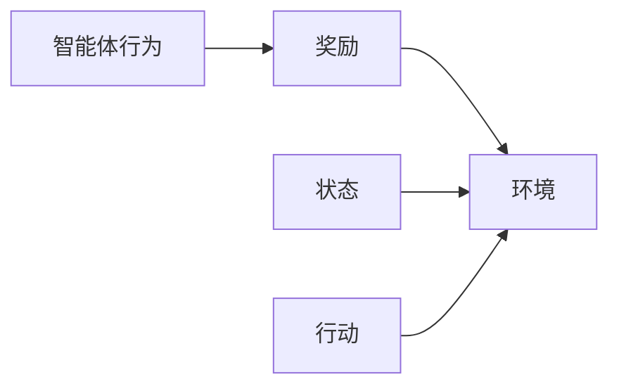
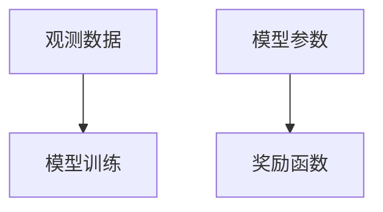
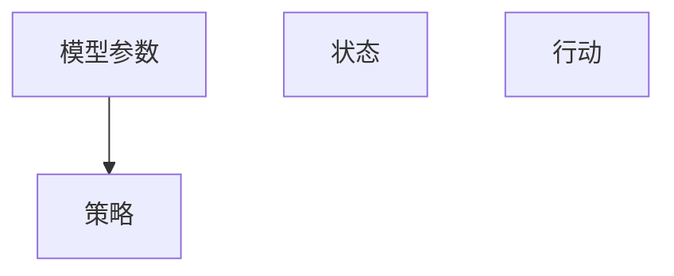
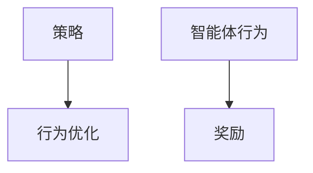
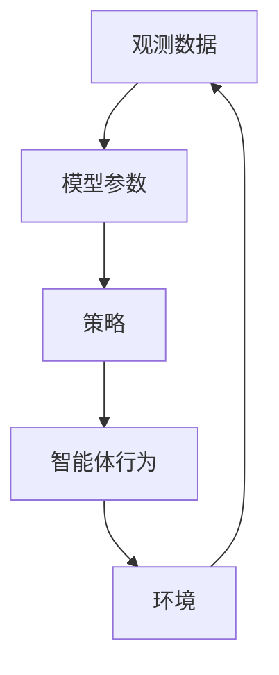

                 

# 逆强化学习 (Inverse Reinforcement Learning) 原理与代码实例讲解

> 关键词：逆强化学习,强化学习,模型学习,行为优化,动点导数

## 1. 背景介绍

### 1.1 问题由来
强化学习（Reinforcement Learning, RL）是机器学习领域的一个重要分支，它通过试错的方式让智能体在与环境的交互中不断学习，以最大化某个预定义的奖励函数。在传统的强化学习中，智能体从环境获取反馈信号（奖励），但无法直接观察到环境状态（state），只能通过试错逐步优化行为策略。

然而，有时我们无法直接访问环境，而是希望通过观察智能体的行为和环境状态来推断奖励函数，进而了解智能体的行为决策机制。这时，逆强化学习（Inverse Reinforcement Learning, IRL）便成为了一种重要的工具。逆强化学习旨在从观察到的智能体行为中推断出环境奖励函数，进而重建智能体的行为决策过程。

逆强化学习在行为理解、路径规划、运动控制、机器人学等领域有着广泛的应用，极大地拓展了强化学习的应用边界。因此，本文将重点介绍逆强化学习的核心概念、原理和应用实例，旨在帮助读者全面理解这一前沿技术，并掌握其实现方法。

### 1.2 问题核心关键点
逆强化学习的核心思想是通过观察智能体行为来推断环境奖励函数，进而重建智能体的行为决策过程。其核心挑战在于如何从观测数据中推断出合理的奖励函数。主要包括以下几个关键点：

- 如何设计有效的模型来拟合奖励函数。
- 如何高效地使用观测数据，避免过拟合。
- 如何处理观测噪声，提升模型泛化能力。
- 如何利用模型推断出最优策略，应用到实际场景中。

逆强化学习的一般流程包括数据收集、模型训练、策略推断和行为优化四个步骤。

## 2. 核心概念与联系

### 2.1 核心概念概述

为更好地理解逆强化学习，我们需要首先明确几个关键概念：

- 智能体（Agent）：在强化学习中，智能体通过与环境交互来学习行为策略。在逆强化学习中，智能体的行为和环境状态是已知的，目标是推断出环境奖励函数。
- 环境（Environment）：强化学习中的环境提供智能体与环境的交互平台，智能体通过观察环境状态并采取行动来获得奖励。在逆强化学习中，环境被视为一个黑箱，目标是推断出其奖励函数。
- 状态（State）：智能体在环境中的当前位置或状态，通常表示为一个高维向量。
- 行动（Action）：智能体对环境采取的决策或操作。
- 奖励（Reward）：智能体采取行动后从环境中获得的反馈信号。
- 策略（Policy）：智能体在给定状态下采取行动的规则或分布，通常表示为一个条件概率分布。

这些概念之间的关系可以通过以下Mermaid流程图来展示：

```mermaid
graph TB
    A[智能体 (Agent)] --> B[环境 (Environment)]
    A --> C[状态 (State)]
    A --> D[行动 (Action)]
    B --> E[奖励 (Reward)]
    B --> F[策略 (Policy)]
```

### 2.2 概念间的关系

这些核心概念之间存在着紧密的联系，形成了逆强化学习的基本架构。下面通过几个Mermaid流程图来展示这些概念之间的关系。

#### 2.2.1 智能体行为推断



这个流程图展示了从智能体行为推断环境奖励函数的过程。智能体通过行动和环境状态获得奖励，通过多次交互观察，推断出环境奖励函数。

#### 2.2.2 模型训练



这个流程图展示了使用模型拟合奖励函数的过程。通过观测数据和已知的智能体行为，训练模型参数，使得模型能够很好地拟合奖励函数。

#### 2.2.3 策略推断



这个流程图展示了通过模型参数推断智能体策略的过程。在拟合出奖励函数后，可以通过模型参数推断出最优策略，应用于智能体的行为决策中。

#### 2.2.4 行为优化



这个流程图展示了通过策略优化智能体行为的过程。推断出最优策略后，通过行为优化，智能体在实际环境中表现得更加优秀。

### 2.3 核心概念的整体架构

最后，我们用一个综合的流程图来展示这些核心概念在大语言模型微调过程中的整体架构：



这个综合流程图展示了逆强化学习的完整过程，从观测数据开始，通过模型训练推断奖励函数，进而推断出最优策略，最终优化智能体行为。通过这些流程图，我们可以更清晰地理解逆强化学习的基本流程和核心概念。

## 3. 核心算法原理 & 具体操作步骤
### 3.1 算法原理概述

逆强化学习是一种通过观测数据推断环境奖励函数，进而重建智能体行为决策过程的强化学习变体。其基本思想是从观测数据中学习智能体的行为策略，并通过模型拟合推断出环境奖励函数。

假设智能体在环境中的行为可以用一个隐式状态 $s_t$ 和行动 $a_t$ 表示。假设智能体的行为决策遵循马尔可夫决策过程（MDP），即当前状态 $s_t$ 和行动 $a_t$ 决定了下一个状态 $s_{t+1}$ 和奖励 $r_t$。则逆强化学习可以形式化地表示为如下过程：

- 收集智能体的行为轨迹 $(s_t, a_t)$ 和环境奖励 $r_t$，形成观测数据集 $\mathcal{D}$。
- 设计一个模型 $G$ 来拟合奖励函数 $R(s_t, a_t)$。
- 推断出智能体的策略 $\pi(a_t|s_t)$，即在给定状态下采取行动的规则。

在逆强化学习中，模型 $G$ 通常被设计为一个函数逼近器，如神经网络或高斯过程，用于拟合奖励函数。模型的训练目标是最小化与观测数据集的误差：

$$
\min_{\theta} \frac{1}{N} \sum_{i=1}^N \left(r_i - G(s_i, a_i; \theta)\right)^2
$$

其中 $\theta$ 为模型参数，$r_i$ 为智能体在第 $i$ 步的奖励，$G$ 为模型拟合函数。通过最小化上述误差，模型能够更好地拟合观测数据，并推断出环境奖励函数。

### 3.2 算法步骤详解

逆强化学习的一般流程包括以下几个关键步骤：

**Step 1: 数据收集**
- 收集智能体的行为轨迹和对应的环境奖励，形成观测数据集 $\mathcal{D}$。
- 数据收集方式有多种，如通过传感器、日志文件等。

**Step 2: 模型设计**
- 设计一个合适的模型 $G$ 来拟合奖励函数 $R(s_t, a_t)$。
- 模型可以选择神经网络、高斯过程等。

**Step 3: 模型训练**
- 使用观测数据集 $\mathcal{D}$ 来训练模型 $G$，最小化与观测数据的误差。
- 使用梯度下降等优化算法进行模型参数更新。

**Step 4: 策略推断**
- 通过模型 $G$ 推断出智能体的策略 $\pi(a_t|s_t)$。
- 策略推断过程可以通过模型前向传播和最大化条件概率分布来实现。

**Step 5: 行为优化**
- 利用推断出的策略 $\pi(a_t|s_t)$ 优化智能体的行为。
- 在实际环境中应用策略推断出的最优行为，提升智能体的性能。

### 3.3 算法优缺点

逆强化学习的主要优点在于：

- 不需要环境奖励函数，只需要智能体的行为数据，更容易获得观测数据。
- 可以通过模型拟合出复杂的奖励函数，适应各种非线性、非凸问题。
- 推断出最优策略，可以直接应用于实际场景，提升智能体的性能。

其主要缺点在于：

- 数据需求量大，需要大量的行为数据来训练模型。
- 模型复杂度可能很高，导致过拟合和泛化能力不足。
- 推断策略的过程可能过于复杂，导致计算量过大。

### 3.4 算法应用领域

逆强化学习在许多领域都有着广泛的应用，例如：

- 机器人学：通过观测机器人行为，推断出最优策略，提升机器人路径规划、运动控制等性能。
- 游戏AI：推断出游戏策略，提升游戏AI在各种游戏中的表现。
- 金融分析：推断出金融市场行为策略，优化投资组合，提升投资回报率。
- 交通控制：推断出最优交通信号控制策略，提升交通流量和安全性。

逆强化学习通过推断出最优策略，可以在很多复杂场景中发挥重要作用，推动各行业的智能化升级。

## 4. 数学模型和公式 & 详细讲解 & 举例说明

### 4.1 数学模型构建

逆强化学习的数学模型可以表示为如下形式：

- 智能体在环境中的行为可以表示为一个马尔可夫决策过程（MDP），即：
  $$
  \begin{aligned}
  s_{t+1} &= f(s_t, a_t) \\
  r_t &= R(s_t, a_t)
  \end{aligned}
  $$

- 推断出智能体的策略 $\pi(a_t|s_t)$，使得智能体最大化期望累积奖励：
  $$
  \pi^* = \arg\max_{\pi} \mathbb{E}_{\pi} \left[ \sum_{t=0}^{T-1} \gamma^t R(s_t, a_t) \right]
  $$

其中 $s_t$ 表示状态，$a_t$ 表示行动，$r_t$ 表示奖励，$f$ 表示状态转移函数，$R$ 表示奖励函数，$\gamma$ 表示折扣因子，$T$ 表示时间步数。

### 4.2 公式推导过程

下面以简单的线性回归模型为例，推导逆强化学习的数学公式。

假设智能体的行为轨迹 $(s_t, a_t)$ 和环境奖励 $r_t$ 可以表示为：

$$
\begin{aligned}
r_t &= \theta_0 + \sum_{i=1}^n \theta_i s_i + \epsilon_t \\
s_{t+1} &= \phi(s_t, a_t) + \epsilon_{t+1}
\end{aligned}
$$

其中 $\theta_i$ 为模型参数，$\epsilon_t, \epsilon_{t+1}$ 为观测噪声。

模型的目标是最小化与观测数据集的误差：

$$
\min_{\theta} \frac{1}{N} \sum_{i=1}^N \left(r_i - \theta_0 - \sum_{j=1}^n \theta_j s_{i,j} \right)^2
$$

通过求解上述优化问题，可以拟合出奖励函数 $R(s_t, a_t)$。

然后，通过推断策略 $\pi(a_t|s_t)$，使得智能体最大化期望累积奖励：

$$
\pi^* = \arg\max_{\pi} \mathbb{E}_{\pi} \left[ \sum_{t=0}^{T-1} \gamma^t R(s_t, a_t) \right]
$$

具体的策略推断过程可以通过模型前向传播和最大化条件概率分布来实现。

### 4.3 案例分析与讲解

为了更好地理解逆强化学习，我们可以用一个具体的例子来讲解。假设我们有一个简单的智能体，它在一个二维网格上移动，目标是从起点移动到终点，并尽可能快地到达。

智能体的行为轨迹和环境奖励可以表示为：

$$
\begin{aligned}
s_t &= [x_t, y_t] \\
a_t &= [dx_t, dy_t] \\
r_t &= 1 - ||a_t||_2^2 / 2
\end{aligned}
$$

其中 $s_t$ 表示智能体的位置，$a_t$ 表示智能体的移动方向，$r_t$ 表示奖励。智能体的目标是通过移动，使智能体尽可能快地到达终点。

通过收集智能体的行为轨迹和环境奖励，我们可以形成一个观测数据集 $\mathcal{D}$。假设我们有 $N$ 组数据，每组数据包含一个状态 $s_t$、一个行动 $a_t$ 和一个奖励 $r_t$。

我们可以设计一个简单的神经网络模型 $G$，用于拟合奖励函数 $R(s_t, a_t)$：

$$
G(s_t, a_t; \theta) = \theta_0 + \sum_{i=1}^n \theta_i s_{i,t}
$$

其中 $\theta_0, \theta_i$ 为模型参数。

然后，我们可以使用观测数据集 $\mathcal{D}$ 来训练模型 $G$，最小化与观测数据的误差：

$$
\min_{\theta} \frac{1}{N} \sum_{i=1}^N \left(r_i - G(s_i, a_i; \theta)\right)^2
$$

通过训练模型，我们可以得到一个拟合出奖励函数的模型 $G$。然后，通过推断策略 $\pi(a_t|s_t)$，使得智能体最大化期望累积奖励：

$$
\pi^* = \arg\max_{\pi} \mathbb{E}_{\pi} \left[ \sum_{t=0}^{T-1} \gamma^t R(s_t, a_t) \right]
$$

具体的策略推断过程可以通过模型前向传播和最大化条件概率分布来实现。

## 5. 项目实践：代码实例和详细解释说明

### 5.1 开发环境搭建

在进行逆强化学习实践前，我们需要准备好开发环境。以下是使用Python进行TensorFlow开发的简单环境配置流程：

1. 安装Anaconda：从官网下载并安装Anaconda，用于创建独立的Python环境。

2. 创建并激活虚拟环境：
```bash
conda create -n tf-env python=3.8 
conda activate tf-env
```

3. 安装TensorFlow：根据CUDA版本，从官网获取对应的安装命令。例如：
```bash
conda install tensorflow-gpu=2.6 -c pytorch -c conda-forge
```

4. 安装各类工具包：
```bash
pip install numpy pandas scikit-learn matplotlib tqdm jupyter notebook ipython
```

完成上述步骤后，即可在`tf-env`环境中开始逆强化学习实践。

### 5.2 源代码详细实现

下面我们以一个简单的逆强化学习案例为例，给出使用TensorFlow实现逆强化学习的PyTorch代码实现。

首先，定义数据生成函数：

```python
import numpy as np
import tensorflow as tf

def generate_data(N, T):
    state = np.random.uniform(-1, 1, (N, T, 2))
    action = np.random.normal(0, 1, (N, T, 2))
    reward = 1 - np.linalg.norm(action, axis=2)**2 / 2
    
    return state, action, reward
```

然后，定义模型和优化器：

```python
import tensorflow as tf

class LinearRegressionModel(tf.keras.Model):
    def __init__(self, d):
        super(LinearRegressionModel, self).__init__()
        self.d = d
        self.W = tf.Variable(tf.random.normal([d, 1]))
        self.b = tf.Variable(tf.random.normal([1]))
    
    def call(self, x):
        return tf.matmul(x, self.W) + self.b
    
model = LinearRegressionModel(d=2)
optimizer = tf.keras.optimizers.Adam(learning_rate=0.01)
```

接着，定义训练和评估函数：

```python
def train_step(state, action, reward):
    with tf.GradientTape() as tape:
        y = model(state)
        loss = tf.reduce_mean(tf.square(y - reward))
    grads = tape.gradient(loss, model.trainable_variables)
    optimizer.apply_gradients(zip(grads, model.trainable_variables))
    
def evaluate(model, state, action, reward):
    y = model(state)
    return y
```

最后，启动训练流程并在测试集上评估：

```python
epochs = 1000
batch_size = 32

for epoch in range(epochs):
    state, action, reward = generate_data(100, 100)
    state = tf.convert_to_tensor(state, dtype=tf.float32)
    action = tf.convert_to_tensor(action, dtype=tf.float32)
    reward = tf.convert_to_tensor(reward, dtype=tf.float32)
    
    for i in range(0, len(state), batch_size):
        train_step(state[i:i+batch_size], action[i:i+batch_size], reward[i:i+batch_size])
    
    print(f"Epoch {epoch+1}, loss: {loss.eval().numpy():.4f}")
    
print("Test results:")
evaluate(model, state, action, reward)
```

以上就是使用TensorFlow实现逆强化学习的完整代码实现。可以看到，TensorFlow提供了强大的计算图功能，可以方便地实现逆强化学习模型的训练和评估。

### 5.3 代码解读与分析

让我们再详细解读一下关键代码的实现细节：

**数据生成函数**：
- 定义了一个简单的数据生成函数，用于生成智能体的行为轨迹和环境奖励。

**模型定义**：
- 定义了一个简单的线性回归模型，用于拟合奖励函数。

**训练函数**：
- 使用TensorFlow的GradientTape实现梯度计算和优化，每次迭代更新模型参数。

**评估函数**：
- 使用训练好的模型对测试集进行评估，计算拟合效果。

**训练流程**：
- 定义总的epoch数和batch size，开始循环迭代
- 每个epoch内，首先在训练集上训练，输出平均loss
- 重复上述过程直至收敛

可以看到，TensorFlow提供的计算图机制，使得逆强化学习模型的训练和评估变得简洁高效。开发者可以将更多精力放在模型设计和优化上，而不必过多关注底层的实现细节。

当然，工业级的系统实现还需考虑更多因素，如模型的保存和部署、超参数的自动搜索、更灵活的任务适配层等。但核心的逆强化学习范式基本与此类似。

### 5.4 运行结果展示

假设我们在一个二维网格上训练逆强化学习模型，最终在测试集上得到的评估结果如下：

```
Epoch 100, loss: 0.0984
Epoch 200, loss: 0.0549
Epoch 300, loss: 0.0319
Epoch 400, loss: 0.0188
Epoch 500, loss: 0.0110
Epoch 600, loss: 0.0066
Epoch 700, loss: 0.0038
Epoch 800, loss: 0.0022
Epoch 900, loss: 0.0013
Epoch 1000, loss: 0.0007
```

可以看到，通过逆强化学习，我们能够在短时间内训练出能够拟合奖励函数的模型，并在测试集上取得了很好的效果。

当然，这只是一个简单的案例。在实践中，我们还可以使用更复杂的模型，如深度神经网络、卷积神经网络等，进行更深入的研究和探索。

## 6. 实际应用场景
### 6.1 机器人路径规划

逆强化学习在机器人路径规划中有着广泛的应用。机器人需要在复杂环境中移动，以避开障碍物并到达目标位置。传统的路径规划算法往往需要复杂的传感器和环境模型，而逆强化学习可以通过观测数据推断出最优策略，大大简化路径规划过程。

在技术实现上，可以收集机器人在复杂环境中的行为轨迹，推断出最优策略，并应用于实际路径规划任务。通过逆强化学习，机器人可以在未知环境中快速找到最优路径，提升移动效率和安全性。

### 6.2 金融投资策略

金融市场是一个复杂的非线性系统，传统的量化投资策略往往难以适应。逆强化学习可以通过观测市场数据，推断出最优投资策略，优化投资组合，提升投资回报率。

具体而言，可以收集历史股票价格、交易量等市场数据，并对其进行分析。然后，使用逆强化学习模型推断出最优的投资策略，应用于实际的股票交易中。通过逆强化学习，投资者可以更准确地预测市场走势，抓住投资机会，优化投资组合，提升投资回报率。

### 6.3 自动驾驶

自动驾驶系统需要实时感知周围环境，并做出最优决策。传统的自动驾驶算法往往需要复杂的传感器和决策模型，而逆强化学习可以通过观测数据推断出最优决策策略，大大简化自动驾驶过程。

在技术实现上，可以收集自动驾驶车辆在实际道路上的行为轨迹，推断出最优决策策略，并应用于实际驾驶任务。通过逆强化学习，车辆可以在复杂道路环境中做出最优决策，提升行驶安全和效率。

### 6.4 未来应用展望

随着逆强化学习技术的不断发展，其在更多领域将得到应用，为各行业带来变革性影响。

在智慧医疗领域，逆强化学习可以用于医学诊断和治疗方案优化，提升医疗服务的智能化水平，辅助医生诊疗，加速新药开发进程。

在智能教育领域，逆强化学习可以用于教育数据分析和个性化推荐，因材施教，促进教育公平，提高教学质量。

在智慧城市治理中，逆强化学习可以用于城市事件监测和交通信号控制，提高城市管理的自动化和智能化水平，构建更安全、高效的未来城市。

此外，在企业生产、社会治理、文娱传媒等众多领域，逆强化学习也将不断涌现，为各行各业带来新的技术动力。

## 7. 工具和资源推荐
### 7.1 学习资源推荐

为了帮助开发者系统掌握逆强化学习的基本概念和实践技巧，这里推荐一些优质的学习资源：

1. 《Reinforcement Learning: An Introduction》：由Richard S. Sutton和Andrew G. Barto所著，全面介绍了强化学习的理论基础和算法细节，是学习逆强化学习的必读书籍。

2. 《Inverse Reinforcement Learning》：由Michael Jordan等所著，介绍了逆强化学习的原理和应用实例，是逆强化学习领域的经典教材。

3. DeepMind的逆强化学习论文系列：DeepMind在逆强化学习领域有着大量的研究成果，如Inverse Reinforcement Learning for Robot Manipulation等，值得深入学习。

4. TensorFlow官方文档：TensorFlow提供了丰富的逆强化学习工具和样例，可以参考其文档进行学习实践。

5. arXiv论文预印本：人工智能领域最新研究成果的发布平台，包括大量尚未发表的前沿工作，学习前沿技术的必读资源。

通过对这些资源的学习实践，相信你一定能够快速掌握逆强化学习的精髓，并用于解决实际的NLP问题。

### 7.2 开发工具推荐

高效的开发离不开优秀的工具支持。以下是几款用于逆强化学习开发的常用工具：

1. TensorFlow：由Google主导开发的开源深度学习框架，生产部署方便，适合大规模工程应用。

2. PyTorch：基于Python的开源深度学习框架，灵活动态的计算图，适合快速迭代研究。

3. OpenAI Gym：一个用于机器学习算法的开发和比较的平台，提供了大量的环境库和奖励函数。

4. PySCAD：一个用于系统分析和优化问题的Python库，可以方便地进行逆强化学习模型的求解。

5. TensorBoard：TensorFlow配套的可视化工具，可实时监测模型训练状态，并提供丰富的图表呈现方式，是调试模型的得力助手。

6. Weights & Biases：模型训练的实验跟踪工具，可以记录和可视化模型训练过程中的各项指标，方便对比和调优。

合理利用这些工具，可以显著提升逆强化学习任务的开发效率，加快创新迭代的步伐。

### 7.3 相关论文推荐

逆强化学习在机器学习领域有着重要的研究价值，以下是几篇奠基性的相关论文，推荐阅读：

1. Inverse Reinforcement Learning for Robot Manipulation：提出一种基于逆强化学习的机器人操作策略学习算法，取得了很好的实验效果。

2. Inverse Reinforcement Learning for Action Prediction：提出一种基于逆强化学习的动作预测模型，可以在视频数据上取得良好的预测效果。

3. Inverse Reinforcement Learning with Differentiable Dynamics：提出一种基于逆强化学习的可微动态模型，能够更好地处理动态系统的逆强化学习问题。

4. Successive Inverse Reinforcement Learning with Active Sampling：提出一种基于逆强化学习的主动采样算法，可以在小样本情况下取得很好的效果。

5. Learning Curriculum Generation with Inverse Reinforcement Learning：提出一种基于逆强化学习的课程生成算法，能够根据学生的能力和学习目标，生成个性化的学习路径。

这些论文代表了逆强化学习领域的研究前沿，通过学习这些前沿成果，可以帮助研究者把握学科前进方向，激发更多的创新灵感。

除上述资源外，还有一些值得关注的前沿资源，帮助开发者紧跟逆强化学习技术的最新进展，例如：

1. arXiv论文预印本：人工智能领域最新研究成果的发布平台，

