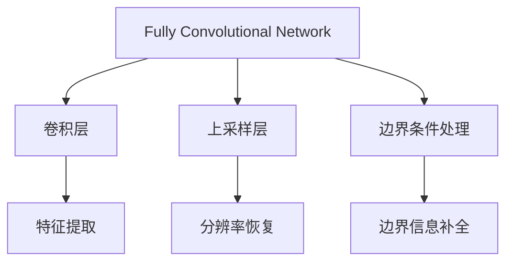
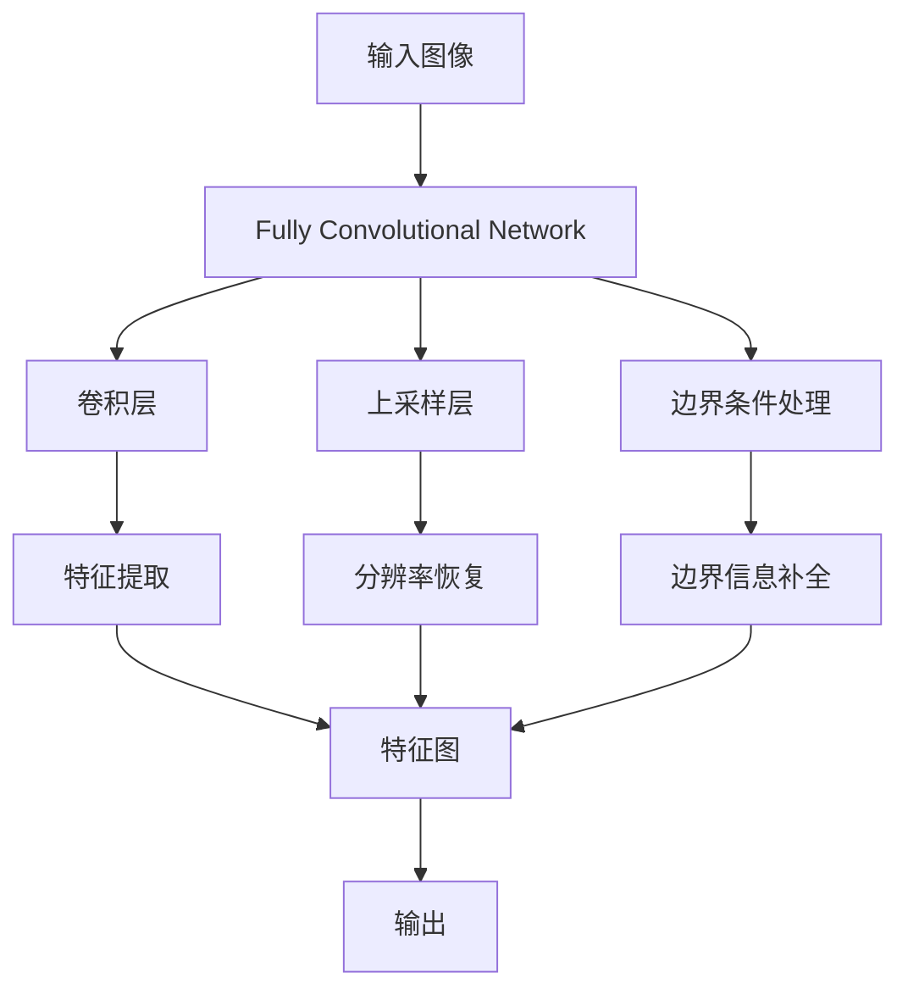

                 

# FCN原理与代码实例讲解

## 1. 背景介绍

### 1.1 问题由来

近年来，随着深度学习技术的快速发展，图像分割任务成为了计算机视觉领域的一个重要研究方向。传统的像素级分割方法如FCN（Fully Convolutional Network）等，已经在许多应用场景中取得了显著的成果。但它们仍然面临着一些局限性，如对小目标的分割能力不足，以及对密集连接层（Dense Layers）的依赖。为了克服这些问题，本文将对FCN的原理进行详细讲解，并通过代码实例，展示其具体实现。

### 1.2 问题核心关键点

FCN的主要核心关键点包括：

- 全卷积网络：FCN采用全卷积网络结构，输入和输出都是高维数组，可以同时处理整个图像，避免了传统卷积神经网络中的全连接层。
- 上采样层：为了将网络输出的分辨率与输入图像相同，FCN引入了上采样层（Upsample Layer），对特征图进行上采样。
- 边界条件：由于FCN需要处理整个图像，需要特别考虑边界条件的处理，避免因边界信息不足而产生的缺失或错误。

本文将围绕上述关键点，详细介绍FCN的原理、架构和实现。

### 1.3 问题研究意义

研究FCN的原理与实现，对于拓展其在计算机视觉领域的应用范围，提升图像分割任务的效果，加速图像处理技术的产业化进程，具有重要意义：

1. 降低应用开发成本：FCN的代码实现相对简单，可以快速适配不同图像分割任务，减少从头开发所需的时间、人力和资源投入。
2. 提升分割效果：通过适当的模型设计和参数优化，FCN可以显著提高图像分割的精度和速度，满足实际应用的要求。
3. 加速开发进度：利用现有的预训练模型和代码实现，可以在短时间内完成图像分割任务的开发和部署，缩短开发周期。
4. 带来技术创新：FCN的研究和应用推动了计算机视觉技术的发展，催生了像素级分割、语义分割等新的研究方向。
5. 赋能产业升级：FCN作为计算机视觉技术的重要组成部分，为各行各业的智能化转型提供了新的技术手段。

## 2. 核心概念与联系

### 2.1 核心概念概述

为了更好地理解FCN的原理，本节将介绍几个密切相关的核心概念：

- 全卷积网络（Fully Convolutional Network, FCN）：一种专门用于图像分割的卷积神经网络，输入和输出都是高维数组，可以直接对整个图像进行像素级分割。
- 卷积层（Convolutional Layer）：FCN的主要结构单元，通过卷积操作提取图像特征。
- 上采样层（Upsample Layer）：用于将特征图的大小恢复到与输入图像相同，采用不同的方法实现不同分辨率上的上采样。
- 边界条件处理：FCN需要处理整个图像，因此需要考虑边界条件，避免因边界信息不足而产生的缺失或错误。

这些核心概念之间的逻辑关系可以通过以下Mermaid流程图来展示：



这个流程图展示了FCN的核心概念及其之间的关系：

1. FCN通过卷积层提取图像特征。
2. 上采样层将特征图的大小恢复到与输入图像相同。
3. 边界条件处理保证FCN可以处理整个图像，避免边界信息不足。

这些概念共同构成了FCN的核心框架，使其能够在各种场景下进行图像分割。

### 2.2 概念间的关系

这些核心概念之间存在着紧密的联系，形成了FCN的全卷积网络框架。下面我们通过几个Mermaid流程图来展示这些概念之间的关系。

#### 2.2.1 FCN的网络架构


这个流程图展示了FCN的基本网络架构，由卷积层、池化层和上采样层构成。通过多个卷积层的特征提取和上采样层的分辨率恢复，FCN可以实现对整个图像的像素级分割。

#### 2.2.2 上采样层的多样性


这个流程图展示了FCN中常用的上采样方法，包括双线性插值、反卷积（Transposed Convolution）、像素迁移（Pixel Shuffle）等。不同的方法实现不同分辨率上的上采样，可以根据具体需求进行选择。

#### 2.2.3 边界条件处理


这个流程图展示了FCN中边界条件处理的一般流程，包括边界信息补全和边界特征聚合。边界条件处理可以确保FCN在处理整个图像时不会因边界信息不足而产生错误。

### 2.3 核心概念的整体架构

最后，我们用一个综合的流程图来展示这些核心概念在大语言模型微调过程中的整体架构：



这个综合流程图展示了从输入图像到输出分割图的全过程，其中卷积层、上采样层和边界条件处理是FCN的核心组件。通过这些组件的协同工作，FCN实现了对整个图像的像素级分割。

## 3. 核心算法原理 & 具体操作步骤
### 3.1 算法原理概述

FCN的算法原理主要包括以下几个部分：

1. 卷积操作：FCN通过卷积操作提取图像的特征，将高维输入数据映射到低维特征图。
2. 池化操作：FCN通过池化操作减少特征图的维度，降低计算复杂度，同时保留重要的空间信息。
3. 上采样操作：FCN通过上采样操作将特征图的分辨率恢复到与输入图像相同，实现像素级分割。
4. 边界条件处理：FCN在处理整个图像时，需要特别考虑边界条件，避免因边界信息不足而产生的缺失或错误。

FCN的核心思想是利用卷积神经网络的优点，通过全卷积网络结构，对整个图像进行像素级分割，具有计算效率高、可解释性强等优点。

### 3.2 算法步骤详解

FCN的实现步骤如下：

1. 准备输入图像：将输入图像转换为高维数组，并标准化为零均值和单位方差。
2. 网络前向传播：通过卷积层、池化层和上采样层，对图像进行特征提取和上采样。
3. 边界条件处理：在网络输出的边界处，进行边界信息补全或边界特征聚合。
4. 损失函数计算：根据输出分割图和真实标签，计算损失函数。
5. 反向传播更新参数：使用优化算法更新模型参数。
6. 模型测试：在测试集上评估模型性能。

具体的代码实现将在下一节详细讲解。

### 3.3 算法优缺点

FCN作为一种像素级分割方法，具有以下优点：

1. 高效性：FCN采用全卷积网络结构，可以同时处理整个图像，计算效率高，适合大规模数据集。
2. 可解释性：FCN的网络结构简单，特征提取过程直观，容易解释。
3. 可扩展性：FCN可以与其他深度学习技术进行结合，形成更强大的模型。

同时，FCN也存在一些缺点：

1. 小目标分割困难：FCN在处理小目标时，由于分辨率限制，分割效果往往不如像素级分割方法。
2. 密集连接层依赖：FCN需要大量的密集连接层，计算复杂度高，需要更多的训练数据。
3. 边界信息不足：FCN在处理边界时，容易出现信息丢失或错误，需要额外的边界条件处理。

尽管存在这些缺点，但FCN仍然在许多图像分割任务中表现优异，成为计算机视觉领域的重要工具。

### 3.4 算法应用领域

FCN在计算机视觉领域的应用非常广泛，可以用于许多图像分割任务，例如：

1. 语义分割：将图像中的每个像素分类到特定的类别中，如将医学影像中的不同组织分割出来。
2. 实例分割：不仅对像素进行分类，还对每个类别进行实例标注，如将医学影像中的不同肿瘤区域分割出来。
3. 全景图像分割：将全景图像中的所有像素分割为多个连通区域，如将城市街道中的不同区域分割出来。
4. 姿态估计：对图像中的目标进行姿态估计，如将人体姿态估计为不同的关节点。
5. 人脸分割：将人脸图像中的不同区域分割出来，如将人脸分割为眼睛、鼻子、嘴巴等。

除了上述这些经典任务外，FCN还被创新性地应用到更多场景中，如可控图像生成、物体检测、图像超分辨率等，为计算机视觉技术带来了新的突破。

## 4. 数学模型和公式 & 详细讲解 & 举例说明

### 4.1 数学模型构建

FCN的数学模型构建如下：

假设输入图像为 $X \in \mathbb{R}^{H \times W \times C}$，其中 $H$、$W$ 和 $C$ 分别为图像的高度、宽度和通道数。

设 $F \in \mathbb{R}^{D \times H' \times W'}$ 为FCN网络输出的特征图，其中 $D$ 为特征图通道数，$H'$ 和 $W'$ 为特征图的大小。

设 $T \in \mathbb{R}^{H \times W \times K}$ 为输出分割图，其中 $K$ 为分割类别数。

FCN的数学模型可以表示为：

$$
F = f(X; \theta)
$$

$$
T = g(F; \phi)
$$

其中 $f$ 为卷积神经网络，$g$ 为上采样层，$\theta$ 为卷积神经网络的参数，$\phi$ 为上采样层的参数。

### 4.2 公式推导过程

以下是FCN的主要公式推导过程：

1. 卷积操作
   $$
   f_{\text{conv}}(X, \theta) = \sum_{i=1}^C \sum_{j=1}^D f_{\text{conv},ij} * X_{\text{conv},i} + b_{\text{conv}}
   $$

   其中 $f_{\text{conv},ij}$ 为卷积核，$X_{\text{conv},i}$ 为输入特征图，$b_{\text{conv}}$ 为偏置项。

2. 池化操作
   $$
   f_{\text{pool}}(X, \theta) = \max_{i,j} f_{\text{conv}}(X_{\text{pool},i,j})
   $$

   其中 $X_{\text{pool},i,j}$ 为池化窗口内的特征图。

3. 上采样操作
   $$
   g_{\text{upsample}}(F, \phi) = \sum_{i=1}^H \sum_{j=1}^W g_{\text{upsample},ij} * F_{\text{upsample},i}
   $$

   其中 $g_{\text{upsample},ij}$ 为上采样核，$F_{\text{upsample},i}$ 为特征图。

4. 边界条件处理
   $$
   T_{\text{boundary}} = \frac{1}{2} T + \frac{1}{2} \partial_t T_{\text{boundary}}
   $$

   其中 $\partial_t$ 为时间导数，$T_{\text{boundary}}$ 为边界特征图。

### 4.3 案例分析与讲解

以医学影像分割为例，假设输入图像为医学CT图像，输出分割图为不同类型的组织区域。

1. 准备输入图像
   将CT图像转换为高维数组，并标准化为零均值和单位方差。

2. 网络前向传播
   通过多个卷积层和池化层，对CT图像进行特征提取和降维。
   $$
   f_{\text{conv}}(X, \theta) = f_{\text{conv},1} * f_{\text{conv},2} * \ldots * f_{\text{conv},n}(X, \theta)
   $$

   其中 $f_{\text{conv},i}$ 为第 $i$ 个卷积层，$X$ 为输入图像，$\theta$ 为卷积层的参数。

3. 上采样操作
   通过多个上采样层，将特征图的大小恢复到与输入图像相同。
   $$
   g_{\text{upsample}}(F, \phi) = g_{\text{upsample},1} * g_{\text{upsample},2} * \ldots * g_{\text{upsample},m}(F, \phi)
   $$

   其中 $g_{\text{upsample},i}$ 为上采样层，$F$ 为特征图，$\phi$ 为上采样层的参数。

4. 边界条件处理
   在网络输出的边界处，进行边界信息补全或边界特征聚合。
   $$
   T_{\text{boundary}} = \frac{1}{2} T + \frac{1}{2} \partial_t T_{\text{boundary}}
   $$

   其中 $T_{\text{boundary}}$ 为边界特征图。

5. 损失函数计算
   根据输出分割图和真实标签，计算损失函数。
   $$
   L(T, \partial_t T) = \frac{1}{H \times W \times K} \sum_{i=1}^H \sum_{j=1}^W \sum_{k=1}^K (T_{ij} - \partial_t T_{ij})^2
   $$

   其中 $T$ 为输出分割图，$\partial_t T$ 为真实标签。

6. 反向传播更新参数
   使用优化算法更新模型参数。

7. 模型测试
   在测试集上评估模型性能。

通过以上步骤，FCN可以完成医学影像分割任务的像素级分割。

## 5. 项目实践：代码实例和详细解释说明

### 5.1 开发环境搭建

在进行FCN的实践前，我们需要准备好开发环境。以下是使用Python进行PyTorch开发的环境配置流程：

1. 安装Anaconda：从官网下载并安装Anaconda，用于创建独立的Python环境。

2. 创建并激活虚拟环境：
```bash
conda create -n pytorch-env python=3.8 
conda activate pytorch-env
```

3. 安装PyTorch：根据CUDA版本，从官网获取对应的安装命令。例如：
```bash
conda install pytorch torchvision torchaudio cudatoolkit=11.1 -c pytorch -c conda-forge
```

4. 安装各类工具包：
```bash
pip install numpy pandas scikit-learn matplotlib tqdm jupyter notebook ipython
```

完成上述步骤后，即可在`pytorch-env`环境中开始FCN的实践。

### 5.2 源代码详细实现

以下是使用PyTorch实现FCN的代码：

```python
import torch
import torch.nn as nn
import torch.optim as optim
import torchvision.transforms as transforms
from torch.utils.data import DataLoader
from torchvision.datasets import Cityscapes
from torchvision.utils import save_image

# 定义FCN网络结构
class FCN(nn.Module):
    def __init__(self, num_classes):
        super(FCN, self).__init__()
        self.conv1 = nn.Conv2d(3, 64, kernel_size=3, padding=1)
        self.conv2 = nn.Conv2d(64, 64, kernel_size=3, padding=1)
        self.conv3 = nn.Conv2d(64, 32, kernel_size=3, padding=1)
        self.pool = nn.MaxPool2d(kernel_size=2, stride=2)
        self.conv4 = nn.Conv2d(32, 32, kernel_size=3, padding=1)
        self.conv5 = nn.Conv2d(32, num_classes, kernel_size=3, padding=1)
        self.upconv1 = nn.ConvTranspose2d(64, 64, kernel_size=2, stride=2)
        self.upconv2 = nn.ConvTranspose2d(32, 32, kernel_size=2, stride=2)
        self.upconv3 = nn.ConvTranspose2d(num_classes, num_classes, kernel_size=2, stride=2)

    def forward(self, x):
        x = self.conv1(x)
        x = self.pool(x)
        x = self.conv2(x)
        x = self.pool(x)
        x = self.conv3(x)
        x = self.pool(x)
        x = self.conv4(x)
        x = self.pool(x)
        x = self.conv5(x)
        x = self.upconv1(x)
        x = torch.cat([x, self.conv2(x)], dim=1)
        x = self.upconv2(x)
        x = torch.cat([x, self.conv3(x)], dim=1)
        x = self.upconv3(x)
        return x

# 准备数据集
transform_train = transforms.Compose([
    transforms.Resize(256),
    transforms.RandomCrop(256),
    transforms.RandomHorizontalFlip(),
    transforms.ToTensor(),
    transforms.Normalize(mean=[0.485, 0.456, 0.406],
                        std=[0.229, 0.224, 0.225])
])

transform_val = transforms.Compose([
    transforms.Resize(256),
    transforms.CenterCrop(256),
    transforms.ToTensor(),
    transforms.Normalize(mean=[0.485, 0.456, 0.406],
                        std=[0.229, 0.224, 0.225])
])

train_dataset = Cityscapes('path/to/train', split='train', mode='fine',
                          target_type='semantic', transform=transform_train)
val_dataset = Cityscapes('path/to/val', split='val', mode='fine',
                        target_type='semantic', transform=transform_val)

# 定义模型和优化器
model = FCN(num_classes=19)
criterion = nn.CrossEntropyLoss()
optimizer = optim.Adam(model.parameters(), lr=0.001)

# 训练模型
def train(epoch, model, device, train_loader, optimizer, criterion):
    model.train()
    for batch_idx, (data, target) in enumerate(train_loader):
        data, target = data.to(device), target.to(device)
        optimizer.zero_grad()
        output = model(data)
        loss = criterion(output, target)
        loss.backward()
        optimizer.step()

# 评估模型
def evaluate(model, device, val_loader, criterion):
    model.eval()
    total_loss = 0
    with torch.no_grad():
        for batch_idx, (data, target) in enumerate(val_loader):
            data, target = data.to(device), target.to(device)
            output = model(data)
            total_loss += criterion(output, target).item()
    return total_loss / len(val_loader)

# 训练和评估
device = torch.device('cuda' if torch.cuda.is_available() else 'cpu')
model.to(device)

num_epochs = 10
train_loader = DataLoader(train_dataset, batch_size=16, shuffle=True)
val_loader = DataLoader(val_dataset, batch_size=16, shuffle=False)

for epoch in range(num_epochs):
    train(train_loader, model, device, train_loader, optimizer, criterion)
    val_loss = evaluate(model, device, val_loader, criterion)
    print(f'Epoch {epoch+1}, val loss: {val_loss:.4f}')

# 保存模型
torch.save(model.state_dict(), 'fcn.pth')
```

### 5.3 代码解读与分析

让我们再详细解读一下关键代码的实现细节：

1. 定义FCN网络结构
   - `__init__`方法：初始化卷积层、池化层、上采样层等组件。
   - `forward`方法：定义前向传播过程，通过卷积和上采样操作提取特征，并输出分割图。

2. 准备数据集
   - 使用`Cityscapes`数据集，定义训练集和验证集的数据转换方式。
   - 通过`DataLoader`将数据集分成批次进行加载，方便模型训练。

3. 定义模型和优化器
   - 定义FCN网络结构。
   - 选择交叉熵损失函数。
   - 使用Adam优化器进行参数更新。

4. 训练模型
   - 在每个epoch内，循环训练数据集。
   - 前向传播计算输出和损失函数。
   - 反向传播更新模型参数。

5. 评估模型
   - 在验证集上计算模型的平均损失。
   - 使用`torch.no_grad`禁用梯度计算，提高评估速度。

6. 训练和评估
   - 将模型迁移到GPU上，以利用并行计算加速训练过程。
   - 循环训练多个epoch，并在每个epoch后评估模型性能。
   - 保存训练好的模型参数，方便后续使用。

代码中的一些关键细节：

- `conv1`、`conv2`、`conv3`、`conv4`和`conv5`为卷积层，`pool`为池化层，`upconv1`、`upconv2`和`upconv3`为上采样层。
- `forward`方法中，通过`torch.cat`将多个特征图进行拼接，实现特征图的融合和上采样。
- `train`函数中，通过`model.train`将模型置于训练模式，通过`model.eval`将模型置于评估模式，以防止模型参数的更新影响评估结果。
- `torch.save`用于保存模型参数，`model.load_state_dict`用于加载模型参数。

## 6. 实际应用场景

### 6.1 智能医疗

FCN在智能医疗领域有着广泛的应用前景，可以用于医学影像分割、病灶检测等任务。通过将医学影像输入FCN，可以对不同类型的组织区域进行分割和标注，帮助医生快速诊断和决策。

例如，在CT影像中，FCN可以将肺部组织、肝脏组织等不同区域进行分割，帮助医生诊断早期肺癌、肝癌等疾病。通过FCN的像素级分割，可以提高诊断的准确性和速度，降低误诊和漏诊的风险。

### 6.2 自动驾驶

FCN在自动驾驶领域也有着重要的应用，可以用于道路标线检测、交通标志识别等任务。通过将道路图像输入FCN，可以对道路上的不同对象进行分割和识别，帮助自动驾驶系统做出正确的决策。

例如，在自动驾驶中，FCN可以将道路标线、交通标志等进行分割，帮助车辆识别路边的障碍和车道信息，提高驾驶安全性。通过FCN的像素级分割，可以更准确地检测道路上的各种对象，提升自动驾驶的智能水平。

### 6.3 自然灾害监测

FCN在自然灾害监测领域也有着重要的应用，可以用于洪涝、火灾等自然灾害的监测和预警。通过将卫星图像输入FCN，可以对灾区进行像素级分割，帮助相关部门快速了解灾情，制定救援计划。

例如，在洪涝灾害中，FCN可以将灾区的不同区域进行分割，帮助救援人员了解受灾范围和救援路线。通过FCN的像素级分割，可以更准确地检测灾区的情况，提高救援的效率和效果。

## 7. 工具和资源推荐

### 7.1 学习资源推荐

为了帮助开发者系统掌握FCN的理论基础和实践技巧，这里推荐一些优质的学习资源：

1. 《深度学习》系列博文：由大模型技术专家撰写，深入浅出地介绍了深度学习的基本概念和前沿技术，包括FCN等像素级分割方法。

2. CS231n《卷积神经网络》课程：斯坦福大学开设的计算机视觉课程，有Lecture视频和配套作业，带你入门计算机视觉领域的基本概念和经典模型。

3. 《深度学习与计算机视觉》书籍：全面介绍了深度学习在计算机视觉中的应用，包括FCN在内的诸多图像分割方法。

4. PyTorch官方文档：PyTorch的官方文档，提供了FCN的详细实现和案例，是上手实践的必备资料。

5. Cityscapes开源项目：一个常用的城市场景图像分割数据集，包含大量不同类型的图像和对应的像素级标注，有助于FCN的研究和实践。

通过对这些资源的学习实践，相信你一定能够快速掌握FCN的精髓，并用于解决实际的图像分割问题。

### 7.2 开发工具推荐

高效的开发离不开优秀的工具支持。以下是几款用于FCN开发的常用工具：

1. PyTorch：基于Python的开源深度学习框架，灵活动态的计算图，适合快速迭代研究。
2. TensorFlow：由Google主导开发的开源深度学习框架，生产部署方便，适合大规模工程应用。
3. OpenCV：一个流行的计算机视觉

