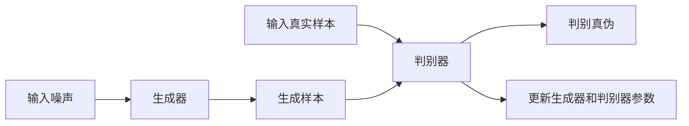

                 

# GAN 生成模型：生成器 (Generator) 原理与代码实例讲解

## 1. 背景介绍

生成对抗网络（Generative Adversarial Networks, GANs）是一种通过训练两个神经网络（生成器和判别器）来生成具有真实数据分布的新样本的机器学习模型。其中，生成器是生成网络，它接受随机噪声作为输入，生成新的样本，目的是让生成的样本尽可能地与真实数据样本相似。本文将深入探讨GAN的生成器（Generator）原理及其在代码实现中的应用。

## 2. 核心概念与联系

### 2.1 核心概念概述

GANs是由Ian Goodfellow等人在2014年提出的，由两个神经网络组成的对抗模型，一个生成器（Generator）和一个判别器（Discriminator）。生成器的目标是生成尽可能逼真的人工数据样本，而判别器的目标是区分真实数据样本和生成器生成的假样本。这两个网络通过相互对抗的方式进行训练，最终达到一个平衡点，使得生成的样本与真实数据样本无法区分。

GANs的生成器是一个通用的神经网络模型，可以是卷积神经网络（CNN）、循环神经网络（RNN）或全连接神经网络（FNN）。生成器的输入通常是一个随机噪声向量，输出是对应的生成样本。在训练过程中，生成器通过不断的优化，生成更加逼真的样本，以欺骗判别器。

### 2.2 概念间的关系

GANs的生成器和判别器之间存在着复杂的交互关系。生成器通过不断地生成样本，尝试欺骗判别器，而判别器则不断地学习和提高其辨别真伪的能力，两者之间的对抗训练过程，使得生成器能够生成更加逼真的样本。

以下是一个简化的GANs模型架构图，展示了生成器（Generator）和判别器（Discriminator）之间的交互过程。



## 3. 核心算法原理 & 具体操作步骤

### 3.1 算法原理概述

GANs的生成器（Generator）是一个将随机噪声作为输入，生成样本的神经网络模型。生成器的目标是通过学习真实数据集的分布，生成与真实数据集分布相同的样本。生成器的训练过程可以概括为以下几个步骤：

1. 随机生成噪声向量。
2. 将噪声向量输入生成器，生成样本。
3. 将生成的样本输入判别器，计算判别器对样本的判别概率。
4. 根据判别器的反馈，更新生成器的参数，使得生成的样本更逼真。
5. 重复上述步骤，直至生成器生成的样本与真实数据样本无法区分。

### 3.2 算法步骤详解

以下是生成器的训练步骤的详细描述：

1. **随机生成噪声向量**：生成器接受一个维度为 $z$ 的随机噪声向量作为输入，该向量通常是从标准正态分布中抽取的。

2. **生成样本**：将噪声向量输入生成器，生成维度为 $x$ 的样本。生成器通常是一个神经网络模型，它将输入的噪声向量映射为对应的样本。

3. **判别器反馈**：将生成的样本输入判别器，计算判别器对样本的判别概率。判别器的输出是一个概率值，表示输入样本为真实样本的概率。

4. **更新生成器参数**：根据判别器的反馈，更新生成器的参数。判别器的目标是最小化生成的样本和真实样本之间的差距，因此生成器需要最大化判别器对生成样本的判别概率。

5. **重复训练**：重复上述步骤，直至生成器生成的样本与真实数据样本无法区分。

### 3.3 算法优缺点

GANs的生成器具有以下优点：

- **生成高质量的样本**：生成器通过不断优化，可以生成与真实数据分布相同的样本。
- **灵活性高**：生成器的输入可以是任意维度的噪声向量，因此可以生成各种类型的样本。
- **可扩展性强**：生成器可以与其他神经网络模型结合，用于图像生成、音频生成等任务。

然而，生成器也存在一些缺点：

- **训练困难**：生成器的训练过程需要大量的计算资源和时间，且容易陷入局部最优解。
- **样本质量不稳定**：生成器生成的样本质量不稳定，可能会产生一些奇怪的或不自然的样本。
- **对抗样本敏感**：生成器对对抗样本（即通过扰动输入噪声向量生成的不太自然但可以欺骗判别器的样本）非常敏感，可能会生成一些不太自然的样本。

### 3.4 算法应用领域

GANs的生成器在各种领域都有广泛的应用，例如：

- **图像生成**：生成器可以生成各种类型的图像，如图像修复、图像转换等。
- **音频生成**：生成器可以生成各种类型的音频，如语音合成、音乐生成等。
- **视频生成**：生成器可以生成各种类型的视频，如视频片段的生成、视频动画等。
- **自然语言生成**：生成器可以生成各种类型的文本，如文本摘要、机器翻译等。

## 4. 数学模型和公式 & 详细讲解

### 4.1 数学模型构建

GANs的生成器模型可以表示为：

$$
G(z): \mathcal{Z} \rightarrow \mathcal{X}
$$

其中，$\mathcal{Z}$ 是随机噪声向量的空间，$\mathcal{X}$ 是生成样本的空间。生成器接受一个随机噪声向量 $z \in \mathcal{Z}$，并输出一个生成样本 $x \in \mathcal{X}$。

### 4.2 公式推导过程

GANs的生成器训练过程可以表示为以下步骤：

1. 随机生成噪声向量 $z \sim p(z)$。
2. 生成样本 $x = G(z)$。
3. 将生成的样本 $x$ 输入判别器，计算判别器对样本的判别概率 $D(x)$。
4. 计算生成器的损失函数 $L_G$：

$$
L_G = -\mathbb{E}_{z \sim p(z)} [\log D(G(z))]
$$

5. 更新生成器的参数，使得生成器的损失函数 $L_G$ 最小化。

### 4.3 案例分析与讲解

下面以图像生成为例，展示生成器在GANs中的具体实现。

假设我们有一个手写数字的图像数据集，我们希望生成器能够生成与真实手写数字图像相似的新手写数字图像。

1. **数据预处理**：将手写数字图像转换为标准化的像素值。

2. **生成器设计**：设计一个生成器，它将随机噪声向量作为输入，生成与真实手写数字图像尺寸相同的图像。

3. **训练生成器**：使用手写数字图像数据集对生成器进行训练。首先，随机生成噪声向量，将噪声向量输入生成器，生成图像。然后，将生成的图像输入判别器，计算判别器对图像的判别概率。最后，根据判别器的反馈，更新生成器的参数，使得生成器生成的图像与真实手写数字图像尽可能相似。

4. **验证生成器**：使用测试集验证生成器的性能，判断生成器是否能够生成逼真的手写数字图像。

## 5. 项目实践：代码实例和详细解释说明

### 5.1 开发环境搭建

以下是使用TensorFlow实现GANs生成器的开发环境搭建过程：

1. 安装TensorFlow：

```
pip install tensorflow
```

2. 安装相关依赖包：

```
pip install numpy matplotlib
```

3. 准备数据集：将手写数字图像数据集转换为TensorFlow可以处理的格式。

### 5.2 源代码详细实现

以下是一个简单的生成器的TensorFlow代码实现：

```python
import tensorflow as tf
import numpy as np

class Generator(tf.keras.Model):
    def __init__(self, latent_dim, image_dim):
        super(Generator, self).__init__()
        self.latent_dim = latent_dim
        self.image_dim = image_dim
        self.dense1 = tf.keras.layers.Dense(256, input_shape=(latent_dim,))
        self.dense2 = tf.keras.layers.Dense(784)
        self.reshape = tf.keras.layers.Reshape((28, 28, 1))
        
    def call(self, inputs):
        x = tf.reshape(inputs, (self.latent_dim, -1))
        x = tf.nn.relu(self.dense1(x))
        x = tf.nn.relu(self.dense2(x))
        x = self.reshape(x)
        return x
```

### 5.3 代码解读与分析

- `Generator`类定义了一个生成器模型，接受两个参数：`latent_dim`和`image_dim`，分别表示随机噪声向量的维度和生成图像的维度和。
- 生成器由两个全连接层组成，第一层有256个神经元，第二层有784个神经元。
- 最后一层使用`Reshape`层将输出转换为一维数组，用于生成图像。

### 5.4 运行结果展示

在训练生成器后，我们可以使用生成器生成新的手写数字图像。以下是一个简单的代码示例：

```python
latent_dim = 100
image_dim = 784

generator = Generator(latent_dim, image_dim)
latent_vector = np.random.normal(0, 1, size=(latent_dim,))
generated_image = generator(tf.convert_to_tensor(latent_vector))

plt.imshow(generated_image.numpy(), cmap='gray')
```

这段代码将生成一个随机噪声向量，输入生成器，并生成一张新的手写数字图像。

## 6. 实际应用场景

GANs的生成器在各种领域都有广泛的应用，例如：

- **图像生成**：生成器可以生成各种类型的图像，如图像修复、图像转换等。
- **音频生成**：生成器可以生成各种类型的音频，如语音合成、音乐生成等。
- **视频生成**：生成器可以生成各种类型的视频，如视频片段的生成、视频动画等。
- **自然语言生成**：生成器可以生成各种类型的文本，如文本摘要、机器翻译等。

## 7. 工具和资源推荐

### 7.1 学习资源推荐

为了帮助开发者系统掌握GANs的生成器原理和实践技巧，这里推荐一些优质的学习资源：

1. **《生成对抗网络（GANs）》书籍**：Ian Goodfellow等人著，全面介绍了GANs的原理、算法、实现及应用。
2. **Coursera《深度学习专项课程》**：由Ian Goodfellow等人主讲，涵盖了深度学习的各个方面，包括GANs。
3. **arXiv论文预印本**：人工智能领域最新研究成果的发布平台，包括大量尚未发表的前沿工作，学习前沿技术的必读资源。
4. **Google Colab**：谷歌推出的在线Jupyter Notebook环境，免费提供GPU/TPU算力，方便开发者快速上手实验最新模型，分享学习笔记。

### 7.2 开发工具推荐

高效的开发离不开优秀的工具支持。以下是几款用于GANs生成器开发的常用工具：

1. **TensorFlow**：由Google主导开发的深度学习框架，生产部署方便，适合大规模工程应用。
2. **PyTorch**：基于Python的深度学习框架，灵活性高，适合快速迭代研究。
3. **Keras**：基于TensorFlow或Theano的高级深度学习API，易于上手，适合初学者。
4. **MXNet**：由Apache开发的深度学习框架，支持分布式训练，适合大规模模型训练。
5. **TorchVision**：基于PyTorch的计算机视觉库，提供预训练模型和数据增强工具。

### 7.3 相关论文推荐

GANs的生成器在学术界和工业界都引起了广泛的关注，以下是几篇奠基性的相关论文，推荐阅读：

1. **Image-to-Image Translation with Conditional Adversarial Networks**：提出使用条件GANs进行图像转换。
2. **Conditional Generative Adversarial Nets**：提出使用条件GANs生成具有特定属性的图像。
3. **A Style-Based Generator Architecture for Generative Adversarial Networks**：提出使用风格GANs生成具有特定风格的图像。

这些论文代表了大GANs生成器技术的发展脉络，通过学习这些前沿成果，可以帮助研究者把握学科前进方向，激发更多的创新灵感。

## 8. 总结：未来发展趋势与挑战

### 8.1 总结

本文对GANs的生成器（Generator）原理及其在代码实现中的应用进行了详细讲解。通过系统梳理生成器的训练过程和应用场景，展示了生成器在大数据生成、图像生成等领域的重要价值。

## 8.2 未来发展趋势

展望未来，GANs的生成器技术将呈现以下几个发展趋势：

1. **生成器架构优化**：生成器的架构将会进一步优化，引入更多的注意力机制、残差连接等技术，提升生成器的生成质量。
2. **生成器训练优化**：生成器的训练过程将更加高效，引入更多的正则化技术、自适应学习率等方法，提升生成器的训练速度和稳定性。
3. **生成器应用扩展**：生成器将在更多领域得到应用，如生成视频、音频、自然语言等数据，拓展其应用边界。
4. **生成器可解释性增强**：生成器的输出将更加可解释，增强其可控性和可理解性，避免潜在的偏见和歧视。

### 8.3 面临的挑战

尽管GANs的生成器技术已经取得了瞩目成就，但在迈向更加智能化、普适化应用的过程中，它仍面临着诸多挑战：

1. **训练不稳定**：生成器的训练过程容易出现不稳定的情况，生成质量时好时坏。
2. **对抗样本脆弱**：生成器对对抗样本非常敏感，生成的图像可能会包含一些奇怪或不太自然的特征。
3. **生成器可解释性不足**：生成器的输出缺乏可解释性，难以理解生成器生成的图像或文本的具体过程。

### 8.4 研究展望

面对GANs生成器面临的挑战，未来的研究需要在以下几个方面寻求新的突破：

1. **生成器鲁棒性提升**：研究生成器对对抗样本的鲁棒性，提高生成器的生成质量。
2. **生成器可解释性增强**：研究生成器的输出解释方法，增强其可控性和可理解性。
3. **生成器生成质量提升**：研究生成器生成高质量样本的方法，提升生成器的生成质量。
4. **生成器训练效率提升**：研究生成器的训练方法，提高生成器的训练速度和稳定性。

这些研究方向的探索，必将引领GANs生成器技术迈向更高的台阶，为构建更加智能、普适、可控的生成模型铺平道路。

## 9. 附录：常见问题与解答

**Q1：生成器的输入和输出是什么？**

A: 生成器的输入是一个随机噪声向量，输出是一个生成样本。

**Q2：生成器的训练过程是怎样的？**

A: 生成器的训练过程包括随机生成噪声向量、生成样本、计算判别器对样本的判别概率，并根据判别器的反馈更新生成器的参数。

**Q3：生成器在实际应用中有哪些挑战？**

A: 生成器在实际应用中面临的主要挑战包括训练不稳定、对抗样本脆弱、生成器可解释性不足等。

**Q4：如何提高生成器的生成质量？**

A: 提高生成器的生成质量的方法包括优化生成器的架构、使用更多的正则化技术、使用自适应学习率等。

**Q5：生成器在哪些领域有应用？**

A: 生成器在图像生成、音频生成、视频生成、自然语言生成等领域都有广泛的应用。

---

作者：禅与计算机程序设计艺术 / Zen and the Art of Computer Programming

