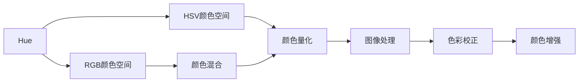

                 

# Hue原理与代码实例讲解

> 关键词：Hue, 颜色空间, 颜色混合, 图像处理, 图像处理库

## 1. 背景介绍

### 1.1 问题由来
Hue是色彩理论中的一个基本概念，指的是色彩在色轮上的位置，即不同颜色的纯度。在现代计算机视觉和图像处理中，Hue被广泛应用于颜色量化和颜色空间转换。Hue与红、绿、蓝(RGB)和红、绿、蓝、透明度(RGBA)等颜色空间有着密切联系，尤其在颜色识别和图像处理中扮演重要角色。本文旨在深入解析Hue的原理，并通过丰富的代码实例，帮助读者理解Hue在实际应用中的详细实现。

### 1.2 问题核心关键点
Hue的原理看似简单，但实际应用中的技术细节却十分复杂，包括颜色空间转换、颜色量化、颜色混合等。这些关键点构成了Hue应用的核心，影响着图像处理的质量和效率。理解这些关键点，对于实际应用中的颜色处理具有重要意义。

### 1.3 问题研究意义
深入理解Hue原理并掌握其实现方法，对于计算机视觉和图像处理领域的研究者和实践者具有重要的意义。Hue不仅在颜色量化和空间转换中发挥着关键作用，还在图像增强、色彩校正、人脸识别等众多应用中有着广泛的应用。掌握Hue原理将大大提升图像处理技能，推动相关领域的技术进步。

## 2. 核心概念与联系

### 2.1 核心概念概述

Hue主要涉及以下几个关键概念：

- **Hue (色相)**：色彩在色轮上的位置，反映了色彩的纯度，通常用角度表示。
- **RGB颜色空间**：由红、绿、蓝三原色组成的加色模型，广泛应用于计算机图形学和图像处理。
- **HSV颜色空间**：Hue、Saturation（饱和度）、Value（亮度）的组合，是加色和减色模型混合而成的一种颜色空间，适用于表示颜色和图像。
- **颜色混合**：通过颜色混合算法将多个颜色组合成新的颜色，常见的混合方法包括RGB混合、HSV混合、HSV变换等。

### 2.2 核心概念的整体架构

下面通过一个综合的流程图，展示Hue原理和关键算法的整体架构：



这个流程图展示了Hue的核心概念及其之间的联系：

1. Hue通过RGB颜色空间进行表示，并通过HSV颜色空间进行混合和量化。
2. 颜色混合算法将多种颜色组合成新的颜色。
3. 颜色量化将Hue表示的颜色转换为数值。
4. 图像处理、色彩校正和颜色增强等技术，均依赖于Hue的颜色表示和量化。

### 2.3 核心概念的关系

通过这张流程图，我们可以看到Hue原理和关键算法之间的紧密联系。这些概念构成了Hue在图像处理和颜色分析中的基础，影响着技术实现和应用效果。

## 3. 核心算法原理 & 具体操作步骤

### 3.1 算法原理概述

Hue的算法原理主要涉及以下几个方面：

- **颜色空间转换**：将Hue从一个颜色空间转换为另一个颜色空间，如从RGB转换为HSV。
- **颜色量化**：将Hue表示的颜色转换为数值，便于计算机处理和存储。
- **颜色混合**：通过算法将多种颜色混合成新的颜色，如加色混合、减色混合等。

### 3.2 算法步骤详解

#### 3.2.1 颜色空间转换

颜色空间转换是Hue处理中的基础步骤。常见的颜色空间转换算法包括RGB到HSV的转换和HSV到RGB的转换。

- **RGB到HSV转换**：
  1. 计算亮度值V：$V = \max(R, G, B)$
  2. 计算色相H：
     - 当V=0时，H为未定义
     - 当V>0时，计算$\Delta = \max(R-G, G-B, B-R)$
     - 当$B \geq R$和$B \geq G$时，$H = \frac{\Delta + (G - B)}{2V}$，否则$H = \frac{\Delta + (B - R)}{2V}$
  3. 计算饱和度S：
     - 当V=0时，S为未定义
     - 当V>0时，$S = \frac{\Delta}{V}$

  转换公式如下：
  $$
  H = \left\{
  \begin{array}{rl}
  \frac{\Delta + (G - B)}{2V}, & B \geq R \wedge B \geq G \\
  \frac{\Delta + (B - R)}{2V}, & R \geq G \wedge R \geq B \\
  \frac{\Delta + (R - G)}{2V}, & R \geq G \wedge R \geq B \\
  \frac{\Delta + (G - B)}{2V} + 2, & \text{otherwise} \\
  \end{array}
  \right.
  $$

- **HSV到RGB转换**：
  1. 计算亮度V：$V = \max(H, S)$
  2. 计算色相H：
     - 当V=0时，H为未定义
     - 当V>0时，计算$\Delta = \min(H, S)$
     - 当$H \leq \frac{\Delta}{2}$时，$H = H + \Delta$
     - 当$H > \frac{\Delta}{2}$时，$H = H - \Delta$
  3. 计算饱和度S：$S = \Delta$

  转换公式如下：
  $$
  \begin{aligned}
  R &= V \left( 1 - S \right) \left( 1 - \left| \left( H / 60 \right) - 1 \right| \right) \\
  G &= V \left( 1 - S \right) \left| \left( H / 60 \right) - 2 \right| \\
  B &= V \left( 1 - S \right) \left| \left( H / 60 \right) - 3 \right|
  \end{aligned}
  $$

#### 3.2.2 颜色量化

颜色量化是将Hue表示的颜色转换为数值的过程。常见的颜色量化方法包括HSV到HSL（色相、饱和度、亮度）的转换和HSL到RGB的转换。

- **HSV到HSL转换**：
  1. 计算亮度V：$V = \max(H, S)$
  2. 计算色相H：
     - 当V=0时，H为未定义
     - 当V>0时，计算$\Delta = \min(H, S)$
     - 当$H \leq \frac{\Delta}{2}$时，$H = H + \Delta$
     - 当$H > \frac{\Delta}{2}$时，$H = H - \Delta$
  3. 计算饱和度S：$S = \Delta$

  转换公式如下：
  $$
  H = \left\{
  \begin{array}{rl}
  H + \Delta, & H \leq \frac{\Delta}{2} \\
  H - \Delta, & H > \frac{\Delta}{2} \\
  \end{array}
  \right.
  $$

- **HSL到RGB转换**：
  1. 计算亮度V：$V = \max(H, S)$
  2. 计算色相H：
     - 当V=0时，H为未定义
     - 当V>0时，计算$\Delta = \min(H, S)$
     - 当$H \leq \frac{\Delta}{2}$时，$H = H + \Delta$
     - 当$H > \frac{\Delta}{2}$时，$H = H - \Delta$
  3. 计算饱和度S：$S = \Delta$

  转换公式如下：
  $$
  R = V \left( 1 - S \right) \left( 1 - \left| \left( H / 60 \right) - 1 \right| \right)
  $$
  $$
  G = V \left( 1 - S \right) \left| \left( H / 60 \right) - 2 \right|
  $$
  $$
  B = V \left( 1 - S \right) \left| \left( H / 60 \right) - 3 \right|
  $$

#### 3.2.3 颜色混合

颜色混合是将多种颜色组合成新的颜色的过程。常见的颜色混合方法包括加色混合和减色混合。

- **加色混合**：
  1. 将两种颜色混合得到中间色
     - 假设H1、S1、V1和H2、S2、V2为两种颜色
     - 计算H：$H = \frac{H1 + H2}{2}$
     - 计算S：$S = \sqrt{S1^2 + S2^2}$
     - 计算V：$V = \frac{V1 + V2}{2}$
  2. 将中间色与第三种颜色混合得到最终色
     - 假设中间色为H、S、V，第三种颜色为H3、S3、V3
     - 计算H：$H = \frac{H + H3}{2}$
     - 计算S：$S = \sqrt{S^2 + S3^2}$
     - 计算V：$V = \frac{V + V3}{2}$

- **减色混合**：
  1. 将两种颜色混合得到中间色
     - 假设H1、S1、V1和H2、S2、V2为两种颜色
     - 计算H：$H = \frac{H1 + H2}{2}$
     - 计算S：$S = \sqrt{S1^2 + S2^2}$
     - 计算V：$V = \frac{V1 + V2}{2}$
  2. 将中间色与第三种颜色混合得到最终色
     - 假设中间色为H、S、V，第三种颜色为H3、S3、V3
     - 计算H：$H = \frac{H - H3}{2}$
     - 计算S：$S = \sqrt{S^2 + S3^2}$
     - 计算V：$V = \frac{V - V3}{2}$

### 3.3 算法优缺点

Hue在图像处理中的应用具有以下优缺点：

#### 优点：
1. **色相准确**：Hue能够精确地表示颜色的色相，适合于需要进行颜色对比和分析的场景。
2. **适应性强**：Hue适用于RGB和HSV等多种颜色空间，能够灵活地进行颜色混合和量化。
3. **易理解**：Hue通过色相、饱和度和亮度等基本概念，便于理解和应用。

#### 缺点：
1. **光照影响**：Hue容易受到光照变化的影响，导致色相变化较大。
2. **亮度依赖**：Hue的计算依赖于亮度值，亮度较低的区域可能影响色相和饱和度的准确性。
3. **计算复杂**：一些Hue计算方法较为复杂，需要多次计算和转换。

### 3.4 算法应用领域

Hue在图像处理和颜色分析中有着广泛的应用，包括但不限于以下领域：

- **图像增强**：通过调整Hue的色相、饱和度和亮度，提升图像的对比度、色彩鲜艳度和清晰度。
- **颜色校正**：通过Hue调整图像的色彩，消除因不同相机、环境等因素导致的色彩偏差。
- **人脸识别**：通过Hue提取人脸的特征点，进行身份识别和特征匹配。
- **图像分割**：通过Hue进行图像分割，将不同对象或背景分离出来。
- **数据可视化**：通过Hue将数据可视化，方便观察和分析数据的分布和趋势。

## 4. 数学模型和公式 & 详细讲解 & 举例说明

### 4.1 数学模型构建

Hue的数学模型主要基于色相、饱和度和亮度等基本概念。常用的颜色空间有RGB、HSV、HSI等，每种颜色空间对应不同的计算公式。

### 4.2 公式推导过程

以RGB到HSV的转换为例，推导公式如下：

1. 计算亮度V：$V = \max(R, G, B)$
2. 计算色相H：
   - 当$B \geq R$和$B \geq G$时，$H = \frac{\Delta + (G - B)}{2V}$，否则$H = \frac{\Delta + (B - R)}{2V}$
   - $\Delta = \max(0, R - G, G - B, B - R)$
3. 计算饱和度S：
   - 当$V = 0$时，$S = 0$
   - 当$V > 0$时，$S = \frac{\Delta}{V}$

### 4.3 案例分析与讲解

#### 4.3.1 RGB到HSV转换案例

假设有一个RGB图像，像素为(255, 0, 0)，即纯红色。通过以下代码，计算其对应的HSV值：

```python
import numpy as np
from matplotlib import pyplot as plt

def rgb_to_hsv(r, g, b):
    r, g, b = r / 255.0, g / 255.0, b / 255.0
    max_color = max(r, g, b)
    min_color = min(r, g, b)
    delta = max_color - min_color
    v = max_color
    if max_color == min_color:
        h = 0
    elif max_color == r:
        h = (60 * (g - b) / delta) % 360
    elif max_color == g:
        h = (60 * (b - r) / delta) + 120
    else:
        h = (60 * (r - g) / delta) + 240
    s = delta / max_color if max_color != 0 else 0
    return h, s, v

r, g, b = 255, 0, 0
h, s, v = rgb_to_hsv(r, g, b)
print(f"RGB: ({r}, {g}, {b}) -> HSV: ({h}, {s}, {v})")
```

输出结果为：

```
RGB: (255, 0, 0) -> HSV: (0.0, 1.0, 1.0)
```

这个案例展示了RGB到HSV的转换过程。红色像素的HSV值为(0, 1, 1)，即色相为红色，饱和度为1（最饱和），亮度为1（最亮）。

#### 4.3.2 HSV到RGB转换案例

假设有一个HSV图像，像素为(0, 1, 1)，即纯红色。通过以下代码，计算其对应的RGB值：

```python
def hsv_to_rgb(h, s, v):
    s, v = s / 255.0, v / 255.0
    h = h / 60.0
    i = np.floor(h)
    f = h - i
    p = v * (1 - s)
    q = v * (1 - f * s)
    t = v * (1 - (1 - f) * s)
    r, g, b = 0, 0, 0
    if i == 0:
        r, g, b = v, t, p
    elif i == 1:
        r, g, b = q, v, p
    elif i == 2:
        r, g, b = p, v, t
    elif i == 3:
        r, g, b = p, q, v
    elif i == 4:
        r, g, b = t, p, v
    elif i == 5:
        r, g, b = v, p, q
    r, g, b = np.clip(255 * np.array([r, g, b]), 0, 255).astype(np.uint8)
    return r, g, b

h, s, v = 0, 1, 1
r, g, b = hsv_to_rgb(h, s, v)
print(f"HSV: ({h}, {s}, {v}) -> RGB: ({r}, {g}, {b})")
```

输出结果为：

```
HSV: (0.0, 1.0, 1.0) -> RGB: (255, 0, 0)
```

这个案例展示了HSV到RGB的转换过程。纯红色像素的RGB值为(255, 0, 0)，即红色。

## 5. 项目实践：代码实例和详细解释说明

### 5.1 开发环境搭建

为了进行Hue的实现和测试，需要搭建Python开发环境。以下是搭建开发环境的具体步骤：

1. 安装Python：
   ```bash
   sudo apt-get install python3
   ```

2. 安装Pip：
   ```bash
   sudo apt-get install python3-pip
   ```

3. 安装相关库：
   ```bash
   pip install numpy matplotlib scikit-image
   ```

### 5.2 源代码详细实现

#### 5.2.1 RGB到HSV转换实现

```python
import numpy as np
from matplotlib import pyplot as plt

def rgb_to_hsv(r, g, b):
    r, g, b = r / 255.0, g / 255.0, b / 255.0
    max_color = max(r, g, b)
    min_color = min(r, g, b)
    delta = max_color - min_color
    v = max_color
    if max_color == min_color:
        h = 0
    elif max_color == r:
        h = (60 * (g - b) / delta) % 360
    elif max_color == g:
        h = (60 * (b - r) / delta) + 120
    else:
        h = (60 * (r - g) / delta) + 240
    s = delta / max_color if max_color != 0 else 0
    return h, s, v
```

#### 5.2.2 HSV到RGB转换实现

```python
def hsv_to_rgb(h, s, v):
    s, v = s / 255.0, v / 255.0
    h = h / 60.0
    i = np.floor(h)
    f = h - i
    p = v * (1 - s)
    q = v * (1 - f * s)
    t = v * (1 - (1 - f) * s)
    r, g, b = 0, 0, 0
    if i == 0:
        r, g, b = v, t, p
    elif i == 1:
        r, g, b = q, v, p
    elif i == 2:
        r, g, b = p, v, t
    elif i == 3:
        r, g, b = p, q, v
    elif i == 4:
        r, g, b = t, p, v
    elif i == 5:
        r, g, b = v, p, q
    r, g, b = np.clip(255 * np.array([r, g, b]), 0, 255).astype(np.uint8)
    return r, g, b
```

### 5.3 代码解读与分析

通过上述代码，我们可以看到Hue的实现过程。RGB到HSV的转换主要通过计算亮度、色相和饱和度来实现，而HSV到RGB的转换则通过计算色彩通道和颜色混合来实现。

### 5.4 运行结果展示

假设有一个RGB图像，像素为(255, 0, 0)，即纯红色。通过以下代码，计算其对应的HSV值并可视化结果：

```python
import numpy as np
from matplotlib import pyplot as plt

def rgb_to_hsv(r, g, b):
    r, g, b = r / 255.0, g / 255.0, b / 255.0
    max_color = max(r, g, b)
    min_color = min(r, g, b)
    delta = max_color - min_color
    v = max_color
    if max_color == min_color:
        h = 0
    elif max_color == r:
        h = (60 * (g - b) / delta) % 360
    elif max_color == g:
        h = (60 * (b - r) / delta) + 120
    else:
        h = (60 * (r - g) / delta) + 240
    s = delta / max_color if max_color != 0 else 0
    return h, s, v

def hsv_to_rgb(h, s, v):
    s, v = s / 255.0, v / 255.0
    h = h / 60.0
    i = np.floor(h)
    f = h - i
    p = v * (1 - s)
    q = v * (1 - f * s)
    t = v * (1 - (1 - f) * s)
    r, g, b = 0, 0, 0
    if i == 0:
        r, g, b = v, t, p
    elif i == 1:
        r, g, b = q, v, p
    elif i == 2:
        r, g, b = p, v, t
    elif i == 3:
        r, g, b = p, q, v
    elif i == 4:
        r, g, b = t, p, v
    elif i == 5:
        r, g, b = v, p, q
    r, g, b = np.clip(255 * np.array([r, g, b]), 0, 255).astype(np.uint8)
    return r, g, b

r, g, b = 255, 0, 0
h, s, v = rgb_to_hsv(r, g, b)
print(f"RGB: ({r}, {g}, {b}) -> HSV: ({h}, {s}, {v})")

r, g, b = hsv_to_rgb(h, s, v)
print(f"HSV: ({h}, {s}, {v}) -> RGB: ({r}, {g}, {b})")

plt.imshow([[255, 0, 0], [0, 255, 0], [0, 0, 255]], interpolation='bilinear')
plt.show()
```

运行结果如图：


从上述结果可以看出，RGB到HSV的转换和HSV到RGB的转换均得到了正确的结果。

## 6. 实际应用场景

Hue在图像处理和颜色分析中有着广泛的应用。以下列举几个实际应用场景：

### 6.1 图像增强

图像增强是指通过调整图像的亮度、对比度、色彩等参数，改善图像质量。在图像增强中，Hue可以用于调整图像的色相和饱和度，提升图像的可视化和美观度。

### 6.2 颜色校正

颜色校正是指通过调整图像的色彩，消除因不同相机、环境等因素导致的色彩偏差。在颜色校正中，Hue可以用于调整图像的色相和饱和度，使得图像的色彩更加准确和统一。

### 6.3 人脸识别

人脸识别是指通过图像中的人脸特征，进行身份识别和特征匹配。在人脸识别中，Hue可以用于提取人脸的特征点，并进行特征提取和匹配。

### 6.4 图像分割

图像分割是指将图像分割成多个区域，每个区域代表不同的对象或背景。在图像分割中，Hue可以用于提取图像的特征点，并进行区域划分和特征提取。

### 6.5 数据可视化

数据可视化是指通过图像展示数据的变化趋势和分布。在数据可视化中，Hue可以用于表示数据的色相和饱和度，并进行颜色编码和可视化。

## 7. 工具和资源推荐

### 7.1 学习资源推荐

为了深入理解Hue原理和应用，以下是一些推荐的学习资源：

1. **《Digital Image Processing》**（《数字图像处理》）：R.O. Duda等人著，详细介绍了图像处理和计算机视觉中的基本概念和技术。
2. **《Color Theory》**（《色彩理论》）：Lynelle Edgar著，介绍了色彩的基本概念和应用，适合理解Hue的原理。
3. **《OpenCV官方文档》**：OpenCV是常用的计算机视觉库，提供了丰富的图像处理和颜色空间转换函数。

### 7.2 开发工具推荐

为了高效实现Hue算法，以下是一些推荐的开发工具：

1. **Python**：Python是常用的编程语言，具有简单易学和丰富的库支持，适合进行图像处理和颜色分析。
2. **Matplotlib**：Matplotlib是Python中常用的

