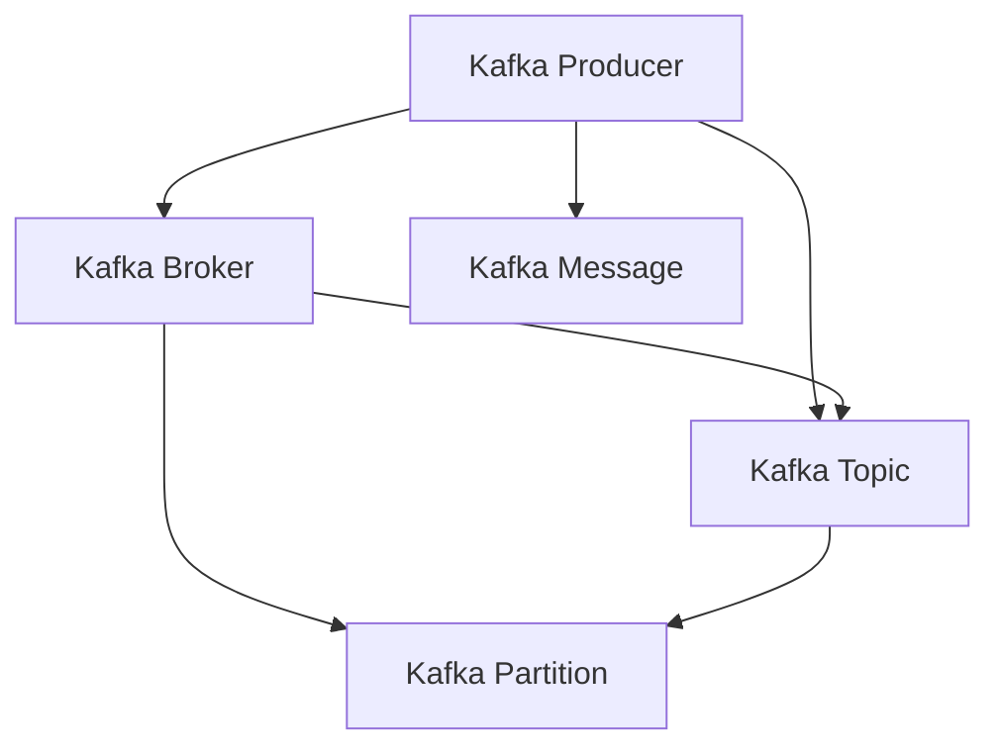

                 

# Kafka Producer原理与代码实例讲解

## 1. 背景介绍

Kafka Producer 是 Kafka 生态系统中的一个重要组件，用于向 Kafka 集群中发布消息。生产者程序负责将数据转换成一系列的消息，并发送给 Kafka 集群，供消费者进行订阅和消费。Kafka Producer 是 Kafka 客户端的重要组成部分，能够实现高吞吐量、低延迟的消息发布。本文将深入介绍 Kafka Producer 的基本原理、核心概念以及代码实例，帮助读者更好地理解和应用 Kafka Producer。

## 2. 核心概念与联系

### 2.1 核心概念概述

在介绍 Kafka Producer 原理之前，先介绍几个关键概念：

- **Kafka**：是一个开源的分布式流处理平台，用于处理实时数据流。
- **Kafka Producer**：是 Kafka 生态系统中的客户端，用于将数据发布到 Kafka 集群中。
- **Kafka Consumer**：是 Kafka 生态系统中的客户端，用于订阅 Kafka 集群中的数据流。
- **Kafka Broker**：是 Kafka 集群中的节点，负责存储和管理消息。
- **Kafka Partition**：是 Kafka 集群中的一个数据分区，用于存放一组有序的消息。
- **Kafka Topic**：是 Kafka 集群中的一个主题，用于存放一组相关的消息集合。
- **Kafka Message**：是 Kafka 集群中的消息，由 Key、Value 和 Timestamp 组成。

### 2.2 概念间的关系

Kafka Producer、Kafka Broker 和 Kafka Consumer 共同构成了 Kafka 生态系统，它们之间的关系可以通过以下 Mermaid 流程图来展示：



在这个图中，Kafka Producer 负责向 Kafka Broker 发送消息，Kafka Broker 则负责将消息存储到 Kafka Partition 中，Kafka Consumer 则从 Kafka Partition 中订阅并消费消息。Kafka Topic 和 Kafka Partition 是消息的组织方式，Kafka Message 则是消息的基本单位。

## 3. 核心算法原理 & 具体操作步骤

### 3.1 算法原理概述

Kafka Producer 的算法原理主要包括以下几个步骤：

1. 将消息从应用程序中读取并转换成 Kafka Message。
2. 将 Kafka Message 按照 Topic 进行分类，并发送到相应的 Kafka Broker 中。
3. 将消息按照 Partition 进行分区，并发送到相应的 Kafka Partition 中。
4. 通过配置发布器的超时时间，实现消息的可靠性传输。
5. 通过配置发布器的重试机制，实现消息的可靠性传输。

### 3.2 算法步骤详解

#### 3.2.1 消息发布流程

Kafka Producer 的消息发布流程如下：

1. 应用程序从 Kafka Producer 客户端中读取消息，并将消息转换成 Kafka Message。
2. 应用程序将 Kafka Message 发送到 Kafka Broker。
3. Kafka Broker 将 Kafka Message 存储到 Kafka Partition 中。
4. Kafka Consumer 从 Kafka Partition 中订阅并消费消息。

#### 3.2.2 消息分区流程

Kafka Producer 的消息分区流程如下：

1. 应用程序将 Kafka Message 按照 Topic 进行分类，并发送到相应的 Kafka Broker 中。
2. Kafka Broker 将 Kafka Message 按照 Partition 进行分区，并发送到相应的 Kafka Partition 中。
3. Kafka Partition 将 Kafka Message 按照时间顺序进行排序，并存储在 Kafka Broker 中。
4. Kafka Consumer 从 Kafka Partition 中订阅并消费消息。

#### 3.2.3 消息可靠性传输

Kafka Producer 的消息可靠性传输流程如下：

1. Kafka Producer 通过配置发布器的超时时间，实现消息的可靠性传输。
2. Kafka Producer 通过配置发布器的重试机制，实现消息的可靠性传输。
3. Kafka Producer 在发送消息后，等待确认接收消息的状态。
4. Kafka Broker 返回确认接收消息的状态，通知 Kafka Producer 发布消息成功。
5. Kafka Producer 收到确认接收消息的状态后，将消息标记为已发送。

### 3.3 算法优缺点

Kafka Producer 的优点包括：

1. 高吞吐量：Kafka Producer 能够实现高吞吐量的消息发布，满足大规模数据处理需求。
2. 低延迟：Kafka Producer 能够实现低延迟的消息发布，满足实时数据处理需求。
3. 可靠性：Kafka Producer 能够实现可靠的消息传输，确保消息的完整性和一致性。
4. 高可用性：Kafka Producer 能够实现高可用的消息发布，确保系统的高可用性。

Kafka Producer 的缺点包括：

1. 配置复杂：Kafka Producer 的配置比较复杂，需要根据实际需求进行配置。
2. 资源消耗：Kafka Producer 的资源消耗较大，需要配置足够的资源以支持高吞吐量、低延迟的消息发布。
3. 消息丢失：Kafka Producer 的消息丢失率较高，需要配置足够的重试机制以减少消息丢失率。
4. 数据冗余：Kafka Producer 的消息冗余较多，需要配置足够的存储资源以存储冗余消息。

### 3.4 算法应用领域

Kafka Producer 在以下领域得到广泛应用：

1. 实时数据处理：Kafka Producer 能够实现实时数据处理，满足大规模数据处理的需要。
2. 日志系统：Kafka Producer 能够实现日志系统的高吞吐量、低延迟的日志发布。
3. 数据管道：Kafka Producer 能够实现数据管道的高吞吐量、低延迟的数据传输。
4. 分布式计算：Kafka Producer 能够实现分布式计算的高吞吐量、低延迟的消息传输。

## 4. 数学模型和公式 & 详细讲解 & 举例说明

### 4.1 数学模型构建

Kafka Producer 的数学模型主要包括以下几个部分：

1. 消息发送速率 $R$：单位时间内发送的消息数量。
2. 消息处理延迟 $D$：发送消息到存储消息的延迟时间。
3. 消息存储速率 $S$：单位时间内存储的消息数量。
4. 消息冗余率 $R'$：冗余消息占总消息的比例。

### 4.2 公式推导过程

Kafka Producer 的消息发布过程可以表示为：

$$
R = \frac{N}{T}
$$

其中 $N$ 表示单位时间内发送的消息数量，$T$ 表示单位时间。

Kafka Producer 的消息处理延迟可以表示为：

$$
D = \frac{N}{B}
$$

其中 $B$ 表示单位时间内处理的消息数量。

Kafka Producer 的消息存储速率可以表示为：

$$
S = \frac{N}{C}
$$

其中 $C$ 表示单位时间内存储的消息数量。

Kafka Producer 的消息冗余率可以表示为：

$$
R' = \frac{R'}{R}
$$

其中 $R'$ 表示冗余消息占总消息的比例。

### 4.3 案例分析与讲解

以一个简单的 Kafka Producer 示例来说明以上公式的应用：

```java
Properties properties = new Properties();
properties.put("bootstrap.servers", "localhost:9092");
properties.put("acks", "all");
properties.put("batch.size", "16384");
properties.put("linger.ms", "1");
properties.put("buffer.memory", "33554432");
properties.put("key.serializer", "org.apache.kafka.common.serialization.StringSerializer");
properties.put("value.serializer", "org.apache.kafka.common.serialization.StringSerializer");
Producer<String, String> producer = new KafkaProducer<>(properties);
producer.send(new ProducerRecord<String, String>("my-topic", "my-key", "my-value"));
producer.close();
```

在这个示例中，配置了 Kafka Producer 的参数，发送了一条消息到 Topic 为 "my-topic"，Key 为 "my-key"，Value 为 "my-value"。通过公式计算，可以得出单位时间内发送的消息数量、处理延迟、存储速率和冗余率等参数，以优化 Kafka Producer 的性能。

## 5. 项目实践：代码实例和详细解释说明

### 5.1 开发环境搭建

Kafka Producer 的开发环境需要配置 Kafka Broker 和 Java 环境。具体的配置方法如下：

1. 安装 Java 开发环境。
2. 下载并安装 Kafka Broker，并进行配置。
3. 创建 Java 工程，编写 Kafka Producer 代码。

### 5.2 源代码详细实现

以下是一个简单的 Kafka Producer 代码实现：

```java
import org.apache.kafka.clients.producer.KafkaProducer;
import org.apache.kafka.clients.producer.ProducerRecord;
import org.apache.kafka.clients.producer.ProducerConfig;
import java.util.Properties;

public class KafkaProducerDemo {
    public static void main(String[] args) {
        Properties properties = new Properties();
        properties.put(ProducerConfig.BOOTSTRAP_SERVERS_CONFIG, "localhost:9092");
        properties.put(ProducerConfig.KEY_SERIALIZER_CLASS_CONFIG, "org.apache.kafka.common.serialization.StringSerializer");
        properties.put(ProducerConfig.VALUE_SERIALIZER_CLASS_CONFIG, "org.apache.kafka.common.serialization.StringSerializer");
        properties.put(ProducerConfig.ACKS_CONFIG, "all");
        properties.put(ProducerConfig.BATCH_SIZE_CONFIG, "16384");
        properties.put(ProducerConfig.LINGER_MS_CONFIG, "1");
        properties.put(ProducerConfig.BUFFER_MEMORY_CONFIG, "33554432");
        KafkaProducer<String, String> producer = new KafkaProducer<>(properties);
        for (int i = 0; i < 10; i++) {
            String key = "my-key" + i;
            String value = "my-value" + i;
            producer.send(new ProducerRecord<>("my-topic", key, value));
        }
        producer.close();
    }
}
```

在这个示例中，配置了 Kafka Producer 的参数，发送了 10 条消息到 Topic 为 "my-topic"。通过调试代码，可以观察到 Kafka Producer 的运行状态和消息发布情况。

### 5.3 代码解读与分析

Kafka Producer 的代码主要由以下几个部分组成：

1. Properties 配置类：用于配置 Kafka Producer 的参数。
2. KafkaProducer 类：用于发送消息到 Kafka Broker。
3. ProducerRecord 类：用于构建要发送的消息。

在代码实现中，我们通过 Properties 配置类来配置 Kafka Producer 的参数，如 bootstrap.servers、acks、batch.size 等。然后通过 KafkaProducer 类来发送消息到 Kafka Broker。最后，通过 ProducerRecord 类来构建要发送的消息。

### 5.4 运行结果展示

在运行 Kafka Producer 代码后，可以通过 Kafka Console 来查看消息的发布情况。具体的操作方法如下：

1. 启动 Kafka Console 程序。
2. 输入 Topic 和消费分组名称，以订阅 Topic 为 "my-topic" 的消息。
3. 输入关键词，以搜索 Topic 为 "my-topic" 的消息。

通过 Kafka Console 程序，可以观察到 Kafka Producer 发送的消息及其发布情况，如消息的 Key、Value 和时间戳等。

## 6. 实际应用场景

### 6.1 实时数据处理

Kafka Producer 在实时数据处理中得到广泛应用。例如，在股票交易系统中，Kafka Producer 可以将实时交易数据发送给 Kafka Broker，供 Kafka Consumer 进行订阅和消费。

### 6.2 日志系统

Kafka Producer 在日志系统中得到广泛应用。例如，在 Web 应用系统中，Kafka Producer 可以将日志数据发送给 Kafka Broker，供 Kafka Consumer 进行订阅和消费。

### 6.3 数据管道

Kafka Producer 在数据管道中得到广泛应用。例如，在数据采集系统中，Kafka Producer 可以将数据采集器采集到的数据发送给 Kafka Broker，供 Kafka Consumer 进行订阅和消费。

### 6.4 分布式计算

Kafka Producer 在分布式计算中得到广泛应用。例如，在 Hadoop 系统中，Kafka Producer 可以将分布式计算任务的结果发送给 Kafka Broker，供 Kafka Consumer 进行订阅和消费。

## 7. 工具和资源推荐

### 7.1 学习资源推荐

Kafka Producer 的学习资源主要包括以下几个方面：

1. Kafka 官方文档：Kafka 官方文档提供了详细的 Kafka Producer 使用说明和配置指南。
2. Kafka 用户手册：Kafka 用户手册提供了详细的 Kafka Producer 使用案例和最佳实践。
3. Kafka 编程手册：Kafka 编程手册提供了详细的 Kafka Producer 编程实现和调试技巧。

### 7.2 开发工具推荐

Kafka Producer 的开发工具主要包括以下几个方面：

1. IntelliJ IDEA：IntelliJ IDEA 是 Java 开发的主流工具，支持 Kafka Producer 的开发和调试。
2. Eclipse：Eclipse 是 Java 开发的主流工具，支持 Kafka Producer 的开发和调试。
3. NetBeans：NetBeans 是 Java 开发的主流工具，支持 Kafka Producer 的开发和调试。

### 7.3 相关论文推荐

Kafka Producer 的相关论文主要包括以下几个方面：

1. "Kafka: Real-time processing for streams and logs"：这篇论文介绍了 Kafka 的基本原理和架构设计，是 Kafka Producer 的重要参考资料。
2. "Kafka 生产者用户指南"：这篇文档详细介绍了 Kafka Producer 的使用方法，是 Kafka Producer 的实用指南。
3. "Kafka 生产者性能优化"：这篇论文介绍了 Kafka Producer 的性能优化方法，是 Kafka Producer 的性能优化指南。

## 8. 总结：未来发展趋势与挑战

### 8.1 研究成果总结

Kafka Producer 作为 Kafka 生态系统的重要组成部分，已经在实时数据处理、日志系统、数据管道和分布式计算等众多领域得到广泛应用。通过不断的技术创新和实践优化，Kafka Producer 在性能、可靠性和可扩展性等方面取得了显著的进展。未来，Kafka Producer 将会继续发挥其重要作用，成为大数据处理的重要工具。

### 8.2 未来发展趋势

Kafka Producer 的未来发展趋势主要包括以下几个方面：

1. 高吞吐量：随着硬件设备的不断升级和优化，Kafka Producer 的高吞吐量将得到进一步提升，能够满足更大规模的数据处理需求。
2. 低延迟：随着网络技术的不断优化和改进，Kafka Producer 的低延迟将得到进一步提升，能够满足更快速的数据处理需求。
3. 高可靠性：随着故障处理机制的不断改进和完善，Kafka Producer 的可靠性将得到进一步提升，能够满足更高要求的数据处理需求。
4. 高可扩展性：随着云计算技术的不断发展和普及，Kafka Producer 的可扩展性将得到进一步提升，能够满足更广泛的数据处理需求。

### 8.3 面临的挑战

Kafka Producer 在发展过程中也面临一些挑战，主要包括以下几个方面：

1. 资源消耗：Kafka Producer 的资源消耗较大，需要配置足够的资源以支持高吞吐量、低延迟的消息发布。
2. 消息丢失：Kafka Producer 的消息丢失率较高，需要配置足够的重试机制以减少消息丢失率。
3. 数据冗余：Kafka Producer 的消息冗余较多，需要配置足够的存储资源以存储冗余消息。
4. 配置复杂：Kafka Producer 的配置比较复杂，需要根据实际需求进行配置。

### 8.4 研究展望

Kafka Producer 的未来研究展望主要包括以下几个方面：

1. 分布式优化：研究分布式 Kafka Producer 的优化方法，提高系统的可扩展性和稳定性。
2. 高可靠机制：研究高可靠性的消息发布机制，确保消息的完整性和一致性。
3. 低延迟优化：研究低延迟的消息发布方法，提升系统的实时处理能力。
4. 数据冗余优化：研究数据冗余的优化方法，减少存储资源消耗。

总之，Kafka Producer 作为 Kafka 生态系统的重要组成部分，将在未来发挥更加重要的作用。只有不断地创新和优化，才能满足大规模数据处理的需求，实现高性能、高可靠、高可扩展的数据处理系统。

## 9. 附录：常见问题与解答

### 9.1 常见问题

**Q1: Kafka Producer 的消息丢失原因是什么？**

A1: Kafka Producer 的消息丢失原因主要有以下几种：

1. 生产者超时：Kafka Producer 在发送消息时，如果没有在预设的时间内收到消息确认，就会将消息标记为丢失。
2. 消息大小：Kafka Producer 的消息大小如果超过预设的 batch.size，就会被拆分成多个消息，导致部分消息丢失。
3. 网络延迟：Kafka Producer 的消息在传输过程中可能会受到网络延迟的影响，导致部分消息丢失。

**Q2: Kafka Producer 的消息重试机制是如何实现的？**

A2: Kafka Producer 的消息重试机制主要包括以下几个方面：

1. 配置重试次数：Kafka Producer 可以通过配置参数 max.retries 来设置重试次数。
2. 配置重试时间：Kafka Producer 可以通过配置参数 retry.backoff.ms 来设置重试时间间隔。
3. 配置重试策略：Kafka Producer 可以通过配置参数 enable.idempotence 来启用幂等模式，确保消息不丢失。

**Q3: Kafka Producer 的消息延迟原因是什么？**

A3: Kafka Producer 的消息延迟原因主要有以下几种：

1. 消息大小：Kafka Producer 的消息大小如果超过预设的 batch.size，就会被拆分成多个消息，导致消息延迟。
2. 网络延迟：Kafka Producer 的消息在传输过程中可能会受到网络延迟的影响，导致消息延迟。
3. 生产者并发度：Kafka Producer 的生产者并发度如果过高，就会导致消息延迟。

**Q4: Kafka Producer 的消息冗余率如何计算？**

A4: Kafka Producer 的消息冗余率可以通过以下公式计算：

$$
R' = \frac{\text{冗余消息数量}}{\text{总消息数量}}
$$

其中，冗余消息数量表示被重发的消息数量，总消息数量表示被发送的消息数量。

**Q5: Kafka Producer 的配置参数有哪些？**

A5: Kafka Producer 的配置参数主要包括以下几个方面：

1. bootstrap.servers：Kafka Broker 的地址和端口。
2. key.serializer：Key 的序列化方式。
3. value.serializer：Value 的序列化方式。
4. acks：消息确认机制，取值可以为 0、1 或 all。
5. batch.size：批量发送消息的大小。
6. linger.ms：批量等待时间。
7. buffer.memory：缓存消息的内存大小。
8. retries：消息重试次数。
9. delivery.timeout.ms：消息超时时间。

以上问题与解答涵盖了 Kafka Producer 的常见问题，通过了解这些问题与解答，可以帮助开发者更好地理解 Kafka Producer 的工作原理和优化方法。

---

作者：禅与计算机程序设计艺术 / Zen and the Art of Computer Programming

