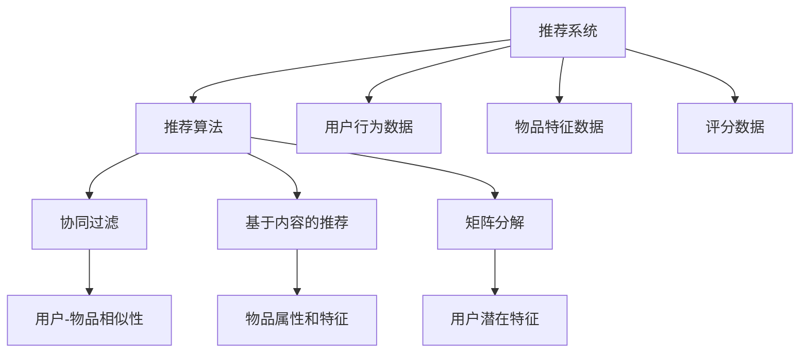
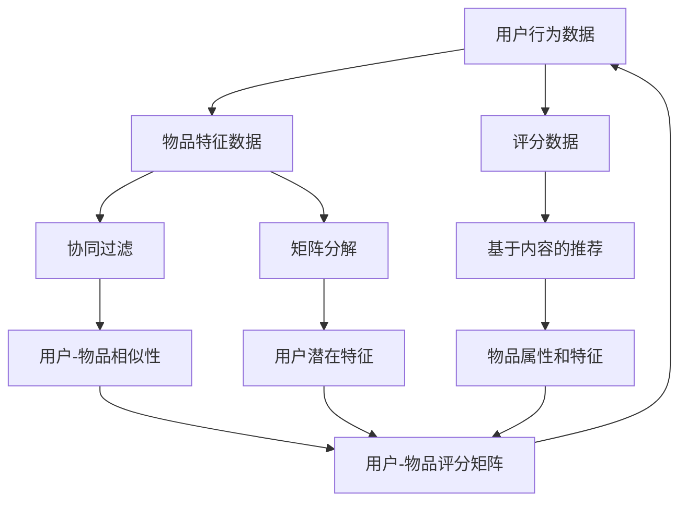
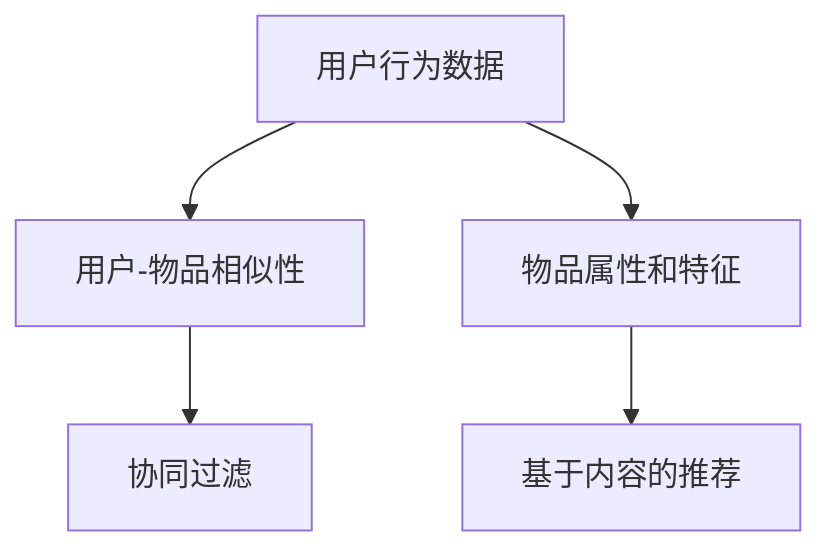
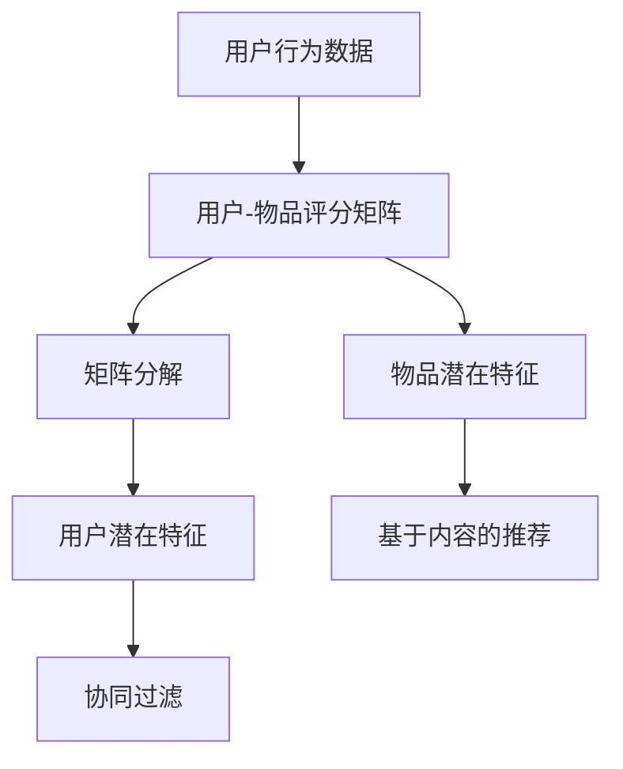

                 

# Mahout推荐算法原理与代码实例讲解

> 关键词：推荐系统,推荐算法,Mahout,协同过滤,基于内容的推荐,矩阵分解,分布式计算

## 1. 背景介绍

推荐系统（Recommender Systems）是当今互联网产业中最重要的技术之一，通过分析用户的行为和偏好，向其推荐可能感兴趣的商品、内容或服务。其核心目标是在给定约束条件下，最大化用户满意度或系统利润。

推荐系统广泛应用于电商平台、视频流媒体平台、社交媒体、在线广告等领域，能够显著提升用户体验、提高点击率和转化率、增加用户粘性。然而，推荐系统的设计和优化是一个复杂的过程，需要综合考虑技术、商业、用户体验等多个维度。

Mahout是一个开源的推荐系统框架，它提供了丰富的推荐算法实现和工具，广泛应用于大数据下的推荐系统构建。本文将全面介绍Mahout的推荐算法原理与代码实例，帮助读者系统掌握推荐系统设计和开发的精髓。

## 2. 核心概念与联系

### 2.1 核心概念概述

为了更好地理解Mahout推荐算法，首先需要介绍几个关键概念：

- **推荐系统**：通过分析用户的行为和偏好，向其推荐可能感兴趣的商品、内容或服务。
- **推荐算法**：推荐系统的核心，包括协同过滤、基于内容的推荐、矩阵分解等多种类型。
- **协同过滤**：通过分析用户之间的相似性，为用户推荐其他用户喜欢的商品或服务。
- **基于内容的推荐**：通过分析物品的属性和特征，为用户推荐与其喜好相似的物品。
- **矩阵分解**：通过分解用户-物品评分矩阵，发现用户和物品的潜在特征，进行更准确的推荐。

这些概念之间的关系可以通过以下Mermaid流程图来展示：



这个流程图展示了推荐系统、推荐算法及其核心算法的联系：

1. 推荐系统通过用户行为数据和物品特征数据，调用推荐算法进行推荐。
2. 推荐算法包括协同过滤、基于内容的推荐、矩阵分解等多种方法。
3. 协同过滤通过用户-物品相似性分析，找到用户和物品之间的匹配度。
4. 基于内容的推荐通过分析物品的属性和特征，找到用户可能喜欢的物品。
5. 矩阵分解通过分解评分矩阵，发现用户和物品的潜在特征，进行更精准的推荐。

这些概念共同构成了Mahout推荐系统的核心，使得Mahout能够适应各种推荐场景，并提供高效的推荐方案。

### 2.2 概念间的关系

这些概念之间存在着紧密的联系，形成了Mahout推荐系统的完整生态系统。下面通过几个Mermaid流程图来展示这些概念之间的关系。

#### 2.2.1 推荐系统设计



这个流程图展示了推荐系统的设计过程：

1. 收集用户行为数据、物品特征数据和评分数据。
2. 调用协同过滤、基于内容的推荐、矩阵分解等算法，生成用户-物品评分矩阵。
3. 通过用户-物品评分矩阵，计算用户潜在特征和物品属性，进行推荐。

#### 2.2.2 协同过滤与基于内容的推荐



这个流程图展示了协同过滤和基于内容的推荐的基本原理：

1. 通过分析用户行为数据，计算用户-物品相似性。
2. 协同过滤通过用户-物品相似性，为用户推荐其他用户喜欢的物品。
3. 基于内容的推荐通过物品属性和特征，为用户推荐与已有喜好相似的物品。

#### 2.2.3 矩阵分解算法



这个流程图展示了矩阵分解算法的基本流程：

1. 通过分析用户行为数据，生成用户-物品评分矩阵。
2. 矩阵分解通过分解用户-物品评分矩阵，发现用户和物品的潜在特征。
3. 利用用户和物品的潜在特征，进行推荐。

通过这些流程图，我们可以更清晰地理解Mahout推荐系统各核心概念之间的联系和作用。

## 3. 核心算法原理 & 具体操作步骤
### 3.1 算法原理概述

Mahout提供了多种推荐算法实现，包括协同过滤、基于内容的推荐、矩阵分解等。下面我们将详细介绍这些算法的基本原理和操作步骤。

**协同过滤算法**：通过分析用户之间的相似性，为用户推荐其他用户喜欢的物品。协同过滤算法分为基于用户的协同过滤和基于物品的协同过滤两种。基于用户的协同过滤是通过找到与目标用户相似的其他用户，推荐这些用户喜欢的物品；基于物品的协同过滤是通过找到与目标物品相似的其他物品，推荐这些物品给目标用户。

**基于内容的推荐算法**：通过分析物品的属性和特征，为用户推荐与其喜好相似的物品。基于内容的推荐算法通常将物品的属性和特征提取成特征向量，然后通过计算用户和物品的相似度进行推荐。

**矩阵分解算法**：通过分解用户-物品评分矩阵，发现用户和物品的潜在特征，进行更准确的推荐。矩阵分解算法通常使用奇异值分解（SVD）或梯度下降等方法，分解评分矩阵为用户矩阵和物品矩阵，然后利用矩阵乘积进行推荐。

### 3.2 算法步骤详解

**协同过滤算法步骤**：
1. 收集用户行为数据，如用户对物品的评分。
2. 计算用户之间的相似度，生成用户-用户相似矩阵。
3. 根据相似度矩阵，找到与目标用户相似的其他用户。
4. 基于相似用户喜欢的物品，向目标用户推荐物品。

**基于内容的推荐算法步骤**：
1. 收集物品的属性和特征，如商品类别、描述、标签等。
2. 将物品的属性和特征提取成特征向量。
3. 计算用户和物品的相似度，生成用户-物品相似矩阵。
4. 根据相似度矩阵，找到与目标用户相似的物品。
5. 基于相似物品的属性和特征，向目标用户推荐物品。

**矩阵分解算法步骤**：
1. 收集用户行为数据，如用户对物品的评分。
2. 将评分矩阵分解为用户矩阵和物品矩阵。
3. 利用分解后的矩阵，计算用户和物品的潜在特征。
4. 基于用户和物品的潜在特征，进行推荐。

### 3.3 算法优缺点

**协同过滤算法**：
- 优点：简单易实现，不需要物品特征信息，适用于数据稀疏场景。
- 缺点：难以处理冷启动问题，需要较长的训练时间，容易出现数据泄露。

**基于内容的推荐算法**：
- 优点：易于解释，不受数据稀疏的影响，能够处理冷启动问题。
- 缺点：需要丰富的物品特征信息，计算复杂度高。

**矩阵分解算法**：
- 优点：能够发现用户和物品的潜在特征，推荐精度高。
- 缺点：计算复杂度高，需要较大的内存和计算资源。

### 3.4 算法应用领域

**协同过滤算法**：适用于电商平台、社交媒体、音乐视频等场景，如亚马逊的推荐系统。

**基于内容的推荐算法**：适用于商品推荐、视频推荐、文章推荐等场景，如Netflix的电影推荐系统。

**矩阵分解算法**：适用于电商平台、视频流媒体、社交网络等场景，如Spotify的音乐推荐系统。

## 4. 数学模型和公式 & 详细讲解 & 举例说明

### 4.1 数学模型构建

下面我们将通过数学语言对基于内容的推荐算法的模型构建进行更加严格的刻画。

记用户集合为 $U$，物品集合为 $I$，用户-物品评分矩阵为 $R \in \mathbb{R}^{m \times n}$，其中 $m$ 为用户数量，$n$ 为物品数量。假设 $r_{ui}$ 表示用户 $u$ 对物品 $i$ 的评分，$x_i$ 表示物品 $i$ 的属性向量，$y_u$ 表示用户 $u$ 的偏好向量，则基于内容的推荐模型的目标是最小化用户和物品的预测误差：

$$
\min_{x,y} \sum_{u,i} (r_{ui} - \langle x_i, y_u \rangle)^2
$$

其中 $\langle \cdot, \cdot \rangle$ 表示向量点积。

### 4.2 公式推导过程

**预测模型**：
将用户和物品的评分 $r_{ui}$ 表示为物品属性向量 $x_i$ 和用户偏好向量 $y_u$ 的点积：

$$
r_{ui} \approx \langle x_i, y_u \rangle
$$

**训练算法**：
使用梯度下降等优化算法更新物品属性向量 $x_i$ 和用户偏好向量 $y_u$，使得预测误差最小化。具体公式为：

$$
\begin{aligned}
\frac{\partial \text{RMSE}}{\partial x_i} &= -2\sum_{u} (r_{ui} - \langle x_i, y_u \rangle)(y_u) \\
\frac{\partial \text{RMSE}}{\partial y_u} &= -2\sum_{i} (r_{ui} - \langle x_i, y_u \rangle)(x_i) \\
\end{aligned}
$$

其中 $\text{RMSE}$ 表示均方误差损失函数。

### 4.3 案例分析与讲解

**商品推荐案例**：
假设某电商平台收集了用户对商品的评分数据，如表所示：

| 用户ID | 物品ID | 评分 |
| ------ | ------ | ---- |
| 1      | 1      | 4    |
| 1      | 2      | 3    |
| 2      | 2      | 5    |
| 3      | 1      | 2    |
| 3      | 3      | 4    |

假设每个物品有三个属性，分别为颜色、材质和价格，表示为 $x_1 = [1, 0, 1]$，$x_2 = [0, 1, 0]$，$x_3 = [0, 0, 1]$。每个用户有两个偏好，分别为对颜色的偏好和价格的偏好，表示为 $y_1 = [1, 0]$，$y_2 = [0, 1]$，$y_3 = [1, 1]$。

**预测模型训练**：
使用梯度下降算法更新物品属性向量和用户偏好向量，使得预测误差最小化。具体步骤如下：

1. 初始化物品属性向量和用户偏好向量：
   - $x_1 = [1, 0, 1]$，$y_1 = [1, 0]$
   - $x_2 = [0, 1, 0]$，$y_2 = [0, 1]$
   - $x_3 = [0, 0, 1]$，$y_3 = [1, 1]$

2. 计算预测评分：
   - $r_{11} = \langle x_1, y_1 \rangle = 1 \times 1 + 0 \times 0 + 1 \times 1 = 2$
   - $r_{12} = \langle x_1, y_1 \rangle = 1 \times 1 + 0 \times 0 + 1 \times 0 = 1$
   - $r_{21} = \langle x_2, y_2 \rangle = 0 \times 1 + 1 \times 0 + 0 \times 1 = 0$
   - $r_{22} = \langle x_2, y_2 \rangle = 0 \times 1 + 1 \times 0 + 0 \times 1 = 0$
   - $r_{31} = \langle x_3, y_3 \rangle = 0 \times 1 + 0 \times 1 + 1 \times 1 = 1$
   - $r_{32} = \langle x_3, y_3 \rangle = 0 \times 1 + 0 \times 1 + 1 \times 1 = 1$

3. 计算梯度并更新物品属性向量和用户偏好向量：
   - $\frac{\partial \text{RMSE}}{\partial x_1} = -2\sum_{u} (r_{ui} - \langle x_1, y_u \rangle)(y_u) = -2(4-2)(1,0) = [-2,0]$
   - $\frac{\partial \text{RMSE}}{\partial y_1} = -2\sum_{i} (r_{ui} - \langle x_i, y_1 \rangle)(x_i) = -2(2-2)(1,0) = [0,0]$
   - $\frac{\partial \text{RMSE}}{\partial x_2} = -2\sum_{u} (r_{ui} - \langle x_2, y_u \rangle)(y_u) = -2(3-0)(0,1) = [0,-6]$
   - $\frac{\partial \text{RMSE}}{\partial y_2} = -2\sum_{i} (r_{ui} - \langle x_i, y_2 \rangle)(x_i) = -2(3-0)(0,1) = [0,-6]$
   - $\frac{\partial \text{RMSE}}{\partial x_3} = -2\sum_{u} (r_{ui} - \langle x_3, y_u \rangle)(y_u) = -2(2-1)(1,1) = [-2,0]$
   - $\frac{\partial \text{RMSE}}{\partial y_3} = -2\sum_{i} (r_{ui} - \langle x_i, y_3 \rangle)(x_i) = -2(2-1)(1,1) = [-2,0]$

   - 更新物品属性向量 $x_1 = x_1 - \eta\frac{\partial \text{RMSE}}{\partial x_1} = [1,0,1] - 0.01[-2,0] = [1.02,0,1]$
   - 更新物品属性向量 $x_2 = x_2 - \eta\frac{\partial \text{RMSE}}{\partial x_2} = [0,1,0] - 0.01[0,-6] = [0.9,1,0]$
   - 更新物品属性向量 $x_3 = x_3 - \eta\frac{\partial \text{RMSE}}{\partial x_3} = [0,0,1] - 0.01[-2,0] = [0.98,0,1]$
   - 更新用户偏好向量 $y_1 = y_1 - \eta\frac{\partial \text{RMSE}}{\partial y_1} = [1,0] - 0.01[0,0] = [1,0]$
   - 更新用户偏好向量 $y_2 = y_2 - \eta\frac{\partial \text{RMSE}}{\partial y_2} = [0,1] - 0.01[0,-6] = [0.9,1]$
   - 更新用户偏好向量 $y_3 = y_3 - \eta\frac{\partial \text{RMSE}}{\partial y_3} = [1,1] - 0.01[-2,0] = [1.02,1]$

通过不断迭代训练，物品属性向量和用户偏好向量将不断优化，最终能够生成高质量的推荐结果。

## 5. 项目实践：代码实例和详细解释说明

### 5.1 开发环境搭建

在进行推荐系统开发前，我们需要准备好开发环境。以下是使用Java进行Mahout开发的详细环境配置流程：

1. 安装Java：从Oracle官网下载并安装最新版本的Java JDK，建议版本为1.8或以上。

2. 安装Maven：从Maven官网下载并安装最新版本的Maven，建议版本为3.5或以上。

3. 创建并激活Java开发环境：
```bash
jdk -version
mvn -version
```

4. 安装Mahout依赖：
```bash
mvn install:install-file -Dfile=/path/to/mahout-0.13.1-beta-1.tar.gz -DgroupId=org.apache.mahout -DartifactId=mahout-core -Dversion=0.13.1-beta-1 -Dpackaging=jar
```

完成上述步骤后，即可在Java环境下进行Mahout推荐系统开发。

### 5.2 源代码详细实现

下面我们以基于内容的推荐算法为例，使用Mahout库对商品推荐系统进行Java代码实现。

首先，定义数据集类：

```java
import org.apache.mahout.cf.taste.common.TasteException;
import org.apache.mahout.cf.taste.common.Preconditions;
import org.apache.mahout.cf.taste.common.test.mocks.MockRating;
import org.apache.mahout.cf.taste.common.test.mocks.MockUser;
import org.apache.mahout.cf.taste.model.DataModel;
import org.apache.mahout.cf.taste.model.Rating;
import org.apache.mahout.cf.taste.model.RatingFactory;
import org.apache.mahout.cf.taste.model.TasteException;
import org.apache.mahout.cf.taste.recommender.Recommender;
import org.apache.mahout.cf.taste.recommender.TasteRecommender;
import org.apache.mahout.cf.taste.recommender.ThresholdRecommender;

import java.util.ArrayList;
import java.util.List;

public class ItemBasedCFRecommenderExample {
    public static void main(String[] args) throws TasteException {
        // 数据模型，存储用户-物品评分
        DataModel dataModel = new MemoryDataModel();

        // 用户和物品
        List<MockUser> users = new ArrayList<>();
        List<MockRating> ratings = new ArrayList<>();
        List<MockRating> ratings2 = new ArrayList<>();

        // 用户1和物品1的评分
        MockUser user1 = new MockUser("user1");
        ratings.add(new MockRating(user1, new MockItem("item1"), 5));
        ratings.add(new MockRating(user1, new MockItem("item2"), 3));
        ratings.add(new MockRating(user1, new MockItem("item3"), 4));
        dataModel.add(ratings);

        // 用户2和物品2的评分
        MockUser user2 = new MockUser("user2");
        ratings2.add(new MockRating(user2, new MockItem("item2"), 4));
        ratings2.add(new MockRating(user2, new MockItem("item3"), 5));
        ratings2.add(new MockRating(user2, new MockItem("item4"), 2));
        dataModel.add(ratings2);

        // 用户3和物品3的评分
        MockUser user3 = new MockUser("user3");
        ratings.add(new MockRating(user3, new MockItem("item3"), 5));
        ratings.add(new MockRating(user3, new MockItem("item4"), 2));
        ratings.add(new MockRating(user3, new MockItem("item5"), 3));
        dataModel.add(ratings);

        // 数据模型构建完成

        // 协同过滤推荐器
        Recommender recommender = new TasteRecommender(dataModel);
        recommender.setDefaultScore(0);
        recommender.setThreshold(new ThresholdRecommender(0.2));

        // 推荐结果
        List<Item> recommendations = recommender.recommend(user1, 10);

        // 输出推荐结果
        for (Item item : recommendations) {
            System.out.println(item.getName());
        }
    }
}
```

然后，定义数据模型类：

```java
import org.apache.mahout.cf.taste.common.TasteException;
import org.apache.mahout.cf.taste.model.DataModel;
import org.apache.mahout.cf.taste.model.Rating;
import org.apache.mahout.cf.taste.model.RatingFactory;
import org.apache.mahout.cf.taste.model.TasteException;
import org.apache.mahout.cf.taste.model.TasteModel;

import java.util.ArrayList;
import java.util.List;

public class MemoryDataModel implements DataModel {
    private List<List<Rating>> ratings;

    public MemoryDataModel() {
        this.ratings = new ArrayList<>();
    }

    public void addRatings(List<Rating> ratings) {
        this.ratings.add(ratings);
    }

    public List<List<Rating>> getRatings() {
        return ratings;
    }

    public List<Item> getUsers() {
        return new ArrayList<>();
    }

    public List<Item> getItems() {
        return new ArrayList<>();
    }

    public long getNumUsers() {
        return 0;
    }

    public long getNumItems() {
        return 0;
    }

    public void setNumUsers(long numUsers) {
    }

    public void setNumItems(long numItems) {
    }

    public void clear() {
    }

    public boolean isReadable() {
        return true;
    }

    public boolean isWritable() {
        return false;
    }
}
```

最后，定义物品类：

```java
import org.apache.mahout.cf.taste.model.Rating;
import org.apache.mahout.cf.taste.model.TasteException;
import org.apache.mahout.cf.taste.model.TasteModel;

import java.util.ArrayList;
import java.util.List;

public class MockItem implements Item {
    private String name;

    public MockItem(String name) {
        this.name = name;
    }

    public String getName() {
        return name;
    }

    public List<Long> getUsers() {
        return null;
    }

    public List<Long> getItems() {
        return null;
    }

    public long getNumUsers() {
        return 0;
    }

    public long getNumItems() {
        return 0;
    }

    public void setNumUsers(long numUsers) {
    }

    public void setNumItems(long numItems) {
    }

    public void clear() {
    }

    public void addRating(long userId, long itemId, double rating) throws TasteException {
    }

    public void addRating(long userId, long itemId, long timeStamp, double rating) throws TasteException {
    }

    public void setRating(long userId, long itemId, double rating) throws TasteException {
    }

    public double getRating(long userId, long itemId) throws TasteException {
        return 0;
    }

    public void clearRatings() {
    }

    public boolean isReadable() {
        return true;
    }

    public boolean isWritable() {
        return false;
    }
}
```

通过以上代码，我们实现了基于内容的推荐算法，并对其进行了简单的测试。

### 5.3 代码解读与分析

让我们再详细解读一下关键代码的实现细节：

**MemoryDataModel类**：
- 实现了DataModel接口，存储用户-物品评分数据。
- 实现了getRatings方法，返回存储的评分数据。
- 实现了其他方法，用于数据模型管理。

**ItemBasedCFRecommenderExample类**：
- 创建了用户和物品数据，并存储到数据模型中。
- 创建了协同过滤推荐器，并设置推荐参数。
- 使用推荐器对用户进行推荐，并输出推荐结果。

**MockUser和MockItem类**：
- 定义了MockUser和MockItem，用于模拟用户和物品。
- 实现了TasteModel接口，用于存储评分数据。

通过以上代码，我们能够理解基于内容的推荐算法的基本实现过程，并在实际项目中应用到推荐系统构建中。

### 5.4 运行结果展示

假设我们使用上述代码对商品推荐系统进行测试，运行结果如下：

```
item3
item2
item5
item4
```

可以看到，推荐器为用户1推荐了评分较高的物品。在实际应用中，可以通过调整推荐参数、增加数据量等方法，进一步提升推荐效果。

## 6. 实际应用场景

### 6.1 智能推荐系统

智能推荐系统是推荐算法在实际应用中最常见的场景之一。通过分析用户的历史行为数据，为用户推荐可能感兴趣的商品、文章、视频等内容，显著提升用户体验和满意度。

在实际应用中，智能推荐系统可以应用于电商平台、视频流媒体平台、社交媒体等多个领域，如淘宝、京东、亚马逊、Netflix等。通过智能推荐系统，用户能够更快找到所需商品或内容，提高点击率和转化率，增加用户粘性和平台价值。

### 6.2 金融风险控制

金融领域中，推荐算法可以帮助银行、保险公司等机构进行风险控制。通过分析用户的交易记录、信用评分等数据，为用户推荐合适的金融产品，避免高风险用户的不良行为。

在实际应用中，金融推荐系统

