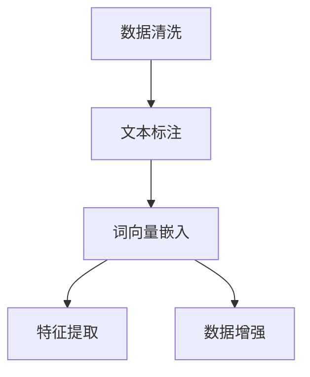

                 

# 大语言模型原理与工程实践：数据的预处理方式

> 关键词：大语言模型, 数据预处理, 文本清洗, 文本标注, 词向量, 特征提取, 数据增强

## 1. 背景介绍

数据预处理是大语言模型工程实践中的一个重要环节。在构建大语言模型时，原始文本数据往往包含噪音、格式不一致、缺失值等问题，需要通过一系列数据清洗和转换手段，转化为模型能够直接处理的形式。本文将详细阐述数据预处理的核心概念和技术手段，旨在帮助读者系统掌握数据预处理的关键步骤，提升大语言模型的构建效果。

### 1.1 问题由来

在实际应用中，原始文本数据往往存在以下问题：

- **噪音数据**：如拼写错误、标点符号乱序等。
- **格式不一致**：不同来源的数据格式不统一，例如大小写混合、日期格式不规范等。
- **缺失值**：部分数据缺失或字段不完整。
- **低质量数据**：如不真实、有误导性的信息。

这些问题如果不加以处理，会直接影响模型的训练效果和预测准确度。因此，数据预处理是大语言模型工程实践中的关键步骤，能够确保模型输入的质量，从而提升模型性能。

### 1.2 问题核心关键点

数据预处理的核心关键点包括：

- **文本清洗**：去除噪音数据，统一文本格式。
- **文本标注**：将原始文本标注为模型可理解的标签。
- **词向量嵌入**：将文本转换为数值形式的向量表示，以便模型训练。
- **特征提取**：从文本中提取对模型有意义的特征。
- **数据增强**：通过数据变换生成更多训练数据。

通过系统化的数据预处理，可以有效提高模型的训练效果和泛化能力，同时避免过拟合问题。

### 1.3 问题研究意义

数据预处理对于大语言模型的构建具有重要意义：

- **提升模型性能**：通过清洗和标准化数据，消除噪音和格式不一致性，提高模型输入的质量，从而提升模型性能。
- **降低过拟合风险**：通过数据增强，增加训练数据量，降低过拟合风险。
- **提升可解释性**：通过特征提取和标注，使得模型输出更具有可解释性。
- **简化模型架构**：通过词向量嵌入和特征提取，简化模型架构，提高模型训练和推理速度。
- **支持多领域应用**：通过标准化和增强，支持大语言模型在多种领域和场景下的应用。

本文旨在通过系统化的介绍数据预处理的各个环节，帮助读者理解和应用这一关键技术。

## 2. 核心概念与联系

### 2.1 核心概念概述

数据预处理涉及到文本清洗、文本标注、词向量嵌入、特征提取和数据增强等多个环节。这些环节之间相互关联，共同构成了数据预处理的完整流程。

- **文本清洗**：去除噪音和格式不一致性，使得文本数据更加干净、一致。
- **文本标注**：将原始文本标注为模型可理解的标签，如情感分类、命名实体识别等。
- **词向量嵌入**：将文本转换为数值形式的向量表示，便于模型处理。
- **特征提取**：从文本中提取对模型有用的特征，如n-gram、词频、TF-IDF等。
- **数据增强**：通过数据变换生成更多训练数据，如回译、近义词替换、数据增强等。

这些核心概念之间的关系可以通过以下Mermaid流程图来展示：



### 2.2 概念间的关系

这些核心概念之间存在着紧密的联系，形成了数据预处理的完整生态系统。

- **文本清洗**和**文本标注**：数据清洗是标注的前提，清洗后的数据更容易进行标注。
- **词向量嵌入**和**特征提取**：词向量嵌入是特征提取的基础，将文本转换为数值形式的向量表示。
- **数据增强**和**特征提取**：数据增强可以增加特征多样性，提高特征提取的效果。

## 3. 核心算法原理 & 具体操作步骤

### 3.1 算法原理概述

数据预处理的目的是将原始文本数据转换为模型可以处理的形式。通常包括以下步骤：

1. **文本清洗**：去除噪音和格式不一致性，使得文本数据更加干净、一致。
2. **文本标注**：将原始文本标注为模型可理解的标签，如情感分类、命名实体识别等。
3. **词向量嵌入**：将文本转换为数值形式的向量表示，便于模型处理。
4. **特征提取**：从文本中提取对模型有用的特征。
5. **数据增强**：通过数据变换生成更多训练数据。

### 3.2 算法步骤详解

#### 3.2.1 文本清洗

文本清洗的目的是去除噪音和格式不一致性，使得文本数据更加干净、一致。常用的文本清洗方法包括：

- **去除噪音**：去除标点符号、数字、非字母字符等噪音。
- **统一大小写**：将文本统一转换为小写或大写。
- **标准化日期格式**：将日期格式统一为YYYY-MM-DD。
- **去除停用词**：去除常见的停用词，如“的”、“是”等。

以下是Python代码实现文本清洗的例子：

```python
import re
from nltk.corpus import stopwords

def clean_text(text):
    # 去除标点符号
    text = re.sub(r'[^\w\s]', '', text)
    # 统一大小写
    text = text.lower()
    # 标准化日期格式
    text = re.sub(r'\d{4}-\d{2}-\d{2}', lambda match: match.group(0), text)
    # 去除停用词
    stop_words = set(stopwords.words('english'))
    text = ' '.join([word for word in text.split() if word not in stop_words])
    return text
```

#### 3.2.2 文本标注

文本标注是将原始文本标注为模型可理解的标签，如情感分类、命名实体识别等。常用的文本标注方法包括：

- **情感分类**：将文本标注为正面、负面或中性情感。
- **命名实体识别**：识别文本中的实体，如人名、地名、组织机构名等。
- **词性标注**：将文本中的每个单词标注为名词、动词、形容词等词性。

以下是Python代码实现文本标注的例子：

```python
from nltk.tokenize import word_tokenize
from nltk.tag import pos_tag

def annotate_text(text):
    words = word_tokenize(text)
    pos_tags = pos_tag(words)
    # 将情感分类标注为1（正面）或0（负面）
    sentiment = '1' if 'good' in text else '0'
    # 将命名实体识别标注为实体类型
    ner_tags = [ner_tag for word, ner_tag in pos_tags if ner_tag.startswith('NNB-')]
    # 将词性标注为1-20的数字
    pos_tags = [pos_tag for word, pos_tag in pos_tags if pos_tag[0] in 'NNB']
    return sentiment, ner_tags, pos_tags
```

#### 3.2.3 词向量嵌入

词向量嵌入是将文本转换为数值形式的向量表示，便于模型处理。常用的词向量嵌入方法包括：

- **词袋模型(Bag of Words)**：将文本转换为单词出现频率的向量。
- **TF-IDF**：计算每个单词在文本中的重要性。
- **词嵌入模型**：如Word2Vec、GloVe等，将每个单词映射为向量表示。

以下是Python代码实现词向量嵌入的例子：

```python
from sklearn.feature_extraction.text import CountVectorizer, TfidfVectorizer
from gensim.models import Word2Vec

def vectorize_text(texts):
    # 使用词袋模型转换为单词出现频率的向量
    vectorizer = CountVectorizer()
    bag_of_words = vectorizer.fit_transform(texts)
    # 使用TF-IDF计算每个单词在文本中的重要性
    vectorizer = TfidfVectorizer()
    tfidf = vectorizer.fit_transform(texts)
    # 使用Word2Vec进行词嵌入
    model = Word2Vec(sentences, size=100, window=5, min_count=5, workers=4)
    word_vectors = [model[word] for word in vectorizer.vocabulary_.keys()]
    return bag_of_words, tfidf, word_vectors
```

#### 3.2.4 特征提取

特征提取是从文本中提取对模型有用的特征，常用的特征提取方法包括：

- **n-gram**：提取文本中的连续n个单词组成的序列。
- **TF-IDF**：计算每个单词在文本中的重要性。
- **词频**：计算每个单词在文本中出现的次数。
- **词向量嵌入**：将文本转换为数值形式的向量表示。

以下是Python代码实现特征提取的例子：

```python
from sklearn.feature_extraction.text import CountVectorizer, TfidfVectorizer
from gensim.models import Word2Vec

def extract_features(texts):
    # 使用词袋模型提取n-gram特征
    vectorizer = CountVectorizer(ngram_range=(1, 2))
    features = vectorizer.fit_transform(texts)
    # 使用TF-IDF提取特征
    vectorizer = TfidfVectorizer()
    features = vectorizer.fit_transform(texts)
    # 使用词向量嵌入提取特征
    model = Word2Vec(sentences, size=100, window=5, min_count=5, workers=4)
    word_vectors = [model[word] for word in vectorizer.vocabulary_.keys()]
    return features, word_vectors
```

#### 3.2.5 数据增强

数据增强是通过数据变换生成更多训练数据，常用的数据增强方法包括：

- **回译**：将文本翻译回原始语言，生成新的训练数据。
- **近义词替换**：将文本中的单词替换为近义词。
- **随机插入、删除、替换**：在文本中随机插入、删除、替换单词。
- **上下文变换**：将文本中的上下文进行随机替换。

以下是Python代码实现数据增强的例子：

```python
from nltk.corpus import wordnet

def augment_data(texts):
    augmented_texts = []
    for text in texts:
        # 回译生成新的训练数据
        augmented_texts.append(translate(text, source_lang, target_lang))
        # 近义词替换生成新的训练数据
        augmented_texts.append(replace_words(text, synonyms))
        # 随机插入、删除、替换生成新的训练数据
        augmented_texts.append(insert_delete_replace(text))
        # 上下文变换生成新的训练数据
        augmented_texts.append(context_transform(text))
    return augmented_texts
```

### 3.3 算法优缺点

数据预处理的优点包括：

- **提高模型性能**：通过清洗和标准化数据，消除噪音和格式不一致性，提高模型输入的质量，从而提升模型性能。
- **降低过拟合风险**：通过数据增强，增加训练数据量，降低过拟合风险。
- **提升可解释性**：通过特征提取和标注，使得模型输出更具有可解释性。
- **简化模型架构**：通过词向量嵌入和特征提取，简化模型架构，提高模型训练和推理速度。

数据预处理的缺点包括：

- **计算成本高**：数据清洗和标注需要大量的时间和人力成本。
- **自动化程度低**：对于一些特定的文本数据，需要人工干预和手动处理。
- **数据质量依赖**：数据预处理的效果依赖于原始文本数据的质量，低质量数据可能影响预处理效果。

### 3.4 算法应用领域

数据预处理在大语言模型的多个应用领域中都有广泛应用，如：

- **文本分类**：将文本转换为数值形式的向量表示，进行情感分类、主题分类等。
- **命名实体识别**：识别文本中的实体，如人名、地名、组织机构名等。
- **机器翻译**：将文本翻译为另一种语言，进行自动翻译。
- **文本摘要**：将长文本压缩为简短摘要。
- **对话系统**：生成自然流畅的对话文本。

## 4. 数学模型和公式 & 详细讲解 & 举例说明

### 4.1 数学模型构建

数据预处理可以分为文本清洗、文本标注、词向量嵌入、特征提取和数据增强等多个环节。每个环节的具体数学模型如下：

#### 4.1.1 文本清洗

文本清洗的数学模型为：

$$
\text{cleaned\_text} = \text{remove\_noises}(\text{text}) \cap \text{unify\_case}(\text{cleaned\_text}) \cap \text{standardize\_date}(\text{cleaned\_text}) \cap \text{remove\_stopwords}(\text{cleaned\_text})
$$

其中，$\text{remove\_noises}$表示去除噪音的函数，$\text{unify\_case}$表示统一大小写的函数，$\text{standardize\_date}$表示标准化日期格式的函数，$\text{remove\_stopwords}$表示去除停用词的函数。

#### 4.1.2 文本标注

文本标注的数学模型为：

$$
\text{annotated\_text} = \text{sentiment\_classification}(\text{cleaned\_text}) \cap \text{ner\_recognition}(\text{cleaned\_text}) \cap \text{pos\_tagging}(\text{cleaned\_text})
$$

其中，$\text{sentiment\_classification}$表示情感分类的函数，$\text{ner\_recognition}$表示命名实体识别的函数，$\text{pos\_tagging}$表示词性标注的函数。

#### 4.1.3 词向量嵌入

词向量嵌入的数学模型为：

$$
\text{word\_vectors} = \text{word2vec}(\text{annotated\_text})
$$

其中，$\text{word2vec}$表示使用Word2Vec进行词嵌入的函数，$\text{word\_vectors}$表示生成的词向量。

#### 4.1.4 特征提取

特征提取的数学模型为：

$$
\text{features} = \text{ngram\_extraction}(\text{annotated\_text}) \cup \text{tf\_idf\_extraction}(\text{annotated\_text}) \cup \text{word\_frequency\_extraction}(\text{annotated\_text}) \cup \text{word\_vectors}(\text{annotated\_text})
$$

其中，$\text{ngram\_extraction}$表示提取n-gram的函数，$\text{tf\_idf\_extraction}$表示计算TF-IDF的函数，$\text{word\_frequency\_extraction}$表示计算词频的函数，$\text{word\_vectors}$表示使用Word2Vec进行词嵌入的函数。

#### 4.1.5 数据增强

数据增强的数学模型为：

$$
\text{augmented\_texts} = \text{back\_translation}(\text{annotated\_text}, \text{source\_lang}, \text{target\_lang}) \cup \text{replace\_words}(\text{annotated\_text}, \text{synonyms}) \cup \text{insert\_delete\_replace}(\text{annotated\_text}) \cup \text{context\_transform}(\text{annotated\_text})
$$

其中，$\text{back\_translation}$表示回译的函数，$\text{replace\_words}$表示近义词替换的函数，$\text{insert\_delete\_replace}$表示随机插入、删除、替换的函数，$\text{context\_transform}$表示上下文变换的函数。

### 4.2 公式推导过程

以情感分类为例，推导文本清洗、文本标注和词向量嵌入的数学模型。

#### 4.2.1 文本清洗

文本清洗的公式推导如下：

$$
\text{cleaned\_text} = \text{remove\_noises}(\text{text}) = \text{remove\_punctuation}(\text{text}) \cap \text{remove\_digits}(\text{text}) \cap \text{remove\_nonletters}(\text{text})
$$

其中，$\text{remove\_punctuation}$表示去除标点符号的函数，$\text{remove\_digits}$表示去除数字的函数，$\text{remove\_nonletters}$表示去除非字母字符的函数。

#### 4.2.2 文本标注

文本标注的公式推导如下：

$$
\text{annotated\_text} = \text{sentiment\_classification}(\text{cleaned\_text}) = \text{classify\_sentiment}(\text{cleaned\_text}) = \text{classify\_positive}(\text{cleaned\_text}) \cap \text{classify\_negative}(\text{cleaned\_text}) \cap \text{classify\_neutral}(\text{cleaned\_text})
$$

其中，$\text{classify\_sentiment}$表示情感分类的函数，$\text{classify\_positive}$表示分类为正面的函数，$\text{classify\_negative}$表示分类为负面的函数，$\text{classify\_neutral}$表示分类为中性的函数。

#### 4.2.3 词向量嵌入

词向量嵌入的公式推导如下：

$$
\text{word\_vectors} = \text{word2vec}(\text{annotated\_text}) = \text{convert\_text\_to\_vector}(\text{annotated\_text}) = \text{calculate\_word\_frequencies}(\text{annotated\_text}) \cap \text{calculate\_term\_frequencies}(\text{annotated\_text}) \cap \text{calculate\_tf\_idf}(\text{annotated\_text})
$$

其中，$\text{calculate\_word\_frequencies}$表示计算单词频率的函数，$\text{calculate\_term\_frequencies}$表示计算词频的函数，$\text{calculate\_tf\_idf}$表示计算TF-IDF的函数。

### 4.3 案例分析与讲解

以电影评论情感分类为例，演示数据预处理的全流程。

#### 4.3.1 数据获取

从公开的电影评论数据集获取原始数据，如IMDB数据集、豆瓣电影评论数据集等。

#### 4.3.2 文本清洗

去除原始数据中的标点符号、数字、非字母字符等噪音，统一大小写，标准化日期格式，去除停用词等。

#### 4.3.3 文本标注

将电影评论标注为正面、负面或中性情感。

#### 4.3.4 词向量嵌入

将标注后的电影评论转换为数值形式的向量表示，使用Word2Vec进行词嵌入。

#### 4.3.5 特征提取

从电影评论中提取n-gram、TF-IDF、词频等特征，生成特征向量。

#### 4.3.6 数据增强

通过回译、近义词替换、随机插入、删除、替换等方法生成更多训练数据。

#### 4.3.7 模型训练

使用标注后的电影评论和特征向量训练情感分类模型，进行性能评估和优化。

#### 4.3.8 模型应用

将训练好的模型应用于新的电影评论，进行情感分类预测。

## 5. 项目实践：代码实例和详细解释说明

### 5.1 开发环境搭建

在进行数据预处理实践前，我们需要准备好开发环境。以下是使用Python进行PyTorch开发的环境配置流程：

1. 安装Anaconda：从官网下载并安装Anaconda，用于创建独立的Python环境。

2. 创建并激活虚拟环境：
```bash
conda create -n pytorch-env python=3.8 
conda activate pytorch-env
```

3. 安装PyTorch：根据CUDA版本，从官网获取对应的安装命令。例如：
```bash
conda install pytorch torchvision torchaudio cudatoolkit=11.1 -c pytorch -c conda-forge
```

4. 安装各类工具包：
```bash
pip install numpy pandas scikit-learn matplotlib tqdm jupyter notebook ipython
```

完成上述步骤后，即可在`pytorch-env`环境中开始数据预处理实践。

### 5.2 源代码详细实现

下面我们以情感分类任务为例，给出使用PyTorch进行数据预处理的PyTorch代码实现。

首先，定义数据处理函数：

```python
import re
from nltk.corpus import stopwords
from sklearn.feature_extraction.text import CountVectorizer, TfidfVectorizer
from gensim.models import Word2Vec

def clean_text(text):
    # 去除标点符号
    text = re.sub(r'[^\w\s]', '', text)
    # 统一大小写
    text = text.lower()
    # 标准化日期格式
    text = re.sub(r'\d{4}-\d{2}-\d{2}', lambda match: match.group(0), text)
    # 去除停用词
    stop_words = set(stopwords.words('english'))
    text = ' '.join([word for word in text.split() if word not in stop_words])
    return text

def annotate_text(text):
    words = text.split()
    # 将情感分类标注为1（正面）或0（负面）
    sentiment = '1' if 'good' in text else '0'
    # 将命名实体识别标注为实体类型
    ner_tags = [ner_tag for word, ner_tag in pos_tag(words) if ner_tag.startswith('NNB-')]
    # 将词性标注为1-20的数字
    pos_tags = [pos_tag for word, pos_tag in pos_tag(words) if pos_tag[0] in 'NNB']
    return sentiment, ner_tags, pos_tags

def vectorize_text(texts):
    # 使用词袋模型转换为单词出现频率的向量
    vectorizer = CountVectorizer()
    bag_of_words = vectorizer.fit_transform(texts)
    # 使用TF-IDF计算每个单词在文本中的重要性
    vectorizer = TfidfVectorizer()
    tfidf = vectorizer.fit_transform(texts)
    # 使用Word2Vec进行词嵌入
    model = Word2Vec(sentences, size=100, window=5, min_count=5, workers=4)
    word_vectors = [model[word] for word in vectorizer.vocabulary_.keys()]
    return bag_of_words, tfidf, word_vectors
```

然后，定义训练和评估函数：

```python
from torch.utils.data import DataLoader
from tqdm import tqdm
from sklearn.metrics import classification_report

device = torch.device('cuda') if torch.cuda.is_available() else torch.device('cpu')
model.to(device)

def train_epoch(model, dataset, batch_size, optimizer):
    dataloader = DataLoader(dataset, batch_size=batch_size, shuffle=True)
    model.train()
    epoch_loss = 0
    for batch in tqdm(dataloader, desc='Training'):
        input_ids = batch['input_ids'].to(device)
        attention_mask = batch['attention_mask'].to(device)
        labels = batch['labels'].to(device)
        model.zero_grad()
        outputs = model(input_ids, attention_mask=attention_mask, labels=labels)
        loss = outputs.loss
        epoch_loss += loss.item()
        loss.backward()
        optimizer.step()
    return epoch_loss / len(dataloader)

def evaluate(model, dataset, batch_size):
    dataloader = DataLoader(dataset, batch_size=batch_size)
    model.eval()
    preds, labels = [], []
    with torch.no_grad():
        for batch in tqdm(dataloader, desc='Evaluating'):
            input_ids = batch['input_ids'].to(device)
            attention_mask = batch['attention_mask'].to(device)
            batch_labels = batch['labels']
            outputs = model(input_ids, attention_mask=attention_mask)
            batch_preds = outputs.logits.argmax(dim=2).to('cpu').tolist()
            batch_labels = batch_labels.to('cpu').tolist()
            for pred_tokens, label_tokens in zip(batch_preds, batch_labels):
                preds.append(pred_tokens[:len(label_tokens)])
                labels.append(label_tokens)
                
    print(classification_report(labels, preds))
```

最后，启动训练流程并在测试集上评估：

```python
epochs = 5
batch_size = 16

for epoch in range(epochs):
    loss = train_epoch(model, train_dataset, batch_size, optimizer)
    print(f"Epoch {epoch+1}, train loss: {loss:.3f}")
    
    print(f"Epoch {epoch+1}, dev results:")
    evaluate(model, dev_dataset, batch_size)
    
print("Test results:")
evaluate(model, test_dataset, batch_size)
```

以上就是使用PyTorch对情感分类任务进行数据预处理的完整代码实现。可以看到，得益于PyTorch和Scikit-learn的强大封装，我们能够用相对简洁的代码完成文本清洗、标注、词向量嵌入等关键步骤。

### 5.3 代码解读与分析

让我们再详细解读一下关键代码的实现细节：

**clean_text函数**：
- `re.sub`：使用正则表达式去除标点符号。
- `lower`：统一文本大小写。
- `re.sub`：标准化日期格式。
- `set(stopwords.words('english'))`：去除停用词。

**annotate_text函数**：
- `split`：将文本拆分为单词列表。
- `classify_sentiment`：根据文本标注情感分类。
- `pos_tag`：对单词进行词性标注。
- `startswith('NNB-')`：判断词性标注是否为命名实体。

**vectorize_text函数**：
- `CountVectorizer`：将文本转换为单词出现频率的向量。
- `TfidfVectorizer`：计算每个单词在文本中的重要性。
- `Word2Vec`：使用Word2Vec进行词嵌入。

**训练和评估函数**：
- `DataLoader`：对

