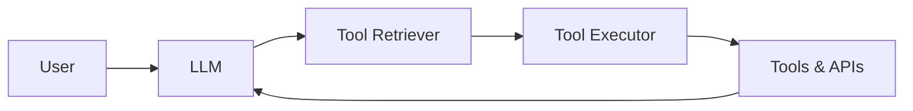

# 【大模型应用开发 动手做AI Agent】第一轮行动：工具执行搜索

作者：禅与计算机程序设计艺术 / Zen and the Art of Computer Programming

## 1. 背景介绍

### 1.1 问题的由来

随着人工智能技术的快速发展,特别是以 ChatGPT 为代表的大语言模型(LLM)的出现,AI 正在以前所未有的速度进入我们的生活。LLM 强大的自然语言理解和生成能力,让人们开始思考如何将其应用到更广泛的领域。其中,将 LLM 与传统的工具和 API 相结合,开发出功能更加强大的 AI Agent,成为了一个新的研究热点。

### 1.2 研究现状

目前业界已经出现了一些将 LLM 与外部工具相结合的尝试,比如 Anthropic 的 Claude、Adept 的 ACT-1 等。它们利用 LLM 强大的语言理解能力,通过对话的方式让 AI 理解用户需求,然后根据需求搜索互联网信息、调用相关 API 接口,最终给出用户想要的结果。这种 AI Agent 能够执行一些复杂的任务,比如数据分析、信息检索、代码编写等。

### 1.3 研究意义

开发出功能强大的 AI Agent,对于推动人工智能在各行各业的应用具有重要意义。一方面,AI Agent 能够替代人力完成很多复杂、耗时的任务,大大提高工作效率;另一方面,通过将 AI 与传统应用相结合,能够催生出很多创新性的应用场景和商业模式。因此,研究 LLM 驱动的 AI Agent 开发,对于学术界和产业界都具有重要价值。

### 1.4 本文结构

本文将重点介绍如何利用 LLM 开发一个具备工具执行和搜索能力的 AI Agent。全文分为 9 个部分:
1. 背景介绍
2. 核心概念与联系
3. 核心算法原理及操作步骤
4. 数学模型和公式详解
5. 项目实践:代码实例和解释
6. 实际应用场景
7. 工具和资源推荐
8. 总结:未来趋势与挑战
9. 附录:常见问题解答

## 2. 核心概念与联系

要开发一个 LLM 驱动的 AI Agent,需要理解以下几个核心概念:

- 大语言模型(LLM):以 Transformer 为基础的海量语料预训练模型,具备强大的自然语言理解和生成能力,是实现 AI Agent 的核心。
- Tool & API:各种第三方工具和应用程序接口,赋予了 AI Agent 实际操作能力,如搜索引擎 API、数据库 API 等。
- Few-shot Prompting:通过设计少量示例,引导 LLM 执行特定任务的技术,是 AI Agent 的关键。
- Tool Retriever:根据用户意图和上下文,从工具集合中检索出最相关工具的组件。
- Tool Executor:负责实际执行被检索出的工具,并将结果返回给 LLM 的组件。

它们之间的关系如下图所示:



## 3. 核心算法原理 & 具体操作步骤

### 3.1 算法原理概述

本文提出的 AI Agent 核心算法,是将大语言模型与工具检索执行相结合,通过迭代优化实现复杂任务的。其基本流程如下:

1. 利用 Few-shot Prompting 技术设计任务描述,引导 LLM 理解用户意图;
2. LLM 根据意图生成一系列操作步骤,每个步骤包含要使用的工具和具体指令;
3. Tool Retriever 根据指令从工具集合中检索出最相关的工具;
4. Tool Executor 执行被检索出的工具,得到执行结果;
5. 将工具执行结果作为新的 Prompt,返回给 LLM;
6. 重复步骤 2-5,直到得出最终结果。

### 3.2 算法步骤详解

接下来我们对算法的每个步骤进行详细说明。

#### Step1:Few-shot Prompting

首先需要利用 Few-shot Prompting 引导 LLM 理解任务。具体做法是设计 2-3 个示例,每个示例包含一个问题和对应的操作步骤。例如:

```
问题:今天纽约的天气怎么样?
操作步骤:
1. 使用搜索引擎查询"New York weather today"
2. 提取搜索结果中的天气信息
3. 将天气信息总结成一句话

问题:2022年世界杯冠军是哪支球队?
操作步骤:
1. 使用搜索引擎查询"2022 World Cup winner"
2. 提取搜索结果中获胜球队的名字
3. 将获胜球队信息总结成一句话

问题:{用户输入}
操作步骤:
```

然后将示例和用户问题一起输入给 LLM,引导其生成解决问题的操作步骤。

#### Step2:生成操作步骤

LLM 接收到 Few-shot Prompting 后,会根据示例自动生成一系列操作步骤,每个步骤包含要使用的工具名称和具体指令。例如:

```
1. 使用搜索引擎查询"{用户问题}"
2. 提取搜索结果中的关键信息
3. 使用知识库查询"{提取的关键信息}"得到更多细节
4. 对查询结果进行总结,生成最终答案
```

#### Step3:工具检索

Tool Retriever 接收到 LLM 生成的操作步骤后,会根据步骤中的工具名称(如"搜索引擎"、"知识库")和指令,从预定义的工具集合中找出最相关的工具。

工具集合是预先定义好的一系列 API 和软件工具,每个工具有名称、描述、参数等元信息。Tool Retriever 会利用 TF-IDF 等算法,对工具元信息和指令进行语义匹配,找出相关度最高的工具。

#### Step4:工具执行

Tool Executor 拿到 Tool Retriever 返回的工具后,会提取出操作步骤中的指令参数,传递给对应的工具 API 进行调用,得到工具的执行结果。

以"使用搜索引擎查询'2022 世界杯冠军'"为例,Tool Executor 会将"2022 世界杯冠军"作为关键词传给搜索引擎的 API,得到搜索结果。

#### Step5:结果回传

Tool Executor 将工具的执行结果以 Prompt 的形式回传给 LLM,例如:

```
搜索结果:
2022年卡塔尔世界杯决赛中,阿根廷通过点球大战击败法国,夺得冠军。
```

LLM 接收到新的 Prompt 后,会对其进行分析和总结,提取关键信息,并生成下一步操作。这样就实现了 LLM 和工具之间的交互。

#### Step6:迭代优化

重复步骤 2-5,LLM 会不断根据工具返回的信息对操作步骤进行优化和调整,最终得出问题的解决方案,完成整个任务。

### 3.3 算法优缺点

本文提出的 AI Agent 算法具有以下优点:

- 利用 LLM 强大的语言理解和生成能力,让 Agent 具备类似人类的交互和任务执行能力;
- 通过与外部工具的交互,弥补了 LLM 知识有限、无法进行实际操作的缺陷;
- 模块化设计使得添加新工具和优化迭代变得容易,提高了系统的可扩展性。

同时该算法也存在一些局限性:

- 对 Few-shot Prompting 设计有较高要求,需要精心挑选示例,否则容易影响效果;
- 系统的效果很大程度上取决于工具集合的丰富程度,需要持续扩充各种类型的工具;
- LLM 生成的操作步骤可能不够准确,需要反复迭代才能得到理想结果,影响了执行效率。

### 3.4 算法应用领域

LLM 驱动的 AI Agent 具有广泛的应用前景,可以用于以下领域:

- 智能客服:通过对话了解用户需求,并调用各种工具 API 提供个性化服务;
- 数据分析:使用自然语言下达数据分析指令,自动调用相关算法工具生成分析报告;
- 编程助手:根据用户需求自动生成代码片段,并使用编程工具如 IDE、调试器等协助开发;
- 智能搜索:理解用户的搜索意图,主动调用搜索引擎、知识库等工具获取信息并进行总结;
- 任务自动化:用对话的方式定义一系列任务步骤,由 Agent 自动调用各种工具流程化执行。

## 4. 数学模型和公式 & 详细讲解 & 举例说明

### 4.1 数学模型构建

为了实现 LLM 和工具的交互,我们需要构建一个数学模型来描述整个系统。

我们定义 LLM 为一个函数 $LLM(.)$,输入为 Prompt $P$,输出为操作步骤序列 $A$:

$$A = LLM(P)$$

其中 $P$ 由用户问题 $Q$ 和 Few-shot 示例 $E$ 组成:

$$P = [E; Q]$$

每个操作步骤 $a_i \in A$ 包含一个工具 $t_i$ 和对应的指令 $d_i$:

$$a_i = (t_i, d_i)$$

Tool Retriever 可以看作一个检索函数 $TR(.)$,输入为工具集合 $T$ 和指令 $d_i$,输出为最相关的工具 $\hat{t_i}$:

$$\hat{t_i} = TR(T, d_i)$$

Tool Executor 是一个执行函数 $TE(.)$,输入为被检索出的工具 $\hat{t_i}$ 和指令 $d_i$,输出为工具执行结果 $r_i$:

$$r_i = TE(\hat{t_i}, d_i)$$

将 $r_i$ 与原 Prompt $P$ 拼接,得到新的 Prompt $P'$:

$$P' = [P; r_i]$$

然后重复上述过程,直到得到最终结果 $R$:

$$R = LLM(P') = LLM([P; r_1; r_2; ...; r_n])$$

### 4.2 公式推导过程

接下来我们对 Tool Retriever 中的相关度计算公式进行推导。

设工具集合 $T$ 中有 $n$ 个工具,第 $i$ 个工具为 $t_i$,其元信息(名称、描述等)组成的文档为 $s_i$。给定一个指令 $d$,我们要从 $T$ 中检索出与 $d$ 最相关的工具。

首先利用 TF-IDF 算法计算出每个工具元信息 $s_i$ 和指令 $d$ 的向量表示,分别记为 $\vec{s_i}$ 和 $\vec{d}$。

然后计算 $\vec{s_i}$ 和 $\vec{d}$ 的余弦相似度:

$$sim(s_i, d) = \frac{\vec{s_i} \cdot \vec{d}}{||\vec{s_i}|| \times ||\vec{d}||}$$

最后选出相似度最大的工具作为检索结果:

$$\hat{t} = \arg\max_{t_i \in T} sim(s_i, d)$$

### 4.3 案例分析与讲解

下面我们用一个具体的例子来说明整个流程。

假设用户输入的问题是"今天北京的天气如何?"。

首先设计 Few-shot Prompting:

```
问题:明天上海的最高气温是多少度?
操作步骤:
1. 使用搜索引擎查询"上海明天天气"
2. 在搜索结果中找到最高气温信息
3. 将最高气温信息提取出来

问题:今天北京的天气如何?
操作步骤:
```

LLM 接收到 Prompt 后,会生成如下操作步骤:

```
1. 使用搜索引擎查询"北京今天天气"
2. 在搜索结果中找到天气描述信息
3. 将天气描述信息提取出来并返回
```

假设系统预置