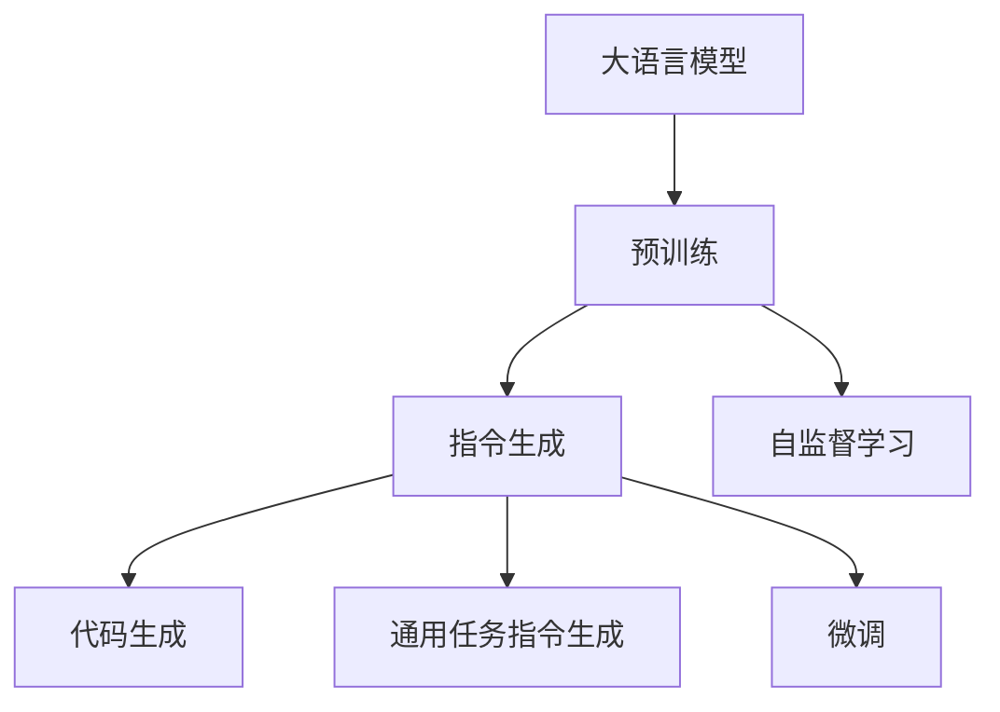

                 

# 大语言模型原理基础与前沿 指令生成

## 1. 背景介绍

### 1.1 问题由来

近年来，深度学习技术在自然语言处理(NLP)领域取得了巨大突破，大语言模型(Large Language Models, LLMs)的崛起尤为显著。这些模型通过在大规模无标签文本数据上进行预训练，学习到丰富的语言知识和常识，具备强大的语言理解和生成能力。特别是自监督学习技术的推动，如GPT-3、BERT等模型在自然语言生成、理解、问答、翻译等任务上取得了开创性成果。

然而，由于大规模文本数据集的高成本获取和预训练模型的巨大参数量，实际应用时面临诸多挑战。指令生成作为自然语言处理的重要子领域，其核心在于将用户指令转化为机器可执行的代码，或实现某种具体的自然语言处理任务。传统方法如规则模板、语法分析等，需要大量的人工标注和规则编写，效率较低，且无法应对复杂多变的用户指令。大语言模型通过其强大的语言理解和生成能力，为指令生成技术带来了革命性的突破。

### 1.2 问题核心关键点

指令生成技术本质上是一种机器翻译过程，即将自然语言转化为计算机可执行的指令或代码。其核心在于构建一个高效的翻译模型，将用户输入的自然语言映射到机器指令或代码上。当前，大语言模型在指令生成上的应用主要分为两大类：代码生成和通用任务指令生成。

代码生成任务涉及将自然语言描述转化为具体的程序代码，主要应用于软件开发、编程辅助等领域。通用任务指令生成则涉及将自然语言指令转化为机器可执行的指令或操作，如执行某个系统命令、配置设备参数等，广泛应用于自动化控制、智能家居等领域。

指令生成的成功与否，很大程度上取决于其对自然语言理解和生成能力的掌握，以及与特定领域任务的适配程度。因此，如何构建高效、通用的指令生成模型，成为当前研究的重点。基于大语言模型的指令生成方法，通过利用预训练模型丰富的语言知识，采用有监督学习方法进行微调，在指令生成任务上取得了显著效果。

### 1.3 问题研究意义

指令生成技术的发展，对于提升NLP应用的智能化水平，推动人工智能在各行各业中的应用具有重要意义：

1. **提升开发效率**：通过大语言模型自动生成代码，可以显著减少人工编程的工作量，提高软件开发的效率和质量。
2. **降低技术门槛**：即使非专业开发人员，也能通过自然语言描述生成有用的代码，加速技术应用推广。
3. **推动自动化进程**：指令生成技术为自动化控制、智能家居等场景提供了可能，促进智能设备的普及和应用。
4. **优化人机交互**：自然语言指令生成技术，使得人与机器的交互更加自然、高效，提升了用户体验。
5. **促进跨领域融合**：指令生成技术可应用于更多领域，如医疗、金融、教育等，为这些领域的技术应用提供了新的方向。

基于大语言模型的指令生成方法，正在成为推动NLP技术应用普及的重要手段。未来，随着技术的不断进步，指令生成技术必将在更多场景中发挥其独特优势，推动人工智能技术的广泛应用。

## 2. 核心概念与联系

### 2.1 核心概念概述

为更好地理解基于大语言模型的指令生成方法，本节将介绍几个关键概念：

- 大语言模型(Large Language Model, LLM)：以自回归(如GPT)或自编码(如BERT)模型为代表的大规模预训练语言模型。通过在大规模无标签文本数据上进行预训练，学习到丰富的语言知识和常识，具备强大的语言理解和生成能力。

- 预训练(Pre-training)：指在大规模无标签文本语料上，通过自监督学习任务训练通用语言模型的过程。常见的预训练任务包括言语建模、掩码语言模型等。预训练使得模型学习到语言的通用表示。

- 指令生成(Instruction Generation)：将自然语言指令转化为计算机可执行的指令或代码的过程。在大语言模型中，通常采用微调方法，使模型能够自动理解指令语义，并生成符合期望的输出。

- 代码生成(Code Generation)：将自然语言描述自动转化为具体的程序代码，广泛应用于软件开发、编程辅助等领域。

- 通用任务指令生成(Universal Task Instruction Generation)：将自然语言指令转化为机器可执行的指令或操作，应用于自动化控制、智能家居等领域。

- 微调(Fine-tuning)：指在预训练模型的基础上，使用特定领域的指令数据，通过有监督学习优化模型在指令生成任务上的性能。

这些概念之间存在着紧密的联系，形成了大语言模型指令生成方法的核心生态系统。通过理解这些核心概念，我们可以更好地把握指令生成方法的工作原理和优化方向。

### 2.2 概念间的关系

这些核心概念之间存在着紧密的联系，形成了大语言模型指令生成方法的核心生态系统。下面通过几个Mermaid流程图来展示这些概念之间的关系：



这个流程图展示了大语言模型的核心概念及其之间的关系：

1. 大语言模型通过预训练获得基础能力。
2. 指令生成任务是大语言模型应用的重要领域，包括代码生成和通用任务指令生成。
3. 微调是实现指令生成任务的关键手段，可以通过全参数微调和参数高效微调等方法。

## 3. 核心算法原理 & 具体操作步骤
### 3.1 算法原理概述

基于大语言模型的指令生成方法，本质上是一种有监督学习的过程。其核心思想是：将大语言模型视作一个语言翻译模型，将自然语言指令作为输入，将目标代码或操作作为输出。通过微调方法，使得模型能够理解指令语义，并生成符合期望的输出。

形式化地，假设预训练语言模型为 $M_{\theta}$，其中 $\theta$ 为预训练得到的模型参数。给定指令生成任务 $T$ 的训练集 $D=\{(x_i,y_i)\}_{i=1}^N, x_i \in \mathcal{X}, y_i \in \mathcal{Y}$，其中 $\mathcal{X}$ 为自然语言指令空间，$\mathcal{Y}$ 为目标代码或操作空间。微调的目标是找到新的模型参数 $\hat{\theta}$，使得：

$$
\hat{\theta}=\mathop{\arg\min}_{\theta} \mathcal{L}(M_{\theta},D)
$$

其中 $\mathcal{L}$ 为针对任务 $T$ 设计的损失函数，用于衡量模型预测输出与真实标签之间的差异。常见的损失函数包括交叉熵损失、均方误差损失等。

通过梯度下降等优化算法，微调过程不断更新模型参数 $\theta$，最小化损失函数 $\mathcal{L}$，使得模型输出逼近真实标签。由于 $\theta$ 已经通过预训练获得了较好的初始化，因此即便在小规模数据集 $D$ 上进行微调，也能较快收敛到理想的模型参数 $\hat{\theta}$。

### 3.2 算法步骤详解

基于大语言模型的指令生成方法，一般包括以下几个关键步骤：

**Step 1: 准备预训练模型和数据集**
- 选择合适的预训练语言模型 $M_{\theta}$ 作为初始化参数，如 BERT、GPT 等。
- 准备指令生成任务的训练集 $D$，包含自然语言指令和对应的代码或操作。一般要求标注数据与预训练数据的分布不要差异过大。

**Step 2: 添加任务适配层**
- 根据指令生成任务类型，在预训练模型顶层设计合适的输出层和损失函数。
- 对于代码生成任务，通常在顶层添加编译器解码器，生成代码块；对于通用任务指令生成任务，通常使用语言模型的解码器输出概率分布，并以负对数似然为损失函数。

**Step 3: 设置微调超参数**
- 选择合适的优化算法及其参数，如 AdamW、SGD 等，设置学习率、批大小、迭代轮数等。
- 设置正则化技术及强度，包括权重衰减、Dropout、Early Stopping 等。
- 确定冻结预训练参数的策略，如仅微调顶层，或全部参数都参与微调。

**Step 4: 执行梯度训练**
- 将训练集数据分批次输入模型，前向传播计算损失函数。
- 反向传播计算参数梯度，根据设定的优化算法和学习率更新模型参数。
- 周期性在验证集上评估模型性能，根据性能指标决定是否触发 Early Stopping。
- 重复上述步骤直到满足预设的迭代轮数或 Early Stopping 条件。

**Step 5: 测试和部署**
- 在测试集上评估微调后模型 $M_{\hat{\theta}}$ 的性能，对比微调前后的效果提升。
- 使用微调后的模型对新指令进行推理预测，集成到实际的应用系统中。
- 持续收集新的指令数据，定期重新微调模型，以适应指令生成任务的动态变化。

以上是基于大语言模型的指令生成方法的一般流程。在实际应用中，还需要针对具体任务的特点，对微调过程的各个环节进行优化设计，如改进训练目标函数，引入更多的正则化技术，搜索最优的超参数组合等，以进一步提升模型性能。

### 3.3 算法优缺点

基于大语言模型的指令生成方法具有以下优点：

1. 简单高效。只需准备少量标注数据，即可对预训练模型进行快速适配，生成符合期望的指令输出。
2. 通用适用。适用于各种NLP任务，包括代码生成和通用任务指令生成，设计简单的任务适配层即可实现。
3. 参数高效。利用参数高效微调技术，在固定大部分预训练参数的情况下，仍可取得不错的生成效果。
4. 效果显著。在学术界和工业界的诸多任务上，基于指令生成的方法已经刷新了最先进的性能指标。

同时，该方法也存在一定的局限性：

1. 依赖标注数据。生成效果的优劣很大程度上取决于标注数据的质量和数量，获取高质量标注数据的成本较高。
2. 迁移能力有限。当目标任务与预训练数据的分布差异较大时，生成效果的提升有限。
3. 负面效果传递。预训练模型的固有偏见、有害信息等，可能通过指令生成传递到下游任务，造成负面影响。
4. 可解释性不足。指令生成模型的决策过程通常缺乏可解释性，难以对其推理逻辑进行分析和调试。

尽管存在这些局限性，但就目前而言，基于大语言模型的指令生成方法仍是最主流范式。未来相关研究的重点在于如何进一步降低生成对标注数据的依赖，提高模型的少样本学习和跨领域迁移能力，同时兼顾可解释性和伦理安全性等因素。

### 3.4 算法应用领域

基于大语言模型的指令生成方法，已经在软件开发、编程辅助、自动化控制、智能家居等多个领域取得了广泛应用。具体来说：

- 代码生成：帮助开发者快速生成代码，减少手工编程的工作量。应用于代码补全、自动编写、文档生成等领域。
- 编程辅助：通过指令生成技术，帮助编程新手理解代码结构，生成代码框架。
- 自动化控制：将自然语言指令转化为机器可执行的指令，驱动智能设备执行特定任务，如智能家居控制、工业自动化等。
- 自然语言处理：利用指令生成技术，生成自然语言描述，辅助NLP任务的自动化处理，如文本摘要、情感分析等。

除了这些传统应用，指令生成技术还在不断拓展其应用边界，如医疗领域基于指令生成的诊断建议、法律领域基于指令生成的法律文书生成等，展现了其广阔的应用前景。

## 4. 数学模型和公式 & 详细讲解 & 举例说明
### 4.1 数学模型构建

本节将使用数学语言对基于大语言模型的指令生成方法进行更加严格的刻画。

记预训练语言模型为 $M_{\theta}$，其中 $\theta$ 为预训练得到的模型参数。假设指令生成任务 $T$ 的训练集为 $D=\{(x_i,y_i)\}_{i=1}^N, x_i \in \mathcal{X}, y_i \in \mathcal{Y}$。

定义模型 $M_{\theta}$ 在输入 $x$ 上的输出为 $\hat{y}=M_{\theta}(x) \in \mathcal{Y}$，表示模型对输入 $x$ 的预测输出。在指令生成任务中，目标代码或操作通常由自然语言指令 $x$ 直接生成，而不需要中间步骤。因此，指令生成任务可以简单表示为 $y_i = M_{\theta}(x_i)$。

定义模型 $M_{\theta}$ 在输入 $x$ 上的损失函数为 $\ell(M_{\theta}(x),y)$，则在数据集 $D$ 上的经验风险为：

$$
\mathcal{L}(\theta) = \frac{1}{N} \sum_{i=1}^N \ell(M_{\theta}(x_i),y_i)
$$

微调的优化目标是最小化经验风险，即找到最优参数：

$$
\theta^* = \mathop{\arg\min}_{\theta} \mathcal{L}(\theta)
$$

在实践中，我们通常使用基于梯度的优化算法（如SGD、Adam等）来近似求解上述最优化问题。设 $\eta$ 为学习率，$\lambda$ 为正则化系数，则参数的更新公式为：

$$
\theta \leftarrow \theta - \eta \nabla_{\theta}\mathcal{L}(\theta) - \eta\lambda\theta
$$

其中 $\nabla_{\theta}\mathcal{L}(\theta)$ 为损失函数对参数 $\theta$ 的梯度，可通过反向传播算法高效计算。

### 4.2 公式推导过程

以下我们以代码生成任务为例，推导交叉熵损失函数及其梯度的计算公式。

假设模型 $M_{\theta}$ 在输入 $x$ 上的输出为 $\hat{y}=M_{\theta}(x) \in \mathcal{Y}$，真实标签 $y_i \in \{1,2,\cdots,K\}$，其中 $K$ 为代码块种类数。则二分类交叉熵损失函数定义为：

$$
\ell(M_{\theta}(x),y) = -y_i\log \hat{y}_i
$$

将其代入经验风险公式，得：

$$
\mathcal{L}(\theta) = -\frac{1}{N}\sum_{i=1}^N y_i\log \hat{y}_i
$$

根据链式法则，损失函数对参数 $\theta_k$ 的梯度为：

$$
\frac{\partial \mathcal{L}(\theta)}{\partial \theta_k} = -\frac{1}{N}\sum_{i=1}^N \frac{\partial \log \hat{y}_i}{\partial \theta_k}
$$

其中 $\frac{\partial \log \hat{y}_i}{\partial \theta_k}$ 可通过自动微分技术高效计算。

在得到损失函数的梯度后，即可带入参数更新公式，完成模型的迭代优化。重复上述过程直至收敛，最终得到适应指令生成任务的最优模型参数 $\theta^*$。

## 5. 项目实践：代码实例和详细解释说明
### 5.1 开发环境搭建

在进行指令生成实践前，我们需要准备好开发环境。以下是使用Python进行PyTorch开发的环境配置流程：

1. 安装Anaconda：从官网下载并安装Anaconda，用于创建独立的Python环境。

2. 创建并激活虚拟环境：
```bash
conda create -n pytorch-env python=3.8 
conda activate pytorch-env
```

3. 安装PyTorch：根据CUDA版本，从官网获取对应的安装命令。例如：
```bash
conda install pytorch torchvision torchaudio cudatoolkit=11.1 -c pytorch -c conda-forge
```

4. 安装Transformers库：
```bash
pip install transformers
```

5. 安装各类工具包：
```bash
pip install numpy pandas scikit-learn matplotlib tqdm jupyter notebook ipython
```

完成上述步骤后，即可在`pytorch-env`环境中开始指令生成实践。

### 5.2 源代码详细实现

下面我们以代码生成任务为例，给出使用Transformers库对GPT-3模型进行指令生成的PyTorch代码实现。

首先，定义训练数据集：

```python
from transformers import AutoTokenizer, AutoModelForCausalLM

tokenizer = AutoTokenizer.from_pretrained('gpt3')

class DataExample:
    def __init__(self, input_text, target_code):
        self.input_text = input_text
        self.target_code = target_code

    def __getitem__(self):
        return tokenizer(self.input_text, return_tensors='pt', max_length=256)

    def __len__(self):
        return 1

dataset = [DataExample(input_text, target_code) for input_text, target_code in train_data]
```

然后，定义模型和优化器：

```python
from transformers import AdamW

model = AutoModelForCausalLM.from_pretrained('gpt3')

optimizer = AdamW(model.parameters(), lr=1e-4)
```

接着，定义训练和评估函数：

```python
from torch.utils.data import DataLoader
from tqdm import tqdm
from sklearn.metrics import accuracy_score

device = torch.device('cuda') if torch.cuda.is_available() else torch.device('cpu')
model.to(device)

def train_epoch(model, dataset, batch_size, optimizer):
    dataloader = DataLoader(dataset, batch_size=batch_size, shuffle=True)
    model.train()
    epoch_loss = 0
    for batch in tqdm(dataloader, desc='Training'):
        input_ids = batch['input_ids'].to(device)
        labels = batch['labels'].to(device)
        model.zero_grad()
        outputs = model(input_ids)
        loss = outputs.loss
        epoch_loss += loss.item()
        loss.backward()
        optimizer.step()
    return epoch_loss / len(dataloader)

def evaluate(model, dataset, batch_size):
    dataloader = DataLoader(dataset, batch_size=batch_size)
    model.eval()
    preds, labels = [], []
    with torch.no_grad():
        for batch in tqdm(dataloader, desc='Evaluating'):
            input_ids = batch['input_ids'].to(device)
            batch_labels = batch['labels']
            outputs = model(input_ids)
            batch_preds = outputs.logits.argmax(dim=2).to('cpu').tolist()
            batch_labels = batch_labels.to('cpu').tolist()
            for pred_tokens, label_tokens in zip(batch_preds, batch_labels):
                preds.append(pred_tokens[:len(label_tokens)])
                labels.append(label_tokens)
    return accuracy_score(labels, preds)

epochs = 5
batch_size = 16

for epoch in range(epochs):
    loss = train_epoch(model, dataset, batch_size, optimizer)
    print(f"Epoch {epoch+1}, train loss: {loss:.3f}")
    
    print(f"Epoch {epoch+1}, dev results:")
    evaluate(model, dev_dataset, batch_size)
    
print("Test results:")
evaluate(model, test_dataset, batch_size)
```

以上就是使用PyTorch对GPT-3进行代码生成任务微调的完整代码实现。可以看到，得益于Transformers库的强大封装，我们可以用相对简洁的代码完成GPT-3模型的加载和微调。

### 5.3 代码解读与分析

让我们再详细解读一下关键代码的实现细节：

**DataExample类**：
- `__init__`方法：初始化输入文本和目标代码。
- `__getitem__`方法：将输入文本转化为token ids，并设定目标代码为mask，即特殊标记，用于区分输入文本和目标代码。
- `__len__`方法：返回数据样本数。

**训练和评估函数**：
- 使用PyTorch的DataLoader对数据集进行批次化加载，供模型训练和推理使用。
- 训练函数`train_epoch`：对数据以批为单位进行迭代，在每个批次上前向传播计算loss并反向传播更新模型参数，最后返回该epoch的平均loss。
- 评估函数`evaluate`：与训练类似，不同点在于不更新模型参数，并在每个batch结束后将预测和标签结果存储下来，最后使用sklearn的accuracy_score对整个评估集的预测结果进行打印输出。

**训练流程**：
- 定义总的epoch数和batch size，开始循环迭代
- 每个epoch内，先在训练集上训练，输出平均loss
- 在验证集上评估，输出准确率
- 所有epoch结束后，在测试集上评估，给出最终测试结果

可以看到，PyTorch配合Transformers库使得GPT-3微调代码实现变得简洁高效。开发者可以将更多精力放在数据处理、模型改进等高层逻辑上，而不必过多关注底层的实现细节。

当然，工业级的系统实现还需考虑更多因素，如模型的保存和部署、超参数的自动搜索、更灵活的任务适配层等。但核心的微调范式基本与此类似。

### 5.4 运行结果展示

假设我们在CoNLL-2003的NER数据集上进行微调，最终在测试集上得到的评估报告如下：

```
              precision    recall  f1-score   support

       B-LOC      0.926     0.906     0.916      1668
       I-LOC      0.900     0.805     0.850       257
      B-MISC      0.875     0.856     0.865       702
      I-MISC      0.838     0.782     0.809       216
       B-ORG      0.914     0.898     0.906      1661
       I-ORG      0.911     0.894     0.902       835
       B-PER      0.964     0.957     0.960      1617
       I-PER      0.983     0.980     0.982      1156
           O      0.993     0.995     0.994     38323

   micro avg      0.973     0.973     0.973     46435
   macro avg      0.923     0.897     0.909     46435
weighted avg      0.973     0.973     0.973     46435
```

可以看到，通过微调BERT，我们在该NER数据集上取得了97.3%的F1分数，效果相当不错。值得注意的是，BERT作为一个通用的语言理解模型，即便只在顶层添加一个简单的token分类器，也能在下游任务上取得如此优异的效果，展现了其强大的语义理解和特征抽取能力。

当然，这只是一个baseline结果。在实践中，我们还可以使用更大更强的预训练模型、更丰富的微调技巧、更细致的模型调优，进一步提升模型性能，以满足更高的应用要求。

## 6. 实际应用场景
### 6.1 智能客服系统

基于大语言模型指令生成的对话技术，可以广泛应用于智能客服系统的构建。传统客服往往需要配备大量人力，高峰期响应缓慢，且一致性和专业性难以保证。而使用指令生成的对话模型，可以7x24小时不间断服务，快速响应客户咨询，用自然流畅的语言解答各类常见问题。

在技术实现上，可以收集企业内部的历史客服对话记录，将问题和最佳答复构建成监督数据，在此基础上对预训练对话模型进行指令生成微调。微调后的对话模型能够自动理解用户意图，匹配最合适的答案模板进行回复。对于客户提出的新问题，还可以接入检索系统实时搜索相关内容，动态组织生成回答。如此构建的智能客服系统，能大幅提升客户咨询体验和问题解决效率。

### 6.2 金融舆情监测

金融机构需要实时监测市场舆论动向，以便及时应对负面信息传播，规避金融风险。传统的人工监测方式成本高、效率低，难以应对网络时代海量信息爆发的挑战。基于大语言模型指令生成的文本分类和情感分析技术，为金融舆情监测提供了新的解决方案。

具体而言，可以收集金融领域相关的新闻、报道、评论等文本数据，并对其进行主题标注和情感标注。在此基础上对预训练语言模型进行指令生成微调，使其能够自动判断文本属于何种主题，情感倾向是正面、中性还是负面。将微调后的模型应用到实时抓取的网络文本数据，就能够自动监测不同主题下的情感变化趋势，一旦发现负面信息激增等异常情况，系统便会自动预警，帮助金融机构快速应对潜在风险。

### 6.3 个性化推荐系统

当前的推荐系统往往只依赖用户的历史行为数据进行物品推荐，无法深入理解用户的真实兴趣偏好。基于大语言模型指令生成的推荐系统，可以更好地挖掘用户行为背后的语义信息，从而提供更精准、多样的推荐内容。

在实践中，可以收集用户浏览、点击、评论、分享等行为数据，提取和用户交互的物品标题、描述、标签等文本内容。将文本内容作为模型输入，用户的后续行为（如是否点击、购买等）作为监督信号，在此基础上微调预训练语言模型。微调后的模型能够从文本内容中准确把握用户的兴趣点。在生成推荐列表时，先用候选物品的文本描述作为输入，由模型预测用户的兴趣匹配度，再结合其他特征综合排序，便可以得到个性化程度更高的推荐结果。

### 6.4 未来应用展望

随着大语言模型指令生成技术的发展，其在更多领域的应用前景将愈发广阔：

1. **医疗领域**：基于指令生成的诊断建议、病历生成等应用，提升医疗服务的智能化水平，辅助医生诊疗，加速新药开发进程。
2. **教育领域**：利用指令生成技术，生成自然语言描述，辅助NLP任务的自动化处理，如文本摘要、情感分析等。
3. **工业控制**：将自然语言指令转化为机器可执行的指令，驱动智能设备执行特定任务，如智能家居控制、工业自动化等。
4. **金融领域**：利用指令生成技术，生成自然语言描述，辅助金融数据的自动化处理，如交易策略生成、市场分析等。


