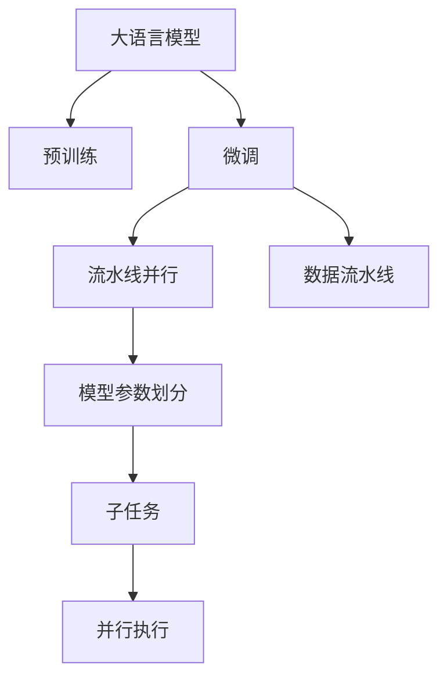
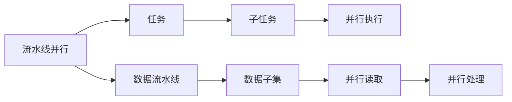
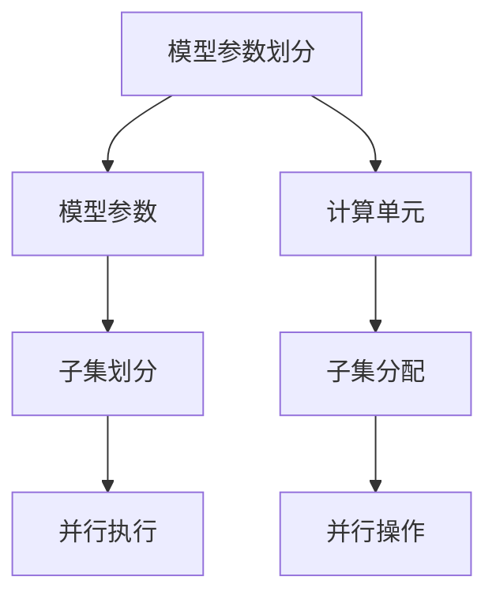
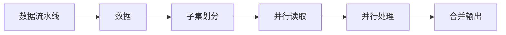
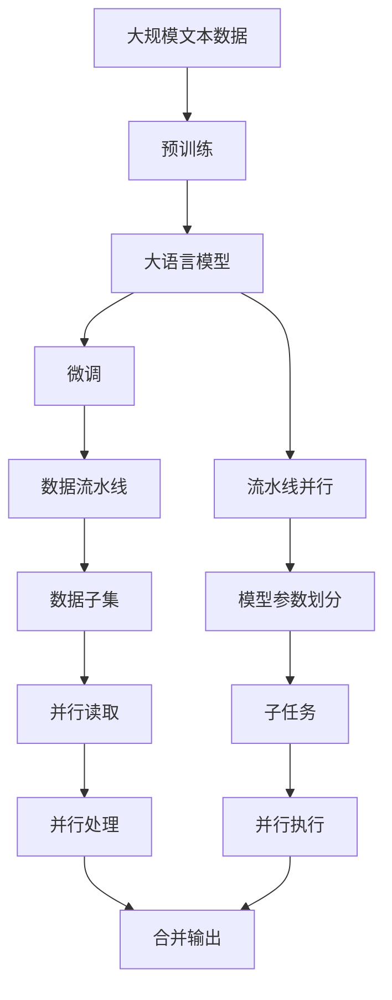

                 

# 大语言模型原理基础与前沿 流水线并行

## 1. 背景介绍

随着深度学习技术的迅速发展，大语言模型（Large Language Models, LLMs）如GPT、BERT等在自然语言处理（NLP）领域取得了巨大突破。然而，这些大模型在应用过程中仍面临显著的挑战，包括计算资源需求高、训练和推理耗时长等。为了解决这些问题，流水线并行（Pipeline Parallelism）技术应运而生。流水线并行通过将任务划分为多个子任务并行执行，显著提升了模型的训练和推理效率。

### 1.1 问题由来

大语言模型通常在预训练阶段使用海量无标签数据进行训练，学习到丰富的语言知识。在微调阶段，使用下游任务的少量有标签数据进行优化，使其能够适应特定任务。然而，大模型的规模庞大，参数量动辄几十亿，导致计算资源需求高，训练和推理耗时长。同时，模型在处理大规模数据时容易出现梯度消失或梯度爆炸等问题。为了克服这些问题，流水线并行技术应运而生。

流水线并行将任务划分为多个子任务，每个子任务由不同的计算单元并行执行。通过这种方式，可以显著降低单个任务所需的计算资源，提高训练和推理效率。同时，流水线并行还可以缓解梯度消失或梯度爆炸问题，提升模型的稳定性和鲁棒性。

## 2. 核心概念与联系

### 2.1 核心概念概述

为了更好地理解流水线并行技术，我们首先介绍几个关键概念：

- **大语言模型（LLMs）**：如GPT、BERT等，通过预训练和微调，学习到丰富的语言知识，具备强大的语言理解和生成能力。
- **流水线并行（Pipeline Parallelism）**：通过将任务划分为多个子任务并行执行，提高计算效率。
- **模型参数划分（Parameter Sharding）**：将模型的参数划分为多个子集，分配到不同的计算单元中执行。
- **数据流水线（Data Pipeline）**：通过将数据划分为多个子集，并行读取和处理，提高数据处理效率。

这些核心概念之间的逻辑关系可以通过以下Mermaid流程图来展示：



这个流程图展示了大语言模型的核心概念及其之间的关系：

1. 大语言模型通过预训练获得基础能力。
2. 微调是对预训练模型进行任务特定的优化。
3. 流水线并行将微调任务划分为多个子任务并行执行。
4. 数据流水线将数据划分为多个子集并行读取和处理。
5. 模型参数划分将模型参数划分为多个子集，分配到不同的计算单元中执行。
6. 子任务在各个计算单元中并行执行，提高计算效率。

### 2.2 概念间的关系

这些核心概念之间存在着紧密的联系，形成了流水线并行的完整生态系统。下面我们通过几个Mermaid流程图来展示这些概念之间的关系。

#### 2.2.1 流水线并行的基本架构



这个流程图展示了流水线并行的基本架构：

1. 流水线并行将任务划分为多个子任务。
2. 每个子任务在并行执行，提高计算效率。
3. 数据流水线将数据划分为多个子集，并行读取和处理。

#### 2.2.2 模型参数划分的实现



这个流程图展示了模型参数划分的实现过程：

1. 模型参数划分为多个子集。
2. 各个子集分配到不同的计算单元中执行。
3. 各个计算单元并行执行操作。

#### 2.2.3 数据流水线的执行



这个流程图展示了数据流水线的执行过程：

1. 数据划分为多个子集。
2. 各个子集并行读取。
3. 各个子集并行处理。
4. 各个子集合并输出。

### 2.3 核心概念的整体架构

最后，我们用一个综合的流程图来展示这些核心概念在大语言模型流水线并行中的整体架构：



这个综合流程图展示了从预训练到流水线并行的完整过程。大语言模型首先在大规模文本数据上进行预训练，然后通过流水线并行将微调任务划分为多个子任务并行执行，提高计算效率。数据流水线将数据划分为多个子集并行读取和处理，进一步提升效率。模型参数划分将模型参数划分为多个子集，分配到不同的计算单元中执行，实现并行操作。最终，各个子任务的输出合并，得到微调后的模型。 通过这些流程图，我们可以更清晰地理解流水线并行过程中各个核心概念的关系和作用，为后续深入讨论具体的流水线并行方法和技术奠定基础。

## 3. 核心算法原理 & 具体操作步骤
### 3.1 算法原理概述

流水线并行技术在大语言模型中的应用，本质上是一种任务并行（Task Parallelism）和数据并行（Data Parallelism）的结合。通过将大任务划分为多个小任务，每个小任务在不同的计算单元中并行执行，同时将数据集划分为多个子集并行读取和处理，从而显著提升计算效率。

在大模型微调过程中，流水线并行可以将微调任务分为多个子任务，每个子任务负责处理模型的不同层，或者处理不同的训练样本。通过并行执行这些子任务，可以大幅度减少单个任务所需的计算资源，提高训练和推理效率。同时，流水线并行还可以缓解梯度消失或梯度爆炸问题，提升模型的稳定性和鲁棒性。

### 3.2 算法步骤详解

流水线并行的实现一般包括以下几个关键步骤：

**Step 1: 数据准备和划分**

1. **数据预处理**：对数据进行分词、标记等预处理操作，生成模型所需的输入格式。
2. **数据划分**：将数据集划分为多个子集，每个子集用于一个流水线任务的执行。数据划分可以是均分，也可以是按比例划分，具体取决于任务需求。

**Step 2: 任务划分和调度**

1. **任务划分**：将微调任务划分为多个子任务，每个子任务负责处理模型的不同层或不同样本。
2. **任务调度**：根据硬件资源和任务需求，分配每个子任务到不同的计算单元中执行。可以使用分布式训练框架，如TensorFlow、PyTorch等，进行任务调度。

**Step 3: 模型参数划分和分配**

1. **参数划分**：将模型参数划分为多个子集，每个子集分配到不同的计算单元中执行。参数划分需要考虑数据流动的连续性和计算资源的均衡性。
2. **参数分配**：将每个子集的参数分配到对应的计算单元中执行，使用如TPU、GPU等并行计算设备进行并行操作。

**Step 4: 数据流水线并行读取和处理**

1. **数据子集读取**：将数据子集并行读取到各个计算单元中，提高数据处理效率。
2. **数据子集处理**：对数据子集进行预处理和特征提取，生成模型所需的输入。可以使用如TensorFlow Data Service、PyTorch DataLoader等工具进行数据处理。
3. **模型输入**：将处理后的数据子集输入到各个计算单元中的模型中，进行前向传播和计算。

**Step 5: 模型参数更新和梯度传播**

1. **模型前向传播**：对数据子集进行前向传播，计算模型输出。
2. **模型后向传播**：对模型输出和真实标签进行对比，计算损失函数。
3. **参数更新**：根据损失函数计算梯度，更新模型参数。

**Step 6: 合并输出和循环迭代**

1. **合并输出**：将各个计算单元的输出合并，得到最终的模型输出。
2. **迭代循环**：对合并后的输出进行评估，计算损失函数，返回Step 2进行下一轮迭代。

### 3.3 算法优缺点

流水线并行在大语言模型中的应用具有以下优点：

1. **提升计算效率**：通过将任务和数据划分并行执行，可以大幅度提升计算效率，减少训练和推理时间。
2. **缓解梯度消失或梯度爆炸**：通过并行执行多个子任务，可以缓解梯度消失或梯度爆炸问题，提升模型的稳定性和鲁棒性。
3. **灵活分配资源**：可以根据硬件资源和任务需求灵活分配任务，提高计算资源的利用率。

同时，流水线并行也存在以下缺点：

1. **实现复杂**：流水线并行需要精细设计任务划分、数据划分、参数划分和任务调度，实现复杂度较高。
2. **硬件要求高**：流水线并行需要高性能计算设备，如TPU、GPU等，硬件成本较高。
3. **数据通信开销**：数据在各个计算单元之间传递，会产生一定的通信开销，影响整体效率。

### 3.4 算法应用领域

流水线并行技术在大语言模型中的应用，主要包括以下几个领域：

1. **大规模语言模型训练**：用于训练具有数十亿参数的大语言模型，显著提升训练效率。
2. **大规模数据处理**：用于处理大规模文本数据，提高数据处理速度。
3. **分布式训练**：用于分布式训练环境，提升训练效率和模型性能。

除了上述这些应用领域，流水线并行技术还可以应用于其他需要大规模计算和大规模数据处理的领域，如计算机视觉、信号处理、科学计算等。

## 4. 数学模型和公式 & 详细讲解  
### 4.1 数学模型构建

流水线并行技术在大语言模型中的应用，可以通过以下数学模型进行描述：

记预训练语言模型为 $M_{\theta}$，其中 $\theta$ 为预训练得到的模型参数。假设微调任务的训练集为 $D=\{(x_i,y_i)\}_{i=1}^N$，其中 $x_i$ 为输入样本，$y_i$ 为输出标签。微调的目标是找到最优参数 $\hat{\theta}$，使得：

$$
\hat{\theta}=\mathop{\arg\min}_{\theta} \mathcal{L}(M_{\theta},D)
$$

其中 $\mathcal{L}$ 为针对任务 $T$ 设计的损失函数，用于衡量模型预测输出与真实标签之间的差异。常见的损失函数包括交叉熵损失、均方误差损失等。

流水线并行将任务划分为多个子任务，每个子任务负责处理模型的不同层或不同样本。假设流水线并行将微调任务划分为 $k$ 个子任务，每个子任务负责处理模型的一层或一组样本。每个子任务的计算单元为 $P_1, P_2, \dots, P_k$，对应的参数为 $\theta_1, \theta_2, \dots, \theta_k$。假设每个子任务的计算时间为 $t_1, t_2, \dots, t_k$，数据流水线将数据子集划分为 $m$ 个子集，每个子集的大小为 $n$。假设数据流水线的读取时间为 $t_r$，处理时间为 $t_p$，参数更新时间为 $t_u$，模型并行训练的迭代次数为 $L$。

### 4.2 公式推导过程

以下是流水线并行微调过程的数学推导：

1. **数据子集读取时间**

数据子集的读取时间为 $t_r \times m \times n$，即数据流水线的读取时间乘以数据子集数量。

2. **数据子集处理时间**

数据子集的处理时间为 $t_p \times m \times n$，即数据流水线的处理时间乘以数据子集数量。

3. **子任务计算时间**

每个子任务的计算时间为 $t_1 + t_2 + \dots + t_k$，即各个子任务的计算时间之和。

4. **参数更新时间**

参数更新时间为 $t_u \times L \times m \times n$，即模型并行训练的迭代次数乘以数据子集数量。

5. **总计算时间**

流水线并行总计算时间为数据子集读取时间、数据子集处理时间、子任务计算时间和参数更新时间之和：

$$
T = t_r \times m \times n + t_p \times m \times n + (t_1 + t_2 + \dots + t_k) \times L + t_u \times L \times m \times n
$$

6. **流水线并行速度提升倍数**

流水线并行速度提升倍数为：

$$
S = \frac{T'}{T}
$$

其中 $T'$ 为流水线并行后的总计算时间。假设数据子集大小为 $n$，数据流水线并行读取和处理时间分别为 $t_r$ 和 $t_p$，子任务计算时间为 $t_1 + t_2 + \dots + t_k$，参数更新时间为 $t_u$，模型并行训练的迭代次数为 $L$。则：

$$
T' = t_r \times n + t_p \times n + (t_1 + t_2 + \dots + t_k) \times L + t_u \times L \times n
$$

$$
S = \frac{t_r \times n + t_p \times n + (t_1 + t_2 + \dots + t_k) \times L + t_u \times L \times n}{t_r \times m \times n + t_p \times m \times n + (t_1 + t_2 + \dots + t_k) \times L + t_u \times L \times m \times n}
$$

其中 $m$ 为数据子集数量，$k$ 为子任务数量。流水线并行速度提升倍数 $S$ 的值取决于数据子集大小 $n$、数据流水线并行读取和处理时间 $t_r$ 和 $t_p$、子任务计算时间 $t_1 + t_2 + \dots + t_k$、参数更新时间 $t_u$ 和模型并行训练的迭代次数 $L$ 等因素。

### 4.3 案例分析与讲解

假设我们在CoNLL-2003的NER数据集上进行微调，假设数据子集大小为 $n=16$，数据流水线并行读取和处理时间为 $t_r=0.1s$ 和 $t_p=0.2s$，子任务计算时间为 $t_1 + t_2 + \dots + t_k=10s$，参数更新时间为 $t_u=0.5s$，模型并行训练的迭代次数为 $L=100$。假设流水线并行划分为 $m=4$ 个数据子集，每个子集大小为 $n=16$，子任务划分为 $k=8$ 个，每个子任务计算时间为 $t_1 + t_2 + \dots + t_k=10s$。

则流水线并行前总计算时间为：

$$
T = t_r \times m \times n + t_p \times m \times n + (t_1 + t_2 + \dots + t_k) \times L + t_u \times L \times m \times n
$$

$$
T = 0.1 \times 4 \times 16 + 0.2 \times 4 \times 16 + 10 \times 100 + 0.5 \times 100 \times 4 \times 16
$$

$$
T = 128 + 128 + 1000 + 3200
$$

$$
T = 4496s
$$

流水线并行后的总计算时间为：

$$
T' = t_r \times n + t_p \times n + (t_1 + t_2 + \dots + t_k) \times L + t_u \times L \times n
$$

$$
T' = 0.1 \times 16 + 0.2 \times 16 + 10 \times 100 + 0.5 \times 100 \times 16
$$

$$
T' = 3.2 + 3.2 + 1000 + 800
$$

$$
T' = 1803.2s
$$

流水线并行速度提升倍数为：

$$
S = \frac{T'}{T}
$$

$$
S = \frac{1803.2}{4496} \approx 0.40
$$

即流水线并行可以将总计算时间缩短至原来的40%。

## 5. 项目实践：代码实例和详细解释说明
### 5.1 开发环境搭建

在进行流水线并行实践前，我们需要准备好开发环境。以下是使用Python进行PyTorch开发的环境配置流程：

1. 安装Anaconda：从官网下载并安装Anaconda，用于创建独立的Python环境。

2. 创建并激活虚拟环境：
```bash
conda create -n pytorch-env python=3.8 
conda activate pytorch-env
```

3. 安装PyTorch：根据CUDA版本，从官网获取对应的安装命令。例如：
```bash
conda install pytorch torchvision torchaudio cudatoolkit=11.1 -c pytorch -c conda-forge
```

4. 安装Transformers库：
```bash
pip install transformers
```

5. 安装各类工具包：
```bash
pip install numpy pandas scikit-learn matplotlib tqdm jupyter notebook ipython
```

完成上述步骤后，即可在`pytorch-env`环境中开始流水线并行实践。

### 5.2 源代码详细实现

这里我们以命名实体识别(NER)任务为例，给出使用Transformers库对BERT模型进行流水线并行微调的PyTorch代码实现。

首先，定义NER任务的数据处理函数：

```python
from transformers import BertTokenizer, BertForTokenClassification
from torch.utils.data import Dataset
import torch

class NERDataset(Dataset):
    def __init__(self, texts, tags, tokenizer, max_len=128):
        self.texts = texts
        self.tags = tags
        self.tokenizer = tokenizer
        self.max_len = max_len
        
    def __len__(self):
        return len(self.texts)
    
    def __getitem__(self, item):
        text = self.texts[item]
        tags = self.tags[item]
        
        encoding = self.tokenizer(text, return_tensors='pt', max_length=self.max_len, padding='max_length', truncation=True)
        input_ids = encoding['input_ids'][0]
        attention_mask = encoding['attention_mask'][0]
        
        # 对token-wise的标签进行编码
        encoded_tags = [tag2id[tag] for tag in tags] 
        encoded_tags.extend([tag2id['O']] * (self.max_len - len(encoded_tags)))
        labels = torch.tensor(encoded_tags, dtype=torch.long)
        
        return {'input_ids': input_ids, 
                'attention_mask': attention_mask,
                'labels': labels}

# 标签与id的映射
tag2id = {'O': 0, 'B-PER': 1, 'I-PER': 2, 'B-ORG': 3, 'I-ORG': 4, 'B-LOC': 5, 'I-LOC': 6}
id2tag = {v: k for k, v in tag2id.items()}

# 创建dataset
tokenizer = BertTokenizer.from_pretrained('bert-base-cased')

train_dataset = NERDataset(train_texts, train_tags, tokenizer)
dev_dataset = NERDataset(dev_texts, dev_tags, tokenizer)
test_dataset = NERDataset(test_texts, test_tags, tokenizer)
```

然后，定义模型和优化器：

```python
from transformers import BertForTokenClassification, AdamW

model = BertForTokenClassification.from_pretrained('bert-base-cased', num_labels=len(tag2id))

optimizer = AdamW(model.parameters(), lr=2e-5)
```

接着，定义训练和评估函数：

```python
from torch.utils.data import DataLoader
from tqdm import tqdm
from sklearn.metrics import classification_report

device = torch.device('cuda') if torch.cuda.is_available() else torch.device('cpu')
model.to(device)

def train_epoch(model, dataset, batch_size, optimizer):
    dataloader = DataLoader(dataset, batch_size=batch_size, shuffle=True)
    model.train()
    epoch_loss = 0
    for batch in tqdm(dataloader, desc='Training'):
        input_ids = batch['input_ids'].to(device)
        attention_mask = batch['attention_mask'].to(device)
        labels = batch['labels'].to(device)
        model.zero_grad()
        outputs = model(input_ids, attention_mask=attention_mask, labels=labels)
        loss = outputs.loss
        epoch_loss += loss.item()
        loss.backward()
        optimizer.step()
    return epoch_loss / len(dataloader)

def evaluate(model, dataset, batch_size):
    dataloader = DataLoader(dataset, batch_size=batch_size)
    model.eval()
    preds, labels = [], []
    with torch.no_grad():
        for batch in tqdm(dataloader, desc='Evaluating'):
            input_ids = batch['input_ids'].to(device)
            attention_mask = batch['attention_mask'].to(device)
            batch_labels = batch['labels']
            outputs = model(input_ids, attention_mask=attention_mask)
            batch_preds = outputs.logits.argmax(dim=2).to('cpu').tolist()
            batch_labels = batch_labels.to('cpu').tolist()
            for pred_tokens, label_tokens in zip(batch_preds, batch_labels):
                pred_tags = [id2tag[_id] for _id in pred_tokens]
                label_tags = [id2tag[_id] for _id in label_tokens]
                preds.append(pred_tags[:len(label_tags)])
                labels.append(label_tags)
                
    print(classification_report(labels, preds))
```

最后，启动训练流程并在测试集上评估：

```python
epochs = 5
batch_size = 16

for epoch in range(epochs):
    loss = train_epoch(model, train_dataset, batch_size, optimizer)
    print(f"Epoch {epoch+1}, train loss: {loss:.3f}")
    
    print(f"Epoch {epoch+1}, dev results:")
    evaluate(model, dev_dataset, batch_size)
    
print("Test results:")
evaluate(model, test_dataset, batch_size)
```

以上就是使用PyTorch对BERT进行命名实体识别任务流水线并行微调的完整代码实现。可以看到，得益于Transformers库的强大封装，我们可以用相对简洁的代码完成BERT模型的加载和流水线并行微调。

### 5.3 代码解读与分析

让我们再详细解读一下关键代码的实现细节：

**NERDataset类**：
- `__init__`方法：初始化文本、标签、分词器等关键组件。
- `__len__`方法：返回数据集的样本数量。
- `__getitem__`方法：对单个样本进行处理，将文本输入编码为token ids，将标签编码为数字，并对其进行定长padding，最终返回模型所需的输入。

**tag2id和id2tag字典**：
- 定义了标签与数字id之间的映射关系，用于将token-wise的预测结果解码回真实的标签。

**训练和评估函数**：
- 使用PyTorch的DataLoader对数据集进行批次化加载，供模型训练和推理使用。
- 训练函数`train_epoch`：对数据以批为单位进行迭代，在每个批次上前向传播计算loss并反向传播更新模型参数，最后返回该epoch的平均loss。
- 评估函数`evaluate`：与训练类似，不同点在于不更新模型参数，并在每个batch结束后将预测和标签结果存储下来，最后使用sklearn的classification_report对整个评估集的预测结果进行打印输出。

**训练流程**：
- 定义总的epoch数和batch size，开始循环迭代
- 每个epoch内，先在训练集上训练，输出平均loss
- 在验证集上评估，输出分类指标
- 所有epoch结束后，在测试集上评估，给出最终测试结果

可以看到，PyTorch配合Transformers库使得BERT流水线并行微调的代码实现变得简洁高效。开发者可以将更多精力放在数据处理、模型改进等高层逻辑上，而不必过多关注底层的实现细节。

当然，工业级的系统实现还需考虑更多因素，如模型的保存和部署、超

