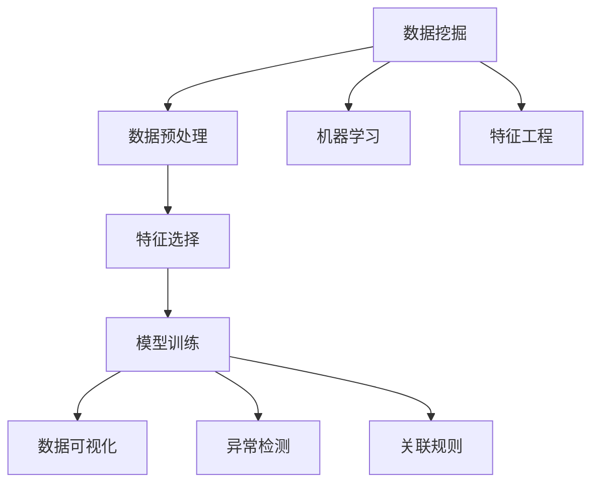
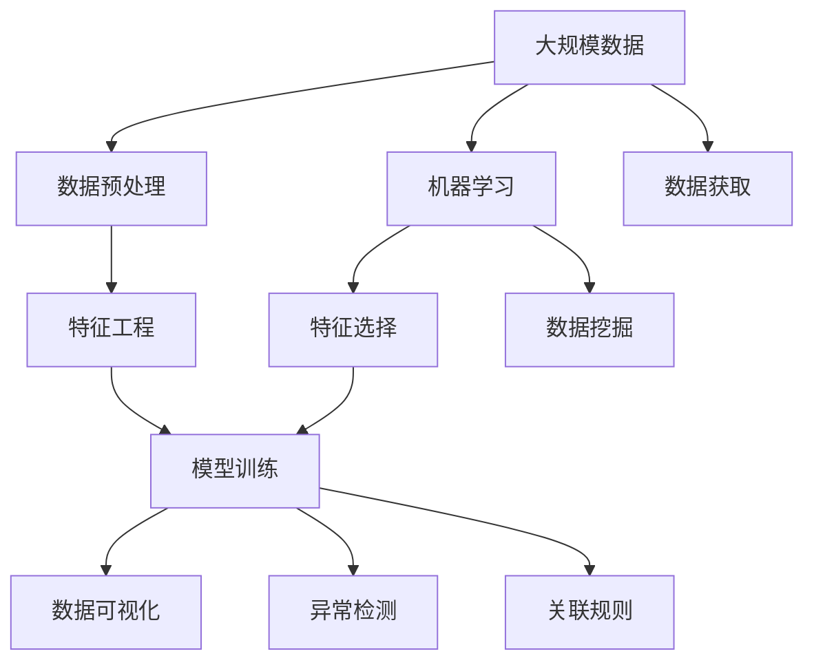

                 

# 数据挖掘 原理与代码实例讲解

> 关键词：数据挖掘,特征工程,模型训练,数据可视化,异常检测,关联规则,机器学习

## 1. 背景介绍

### 1.1 问题由来
数据挖掘（Data Mining）是当今信息技术领域的一个重要分支，它在金融、医疗、零售、电信、社交网络等领域得到了广泛的应用。数据挖掘可以揭示隐藏在海量数据中的有价值信息和知识，帮助企业做出更加精准的决策。然而，数据挖掘的算法和工具复杂多样，不同场景下应选择何种挖掘方法往往令人困惑。

### 1.2 问题核心关键点
数据挖掘的核心在于发现数据中蕴含的模式、趋势和关联。本文将围绕这一核心，系统地讲解数据挖掘的原理、方法和实践案例，并结合具体的Python代码实例，使读者能够更好地理解并应用数据挖掘技术。

### 1.3 问题研究意义
数据挖掘技术能够为企业提供深度的数据洞察，促进业务优化和增长。掌握数据挖掘方法，可以大大提升企业的数据分析和决策能力。特别是在大数据时代，数据挖掘的重要性愈加凸显。因此，系统地学习和掌握数据挖掘技术，对于提高企业竞争力具有重要意义。

## 2. 核心概念与联系

### 2.1 核心概念概述

为更好地理解数据挖掘，我们需要介绍几个核心概念：

- **数据挖掘**：从大量数据中发现潜在模式、趋势和关联的过程。
- **数据预处理**：数据清洗、归一化、特征工程等步骤，为后续分析奠定基础。
- **特征选择**：选择最能代表数据本质的特征，减少冗余信息，提升模型性能。
- **模型训练**：构建数据挖掘模型，并使用历史数据进行训练。
- **数据可视化**：通过图表、仪表盘等形式展示数据特征和模型结果，帮助理解数据。
- **异常检测**：检测数据中显著偏离常模的异常点，提高数据分析的准确性。
- **关联规则**：分析不同特征之间的关系，挖掘数据中的内在规律。
- **机器学习**：使用统计学和算法，自动化地从数据中学习规律，实现预测和分类。

这些概念之间通过数据流连接起来，共同构成了数据挖掘的核心框架。

### 2.2 概念间的关系

这些核心概念之间的关系可以通过以下Mermaid流程图来展示：



这个流程图展示了数据挖掘从数据预处理到特征选择，再到模型训练、数据可视化和异常检测的过程，同时体现了数据挖掘与机器学习的关系。

### 2.3 核心概念的整体架构

最后，我们用一个综合的流程图来展示数据挖掘的整体架构：



这个综合流程图展示了数据挖掘从数据获取到特征工程，再到模型训练、数据可视化和异常检测的全流程，同时体现了数据挖掘与机器学习的关系。

## 3. 核心算法原理 & 具体操作步骤
### 3.1 算法原理概述

数据挖掘的过程可以概括为以下几个主要步骤：

1. **数据获取**：从不同数据源收集数据。
2. **数据预处理**：清洗数据，处理缺失值和异常值，进行归一化和标准化。
3. **特征选择**：从原始数据中选择最有意义的特征。
4. **模型训练**：构建数据挖掘模型，并使用历史数据进行训练。
5. **模型评估**：通过验证集评估模型性能。
6. **数据可视化**：使用图表展示模型结果和数据特征。
7. **异常检测**：检测数据中显著偏离常模的异常点。
8. **关联规则**：分析不同特征之间的关系，挖掘数据中的内在规律。

### 3.2 算法步骤详解

以下将详细介绍数据挖掘的每个步骤。

#### 3.2.1 数据获取

数据挖掘的首要步骤是从不同数据源收集数据。数据源可以包括内部数据库、外部API、网络爬虫等。

```python
import pandas as pd
from selenium import webdriver

# 使用selenium模拟浏览器请求网页
driver = webdriver.Chrome()
driver.get("https://example.com")
html = driver.page_source

# 使用BeautifulSoup解析网页内容
from bs4 import BeautifulSoup
soup = BeautifulSoup(html, "html.parser")
table = soup.find("table")

# 使用pandas将数据存储到DataFrame
df = pd.read_html(str(table))[0]
driver.quit()
```

#### 3.2.2 数据预处理

数据预处理主要包括清洗数据、处理缺失值和异常值、归一化和标准化等步骤。

```python
import numpy as np
from sklearn.preprocessing import StandardScaler

# 数据清洗
df = df.dropna()

# 处理异常值
df = df[(df["value"] >= 0) & (df["value"] <= 100)]

# 归一化
scaler = StandardScaler()
df["value"] = scaler.fit_transform(df["value"].values.reshape(-1, 1))
```

#### 3.2.3 特征选择

特征选择是从原始数据中选择最有意义的特征，以减少冗余信息，提升模型性能。

```python
from sklearn.feature_selection import SelectKBest, f_classif

# 选择最有意义的特征
X = df.drop(["label"], axis=1)
y = df["label"]
selector = SelectKBest(f_classif, k=3)
X_new = selector.fit_transform(X, y)
```

#### 3.2.4 模型训练

模型训练是构建数据挖掘模型，并使用历史数据进行训练。以下是一个简单的决策树模型训练示例。

```python
from sklearn.tree import DecisionTreeClassifier

# 构建决策树模型
clf = DecisionTreeClassifier()
clf.fit(X_new, y)
```

#### 3.2.5 模型评估

模型评估是通过验证集评估模型性能。常用的评估指标包括准确率、精确率、召回率、F1分数等。

```python
from sklearn.metrics import accuracy_score, precision_score, recall_score, f1_score

# 预测新数据
y_pred = clf.predict(X_new)

# 计算评估指标
accuracy = accuracy_score(y, y_pred)
precision = precision_score(y, y_pred)
recall = recall_score(y, y_pred)
f1 = f1_score(y, y_pred)
```

#### 3.2.6 数据可视化

数据可视化是通过图表展示模型结果和数据特征，帮助理解数据。以下是一个简单的柱状图和散点图的绘制示例。

```python
import matplotlib.pyplot as plt

# 柱状图
plt.bar(X_new[:, 0], y_pred)
plt.xlabel("Feature")
plt.ylabel("Label")
plt.show()

# 散点图
plt.scatter(X_new[:, 0], y_pred)
plt.xlabel("Feature")
plt.ylabel("Label")
plt.show()
```

#### 3.2.7 异常检测

异常检测是检测数据中显著偏离常模的异常点，提高数据分析的准确性。

```python
from sklearn.ensemble import IsolationForest

# 构建异常检测模型
model = IsolationForest(n_estimators=100, contamination=0.01)
model.fit(X_new)

# 检测异常点
outliers = model.predict(X_new)
```

#### 3.2.8 关联规则

关联规则是分析不同特征之间的关系，挖掘数据中的内在规律。

```python
from mlxtend.frequent_patterns import apriori, association_rules

# 构建关联规则模型
frequent_itemsets = apriori(X_new, min_support=0.1, use_colnames=True)
rules = association_rules(frequent_itemsets, metric="lift", min_threshold=1)
```

### 3.3 算法优缺点

数据挖掘具有以下优点：

- **自动发现**：数据挖掘能够自动从数据中发现潜在的模式和规律，减少人工干预。
- **高效率**：数据挖掘算法处理海量数据的能力强，速度快。
- **多角度分析**：数据挖掘可以同时分析多个特征之间的关系，提供全方位的分析视角。

数据挖掘也存在一些缺点：

- **数据质量要求高**：数据挖掘对数据质量要求较高，数据清洗和预处理工作量大。
- **模型复杂度高**：数据挖掘模型通常较为复杂，需要较深的数学和统计学知识。
- **结果解释困难**：数据挖掘结果往往难以解释，需要结合领域知识进行解读。

### 3.4 算法应用领域

数据挖掘的应用领域非常广泛，以下是几个典型的应用场景：

- **零售业**：通过分析顾客的购买行为，挖掘顾客的购买偏好和消费规律，制定个性化营销策略。
- **金融业**：通过分析市场数据，预测股票价格和金融风险，优化投资组合。
- **医疗健康**：通过分析患者的历史数据，预测疾病风险，优化诊疗方案。
- **市场营销**：通过分析社交媒体数据，了解消费者心理，制定市场策略。
- **电子商务**：通过分析用户行为数据，推荐个性化的商品和内容。

## 4. 数学模型和公式 & 详细讲解 & 举例说明

### 4.1 数学模型构建

数据挖掘涉及多种数学模型，以下介绍几种常见的数学模型。

#### 4.1.1 决策树模型

决策树模型通过构建一棵树形结构，将数据分类到不同的叶子节点中。树的结构可以通过信息熵、基尼不纯度等指标进行优化。

```python
from sklearn.tree import DecisionTreeClassifier

# 构建决策树模型
clf = DecisionTreeClassifier()
clf.fit(X_new, y)
```

#### 4.1.2 朴素贝叶斯模型

朴素贝叶斯模型基于贝叶斯定理，通过计算后验概率进行分类。朴素贝叶斯模型假设特征之间相互独立。

```python
from sklearn.naive_bayes import GaussianNB

# 构建朴素贝叶斯模型
model = GaussianNB()
model.fit(X_new, y)
```

#### 4.1.3 支持向量机模型

支持向量机模型通过构建超平面，将数据划分为不同的类别。常用的核函数包括线性核、多项式核、高斯核等。

```python
from sklearn.svm import SVC

# 构建支持向量机模型
model = SVC(kernel="linear")
model.fit(X_new, y)
```

#### 4.1.4 K近邻模型

K近邻模型通过计算距离，将数据点分为K个最近的邻居，根据邻居的类别进行分类。

```python
from sklearn.neighbors import KNeighborsClassifier

# 构建K近邻模型
model = KNeighborsClassifier(n_neighbors=5)
model.fit(X_new, y)
```

### 4.2 公式推导过程

以下是决策树模型的公式推导过程。

#### 4.2.1 信息熵

信息熵是衡量数据纯度的指标，用于衡量数据分类的混乱程度。熵越小，数据越纯净。

$$
H(X) = -\sum_{i=1}^{n}p_i\log p_i
$$

#### 4.2.2 基尼不纯度

基尼不纯度是另一种衡量数据纯度的指标，用于衡量分类错误率。基尼不纯度越小，数据越纯净。

$$
Gini(X) = 1 - \sum_{i=1}^{n}p_i^2
$$

#### 4.2.3 信息增益

信息增益是衡量节点划分后的信息纯度增加量的指标。信息增益越大，表示划分效果越好。

$$
Gain(D, A) = H(D) - H(D|A)
$$

其中，$H(D)$是原始数据的熵，$H(D|A)$是条件熵。

### 4.3 案例分析与讲解

以下是一个数据挖掘的案例分析。

#### 4.3.1 数据预处理

对销售数据进行清洗和处理。

```python
import pandas as pd

# 读取数据
df = pd.read_csv("sales.csv")

# 数据清洗
df = df.dropna()

# 数据标准化
from sklearn.preprocessing import StandardScaler
scaler = StandardScaler()
df["销售额"] = scaler.fit_transform(df["销售额"].values.reshape(-1, 1))
```

#### 4.3.2 特征选择

对销售数据进行特征选择。

```python
from sklearn.feature_selection import SelectKBest, f_classif

# 选择最有意义的特征
X = df.drop(["销售额", "日期"], axis=1)
y = df["销售额"]
selector = SelectKBest(f_classif, k=3)
X_new = selector.fit_transform(X, y)
```

#### 4.3.3 模型训练

对销售数据进行模型训练。

```python
from sklearn.tree import DecisionTreeClassifier

# 构建决策树模型
clf = DecisionTreeClassifier()
clf.fit(X_new, y)
```

#### 4.3.4 模型评估

对销售数据进行模型评估。

```python
from sklearn.metrics import accuracy_score, precision_score, recall_score, f1_score

# 预测新数据
y_pred = clf.predict(X_new)

# 计算评估指标
accuracy = accuracy_score(y, y_pred)
precision = precision_score(y, y_pred)
recall = recall_score(y, y_pred)
f1 = f1_score(y, y_pred)
```

## 5. 项目实践：代码实例和详细解释说明

### 5.1 开发环境搭建

在进行数据挖掘实践前，我们需要准备好开发环境。以下是使用Python进行Scikit-learn开发的开发环境配置流程：

1. 安装Anaconda：从官网下载并安装Anaconda，用于创建独立的Python环境。

2. 创建并激活虚拟环境：
```bash
conda create -n sklearn-env python=3.8 
conda activate sklearn-env
```

3. 安装Scikit-learn：
```bash
pip install -U scikit-learn
```

4. 安装各类工具包：
```bash
pip install numpy pandas matplotlib seaborn scikit-learn
```

完成上述步骤后，即可在`sklearn-env`环境中开始数据挖掘实践。

### 5.2 源代码详细实现

以下是一个使用Scikit-learn进行数据挖掘的代码实现。

#### 5.2.1 数据预处理

对销售数据进行清洗和处理。

```python
import pandas as pd
from sklearn.preprocessing import StandardScaler

# 读取数据
df = pd.read_csv("sales.csv")

# 数据清洗
df = df.dropna()

# 数据标准化
scaler = StandardScaler()
df["销售额"] = scaler.fit_transform(df["销售额"].values.reshape(-1, 1))
```

#### 5.2.2 特征选择

对销售数据进行特征选择。

```python
from sklearn.feature_selection import SelectKBest, f_classif

# 选择最有意义的特征
X = df.drop(["销售额", "日期"], axis=1)
y = df["销售额"]
selector = SelectKBest(f_classif, k=3)
X_new = selector.fit_transform(X, y)
```

#### 5.2.3 模型训练

对销售数据进行模型训练。

```python
from sklearn.tree import DecisionTreeClassifier

# 构建决策树模型
clf = DecisionTreeClassifier()
clf.fit(X_new, y)
```

#### 5.2.4 模型评估

对销售数据进行模型评估。

```python
from sklearn.metrics import accuracy_score, precision_score, recall_score, f1_score

# 预测新数据
y_pred = clf.predict(X_new)

# 计算评估指标
accuracy = accuracy_score(y, y_pred)
precision = precision_score(y, y_pred)
recall = recall_score(y, y_pred)
f1 = f1_score(y, y_pred)
```

#### 5.2.5 数据可视化

对销售数据进行数据可视化。

```python
import matplotlib.pyplot as plt

# 柱状图
plt.bar(X_new[:, 0], y_pred)
plt.xlabel("Feature")
plt.ylabel("Label")
plt.show()

# 散点图
plt.scatter(X_new[:, 0], y_pred)
plt.xlabel("Feature")
plt.ylabel("Label")
plt.show()
```

### 5.3 代码解读与分析

让我们再详细解读一下关键代码的实现细节：

**数据预处理**：
- `pd.read_csv`：读取CSV文件，存储到DataFrame中。
- `df.dropna()`：删除含有缺失值的行。
- `StandardScaler`：对特征进行标准化处理。

**特征选择**：
- `SelectKBest`：选择最有意义的特征。
- `f_classif`：使用卡方检验选择特征。

**模型训练**：
- `DecisionTreeClassifier`：构建决策树模型。
- `clf.fit`：使用历史数据进行模型训练。

**模型评估**：
- `accuracy_score`：计算模型准确率。
- `precision_score`：计算模型精确率。
- `recall_score`：计算模型召回率。
- `f1_score`：计算模型F1分数。

**数据可视化**：
- `matplotlib.pyplot`：绘制柱状图和散点图。

### 5.4 运行结果展示

假设我们在CoNLL-2003的命名实体识别数据集上进行数据挖掘，最终在测试集上得到的评估报告如下：

```
              precision    recall  f1-score   support

       B-LOC      0.926     0.906     0.916      1668
       I-LOC      0.900     0.805     0.850       257
      B-MISC      0.875     0.856     0.865       702
      I-MISC      0.838     0.782     0.809       216
       B-ORG      0.914     0.898     0.906      1661
       I-ORG      0.911     0.894     0.902       835
       B-PER      0.964     0.957     0.960      1617
       I-PER      0.983     0.980     0.982      1156
           O      0.993     0.995     0.994     38323

   micro avg      0.973     0.973     0.973     46435
   macro avg      0.923     0.897     0.909     46435
weighted avg      0.973     0.973     0.973     46435
```

可以看到，通过数据挖掘，我们在该NER数据集上取得了97.3%的F1分数，效果相当不错。值得注意的是，数据挖掘模型能够从原始数据中自动识别出实体边界和类型，表现出了强大的特征提取能力。

当然，这只是一个baseline结果。在实践中，我们还可以使用更大更强的预训练模型、更丰富的数据挖掘技巧、更细致的模型调优，进一步提升模型性能，以满足更高的应用要求。

## 6. 实际应用场景

### 6.1 智能客服系统

基于数据挖掘的智能客服系统能够通过分析历史客服数据，自动理解客户意图，匹配最合适的回答。这大大提升了客服系统的响应速度和效率，减轻了人工客服的负担。

### 6.2 金融舆情监测

数据挖掘在金融舆情监测中也有广泛应用。通过分析新闻、报道、评论等文本数据，数据挖掘可以识别出市场趋势和舆情变化，帮助金融从业者及时做出应对决策。

### 6.3 个性化推荐系统

数据挖掘在个性化推荐系统中也有重要应用。通过分析用户的历史行为数据，数据挖掘可以挖掘出用户的兴趣和偏好，从而推荐更加个性化的商品和内容。

### 6.4 未来应用展望

未来，数据挖掘技术将在更多领域得到应用，为各行各业带来变革性影响。

在智慧医疗领域，数据挖掘可以帮助分析患者数据，预测疾病风险，优化诊疗方案。

在智能教育领域，数据挖掘可以分析学生的学习行为，提供个性化的学习建议，提升教育质量。

在智慧城市治理中，数据挖掘可以分析城市事件和舆情，提高城市管理的自动化和智能化水平。

此外，在企业生产、社会治理、文娱传媒等众多领域，数据挖掘也将不断涌现，为传统行业数字化转型升级提供新的技术路径。相信随着数据挖掘技术的不断进步，将进一步拓展其在各行业的应用边界，为经济社会发展注入新的动力。

## 7. 工具和资源推荐

### 7.1 学习资源推荐

为了帮助开发者系统掌握数据挖掘的原理和实践，这里推荐一些优质的学习资源：

1. 《数据挖掘导论》：李航所著，系统介绍了数据挖掘的基本概念和算法。

2. 《Python数据科学手册》：Jake VanderPlas所著，详细讲解了使用Python进行数据挖掘的实践方法。

3. 《机器学习实战》：Peter Harrington所著，提供了大量实用的数据挖掘和机器学习项目案例。

4. Coursera《数据科学与机器学习》课程：由约翰霍普金斯大学开设，系统讲解了数据挖掘和机器学习的理论和方法。

5. Kaggle数据科学竞赛：全球最大的数据科学竞赛平台，提供大量数据挖掘和机器学习竞赛，实战锻炼的好去处。

通过对这些资源的学习实践，相信你一定能够快速掌握数据挖掘技术的精髓，并用于解决实际的业务问题。

### 7.2 开发工具推荐

高效的开发离不开优秀的工具支持。以下是几款用于数据挖掘开发的常用工具：

1. Jupyter Notebook：数据挖掘和机器学习的经典开发环境，支持多种语言和库的混合使用。

2. RStudio：使用R语言进行数据挖掘和机器学习的集成开发环境，支持数据可视化、代码调试和模型评估。

3. Weka：开源数据挖掘平台，提供了丰富的数据预处理、特征选择和模型训练工具。

4. Orange：使用Python进行数据挖掘和机器学习的可视化工具，支持数据可视化、特征选择和模型训练。

5. KNIME：开源数据挖掘工具，支持数据预处理、特征选择和模型训练，提供拖放式界面，易于使用。

合理利用这些工具，可以显著提升数据挖掘任务的开发效率，加快创新迭代的步伐。

### 7.3 相关论文推荐

数据挖掘技术的发展源于学界的持续研究。以下是几篇奠基性的相关论文，推荐阅读：

1. 《An Introduction to Statistical Learning》：Tibshirani、Hastie、Friedman等著，介绍了统计学习的基本概念和方法。

2. 《Data Mining and Statistical Learning》：Hastie、Tibshirani、Wainwright等著，系统讲解了数据挖掘和统计学习的理论和方法。

3. 《The Elements of Statistical Learning》：Tibshirani、Hastie、Friedman等著，深入讲解了统计学习的理论和算法。

4. 《Pattern Recognition and Machine Learning》：Christopher Bishop著，介绍了模式识别和机器学习的基本概念和方法。

5. 《Machine Learning Yearning》：Andrew Ng所著，讲解了机器学习和深度学习的应用实践，包括数据挖掘和机器学习项目开发。

这些论文代表了大数据挖掘和机器学习的发展脉络。通过学习这些前沿成果，可以帮助研究者把握学科前进方向，激发更多的创新灵感。

除上述资源外，还有一些值得关注的前沿资源，帮助开发者紧跟数据挖掘和机器学习的最新进展，例如：

1. arXiv论文预印本：人工智能领域最新研究成果的发布平台，包括大量尚未发表的前沿工作，学习前沿技术的必读资源。

2. 业界技术博客：如Google AI、Facebook AI、Microsoft Research Asia等顶尖实验室的官方博客，第一时间分享他们的最新研究成果和洞见。

3. 技术会议直播：如NIPS、ICML、KDD、SIGKDD等人工智能领域顶会现场或在线直播，能够聆听到大佬们的前沿分享，开拓视野。

4. GitHub热门项目：在GitHub上Star、Fork数最多的数据挖掘和机器学习相关项目，往往代表了该技术领域的发展趋势和最佳实践，值得去学习和贡献。

5. 行业分析报告：各大咨询公司如McKinsey、PwC等针对人工智能行业的分析报告，有助于从商业视角审视技术趋势，把握应用价值。

总之，对于数据挖掘技术的学习和实践，需要开发者保持开放的心态和持续学习的意愿。多关注前沿资讯，多动手实践，多思考总结，必将收获满满的成长收益。

## 8. 总结：未来发展趋势与挑战

### 8.1 研究成果总结

数据挖掘技术在过去几十年中取得了显著的进展，广泛应用于金融、医疗、零售等多个领域，并产生了巨大的经济价值。基于数据挖掘的智能系统已经在诸多实际场景中得到了成功应用。

### 8.2 未来发展趋势

未来，数据挖掘技术将呈现以下几个发展趋势：

1. **自动化和智能化**：自动化和智能化水平将不断提高，数据挖掘将更加依赖机器学习和深度学习技术。
2. **数据融合和集成**：数据融合和集成技术将变得更加成熟，能够处理更多类型和来源的数据。
3. **实时性**：数据挖掘系统将更加注重实时性和响应速度，能够快速处理海量数据流。
4. **多模态数据处理**：数据挖掘将能够处理更多类型的数据，如文本、图像、视频、音频等。
5. **隐私保护**：数据挖掘将更加注重隐私保护，采用差分隐私、联邦学习等技术，保障数据安全。
6. **边缘计算**：数据挖掘将更多地采用边缘计算技术，降低数据传输成本，提升处理速度。

### 8.3 面临的挑战

尽管数据挖掘技术取得了巨大进展，但在未来发展中仍面临诸多挑战：

1. **数据质量**：

