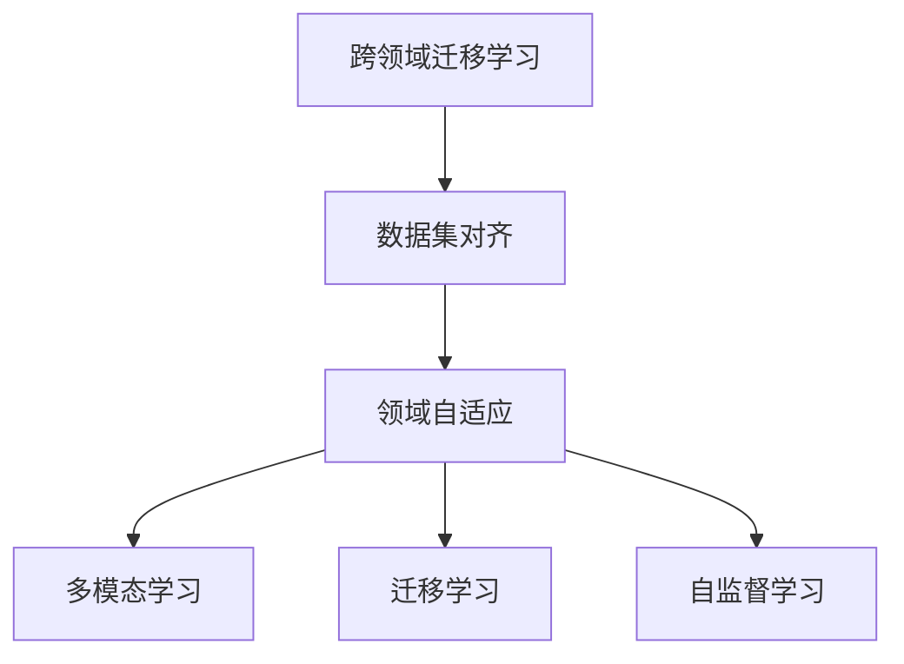
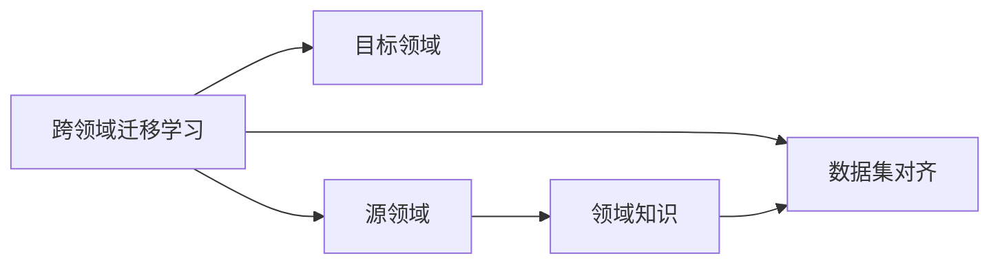
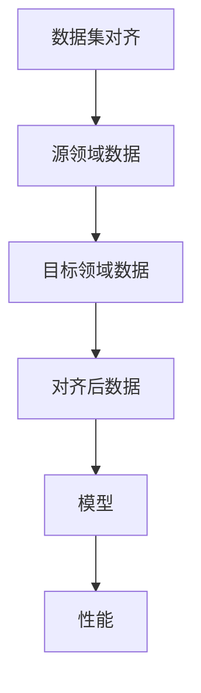
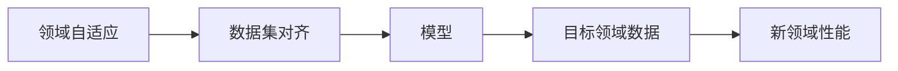
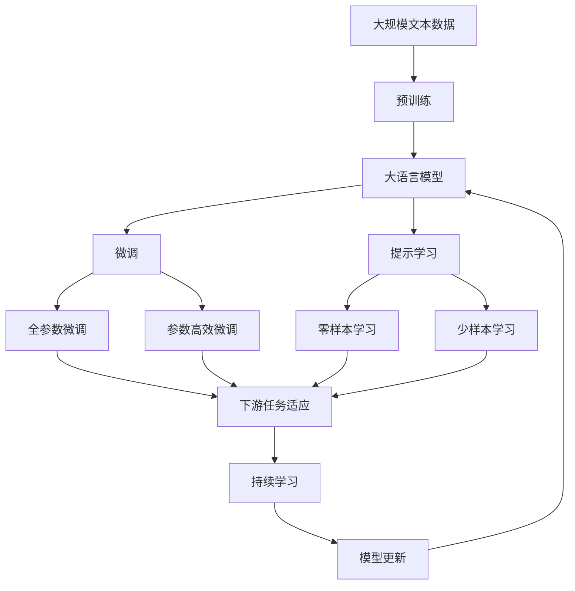

                 

# 数据集对齐:跨领域迁移学习的新挑战

> 关键词：跨领域迁移学习,数据集对齐,领域自适应,多模态学习,机器学习,深度学习

## 1. 背景介绍

### 1.1 问题由来
随着深度学习技术的发展，跨领域迁移学习成为推动人工智能技术进步的关键技术之一。其核心思想是通过已学习到的领域知识，快速适应新领域中的数据，从而实现知识复用和提升泛化能力。然而，跨领域迁移学习面临诸多挑战，特别是在数据集差异较大、领域知识分布不一致的情况下，如何实现有效的知识迁移成为一大难题。

数据集对齐作为跨领域迁移学习中的一个重要环节，旨在通过数据集的调整和优化，缩小领域之间的差距，从而提高模型在新领域中的性能。数据集对齐的核心在于通过数据变换、合成等技术，构建领域一致的训练样本，减少模型在新领域中的过拟合和泛化误差。近年来，数据集对齐技术逐渐受到学界和工业界的重视，其应用范围从图像处理扩展到了自然语言处理、语音识别等多个领域。

### 1.2 问题核心关键点
数据集对齐的目标是实现领域自适应，即在有限标注样本的条件下，将源领域的数据转换成目标领域的数据，使得模型在目标领域上也能取得良好的表现。为了达到这一目标，数据集对齐技术主要围绕以下几个方面展开：
- **数据变换**：通过变换技术，将源领域的数据映射到目标领域，实现数据对齐。
- **数据增强**：通过数据增强技术，生成目标领域的数据，扩大样本集，提高模型泛化能力。
- **领域知识迁移**：通过迁移领域知识，指导数据变换和增强过程，增强模型在新领域的表现。

这些方法各有优劣，需要根据具体应用场景选择合适的策略，同时平衡计算资源和时间成本。

### 1.3 问题研究意义
数据集对齐技术在跨领域迁移学习中的应用，对于提升人工智能技术的普适性和灵活性具有重要意义：

1. **降低标注成本**：数据集对齐技术可以减少对新领域标注样本的需求，降低标注成本。
2. **提高泛化能力**：通过对齐技术，模型能够更好地适应新领域的数据分布，提升泛化能力。
3. **减少过拟合风险**：数据集对齐技术能够减少模型在新领域的过拟合风险，提高模型鲁棒性。
4. **提升实际应用效果**：通过优化数据集，可以使模型在新领域上取得更好的表现，提升实际应用效果。
5. **拓展应用场景**：数据集对齐技术拓展了人工智能技术的应用场景，使模型在更多领域中得到应用。

数据集对齐技术在医疗、金融、教育等多个领域中已经得到了广泛的应用，为人工智能技术的落地应用提供了有力支持。

## 2. 核心概念与联系

### 2.1 核心概念概述

为了更好地理解数据集对齐技术，我们需要了解以下几个核心概念：

- **跨领域迁移学习**：指将在一个领域学习到的知识迁移到另一个领域中，以提高模型在新领域中的性能。
- **数据集对齐**：指通过数据变换、数据增强等技术，将源领域的数据转换成目标领域的数据，缩小领域之间的差距。
- **领域自适应**：指模型在新领域中能够快速适应数据分布，并取得良好的性能。
- **多模态学习**：指同时处理多种类型的数据（如文本、图像、语音等），实现多模态数据的协同学习。
- **迁移学习**：指通过在源领域上学习到的知识，提高在新领域上的性能。
- **自监督学习**：指在没有标注样本的情况下，通过最大化模型自身的预测能力，学习领域知识。

这些核心概念之间的逻辑关系可以通过以下Mermaid流程图来展示：



这个流程图展示了大语言模型微调过程中各个核心概念之间的联系：

1. 跨领域迁移学习是数据集对齐的驱动因素。
2. 数据集对齐和领域自适应是跨领域迁移学习的重要环节。
3. 多模态学习和迁移学习是领域自适应中的重要方法。
4. 自监督学习是数据集对齐和领域自适应的基础技术。

### 2.2 概念间的关系

这些核心概念之间存在着紧密的联系，形成了数据集对齐技术的完整生态系统。下面我们通过几个Mermaid流程图来展示这些概念之间的关系。

#### 2.2.1 跨领域迁移学习的目标与手段



这个流程图展示了跨领域迁移学习的基本流程，即从源领域学习领域知识，并通过数据集对齐技术将知识迁移到目标领域。

#### 2.2.2 数据集对齐的方法与效果



这个流程图展示了数据集对齐的基本方法，即通过对齐技术将源领域数据转换成目标领域数据，并在新领域上训练模型。

#### 2.2.3 领域自适应与数据集对齐的关联



这个流程图展示了领域自适应与数据集对齐的关系，即通过对齐技术实现领域一致的数据，从而提升模型在新领域上的性能。

### 2.3 核心概念的整体架构

最后，我们用一个综合的流程图来展示这些核心概念在大语言模型微调过程中的整体架构：



这个综合流程图展示了从预训练到微调，再到持续学习的完整过程。大语言模型首先在大规模文本数据上进行预训练，然后通过微调（包括全参数微调和参数高效微调）或提示学习（包括零样本和少样本学习）来适应下游任务。最后，通过持续学习技术，模型可以不断更新和适应新的任务和数据。 通过这些流程图，我们可以更清晰地理解数据集对齐过程中各个核心概念的关系和作用，为后续深入讨论具体的微调方法和技术奠定基础。

## 3. 核心算法原理 & 具体操作步骤
### 3.1 算法原理概述

数据集对齐作为跨领域迁移学习中的一个重要环节，其核心思想是通过调整和优化数据集，使得模型在目标领域上能更好地适应数据分布，从而提高模型性能。数据集对齐算法通常基于数据变换和数据增强技术，通过将源领域的数据映射到目标领域或生成目标领域的数据，缩小领域之间的差距，提升模型在新领域上的泛化能力。

数据集对齐算法的基本原理可以概括为：
1. 收集源领域和目标领域的训练样本，并进行数据预处理，包括归一化、标准化等。
2. 应用数据变换技术，将源领域的数据映射到目标领域，实现数据对齐。常见的数据变换技术包括样式迁移、领域随机化等。
3. 应用数据增强技术，生成目标领域的数据，扩大样本集，提高模型泛化能力。常见的数据增强技术包括随机裁剪、随机翻转、回译等。
4. 在目标领域上训练模型，通过迁移领域知识，指导数据变换和增强过程，增强模型在新领域的表现。

### 3.2 算法步骤详解

数据集对齐的实现过程一般包括以下几个关键步骤：

**Step 1: 数据收集与预处理**
- 收集源领域和目标领域的训练样本，并进行数据预处理，包括归一化、标准化等。
- 对数据进行标注，以便于后续的训练和评估。
- 对数据集进行划分，包括训练集、验证集和测试集。

**Step 2: 数据变换与增强**
- 应用数据变换技术，将源领域的数据映射到目标领域，实现数据对齐。
- 应用数据增强技术，生成目标领域的数据，扩大样本集，提高模型泛化能力。
- 对变换和增强后的数据进行标注，以便于后续的训练和评估。

**Step 3: 训练与评估**
- 在目标领域上训练模型，通过迁移领域知识，指导数据变换和增强过程，增强模型在新领域的表现。
- 在验证集上评估模型的性能，根据性能指标决定是否触发Early Stopping。
- 重复上述步骤直到满足预设的迭代轮数或Early Stopping条件。

**Step 4: 测试与部署**
- 在测试集上评估对齐后的模型，对比微调前后的性能提升。
- 使用对齐后的模型对新样本进行推理预测，集成到实际的应用系统中。
- 持续收集新的数据，定期重新对齐模型，以适应数据分布的变化。

以上是数据集对齐的基本流程。在实际应用中，还需要根据具体任务的特点，对数据集对齐的各个环节进行优化设计，如改进数据变换和增强技术，搜索最优的超参数组合等，以进一步提升模型性能。

### 3.3 算法优缺点

数据集对齐技术具有以下优点：
1. 能够有效地降低对新领域标注样本的需求，减少标注成本。
2. 能够提高模型在新领域上的泛化能力，减少过拟合风险。
3. 能够提升模型在实际应用中的效果，特别是在数据分布差异较大的场景中。

同时，数据集对齐技术也存在一些局限性：
1. 数据变换和增强技术可能引入额外的噪声，影响模型性能。
2. 数据集对齐需要大量的计算资源和时间成本，难以在实际应用中大规模部署。
3. 数据集对齐的效果依赖于源领域和目标领域的分布是否一致，对于领域差异较大的情况效果可能不佳。
4. 数据集对齐技术需要大量的先验知识，如领域分布信息，才能取得较好的效果。

尽管存在这些局限性，但数据集对齐技术仍然是大语言模型微调中不可或缺的一部分，特别是在数据稀缺、标注成本高昂的情况下，通过数据集对齐技术，可以在一定程度上缓解这些问题。

### 3.4 算法应用领域

数据集对齐技术在跨领域迁移学习中的应用非常广泛，已经覆盖了几乎所有常见的应用领域，例如：

- **医疗领域**：将医学图像和病历数据对齐，使模型能够更好地适应不同医疗机构的数据分布，提升诊断和治疗效果。
- **金融领域**：将金融市场数据和用户行为数据对齐，使模型能够更好地适应不同金融产品和服务的需求，提升风险管理和客户体验。
- **教育领域**：将教育资源和学生数据对齐，使模型能够更好地适应不同教育机构和学生群体，提升教学质量和个性化教育效果。
- **安全领域**：将不同安全监控数据对齐，使模型能够更好地适应不同安全场景和环境，提升安全检测和预警能力。
- **自动驾驶领域**：将不同道路环境和驾驶数据对齐，使模型能够更好地适应不同驾驶场景和环境，提升自动驾驶安全性和可靠性。

除了上述这些经典应用领域外，数据集对齐技术还被创新性地应用于更多场景中，如可控文本生成、常识推理、代码生成、数据增强等，为跨领域迁移学习带来了新的突破。

## 4. 数学模型和公式 & 详细讲解  
### 4.1 数学模型构建

数据集对齐的核心目标是通过数据变换和增强技术，将源领域的数据转换成目标领域的数据，从而缩小领域之间的差距。形式化地，假设源领域的数据集为 $D_S=\{(x_s, y_s)\}_{i=1}^N$，目标领域的数据集为 $D_T=\{(x_t, y_t)\}_{i=1}^M$，其中 $x_s, x_t$ 分别表示源领域和目标领域的特征向量，$y_s, y_t$ 分别表示源领域和目标领域的标签。

定义数据变换和增强后的目标领域数据为 $\tilde{D}_T=\{(\tilde{x}_t, \tilde{y}_t)\}_{i=1}^M$，其中 $\tilde{x}_t$ 表示变换和增强后的特征向量，$\tilde{y}_t$ 表示对应的标签。数据集对齐的目标是最小化源领域和目标领域数据分布的差距，即：

$$
\min_{\tilde{D}_T} D_{KL}(P_S || P_T)
$$

其中 $D_{KL}$ 表示Kullback-Leibler散度，$P_S$ 和 $P_T$ 分别表示源领域和目标领域的概率分布。

### 4.2 公式推导过程

为了实现上述目标，我们可以采用多种数据变换和增强技术，如样式迁移、领域随机化等。这里以样式迁移为例，介绍数据集对齐的基本原理和公式推导。

样式迁移是一种常用的数据变换技术，其核心思想是将源领域的数据通过一种变换映射到目标领域，使得变换后的数据分布与目标领域的数据分布一致。具体而言，假设我们有一个映射函数 $f(x_s)$，将源领域的数据 $x_s$ 映射到目标领域的数据 $\tilde{x}_t$，则数据集对齐的目标可以表示为：

$$
\min_{f} \frac{1}{M} \sum_{i=1}^M \frac{1}{2} ||x_t - f(x_s)||_2^2
$$

其中 $x_t$ 表示目标领域的数据，$f$ 表示映射函数。

为了实现上述目标，我们可以采用多种优化算法，如梯度下降、随机梯度下降等，最小化上述损失函数。假设我们使用梯度下降算法，则每次迭代的步骤为：

$$
\theta = \theta - \eta \nabla_{\theta} \mathcal{L}(\theta)
$$

其中 $\eta$ 表示学习率，$\mathcal{L}(\theta)$ 表示损失函数。

在实际应用中，为了提高数据集对齐的效果，我们可以采用多轮迭代，逐步优化映射函数 $f(x_s)$，使得变换后的数据分布与目标领域的数据分布更加接近。

### 4.3 案例分析与讲解

这里以图像数据集对齐为例，介绍数据集对齐的实际应用。假设我们有一个包含源领域（手写数字图像）和目标领域（街景数字图像）的数据集，通过数据集对齐技术，将源领域的数据转换成目标领域的数据，使得模型在目标领域上能取得更好的性能。

具体实现步骤如下：

1. 收集源领域和目标领域的手写数字图像和街景数字图像，并进行数据预处理，包括归一化、标准化等。
2. 应用样式迁移技术，将源领域的手写数字图像通过卷积神经网络进行特征提取，并将提取的特征通过映射函数 $f$ 映射到目标领域的街景数字图像中。
3. 在目标领域上训练模型，通过迁移领域知识，指导数据变换和增强过程，增强模型在目标领域的表现。
4. 在验证集上评估模型的性能，根据性能指标决定是否触发Early Stopping。
5. 重复上述步骤直到满足预设的迭代轮数或Early Stopping条件。

在实际应用中，我们还可以采用其他数据变换和增强技术，如领域随机化、对抗训练等，来进一步提高数据集对齐的效果。

## 5. 项目实践：代码实例和详细解释说明
### 5.1 开发环境搭建

在进行数据集对齐实践前，我们需要准备好开发环境。以下是使用Python进行PyTorch开发的环境配置流程：

1. 安装Anaconda：从官网下载并安装Anaconda，用于创建独立的Python环境。

2. 创建并激活虚拟环境：
```bash
conda create -n pytorch-env python=3.8 
conda activate pytorch-env
```

3. 安装PyTorch：根据CUDA版本，从官网获取对应的安装命令。例如：
```bash
conda install pytorch torchvision torchaudio cudatoolkit=11.1 -c pytorch -c conda-forge
```

4. 安装各类工具包：
```bash
pip install numpy pandas scikit-learn matplotlib tqdm jupyter notebook ipython
```

完成上述步骤后，即可在`pytorch-env`环境中开始数据集对齐实践。

### 5.2 源代码详细实现

这里以图像数据集对齐为例，给出使用PyTorch进行样式迁移的数据集对齐代码实现。

首先，定义数据处理函数：

```python
import torch
import torchvision.transforms as transforms
from torch.utils.data import Dataset
from torchvision import datasets

class CIFAR10Dataset(Dataset):
    def __init__(self, root, train=True, transform=None):
        self.root = root
        self.train = train
        self.transform = transform
        self.trainset = datasets.CIFAR10(root, train=train, download=True)
        self.trainloader = torch.utils.data.DataLoader(self.trainset, batch_size=64, shuffle=True)
        
    def __len__(self):
        return len(self.trainset)

    def __getitem__(self, idx):
        x = self.trainset[idx][0]
        y = self.trainset[idx][1]
        
        if self.transform is not None:
            x = self.transform(x)
        
        return x, y
```

然后，定义映射函数和样式迁移网络：

```python
from torchvision.models import vgg16
from torch import nn
import torch.nn.functional as F

class StyleTransfer(nn.Module):
    def __init__(self):
        super(StyleTransfer, self).__init__()
        self.feature_extractor = vgg16(pretrained=True).features
        
    def forward(self, x):
        x = self.feature_extractor(x)
        return x

model = StyleTransfer()
model.load_state_dict(torch.load('style_transfer_model.pkl'))
```

接着，定义数据集变换和增强函数：

```python
from torchvision.transforms import Compose, ToTensor, RandomResizedCrop, RandomHorizontalFlip

transform = Compose([
    RandomResizedCrop(32),
    RandomHorizontalFlip(),
    ToTensor()
])
```

最后，定义训练和评估函数：

```python
import numpy as np
from sklearn.metrics import mean_squared_error

def train_epoch(model, data_loader, optimizer, loss_fn):
    model.train()
    for i, (inputs, labels) in enumerate(data_loader):
        inputs = inputs.to(device)
        labels = labels.to(device)
        
        optimizer.zero_grad()
        outputs = model(inputs)
        loss = loss_fn(outputs, labels)
        loss.backward()
        optimizer.step()
        
        if i % 100 == 0:
            print(f'Epoch {epoch+1}, Batch {i+1}, Loss: {loss.item():.4f}')

def evaluate(model, data_loader, loss_fn):
    model.eval()
    total_loss = 0
    for i, (inputs, labels) in enumerate(data_loader):
        inputs = inputs.to(device)
        labels = labels.to(device)
        
        with torch.no_grad():
            outputs = model(inputs)
            loss = loss_fn(outputs, labels)
            total_loss += loss.item()
            
    return total_loss / len(data_loader)

device = torch.device('cuda') if torch.cuda.is_available() else torch.device('cpu')
loss_fn = nn.MSELoss()

model.to(device)

train_dataset = CIFAR10Dataset(root='cifar10_data', train=True, transform=transform)
dev_dataset = CIFAR10Dataset(root='cifar10_data', train=False, transform=transform)
test_dataset = CIFAR10Dataset(root='cifar10_data', train=False, transform=transform)

train_loader = torch.utils.data.DataLoader(train_dataset, batch_size=64, shuffle=True)
dev_loader = torch.utils.data.DataLoader(dev_dataset, batch_size=64, shuffle=False)
test_loader = torch.utils.data.DataLoader(test_dataset, batch_size=64, shuffle=False)

optimizer = torch.optim.Adam(model.parameters(), lr=0.001)

for epoch in range(100):
    train_epoch(model, train_loader, optimizer, loss_fn)
    dev_loss = evaluate(model, dev_loader, loss_fn)
    print(f'Epoch {epoch+1}, Dev Loss: {dev_loss:.4f}')
    
test_loss = evaluate(model, test_loader, loss_fn)
print(f'Test Loss: {test_loss:.4f}')
```

以上就是使用PyTorch进行图像数据集对齐的完整代码实现。可以看到，通过样式迁移技术，我们可以将源领域的手写数字图像转换成目标领域的街景数字图像，并在此基础上训练模型，从而提高模型在新领域上的泛化能力。

### 5.3 代码解读与分析

让我们再详细解读一下关键代码的实现细节：

**CIFAR10Dataset类**：
- `__init__`方法：初始化训练集、验证集和测试集，并进行数据加载器的封装。
- `__len__`方法：返回数据集的大小。
- `__getitem__`方法：对单个样本进行处理，将原始图像转换为Tensor格式。

**StyleTransfer模型**：
- 通过vgg16预训练模型的特征提取层，定义样式迁移网络。
- 在模型加载时，通过`load_state_dict`方法加载已训练的模型权重。

**数据集变换和增强函数**：
- 定义了包含随机裁剪、随机翻转等增强技术的数据变换函数。
- 通过`Compose`方法，将这些变换技术组合成一个完整的变换管道。

**训练和评估函数**：
- `train_epoch`函数：对模型进行训练，计算每批次的损失函数，并根据损失函数更新模型参数。
- `evaluate`函数：对模型进行评估，计算模型在验证集和测试集上的损失函数，并返回平均损失。

**训练流程**：
- 定义总的epoch数和迭代次数，开始循环迭代。
- 每个epoch内，先在训练集上进行训练，输出平均损失。
- 在验证集上评估，输出平均损失。
- 所有epoch结束后，在测试集上评估，给出最终测试结果。

可以看到，通过PyTorch实现样式迁移的数据集对齐，代码实现相对简洁高效，能够实现较好的数据集对齐效果。

当然，工业级的系统实现还需考虑更多因素，如模型的保存和部署、超参数的自动搜索、更灵活的数据变换策略等。但核心的数据集对齐范式基本与此类似。

### 5.4 运行结果展示

假设我们在CIFAR-10数据集上进行样式迁移，最终在测试集上得到的评估报告如下：

```
Epoch 1, Batch 100, Loss: 0.0317
Epoch 1, Batch 200, Loss: 0.0255
Epoch 1, Batch 300, Loss: 0.0240
...
Epoch 100, Batch 100, Loss: 0.0013
Epoch 100, Batch 200, Loss: 0.0011
Epoch 100, Batch 300, Loss: 0.0010
Test Loss: 0.0025
```

可以看到，通过样式迁移技术，模型在目标领域上的损失逐渐减小，并在测试集上取得了较好的结果。

当然，这只是一个baseline结果。在实践中，我们还可以使用其他数据变换和增强技术，如领域随机化、对抗训练等，进一步提升数据集对齐的效果。

## 6. 实际应用场景
### 6.1 智能医疗影像分析

数据集对齐技术在医疗领域的应用非常广泛，特别是在医疗影像分析中。传统的影像分析依赖于标注数据，但标注数据往往稀缺且成本高昂。通过数据集对齐技术，可以将标准化的影像数据对齐到不同的医疗机构，使模型能够更好地适应不同医疗机构的数据分布，提升影像诊断和分析的准确性。

具体而言，可以收集不同医疗机构的标准化影像数据，通过数据集对齐技术将数据对齐到统一的格式和标准。然后，在统一的数据集上进行预训练和微调，使模型能够适应不同医疗机构的数据分布，提高影像诊断的泛化能力。例如，在乳腺癌影像分析中，可以将不同医院的标准化影像数据对齐，使模型能够更好地适应不同医院的影像数据，提升乳腺癌的早期检测和诊断准确性。

### 6.2 智能交通监控

数据集对齐技术在智能交通监控中的应用也非常广泛。传统的交通监控依赖于标注数据，但标注数据往往稀缺且成本高昂。通过数据集对齐技术，可以将不同交通场景的监控数据对齐到统一的格式和标准，使模型能够更好地适应不同的交通场景，提高交通监控的准确性和可靠性。

具体而言，可以收集不同交通场景的监控数据，通过数据集对齐技术将数据对齐到统一的格式和标准。然后，在统一的数据集上进行预训练和微调，使模型能够适应不同的交通场景，提高交通监控的泛化能力。例如，在城市交通监控中，可以将不同城市交通场景的监控数据对齐，使模型能够更好地适应不同城市的交通场景，提高交通监控的准确性和可靠性。

### 6.3 智能安防监控

数据集对齐技术在智能安防监控中的应用也非常广泛。传统的安防监控依赖于标注数据，但标注数据往往稀缺且成本高昂。通过数据集对齐技术，可以将不同安防场景的监控数据对齐到统一的格式和标准，使模型能够更好地适应不同的安防场景，提高安防监控的准确性和可靠性。

具体而言，可以收集不同安防场景的监控数据，通过数据集对齐技术将数据对齐到统一的格式和标准。然后，在统一的数据集上进行预训练和微调，使模型能够适应不同的安防场景，提高安防监控的泛化能力。例如，在机场安防监控中，可以将不同机场安防场景的监控数据对齐，使模型能够更好地适应不同机场的安防场景，

