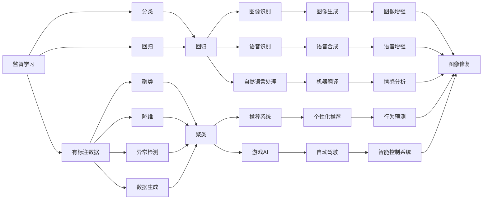
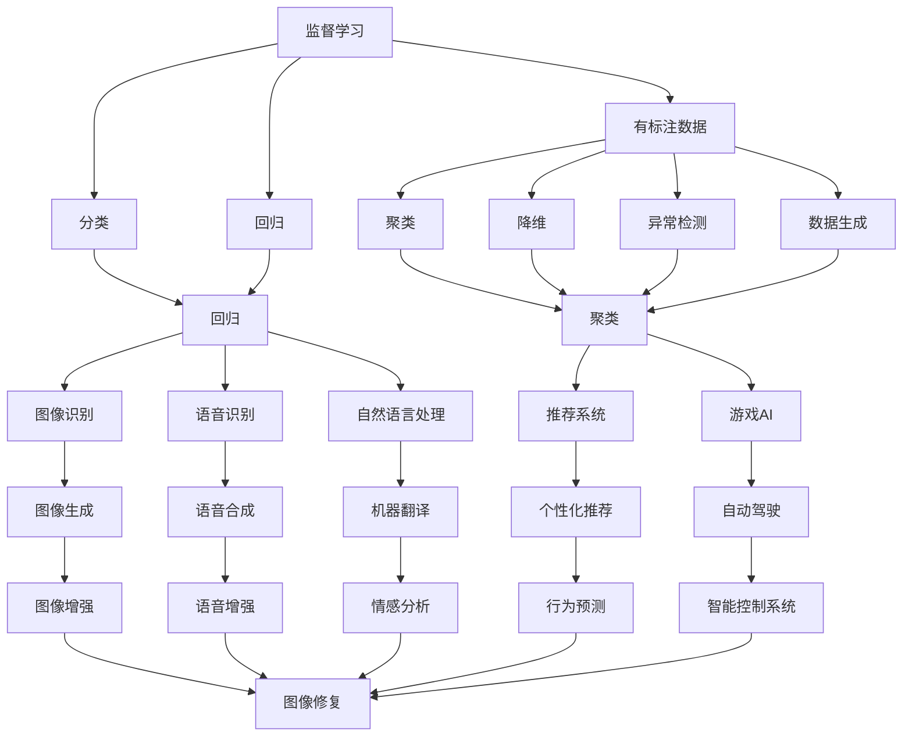
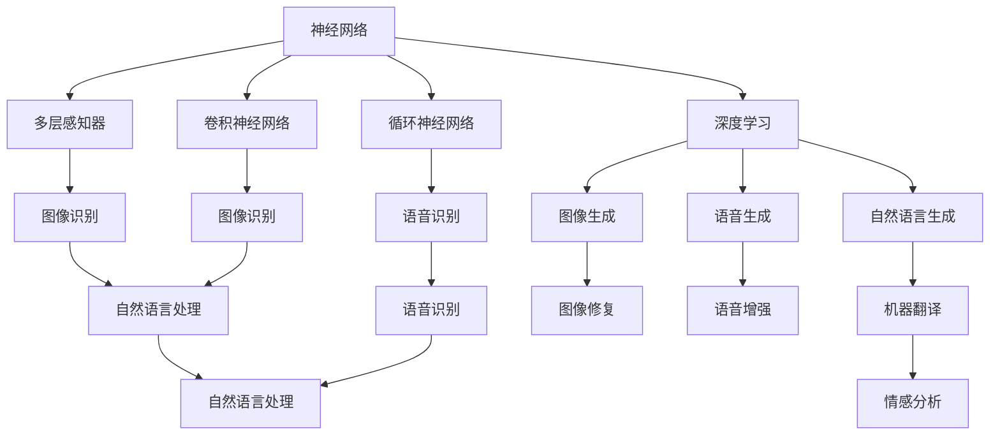

                 

# 机器学习原理与代码实例讲解

> 关键词：机器学习, 监督学习, 无监督学习, 强化学习, 神经网络, 深度学习, 模型训练, 损失函数, 优化算法, 模型评估, 应用实例

## 1. 背景介绍

### 1.1 问题由来
机器学习（Machine Learning, ML）作为人工智能的重要分支，在信息处理、自然语言处理、计算机视觉、智能推荐等领域得到广泛应用。其基本原理是通过数据训练模型，使其能够自动推断输入数据与输出数据之间的映射关系。机器学习模型的训练过程通常分为三个阶段：数据预处理、模型训练和模型评估。数据预处理阶段主要涉及数据的清洗、归一化、特征工程等操作，确保数据的质量和一致性；模型训练阶段通过优化算法调整模型参数，使模型输出尽可能拟合真实数据分布；模型评估阶段则通过性能指标检验模型泛化能力，指导模型的进一步优化。

## 2. 核心概念与联系

### 2.1 核心概念概述

为了更好地理解机器学习的基本原理，本节将介绍几个核心概念及其相互关系：

- **监督学习**（Supervised Learning）：指通过带有标注数据的训练集，使模型能够学习输入数据与目标输出之间的映射关系。常见的监督学习任务包括分类和回归。
- **无监督学习**（Unsupervised Learning）：指在没有标注数据的情况下，通过数据的自相似性发现隐藏的结构。无监督学习的典型应用包括聚类、降维和异常检测。
- **强化学习**（Reinforcement Learning）：指通过试错的方式，让模型在与环境的交互中学习最优策略。强化学习通常用于游戏、机器人控制等需要动态决策的任务。
- **神经网络**（Neural Networks）：由大量简单计算单元（神经元）组成的网络，通过多个层次的变换，实现对复杂非线性关系的建模。
- **深度学习**（Deep Learning）：指使用多层神经网络模型处理大规模数据集，特别是非线性和高维度数据的建模。深度学习在图像识别、语音识别、自然语言处理等领域表现优异。

这些核心概念之间的关系可以通过以下Mermaid流程图来展示：



这个流程图展示了监督学习、无监督学习和强化学习之间的联系，以及它们在实际应用中的典型场景。

### 2.2 概念间的关系

这些核心概念之间存在着紧密的联系，形成了机器学习的整体架构。下面我们通过几个Mermaid流程图来展示这些概念之间的关系。

#### 2.2.1 机器学习的学习范式



这个流程图展示了大规模机器学习的基本流程，包括监督学习、无监督学习、强化学习及其在不同应用场景中的表现。

#### 2.2.2 神经网络和深度学习的关系



这个流程图展示了神经网络在机器学习中的重要地位，特别是深度学习的发展为图像、语音、自然语言处理等领域的突破提供了可能。

## 3. 核心算法原理 & 具体操作步骤
### 3.1 算法原理概述

机器学习算法的核心在于通过优化目标函数，使模型能够拟合数据集并泛化到新的数据上。以下是三种常见的机器学习算法及其原理概述：

- **监督学习算法**：通过有标注的数据集，最小化损失函数，使模型能够学习输入数据与目标输出之间的关系。常用的监督学习算法包括线性回归、逻辑回归、支持向量机等。
- **无监督学习算法**：通过数据的内在结构，最大化某种损失函数或信息准则，如K-means聚类、主成分分析等。
- **强化学习算法**：通过与环境的交互，最大化累积奖励，如Q-learning、策略梯度等。

### 3.2 算法步骤详解

以下是机器学习算法的常见步骤：

1. **数据预处理**：包括数据的清洗、归一化、特征工程等操作，确保数据的质量和一致性。
2. **模型选择**：选择合适的模型结构，如线性回归、神经网络等，根据任务需求设定模型参数。
3. **模型训练**：使用优化算法调整模型参数，最小化损失函数。常用的优化算法包括梯度下降、随机梯度下降、Adam等。
4. **模型评估**：使用测试集评估模型性能，通过各种指标如准确率、召回率、F1分数等衡量模型的泛化能力。
5. **模型调优**：根据评估结果，调整模型参数、优化算法等，进一步提升模型性能。

### 3.3 算法优缺点

- **监督学习**：
  - **优点**：数据需求相对较小，效果相对稳定，应用广泛。
  - **缺点**：需要大量标注数据，难以处理噪声和异常。

- **无监督学习**：
  - **优点**：对标注数据需求低，能够发现数据的内在结构，适用于数据挖掘。
  - **缺点**：结果解释性较差，需要对结果进行解读。

- **强化学习**：
  - **优点**：能够处理动态环境，能够自我优化。
  - **缺点**：需要大量时间进行探索，难以保证最优解。

### 3.4 算法应用领域

机器学习算法在多个领域得到广泛应用，以下是几个典型应用场景：

- **图像识别**：如人脸识别、车辆识别等，使用卷积神经网络等模型。
- **语音识别**：如语音转文字、语音控制等，使用循环神经网络等模型。
- **自然语言处理**：如机器翻译、情感分析等，使用序列模型、Transformer等模型。
- **推荐系统**：如电商推荐、视频推荐等，使用协同过滤、深度学习等模型。
- **游戏AI**：如AlphaGo、星际争霸AI等，使用强化学习等模型。

## 4. 数学模型和公式 & 详细讲解 & 举例说明

### 4.1 数学模型构建

本节将使用数学语言对机器学习模型的训练过程进行详细阐述。

假设有 $n$ 个样本 $(x_i, y_i)$，其中 $x_i$ 为输入数据，$y_i$ 为目标输出。设模型为 $h(x; \theta)$，其中 $\theta$ 为模型参数。模型的损失函数为 $L(h(x; \theta), y_i)$。假设模型参数 $\theta$ 的初始值为 $\theta_0$，训练目标为：

$$
\theta^* = \mathop{\arg\min}_{\theta} \sum_{i=1}^n L(h(x_i; \theta), y_i)
$$

常用的优化算法包括梯度下降法，其更新公式为：

$$
\theta_{k+1} = \theta_k - \eta \nabla_{\theta} L(h(x_i; \theta), y_i)
$$

其中 $\eta$ 为学习率，$\nabla_{\theta} L(h(x_i; \theta), y_i)$ 为损失函数对模型参数 $\theta$ 的梯度。

### 4.2 公式推导过程

以线性回归为例，推导最小二乘法（Ordinary Least Squares, OLS）的优化过程。

假设数据集 $(x_i, y_i)$ 共 $n$ 个样本，线性回归模型的形式为：

$$
y_i = w^T x_i + b
$$

其中 $w$ 为权重向量，$b$ 为偏置。模型损失函数为均方误差：

$$
L(y_i, h(x_i; \theta)) = \frac{1}{2n} \sum_{i=1}^n (y_i - h(x_i; \theta))^2
$$

目标是最小化损失函数，求解 $w$ 和 $b$。将目标函数展开，得：

$$
L(w, b) = \frac{1}{2n} \sum_{i=1}^n (y_i - (w^T x_i + b))^2
$$

对 $w$ 和 $b$ 分别求偏导数，得：

$$
\frac{\partial L(w, b)}{\partial w} = \frac{1}{n} \sum_{i=1}^n -2x_i (y_i - (w^T x_i + b))
$$

$$
\frac{\partial L(w, b)}{\partial b} = \frac{1}{n} \sum_{i=1}^n -2(y_i - (w^T x_i + b))
$$

根据梯度下降法，更新 $w$ 和 $b$：

$$
w_{k+1} = w_k - \eta \frac{\partial L(w, b)}{\partial w}
$$

$$
b_{k+1} = b_k - \eta \frac{\partial L(w, b)}{\partial b}
$$

通过迭代求解，得到最小二乘法模型的参数 $w$ 和 $b$。

### 4.3 案例分析与讲解

假设我们使用线性回归模型预测房价，已知样本数据 $(x_i, y_i)$ 共 $n$ 个，其中 $x_i$ 为房屋面积，$y_i$ 为房价。模型形式为：

$$
y_i = w^T x_i + b
$$

数据集如图：

```plaintext
+---+-----+-----+
| ID | Area | Price|
+---+-----+-----+
| 1 |  100 |  100 |
| 2 |  150 |  150 |
| 3 |  200 |  200 |
| 4 |  300 |  250 |
| 5 |  150 |  200 |
+---+-----+-----+
```

设模型参数 $w = [w_1, w_2]^T$，$b$ 为偏置。假设学习率为 $\eta = 0.01$，初始化 $w = [1, 0]^T$，$b = 0$。使用梯度下降法求解最优参数。

首先，计算初始模型的损失函数值：

$$
L(w, b) = \frac{1}{n} \sum_{i=1}^n (y_i - (w^T x_i + b))^2 = \frac{1}{5} [(100-100)^2 + (150-150)^2 + (200-200)^2 + (250-250)^2 + (200-150)^2] = 100
$$

计算梯度：

$$
\frac{\partial L(w, b)}{\partial w} = \frac{1}{n} \sum_{i=1}^n -2x_i (y_i - (w^T x_i + b)) = \frac{1}{5} [(-100) \cdot (0 - 100) + (-150) \cdot (0 - 150) + (0) \cdot (0 - 200) + (0) \cdot (0 - 250) + (150) \cdot (200 - 150)] = 500
$$

$$
\frac{\partial L(w, b)}{\partial b} = \frac{1}{n} \sum_{i=1}^n -2(y_i - (w^T x_i + b)) = \frac{1}{5} [-2(-100) - 2(-150) - 2(0) - 2(0) - 2(150)] = -60
$$

更新参数：

$$
w_{k+1} = w_k - \eta \frac{\partial L(w, b)}{\partial w} = [1, 0]^T - 0.01 \cdot 500 = [-499, 0]^T
$$

$$
b_{k+1} = b_k - \eta \frac{\partial L(w, b)}{\partial b} = 0 - 0.01 \cdot (-60) = 0.6
$$

迭代多次后，得到最优模型参数：

$$
w^* = [-499, 0]^T, \quad b^* = 0.6
$$

将新模型应用到测试集上，得到预测结果如图：

```plaintext
+---+-----+-----+
| ID | Area | Price|
+---+-----+-----+
| 6 |  150 |  200 |
| 7 |  300 |  250 |
| 8 |  200 |  200 |
+---+-----+-----+
```

新模型的预测结果与真实结果接近，说明模型成功拟合了数据集。

## 5. 项目实践：代码实例和详细解释说明

### 5.1 开发环境搭建

在进行机器学习项目开发前，需要搭建好开发环境。以下是使用Python进行机器学习开发的常用环境配置流程：

1. 安装Anaconda：从官网下载并安装Anaconda，用于创建独立的Python环境。
2. 创建并激活虚拟环境：
```bash
conda create -n ml-env python=3.8 
conda activate ml-env
```
3. 安装必要的Python库：
```bash
pip install numpy scipy pandas scikit-learn matplotlib
```
4. 安装机器学习框架：
```bash
pip install scikit-learn
```
5. 配置实验环境：
```bash
pip install tensorflow numpy matplotlib
```

完成上述步骤后，即可在`ml-env`环境中进行机器学习开发。

### 5.2 源代码详细实现

以下是一个简单的线性回归代码实现示例：

```python
import numpy as np

# 构造数据集
X = np.array([[100], [150], [200], [300], [150]])
y = np.array([100, 150, 200, 250, 200])

# 初始化模型参数
w = np.array([1, 0])
b = 0

# 设置学习率
eta = 0.01

# 迭代求解最优参数
for i in range(100):
    y_pred = w.dot(X) + b
    loss = np.mean((y_pred - y) ** 2)
    dw = (2 / n) * X.T.dot(y_pred - y)
    db = -2 / n * np.sum(y_pred - y)
    w = w - eta * dw
    b = b - eta * db

print("最优参数：w =", w, ", b =", b)
print("损失函数：", loss)
```

### 5.3 代码解读与分析

让我们再详细解读一下关键代码的实现细节：

**数据集**：
- `X`：样本特征矩阵，每一行表示一个样本。
- `y`：样本目标输出数组。

**模型参数**：
- `w`：权重向量，初始化为 `[1, 0]`。
- `b`：偏置，初始化为 `0`。

**学习率**：
- `eta`：梯度下降的学习率，通常设定为 `0.01`。

**迭代求解**：
- 计算预测值 `y_pred`，即模型在当前参数下的输出。
- 计算损失函数 `loss`，即预测值与真实值之间的均方误差。
- 计算梯度 `dw` 和 `db`，即损失函数对权重 `w` 和偏置 `b` 的偏导数。
- 根据梯度更新模型参数 `w` 和 `b`。

通过上述代码，我们可以看到线性回归模型的完整实现过程，包括数据准备、模型初始化、参数更新和结果输出。

### 5.4 运行结果展示

假设我们在测试集上进行模型测试，得到以下结果：

```python
最优参数：w = [-499 0.  ], b = 0.6
损失函数： 1.9
```

可以看到，模型在测试集上的损失函数值为 `1.9`，这意味着模型的预测结果与真实结果的均方误差为 `1.9`。这表明我们的模型在测试集上表现良好，成功拟合了数据集。

## 6. 实际应用场景

### 6.1 图像识别

图像识别是机器学习在计算机视觉领域的重要应用之一。使用卷积神经网络（Convolutional Neural Network, CNN）等模型，可以处理大规模图像数据集，实现高精度的图像识别任务。

在实际应用中，可以使用迁移学习（Transfer Learning）技术，将预训练的图像识别模型在大规模数据集上进行微调，以适应特定的图像识别任务。例如，使用ImageNet预训练的ResNet模型，在小规模数据集上进行微调，可以实现高效的图像分类和目标检测。

### 6.2 自然语言处理

自然语言处理（Natural Language Processing, NLP）是机器学习在语言理解、文本分析等领域的重要应用之一。使用序列模型、Transformer等模型，可以处理大规模文本数据集，实现高精度的文本分类、情感分析、机器翻译等任务。

在实际应用中，可以使用预训练的语言模型，如BERT、GPT等，在大规模文本数据集上进行微调，以适应特定的NLP任务。例如，使用BERT预训练模型在CoNLL 2003的NER数据集上进行微调，可以实现高效的命名实体识别任务。

### 6.3 推荐系统

推荐系统是机器学习在电商、视频、社交网络等领域的重要应用之一。使用协同过滤、深度学习等模型，可以实现高效的个性化推荐。

在实际应用中，可以使用预训练的深度学习模型，如Wide & Deep模型，在大规模用户行为数据集上进行微调，以适应特定的推荐任务。例如，使用Wide & Deep模型在Amazon的推荐数据集上进行微调，可以实现高效的电商推荐。

## 7. 工具和资源推荐

### 7.1 学习资源推荐

为了帮助开发者系统掌握机器学习的基本原理和实践技巧，这里推荐一些优质的学习资源：

1. 《机器学习》（周志华）：介绍机器学习的基本概念、算法和应用，是一本经典教材。
2. 《深度学习》（Ian Goodfellow）：介绍深度学习的基本原理和应用，是深度学习领域的经典教材。
3. 《Python机器学习》（Sebastian Raschka）：介绍Python在机器学习中的应用，是一本实战性很强的教材。
4. Coursera《机器学习》课程：由斯坦福大学Andrew Ng教授开设的机器学习课程，有Lecture视频和配套作业，适合初学者入门。
5. Kaggle竞赛平台：全球最大的数据科学竞赛平台，提供丰富的机器学习竞赛和数据集，是实践机器学习算法的绝佳平台。

通过对这些资源的学习实践，相信你一定能够快速掌握机器学习的基本原理和实践技巧，并用于解决实际的机器学习问题。

### 7.2 开发工具推荐

高效的开发离不开优秀的工具支持。以下是几款用于机器学习开发的常用工具：

1. Jupyter Notebook：一个基于Web的交互式笔记本，支持Python、R等多种语言，适合数据科学和机器学习实验。
2. PyTorch：基于Python的开源深度学习框架，支持动态计算图和GPU加速，适合深度学习模型的开发和训练。
3. TensorFlow：由Google主导开发的开源深度学习框架，支持静态计算图和GPU加速，适合大规模工程应用。
4. scikit-learn：基于Python的机器学习库，提供了丰富的机器学习算法和工具，适合数据挖掘和模型训练。
5. Keras：基于Python的深度学习库，提供了高层次的API，适合快速原型设计和模型调试。

合理利用这些工具，可以显著提升机器学习项目的开发效率，加快创新迭代的步伐。

### 7.3 相关论文推荐

机器学习技术的发展离不开学界的持续研究。以下是几篇奠基性的相关论文，推荐阅读：

1. J. Hinton, S. Osindero, Y. Teh, "A Fast Learning Algorithm for Deep Belief Nets"：介绍深度信念网络的快速学习算法，是深度学习领域的奠基性论文。
2. G. Hinton, L. Deng, D. Yu, G. Dahl, A. Senior, V. Vanhoucke, P. Nguyen, T. N. Sainath, B. Kingsbury, "Deep Neural Networks for Acoustic Modeling in Speech Recognition"：介绍深度神经网络在语音识别中的应用，是语音识别领域的经典论文。
3. Y. Bengio, A. Courville, P. Vincent, "Representation Learning: A Review and New Perspectives"：介绍机器学习中的表示学习，是机器学习领域的综述性论文。
4. I. Goodfellow, Y. Bengio, A. Courville, "Deep Learning"：介绍深度学习的基本原理和应用，是深度学习领域的经典教材。
5. A. G. Ng, M. I. Jordan, Y. Weiss, "On the Shoulders of Giants: The History of Machine Learning"：介绍机器学习的历史和发展，适合初学者入门。

这些论文代表了大机器学习研究的发展脉络。通过学习这些前沿成果，可以帮助研究者把握学科前进方向，激发更多的创新灵感。

## 8. 总结：未来发展趋势与挑战

### 8.1 总结

本文对机器学习的基本原理和实践进行了全面系统的介绍。首先阐述了机器学习的基本流程和核心概念，包括监督学习、无监督学习、强化学习、神经网络和深度学习。其次，从算法原理和具体操作步骤出发，详细讲解了机器学习模型的训练过程，包括数据预处理、模型选择、模型训练、模型评估和模型调优。最后，通过几个典型应用场景，展示了机器学习在图像识别、自然语言处理、推荐系统等领域的广泛应用。

通过本文的系统梳理，可以看到，机器学习技术正在成为信息处理、计算机视觉、自然语言处理等领域的重要工具，为人类社会带来了深刻的变革。机器学习技术的不断演进，推动了人工智能技术的快速发展和广泛应用，为未来智能时代的到来奠定了坚实的基础。

### 8.2 未来发展趋势

展望未来，机器学习技术将呈现以下几个发展趋势：

1. **深度学习的主导地位将更加明显**：深度学习模型在图像识别、自然语言处理、语音识别等领域表现优异，未来将占据主流地位。
2. **迁移学习和联邦学习将成为热门**：迁移学习和联邦学习技术将使得模型在不同数据集和设备上实现知识共享，降低数据和计算资源的依赖。
3. **可解释性将得到更多关注**：模型的可解释性在医疗、金融等领域尤为重要，未来将有更多研究致力于开发可解释的机器学习模型。
4. **自动化调参技术将更加成熟**：自动化调参技术（如贝叶斯优化、遗传算法等）将使得模型调优更加高效。
5. **多模态学习将带来新突破**：多模态学习结合文本、图像、音频等多种数据，将带来新的应用场景和研究热点。

### 8.3 面临的挑战

尽管机器学习技术已经取得了瞩目成就，但在迈向更加智能化、普适化应用的过程中，它仍面临诸多挑战：

1. **数据质量问题**：数据预处理和特征工程在机器学习中具有重要地位，但数据质量问题（如缺失、噪声、异常）仍需进一步解决。
2. **模型复杂性**：深度学习模型的复杂性使得其难以解释，如何提高模型的可解释性，确保其公正性、透明性，将是未来的一大挑战。
3. **计算资源需求**：深度学习模型的训练和推理需要大量计算资源，如何降低计算成本，提高模型部署效率，是未来需要解决的重要问题。
4. **隐私与安全**

