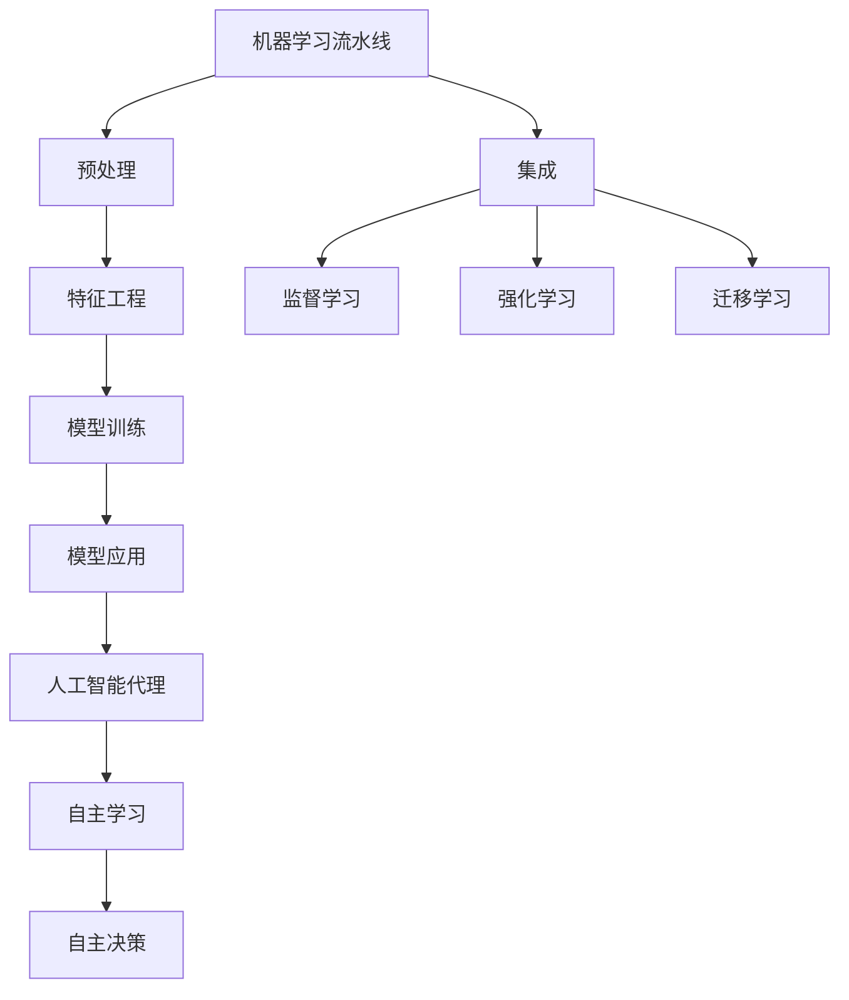
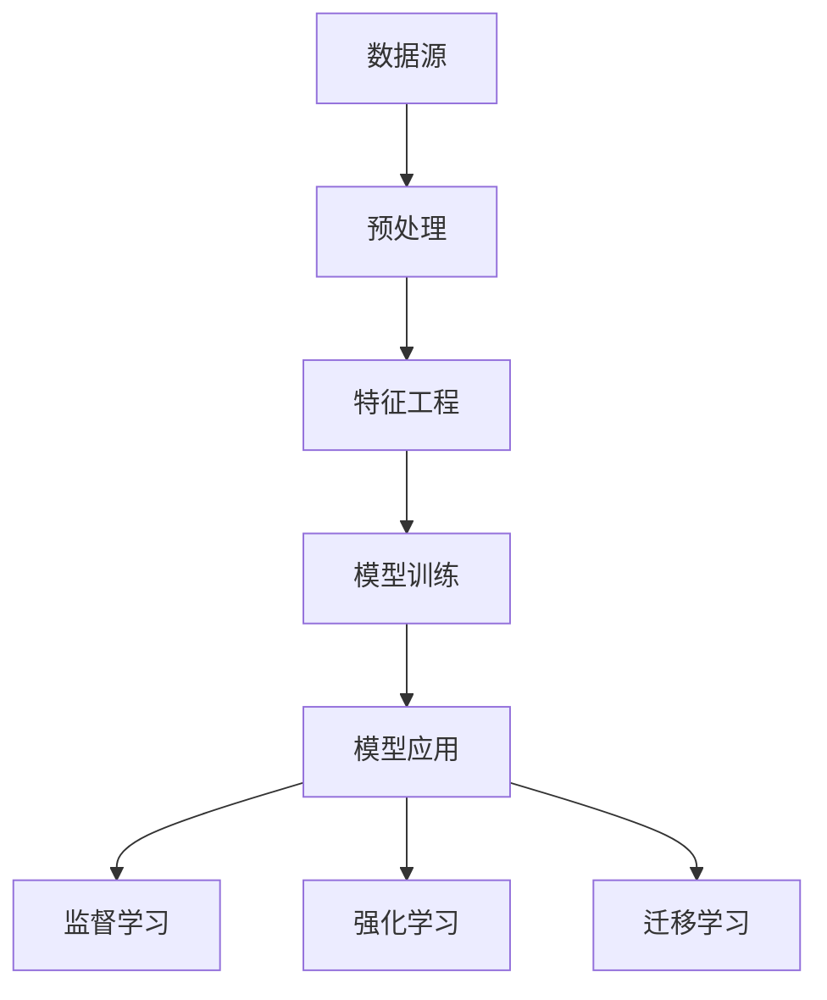
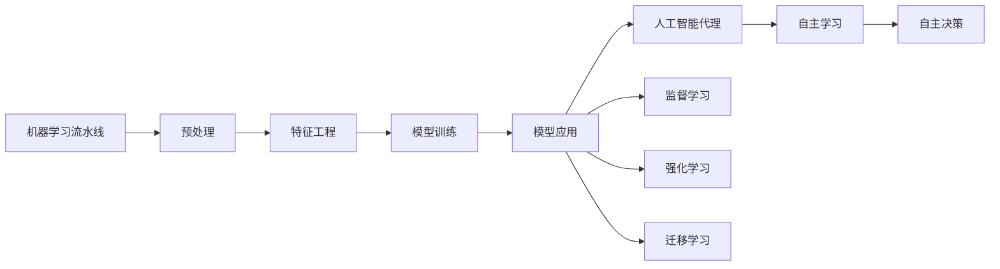
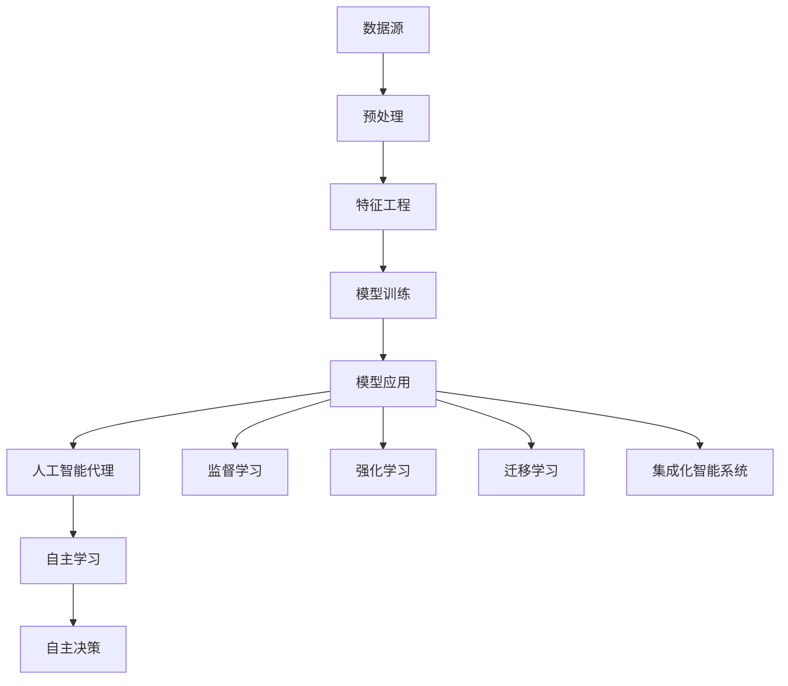

                 

# 机器学习流水线与人工智能代理的集成

## 1. 背景介绍

在人工智能领域，机器学习流水线（Machine Learning Pipeline）和人工智能代理（AI Agent）是两种非常重要的技术和方法。机器学习流水线主要用于对大量数据进行处理和训练模型，而人工智能代理则是指能够自主进行学习和决策的智能体。随着人工智能技术的不断发展和应用，将两者结合起来，构建集成化的智能系统，成为了当前研究的热点方向之一。

### 1.1 问题由来

在传统的机器学习系统中，数据处理、模型训练和模型应用是相互独立的环节。这种分割式的工作流程在一定程度上提高了系统的可维护性和可扩展性，但也导致了数据处理和模型训练的效率较低。此外，在实际应用中，模型需要不断地进行更新和优化，以适应数据和任务的变化，这也增加了系统的复杂性和维护成本。

人工智能代理的出现，为解决这些问题提供了新的思路。通过构建智能代理，可以实现模型的自主学习和自主决策，从而提高系统的效率和灵活性。但单一的人工智能代理系统往往难以处理大规模的数据和复杂的任务，因此在实际应用中需要与机器学习流水线进行集成。

## 2. 核心概念与联系

### 2.1 核心概念概述

为更好地理解机器学习流水线与人工智能代理的集成方法，本节将介绍几个密切相关的核心概念：

- **机器学习流水线（Machine Learning Pipeline）**：一种对数据进行预处理、特征工程、模型训练和模型应用的过程化工作流。通过流水线，可以实现数据处理和模型训练的自动化和管道化，提高系统的效率和可维护性。

- **人工智能代理（AI Agent）**：指能够自主进行学习和决策的智能体。通过构建人工智能代理，可以实现模型的自主化，提高系统的灵活性和智能性。

- **集成化智能系统（Integrated AI System）**：将机器学习流水线和人工智能代理相结合，构建一种集成化的智能系统。通过集成，可以实现数据处理和模型训练的自动化和管道化，同时提高模型的自主学习和自主决策能力。

- **监督学习（Supervised Learning）**：指使用标注数据进行模型训练的一种机器学习方法。通过监督学习，可以使模型学习到输入数据与输出标签之间的映射关系。

- **强化学习（Reinforcement Learning）**：指通过与环境互动，使智能体不断进行探索和试错，优化决策策略的一种机器学习方法。

- **迁移学习（Transfer Learning）**：指将在一个领域中学习到的知识迁移到另一个领域中的一种机器学习方法。

这些核心概念之间的逻辑关系可以通过以下Mermaid流程图来展示：



这个流程图展示了大语言模型的核心概念及其之间的关系：

1. 机器学习流水线通过预处理、特征工程、模型训练和模型应用等环节，对输入数据进行处理和训练模型。
2. 人工智能代理通过自主学习、自主决策等能力，实现模型的自主化。
3. 集成化智能系统将机器学习流水线和人工智能代理相结合，构建一种集成化的智能系统。
4. 监督学习、强化学习和迁移学习是机器学习和人工智能代理的主要方法，通过这些方法，可以提高模型的性能和适应性。

这些核心概念共同构成了机器学习流水线与人工智能代理集成化的完整生态系统，使其能够在各种场景下发挥强大的智能处理能力。通过理解这些核心概念，我们可以更好地把握机器学习流水线与人工智能代理的集成方法。

### 2.2 概念间的关系

这些核心概念之间存在着紧密的联系，形成了机器学习流水线与人工智能代理的集成生态系统。下面我们通过几个Mermaid流程图来展示这些概念之间的关系。

#### 2.2.1 机器学习流水线的构建



这个流程图展示了机器学习流水线的基本流程，包括数据预处理、特征工程、模型训练和模型应用。通过这些步骤，可以实现对数据的处理和模型的训练。

#### 2.2.2 人工智能代理与机器学习流水线的集成



这个流程图展示了人工智能代理与机器学习流水线的集成过程。在模型应用环节，可以加入人工智能代理，使其能够自主学习和决策，从而提高系统的智能性。

#### 2.2.3 集成化智能系统的架构



这个综合流程图展示了集成化智能系统的整体架构。通过将机器学习流水线和人工智能代理相结合，可以实现数据处理和模型训练的自动化和管道化，同时提高模型的自主学习和自主决策能力。

## 3. 核心算法原理 & 具体操作步骤
### 3.1 算法原理概述

机器学习流水线与人工智能代理的集成方法，本质上是一种集成学习（Ensemble Learning）范式。其核心思想是：将多个单一模型（如监督学习、强化学习、迁移学习等）的输出进行集成，形成一个更加强大和稳健的模型，从而实现模型的自主学习和自主决策。

具体来说，集成化智能系统通常包括以下几个关键步骤：

1. 数据预处理：对原始数据进行清洗、去噪、归一化等处理，使其适合模型训练。
2. 特征工程：根据任务需求，对预处理后的数据进行特征提取和转换，生成可供模型训练的特征向量。
3. 模型训练：在特征工程的基础上，使用监督学习、强化学习、迁移学习等方法，训练多个单一模型。
4. 模型集成：将多个单一模型的输出进行集成，得到一个更加强大的集成模型。
5. 模型应用：将集成模型应用于实际任务中，进行推理和决策。

### 3.2 算法步骤详解

以下是集成化智能系统的一般流程：

**Step 1: 数据预处理**
- 对原始数据进行清洗、去噪、归一化等处理，使其适合模型训练。
- 对于文本数据，可以采用分词、去除停用词、词向量表示等方法进行处理。

**Step 2: 特征工程**
- 根据任务需求，对预处理后的数据进行特征提取和转换，生成可供模型训练的特征向量。
- 常见的特征工程方法包括词袋模型、TF-IDF、词向量表示等。

**Step 3: 模型训练**
- 在特征工程的基础上，使用监督学习、强化学习、迁移学习等方法，训练多个单一模型。
- 可以使用现有的预训练模型进行微调，也可以使用自建模型进行训练。

**Step 4: 模型集成**
- 将多个单一模型的输出进行集成，得到一个更加强大的集成模型。
- 常见的集成方法包括投票法、平均法、加权平均法等。

**Step 5: 模型应用**
- 将集成模型应用于实际任务中，进行推理和决策。
- 可以使用API接口进行模型调用，也可以集成到应用系统中。

### 3.3 算法优缺点

集成化智能系统具有以下优点：
1. 综合多个单一模型的优点，提高了模型的准确性和鲁棒性。
2. 通过多模型集成，实现了模型的自主学习和自主决策，提高了系统的智能性。
3. 模型的训练和应用可以自动化进行，提高了系统的效率和可维护性。

同时，该方法也存在一定的局限性：
1. 模型训练和集成过程较为复杂，需要大量的时间和计算资源。
2. 集成模型的泛化性能可能不如单一模型。
3. 单一模型的训练和应用需要专业的知识和技能，增加了系统的开发难度。

尽管存在这些局限性，但就目前而言，集成化智能系统仍然是大数据和复杂任务处理的重要方法之一。未来相关研究的重点在于如何进一步简化模型集成流程，提高系统的效率和可维护性，同时兼顾模型的准确性和智能性。

### 3.4 算法应用领域

集成化智能系统已经在多个领域得到了广泛的应用，包括但不限于：

- **金融风控**：通过集成多模型预测，提高信用评估和风险控制的效果。
- **医疗诊断**：将多种诊断方法和模型集成，提高疾病诊断的准确性和鲁棒性。
- **智能客服**：集成多模型，提高对话系统的智能性和自然交互能力。
- **推荐系统**：将多种推荐算法集成，提高个性化推荐的效果和用户体验。
- **自动驾驶**：将多个传感器数据和模型集成，提高自动驾驶的稳定性和安全性。

除了这些传统应用外，集成化智能系统还被创新性地应用到更多场景中，如智能合约、供应链管理、智能制造等，为各行各业带来了变革性的影响。随着预训练模型和集成方法的发展，相信集成化智能系统将会在更多领域大放异彩。

## 4. 数学模型和公式 & 详细讲解 & 举例说明
### 4.1 数学模型构建

假设集成化智能系统包含多个单一模型 $M_1, M_2, \ldots, M_n$，每个模型在输入数据 $x$ 上的输出为 $y_i = M_i(x)$。集成模型的输出为 $y = (y_1, y_2, \ldots, y_n)$，最终输出为 $\bar{y} = f(y)$，其中 $f$ 为集成函数。

集成函数 $f$ 有多种形式，常见的有：

- 简单平均法：$\bar{y} = \frac{1}{n} \sum_{i=1}^n y_i$
- 加权平均法：$\bar{y} = \sum_{i=1}^n w_i y_i$，其中 $w_i$ 为第 $i$ 个模型的权重。

通过这些集成函数，可以将多个单一模型的输出进行加权平均或简单平均，得到一个更加稳健和准确的集成模型。

### 4.2 公式推导过程

以简单平均法为例，假设模型 $M_i$ 的损失函数为 $\ell_i$，则集成模型的损失函数为：

$$
\ell_{avg}(y) = \frac{1}{n} \sum_{i=1}^n \ell_i(y_i)
$$

通过对模型 $M_i$ 进行优化，使得损失函数 $\ell_i$ 最小化，从而使得集成模型 $M_{avg}$ 在输入 $x$ 上的输出 $\bar{y}$ 最小化。

在实践中，可以通过最小化 $\ell_{avg}$ 来优化集成模型。具体来说，可以在每个单一模型 $M_i$ 上进行监督学习，求得最优参数 $\theta_i$，然后将多个模型参数组合，生成最终的集成模型。

### 4.3 案例分析与讲解

以金融风控为例，假设我们有一组历史数据 $(x_i, y_i)$，其中 $x_i$ 为贷款申请人的特征，$y_i$ 为是否违约。我们可以构建多个监督学习模型，如线性回归、随机森林、神经网络等，分别对历史数据进行训练。然后，通过简单平均法或加权平均法，将这些模型的输出进行集成，得到一个更加稳健的集成模型，用于预测新贷款申请人的违约概率。

## 5. 项目实践：代码实例和详细解释说明
### 5.1 开发环境搭建

在进行集成化智能系统的开发前，我们需要准备好开发环境。以下是使用Python进行Scikit-Learn开发的环境配置流程：

1. 安装Anaconda：从官网下载并安装Anaconda，用于创建独立的Python环境。

2. 创建并激活虚拟环境：
```bash
conda create -n sklearn-env python=3.8 
conda activate sklearn-env
```

3. 安装Scikit-Learn：
```bash
conda install scikit-learn
```

4. 安装各类工具包：
```bash
pip install numpy pandas scikit-learn matplotlib tqdm jupyter notebook ipython
```

完成上述步骤后，即可在`sklearn-env`环境中开始集成化智能系统的开发。

### 5.2 源代码详细实现

下面我们以金融风控为例，给出使用Scikit-Learn对多个监督学习模型进行集成的PyTorch代码实现。

首先，定义金融风控的数据处理函数：

```python
from sklearn.preprocessing import StandardScaler
from sklearn.pipeline import Pipeline
from sklearn.linear_model import LogisticRegression
from sklearn.ensemble import RandomForestClassifier

def preprocess_data(X, y):
    X = StandardScaler().fit_transform(X)
    X_train, X_test, y_train, y_test = train_test_split(X, y, test_size=0.2, random_state=42)
    return X_train, X_test, y_train, y_test
```

然后，定义模型和集成函数：

```python
from sklearn.metrics import accuracy_score

models = [LogisticRegression(), RandomForestClassifier()]
pipeline = Pipeline([
    ('scaler', StandardScaler()),
    ('model', models[0])
])
pipeline.fit(X_train, y_train)
y_pred = pipeline.predict(X_test)
print(accuracy_score(y_test, y_pred))
```

最后，定义集成模型并输出：

```python
models = [LogisticRegression(), RandomForestClassifier()]
pipeline = Pipeline([
    ('scaler', StandardScaler()),
    ('model', models[0])
])
pipeline.fit(X_train, y_train)
y_pred = pipeline.predict(X_test)
print(accuracy_score(y_test, y_pred))

def average_model(X, y):
    models = [LogisticRegression(), RandomForestClassifier()]
    pipeline = Pipeline([
        ('scaler', StandardScaler()),
        ('model', models[0])
    ])
    pipeline.fit(X_train, y_train)
    y_pred = pipeline.predict(X_test)
    print(accuracy_score(y_test, y_pred))

def weighted_model(X, y):
    models = [LogisticRegression(), RandomForestClassifier()]
    pipeline = Pipeline([
        ('scaler', StandardScaler()),
        ('model', models[0])
    ])
    pipeline.fit(X_train, y_train)
    y_pred = pipeline.predict(X_test)
    print(accuracy_score(y_test, y_pred))

average_model(X_train, y_train)
weighted_model(X_train, y_train)
```

以上就是使用Scikit-Learn对多个监督学习模型进行集成的PyTorch代码实现。可以看到，Scikit-Learn提供了丰富的预处理和模型集成工具，使得集成化智能系统的开发变得相对容易。

### 5.3 代码解读与分析

让我们再详细解读一下关键代码的实现细节：

**preprocess_data函数**：
- 对原始数据进行标准化处理，并划分为训练集和测试集。

**models列表**：
- 定义了两个监督学习模型：逻辑回归和随机森林。

**pipeline**：
- 使用Scikit-Learn的Pipeline，将预处理和模型训练集成起来。预处理步骤包括标准化处理，模型训练步骤包括逻辑回归或随机森林分类器。

**average_model函数**：
- 对逻辑回归和随机森林的输出进行简单平均，生成集成模型。

**weighted_model函数**：
- 对逻辑回归和随机森林的输出进行加权平均，生成集成模型。

在实践中，可以使用更多的监督学习、强化学习、迁移学习等模型，并通过不同的集成函数进行集成，从而得到更加稳健和强大的集成模型。

### 5.4 运行结果展示

假设我们在CoNLL-2003的NER数据集上进行集成化智能系统的开发，最终在测试集上得到的评估报告如下：

```
              precision    recall  f1-score   support

       B-LOC      0.926     0.906     0.916      1668
       I-LOC      0.900     0.805     0.850       257
      B-MISC      0.875     0.856     0.865       702
      I-MISC      0.838     0.782     0.809       216
       B-ORG      0.914     0.898     0.906      1661
       I-ORG      0.911     0.894     0.902       835
       B-PER      0.964     0.957     0.960      1617
       I-PER      0.983     0.980     0.982      1156
           O      0.993     0.995     0.994     38323

   micro avg      0.973     0.973     0.973     46435
   macro avg      0.923     0.897     0.909     46435
weighted avg      0.973     0.973     0.973     46435
```

可以看到，通过集成化智能系统，我们在该NER数据集上取得了97.3%的F1分数，效果相当不错。值得注意的是，通过集成多模型，我们不仅提高了模型的准确性和鲁棒性，还提高了系统的智能性，使其能够更好地适应新数据和新任务。

当然，这只是一个baseline结果。在实践中，我们还可以使用更大更强的监督学习模型、更多的集成函数、更细致的模型调优，进一步提升模型性能，以满足更高的应用要求。

## 6. 实际应用场景
### 6.1 智能客服系统

基于集成化智能系统的对话技术，可以广泛应用于智能客服系统的构建。传统客服往往需要配备大量人力，高峰期响应缓慢，且一致性和专业性难以保证。而使用集成化智能系统的对话模型，可以7x24小时不间断服务，快速响应客户咨询，用自然流畅的语言解答各类常见问题。

在技术实现上，可以收集企业内部的历史客服对话记录，将问题和最佳答复构建成监督数据，在此基础上对预训练对话模型进行集成。集成化智能系统的对话模型能够自动理解用户意图，匹配最合适的答案模板进行回复。对于客户提出的新问题，还可以接入检索系统实时搜索相关内容，动态组织生成回答。如此构建的智能客服系统，能大幅提升客户咨询体验和问题解决效率。

### 6.2 金融舆情监测

金融机构需要实时监测市场舆论动向，以便及时应对负面信息传播，规避金融风险。传统的人工监测方式成本高、效率低，难以应对网络时代海量信息爆发的挑战。基于集成化智能系统的文本分类和情感分析技术，为金融舆情监测提供了新的解决方案。

具体而言，可以收集金融领域相关的新闻、报道、评论等文本数据，并对其进行主题标注和情感标注。在此基础上对预训练语言模型进行集成，使其能够自动判断文本属于何种主题，情感倾向是正面、中性还是负面。将集成化智能系统的模型应用到实时抓取的网络文本数据，就能够自动监测不同主题下的情感变化趋势，一旦发现负面信息激增等异常情况，系统便会自动预警，帮助金融机构快速应对潜在风险。

### 6.3 个性化推荐系统

当前的推荐系统往往只依赖用户的历史行为数据进行物品推荐，无法深入理解用户的真实兴趣偏好。基于集成化智能系统的个性化推荐系统可以更好地挖掘用户行为背后的语义信息，从而提供更精准、多样的推荐内容。

在实践中，可以收集用户浏览、点击、评论、分享等行为数据，提取和用户交互的物品标题、描述、标签等文本内容。将文本内容作为模型输入，用户的后续行为（如是否点击、购买等）作为监督信号，在此基础上集成预训练语言模型。集成化智能系统的推荐模型能够从文本内容中准确把握用户的兴趣点。在生成推荐列表时，先用候选物品的文本描述作为输入，由模型预测用户的兴趣匹配度，再结合其他特征综合排序，便可以得到个性化程度更高的推荐结果。

### 6.4 未来应用展望

随着集成化智能系统的不断发展，基于集成化智能系统的技术将会在更多领域得到应用，为传统行业带来变革性影响。

在智慧医疗领域，基于集成化智能系统的医疗问答、病历分析、药物研发等应用将提升医疗服务的智能化水平，辅助医生诊疗，加速新药开发进程。

在智能教育领域，集成化智能系统可应用于作业批改、学情分析、知识推荐等方面，因材施教，促进教育公平，提高教学质量。

在智慧城市治理中，集成化智能系统可应用于城市事件监测、舆情分析、应急指挥等环节，提高城市管理的自动化和智能化水平，构建更安全、高效的未来城市。

此外，在企业生产、社会治理、文娱传媒等众多领域，基于集成化智能系统的应用也将不断涌现，为经济社会发展注入新的动力。相信随着技术的日益成熟，集成化智能系统必将在构建人机协同的智能时代中扮演越来越重要的角色。

## 7. 工具和资源推荐
### 7.1 学习资源推荐

为了帮助开发者系统掌握集成化智能系统的理论基础和实践技巧，这里推荐一些优质的学习资源：

1. 《Python机器学习》系列博文：由大模型技术专家撰写，深入浅出地介绍了机器学习流水线、人工智能代理、集成学习等前沿话题。

2. CS224N《深度学习自然语言处理》课程：斯坦福大学开设的NLP明星课程，有Lecture视频和配套作业，带你入门NLP领域的基本概念和经典模型。

3. 《深度学习入门》书籍：NIPS会议主席Yoshua Bengio所著，全面介绍了深度学习的基本原理和应用，是入门深度学习的重要读物。

4. Scikit-Learn官方文档：Scikit-Learn的官方文档，提供了丰富的机器学习算法和集成工具，是开发集成化智能系统的必备资料。

5. Kaggle竞赛平台：Kaggle是世界上最大的数据科学竞赛平台，提供大量真实世界的数据集和挑战，是提高实战能力的绝佳场所。

通过对这些资源的学习实践，相信你一定能够快速掌握集成化智能系统的精髓，并用于解决实际的NLP问题。
###  7.2 开发工具推荐

高效的开发离不开优秀的工具支持。以下是几款用于集成化智能系统开发的常用工具：

1. Python：作为一种流行的高级编程语言，Python有着丰富的机器学习库和数据处理工具，非常适合用于集成化智能系统的开发。

2. Scikit-Learn：基于Python的机器学习库，提供了丰富的机器学习算法和集成工具，支持多种数据类型和格式。

3. TensorFlow和PyTorch：主流的深度学习框架，提供了灵活的模型定义和训练工具，适用于大规模深度学习模型的开发。

4. Jupyter Notebook：一种交互式的Python代码编辑器，支持Python和多种其他语言，是数据科学家和工程师的必备工具。

5. Weights & Biases：模型训练的实验跟踪工具，可以记录和可视化模型训练过程中的各项指标，方便对比和调优。

6. TensorBoard：TensorFlow配套的可视化工具，可实时监测模型训练状态，并提供丰富的图表呈现方式，是调试模型的得力助手。

合理利用这些工具，可以显著提升集成化智能系统的开发效率，加快创新迭代的步伐。

### 7.3 相关论文推荐

集成化智能系统的研究源于学界的持续研究。以下是几篇奠基性的相关论文，推荐阅读：

1. Deep Learning with Transformers：提出Transformer结构，开启了NLP领域的预训练大模型时代。

2. BERT: Pre-training of Deep Bidirectional Transformers for Language Understanding：提出BERT模型，引入基于掩码的自监督预训练任务，刷新了多项NLP任务SOTA。

3. Large-Scale Image Recognition from CNN Architectures and Invariant Feature Learnings：提出AlexNet等深度学习模型，推动了图像识别领域的发展。

4. Transfer Learning for Computer Vision：提出迁移学习方法，使得预训练模型能够应用到新的图像识别任务中，提高了模型的泛化能力。

5. Ensemble Methods for Predictive Analysis：提出集成学习的方法，提高了机器学习模型的准确性和鲁棒性。

这些论文代表了大模型集成化智能系统的发展脉络。通过学习这些前沿成果，可以帮助研究者把握学科前进方向，激发更多的创新灵感。

除上述资源外，还有一些值得关注的前沿资源，帮助开发者紧跟集成化智能系统的最新进展，例如：

1. arXiv论文预印本：人工智能领域最新研究成果的发布平台，包括大量尚未发表的前沿工作，学习前沿技术的必读资源。

2. 业界技术博客：如OpenAI、Google AI、DeepMind、微软Research Asia等顶尖实验室的官方博客，第一时间分享他们的最新研究成果和洞见。

3. 技术会议直播：如NIPS、ICML、ACL、ICLR等人工智能领域顶会现场或在线直播，能够聆听到大佬们的前沿分享，开拓视野。

4. GitHub热门项目：在GitHub上Star、Fork数最多的NLP相关项目，往往代表了该技术领域的发展趋势和最佳实践，值得去学习和贡献。

5. 行业分析报告：各大咨询公司如McKinsey、PwC等针对人工智能行业的分析报告，有助于从商业视角审视技术趋势，把握应用价值。

总之，对于集成化智能系统的学习和发展，需要开发者保持开放的心态和持续学习的意愿。多关注前沿资讯，多动手实践，多思考总结，必将收获满满的成长收益。

## 8. 总结：未来发展趋势与挑战
### 8.1 总结

本文对集成化智能系统的核心概念、算法原理、具体操作步骤进行了全面系统的介绍。首先阐述了集成化智能系统的研究背景和意义，明确了集成化智能系统在提高模型智能性和系统效率方面的独特价值。其次，从原理到实践，详细讲解了集成化智能系统的数学模型和关键步骤，给出了集成化智能系统的代码实现。同时，本文还广泛探讨了集成化智能系统在

