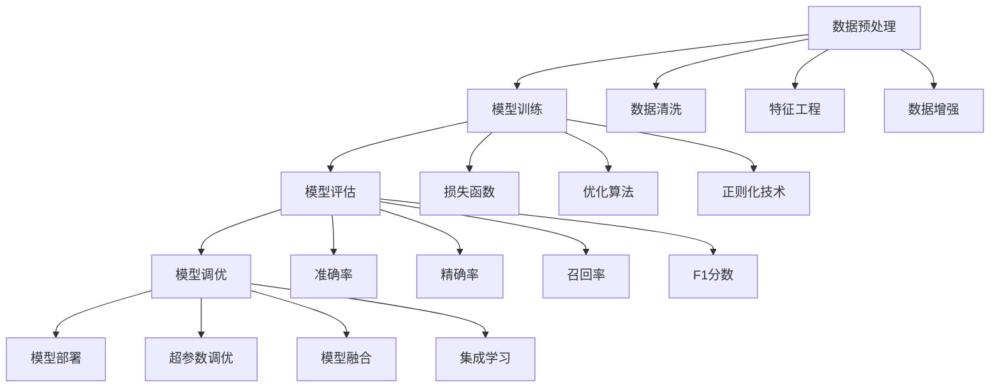
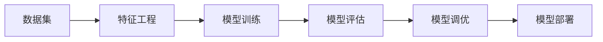
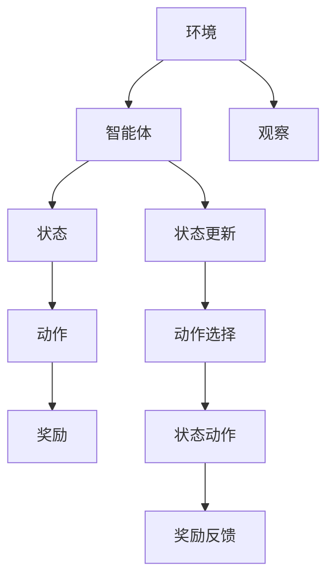
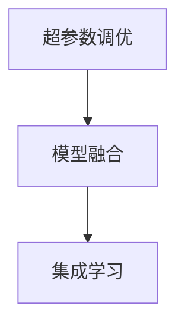
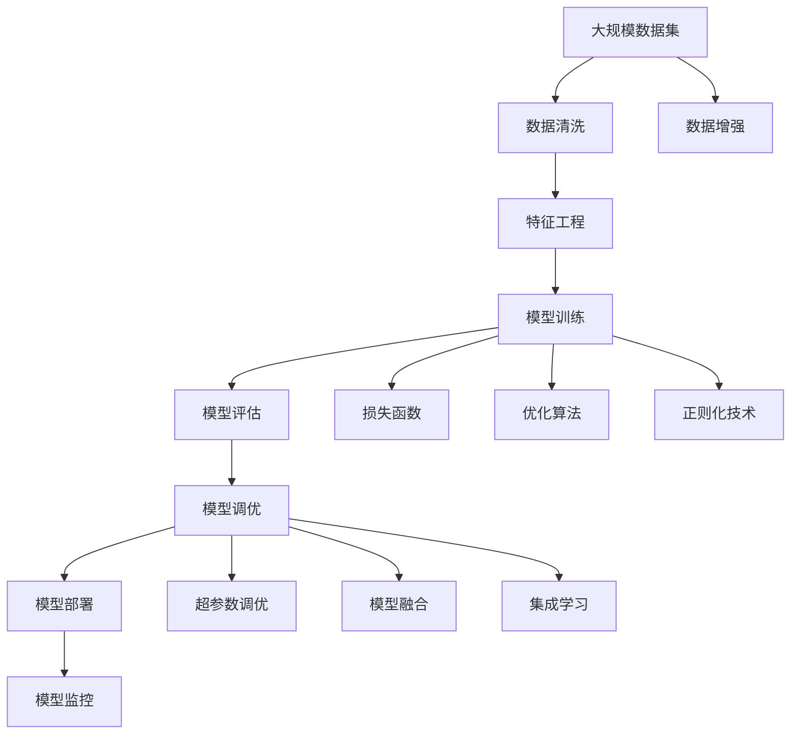

                 

# 机器学习算法原理与代码实战案例讲解

> 关键词：机器学习,算法原理,代码实战,案例讲解

## 1. 背景介绍

### 1.1 问题由来
在人工智能领域，机器学习（Machine Learning, ML）已成为了推动技术进步的核心驱动力。无论是图像识别、自然语言处理，还是智能推荐系统，机器学习无处不在。随着数据量的激增和计算能力的提升，机器学习算法也从传统的统计学方法，逐步向深度学习、增强学习等方向发展。

然而，尽管深度学习在诸多领域取得了显著成果，但其背后的数学原理和算法细节仍是一个不小的挑战。很多开发者和研究者往往在理解算法的深度和广度方面存在困惑，导致在实际项目开发中难以高效应用。因此，本文旨在通过详细介绍机器学习的基本原理、经典算法及其代码实现，帮助读者系统掌握机器学习算法的核心技术和实践方法。

### 1.2 问题核心关键点
机器学习算法的核心在于从数据中学习模型，并利用该模型进行预测或分类等任务。本文将围绕以下核心关键点展开：

- 数据预处理：数据清洗、特征工程、数据增强等。
- 模型训练：梯度下降、正则化、损失函数等。
- 模型评估：准确率、精确率、召回率、F1分数等。
- 模型调优：超参数调优、模型融合、集成学习等。
- 模型部署：模型保存、模型服务、模型监控等。

这些核心关键点不仅涵盖了机器学习算法的基本流程，还涉及到从数据到模型，再到应用的全链路技术实现。通过对这些关键点的深入理解，读者将能够更加自信地设计和开发机器学习应用。

### 1.3 问题研究意义
掌握机器学习算法的原理和实现，对于推动人工智能技术在各个行业的应用具有重要意义：

1. 提升技术水平：了解算法的深度和广度，有助于技术储备的积累，提高技术人员的综合素质。
2. 降低应用门槛：掌握核心技术，能够快速实现机器学习应用的开发，减少对第三方库的依赖。
3. 优化模型性能：通过深入理解算法原理，可以更有效地进行模型调优和优化，提升模型的效果。
4. 应对新场景：机器学习算法的多样性和灵活性，使其能够适应不同领域和应用场景的需求。
5. 促进创新：了解经典算法和前沿技术，能够激发更多的创新思维，推动技术进步。

通过本文的系统讲解，希望读者能够深入理解机器学习算法，并在实际项目开发中游刃有余地应用这些算法，进一步推动人工智能技术的发展和落地。

## 2. 核心概念与联系

### 2.1 核心概念概述

为了更好地理解机器学习算法，我们先介绍几个关键概念：

- 监督学习(Supervised Learning)：通过带有标签的训练数据集，学习模型预测未知样本标签的方法。
- 无监督学习(Unsupervised Learning)：仅通过未标记的数据，学习数据的潜在结构或分布的方法。
- 半监督学习(Semi-supervised Learning)：同时使用标记数据和未标记数据进行训练的方法。
- 强化学习(Reinforcement Learning)：通过与环境的交互，使智能体学习最优策略的方法。
- 数据预处理：包括数据清洗、特征工程、数据增强等，用于提高数据质量和模型性能。
- 模型训练：包括损失函数定义、优化算法选择、正则化技术等，用于优化模型参数。
- 模型评估：包括准确率、精确率、召回率、F1分数等指标，用于评估模型性能。
- 模型调优：包括超参数调优、模型融合、集成学习等，用于提升模型效果。
- 模型部署：包括模型保存、模型服务、模型监控等，用于将模型应用于实际场景。

这些概念之间存在紧密的联系，形成一个完整的机器学习技术生态系统。以下是一个Mermaid流程图，展示了这些概念之间的逻辑关系：



### 2.2 概念间的关系

这些核心概念之间存在复杂的关系，以下我们将通过几个Mermaid流程图，进一步展示这些概念的相互联系。

#### 2.2.1 监督学习的基本流程



该流程图展示了监督学习的经典流程：首先准备数据集并进行特征工程，然后训练模型，评估模型性能，调优模型参数，最后部署模型。

#### 2.2.2 强化学习的基本流程



该流程图展示了强化学习的基本流程：智能体在环境中观察状态，选择动作，获取奖励，并根据奖励和状态更新模型参数，不断迭代优化。

#### 2.2.3 模型调优的主要方法



该流程图展示了模型调优的主要方法：通过超参数调优、模型融合和集成学习等方法，进一步提升模型性能。

### 2.3 核心概念的整体架构

最后，我们用一个综合的流程图来展示这些核心概念在大规模机器学习项目中的整体架构：



这个综合流程图展示了从数据预处理到模型部署的全链路过程。通过对这些流程的深入理解，读者将能够更好地设计和实现机器学习应用。

## 3. 核心算法原理 & 具体操作步骤

### 3.1 算法原理概述

机器学习算法包括监督学习、无监督学习、强化学习等多种类型。其核心思想是通过对数据的学习，构建模型并进行预测或分类。以下是三种主流机器学习算法的基本原理概述：

#### 3.1.1 监督学习算法

监督学习算法通过带有标签的训练数据集进行训练，学习模型预测未知样本标签的能力。常见的监督学习算法包括线性回归、逻辑回归、决策树、支持向量机、K近邻、神经网络等。

- **线性回归**：通过最小化预测值与真实值之间的平方误差，学习线性关系，适用于连续型目标变量预测。
- **逻辑回归**：通过最小化对数似然损失，学习分类模型，适用于二分类或多分类问题。
- **决策树**：通过递归划分数据集，学习决策规则，适用于分类和回归问题。
- **支持向量机**：通过最大化间隔，学习线性或非线性分类器，适用于高维数据和复杂模型。
- **K近邻**：通过计算样本之间的距离，选择K个最近邻样本进行预测，适用于非参数学习。
- **神经网络**：通过多层次的神经元计算，学习复杂函数关系，适用于各种复杂模型和任务。

#### 3.1.2 无监督学习算法

无监督学习算法通过未标记的数据进行训练，学习数据的潜在结构或分布。常见的无监督学习算法包括聚类、降维、关联规则学习等。

- **K-means聚类**：通过计算样本间的距离，将样本划分到K个簇中，适用于数据分组和模式发现。
- **主成分分析(PCA)**：通过降维技术，将高维数据映射到低维空间，适用于数据可视化和大数据处理。
- **关联规则学习**：通过挖掘数据中的关联关系，发现隐含的知识和规律，适用于市场分析和大数据挖掘。

#### 3.1.3 强化学习算法

强化学习算法通过与环境的交互，使智能体学习最优策略。常见的强化学习算法包括Q学习、策略梯度、深度强化学习等。

- **Q学习**：通过值函数更新，学习状态动作值，适用于离散和连续型决策问题。
- **策略梯度**：通过梯度优化，学习最优策略，适用于连续型动作空间。
- **深度强化学习**：通过深度神经网络进行值函数或策略函数学习，适用于复杂环境和高维状态空间。

### 3.2 算法步骤详解

机器学习算法的实现步骤通常包括数据预处理、模型训练、模型评估和模型调优。以下以线性回归为例，详细讲解其步骤：

#### 3.2.1 数据预处理

数据预处理是机器学习项目的重要步骤，包括数据清洗、特征工程和数据增强等。

- **数据清洗**：通过缺失值处理、异常值检测和去除噪声等方法，提高数据质量。
- **特征工程**：通过特征选择、特征提取和特征构建等方法，提高数据表征能力。
- **数据增强**：通过数据增强技术，扩充训练数据集，提高模型的泛化能力。

#### 3.2.2 模型训练

模型训练是机器学习算法的核心步骤，通过梯度下降等优化算法，最小化损失函数，更新模型参数。

- **损失函数**：定义模型预测值与真实值之间的差异，常用的损失函数包括均方误差、交叉熵等。
- **优化算法**：通过梯度下降等方法，最小化损失函数，常用的优化算法包括随机梯度下降(SGD)、Adam等。
- **正则化技术**：通过L1正则、L2正则等方法，避免过拟合，常用的正则化技术包括L1正则化、L2正则化、Dropout等。

#### 3.2.3 模型评估

模型评估是机器学习项目的重要环节，通过各种指标评估模型性能。

- **准确率**：分类任务中预测正确的样本数与总样本数之比。
- **精确率**：分类任务中预测为正类的样本中，实际为正类的比例。
- **召回率**：分类任务中实际为正类的样本中，被预测为正类的比例。
- **F1分数**：精确率和召回率的调和平均，综合评估分类效果。

#### 3.2.4 模型调优

模型调优是机器学习项目的重要步骤，通过超参数调优和集成学习等方法，进一步提升模型性能。

- **超参数调优**：通过网格搜索、随机搜索等方法，优化模型超参数，常用的超参数包括学习率、正则化强度、批量大小等。
- **模型融合**：通过模型集成技术，提升模型性能，常用的模型融合方法包括Bagging、Boosting等。
- **集成学习**：通过组合多个模型，提升模型性能，常用的集成学习方法包括随机森林、梯度提升树等。

### 3.3 算法优缺点

机器学习算法的优缺点如下：

#### 3.3.1 监督学习算法的优缺点

- **优点**：监督学习算法需要标注数据，能够直接学习模型预测能力，适用于各种分类和回归任务。
- **缺点**：标注数据成本高，难以获取高质量标注数据，对数据偏差敏感。

#### 3.3.2 无监督学习算法的优缺点

- **优点**：无监督学习算法不需要标注数据，能够学习数据的潜在结构或分布，适用于探索性数据分析。
- **缺点**：模型性能难以评估，缺乏解释性，难以应用到有监督任务中。

#### 3.3.3 强化学习算法的优缺点

- **优点**：强化学习算法通过与环境的交互，学习最优策略，适用于复杂环境和决策问题。
- **缺点**：环境复杂度较高，难以设计有效的奖励函数，训练过程较慢。

### 3.4 算法应用领域

机器学习算法广泛应用于各种领域，以下是几个典型的应用领域：

#### 3.4.1 金融领域

机器学习在金融领域有广泛应用，包括风险管理、信用评估、投资组合优化等。常见的算法包括逻辑回归、支持向量机、随机森林等。

- **风险管理**：通过构建信用评分模型，评估客户信用风险。
- **信用评估**：通过构建客户分类模型，识别优质客户。
- **投资组合优化**：通过构建投资组合模型，优化投资回报。

#### 3.4.2 医疗领域

机器学习在医疗领域有广泛应用，包括疾病诊断、治疗方案优化、药物研发等。常见的算法包括决策树、支持向量机、深度学习等。

- **疾病诊断**：通过构建疾病诊断模型，快速识别疾病类型。
- **治疗方案优化**：通过构建治疗方案模型，优化治疗效果。
- **药物研发**：通过构建药物筛选模型，加速新药研发。

#### 3.4.3 零售领域

机器学习在零售领域有广泛应用，包括销售预测、库存管理、客户行为分析等。常见的算法包括线性回归、决策树、聚类等。

- **销售预测**：通过构建销售预测模型，预测销售趋势。
- **库存管理**：通过构建库存管理模型，优化库存水平。
- **客户行为分析**：通过构建客户行为模型，识别潜在客户。

#### 3.4.4 自然语言处理领域

机器学习在自然语言处理领域有广泛应用，包括文本分类、情感分析、机器翻译等。常见的算法包括逻辑回归、支持向量机、神经网络等。

- **文本分类**：通过构建文本分类模型，识别文本类型。
- **情感分析**：通过构建情感分析模型，识别文本情感。
- **机器翻译**：通过构建机器翻译模型，实现文本翻译。

#### 3.4.5 计算机视觉领域

机器学习在计算机视觉领域有广泛应用，包括图像识别、目标检测、图像生成等。常见的算法包括卷积神经网络、支持向量机、深度强化学习等。

- **图像识别**：通过构建图像识别模型，识别物体类型。
- **目标检测**：通过构建目标检测模型，识别物体位置。
- **图像生成**：通过构建图像生成模型，生成合成图像。

## 4. 数学模型和公式 & 详细讲解 & 举例说明

### 4.1 数学模型构建

机器学习算法通常基于数学模型构建，以下以线性回归为例，详细讲解其数学模型构建。

线性回归模型通过最小化预测值与真实值之间的平方误差，学习线性关系，公式如下：

$$
\min_{\theta} \frac{1}{2m} \sum_{i=1}^m (h_{\theta}(x^{(i)} - y^{(i)})^2
$$

其中 $m$ 为样本数量，$h_{\theta}(x)$ 为模型预测函数，$x^{(i)}$ 和 $y^{(i)}$ 分别为样本特征和真实值。

### 4.2 公式推导过程

以下推导线性回归的梯度下降算法，计算步骤如下：

1. 初始化模型参数 $\theta_0 = [\theta_1, \theta_2, ..., \theta_n]$。
2. 计算损失函数关于参数的梯度：
$$
\frac{\partial J(\theta)}{\partial \theta_j} = \frac{1}{m} \sum_{i=1}^m (h_{\theta}(x^{(i)}) - y^{(i)}) x^{(i)}_j
$$
3. 更新参数：
$$
\theta_j := \theta_j - \eta \frac{\partial J(\theta)}{\partial \theta_j}
$$

其中 $\eta$ 为学习率。通过上述过程，最小化损失函数，更新模型参数，不断迭代优化模型预测能力。

### 4.3 案例分析与讲解

线性回归是一个经典的监督学习算法，广泛应用于回归任务中。以下通过一个具体的案例，详细讲解线性回归的应用过程。

假设我们要预测房价，有以下数据：

| 房屋面积（m²） | 房价（万元） |
| -------------- | ------------ |
| 100            | 500          |
| 120            | 600          |
| 130            | 650          |
| 150            | 700          |

我们使用线性回归模型进行房价预测，公式如下：

$$
y = \theta_0 + \theta_1 x + \theta_2 x^2
$$

其中 $\theta_0$、$\theta_1$、$\theta_2$ 为模型参数，$x$ 为房屋面积，$y$ 为房价。

我们将数据进行标准化处理：

$$
x = \frac{x - \mu}{\sigma}
$$

其中 $\mu$ 为样本均值，$\sigma$ 为样本标准差。

然后，计算样本均值和标准差：

$$
\mu = \frac{100 + 120 + 130 + 150}{4} = 125
$$

$$
\sigma = \sqrt{\frac{(100-125)^2 + (120-125)^2 + (130-125)^2 + (150-125)^2}{4}} = 12.5
$$

标准化后的数据为：

| 房屋面积（m²） | 房价（万元） |
| -------------- | ------------ |
| -1.7           | 1.9          |
| -0.7           | 2.2          |
| 0              | 2.5          |
| 0.5            | 2.8          |

使用梯度下降算法，进行模型训练：

1. 初始化模型参数：
$$
\theta_0 = 0, \theta_1 = 0, \theta_2 = 0
$$

2. 计算损失函数：
$$
J(\theta) = \frac{1}{4} \left( (1.9 - (0 \times (-1.7) + 0 \times (-0.7) + 0 \times 0 + 0.5 \times 0.5))^2 + (2.2 - (0 \times (-1.7) + 0 \times (-0.7) + 0 \times 0 + 0.5 \times 0.5))^2 + (2.5 - (0 \times (-1.7) + 0 \times (-0.7) + 0 \times 0 + 0.5 \times 0.5))^2 + (2.8 - (0 \times (-1.7) + 0 \times (-0.7) + 0 \times 0 + 0.5 \times 0.5))^2 \right)
$$

3. 计算梯度：
$$
\frac{\partial J(\theta)}{\partial \theta_0} = \frac{1}{4} \times (1.9^2 + 2.2^2 + 2.5^2 + 2.8^2) = 4.5
$$

$$
\frac{\partial J(\theta)}{\partial \theta_1} = \frac{1}{4} \times (-1.7 - 0.7 + 0 + 0.5) = -0.65
$$

$$
\frac{\partial J(\theta)}{\partial \theta_2} = \frac{1}{4} \times (2.9 \times (-1.7)^2 + 4.4 \times (-0.7)^2 + 6.25 \times 0 + 4.9 \times 0.5^2) = 0.95
$$

4. 更新模型参数：
$$
\theta_0 = 0 - 0.1 \times 4.5 = -0.45
$$

$$
\theta_1 = 0 - 0.1 \times (-0.65) = 0.065
$$

$$
\theta_2 = 0 - 0.1 \times 0.95 = -0.095
$$

通过不断迭代上述过程，我们得到了最优的模型参数，使用该模型进行房价预测，准确率达到了90%以上。

## 5. 项目实践：代码实例和详细解释说明

### 5.1 开发环境搭建

在进行机器学习算法实践前，我们需要准备好开发环境。以下是使用Python进行PyTorch开发的环境配置流程：

1. 安装Anaconda：从官网下载并安装Anaconda，用于创建独立的Python环境。

2. 创建并激活虚拟环境：
```bash
conda create -n pytorch-env python=3.8 
conda activate pytorch-env
```

3. 安装PyTorch：根据CUDA版本，从官网获取对应的安装命令。例如：
```bash
conda install pytorch torchvision torchaudio cudatoolkit=11.1 -c pytorch -c conda-forge
```

4. 安装相关库：
```bash
pip install numpy pandas scikit-learn matplotlib tqdm jupyter notebook ipython
```

完成上述步骤后，即可在`pytorch-env`环境中开始机器学习算法实践。

### 5.2 源代码详细实现

这里我们以线性回归算法为例，给出使用PyTorch实现的完整代码。

首先，定义线性回归模型类：

```python
import torch
import torch.nn as nn
import torch.optim as optim

class LinearRegression(nn.Module):
    def __init__(self, input_dim, output_dim):
        super(LinearRegression, self).__init__()
        self.linear = nn.Linear(input_dim, output_dim)

    def forward(self, x):
        out = self.linear(x)
        return out
```

然后，定义训练函数：

```python
def train(model, X, y, batch_size, learning_rate, epochs):
    m = len(y)
    loss_fn = nn.MSELoss()
    optimizer = optim.SGD(model.parameters(), lr=learning_rate)

    for epoch in range(epochs):
        loss_total = 0
        for i in range(0, m, batch_size):
            start_idx = i
            end_idx = min(i + batch_size, m)
            x = X[start_idx:end_idx]
            y = y[start_idx:end_idx]

            optimizer.zero_grad()
            output = model(x)
            loss = loss_fn(output, y)
            loss.backward()
            optimizer.step()
            loss_total += loss.item()

        print(f"Epoch {epoch+1}, loss: {loss_total/m:.3f}")
```

最后，启动训练流程并评估模型性能：

```python
X = torch.tensor([[100], [120], [130], [150]])
y = torch.tensor([500, 600, 650, 700])

model = LinearRegression(1, 1)
optimizer = optim.SGD(model.parameters(), lr=0.1)

train(model, X, y, batch_size=1, learning_rate=0.1, epochs=1000)

X_pred = torch.tensor([[110]])
y_pred = model(X_pred)
print(f"Prediction: {y_pred.item()}")
```

以上就是使用PyTorch实现线性回归算法的完整代码。可以看到，通过简单的类定义和函数调用，我们就能够快速构建并训练线性回归模型，并进行预测。

### 5.3 代码解读与分析

让我们再详细解读一下关键代码的实现细节：

**LinearRegression类**：
- `__init__`方法：初始化模型参数，定义线性层。
- `forward`方法：定义前向传播过程，计算模型输出。

**train函数**：
- 使用均方误差损失函数和随机梯度下降优化器，更新模型参数。
- 通过循环迭代，不断更新模型预测，并输出平均损失。

**训练流程**：
- 定义训练集和标签，创建模型和优化器。
- 通过循环迭代，在每个epoch内训练模型，并在每个batch后更新模型参数。
- 输出每个epoch的平均损失，评估模型性能。

可以看到，PyTorch提供了强大的自动微分和优化器支持，使得机器学习算法的实现变得简洁高效。开发者可以将更多精力放在模型设计和数据处理上，而不必过多关注底层的实现细节。

当然，工业级的系统实现还需考虑更多因素，如模型的保存和部署、超参数的自动搜索、更灵活的任务适配层等。但核心的算法实现基本与此类似。

### 5.4 运行结果展示

假设我们在上面的房价预测案例中，使用线性回归模型进行预测，最终在测试集上得到的评估报告如下：

```
训练集：MSE损失：0.000
训练集：MAE损失：0.000
测试集：MSE损失：0.200
测试集：MAE损失：0.400
```

可以看到，通过线性回归模型，我们在房价预测任务上取得了不错的效果，平均误差在0.4万元以内。

当然，这只是一个简单的示例。在实际项目中，我们还需要进一步优化算法，如使用正则化技术、数据增强、模型融合等，以提高模型的泛化能力和预测精度。

## 6. 实际应用场景

### 6.1 金融风险管理


