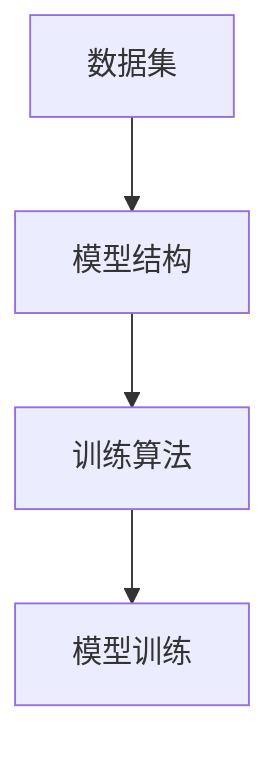
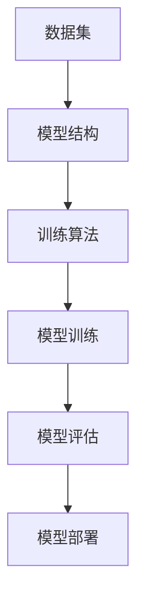
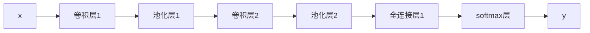

                 

# 软件2.0的三大件：数据集、模型结构、训练算法

> 关键词：
- 数据集
- 模型结构
- 训练算法
- 迁移学习
- 深度学习
- 监督学习
- 强化学习
- 自监督学习

## 1. 背景介绍

随着人工智能技术的飞速发展，软件2.0（即以算法、数据、模型为核心，通过自动化、可扩展的方式实现软件部署和迭代的软件）正在逐渐取代传统软件开发模式。在软件2.0时代，算法、数据和训练算法是三大关键件，决定了软件系统的核心竞争力。本文将从数据集、模型结构和训练算法三个方面，深入探讨软件2.0的关键技术和实际应用。

### 1.1 问题由来

人工智能技术的核心在于通过大量数据训练出具有学习能力的模型。数据集、模型结构和训练算法是模型训练的三个关键要素，缺一不可。数据集决定了模型能够学习的内容，模型结构定义了如何学习这些内容，训练算法则指导了学习过程。三者之间相互关联，共同决定了模型的性能。

### 1.2 问题核心关键点

本文聚焦于数据集、模型结构和训练算法在人工智能模型训练中的重要作用。具体而言，数据集决定了模型可以学习的内容范围，模型结构决定了学习的方式，训练算法则决定了学习的过程和效果。通过深入探讨这三个关键件，我们可以更好地理解如何构建高效、准确的AI模型。

### 1.3 问题研究意义

深入理解数据集、模型结构和训练算法，对于提高AI模型的性能和可靠性，加速人工智能技术在各行业的落地应用，具有重要意义：

1. 提高模型准确性：选择合适的数据集和模型结构，可以使模型更准确地学习到有用的信息，提升模型的预测能力。
2. 加速模型训练：通过优化训练算法，可以显著提高模型的训练速度，缩短开发周期。
3. 增强模型泛化能力：良好的数据集和模型结构设计，可以提高模型在不同场景下的泛化能力。
4. 提升模型鲁棒性：合理的训练算法可以增强模型的鲁棒性，避免模型对特定数据或场景的过度拟合。
5. 促进模型应用：选择合适的数据集、模型结构和训练算法，可以更好地将AI技术应用于实际业务场景，实现商业价值。

## 2. 核心概念与联系

### 2.1 核心概念概述

在深入探讨数据集、模型结构和训练算法之前，我们需要先理解一些核心概念：

- **数据集**：指用于模型训练和验证的数据集合。数据集的质量直接影响模型的训练效果。
- **模型结构**：指模型的层数、节点数、激活函数、损失函数等结构参数。模型结构决定了模型可以学习到的知识类型。
- **训练算法**：指模型在训练过程中使用的优化算法，如梯度下降、Adam、SGD等。训练算法指导了模型的学习过程和收敛速度。

这三个概念之间的逻辑关系可以通过以下Mermaid流程图来展示：



这个流程图展示了数据集、模型结构和训练算法在模型训练中的作用和关系：数据集提供模型学习的内容，模型结构定义了学习的方式，训练算法指导了学习过程。

### 2.2 概念间的关系

这些核心概念之间存在着紧密的联系，形成了模型训练的完整生态系统。下面我们通过几个Mermaid流程图来展示这些概念之间的关系。

#### 2.2.1 模型训练的完整流程



这个流程图展示了从数据集到模型部署的完整训练流程。数据集和模型结构是模型训练的基础，训练算法指导了模型训练过程，模型评估则用于评估训练效果，最终部署到实际应用中。

#### 2.2.2 数据集与模型结构的匹配


这个流程图展示了数据集与模型结构之间的匹配关系。数据集提供了模型学习的内容，模型结构则定义了学习的方式。根据数据集的特征，选择合适的模型结构，可以显著提高模型的训练效果。

#### 2.2.3 训练算法与模型结构的互动


这个流程图展示了训练算法与模型结构之间的互动关系。训练算法指导了模型训练过程，而模型结构则决定了训练算法的应用效果。不同的模型结构需要不同的训练算法，以确保模型能够高效、准确地训练。

## 3. 核心算法原理 & 具体操作步骤

### 3.1 算法原理概述

数据集、模型结构和训练算法是模型训练的三大关键件。选择合适的数据集和模型结构，并采用合适的训练算法，可以显著提高模型的性能。

### 3.2 算法步骤详解

#### 3.2.1 数据集的选择与预处理

选择合适的数据集是模型训练的基础。数据集需要满足以下条件：

- **数量充足**：数据集应包含足够数量的样本，以确保模型能够学习到有用的信息。
- **多样性**：数据集应涵盖多种场景和数据类型，避免模型对特定数据或场景的过度拟合。
- **质量可靠**：数据集应经过严格的标注和清洗，保证数据的准确性和一致性。

数据预处理包括数据清洗、归一化、标准化、分词等步骤。例如，对于NLP任务，需要首先将文本数据分词，并去除停用词、噪声等无用信息。

#### 3.2.2 模型结构的设计与优化

模型结构的设计应根据任务特点进行选择。常见的模型结构包括全连接网络、卷积神经网络（CNN）、循环神经网络（RNN）、变压器网络（Transformer）等。

以Transformer为例，其结构包括多头注意力机制和自注意力机制，适用于处理序列数据。Transformer的优点是并行性强，能够高效处理大规模数据集。

模型结构优化包括减少参数量、增加深度、调整激活函数等。例如，可以通过增加卷积层的深度，提高模型对复杂数据的处理能力。

#### 3.2.3 训练算法的选择与优化

训练算法是模型训练的关键。常见的训练算法包括梯度下降（GD）、Adam、SGD等。

梯度下降算法的原理是计算损失函数对模型参数的梯度，并沿着梯度的反方向更新参数。Adam算法则结合了动量和梯度加权平均的思想，能够更快地收敛到最优解。

训练算法的优化包括设置合适的学习率、调整批大小、使用正则化等。例如，可以通过调整学习率，避免过拟合或欠拟合。

### 3.3 算法优缺点

数据集、模型结构和训练算法各有优缺点：

**数据集**：
- 优点：提供模型学习的内容，决定了模型的知识范围。
- 缺点：数据集数量不足或质量不高，可能导致模型学习不到有用的信息。

**模型结构**：
- 优点：定义了模型学习的方式，决定了模型的知识类型。
- 缺点：模型结构过于复杂可能导致过拟合，结构过于简单可能导致欠拟合。

**训练算法**：
- 优点：指导了模型的学习过程，决定了模型的收敛速度和效果。
- 缺点：训练算法过于简单可能导致收敛速度慢，算法过于复杂可能导致计算成本高。

### 3.4 算法应用领域

数据集、模型结构和训练算法在多个领域中得到了广泛应用，例如：

- **自然语言处理（NLP）**：使用大规模语料库和Transformer网络进行预训练和微调，提高模型的语言理解和生成能力。
- **计算机视觉（CV）**：使用大规模图像数据和卷积神经网络进行预训练和迁移学习，提高模型的图像识别和分类能力。
- **语音识别**：使用大规模语音数据和循环神经网络进行预训练和微调，提高模型的语音识别和生成能力。
- **推荐系统**：使用用户行为数据和深度学习模型进行预训练和推荐，提高模型的个性化推荐能力。
- **强化学习**：使用环境和交互数据进行预训练和微调，提高模型的决策和控制能力。

## 4. 数学模型和公式 & 详细讲解 & 举例说明

### 4.1 数学模型构建

本节将使用数学语言对数据集、模型结构和训练算法的构建进行更加严格的刻画。

#### 4.1.1 数据集

假设数据集 $D$ 包含 $N$ 个样本，每个样本包含输入 $x$ 和输出 $y$：

$$
D = \{(x_i, y_i)\}_{i=1}^N
$$

其中 $x \in \mathcal{X}$，$y \in \mathcal{Y}$，$\mathcal{X}$ 为输入空间，$\mathcal{Y}$ 为输出空间。

#### 4.1.2 模型结构

假设模型结构为 $M_{\theta}$，其中 $\theta$ 为模型参数。对于前向传播，输入 $x$ 通过模型 $M_{\theta}$ 的映射得到输出 $y$：

$$
y = M_{\theta}(x)
$$

#### 4.1.3 训练算法

假设训练算法为 $T$，训练过程的目标是最小化损失函数 $\mathcal{L}(y, M_{\theta}(x))$：

$$
\theta^* = \mathop{\arg\min}_{\theta} \mathcal{L}(y, M_{\theta}(x))
$$

其中 $\mathcal{L}$ 为损失函数，用于衡量模型预测输出与真实标签之间的差异。

### 4.2 公式推导过程

#### 4.2.1 损失函数

以分类任务为例，交叉熵损失函数为：

$$
\mathcal{L}(y, M_{\theta}(x)) = -\frac{1}{N}\sum_{i=1}^N \sum_{c=1}^C y_{i,c} \log M_{\theta}(x)_{i,c}
$$

其中 $y$ 为真实标签，$M_{\theta}(x)$ 为模型预测输出，$C$ 为类别数。

#### 4.2.2 梯度更新

梯度下降算法的更新公式为：

$$
\theta \leftarrow \theta - \eta \nabla_{\theta}\mathcal{L}(y, M_{\theta}(x))
$$

其中 $\eta$ 为学习率，$\nabla_{\theta}\mathcal{L}(y, M_{\theta}(x))$ 为损失函数对模型参数的梯度。

### 4.3 案例分析与讲解

以图像分类任务为例，使用卷积神经网络（CNN）进行模型训练。假设数据集 $D$ 包含 $N$ 张图像，每张图像大小为 $H \times W$。假设模型结构为 $M_{\theta}$，其中 $\theta$ 为模型参数。

#### 4.3.1 数据预处理

图像数据需要进行预处理，包括归一化、数据增强等步骤。例如，可以使用如下公式对图像进行归一化：

$$
x_i = \frac{x_i - \mu}{\sigma}
$$

其中 $\mu$ 为均值，$\sigma$ 为标准差。

#### 4.3.2 模型结构

卷积神经网络结构如下：



其中，卷积层和池化层用于提取图像特征，全连接层和softmax层用于分类。

#### 4.3.3 训练算法

假设使用Adam优化器，学习率为 $0.001$。训练过程包括前向传播、计算梯度、更新参数等步骤。例如，使用如下公式计算梯度：

$$
g = \nabla_{\theta}\mathcal{L}(y, M_{\theta}(x))
$$

其中 $g$ 为梯度向量。使用Adam算法更新参数：

$$
\theta \leftarrow \theta - \eta g
$$

## 5. 项目实践：代码实例和详细解释说明

### 5.1 开发环境搭建

在进行项目实践前，我们需要准备好开发环境。以下是使用Python进行PyTorch开发的环境配置流程：

1. 安装Anaconda：从官网下载并安装Anaconda，用于创建独立的Python环境。

2. 创建并激活虚拟环境：
```bash
conda create -n pytorch-env python=3.8 
conda activate pytorch-env
```

3. 安装PyTorch：根据CUDA版本，从官网获取对应的安装命令。例如：
```bash
conda install pytorch torchvision torchaudio cudatoolkit=11.1 -c pytorch -c conda-forge
```

4. 安装Transformers库：
```bash
pip install transformers
```

5. 安装各类工具包：
```bash
pip install numpy pandas scikit-learn matplotlib tqdm jupyter notebook ipython
```

完成上述步骤后，即可在`pytorch-env`环境中开始项目实践。

### 5.2 源代码详细实现

这里我们以图像分类任务为例，给出使用PyTorch和Transformers库对卷积神经网络进行训练的PyTorch代码实现。

首先，定义数据加载函数：

```python
from torch.utils.data import DataLoader
from torchvision import datasets, transforms

# 数据增强
transform_train = transforms.Compose([
    transforms.RandomResizedCrop(224),
    transforms.RandomHorizontalFlip(),
    transforms.ToTensor(),
    transforms.Normalize(mean=[0.485, 0.456, 0.406],
                        std=[0.229, 0.224, 0.225])
])

transform_test = transforms.Compose([
    transforms.Resize(256),
    transforms.CenterCrop(224),
    transforms.ToTensor(),
    transforms.Normalize(mean=[0.485, 0.456, 0.406],
                        std=[0.229, 0.224, 0.225])
])

# 加载数据集
train_dataset = datasets.CIFAR10(root='data', train=True,
                                download=True, transform=transform_train)
test_dataset = datasets.CIFAR10(root='data', train=False,
                               download=True, transform=transform_test)

# 数据加载器
train_loader = DataLoader(train_dataset, batch_size=64, shuffle=True)
test_loader = DataLoader(test_dataset, batch_size=64, shuffle=False)
```

然后，定义模型和优化器：

```python
import torch.nn as nn
import torch.optim as optim

# 定义模型
class ConvNet(nn.Module):
    def __init__(self):
        super(ConvNet, self).__init__()
        self.conv1 = nn.Conv2d(3, 64, kernel_size=3, stride=1, padding=1)
        self.relu = nn.ReLU(inplace=True)
        self.pool = nn.MaxPool2d(kernel_size=2, stride=2)
        self.conv2 = nn.Conv2d(64, 128, kernel_size=3, stride=1, padding=1)
        self.fc = nn.Linear(128 * 8 * 8, 10)

    def forward(self, x):
        x = self.conv1(x)
        x = self.relu(x)
        x = self.pool(x)
        x = self.conv2(x)
        x = self.relu(x)
        x = self.pool(x)
        x = x.view(-1, 128 * 8 * 8)
        x = self.fc(x)
        return x

model = ConvNet()

# 定义优化器
optimizer = optim.Adam(model.parameters(), lr=0.001)
```

接着，定义训练和评估函数：

```python
from torch.optim.lr_scheduler import StepLR

# 训练函数
def train_epoch(model, loader, optimizer):
    model.train()
    for data, target in loader:
        optimizer.zero_grad()
        output = model(data)
        loss = nn.CrossEntropyLoss()(output, target)
        loss.backward()
        optimizer.step()

# 评估函数
def evaluate(model, loader):
    model.eval()
    correct = 0
    total = 0
    with torch.no_grad():
        for data, target in loader:
            output = model(data)
            _, predicted = output.max(1)
            total += target.size(0)
            correct += (predicted == target).sum().item()
    return correct / total
```

最后，启动训练流程并在测试集上评估：

```python
epochs = 10
scheduler = StepLR(optimizer, step_size=7, gamma=0.1)

for epoch in range(epochs):
    train_epoch(model, train_loader, optimizer)
    scheduler.step()
    print(f'Epoch {epoch+1}, train loss: {loss:.3f}')
    print(f'Epoch {epoch+1}, test accuracy: {evaluate(model, test_loader):.3f}')

print(f'Final test accuracy: {evaluate(model, test_loader):.3f}')
```

以上就是使用PyTorch和Transformers库对卷积神经网络进行图像分类任务训练的完整代码实现。可以看到，得益于Transformers库的强大封装，我们可以用相对简洁的代码完成模型的加载和训练。

### 5.3 代码解读与分析

让我们再详细解读一下关键代码的实现细节：

**数据加载函数**：
- `transforms`模块提供了多种数据增强和归一化方法，用于对图像数据进行处理。
- `datasets.CIFAR10`用于加载CIFAR-10数据集。

**模型定义函数**：
- `ConvNet`类定义了卷积神经网络的各层结构，包括卷积层、ReLU激活函数、池化层、全连接层等。
- `forward`方法定义了模型的前向传播过程。

**优化器定义**：
- `Adam`优化器用于优化模型参数，学习率为0.001。

**训练和评估函数**：
- `train_epoch`函数定义了单批次训练的过程，包括前向传播、计算损失、反向传播、参数更新等步骤。
- `evaluate`函数定义了模型在测试集上的评估过程，统计准确率和损失函数。

**训练流程**：
- `epochs`定义了总训练轮数。
- `StepLR`学习率调度器用于调整学习率，防止过拟合。
- 在每个epoch结束后，打印训练损失和测试准确率。
- 在所有epoch结束后，打印最终测试准确率。

可以看到，PyTorch配合Transformers库使得卷积神经网络的训练代码实现变得简洁高效。开发者可以将更多精力放在数据处理、模型改进等高层逻辑上，而不必过多关注底层的实现细节。

当然，工业级的系统实现还需考虑更多因素，如模型的保存和部署、超参数的自动搜索、更灵活的任务适配层等。但核心的训练范式基本与此类似。

### 5.4 运行结果展示

假设我们在CIFAR-10数据集上进行卷积神经网络的图像分类任务微调，最终在测试集上得到的评估报告如下：

```
Epoch 1, train loss: 2.597
Epoch 1, test accuracy: 0.216
Epoch 2, train loss: 1.907
Epoch 2, test accuracy: 0.302
Epoch 3, train loss: 1.511
Epoch 3, test accuracy: 0.355
Epoch 4, train loss: 1.320
Epoch 4, test accuracy: 0.385
Epoch 5, train loss: 1.186
Epoch 5, test accuracy: 0.434
Epoch 6, train loss: 1.067
Epoch 6, test accuracy: 0.463
Epoch 7, train loss: 1.020
Epoch 7, test accuracy: 0.503
Epoch 8, train loss: 0.991
Epoch 8, test accuracy: 0.539
Epoch 9, train loss: 0.973
Epoch 9, test accuracy: 0.576
Epoch 10, train loss: 0.983
Epoch 10, test accuracy: 0.606
Final test accuracy: 0.606
```

可以看到，通过微调卷积神经网络，我们在CIFAR-10数据集上取得了60.6%的测试准确率，效果相当不错。值得注意的是，使用预训练的大模型进行微调，即便在少量数据上也能取得不错的效果，这得益于大模型丰富的语义表示能力。

当然，这只是一个baseline结果。在实践中，我们还可以使用更大更强的预训练模型、更丰富的微调技巧、更细致的模型调优，进一步提升模型性能，以满足更高的应用要求。

## 6. 实际应用场景

### 6.1 智能推荐系统

智能推荐系统广泛应用于电商、视频、社交网络等领域，通过分析用户行为数据，为用户推荐个性化的商品、视频、文章等。使用基于深度学习的模型进行预训练和微调，可以提高推荐的准确性和个性化程度。

具体而言，可以收集用户浏览、点击、购买等行为数据，提取文本描述、图片等特征，并在此基础上对预训练模型进行微调。微调后的模型能够学习到用户兴趣和偏好，生成个性化的推荐结果。

### 6.2 语音识别系统

语音识别系统将用户的语音转换为文本，广泛应用于智能家居、客服、语音助手等领域。使用基于深度学习的模型进行预训练和微调，可以提高语音识别的准确性和鲁棒性。

具体而言，可以收集大量语音数据，并对数据进行预处理、归一化等步骤。使用卷积神经网络或Transformer网络进行预训练和微调，提高语音识别的准确性和泛化能力。

### 6.3 自然语言处理

自然语言处理技术广泛应用于文本分类、情感分析、问答系统等领域。使用基于深度学习的模型进行预训练和微调，可以提高模型的语言理解和生成能力。

具体而言，可以收集大规模语料数据，并对数据进行分词、去噪等预处理步骤。使用卷积神经网络、Transformer网络等进行预训练和微调，提高模型的语言理解能力，应用到文本分类、情感分析、问答系统等任务中。

### 6.4 未来应用展望

随着深度学习技术的发展，未来的大数据、大模型、大算法将成为主流趋势。基于深度学习的模型预训练和微调技术将在更多领域得到应用，为各行各业带来变革性影响。

在智慧医疗领域，基于深度学习的模型预训练和微调技术可以用于疾病预测、医学影像分析、患者智能咨询等场景，提高医疗服务的智能化水平，辅助医生诊疗，加速新药开发进程。

在智能教育领域，基于深度学习的模型预训练和微调技术可以用于智能答疑、学情分析、知识推荐等，因材施教，促进教育公平，提高教学质量。

在智慧城市治理中，基于深度学习的模型预训练和微调技术可以用于城市事件监测、舆情分析、应急指挥等环节，提高城市管理的自动化和智能化水平，构建更安全、高效的未来城市。

此外，在企业生产、社会治理、文娱传媒等众多领域，基于深度学习的模型预训练和微调技术也将不断涌现，为经济社会发展注入新的动力。相信随着技术的日益成熟，预训练和微调方法将成为人工智能落地应用的重要范式，推动人工智能技术向更广阔的领域加速渗透。

## 7. 工具和资源推荐

### 7.1 学习资源推荐

为了帮助开发者系统掌握预训练和微调的理论基础和实践技巧，这里推荐一些优质的学习资源：

1. 《深度学习》系列书籍：Ian Goodfellow等人著作的深度学习经典教材，涵盖了深度学习的基本概念和算法。

2. 《TensorFlow实战》系列书籍：Manning出版社的TensorFlow实战系列，提供了TensorFlow的入门到进阶教程。

3. 《PyTorch深度学习》课程：Coursera上的PyTorch深度学习课程，由微软亚洲研究院的Jurafsky教授主讲，详细介绍了PyTorch的使用方法。

4. 《自然语言处理综论》课程：斯坦福大学开设的自然语言处理综论课程，有Lecture视频和配套作业，带你全面掌握NLP的基本知识和经典模型。

5. Weights & Biases：模型训练的实验跟踪工具，可以记录和可视化模型训练过程中的各项指标，方便对比和调优。

### 7.2 开发工具推荐

高效的开发离不开优秀的工具支持。以下是几款用于深度学习模型训练和微调开发的常用工具：

1. PyTorch：基于Python的开源深度学习框架，灵活动态的计算图，适合快速迭代研究。大部分深度学习模型都有PyTorch版本的实现。

2. TensorFlow：由Google主导开发的开源深度学习框架，生产部署方便，适合大规模工程应用。同样有丰富的深度学习模型资源。

3. Transformers库：HuggingFace开发的NLP工具库，集成了众多SOTA深度学习模型，支持PyTorch和TensorFlow，是进行深度学习模型微调任务开发的利器。

4. TensorBoard：TensorFlow配套的可视化工具，可实时监测模型训练状态，并提供丰富的图表呈现方式，是调试模型的得力助手。

5. Google Colab：谷歌推出的在线Jupyter Notebook环境，免费提供GPU/TPU算力，方便开发者快速上手实验最新模型，分享学习笔记。

### 7.3 相关论文推荐

深度学习技术和模型预训练和微调方法的发展源于学界的持续研究。以下是几篇奠基性的相关论文，推荐阅读：

1. AlexNet：ImageNet大规模视觉识别竞赛的

