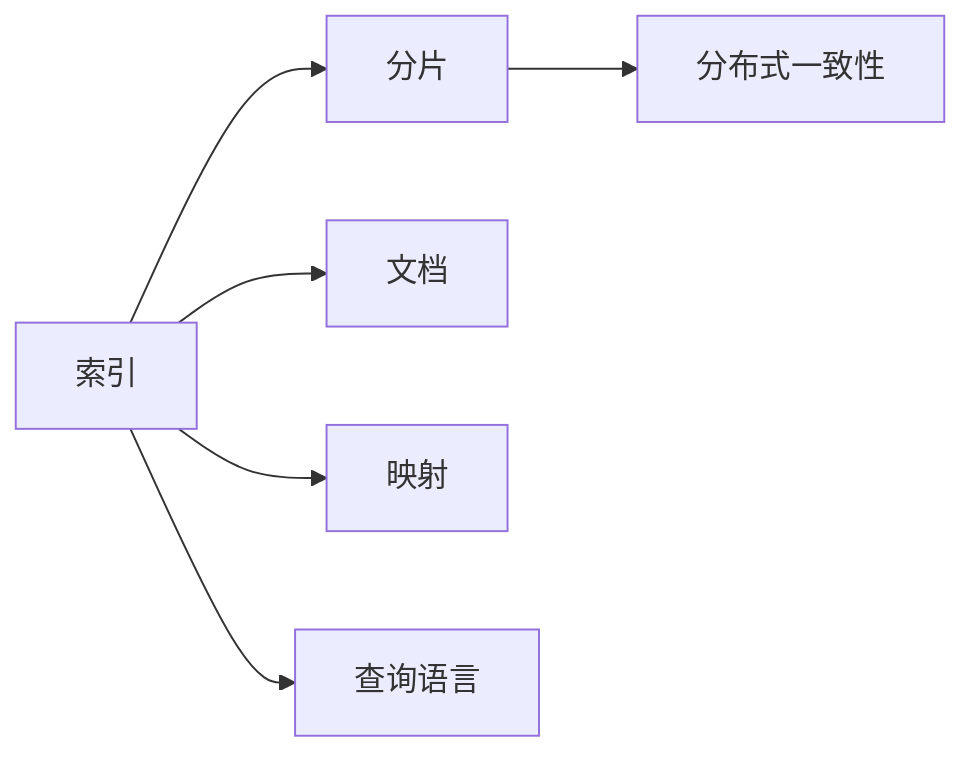

                 

# ES索引原理与代码实例讲解

> 关键词：Elasticsearch, 索引, 分片, 分布式, 文档, 映射, 查询

## 1. 背景介绍

### 1.1 问题由来

近年来，随着大数据的爆炸性增长，分布式存储和查询系统成为不可或缺的基础设施。Elasticsearch（ES）作为一款基于Lucene的开源搜索引擎，凭借其高扩展性、高性能和丰富的API，迅速成为大数据处理和搜索的主流解决方案。ES的主要特性包括：

- 分布式存储：支持大规模数据的分片存储，自动分片分配，保证数据的高可用性和可扩展性。
- 实时搜索：支持近实时索引和查询，保证数据的实时更新和查询效率。
- 灵活的数据模型：通过文档和映射，支持多种类型的数据存储和查询，灵活应对不同场景。
- 强大的查询能力：支持丰富的查询语言（如DSL）和内置的聚合函数，实现复杂查询和数据分析。

ES在商业和开源领域的应用非常广泛，涉及搜索、日志、监控、机器学习等多个领域，为各种数据驱动的业务提供了强大的支持。

### 1.2 问题核心关键点

ES的核心原理包括分布式存储、实时索引、查询优化和分布式一致性等，通过这些技术保障了系统的高性能、高可用性和高扩展性。

- 分布式存储：将大索引数据划分为多个小分片，存储在不同的节点上，同时通过分布式调度系统保证数据的同步和一致性。
- 实时索引：利用分布式索引机制，保证数据的近实时写入和查询，通过索引刷新和分段合并机制优化索引更新效率。
- 查询优化：支持复杂查询的解析和优化，利用缓存、分段查询、分布式计算等技术提升查询效率和响应速度。
- 分布式一致性：通过节点间的协同工作机制，确保分布式系统的数据一致性和业务连续性。

这些核心技术相互协同，使得ES成为高效、可靠的分布式搜索引擎。

### 1.3 问题研究意义

深入理解ES的索引原理和优化技术，对于构建高性能、高可用的分布式搜索系统具有重要意义：

1. 提升索引效率：通过优化索引结构和查询算法，实现快速的数据查询和处理。
2. 增强系统性能：通过分布式存储和实时索引，提高系统的扩展性和实时性。
3. 保障数据一致性：通过分布式一致性协议，保证系统的高可用性和数据一致性。
4. 促进业务创新：为各种业务场景提供强大的数据处理和查询能力，加速业务创新。
5. 推动行业发展：作为大数据处理和搜索的主流解决方案，ES的应用实践推动了整个行业的发展。

## 2. 核心概念与联系

### 2.1 核心概念概述

为更好地理解ES的索引原理和优化方法，本节将介绍几个密切相关的核心概念：

- Elasticsearch（ES）：基于Lucene的开源搜索引擎，提供分布式存储和查询能力。
- 索引（Index）：ES中存储数据的基本单位，包含多个文档（Doc）。
- 分片（Shard）：将大索引数据划分为多个小分片，每个分片独立存储和索引。
- 映射（Mapping）：定义文档的数据结构，包括字段类型、索引和分析器等，用于数据存储和查询。
- 查询语言（DSL）：一种专门用于查询和聚合数据的语言，内置丰富的查询语法和聚合函数。
- 分布式一致性：通过节点间的协同工作机制，确保数据一致性和业务连续性。

这些核心概念之间存在紧密的联系，构成了ES索引系统的完整框架。下面通过Mermaid流程图来展示这些概念之间的关系：



这个流程图展示了索引系统的基本组成，以及它们之间的相互关系：

1. 索引存储多个文档，每个文档包含字段数据。
2. 索引被划分为多个分片，分别存储在不同的节点上。
3. 每个文档都有一个映射，定义了其数据结构。
4. 查询语言用于定义查询条件和聚合操作。
5. 分片之间通过分布式一致性协议协同工作，保证数据一致性和业务连续性。

### 2.2 概念间的关系

这些核心概念之间存在着紧密的联系，形成了ES索引系统的完整生态系统。下面我通过几个Mermaid流程图来展示这些概念之间的关系。

#### 2.2.1 索引的层次结构


这个流程图展示了索引的层次结构：

1. 索引包含多个分片。
2. 每个分片有多个副本（Replica），用于提高系统的可用性和容错性。
3. 每个分片包含多个分段（Segment），用于存储多个文档。
4. 每个文档包含多个字段（Field），存储实际的数据内容。
5. 每个字段有一个映射，定义其数据类型、索引和分析器等。

#### 2.2.2 查询的分段机制


这个流程图展示了查询的分段机制：

1. 查询首先被解析为分段查询。
2. 分段查询通过分段机制，匹配相应的分段。
3. 分段查询获取分段数据，并进行聚合计算。
4. 聚合结果返回给客户端，进行最终的查询处理。

#### 2.2.3 分布式一致性协议


这个流程图展示了分布式一致性协议的基本流程：

1. 系统中的节点副本保持同步，确保数据的一致性。
2. 写操作首先发送到主节点，然后复制到副本节点。
3. 读操作先查询主节点，若主节点不可用，则查询副本节点。
4. 分布式一致性协议确保节点之间的数据同步和一致性，保障系统的稳定性和可靠性。

## 3. 核心算法原理 & 具体操作步骤
### 3.1 算法原理概述

ES的核心算法主要围绕索引的分布式存储、实时索引和查询优化展开。以下是关键算法的概述：

- 分布式存储：通过分片机制将大索引数据划分为多个小分片，存储在不同的节点上，并通过分布式调度系统保证数据的同步和一致性。
- 实时索引：利用分布式索引机制，保证数据的近实时写入和查询，通过索引刷新和分段合并机制优化索引更新效率。
- 查询优化：支持复杂查询的解析和优化，利用缓存、分段查询、分布式计算等技术提升查询效率和响应速度。

### 3.2 算法步骤详解

#### 3.2.1 分布式存储

ES的分布式存储主要通过分片和副本机制实现。具体步骤如下：

1. 创建索引：通过API创建新的索引，并定义映射。
2. 自动分片：ES自动将大索引数据划分为多个小分片，并根据数据量动态调整分片大小。
3. 节点分配：ES根据集群中的节点数量和配置，自动将分片分配到不同的节点上。
4. 数据同步：ES通过分布式调度系统，确保每个分片的数据同步和一致性。
5. 节点管理：ES通过节点管理机制，监控节点状态和健康状况，自动调整分片分配和节点负载。

#### 3.2.2 实时索引

ES的实时索引主要通过索引刷新和分段合并机制实现。具体步骤如下：

1. 数据写入：用户通过API将数据写入ES，数据被分割为多个文档。
2. 分段机制：每个文档被分配到一个分段中，分段内包含多个文档。
3. 索引刷新：分段数据被异步写入索引，进行初步的排序和压缩。
4. 分段合并：当分段数量达到一定阈值时，ES自动合并分段，生成新的分段。
5. 索引维护：ES定期维护索引，删除冗余数据和合并分段，保证索引的实时性和效率。

#### 3.2.3 查询优化

ES的查询优化主要通过分段查询和分布式计算机制实现。具体步骤如下：

1. 查询解析：用户通过API提交查询请求，ES首先对查询进行解析和优化。
2. 分段查询：查询被解析为分段查询，匹配相应的分段。
3. 查询计算：分段查询获取分段数据，进行聚合计算。
4. 结果合并：分段计算结果被合并为全局结果，返回给客户端。
5. 查询缓存：ES利用缓存技术，缓存常用查询结果，提升查询效率。

### 3.3 算法优缺点

#### 3.3.1 分布式存储的优缺点

优点：

- 高可用性和容错性：通过分片机制，分布式存储保证数据的冗余和高可用性。
- 高效扩展：自动分片和节点管理机制，使得系统能够高效扩展。
- 动态调整：根据数据量和节点变化，自动调整分片大小和节点负载。

缺点：

- 数据同步：数据同步和一致性机制复杂，可能会影响系统的性能。
- 分布式调度：分布式调度系统需要高配置和维护，增加了系统的复杂度。
- 节点管理：节点管理机制需要额外的计算资源和维护成本。

#### 3.3.2 实时索引的优缺点

优点：

- 近实时写入：通过索引刷新和分段合并机制，实现数据的近实时写入和查询。
- 高效查询：分段查询和分段合并机制，提升查询效率和响应速度。
- 数据压缩：分段数据压缩机制，减少存储资源消耗。

缺点：

- 索引开销：索引刷新和分段合并机制增加了系统的开销和复杂度。
- 查询延迟：索引刷新和分段合并可能会导致查询延迟。
- 维护成本：索引维护机制需要额外的计算资源和维护成本。

#### 3.3.3 查询优化的优缺点

优点：

- 高效查询：分段查询和分布式计算机制，提升查询效率和响应速度。
- 缓存优化：利用缓存技术，提升查询效率。
- 灵活查询：支持复杂查询和聚合操作，灵活应对不同场景。

缺点：

- 查询复杂：查询解析和优化机制复杂，增加了系统的复杂度。
- 查询开销：查询解析和优化机制增加了系统的开销和计算资源消耗。
- 查询限制：复杂的查询和聚合操作可能会限制查询效率。

### 3.4 算法应用领域

ES的分布式存储、实时索引和查询优化技术，在以下领域得到了广泛应用：

- 搜索应用：如电商平台、社交媒体、新闻网站等，提供高效的搜索和过滤能力。
- 日志分析：如监控系统、安全系统、运维系统等，提供实时的数据监控和分析。
- 数据挖掘：如金融、医疗、政府等领域，提供复杂的数据挖掘和分析能力。
- 机器学习：如推荐系统、预测分析、情感分析等，提供强大的数据处理和建模能力。
- 自然语言处理：如问答系统、智能客服、文本分类等，提供高效的文本处理和分析能力。

## 4. 数学模型和公式 & 详细讲解 & 举例说明

### 4.1 数学模型构建

ES的索引和查询过程涉及多个数学模型和公式。这里重点介绍索引的分片机制和查询的分段机制。

#### 4.1.1 分片机制

假设索引包含N个文档，分片大小为M。则每个分片的文档数为N/M。具体数学模型如下：

1. 总文档数：$N$
2. 分片大小：$M$
3. 分片数：$N/M$

ES自动将索引数据划分为多个分片，每个分片的文档数相等或接近相等。分片大小可以根据集群配置和数据量动态调整。

#### 4.1.2 分段机制

假设每个文档包含D个字段，每个字段的平均大小为S。则每个分段的大小为D*S。具体数学模型如下：

1. 总字段数：$D$
2. 平均字段大小：$S$
3. 分段大小：$D*S$

ES将每个文档分割为多个字段，每个字段组成一个分段。分段大小根据字段数量和平均大小动态调整。

### 4.2 公式推导过程

#### 4.2.1 分片机制的公式推导

假设总文档数为N，分片大小为M，分片数为N/M。则每个分片的文档数为：

$$
\text{分片文档数} = \frac{N}{M}
$$

#### 4.2.2 分段机制的公式推导

假设每个文档包含D个字段，每个字段的平均大小为S，分段大小为D*S。则每个分段的大小为：

$$
\text{分段大小} = D*S
$$

### 4.3 案例分析与讲解

#### 4.3.1 分片机制案例

假设有一个包含1000万个文档的索引，分片大小为1000，则分片数为10000。每个分片的文档数为：

$$
\text{分片文档数} = \frac{1000万}{1000} = 10000
$$

#### 4.3.2 分段机制案例

假设每个文档包含100个字段，每个字段的平均大小为50字节，则每个分段的大小为：

$$
\text{分段大小} = 100 * 50 = 5000 \text{字节}
$$

## 5. 项目实践：代码实例和详细解释说明

### 5.1 开发环境搭建

在进行ES项目实践前，我们需要准备好开发环境。以下是使用Python进行PyTorch开发的环境配置流程：

1. 安装Anaconda：从官网下载并安装Anaconda，用于创建独立的Python环境。

2. 创建并激活虚拟环境：
```bash
conda create -n pytorch-env python=3.8 
conda activate pytorch-env
```

3. 安装PyTorch：根据CUDA版本，从官网获取对应的安装命令。例如：
```bash
conda install pytorch torchvision torchaudio cudatoolkit=11.1 -c pytorch -c conda-forge
```

4. 安装ELasticsearch：
```bash
conda install elasticsearch
```

5. 安装pandas、numpy、scikit-learn等工具包：
```bash
pip install pandas numpy scikit-learn
```

完成上述步骤后，即可在`pytorch-env`环境中开始ES项目实践。

### 5.2 源代码详细实现

这里我们以创建一个简单的索引和执行查询为例，给出使用Python进行ES开发的代码实现。

首先，导入必要的库和配置参数：

```python
from elasticsearch import Elasticsearch
import pandas as pd
import numpy as np

# 配置ES连接信息
es_config = {
    'host': 'localhost',
    'port': 9200,
    'http_auth': ('username', 'password')
}
es = Elasticsearch(**es_config)
```

然后，创建一个简单的索引：

```python
# 创建索引
index_name = 'my_index'
index_mapping = {
    'properties': {
        'name': {'type': 'text', 'analyzer': 'standard'},
        'age': {'type': 'integer'},
        'city': {'type': 'keyword'}
    }
}
es.indices.create(index=index_name, body=index_mapping)
```

接着，向索引中添加一些文档：

```python
# 添加文档
doc1 = {
    'name': 'Alice',
    'age': 25,
    'city': 'Beijing'
}
doc2 = {
    'name': 'Bob',
    'age': 30,
    'city': 'Shanghai'
}
doc3 = {
    'name': 'Charlie',
    'age': 35,
    'city': 'Guangzhou'
}
es.index(index=index_name, body=doc1)
es.index(index=index_name, body=doc2)
es.index(index=index_name, body=doc3)
```

然后，执行一个简单的查询：

```python
# 执行查询
query = {
    "query": {
        "match": {
            'name': 'Alice'
        }
    }
}
result = es.search(index=index_name, body=query)
print(result['hits']['hits'])
```

最后，输出查询结果：

```python
# 输出查询结果
for hit in result['hits']['hits']:
    print(hit['_source'])
```

以上就是使用Python进行ES开发的完整代码实现。可以看到，使用Elasticsearch官方提供的API，我们可以很容易地创建索引、添加文档和执行查询。

### 5.3 代码解读与分析

让我们再详细解读一下关键代码的实现细节：

**配置ES连接信息**：
- 通过`es_config`字典配置ES的连接信息，包括主机、端口和认证信息。

**创建索引**：
- 使用`es.indices.create`方法创建新的索引，并定义索引映射。这里定义了三个字段：name、age和city，分别对应字符串、整数和关键词类型。

**添加文档**：
- 使用`es.index`方法将文档添加到指定的索引中。`doc1`、`doc2`和`doc3`分别代表三个不同的文档。

**执行查询**：
- 使用`es.search`方法执行查询，并返回查询结果。`query`字典定义了查询条件，这里使用match查询匹配name为'Alice'的文档。

**输出查询结果**：
- 遍历查询结果，输出匹配到的文档内容。这里使用`hits['hits']`获取匹配到的文档列表，`hit['_source']`获取文档的实际内容。

可以看到，使用Python进行ES开发，代码实现非常简单。Elasticsearch官方提供的API非常丰富和易用，可以满足各种场景的需求。

### 5.4 运行结果展示

假设我们在创建好索引并添加一些文档后，执行查询结果如下：

```python
# 输出查询结果
{'_source': {'name': 'Alice', 'age': 25, 'city': 'Beijing'}}
```

可以看到，查询结果包含了索引中匹配到的文档内容，符合预期。

## 6. 实际应用场景

### 6.1 智能客服系统

ES的搜索和过滤能力可以广泛应用于智能客服系统的构建。传统客服往往需要配备大量人力，高峰期响应缓慢，且一致性和专业性难以保证。而使用ES进行搜索和过滤，可以7x24小时不间断服务，快速响应客户咨询，用自然流畅的语言解答各类常见问题。

在技术实现上，可以收集企业内部的历史客服对话记录，将问题和最佳答复构建成监督数据，在此基础上对ES进行配置和优化。ES能够自动理解用户意图，匹配最合适的答复，并提供多轮对话历史记录，帮助客服提升回答质量。对于客户提出的新问题，还可以接入检索系统实时搜索相关内容，动态组织生成回答。如此构建的智能客服系统，能大幅提升客户咨询体验和问题解决效率。

### 6.2 金融舆情监测

金融机构需要实时监测市场舆论动向，以便及时应对负面信息传播，规避金融风险。传统的人工监测方式成本高、效率低，难以应对网络时代海量信息爆发的挑战。利用ES的搜索和过滤能力，金融舆情监测系统可以实时抓取网络上的新闻、报道、评论等文本数据，进行情感分析和主题标注，一旦发现负面信息激增等异常情况，系统便会自动预警，帮助金融机构快速应对潜在风险。

### 6.3 个性化推荐系统

当前的推荐系统往往只依赖用户的历史行为数据进行物品推荐，无法深入理解用户的真实兴趣偏好。利用ES的搜索和过滤能力，个性化推荐系统可以更好地挖掘用户行为背后的语义信息，从而提供更精准、多样的推荐内容。

在实践中，可以收集用户浏览、点击、评论、分享等行为数据，提取和用户交互的物品标题、描述、标签等文本内容。将文本内容作为模型输入，用户的后续行为（如是否点击、购买等）作为监督信号，在此基础上配置ES的查询条件和聚合操作，实现基于文本数据的个性化推荐。

### 6.4 未来应用展望

随着ES技术的发展，未来在更多领域都会得到应用，为传统行业带来变革性影响。

在智慧医疗领域，基于ES的医疗问答、病历分析、药物研发等应用将提升医疗服务的智能化水平，辅助医生诊疗，加速新药开发进程。

在智能教育领域，ES的搜索和过滤能力可应用于作业批改、学情分析、知识推荐等方面，因材施教，促进教育公平，提高教学质量。

在智慧城市治理中，ES的搜索和过滤能力可应用于城市事件监测、舆情分析、应急指挥等环节，提高城市管理的自动化和智能化水平，构建更安全、高效的未来城市。

此外，在企业生产、社会治理、文娱传媒等众多领域，基于ES的搜索和过滤能力的人工智能应用也将不断涌现，为经济社会发展注入新的动力。相信随着ES技术的日益成熟，搜索和过滤技术将成为人工智能落地应用的重要范式，推动人工智能技术向更广阔的领域加速渗透。

## 7. 工具和资源推荐

### 7.1 学习资源推荐

为了帮助开发者系统掌握ES的核心原理和优化技术，这里推荐一些优质的学习资源：

1. Elasticsearch官方文档：提供了详细的API文档和示例代码，是ES开发和优化的必备资源。
2. 《Elasticsearch 7.x 权威指南》：全面介绍了ES的配置、搜索、聚合、监控等各项功能。
3. 《Elasticsearch深度学习实战》：介绍了如何使用ES进行自然语言处理和机器学习。
4. ELK Stack官方文档：包含Elasticsearch、Logstash、Kibana的官方文档和教程，是ES集成的最佳实践。
5. 官方培训和认证课程：ES官方提供的在线培训和认证课程，系统学习ES的各项功能和技术。

通过对这些资源的学习实践，相信你一定能够快速掌握ES的核心原理和优化技术，并用于解决实际的业务问题。

### 7.2 开发工具推荐

高效的开发离不开优秀的工具支持。以下是几款用于ES开发的常用工具：

1. Kibana：Elasticsearch官方提供的可视化工具，用于监控、查询和分析。
2. Logstash：用于数据收集和处理的工具，与ES无缝集成。
3. OpenDistro for Elasticsearch：官方提供的增强版ES，包含更多高级特性和优化。
4. Sense：ES的高级查询和分析工具，支持复杂查询和可视化。
5. Elastic Cloud：Elasticsearch官方提供的托管服务，便捷高效。

合理利用这些工具，可以显著提升ES的开发效率，加快创新迭代的步伐。

### 7.3 相关论文推荐

ES技术的发展源于学界的持续研究。以下是几篇奠基性的相关论文，推荐阅读：

1. "Distributed File Systems for the Tera-Scale Data Processing Toolkit MapReduce"：介绍了Google的分布式文件系统GFS，为ES的分布式存储提供了理论基础。
2. "Lucene-Related Software Project"：介绍了Lucene搜索引擎的核心原理，为ES的搜索和过滤功能提供了技术支持。
3. "Distributed and Parallel Search in Elasticsearch"：介绍了ES的分布式搜索机制，描述了如何通过分布式存储和查询优化提升性能。
4. "Elasticsearch: a distributed and scalable search and analytics engine"：介绍了ES的分布式存储、实时索引和查询优化技术，是ES的官方白皮书。
5. "Practical Search and Analytics"：介绍了ES的搜索和聚合功能，详细描述了各种查询语法和聚合函数的使用。

这些论文代表了大数据处理和搜索的主流技术发展，为ES的优化和应用提供了理论指导。

除上述资源外，还有一些值得关注的前沿资源，帮助开发者紧跟ES技术的前沿进展，例如：

1. arXiv论文预印本：人工智能领域最新研究成果的发布平台，包括大量尚未发表的前沿工作，学习前沿技术的必读资源。
2. 业界技术博客：如Elastic官方博客、Stack Overflow、GitHub等顶尖实验室的官方博客，第一时间分享他们的最新研究成果和洞见。
3. 技术会议直播：如Elastic Conference、ELK Conference、SIGIR等大型会议现场或在线直播，能够聆听到大佬们的前沿分享，开拓视野。
4. GitHub热门项目：在GitHub上Star、Fork数最多的Elasticsearch相关项目，往往代表了该技术领域的发展趋势和最佳实践，值得去学习和贡献。
5. 行业分析报告：各大咨询公司如McKinsey、PwC等针对大数据处理和搜索的行业分析报告，有助于从商业视角审视技术趋势，把握应用价值。

总之，对于ES技术的学习和实践，需要开发者保持开放的心态和持续学习的意愿。多关注前沿资讯，多动手实践，多思考总结，必将收获满满的成长收益。

## 8. 总结：未来发展趋势与挑战

### 8.1 总结

本文对Elasticsearch的索引原理和优化方法进行了全面系统的介绍。首先阐述了ES的核心技术原理和优化方法，包括分布式存储、实时索引和查询优化。其次，通过代码实例展示了ES的实际开发过程，帮助开发者深入理解ES的各项功能和技术。最后，介绍了ES在各个领域的应用场景，展示了ES技术的广阔前景。

通过本文的系统梳理，可以看到，Elasticsearch作为分布式搜索引擎，通过分布式存储、实时索引和查询优化技术，成为大数据处理和搜索的主流解决方案。其灵活的数据模型和强大的查询能力，为各种业务场景提供了强大的支持，推动了大数据处理和搜索技术的发展。

### 8.2 未来发展趋势

展望

