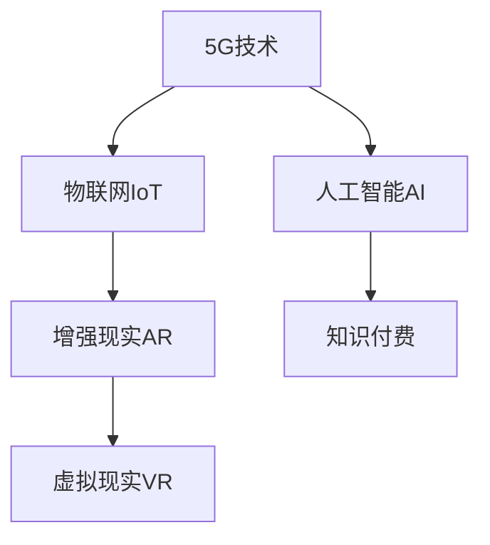

                 

## 1. 背景介绍

随着5G技术的逐渐普及，互联网的连接速度和稳定性大幅提升，数字化内容和服务正在迎来新的变革。在5G时代，知识付费作为新兴的数字化内容消费模式，其市场和用户群体都将发生重大变化。本文将探讨5G技术对知识付费的深远影响，并预测其在未来可能带来的新变化和趋势。

### 1.1 5G技术的兴起与特点

5G（第五代移动通信技术）相较于4G，其显著特点在于更高的传输速率、更大的网络容量和更低的延迟。这些特点不仅提升了互联网的整体性能，还推动了物联网、增强现实（AR）、虚拟现实（VR）等新兴技术的发展。5G技术将彻底改变人们获取信息和内容的方式，为知识付费等数字服务创造新的机会和挑战。

### 1.2 知识付费的兴起与现状

知识付费，指的是用户为获取知识、技能、经验等有价值信息所支付的费用。随着互联网用户对内容质量的追求日益提升，知识付费市场迅速发展。平台如得到、喜马拉雅、知识星球等，不断涌现，涵盖了教育、心理咨询、技能培训等多个领域。目前，知识付费市场规模已经达到数百亿，并且还在持续增长。

## 2. 核心概念与联系

### 2.1 核心概念概述

为了更好地理解5G时代知识付费的变革，我们需明确几个核心概念：

- **5G技术**：指第五代移动通信技术，特点是高速率、大容量、低延迟。
- **知识付费**：用户为获取知识、技能、经验等有价值信息支付费用的新兴消费模式。
- **物联网（IoT）**：通过互联网将物理设备连接起来，实现设备间的数据交互。
- **增强现实（AR）**：将虚拟信息与现实世界结合，提供沉浸式体验。
- **虚拟现实（VR）**：利用计算机生成三维虚拟环境，使用户沉浸其中。
- **人工智能（AI）**：利用算法让机器具备学习能力，自动化处理数据和任务。

这些概念之间存在密切联系，5G技术的发展为物联网、AR、VR等新兴技术提供了基础设施，而这些新兴技术的应用又为知识付费提供了新的形式和内容。人工智能技术则在数据处理、个性化推荐等方面发挥了重要作用。

### 2.2 概念间的关系

这些核心概念之间的关系可以用以下Mermaid流程图表示：



该图展示了5G技术为其他新兴技术提供基础设施，而这些新兴技术又为知识付费提供新的形式和内容。人工智能则在其中起到数据处理和个性化推荐的重要作用。

## 3. 核心算法原理 & 具体操作步骤

### 3.1 算法原理概述

在5G时代，知识付费的变革主要通过以下几个核心算法原理来实现：

- **大数据分析与推荐算法**：利用用户行为数据进行个性化推荐，提高用户满意度和留存率。
- **自然语言处理（NLP）**：通过文本分析，理解用户需求和情感，提供更加精准的内容匹配。
- **边缘计算**：在用户设备或网络边缘进行计算，减少延迟，提升实时性。
- **区块链技术**：确保知识付费交易的安全和透明，防止欺诈和数据篡改。

这些算法共同作用，推动了知识付费在5G时代的发展。

### 3.2 算法步骤详解

以下是基于上述算法原理的知识付费平台在5G时代的具体操作步骤：

1. **数据收集与分析**：平台通过传感器、应用等收集用户行为数据，如阅读时间、购买记录、评价等，进行分析以了解用户需求。
2. **个性化推荐**：利用大数据分析与推荐算法，根据用户历史行为和偏好，实时推荐相关课程或内容。
3. **内容适配**：通过NLP技术，对用户输入的关键词、问题等进行分析，提供最匹配的答案或推荐内容。
4. **边缘计算**：在用户设备或边缘计算服务器上执行计算任务，如视频流媒体处理、语音识别等，提升用户体验。
5. **交易安全**：采用区块链技术，确保用户支付和内容版权的安全性，防范欺诈和数据篡改。

### 3.3 算法优缺点

- **优点**：
  - **实时性**：5G网络的高速和低延迟特性，使得推荐和内容处理能够实时进行，提升用户体验。
  - **个性化**：大数据和NLP技术的结合，可以提供高度个性化的内容推荐，提高用户满意度。
  - **安全性**：区块链技术保障了交易的安全性和透明性，防止欺诈和数据篡改。

- **缺点**：
  - **隐私问题**：数据收集和分析可能涉及用户隐私，需要严格的数据保护措施。
  - **成本高**：边缘计算和大数据分析需要高昂的硬件和软件成本。
  - **技术门槛高**：NLP、AI等技术需要专业的知识和技能，对平台的技术要求较高。

### 3.4 算法应用领域

这些算法在知识付费平台中的应用领域包括：

- **内容推荐**：为用户提供个性化课程和内容推荐。
- **用户行为分析**：分析用户行为，优化推荐算法。
- **交易安全**：保障知识付费交易的安全和透明。
- **实时互动**：提供实时的课程互动和反馈机制。

## 4. 数学模型和公式 & 详细讲解 & 举例说明

### 4.1 数学模型构建

知识付费平台的核心数学模型可以表示为：

$$
P=\sum_{i=1}^{n} a_i \times f_i
$$

其中，$P$ 为平台推荐的内容集合，$a_i$ 为每个内容的权重，$f_i$ 为每个内容的质量评分。权重和评分可以通过用户反馈、专家评审等方式计算得出。

### 4.2 公式推导过程

假设用户的历史行为数据为 $X=\{x_1, x_2, ..., x_n\}$，推荐算法模型的推导过程如下：

1. **用户行为分析**：通过数据分析得到用户兴趣向量 $U$。
2. **内容特征提取**：从内容库中提取特征，如关键词、作者、发布时间等，得到内容特征向量 $F$。
3. **相似度计算**：计算用户兴趣向量与内容特征向量之间的相似度 $S$。
4. **权重计算**：根据相似度 $S$ 计算内容权重 $a_i$。
5. **内容推荐**：根据权重 $a_i$ 和内容评分 $f_i$，生成推荐集合 $P$。

### 4.3 案例分析与讲解

以在线教育平台为例，用户A在平台上学习数学课程。平台通过分析A的学习数据（如学习时长、课程评价），生成用户兴趣向量 $U_A$。同时，平台从内容库中提取数学课程的关键词、作者、发布时间等特征，生成内容特征向量 $F_M$。

平台通过计算相似度 $S$，得到内容 $M$ 与用户A的匹配度。根据匹配度和专家评审打分，计算内容权重 $a_M$。最终，平台根据权重和评分生成推荐集合 $P$，推荐给用户A。

## 5. 项目实践：代码实例和详细解释说明

### 5.1 开发环境搭建

在5G时代，知识付费平台的开发需要考虑以下几个方面：

- **云计算平台**：如AWS、Google Cloud等，提供强大的计算资源和存储能力。
- **数据处理框架**：如Apache Kafka、Apache Spark等，用于大规模数据处理和分析。
- **边缘计算平台**：如AWS Greengrass、Google IoT Core等，提供实时计算能力。

### 5.2 源代码详细实现

以下是一个基于Python的推荐系统代码实现：

```python
from sklearn.feature_extraction.text import TfidfVectorizer
from sklearn.metrics.pairwise import cosine_similarity
from sklearn.linear_model import LogisticRegression

# 用户行为数据
user_data = {"user1": ["Python", "深度学习", "机器学习"], "user2": ["数据分析", "SQL"]}

# 内容特征数据
content_data = {"Python": ["Python", "深度学习", "机器学习", "Python教程"], "数据分析": ["SQL", "Python"]}

# 用户兴趣向量
user_interest = TfidfVectorizer().fit_transform(user_data.values()).toarray()

# 内容特征向量
content_features = TfidfVectorizer().fit_transform(content_data.values()).toarray()

# 计算相似度矩阵
similarity_matrix = cosine_similarity(user_interest, content_features)

# 内容权重
content_weight = LogisticRegression().fit(similarity_matrix, user_interest).transform(similarity_matrix)

# 推荐集合
recommended_courses = content_data.keys()[content_weight.argmax(axis=1)]
```

### 5.3 代码解读与分析

以上代码展示了如何通过Python实现简单的推荐系统。

- **TfidfVectorizer**：用于提取文本特征，生成用户兴趣向量和内容特征向量。
- **cosine_similarity**：计算用户兴趣向量与内容特征向量之间的余弦相似度，生成相似度矩阵。
- **LogisticRegression**：用于计算内容权重，推荐最匹配的用户。
- **recommended_courses**：根据内容权重和评分，生成推荐集合。

### 5.4 运行结果展示

假设用户A对Python和深度学习感兴趣，推荐系统计算出Python和数据分析与用户A的匹配度最高。平台推荐Python和数据分析课程给用户A。

## 6. 实际应用场景

### 6.1 在线教育

5G时代，在线教育平台将迎来新的发展机遇。通过5G网络的高速和低延迟特性，教育平台可以提供更加丰富的互动和实时代理。

- **实时互动**：利用AR/VR技术，创建虚拟教室，提供沉浸式学习体验。
- **个性化推荐**：通过大数据分析和NLP技术，提供高度个性化的课程推荐。
- **边缘计算**：在用户设备上处理视频流媒体和语音识别，提升用户体验。

### 6.2 企业培训

企业培训也将受益于5G技术的发展。企业可以通过知识付费平台，为员工提供个性化培训课程。

- **定制课程**：根据员工需求和岗位特点，定制个性化培训计划。
- **实时反馈**：通过AR/VR技术，提供实时代理和反馈机制。
- **移动学习**：员工可以利用5G网络，随时随地进行学习和培训。

### 6.3 职业培训

职业培训是知识付费的重要应用领域。5G技术将使职业培训更加灵活和便捷。

- **技能评估**：利用AI技术，评估学员技能水平，提供个性化指导。
- **虚拟教练**：通过VR技术，创建虚拟教练，提供互动式教学。
- **实时学习**：学员可以利用5G网络，随时随地进行学习和练习。

## 7. 工具和资源推荐

### 7.1 学习资源推荐

以下是几个推荐的5G时代知识付费学习资源：

- **Coursera**：提供全球顶尖大学的在线课程，涵盖多个领域。
- **edX**：与世界各地的大学合作，提供免费的在线课程。
- **Udacity**：提供项目导向的在线课程，注重实际应用。
- **Kaggle**：提供数据科学和机器学习的竞赛平台，培养数据分析和建模能力。

### 7.2 开发工具推荐

以下是一些推荐的5G时代知识付费开发工具：

- **AWS**：提供强大的云计算服务，支持大规模数据处理和分析。
- **Google Cloud**：提供高度集成的云计算平台，支持机器学习和AI开发。
- **Microsoft Azure**：提供全面的云计算解决方案，支持边缘计算和物联网应用。
- **Hadoop**：提供大数据处理和分析框架，支持海量数据存储和处理。
- **Apache Spark**：提供快速的大数据处理引擎，支持分布式计算。

### 7.3 相关论文推荐

以下是几篇推荐的5G时代知识付费相关论文：

- **"5G技术在知识付费中的应用研究"**：探讨5G技术如何改变知识付费模式。
- **"大数据在知识付费推荐系统中的应用"**：分析大数据如何提升知识付费推荐系统的准确性。
- **"增强现实在知识付费中的应用"**：研究AR技术如何提升用户学习体验。
- **"区块链技术在知识付费交易中的应用"**：探讨区块链如何保障知识付费交易的安全性和透明性。

## 8. 总结：未来发展趋势与挑战

### 8.1 研究成果总结

5G时代知识付费的研究成果主要集中在以下几个方面：

- **大数据分析与推荐算法**：利用用户行为数据进行个性化推荐，提高用户满意度和留存率。
- **自然语言处理（NLP）**：通过文本分析，理解用户需求和情感，提供更加精准的内容匹配。
- **边缘计算**：在用户设备或网络边缘进行计算，减少延迟，提升实时性。
- **区块链技术**：确保知识付费交易的安全和透明，防止欺诈和数据篡改。

### 8.2 未来发展趋势

5G时代知识付费的未来发展趋势包括：

- **个性化推荐**：利用大数据和NLP技术，提供高度个性化的内容推荐。
- **实时代理**：通过AR/VR技术，提供沉浸式学习体验。
- **实时反馈**：利用AI技术，提供实时代理和反馈机制。
- **移动学习**：利用5G网络，随时随地进行学习和培训。

### 8.3 面临的挑战

5G时代知识付费面临的挑战包括：

- **数据隐私问题**：数据收集和分析可能涉及用户隐私，需要严格的数据保护措施。
- **成本高**：边缘计算和大数据分析需要高昂的硬件和软件成本。
- **技术门槛高**：NLP、AI等技术需要专业的知识和技能，对平台的技术要求较高。

### 8.4 研究展望

未来的研究方向包括：

- **隐私保护技术**：研究如何保护用户隐私，防止数据泄露。
- **边缘计算优化**：研究如何优化边缘计算资源，提升计算效率。
- **人工智能普及**：研究如何普及NLP和AI技术，降低技术门槛。

## 9. 附录：常见问题与解答

**Q1：5G技术如何改变知识付费？**

A：5G技术通过提供高速率、大容量、低延迟的网络环境，使得知识付费平台可以提供更加丰富和实时的服务。例如，通过AR/VR技术，提供沉浸式学习体验；利用大数据和NLP技术，提供高度个性化的内容推荐；通过边缘计算，提升实时性；利用区块链技术，确保交易安全。

**Q2：5G时代知识付费的推荐算法有哪些？**

A：5G时代知识付费的推荐算法主要包括以下几种：

- **基于协同过滤的推荐算法**：通过分析用户行为数据，推荐与用户兴趣相似的内容。
- **基于内容的推荐算法**：根据内容特征，推荐相关课程或内容。
- **混合推荐算法**：结合协同过滤和内容推荐，提供更加精准的推荐。

**Q3：5G时代知识付费有哪些应用场景？**

A：5G时代知识付费的应用场景包括：

- **在线教育**：通过AR/VR技术，提供沉浸式学习体验；利用大数据和NLP技术，提供个性化推荐。
- **企业培训**：根据员工需求和岗位特点，定制个性化培训计划；提供实时代理和反馈机制。
- **职业培训**：利用AI技术，评估学员技能水平，提供个性化指导；通过VR技术，创建虚拟教练。

---

作者：禅与计算机程序设计艺术 / Zen and the Art of Computer Programming

