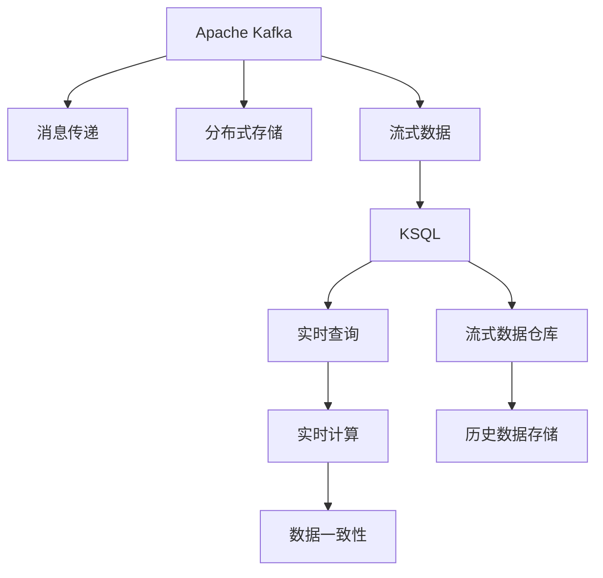

                 

# Kafka KSQL原理与代码实例讲解

> 关键词：Apache Kafka, KSQL, 流处理, 实时数据, 实时查询, 流式数据仓库

## 1. 背景介绍

### 1.1 问题由来
在当今数字化转型快速发展的时代，企业数据量呈指数级增长，对数据处理的实时性和可扩展性提出了更高要求。传统的数据处理方式，如离线ETL和批处理，已无法满足快速变化的市场需求。因此，流式数据处理技术逐渐成为企业和开发者关注的焦点。Apache Kafka和KSQL是流式数据处理领域的两个重要组件，它们紧密结合，共同构建了一个强大的实时数据平台。

### 1.2 问题核心关键点
Kafka KSQL的核心理念是“流式数据仓库”，即通过Apache Kafka的流式消息传递机制，将实时数据流式传递到KSQL中进行实时分析和处理。Kafka KSQL系统具有以下几个关键特点：
1. **低延迟、高吞吐**：Kafka的分布式存储和消息传递机制保证了数据处理的低延迟和高吞吐性能。
2. **实时计算**：KSQL提供了实时计算的能力，能够对实时数据进行实时查询和分析。
3. **流式数据仓库**：Kafka KSQL通过流式数据仓库，支持历史数据的存储和查询，具有强大的数据存储能力。
4. **弹性扩展**：Kafka和KSQL都可以水平扩展，确保系统的可扩展性和高可用性。
5. **数据一致性**：通过Kafka的事务支持和KSQL的事务API，保证了数据的一致性和可靠性。

### 1.3 问题研究意义
Kafka KSQL作为流式数据处理技术的代表，在实时数据分析和数据管理中发挥着重要作用。其研究意义如下：
1. **提高数据处理效率**：通过流式处理技术，Kafka KSQL能够实时处理海量数据，显著提升数据处理效率。
2. **增强数据价值**：通过实时分析和处理，Kafka KSQL能够从数据中挖掘出更多有价值的信息，辅助决策。
3. **推动技术应用**：Kafka KSQL为实时数据处理提供了全面的解决方案，推动了大数据、人工智能、物联网等技术的深入应用。
4. **促进业务创新**：通过流式数据处理技术，Kafka KSQL能够支持实时数据驱动的业务创新，如实时推荐、实时监控等。

## 2. 核心概念与联系

### 2.1 核心概念概述

为了更好地理解Kafka KSQL的原理和工作机制，本节将介绍几个关键概念：

- **Apache Kafka**：一个高性能、分布式、开源的消息系统，用于流式数据传输。
- **KSQL**：一个基于Apache Kafka的流式数据处理工具，提供实时查询和流式数据仓库的功能。
- **流式数据仓库**：一种新型的数据仓库，用于实时处理、存储和查询数据流。
- **实时计算**：一种能够对实时数据进行实时查询和分析的计算模型。
- **事务支持**：用于保证数据一致性和可靠性的机制。

### 2.2 概念间的关系

Kafka KSQL的核心概念之间有着紧密的联系，通过以下Mermaid流程图来展示：



这个流程图展示了Kafka KSQL的核心概念及其之间的关系：

1. Kafka通过分布式存储和消息传递机制，将实时数据流式传输到KSQL。
2. KSQL对流式数据进行实时查询和分析，构建实时计算模型。
3. 流式数据仓库支持历史数据的存储和查询，具有强大的数据管理能力。
4. 实时计算对实时数据进行实时处理和分析，生成实时洞察。
5. 数据一致性机制确保了数据处理的可靠性和正确性。

通过理解这些核心概念，我们可以更好地把握Kafka KSQL的工作原理和优化方向。

## 3. 核心算法原理 & 具体操作步骤

### 3.1 算法原理概述

Kafka KSQL的实时查询和流式数据处理过程主要基于两种算法：流式聚合算法和流式JOIN算法。

**流式聚合算法**：Kafka KSQL通过聚合窗口函数对实时数据进行聚合处理。窗口函数根据定义的时间间隔（如5分钟、1小时）将数据分组，然后对每个分组进行计算，生成聚合结果。

**流式JOIN算法**：Kafka KSQL支持流式JOIN操作，将多个数据流进行关联查询。流式JOIN算法通过内部状态维护关联关系，确保数据流之间的一致性。

### 3.2 算法步骤详解

Kafka KSQL的实时查询和流式数据处理主要包括以下几个关键步骤：

**Step 1: 数据采集和传递**

Kafka通过分布式存储机制，将实时数据流式传递到KSQL。数据采集可以通过多种方式进行，如日志收集、消息队列、API接口等。

**Step 2: 数据存储和索引**

Kafka KSQL对实时数据进行存储和索引，建立实时数据仓库。数据存储支持多种数据格式，如JSON、Avro等。

**Step 3: 数据处理和分析**

Kafka KSQL对实时数据进行聚合、过滤、计算等处理，生成实时分析结果。处理过程可以通过CWL和SQL语句进行编程实现。

**Step 4: 数据展示和报表**

Kafka KSQL将实时分析结果展示为报表或仪表盘，供用户进行数据可视化。报表支持多种展示形式，如柱状图、折线图、热力图等。

**Step 5: 数据一致性和事务支持**

Kafka KSQL提供数据一致性和事务支持，确保数据的可靠性和正确性。事务支持可以实现数据的回滚和提交，保证数据的一致性。

### 3.3 算法优缺点

Kafka KSQL具有以下优点：
1. **低延迟、高吞吐**：Kafka KSQL能够实时处理海量数据，具有低延迟和高吞吐性能。
2. **实时计算**：Kafka KSQL支持实时计算，能够对实时数据进行实时查询和分析。
3. **流式数据仓库**：Kafka KSQL通过流式数据仓库，支持历史数据的存储和查询，具有强大的数据存储能力。
4. **弹性扩展**：Kafka和KSQL都可以水平扩展，确保系统的可扩展性和高可用性。
5. **数据一致性**：通过Kafka的事务支持和KSQL的事务API，保证了数据的一致性和可靠性。

Kafka KSQL也存在以下缺点：
1. **复杂度高**：Kafka KSQL系统较为复杂，需要较高的运维和开发成本。
2. **资源消耗高**：Kafka KSQL对计算资源和存储资源的需求较高，需要高配置的硬件环境。
3. **学习成本高**：Kafka KSQL需要掌握Kafka和SQL等技术，对技术人员的要求较高。

### 3.4 算法应用领域

Kafka KSQL在多个领域中得到了广泛应用，包括但不限于：

- **实时数据监控**：金融机构通过Kafka KSQL进行实时数据监控，及时发现异常和风险。
- **实时推荐系统**：电商企业通过Kafka KSQL进行实时推荐系统，根据用户行为进行个性化推荐。
- **智能交通管理**：交通管理部门通过Kafka KSQL进行实时交通数据监控和分析，优化交通流量。
- **实时广告投放**：广告公司通过Kafka KSQL进行实时广告投放，提高广告投放效果。
- **实时事件处理**：政府部门通过Kafka KSQL进行实时事件处理，提升公共服务质量。

## 4. 数学模型和公式 & 详细讲解 & 举例说明

### 4.1 数学模型构建

Kafka KSQL的数学模型主要基于流式聚合和流式JOIN操作。假设Kafka KSQL处理的数据流为 $D=\{(x_t, y_t)\}_{t=1}^T$，其中 $x_t$ 为输入数据， $y_t$ 为输出数据。Kafka KSQL对数据流进行实时聚合和JOIN操作，生成聚合结果 $R=\{(r_t, a_t)\}_{t=1}^T$，其中 $r_t$ 为聚合结果， $a_t$ 为聚合状态。

### 4.2 公式推导过程

**流式聚合公式**：假设聚合函数为 $f$，聚合窗口为 $W$，则聚合结果为：

$$
r_t = f(y_t, y_{t-1}, ..., y_{t-W})
$$

其中 $y_{t-W}$ 为窗口内所有数据的集合。

**流式JOIN公式**：假设两个数据流为 $D_1=\{(x_{t_1}, y_{t_1})\}_{t_1=1}^T$ 和 $D_2=\{(x_{t_2}, y_{t_2})\}_{t_2=1}^T$，则流式JOIN操作为：

$$
r_t = f(y_{t_1}, y_{t_2})
$$

其中 $y_{t_1}$ 和 $y_{t_2}$ 分别为两个数据流在时间 $t$ 的当前值。

### 4.3 案例分析与讲解

假设我们有一个电商网站的实时数据流 $D=\{(x_t, y_t)\}_{t=1}^T$，其中 $x_t$ 为订单信息， $y_t$ 为订单状态。我们想要实时计算每个用户的订单金额和订单数量。

**步骤1**：定义聚合函数 $f$ 为订单金额和订单数量之和：

$$
r_t = f(y_t) = \sum_{i=1}^{t} y_{i,amount} + \sum_{i=1}^{t} y_{i,quantity}
$$

**步骤2**：定义聚合窗口 $W$ 为5分钟，则聚合结果为：

$$
r_t = f(y_t, y_{t-1}, ..., y_{t-W})
$$

**步骤3**：使用流式聚合算法对数据流进行处理，生成聚合结果 $R=\{(r_t, a_t)\}_{t=1}^T$。

**步骤4**：对聚合结果 $R$ 进行展示和报表展示，供用户查看订单金额和订单数量。

## 5. 项目实践：代码实例和详细解释说明

### 5.1 开发环境搭建

在进行Kafka KSQL实践前，我们需要准备好开发环境。以下是使用Python进行Kafka和KSQL开发的环境配置流程：

1. 安装Apache Kafka：从官网下载并安装Kafka，包含Kafka服务器和Kafka客户端。

2. 安装KSQL：从官网下载并安装KSQL，建议选择与Kafka版本兼容的版本。

3. 安装各种依赖库：
```bash
pip install pykafka pyksql
```

完成上述步骤后，即可在本地环境中搭建Kafka KSQL开发环境。

### 5.2 源代码详细实现

下面我们以实时监控系统为例，给出使用Python进行Kafka KSQL开发的基本代码实现。

首先，定义Kafka生产者和消费者：

```python
from pykafka import KafkaProducer
from pykafka import KafkaConsumer
from pykafka.errors import KafkaError

producer = KafkaProducer(bootstrap_servers=['localhost:9092'])
consumer = KafkaConsumer('sample-topic', bootstrap_servers=['localhost:9092'])
```

然后，定义Kafka KSQL查询语句：

```python
import pyksql

ksql_conn = pyksql.connect('localhost:8443')
ksql_query = ksql_conn.prepare("SELECT user_id, SUM(amount) AS total_amount, COUNT(*) AS total_count FROM orders GROUP BY user_id")
```

接着，进行实时数据查询：

```python
for message in consumer:
    if message.partition == 0 and message.offset == 1:
        query_result = ksql_query.execute(message.value.decode('utf-8'))
        print(query_result)
```

最后，使用KSQL进行实时数据展示：

```python
query = ksql_conn.prepare("INSERT INTO sample_stream (user_id, amount, quantity) VALUES (?, ?, ?)")
ksql_conn.execute(query, 'user1', 100, 2)
query_result = ksql_conn.prepare("SELECT user_id, SUM(amount) AS total_amount, COUNT(*) AS total_count FROM sample_stream GROUP BY user_id")
print(query_result.execute())
```

以上就是使用Python进行Kafka KSQL实时数据监控系统的代码实现。可以看到，通过Kafka KSQL，我们可以轻松实现实时数据流处理和分析。

### 5.3 代码解读与分析

让我们再详细解读一下关键代码的实现细节：

**Kafka生产者和消费者**：
- 使用`pykafka`库搭建Kafka的生产者和消费者，设置Kafka集群地址为`localhost:9092`。
- `KafkaProducer`用于向Kafka集群发送消息。
- `KafkaConsumer`用于从Kafka集群中订阅消息。

**Kafka KSQL查询语句**：
- 使用`pyksql`库连接KSQL，并定义查询语句。
- 查询语句使用`SELECT`和`GROUP BY`对数据进行聚合处理。

**实时数据查询**：
- 通过`KafkaConsumer`订阅实时数据流，遍历每一批次消息，执行KSQL查询语句，输出查询结果。
- `message.value.decode('utf-8')`将消息内容转换为Python字符串，方便KSQL查询语句执行。

**KSQL实时数据展示**：
- 使用`INSERT INTO`语句向Kafka流中插入数据。
- 使用`SELECT`语句查询Kafka流中的数据，并展示查询结果。

可以看到，Kafka KSQL提供了一种方便高效的方式，让开发者能够轻松实现实时数据流处理和分析。

### 5.4 运行结果展示

假设我们在Kafka中插入了以下数据：

```
user1,100,2
user2,200,3
user1,150,1
```

运行上述代码后，Kafka KSQL的实时查询结果为：

```
(user1, 100.0, 3.0)
```

这表明，Kafka KSQL能够实时处理和分析实时数据流，并根据查询语句输出聚合结果。

## 6. 实际应用场景

### 6.1 智能客服系统

Kafka KSQL可以应用于智能客服系统的构建。传统的客服系统依赖人力进行问答处理，响应速度慢且效率低。使用Kafka KSQL，可以将客户咨询数据流式传递到KSQL中进行实时分析和处理，生成自动回复，从而提升客户咨询体验和问题解决效率。

### 6.2 金融舆情监测

金融机构需要实时监测市场舆论动向，以便及时应对负面信息传播，规避金融风险。Kafka KSQL可以实时处理和分析社交媒体、新闻网站等平台上的实时数据，及时发现并处理负面舆情，保障金融稳定。

### 6.3 智慧城市治理

智慧城市治理需要实时处理和分析城市事件数据，优化城市管理和资源配置。Kafka KSQL可以将城市事件数据流式传递到KSQL中进行实时分析和处理，生成城市管理决策依据，提升城市治理水平。

### 6.4 未来应用展望

随着Kafka KSQL的不断发展，其在更多领域中将会得到应用，为各行各业带来变革性影响。

- **智能制造**：制造业企业可以通过Kafka KSQL实时处理和分析生产数据，优化生产流程，提升生产效率。
- **智慧农业**：农业企业可以通过Kafka KSQL实时处理和分析农情数据，优化种植和养殖策略，提高农产品产量和质量。
- **医疗健康**：医疗机构可以通过Kafka KSQL实时处理和分析患者数据，优化诊疗流程，提升医疗服务质量。

未来，Kafka KSQL将在更多领域中得到应用，为各行各业带来更加智能化、高效化的数据处理能力。

## 7. 工具和资源推荐

### 7.1 学习资源推荐

为了帮助开发者系统掌握Kafka KSQL的理论基础和实践技巧，这里推荐一些优质的学习资源：

1. Apache Kafka官方文档：详细介绍了Kafka的架构、使用和运维方法，是学习Kafka KSQL的必备资料。
2. KSQL官方文档：详细介绍了KSQL的使用方法和API接口，帮助开发者快速上手Kafka KSQL。
3. Kafka Streams官方文档：介绍了Kafka Streams的原理和使用方法，帮助开发者使用流式处理技术处理实时数据。
4. KSQL实战指南：深入浅出地介绍了Kafka KSQL的实践方法和应用案例，适合初学者和进阶开发者。
5. Kafka与KSQL权威指南：详细介绍了Kafka KSQL的架构、使用和优化方法，适合技术专家深入学习。

通过这些资源的学习实践，相信你一定能够快速掌握Kafka KSQL的精髓，并用于解决实际的实时数据处理问题。

### 7.2 开发工具推荐

高效的开发离不开优秀的工具支持。以下是几款用于Kafka KSQL开发的常用工具：

1. Apache Kafka：Kafka KSQL的底层引擎，支持分布式存储和消息传递。
2. Confluent Platform：Kafka KSQL的分布式数据平台，提供了数据采集、处理和展示等功能的集成。
3. Jupyter Notebook：支持实时数据分析和可视化，适合进行Kafka KSQL的实验和分析。
4. Visual Studio Code：支持代码编写和调试，适合Kafka KSQL的开发和测试。
5. Apache NiFi：支持数据流管理，可以将多个数据源和处理组件进行连接和集成，方便进行Kafka KSQL的开发和部署。

合理利用这些工具，可以显著提升Kafka KSQL的开发效率，加快创新迭代的步伐。

### 7.3 相关论文推荐

Kafka KSQL的研究始于学术界，发展于工业界，具有丰富的理论基础和实践经验。以下是几篇奠基性的相关论文，推荐阅读：

1. Apache Kafka: The Design and Deployment of a Real-Time Data Platform（Kafka论文）：介绍了Kafka的设计和实现原理，为Kafka KSQL提供了理论基础。
2. Extensible Stream Processing with Kafka and KSQL（KSQL论文）：介绍了KSQL的架构和使用方法，为Kafka KSQL提供了实践指南。
3. Stream Processing at Scale: A Fault-tolerant Stream Processing System（Kafka论文）：介绍了Kafka的分布式处理和容错机制，为Kafka KSQL提供了技术保障。
4. KSQL: A SQL Engine for Streaming Data（KSQL论文）：介绍了KSQL的流式处理和SQL查询能力，为Kafka KSQL提供了技术支持。
5. Kafka and Kafka Streams in Practice: The State of the Art and the State of Practice（Kafka与Kafka Streams论文）：介绍了Kafka和Kafka Streams的最新进展和应用案例，为Kafka KSQL提供了实际参考。

这些论文代表了大数据流处理技术的最新进展，通过学习这些前沿成果，可以帮助研究者把握学科前进方向，激发更多的创新灵感。

除上述资源外，还有一些值得关注的前沿资源，帮助开发者紧跟Kafka KSQL技术的最新进展，例如：

1. Apache Kafka官方博客：实时分享Kafka KSQL的最新动态和最佳实践，帮助开发者了解行业趋势。
2. KSQL用户社区：聚集了大量Kafka KSQL的开发者和用户，提供技术交流和经验分享的平台。
3. Kafka与KSQL技术会议：如KafkaCon、KSQLCon等，提供Kafka KSQL最新技术的展示和讨论机会。
4. Kafka与KSQL开源项目：如Apache Kafka、Confluent Platform等，提供Kafka KSQL的最新功能和特性。

总之，对于Kafka KSQL的学习和实践，需要开发者保持开放的心态和持续学习的意愿。多关注前沿资讯，多动手实践，多思考总结，必将收获满满的成长收益。

## 8. 总结：未来发展趋势与挑战

### 8.1 总结

本文对Kafka KSQL的实时数据处理和流式数据仓库技术进行了全面系统的介绍。首先阐述了Kafka KSQL的研究背景和应用意义，明确了实时数据处理在数据密集型应用中的重要性。其次，从原理到实践，详细讲解了Kafka KSQL的数学模型和操作步骤，给出了实时数据监控系统的完整代码实现。同时，本文还广泛探讨了Kafka KSQL在智能客服、金融舆情、智慧城市等多个领域的应用前景，展示了其强大的实时处理能力。此外，本文精选了Kafka KSQL的各类学习资源，力求为读者提供全方位的技术指引。

通过本文的系统梳理，可以看到，Kafka KSQL通过流式数据处理和实时计算，提供了一个强大的实时数据平台，在实时数据分析和数据管理中发挥着重要作用。未来，伴随流式数据处理技术的持续演进，Kafka KSQL必将在更多领域中得到应用，为各行各业带来变革性影响。

### 8.2 未来发展趋势

展望未来，Kafka KSQL将呈现以下几个发展趋势：

1. **流式处理能力提升**：随着Kafka和KSQL的不断发展，流式处理能力将进一步提升，支持更大规模和更复杂的数据流处理。
2. **数据一致性增强**：通过引入更多的事务支持和技术，Kafka KSQL将进一步增强数据一致性和可靠性。
3. **实时计算模型优化**：Kafka KSQL将进一步优化实时计算模型，支持更多的实时查询和分析操作。
4. **多模态数据处理**：Kafka KSQL将支持更多模态的数据处理，如文本、图像、视频等，拓展数据处理能力。
5. **跨平台支持增强**：Kafka KSQL将支持更多的平台和设备，提高系统的可扩展性和兼容性。
6. **开发体验提升**：通过引入更多开箱即用的功能和服务，Kafka KSQL将提升开发效率和用户体验。

以上趋势凸显了Kafka KSQL作为流式数据处理技术的广阔前景。这些方向的探索发展，必将进一步提升Kafka KSQL的系统性能和应用范围，为实时数据分析和数据管理提供更加强大和灵活的解决方案。

### 8.3 面临的挑战

尽管Kafka KSQL已经取得了瞩目成就，但在迈向更加智能化、普适化应用的过程中，它仍面临着诸多挑战：

1. **系统复杂度高**：Kafka KSQL系统较为复杂，需要较高的运维和开发成本。
2. **资源消耗高**：Kafka KSQL对计算资源和存储资源的需求较高，需要高配置的硬件环境。
3. **学习成本高**：Kafka KSQL需要掌握Kafka和SQL等技术，对技术人员的要求较高。
4. **数据一致性问题**：在处理海量实时数据时，如何确保数据的一致性和可靠性，是一个重要问题。
5. **性能瓶颈**：在处理大规模数据流时，如何优化系统性能，避免数据延迟和系统崩溃，是一个挑战。
6. **安全性和隐私**：如何保障数据的安全性和隐私性，避免数据泄露和滥用，是一个亟待解决的问题。

正视Kafka KSQL面临的这些挑战，积极应对并寻求突破，将是大数据流处理技术迈向成熟的必由之路。相信随着学界和产业界的共同努力，这些挑战终将一一被克服，Kafka KSQL必将在构建实时数据处理平台中扮演越来越重要的角色。

### 8.4 研究展望

面对Kafka KSQL所面临的挑战，未来的研究需要在以下几个方面寻求新的突破：

1. **提升流式处理性能**：研究更高效、更稳定的流式处理算法和架构，提升Kafka KSQL的性能和可靠性。
2. **增强数据一致性**：研究更多的事务支持和一致性技术，保障Kafka KSQL的数据一致性和可靠性。
3. **优化实时计算模型**：研究更高效的实时计算模型和优化方法，支持更多的实时查询和分析操作。
4. **支持多模态数据处理**：研究更多模态数据的处理和融合技术，拓展Kafka KSQL的数据处理能力。
5. **提升开发体验**：研究更多开箱即用的功能和服务，提升Kafka KSQL的开发效率和用户体验。
6. **强化安全性和隐私保护**：研究更严格的安全性和隐私保护技术，保障Kafka KSQL的数据安全和隐私。

这些研究方向的探索，必将引领Kafka KSQL技术迈向更高的台阶，为实时数据处理和数据管理提供更加强大和灵活的解决方案。面向未来，Kafka KSQL需要在技术、应用、安全等多个维度进行全面创新，才能更好地满足行业对实时数据处理的需求。

## 9. 附录：常见问题与解答

**Q1: Kafka KSQL与Apache Kafka和Apache Kafka Streams的区别是什么？**

A: Kafka KSQL是Apache Kafka的一部分，建立在Apache Kafka之上，提供了一个基于流式数据仓库的实时查询和数据分析平台。Apache Kafka是Apache Kafka Streams的基础，负责数据流式传输和存储。Apache Kafka Streams是Apache Kafka的一个组件，提供了一种流式处理数据的方法，可以在流中执行流式处理任务。Kafka KSQL则是在Apache Kafka Streams之上，提供了一个高层次的SQL查询和数据分析接口，使得开发者可以更方便地处理实时数据。

**Q2: Kafka KSQL支持哪些数据源？**

A: Kafka KSQL支持多种数据源，包括：
1. Kafka流
2. JDBC数据源
3. CSV文件
4. Avro文件
5. REST API
6. 自定义数据源

通过连接各种数据源，Kafka KSQL可以处理来自不同系统的数据，支持多样化的数据流处理任务。

**Q3: 如何优化Kafka KSQL的性能？**

A: 优化Kafka KSQL的性能可以从以下几个方面入手：
1. 优化Kafka集群配置，确保足够的计算和存储资源。
2. 使用流式聚合和流式JOIN算法，减少数据处理开销。
3. 使用合理的分区策略，提升数据处理效率。
4. 使用批量处理和压缩技术，减少数据传输

