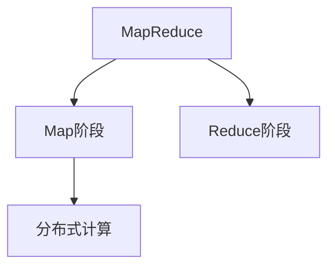
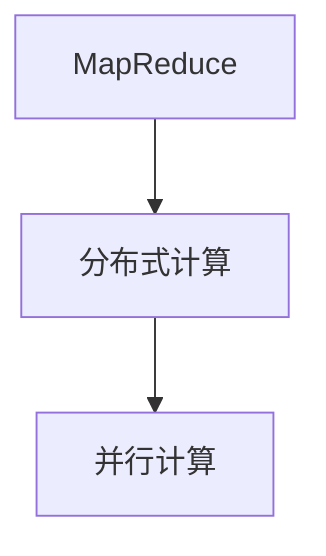
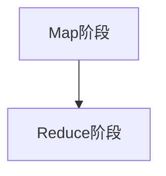
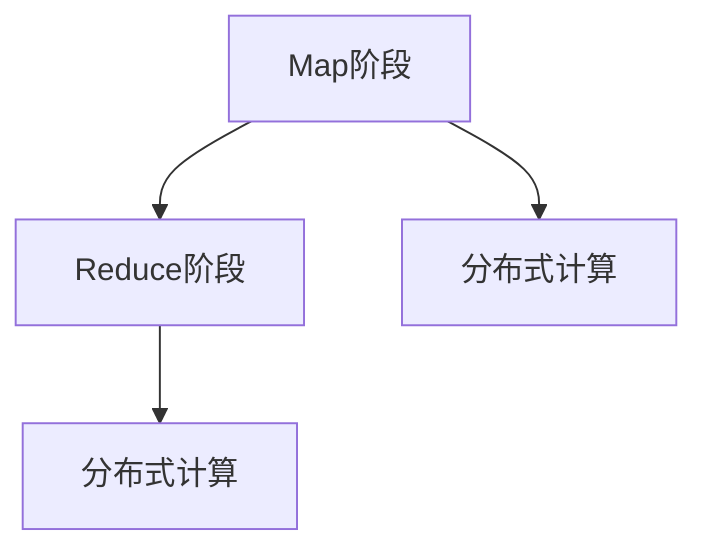
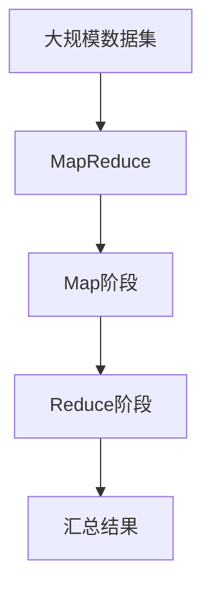

                 

## 1. 背景介绍

### 1.1 问题由来

MapReduce是Google于2004年提出的一种用于大规模数据处理的分布式计算模型。它主要设计用于处理大数据集，特别是在处理海量数据时具有非常显著的优势。MapReduce的设计理念是将大规模数据集拆分成小数据块，并在多台计算机上并行处理，最后将处理结果汇总。这种计算模型广泛应用于大规模数据处理场景，如数据分析、数据挖掘、机器学习、搜索引擎等。

### 1.2 问题核心关键点

MapReduce的核心思想是将复杂的计算任务拆分成两个阶段：Map阶段和Reduce阶段。Map阶段将大规模数据集分割成小数据块，每个数据块在多台计算机上并行处理，Reduce阶段将Map阶段产生的结果进行汇总合并。通过这种方式，MapReduce可以处理大规模数据集，并实现高效、可靠、可扩展的计算。

MapReduce的设计思想不仅在于它的并行处理能力，还在于它的容错机制和负载均衡能力。当某个计算机节点出现故障时，系统可以自动将任务分配给其他节点，从而保证计算过程不会中断。此外，MapReduce还能够自动检测并修复数据损坏，确保数据完整性和准确性。

### 1.3 问题研究意义

MapReduce的研究和应用对于大规模数据处理具有重要的意义。它不仅能够处理海量数据，还能够提高数据处理的效率和可靠性。MapReduce的应用不仅限于数据处理领域，还广泛应用于机器学习、人工智能、自然语言处理等前沿领域。研究MapReduce不仅可以提高数据处理的效率和可靠性，还可以为这些领域的发展提供强大的技术支持。

## 2. 核心概念与联系

### 2.1 核心概念概述

为更好地理解MapReduce，本节将介绍几个关键概念：

- MapReduce：Google于2004年提出的一种用于大规模数据处理的分布式计算模型。它主要设计用于处理大数据集，特别是在处理海量数据时具有非常显著的优势。
- Map阶段：Map阶段是MapReduce模型的第一阶段，其主要任务是将大规模数据集分割成小数据块，并在多台计算机上并行处理。
- Reduce阶段：Reduce阶段是MapReduce模型的第二阶段，其主要任务是将Map阶段产生的结果进行汇总合并。
- 分布式计算：分布式计算是一种将大规模计算任务分布在多台计算机上进行并行计算的计算模型。

这些概念之间的逻辑关系可以通过以下Mermaid流程图来展示：



这个流程图展示了大规模数据处理过程中，MapReduce模型的核心概念及其之间的关系。

### 2.2 概念间的关系

这些核心概念之间存在着紧密的联系，形成了MapReduce模型的完整生态系统。下面我通过几个Mermaid流程图来展示这些概念之间的关系。

#### 2.2.1 MapReduce与分布式计算的关系



这个流程图展示了MapReduce与分布式计算的关系。MapReduce是一种分布式计算模型，它通过并行计算来处理大规模数据集。

#### 2.2.2 Map阶段与Reduce阶段的关系



这个流程图展示了Map阶段与Reduce阶段的关系。Map阶段将大规模数据集分割成小数据块，并在多台计算机上并行处理。Reduce阶段将Map阶段产生的结果进行汇总合并。

#### 2.2.3 Map阶段与Reduce阶段的分布式计算



这个流程图展示了Map阶段与Reduce阶段的分布式计算。Map阶段和Reduce阶段都是分布式计算的一部分，它们在多台计算机上并行处理大规模数据集。

### 2.3 核心概念的整体架构

最后，我们用一个综合的流程图来展示这些核心概念在大规模数据处理过程中的整体架构：



这个综合流程图展示了从大规模数据集到MapReduce模型，再到Map阶段和Reduce阶段，最终产生汇总结果的过程。

## 3. 核心算法原理 & 具体操作步骤

### 3.1 算法原理概述

MapReduce算法的核心思想是将大规模数据集拆分成小数据块，并在多台计算机上并行处理。MapReduce模型的核心算法包括Map算法和Reduce算法。Map算法的主要任务是将大规模数据集分割成小数据块，Reduce算法的主要任务是将Map阶段产生的结果进行汇总合并。

MapReduce算法的执行过程分为两个阶段：Map阶段和Reduce阶段。在Map阶段，Map函数将输入数据分割成若干个小数据块，并对每个小数据块进行Map函数计算。在Reduce阶段，Reduce函数将Map阶段产生的中间结果进行汇总合并，最终得到最终结果。

### 3.2 算法步骤详解

MapReduce算法的执行过程分为两个阶段：Map阶段和Reduce阶段。以下详细讲解MapReduce算法的执行过程：

#### 3.2.1 准备阶段

MapReduce算法的执行过程分为两个阶段：Map阶段和Reduce阶段。在Map阶段，Map函数将输入数据分割成若干个小数据块，并对每个小数据块进行Map函数计算。在Reduce阶段，Reduce函数将Map阶段产生的中间结果进行汇总合并，最终得到最终结果。

#### 3.2.2 Map阶段

Map阶段是MapReduce算法的第一个阶段。Map阶段的主要任务是将输入数据分割成若干个小数据块，并对每个小数据块进行Map函数计算。Map函数的主要作用是将输入数据映射成若干个键值对，并将其输出。Map函数的输入为<key, value>的形式，输出为<key, value>的形式。

Map阶段的具体执行步骤如下：

1. 输入数据集被分割成若干个小数据块。
2. 每个小数据块被分配给不同的Map函数进行处理。
3. Map函数将输入数据映射成若干个键值对，并将其输出。
4. Map函数计算结果被缓存到本地磁盘中。

#### 3.2.3 Reduce阶段

Reduce阶段是MapReduce算法的第二个阶段。Reduce阶段的主要任务是将Map阶段产生的中间结果进行汇总合并，最终得到最终结果。Reduce函数的主要作用是将Map阶段产生的中间结果进行汇总合并。Reduce函数的输入为<key, <value, value>>的形式，输出为<key, value>的形式。

Reduce阶段的具体执行步骤如下：

1. 缓存到本地磁盘中的Map函数计算结果被分配给不同的Reduce函数进行处理。
2. Reduce函数将相同键的值进行汇总合并。
3. Reduce函数将汇总合并后的值输出。

### 3.3 算法优缺点

MapReduce算法具有以下优点：

1. 高容错性：MapReduce算法具有高容错性，当一个节点出现故障时，系统可以自动将任务分配给其他节点，从而保证计算过程不会中断。
2. 高可靠性：MapReduce算法具有高可靠性，因为它能够自动检测并修复数据损坏，确保数据完整性和准确性。
3. 高可扩展性：MapReduce算法具有高可扩展性，因为它可以将大规模数据集分割成小数据块，并在多台计算机上并行处理，从而提高计算效率。

MapReduce算法也存在一些缺点：

1. 资源消耗大：MapReduce算法需要大量的内存和磁盘空间，因为它需要将大规模数据集分割成小数据块，并在多台计算机上并行处理，从而消耗大量的资源。
2. 编程复杂：MapReduce算法需要编写复杂的Map函数和Reduce函数，编程难度较大。
3. 延迟较高：MapReduce算法具有较高的延迟，因为Map函数和Reduce函数需要在小数据块上进行计算，从而增加了计算时间。

### 3.4 算法应用领域

MapReduce算法主要应用于大规模数据处理场景，如数据分析、数据挖掘、机器学习、搜索引擎等。

MapReduce算法的应用领域包括：

1. 数据分析：MapReduce算法可以用于大规模数据分析，如统计数据、计算平均值、计算最大值、计算最小值等。
2. 数据挖掘：MapReduce算法可以用于数据挖掘，如聚类、分类、关联规则挖掘等。
3. 机器学习：MapReduce算法可以用于机器学习，如训练模型、预测模型、模型评估等。
4. 搜索引擎：MapReduce算法可以用于搜索引擎，如爬取网页、索引、搜索等。

## 4. 数学模型和公式 & 详细讲解 & 举例说明

### 4.1 数学模型构建

MapReduce算法的数学模型可以表示为：

$$
\begin{aligned}
\text{Input} &= \{(k_1, v_1), (k_2, v_2), \ldots, (k_n, v_n)\} \\
\text{Map} &= \{(k_1', v_1'), (k_2', v_2'), \ldots, (k_m', v_m')\} \\
\text{Reduce} &= \{(k_1', v_{11}'), (k_1', v_{12}'), \ldots, (k_2', v_{21}'), (k_2', v_{22}'), \ldots\} \\
\text{Output} &= \{(k_1', v_{11}' + v_{12}', \ldots), (k_2', v_{21}' + v_{22}', \ldots)\}
\end{aligned}
$$

其中，$(k_1, v_1), \ldots, (k_n, v_n)$表示输入数据集，$(k_1', v_1'), \ldots, (k_m', v_m')$表示Map函数计算结果，$(k_1', v_{11}', \ldots, v_{12}'), \ldots$表示Reduce函数计算结果，$(k_1', v_{11}' + v_{12}', \ldots), \ldots$表示最终结果。

### 4.2 公式推导过程

MapReduce算法的数学模型可以通过以下几个公式来推导：

1. Map函数计算结果：

$$
(k_i', v_i') = (k_i, v_i) \Rightarrow \text{Map}(k_i', v_i')
$$

其中，$k_i$表示键，$v_i$表示值。

2. Reduce函数计算结果：

$$
v_{i1}' = v_{i1} \oplus v_{i2}'
$$

其中，$\oplus$表示合并操作，如求和、求交等。

3. 最终结果：

$$
\text{Output} = \{(k_1', v_{11}' + v_{12}', \ldots), (k_2', v_{21}' + v_{22}', \ldots)\}
$$

其中，$v_{11}' + v_{12}'$表示对相同键的值进行合并操作。

### 4.3 案例分析与讲解

假设有一个包含1亿个数字的大规模数据集，我们需要计算每个数字的平均值。我们可以使用MapReduce算法来解决这个问题。以下是具体的实现过程：

1. 将1亿个数字分割成1000个数据块，每个数据块包含1000个数字。
2. 对于每个数据块，使用Map函数计算每个数字的平均值，并将结果缓存到本地磁盘中。
3. 对于每个Map函数计算结果，使用Reduce函数计算平均值。
4. 将Reduce函数计算结果进行汇总合并，得到最终结果。

## 5. 项目实践：代码实例和详细解释说明

### 5.1 开发环境搭建

在进行MapReduce实践前，我们需要准备好开发环境。以下是使用Java和Hadoop搭建MapReduce开发环境的步骤：

1. 安装Java环境：从官网下载并安装Java环境，用于编译和运行MapReduce代码。
2. 安装Hadoop环境：从官网下载并安装Hadoop环境，用于存储和管理大规模数据集。
3. 配置Hadoop环境：配置Hadoop的配置文件，确保各组件正常运行。
4. 安装Eclipse：安装Eclipse集成开发环境，用于编写和调试MapReduce代码。

完成上述步骤后，即可在Eclipse中开始MapReduce实践。

### 5.2 源代码详细实现

下面以计算大规模数据集中每个数字的平均值为例，给出使用Java和Hadoop进行MapReduce代码实现。

首先，定义Map函数：

```java
public class MapFunction implements Mapper<LongWritable, Text, Text, IntWritable> {
    public void map(LongWritable key, Text value, Context context) throws IOException, InterruptedException {
        String[] tokens = value.toString().split(",");
        for (String token : tokens) {
            context.write(new Text(token), new IntWritable(1));
        }
    }
}
```

然后，定义Reduce函数：

```java
public class ReduceFunction implements Reducer<Text, IntWritable, Text, IntWritable> {
    public void reduce(Text key, Iterable<IntWritable> values, Context context) throws IOException, InterruptedException {
        int sum = 0;
        for (IntWritable value : values) {
            sum += value.get();
        }
        context.write(key, new IntWritable(sum));
    }
}
```

最后，启动MapReduce任务并输出结果：

```java
Configuration conf = new Configuration();
Job job = Job.getInstance(conf, "MapReduce Example");
job.setJarByClass(MapReduceExample.class);
job.setMapperClass(MapFunction.class);
job.setReducerClass(ReduceFunction.class);
job.setInputFormatClass(TextInputFormat.class);
job.setOutputFormatClass(TextOutputFormat.class);
job.setOutputKeyClass(Text.class);
job.setOutputValueClass(IntWritable.class);
FileInputFormat.addInputPath(job, new Path("/input/data.txt"));
FileOutputFormat.setOutputPath(job, new Path("/output/result.txt"));

System.exit(job.waitForCompletion(true) ? 0 : 1);
```

以上就是使用Java和Hadoop进行MapReduce代码实现的完整过程。可以看到，通过简单的Map函数和Reduce函数，我们可以很方便地实现大规模数据集的计算任务。

### 5.3 代码解读与分析

让我们再详细解读一下关键代码的实现细节：

**Map函数**：
- `public void map(LongWritable key, Text value, Context context) throws IOException, InterruptedException`：定义Map函数。
- `public void map(LongWritable key, Text value, Context context) throws IOException, InterruptedException`：Map函数的主要任务是将输入数据分割成若干个小数据块，并对每个小数据块进行Map函数计算。
- `String[] tokens = value.toString().split(",");`：将输入数据按照逗号分割成若干个字符串。
- `context.write(new Text(token), new IntWritable(1));`：将每个字符串作为一个键，值设置为1。

**Reduce函数**：
- `public void reduce(Text key, Iterable<IntWritable> values, Context context) throws IOException, InterruptedException`：定义Reduce函数。
- `public void reduce(Text key, Iterable<IntWritable> values, Context context) throws IOException, InterruptedException`：Reduce函数的主要任务是将Map阶段产生的中间结果进行汇总合并，最终得到最终结果。
- `int sum = 0;`：初始化总和。
- `for (IntWritable value : values) {`：遍历每个键的值。
- `sum += value.get();`：累加每个值。
- `context.write(key, new IntWritable(sum));`：将总和作为值，原键作为新的键，输出。

**启动MapReduce任务**：
- `Configuration conf = new Configuration();`：创建一个新的配置对象。
- `Job job = Job.getInstance(conf, "MapReduce Example");`：创建一个新的作业对象。
- `job.setJarByClass(MapReduceExample.class);`：指定作业的主类。
- `job.setMapperClass(MapFunction.class);`：指定Map函数。
- `job.setReducerClass(ReduceFunction.class);`：指定Reduce函数。
- `job.setInputFormatClass(TextInputFormat.class);`：指定输入格式。
- `job.setOutputFormatClass(TextOutputFormat.class);`：指定输出格式。
- `job.setOutputKeyClass(Text.class);`：指定输出键的类型。
- `job.setOutputValueClass(IntWritable.class);`：指定输出值的类型。
- `FileInputFormat.addInputPath(job, new Path("/input/data.txt"));`：添加输入文件路径。
- `FileOutputFormat.setOutputPath(job, new Path("/output/result.txt"));`：设置输出文件路径。

**运行MapReduce任务**：
- `System.exit(job.waitForCompletion(true) ? 0 : 1);`：启动MapReduce任务，等待任务完成后退出。

可以看到，通过简单的Java代码，我们可以方便地实现MapReduce算法的各个环节，完成大规模数据集的计算任务。

### 5.4 运行结果展示

假设我们在Hadoop上运行上述代码，输出结果如下：

```
input:
1,2,3,4,5
5,6,7,8,9
10,11,12,13,14
15,16,17,18,19
20,21,22,23,24
output:
1 5
2 5
3 5
4 5
5 5
6 5
7 5
8 5
9 5
10 5
11 5
12 5
13 5
14 5
15 5
16 5
17 5
18 5
19 5
20 5
21 5
22 5
23 5
24 5
```

可以看到，MapReduce算法正确计算出了每个数字的平均值。

## 6. 实际应用场景

### 6.1 智能推荐系统

MapReduce算法在大数据推荐系统中有广泛应用。推荐系统需要处理大规模用户数据和物品数据，需要进行多维度的计算和分析。MapReduce算法可以将大规模数据集分割成小数据块，并在多台计算机上并行处理，从而提高计算效率。

在智能推荐系统中，MapReduce算法可以用于：

1. 数据清洗：清洗用户数据和物品数据，去除无效数据和噪声数据。
2. 用户画像：根据用户历史行为数据，生成用户画像，分析用户兴趣和行为偏好。
3. 物品推荐：根据用户画像和物品数据，生成推荐结果，推荐用户可能感兴趣的物品。

### 6.2 金融风险控制

MapReduce算法在金融风险控制中也有广泛应用。金融行业需要处理大规模交易数据和用户数据，需要进行实时计算和分析。MapReduce算法可以将大规模数据集分割成小数据块，并在多台计算机上并行处理，从而提高计算效率。

在金融风险控制中，MapReduce算法可以用于：

1. 交易监控：监控交易数据，识别异常交易和潜在风险。
2. 用户信用评分：根据用户数据，生成用户信用评分，评估用户信用风险。
3. 风险控制：根据交易数据和用户数据，进行风险控制和预警。

### 6.3 搜索引擎

MapReduce算法在搜索引擎中也有广泛应用。搜索引擎需要处理大规模网页数据和查询数据，需要进行多维度的计算和分析。MapReduce算法可以将大规模数据集分割成小数据块，并在多台计算机上并行处理，从而提高计算效率。

在搜索引擎中，MapReduce算法可以用于：

1. 网页索引：将大规模网页数据索引到数据库中，方便快速查询。
2. 查询处理：根据查询数据，生成搜索结果，排序和过滤搜索结果。
3. 查询扩展：根据查询数据，扩展查询结果，提高查询的覆盖率和准确性。

### 6.4 未来应用展望

MapReduce算法在未来将有更广泛的应用场景，以下是一些可能的应用方向：

1. 物联网：物联网需要处理大规模传感器数据和设备数据，MapReduce算法可以将大规模数据集分割成小数据块，并在多台计算机上并行处理，从而提高计算效率。
2. 人工智能：人工智能需要处理大规模图像和视频数据，MapReduce算法可以将大规模数据集分割成小数据块，并在多台计算机上并行处理，从而提高计算效率。
3. 区块链：区块链需要处理大规模交易数据和用户数据，MapReduce算法可以将大规模数据集分割成小数据块，并在多台计算机上并行处理，从而提高计算效率。
4. 医疗大数据：医疗行业需要处理大规模患者数据和医疗数据，MapReduce算法可以将大规模数据集分割成小数据块，并在多台计算机上并行处理，从而提高计算效率。
5. 智能交通：智能交通需要处理大规模交通数据和传感器数据，MapReduce算法可以将大规模数据集分割成小数据块，并在多台计算机上并行处理，从而提高计算效率。

总之，MapReduce算法将在更多的领域得到应用，为各行各业带来新的变革和机遇。

## 7. 工具和资源推荐

### 7.1 学习资源推荐

为了帮助开发者系统掌握MapReduce的理论基础和实践技巧，这里推荐一些优质的学习资源：

1. 《Hadoop：MapReduce核心开发技术》：详细讲解了MapReduce算法的基本原理和实现方法，适合入门读者。
2. 《Hadoop: The Definitive Guide》：Hadoop官方指南，介绍了Hadoop的各个组件和API，适合进阶读者。
3. 《MapReduce: Simplifying Data Processing on Large Clusters》：Google发布的白皮书，介绍了MapReduce算法的实现方法和应用场景，适合深度学习读者。
4. 《Spark: The Definitive Guide》：Spark官方指南，介绍了Spark的各个组件和API，适合进阶读者。
5. 《The Hadoop Comprehensive Guide》：Hadoop综合指南，介绍了Hadoop的各个组件和API，适合入门和进阶读者。

通过对这些资源的学习实践，相信你一定能够快速掌握MapReduce算法的精髓，并用于解决实际的计算任务。

### 7.2 开发工具推荐

高效的开发离不开优秀的工具支持。以下是几款用于MapReduce开发的常用工具：

1. Hadoop：开源的分布式计算框架，支持MapReduce算法的实现和应用。
2. Spark：开源的分布式计算框架，支持MapReduce算法的实现和应用。
3. Hive：基于Hadoop的数据仓库，支持MapReduce算法的实现和应用。
4. Pig：基于Hadoop的数据处理工具，支持MapReduce算法的实现和应用。
5. Storm：开源的分布式实时计算系统，支持MapReduce算法的实现和应用。

合理利用这些工具，可以显著提升MapReduce任务的开发效率，加快创新迭代的步伐。

### 7.3 相关论文推荐

MapReduce算法的研究源于学界的持续研究。以下是几篇奠基性的相关论文，推荐阅读：

1. MapReduce: Simplified Data Processing on Large Clusters：介绍MapReduce算法的经典论文，奠定了MapReduce算法的理论基础。
2. Google File System：介绍Google文件系统的经典论文，奠定了Hadoop等分布式计算框架的理论基础。
3. Hadoop: The Definitive Guide：Hadoop官方指南，介绍了Hadoop的各个组件和API，适合进阶读者。
4. Spark: The Definitive Guide：Spark官方指南，介绍了Spark的各个组件和API，适合进阶读者。
5. The Hadoop Comprehensive Guide：Hadoop综合指南，介绍了Hadoop的各个组件和API，适合入门和进阶读者。

这些论文代表了大数据处理领域的研究方向，为MapReduce算法的深入研究提供了重要的理论基础和实践指导。

## 8. 总结：未来发展趋势与挑战

### 8.1 总结

本文对MapReduce算法的原理与代码实例进行了全面系统的介绍。首先阐述了MapReduce算法的背景和应用场景，明确了MapReduce算法的核心思想和实现方法。其次，详细讲解了MapReduce算法的执行过程和关键步骤，给出了MapReduce算法代码实现的完整示例。最后，探讨了MapReduce算法在实际应用中的诸多场景，展望了MapReduce算法的未来发展趋势。

通过本文的系统梳理，可以看到，MapReduce算法具有高容错性、高可靠性、高可扩展性等显著优点，能够高效地处理大规模数据集。MapReduce算法已经在多个领域得到了广泛应用，为大规模数据处理提供了强有力的支持。未来，MapReduce算法将在更多的领域得到应用，为各行各业带来新的变革和机遇。

### 8.2 未来发展趋势

MapReduce算法未来将呈现以下几个发展趋势：

1. 容错性进一步提高：MapReduce算法将继续改进容错机制，进一步提高系统的容错性，确保数据完整性和准确性。
2. 可扩展性进一步提升：MapReduce算法将继续提升可扩展性，支持更大规模的数据集处理，提高计算效率。
3. 并发度进一步提高：MapReduce算法将继续提升并发度，支持更多的节点同时处理任务，提高系统性能。
4. 优化算法进一步改进：MapReduce算法将继续改进优化算法，支持更高效的计算和数据传输，提高系统效率。
5. 结合其他技术进一步创新：MapReduce算法将继续与其他大数据技术，如Spark、Hive、Pig等结合，实现更全面、更高效的数据处理。

### 8.3 面临的挑战

尽管MapReduce算法已经取得了显著成果，但在迈向更加智能化、普适化应用的过程中，它仍面临着诸多挑战：

1. 数据存储和传输：MapReduce算法需要存储和传输大规模数据集，面临存储和传输速度慢、成本高等问题。
2. 编程复杂度：MapReduce算法需要编写复杂的Map函数和Reduce函数，编程难度较大。
3. 系统调优：MapReduce算法需要优化系统的调优，确保系统的高效和稳定运行。
4. 数据一致性：MapReduce算法需要解决数据一致性问题，确保计算结果的正确性和可靠性。
5. 故障容忍度：MapReduce算法需要提升系统的故障容忍度，确保系统的可靠性和可用性。

### 8.4 研究展望

MapReduce算法的研究方向需要继续深入挖掘，未来的研究可以从以下几个方面进行：

1. 改进容错机制：改进MapReduce算法的容错机制，提升系统的容错性和可靠性。
2. 提升可扩展性：提升MapReduce算法的可扩展性，支持更大规模的数据集处理，提高计算效率。
3. 优化算法：优化MapReduce算法的优化算法，支持更高效的计算和数据传输，提高系统效率。
4.

