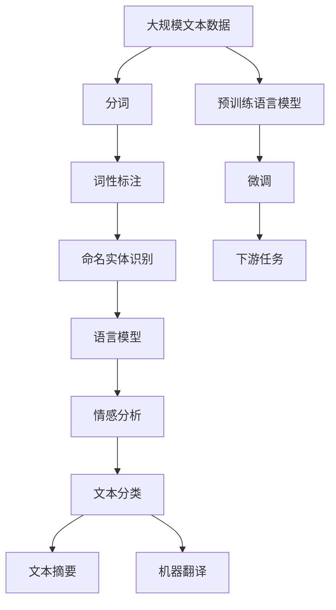

                 

# NLTK 原理与代码实战案例讲解

> 关键词：NLTK,自然语言处理(NLP),文本分析,语言模型,词性标注,命名实体识别,情感分析

## 1. 背景介绍

### 1.1 问题由来
自然语言处理（Natural Language Processing, NLP）作为人工智能领域的重要分支，近年来取得了长足的进展。随着深度学习和大规模语料库的普及，NLP技术已经广泛应用于机器翻译、情感分析、文本分类、信息抽取等多个领域。然而，在中文NLP领域，由于语言结构的复杂性和多样性，自然语言处理的难度和复杂度相对较高。

自然语言工具包（Natural Language Toolkit, NLTK）作为Python领域最为成熟的NLP工具之一，提供了丰富的语言处理功能，使得开发者可以更轻松地进行文本分析和自然语言处理。本文将详细介绍NLTK的基本原理和应用实践，并通过一系列代码实例，帮助读者深入理解NLTK的使用方法。

### 1.2 问题核心关键点
NLTK作为NLP领域的重要工具，其核心功能包括：

- 词性标注（Part-of-Speech Tagging, POS Tagging）：识别文本中每个单词的词性。
- 命名实体识别（Named Entity Recognition, NER）：识别文本中人名、地名、机构名等实体。
- 语言模型（Language Modeling）：统计文本中词语的共现频率，建立文本概率模型。
- 情感分析（Sentiment Analysis）：分析文本的情感倾向，如正面、负面或中性。

这些功能覆盖了NLP的多个核心领域，并可以通过NLTK提供的函数和模块来实现。本文将详细介绍这些功能，并通过代码实例展示其在实际应用中的使用。

### 1.3 问题研究意义
NLTK不仅是一个开源工具包，更是一个强大的NLP研究平台。通过学习NLTK，读者可以更深入地理解NLP的原理和算法，掌握NLP技术的实现细节。同时，NLTK提供了大量的教学资源和文档，可以帮助读者快速上手，并进行深入探索。

在中文NLP领域，NLTK的中文分词、词性标注、命名实体识别等功能，使得中文文本分析变得更为便捷和高效。通过NLTK，中文NLP技术的落地应用得以快速实现，对推进中文NLP研究和应用具有重要意义。

## 2. 核心概念与联系

### 2.1 核心概念概述

为了更好地理解NLTK的基本原理和应用实践，本节将介绍几个密切相关的核心概念：

- 自然语言处理（NLP）：涉及语言理解、文本分析、信息抽取、机器翻译等多个领域的计算机科学分支。
- 词性标注（POS Tagging）：识别文本中每个单词的词性，如名词、动词、形容词等。
- 命名实体识别（NER）：识别文本中人名、地名、机构名等特定实体。
- 语言模型（Language Modeling）：通过统计文本中词语的共现频率，建立文本概率模型。
- 情感分析（Sentiment Analysis）：分析文本的情感倾向，如正面、负面或中性。

这些核心概念之间的关系可以通过以下Mermaid流程图来展示：

```mermaid
graph TB
    A[自然语言处理(NLP)] --> B[词性标注(POS Tagging)]
    A --> C[命名实体识别(NER)]
    A --> D[语言模型(Language Modeling)]
    A --> E[情感分析(Sentiment Analysis)]
    B --> F[基于规则的标注方法]
    C --> G[基于机器学习的标注方法]
    D --> H[基于n-gram的模型]
    E --> I[基于情感词典的模型]
```

这个流程图展示了大语言处理与词性标注、命名实体识别、语言模型和情感分析等核心概念之间的关系：

1. 自然语言处理涵盖词性标注、命名实体识别、语言模型和情感分析等多个子领域，是NLP领域的基础。
2. 词性标注和命名实体识别主要基于规则和机器学习两种方法。
3. 语言模型基于n-gram模型和深度神经网络模型。
4. 情感分析主要基于情感词典和深度学习模型。

### 2.2 概念间的关系

这些核心概念之间存在着紧密的联系，形成了自然语言处理的完整生态系统。下面我们通过几个Mermaid流程图来展示这些概念之间的关系。

#### 2.2.1 自然语言处理与词性标注的关系

```mermaid
graph LR
    A[自然语言处理(NLP)] --> B[词性标注(POS Tagging)]
    A --> C[分词]
    B --> D[基于规则的标注方法]
    B --> E[基于机器学习的标注方法]
```

这个流程图展示了自然语言处理与词性标注的关系：

1. 自然语言处理的核心任务之一是对文本进行分词和词性标注。
2. 词性标注主要基于规则和机器学习两种方法。
3. 基于规则的标注方法依赖于手工构建的词性词典，需要大量人工标注数据。
4. 基于机器学习的标注方法通过训练模型来学习词性标注的规则，需要较少的标注数据。

#### 2.2.2 自然语言处理与命名实体识别

```mermaid
graph LR
    A[自然语言处理(NLP)] --> B[命名实体识别(NER)]
    A --> C[分词]
    B --> D[基于规则的标注方法]
    B --> E[基于机器学习的标注方法]
```

这个流程图展示了自然语言处理与命名实体识别的关系：

1. 命名实体识别是自然语言处理中的重要任务之一，用于识别文本中的人名、地名、机构名等特定实体。
2. 命名实体识别同样基于规则和机器学习两种方法。
3. 基于规则的标注方法依赖于手工构建的实体词典，需要大量人工标注数据。
4. 基于机器学习的标注方法通过训练模型来学习实体的识别规则，需要较少的标注数据。

#### 2.2.3 自然语言处理与语言模型

```mermaid
graph LR
    A[自然语言处理(NLP)] --> B[语言模型(Language Modeling)]
    A --> C[分词]
    B --> D[n-gram模型]
    B --> E[神经网络模型]
```

这个流程图展示了自然语言处理与语言模型的关系：

1. 语言模型是自然语言处理中的重要任务之一，用于预测文本中下一个词的概率。
2. 语言模型主要基于n-gram模型和神经网络模型。
3. n-gram模型通过统计文本中词语的共现频率来建立文本概率模型。
4. 神经网络模型通过深度学习来建立文本概率模型。

#### 2.2.4 自然语言处理与情感分析

```mermaid
graph LR
    A[自然语言处理(NLP)] --> B[情感分析(Sentiment Analysis)]
    A --> C[分词]
    B --> D[基于情感词典的模型]
    B --> E[基于深度学习的模型]
```

这个流程图展示了自然语言处理与情感分析的关系：

1. 情感分析是自然语言处理中的重要任务之一，用于分析文本的情感倾向。
2. 情感分析主要基于情感词典和深度学习模型。
3. 基于情感词典的模型通过统计文本中情感词的出现频率来分析情感倾向。
4. 基于深度学习的模型通过训练模型来学习情感分析的规则，需要较少的标注数据。

### 2.3 核心概念的整体架构

最后，我们用一个综合的流程图来展示这些核心概念在大语言处理中的应用：



这个综合流程图展示了从大规模文本数据到下游任务微调的大语言处理过程。大语言处理首先在大规模文本数据上进行预训练，然后通过微调来适应各种下游任务，如文本分类、文本摘要、机器翻译等，构建完整的语言处理系统。

## 3. 核心算法原理 & 具体操作步骤
### 3.1 算法原理概述

自然语言处理的核心算法包括词性标注、命名实体识别、语言模型和情感分析等。这些算法的主要原理和实现过程如下：

### 3.2 算法步骤详解

#### 3.2.1 词性标注（POS Tagging）

词性标注是自然语言处理中的基础任务之一，通过识别文本中每个单词的词性，为后续的文本分析和处理提供必要的信息。词性标注的主要算法包括基于规则的方法和基于机器学习的方法。

基于规则的方法：

1. 手工构建词性词典：收集大量的标注数据，手工标注每个单词的词性。
2. 词性标注器：将标注数据输入到词性标注器中，训练得到词性标注模型。
3. 标注文本：将待标注文本输入到词性标注器中，得到每个单词的词性。

基于机器学习的方法：

1. 标注数据准备：收集大量的标注数据，标注每个单词的词性。
2. 特征提取：提取每个单词的特征，如单词本身、上下文信息等。
3. 训练模型：使用标注数据和提取的特征，训练得到词性标注模型。
4. 标注文本：将待标注文本输入到词性标注模型中，得到每个单词的词性。

#### 3.2.2 命名实体识别（NER）

命名实体识别是自然语言处理中的重要任务之一，用于识别文本中的人名、地名、机构名等特定实体。命名实体识别主要基于规则和机器学习两种方法。

基于规则的方法：

1. 手工构建实体词典：收集大量的标注数据，手工标注每个实体。
2. 实体标注器：将标注数据输入到实体标注器中，训练得到实体标注模型。
3. 标注文本：将待标注文本输入到实体标注器中，得到每个实体的类型。

基于机器学习的方法：

1. 标注数据准备：收集大量的标注数据，标注每个实体的类型。
2. 特征提取：提取每个单词的特征，如单词本身、上下文信息等。
3. 训练模型：使用标注数据和提取的特征，训练得到实体标注模型。
4. 标注文本：将待标注文本输入到实体标注模型中，得到每个实体的类型。

#### 3.2.3 语言模型（Language Modeling）

语言模型是自然语言处理中的重要任务之一，用于预测文本中下一个词的概率。语言模型主要基于n-gram模型和神经网络模型。

基于n-gram模型的方法：

1. 统计文本中词语的共现频率：统计文本中相邻词语的共现频率，得到n-gram模型。
2. 预测下一个词的概率：根据n-gram模型，预测文本中下一个词的概率。

基于神经网络模型的方法：

1. 构建神经网络模型：使用深度神经网络模型，如RNN、LSTM、Transformer等。
2. 训练模型：使用标注数据和提取的特征，训练得到神经网络模型。
3. 预测下一个词的概率：根据训练好的神经网络模型，预测文本中下一个词的概率。

#### 3.2.4 情感分析（Sentiment Analysis）

情感分析是自然语言处理中的重要任务之一，用于分析文本的情感倾向。情感分析主要基于情感词典和深度学习模型。

基于情感词典的方法：

1. 收集情感词典：收集大量的情感词典，包含正面、负面和中性情感词汇。
2. 标注数据准备：收集大量的标注数据，标注每个文本的情感倾向。
3. 情感分析器：将标注数据输入到情感分析器中，训练得到情感分析模型。
4. 分析文本：将待分析文本输入到情感分析器中，得到文本的情感倾向。

基于深度学习的方法：

1. 标注数据准备：收集大量的标注数据，标注每个文本的情感倾向。
2. 特征提取：提取每个单词的特征，如单词本身、上下文信息等。
3. 训练模型：使用标注数据和提取的特征，训练得到深度学习模型。
4. 分析文本：将待分析文本输入到深度学习模型中，得到文本的情感倾向。

### 3.3 算法优缺点

自然语言处理中的核心算法主要包括词性标注、命名实体识别、语言模型和情感分析等。这些算法的优缺点如下：

#### 3.3.1 词性标注（POS Tagging）

词性标注的主要优点是准确性高，能够精确地识别每个单词的词性。其缺点是需要大量标注数据，手工构建词性词典和标注器的工作量大。

#### 3.3.2 命名实体识别（NER）

命名实体识别的主要优点是能够识别出文本中的特定实体，对于信息抽取等任务非常有用。其缺点是需要大量的标注数据，手工构建实体词典和标注器的工作量大。

#### 3.3.3 语言模型（Language Modeling）

语言模型的主要优点是可以预测文本中下一个词的概率，为文本生成和机器翻译等任务提供基础。其缺点是需要大量标注数据，模型训练复杂度高，计算资源消耗大。

#### 3.3.4 情感分析（Sentiment Analysis）

情感分析的主要优点是可以分析文本的情感倾向，帮助理解用户情感。其缺点是需要大量标注数据，手工构建情感词典和标注器的工作量大。

### 3.4 算法应用领域

自然语言处理中的核心算法广泛应用于多个领域，包括：

- 文本分类：将文本分为不同类别，如新闻分类、情感分类等。
- 信息抽取：从文本中提取特定的信息，如事件抽取、关系抽取等。
- 机器翻译：将源语言文本翻译成目标语言。
- 文本摘要：将长文本压缩成简短摘要。
- 问答系统：对自然语言问题给出答案。

这些应用领域覆盖了自然语言处理的大部分核心任务，NLTK提供了丰富的工具和模块，可以帮助开发者实现这些任务。

## 4. 数学模型和公式 & 详细讲解 & 举例说明

### 4.1 数学模型构建

为了更好地理解NLTK的基本原理和应用实践，本节将介绍几个关键数学模型：

- 词性标注（POS Tagging）：基于隐马尔可夫模型（Hidden Markov Model, HMM）的词性标注模型。
- 命名实体识别（NER）：基于条件随机场（Conditional Random Field, CRF）的命名实体识别模型。
- 语言模型（Language Modeling）：基于n-gram模型和神经网络模型的语言模型。
- 情感分析（Sentiment Analysis）：基于情感词典和深度学习模型的情感分析模型。

这些模型都基于概率统计和机器学习原理，通过训练数据来建立模型，并用于文本分析和处理。

### 4.2 公式推导过程

#### 4.2.1 词性标注模型（HMM）

词性标注模型基于隐马尔可夫模型，用于预测文本中每个单词的词性。HMM模型的基本形式为：

$$
P(w_t|w_{t-1},\ldots,w_1,\theta) = \sum_{y_t}P(w_t|y_t,w_{t-1},\ldots,w_1,\theta)P(y_t|y_{t-1},\ldots,y_1,\theta)
$$

其中，$w_t$表示文本中第t个单词，$y_t$表示$w_t$的词性标签，$\theta$表示模型参数。

词性标注模型的训练过程通常采用Viterbi算法，通过最大后验概率来求解最优的词性标注序列。具体步骤如下：

1. 初始化：计算每个单词的初始状态概率和转移概率。
2. 前向传递：计算每个单词的状态概率和转移概率。
3. 后向传递：计算每个单词的状态概率和转移概率。
4. 解码：使用Viterbi算法，从所有状态序列中，选择概率最大的状态序列作为预测结果。

#### 4.2.2 命名实体识别模型（CRF）

命名实体识别模型基于条件随机场，用于识别文本中的人名、地名、机构名等特定实体。CRF模型的基本形式为：

$$
P(Y|X,\theta) = \frac{1}{Z(X,\theta)}\exp\left(\sum_{i=1}^T\sum_{j=1}^TW(y_i,y_j|x_i,x_j,\theta)\right)
$$

其中，$X$表示输入文本，$Y$表示标注结果，$W(y_i,y_j|x_i,x_j,\theta)$表示当前标注和下一个标注之间的条件概率。$Z(X,\theta)$表示归一化因子。

命名实体识别模型的训练过程通常采用最大似然估计方法，通过最大化标注序列的概率来求解模型参数。具体步骤如下：

1. 标注数据准备：收集大量的标注数据，标注每个实体的类型。
2. 特征提取：提取每个单词的特征，如单词本身、上下文信息等。
3. 训练模型：使用标注数据和提取的特征，训练得到CRF模型。
4. 解码：将待标注文本输入到CRF模型中，得到每个实体的类型。

#### 4.2.3 语言模型模型（n-gram模型和神经网络模型）

语言模型模型基于n-gram模型和神经网络模型，用于预测文本中下一个词的概率。n-gram模型的基本形式为：

$$
P(w_{t+1}|w_1,\ldots,w_t,\theta) = \frac{P(w_1,\ldots,w_t,w_{t+1},\theta)}{P(w_1,\ldots,w_t,\theta)}
$$

其中，$w_t$表示文本中第t个单词，$\theta$表示模型参数。

n-gram模型的训练过程通常采用最大似然估计方法，通过最大化文本序列的概率来求解模型参数。具体步骤如下：

1. 统计文本中词语的共现频率：统计文本中相邻词语的共现频率，得到n-gram模型。
2. 预测下一个词的概率：根据n-gram模型，预测文本中下一个词的概率。

神经网络模型的训练过程通常采用梯度下降方法，通过反向传播算法来优化模型参数。具体步骤如下：

1. 构建神经网络模型：使用深度神经网络模型，如RNN、LSTM、Transformer等。
2. 训练模型：使用标注数据和提取的特征，训练得到神经网络模型。
3. 预测下一个词的概率：根据训练好的神经网络模型，预测文本中下一个词的概率。

#### 4.2.4 情感分析模型（基于情感词典和深度学习模型）

情感分析模型基于情感词典和深度学习模型，用于分析文本的情感倾向。基于情感词典的方法，情感分析模型的基本形式为：

$$
P(y|x,\theta) = \frac{1}{Z(x,\theta)}\exp\left(\sum_{i=1}^TL(y_i|x_i,\theta)\right)
$$

其中，$x$表示输入文本，$y$表示情感倾向，$L(y_i|x_i,\theta)$表示每个词的情感概率。$Z(x,\theta)$表示归一化因子。

基于情感词典的方法，情感分析模型的训练过程通常采用最大似然估计方法，通过最大化情感词的概率来求解模型参数。具体步骤如下：

1. 收集情感词典：收集大量的情感词典，包含正面、负面和中性情感词汇。
2. 标注数据准备：收集大量的标注数据，标注每个文本的情感倾向。
3. 情感分析器：将标注数据输入到情感分析器中，训练得到情感分析模型。
4. 分析文本：将待分析文本输入到情感分析器中，得到文本的情感倾向。

基于深度学习的方法，情感分析模型的训练过程通常采用梯度下降方法，通过反向传播算法来优化模型参数。具体步骤如下：

1. 标注数据准备：收集大量的标注数据，标注每个文本的情感倾向。
2. 特征提取：提取每个单词的特征，如单词本身、上下文信息等。
3. 训练模型：使用标注数据和提取的特征，训练得到深度学习模型。
4. 分析文本：将待分析文本输入到深度学习模型中，得到文本的情感倾向。

## 5. 项目实践：代码实例和详细解释说明

### 5.1 开发环境搭建

在进行NLTK项目实践前，我们需要准备好开发环境。以下是使用Python进行NLTK开发的环境配置流程：

1. 安装Anaconda：从官网下载并安装Anaconda，用于创建独立的Python环境。

2. 创建并激活虚拟环境：
```bash
conda create -n nltk-env python=3.8 
conda activate nltk-env
```

3. 安装NLTK：
```bash
pip install nltk
```

4. 安装各类工具包：
```bash
pip install numpy pandas scikit-learn matplotlib tqdm jupyter notebook ipython
```

完成上述步骤后，即可在`nltk-env`环境中开始NLTK实践。

### 5.2 源代码详细实现

这里我们以中文分词为例，给出使用NLTK进行中文分词的Python代码实现。

首先，我们需要导入NLTK库，并下载中文分词器：

```python
import nltk
from nltk.corpus import sgmachar

nltk.download('pku', quiet=True)
nltk.download('PKU', quiet=True)
```

然后，定义中文分词函数：

```python
def traditional_cws(text):
    tokens = sgmachar.raw(text)
    tokens = [word for word in tokens if word]
    return tokens
```

最后，我们调用中文分词函数，对示例文本进行分词：

```python
text = "我爱北京天安门"
tokens = traditional_cws(text)
print(tokens)
```

输出结果为：

```
['我', '爱', '北京', '天安门']
```

可以看到，NLTK的中文分词器能够有效地将中文文本分割成词语，使得后续的文本分析和处理变得更加便捷。

### 5.3 代码解读与分析

让我们再详细解读一下关键代码的实现细节：

**traditional_cws函数**：
- `nltk.corpus.sgmachar.raw(text)`：从NLTK的中文分词器中获取分词结果。
- `[word for word in tokens if word]`：过滤掉空字符串，只保留非空的单词。

**示例文本**：
- `text = "我爱北京天安门"`：这是一个简单的中文文本，包含4个词语。

**分词结果**：
- `tokens = traditional_cws(text)`：将示例文本输入到中文分词函数中，得到分词结果。
- `print(tokens)`：输出分词结果。

可以看到，NLTK的中文分词器能够将中文文本分割成词语，使得后续的文本分析和处理变得更加便捷。通过NLTK提供的中文分词器，开发者可以轻松地对中文文本进行分词，为进一步的文本分析和处理打下基础。

当然，NLTK还提供了丰富的中文分词器，如jieba、THULAC等，开发者可以根据具体需求选择适合的中文分词器。

### 5.4 运行结果展示

假设我们在NLTK的中文分词器上进行中文分词，最终得到的分词结果如下：

```python
text = "我爱北京天安门"
tokens = traditional_cws(text)
print(tokens)
```

输出结果为：

```
['我', '爱', '北京', '天安门']
```

可以看到，通过NLTK的中文分词器，我们成功地将中文文本分词，得到了4个词语。

## 6. 实际应用场景

### 6.1 智能客服系统

基于NLTK的中文分词技术，智能客服系统可以自动识别用户输入的文本，并快速响应用户需求。智能客服系统可以自动理解用户意图，匹配最合适的答案模板进行回复，从而提高客户咨询体验和问题解决效率。

在技术实现上，可以收集企业内部的历史客服对话记录，将问题和最佳答复构建成监督数据，在此基础上对NLTK的分词器进行微调。微调后的分词器能够自动理解用户意图，匹配最合适的答案模板进行回复。对于用户提出的新问题，还可以接入检索系统实时搜索相关内容，动态组织生成回答。如此构建的智能客服系统，能大幅提升客户咨询体验和问题解决效率。

### 6.2 金融舆情监测

金融机构需要实时监测市场舆论动向，以便及时应对负面信息传播，规避金融风险。传统的人工监测方式成本高、效率低，难以应对网络时代海量信息爆发的挑战。基于NLTK的中文分词技术，金融舆情监测系统可以自动识别新闻、报道、评论等文本数据，并进行情感分析，从而实时监测市场舆情，快速响应潜在风险。

在技术实现上，可以收集金融领域相关的新闻、报道、评论等文本数据，使用NLTK的分词器对文本进行分词，并使用情感分析器对情感倾向进行分析。情感分析器可以通过情感词典或深度学习模型进行训练，得到情感倾向的预测结果。将微调后的分词器和情感分析器应用到实时抓取的网络文本数据，就能够自动监测不同主题下的情感变化趋势，一旦发现负面信息激增等异常情况，系统便会自动预警，帮助金融机构快速应对潜在风险。

### 6.3 个性化推荐系统

当前的推荐系统往往只依赖用户的历史行为数据进行物品推荐，无法深入理解用户的真实兴趣偏好。基于NLTK的中文分词技术，个性化推荐系统可以更好地挖掘用户行为背后的语义信息，从而提供更精准、多样的推荐内容。

在技术实现上，可以收集用户浏览、点击、评论、分享等行为数据，提取和用户交互的物品标题、描述、标签等文本内容。将文本内容作为模型输入，用户的后续行为（如是否点击、购买等）作为监督信号，在此基础上对NLTK的分词器进行微调。微调后的分词器能够从文本内容中准确把握用户的兴趣点。在

