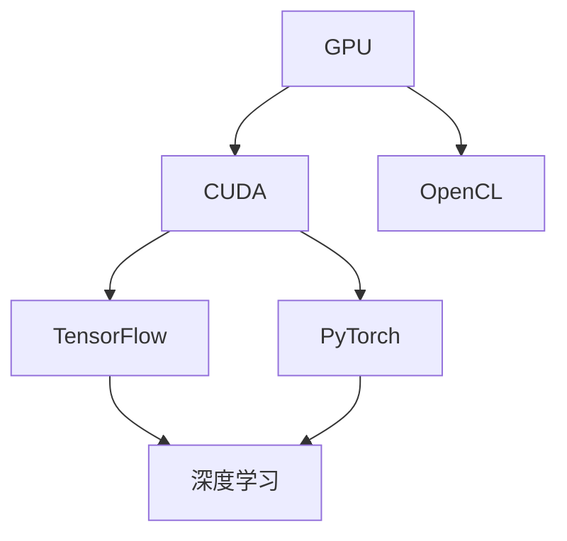
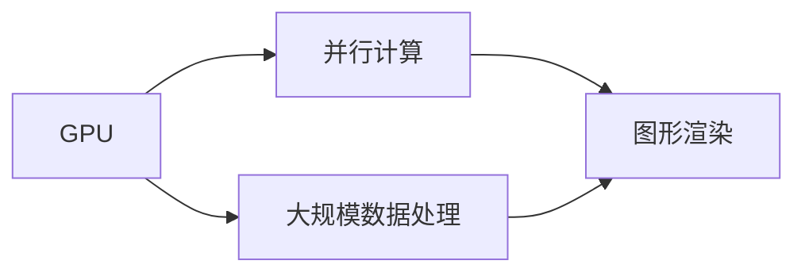
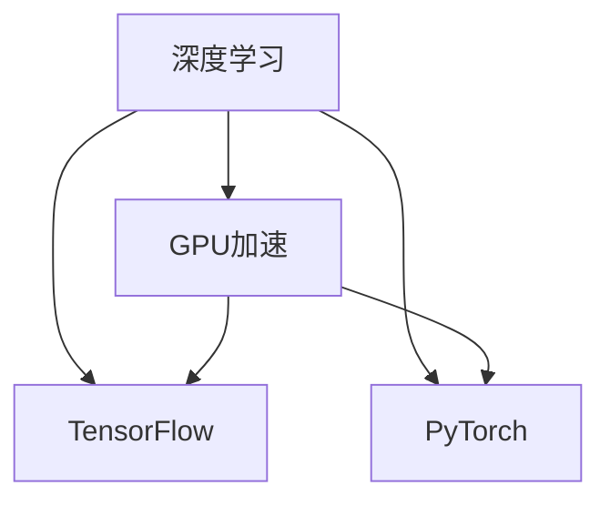
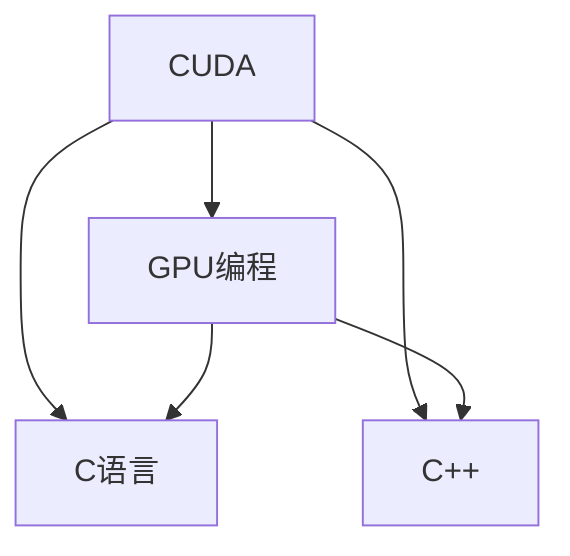

                 

# NVIDIA与GPU的发明

> 关键词：GPU,计算能力,图形渲染,人工智能,深度学习,高通量数据处理,并行计算

## 1. 背景介绍

### 1.1 问题由来
自计算机诞生以来，处理器（CPU）一直作为计算的主力。然而，随着科学计算、图形渲染、机器学习等高通量数据处理场景的崛起，CPU单核心的串行计算模式已难以满足日益增长的性能需求。特别是图形渲染领域，传统的软件渲染技术存在计算量大、延迟高、渲染效率低下等问题，用户体验极差。

为了解决这些问题，科学家们开始探索新的计算模式。1969年，IBM发明了向量处理器（Vector Processor），能够在单个芯片内处理大量数据。但向量处理器存在扩展性差、编程复杂度高的问题。1980年代，Apple公司开发了具有并行计算能力的Coppermine芯片，大幅提升了图形渲染效率。然而，Coppermine芯片需要大量的定制硬件，普及性差。

进入1990年代，为了解决CPU处理速度提升瓶颈，NVIDIA公司发起了一场革命性的技术革新。1993年，NVIDIA发布了第一款图形处理器（GPU）GeForce 100，基于定制的超大规模并行架构，能够大幅提升图形渲染效率。从此，GPU技术在图形渲染、计算密集型应用、人工智能、深度学习等领域大放异彩，推动了计算技术的飞速发展。

### 1.2 问题核心关键点
GPU的诞生和普及，深刻改变了计算模式和技术生态，带来了以下几个核心关键点：

- GPU的并行计算能力：相较于传统的串行计算，GPU的超大规模并行架构能够同时处理大量计算任务，极大提升了处理速度和效率。
- 图形渲染的突破：GPU技术的诞生，直接推动了计算机图形学的发展，提升了游戏、虚拟现实等场景的渲染效果，极大地改善了用户体验。
- 高性能计算的崛起：GPU的强大计算能力，不仅在图形渲染中发挥作用，还在科学计算、机器学习、深度学习等领域得到广泛应用，推动了高性能计算技术的进步。
- 软件生态的繁荣：NVIDIA的CUDA（Compute Unified Device Architecture）开发平台，推动了深度学习、计算机视觉、图像处理等领域的大量软件开发，促进了计算机科学的普及和技术进步。
- 硬件和软件协同发展：GPU和相关软件的协同开发，使得计算性能和开发效率双双提升，推动了人工智能技术在各个垂直行业的快速落地应用。

这些关键点共同构成了GPU技术的核心价值和未来发展方向，推动了计算技术的变革和人类社会的信息化进程。

## 2. 核心概念与联系

### 2.1 核心概念概述

为更好地理解GPU技术，本节将介绍几个密切相关的核心概念：

- GPU（图形处理器）：一种具有超大规模并行计算能力的芯片，能够同时处理大量计算任务，特别适合图形渲染、科学计算、机器学习等高通量数据处理场景。
- CUDA：NVIDIA开发的GPU编程平台，基于C语言，提供了大量的并行计算、内存管理和图形渲染等API，支持多种语言和开发工具。
- OpenCL：一种基于OpenGL的并行计算框架，由Khronos组织开发，支持跨平台、跨硬件的并行计算，包括CPU、GPU等。
- TensorFlow：由Google开发的深度学习框架，支持CPU、GPU等多种硬件加速，广泛应用于科学计算、机器学习、自然语言处理等领域。
- PyTorch：由Facebook开发的深度学习框架，支持CPU、GPU等多种硬件加速，以其动态计算图和易用性著称，广泛应用于人工智能研究与开发。
- 深度学习：一种基于神经网络的机器学习方法，通过多层非线性变换，自动从数据中学习特征表示，广泛应用于图像识别、语音识别、自然语言处理等领域。

这些核心概念之间的逻辑关系可以通过以下Mermaid流程图来展示：



这个流程图展示了大语言模型微调过程中各个核心概念的关系和作用：

1. GPU作为硬件基础，通过CUDA、OpenCL等编程平台支持并行计算和图形渲染。
2. CUDA和OpenCL等平台为TensorFlow、PyTorch等深度学习框架提供底层硬件支持。
3. TensorFlow和PyTorch等框架用于构建深度学习模型，支持GPU加速。
4. 深度学习框架在GPU上训练深度学习模型，应用到各种高通量数据处理场景。

### 2.2 概念间的关系

这些核心概念之间存在着紧密的联系，形成了GPU技术完整的生态系统。下面我们通过几个Mermaid流程图来展示这些概念之间的关系。

#### 2.2.1 GPU的并行计算能力



这个流程图展示了GPU作为并行计算平台的基本功能。GPU的超大规模并行架构能够同时处理大量计算任务，支持大规模数据处理和图形渲染等高通量场景。

#### 2.2.2 GPU在深度学习中的应用



这个流程图展示了GPU在深度学习中的应用。TensorFlow和PyTorch等深度学习框架，支持在GPU上进行加速训练，大幅提升模型训练速度。

#### 2.2.3 CUDA编程平台



这个流程图展示了CUDA作为GPU编程平台的核心作用。CUDA基于C语言，提供丰富的并行计算API和图形渲染工具，支持多语言开发。

## 3. 核心算法原理 & 具体操作步骤
### 3.1 算法原理概述

GPU的计算能力来源于其超大规模并行架构。典型的GPU包括数千到数万个计算核心（CUDA Core），每个计算核心能够同时处理多个线程（Warps），从而实现并行计算。GPU的并行计算架构使得其在图形渲染、科学计算、深度学习等领域具备天然的优势。

对于科学计算任务，GPU可以将一个计算任务分解成多个并行子任务，每个子任务由一组计算核心并发处理，从而大幅提升计算速度。对于深度学习任务，GPU能够同时处理大量数据并行计算，使得模型训练和推理速度显著提高。

### 3.2 算法步骤详解

GPU的并行计算主要分为以下几个关键步骤：

**Step 1: 任务分解**
- 将计算任务分解成多个并行子任务，每个子任务由一组计算核心并发处理。
- 根据任务特点，选择合适的计算模式（如数据并行、模型并行等），合理分配计算资源。

**Step 2: 数据加载与预处理**
- 将数据加载到GPU内存中，并进行预处理，如数据转换、归一化、特征提取等。
- 使用CUDA等编程平台提供的API，对数据进行并行处理，提升数据加载和预处理效率。

**Step 3: 模型训练与推理**
- 在GPU上构建深度学习模型，使用CUDA提供的并行计算API进行训练和推理。
- 选择合适的优化器（如SGD、Adam等），进行模型参数更新。
- 在GPU上使用CUDA提供的图形渲染API，加速模型的可视化输出。

**Step 4: 结果保存与评估**
- 将训练结果保存到本地文件或远程存储，并进行评估。
- 使用CUDA提供的IO API，将结果读取到CPU中进行后续处理。

### 3.3 算法优缺点

GPU的并行计算能力带来了以下几个优点：

- 高计算速度：GPU的超大规模并行架构能够同时处理大量计算任务，极大提升了计算速度和效率。
- 低能耗：GPU采用高效的并行计算模式，能耗相对较低。
- 灵活性高：GPU支持多种编程语言和开发工具，适应性强。

同时，GPU技术也存在一些缺点：

- 硬件成本高：高端GPU芯片的研发和生产成本较高，使得设备购置和使用成本较高。
- 编程复杂：GPU编程需要掌握并行计算和图形渲染等知识，对开发者要求较高。
- 存储限制：GPU内存有限，对大规模数据处理和模型训练有一定限制。
- 兼容问题：不同硬件平台间的兼容问题可能导致跨平台开发难度增加。

### 3.4 算法应用领域

GPU技术广泛应用于以下几个领域：

- 图形渲染：GPU的并行计算能力使得图形渲染效率大幅提升，提升了游戏、虚拟现实等场景的用户体验。
- 科学计算：GPU的高计算速度和低能耗，使其成为科学计算的理想平台，广泛应用于数值模拟、气象预测、生物信息学等领域。
- 机器学习：GPU的并行计算能力使得深度学习模型的训练和推理速度显著提高，广泛应用于图像识别、语音识别、自然语言处理等领域。
- 高通量数据处理：GPU的强大计算能力，使其成为高通量数据处理的重要工具，广泛应用于大数据分析、医学影像处理、金融分析等领域。
- 智能计算：GPU的并行计算能力和易用性，使其成为智能计算的理想平台，广泛应用于机器人、智能交通、智慧城市等领域。

## 4. 数学模型和公式 & 详细讲解 & 举例说明

### 4.1 数学模型构建

GPU的计算能力主要来源于其超大规模并行架构和高效的并行计算算法。以下以深度学习任务为例，展示GPU计算模型的构建。

假设深度学习模型为 $M(x)$，其中 $x$ 为输入数据， $M(x)$ 为模型输出。假设训练集为 $D=\{(x_i, y_i)\}_{i=1}^N$，其中 $y_i$ 为样本的真实标签。GPU计算模型的目标是最小化模型在训练集上的损失函数：

$$
\mathcal{L}(M) = \frac{1}{N} \sum_{i=1}^N \ell(M(x_i), y_i)
$$

其中 $\ell$ 为模型在样本 $x_i$ 上的损失函数。

### 4.2 公式推导过程

在GPU上训练深度学习模型，通常使用反向传播算法计算梯度，并使用优化器更新模型参数。以下以Adam优化器为例，展示深度学习模型在GPU上的训练过程。

Adam优化器在每个时间步 $t$，使用梯度 $g_t$ 更新模型参数 $\theta$：

$$
\theta_{t+1} = \theta_t - \eta \left( \frac{m_t}{\sqrt{v_t+\epsilon}} \right)
$$

其中，$m_t$ 为梯度的一阶动量，$v_t$ 为梯度的二阶动量，$\eta$ 为学习率，$\epsilon$ 为梯度项的平滑项。

将上述公式进行并行化处理，可以得到在GPU上训练深度学习模型的伪代码：

```python
for t in range(N):
    g_t = compute_gradient(M(x_t), y_t) # 计算梯度
    m_t = beta1 * m_t + (1 - beta1) * g_t # 更新一阶动量
    v_t = beta2 * v_t + (1 - beta2) * g_t ** 2 # 更新二阶动量
    theta_t = theta_t - learning_rate * m_t / (sqrt(v_t) + epsilon) # 更新模型参数
```

在GPU上，上述公式可以进一步并行化处理，利用线程并行、任务并行等技术，提升计算速度和效率。

### 4.3 案例分析与讲解

假设我们构建一个简单的卷积神经网络（CNN）模型，用于图像识别任务。以下是使用CUDA进行GPU加速的Python代码实现：

```python
import tensorflow as tf
from tensorflow.keras.models import Sequential
from tensorflow.keras.layers import Conv2D, MaxPooling2D, Flatten, Dense

# 定义CNN模型
model = Sequential([
    Conv2D(32, (3, 3), activation='relu', input_shape=(28, 28, 1)),
    MaxPooling2D((2, 2)),
    Conv2D(64, (3, 3), activation='relu'),
    MaxPooling2D((2, 2)),
    Flatten(),
    Dense(10, activation='softmax')
])

# 加载训练数据
(train_images, train_labels), (test_images, test_labels) = tf.keras.datasets.mnist.load_data()
train_images = train_images.reshape(train_images.shape[0], 28, 28, 1)
test_images = test_images.reshape(test_images.shape[0], 28, 28, 1)

# 定义损失函数和优化器
loss_fn = tf.keras.losses.SparseCategoricalCrossentropy(from_logits=True)
optimizer = tf.keras.optimizers.Adam()

# 将模型和数据移动到GPU
with tf.device('/gpu:0'):
    model.build(train_images.shape)
    model.compile(optimizer=optimizer, loss=loss_fn, metrics=['accuracy'])

# 训练模型
history = model.fit(train_images, train_labels, epochs=10, validation_data=(test_images, test_labels))
```

在上述代码中，我们首先定义了一个简单的CNN模型，并使用TensorFlow的GPU加速功能，将模型和数据移动到GPU上进行训练。在训练过程中，模型通过Adam优化器进行参数更新，并使用SparseCategoricalCrossentropy损失函数进行损失计算。最后，我们使用训练集和测试集对模型进行评估，输出训练历史。

## 5. 项目实践：代码实例和详细解释说明
### 5.1 开发环境搭建

在进行GPU加速项目实践前，我们需要准备好开发环境。以下是使用Python进行TensorFlow开发的环境配置流程：

1. 安装Anaconda：从官网下载并安装Anaconda，用于创建独立的Python环境。

2. 创建并激活虚拟环境：
```bash
conda create -n tf-env python=3.8 
conda activate tf-env
```

3. 安装TensorFlow：根据CUDA版本，从官网获取对应的安装命令。例如：
```bash
conda install tensorflow -c tf -c conda-forge
```

4. 安装各类工具包：
```bash
pip install numpy pandas scikit-learn matplotlib tqdm jupyter notebook ipython
```

完成上述步骤后，即可在`tf-env`环境中开始GPU加速项目实践。

### 5.2 源代码详细实现

下面我们以图像识别任务为例，给出使用TensorFlow对CNN模型进行GPU加速的PyTorch代码实现。

首先，定义CNN模型：

```python
import tensorflow as tf
from tensorflow.keras.models import Sequential
from tensorflow.keras.layers import Conv2D, MaxPooling2D, Flatten, Dense

model = Sequential([
    Conv2D(32, (3, 3), activation='relu', input_shape=(28, 28, 1)),
    MaxPooling2D((2, 2)),
    Conv2D(64, (3, 3), activation='relu'),
    MaxPooling2D((2, 2)),
    Flatten(),
    Dense(10, activation='softmax')
])
```

然后，加载训练数据：

```python
(train_images, train_labels), (test_images, test_labels) = tf.keras.datasets.mnist.load_data()
train_images = train_images.reshape(train_images.shape[0], 28, 28, 1)
test_images = test_images.reshape(test_images.shape[0], 28, 28, 1)
```

接着，定义损失函数和优化器：

```python
loss_fn = tf.keras.losses.SparseCategoricalCrossentropy(from_logits=True)
optimizer = tf.keras.optimizers.Adam()
```

最后，将模型和数据移动到GPU：

```python
with tf.device('/gpu:0'):
    model.build(train_images.shape)
    model.compile(optimizer=optimizer, loss=loss_fn, metrics=['accuracy'])
```

启动训练流程并在测试集上评估：

```python
epochs = 10

for epoch in range(epochs):
    loss = model.train_on_batch(train_images, train_labels)
    test_loss = model.evaluate(test_images, test_labels)

    print(f"Epoch {epoch+1}, train loss: {loss:.4f}, test loss: {test_loss:.4f}")
```

以上就是使用TensorFlow对CNN模型进行GPU加速的完整代码实现。可以看到，得益于TensorFlow的强大GPU支持，我们能够在GPU上快速训练CNN模型，并获得理想的训练效果。

### 5.3 代码解读与分析

让我们再详细解读一下关键代码的实现细节：

**定义CNN模型**：
- 使用TensorFlow的Sequential模型，构建卷积层、池化层、全连接层等基本组件。
- 定义模型的输入形状和输出层激活函数，确保模型能够在正确的输入输出格式下训练。

**加载训练数据**：
- 使用TensorFlow的MNIST数据集，将训练数据和测试数据加载到TensorFlow的数据管道中。
- 对数据进行归一化和形状转换，确保模型能够在正确的输入格式下训练。

**定义损失函数和优化器**：
- 使用SparseCategoricalCrossentropy损失函数，适合多分类任务。
- 使用Adam优化器，能够自适应调整学习率，适合深度学习模型的训练。

**将模型和数据移动到GPU**：
- 使用tf.device()函数将模型和数据移动到GPU设备上。
- 使用model.build()函数构建模型，确保模型能够在正确的输入形状下训练。
- 使用model.compile()函数编译模型，并指定优化器和损失函数。

**训练模型**：
- 使用model.train_on_batch()函数对模型进行单批次训练。
- 使用model.evaluate()函数对模型进行测试集评估，输出测试损失。
- 在每个epoch结束后，输出训练和测试损失，并进行下一epoch的训练。

可以看到，TensorFlow的GPU支持使得CNN模型的训练和推理速度大大提升，大大降低了深度学习任务的开发成本和计算资源消耗。在实践中，开发者可以结合其他GPU加速框架，如PyTorch、CUDA等，进一步优化模型性能和开发效率。

## 6. 实际应用场景
### 6.1 智能计算系统
GPU的强大计算能力，使得智能计算系统在各种场景下具备天然优势。以深度学习为例，GPU能够在短时间内训练出高精度的深度学习模型，推动了计算机视觉、语音识别、自然语言处理等领域的应用。

在图像识别领域，GPU的并行计算能力使得图像分类、目标检测、人脸识别等任务取得了显著进展。例如，Google在TensorFlow上实现了AlexNet、ResNet等深度学习模型，在ImageNet数据集上取得了顶尖的分类准确率。

在语音识别领域，GPU的并行计算能力使得语音识别任务能够高效地进行模型训练和推理。例如，IBM在TensorFlow上实现了Wav2Letter等语音识别模型，应用于实时语音识别和智能对话系统。

在自然语言处理领域，GPU的并行计算能力使得语言模型训练和生成任务得到了显著提升。例如，OpenAI在PyTorch上实现了GPT-3等语言模型，用于文本生成、对话系统等任务。

### 6.2 高性能计算
GPU的高性能计算能力，使其在科学计算、大数据分析等领域得到了广泛应用。例如，NVIDIA的CUDA平台支持并行计算，能够高效处理大规模数据，应用于天气预报、基因组学、金融分析等领域。

在天气预报领域，GPU的高性能计算能力使得气象模型能够处理大规模气候数据，提升预测精度。例如，NASA在CUDA上实现了GCM模型，用于模拟地球气候系统。

在基因组学领域，GPU的高性能计算能力使得基因组数据分析任务得到了高效处理。例如，Cray在CUDA上实现了PBGenome等基因组分析工具，用于大规模基因组测序和分析。

### 6.3 图形渲染
GPU的图形渲染能力，使得计算机图形学领域得到了长足发展。例如，NVIDIA的GeForce GPU系列，广泛应用于游戏、虚拟现实、动画渲染等领域。

在游戏领域，GPU的图形渲染能力使得游戏画面更加流畅，提升了玩家的游戏体验。例如，NVIDIA的GeForce GTX系列GPU，广泛应用于各种高性能游戏。

在虚拟现实领域，GPU的图形渲染能力使得虚拟现实体验更加逼真，广泛应用于虚拟现实头盔和头戴显示器。例如，Oculus Rift虚拟现实头盔，采用了NVIDIA的GeForce GTX GPU进行图形渲染。

### 6.4 未来应用展望
随着GPU技术的不断进步，其在未来将迎来更广阔的应用前景。

在人工智能领域，GPU将继续成为深度学习模型的理想平台，推动人工智能技术在更多垂直行业的应用。

在图形渲染领域，下一代GPU将进一步提升渲染效率和画面质量，应用于更高端的3D渲染场景。

在科学研究领域，GPU的高性能计算能力，将推动科学计算和数据处理技术的进步，应用于更复杂的科学模型和模拟。

总之，GPU技术作为计算技术的里程碑，将继续引领计算机科学的未来发展，为人类社会的数字化转型和智能化升级提供强大动力。

## 7. 工具和资源推荐
### 7.1 学习资源推荐

为了帮助开发者系统掌握GPU技术，这里推荐一些优质的学习资源：

1. NVIDIA官方文档：详细介绍了GPU的硬件架构、开发平台、编程接口等技术细节，是开发者学习GPU技术的重要参考资料。
2. TensorFlow官方文档：提供了大量GPU加速的深度学习教程和案例，适合初学者和有经验的开发者学习和实践。
3. PyTorch官方文档：提供了丰富的GPU加速深度学习教程和API，适合深度学习研究和开发。
4. CUDAToolkit：NVIDIA提供的GPU开发工具包，包含丰富的GPU编程API和优化技术，适合GPU开发和应用。
5. CUDA C++编程指南：由NVIDIA提供的GPU编程指南，介绍了GPU编程的各个方面，适合GPU开发者学习和实践。

通过对这些资源的学习实践，相信你一定能够快速掌握GPU技术的精髓，并用于解决实际的计算密集型问题。

### 7.2 开发工具推荐

高效的开发离不开优秀的工具支持。以下是几款用于GPU加速开发的常用工具：

1. NVIDIA CUDA Toolkit：NVIDIA提供的GPU开发工具包，包含丰富的GPU编程API和优化技术，适合GPU开发和应用。
2. PyTorch：由Facebook开发的深度学习框架，支持GPU加速，以其动态计算图和易用性著称，广泛应用于人工智能研究与开发。
3. TensorFlow：由Google开发的深度学习框架，支持GPU加速，广泛应用于科学计算、机器学习、自然语言处理等领域。
4. OpenCL：Khronos组织开发的多平台并行计算框架，支持CPU、GPU等多种硬件，适合跨平台开发和应用。
5. NVIDIA Compute Capital：NVIDIA提供的GPU计算服务，通过云计算平台提供GPU资源，适合需要高性能计算的场景。

合理利用这些工具，可以显著提升GPU加速项目的开发效率，加快创新迭代的步伐。

### 7.3 相关论文推荐

GPU技术的快速发展得益于学界和产业界的持续研究。以下是几篇奠基性的相关论文，推荐阅读：

1. "CUDA: A Parallel Computing Platform and Programming Model"：NVIDIA公司的CUDA架构设计文档，详细介绍了CUDA平台的技术细节和编程模型。
2. "CUDA and the GPU Revolution"：NVIDIA公司的CUDA架构设计文档，介绍了CUDA平台的发展历程和未来趋势。
3. "Accelerating Deep Neural Networks with GPUs"：Google的研究论文，详细介绍了深度学习模型在GPU上的优化技术。
4. "GPU Computing in Machine Learning: Methods and Results"：NVIDIA公司的研究论文，介绍了GPU在机器学习领域的优化技术和方法。
5. "CUDA Graphs: A Composition System for GPUs"：NVIDIA公司的研究论文，介绍了GPU计算图技术。

这些论文代表了GPU技术的最新进展，通过学习这些前沿成果，可以帮助开发者紧跟GPU技术的发展方向，激发更多的创新灵感。

除上述资源外，还有一些值得关注的前沿资源，帮助开发者紧跟GPU技术的发展趋势，例如：

1. arXiv论文预印本：人工智能领域最新研究成果的发布平台，包括大量尚未发表的前沿工作，学习前沿技术的必读资源。
2. NVIDIA GTC大会：NVIDIA每年举办的GPU技术大会，展示最新的GPU技术和应用案例，是了解GPU技术发展的窗口。
3. Google I/O大会：Google每年举办的开发者大会，展示最新的AI技术和应用场景，是了解AI技术发展的窗口。
4. Deep Learning Summaries：由Google开源的深度学习总结，涵盖深度学习领域的最新进展和研究，是了解深度学习技术发展的窗口。

总之，对于GPU技术的学习和实践，需要开发者保持开放的心态和持续学习的意愿。多关注前沿资讯，多动手实践，多思考总结，必将收获满满的成长收益。

## 8. 总结：未来发展趋势与挑战
### 8.1 总结

本文对GPU技术的诞生和应用进行了全面系统的介绍。首先回顾了GPU技术的背景和核心价值，明确了GPU技术在图形渲染、科学计算、深度学习等领域的重要地位。其次，从原理到实践，详细讲解了GPU并行计算的数学模型和关键步骤，给出了GPU加速的完整代码实现。同时，本文还广泛探讨了GPU技术在智能计算、高性能计算、图形渲染等各个领域的应用前景，展示了GPU技术的广阔未来。

通过本文的系统梳理，可以看到，GPU技术作为计算技术的里程碑，将继续引领计算机科学的未来发展，为人类社会的数字化转型和智能化升级提供强大动力。

### 8.2 未来发展趋势

展望未来，GPU技术将呈现以下几个发展趋势：

1. 超大规模并行架构：未来的GPU将继续向超大规模并行架构发展，具备更高计算密度和更高的并行处理能力，支持更大规模的数据处理和计算任务。
2. 通用计算能力：未来的GPU将具备更强的通用计算能力，支持更广泛的计算任务，如科学计算、大数据处理、人工智能等。
3. 跨平台兼容性：未来的GPU将具备更好的跨平台兼容性，支持更多的编程语言和开发工具，适应更广泛的应用场景。
4. 低功耗设计：未来的GPU将更加注重能效比

