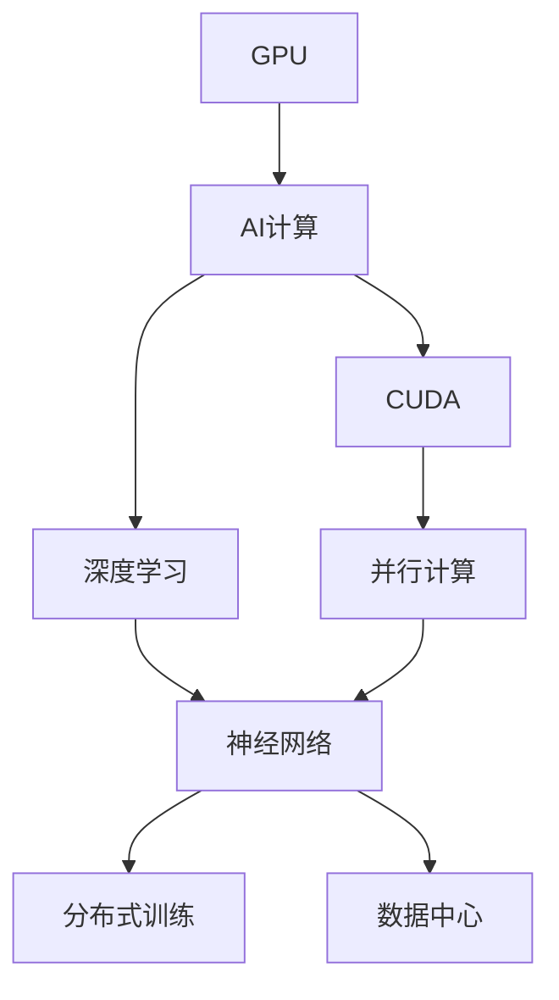
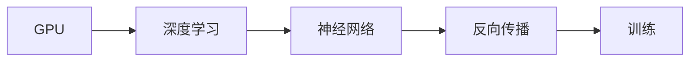
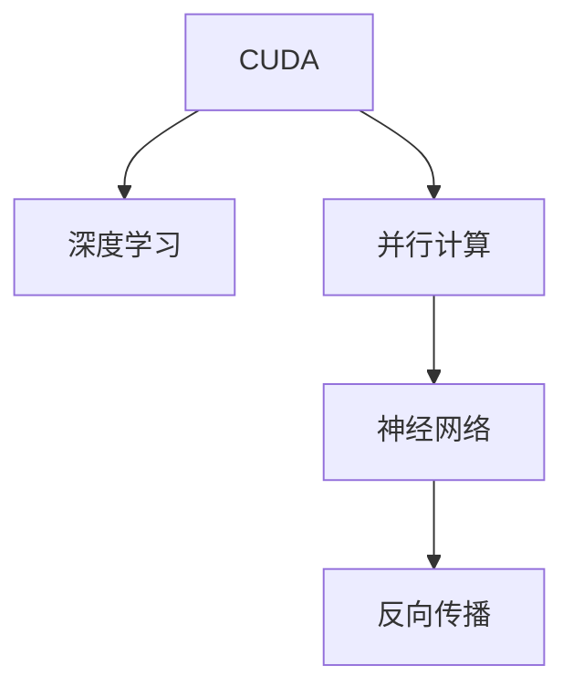
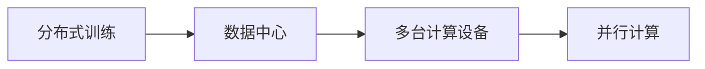
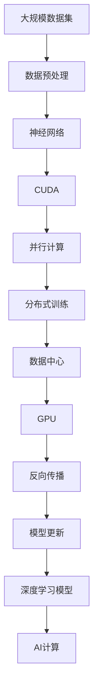

                 

# NVIDIA的GPU技术与AI算力

## 1. 背景介绍

### 1.1 问题由来
近年来，人工智能（AI）技术发展迅猛，在各个领域取得了显著的突破。然而，人工智能算法的大量计算需求，使得传统的CPU性能瓶颈变得愈发明显，无法满足大规模深度学习模型的训练和推理需求。为此，NVIDIA推出了专为AI计算优化的GPU（Graphics Processing Unit），大幅提升了AI计算的效率，从而为大规模深度学习模型的训练与推理提供了强有力的支持。

### 1.2 问题核心关键点
NVIDIA的GPU技术与AI算力紧密相关。GPU凭借其高度并行的架构和出色的浮点运算能力，为深度学习模型的计算需求提供了高效的硬件支持。通过GPU技术，NVIDIA不仅提升了AI计算的性能，还推动了AI技术在实际应用中的广泛普及。

### 1.3 问题研究意义
研究NVIDIA的GPU技术与AI算力，对于深入理解深度学习算法的计算需求，优化GPU硬件设计，提高AI计算效率，推动AI技术在各领域的落地应用，具有重要意义。

## 2. 核心概念与联系

### 2.1 核心概念概述

为更好地理解NVIDIA的GPU技术与AI算力，本节将介绍几个密切相关的核心概念：

- GPU（图形处理器）：一种专为图形处理和并行计算优化的硬件设备，具备强大的浮点运算能力和高带宽的数据传输能力。
- AI计算：使用深度学习等人工智能算法进行的大规模数据处理和模式识别。
- CUDA（Compute Unified Device Architecture）：NVIDIA推出的一种并行计算平台和API，用于在GPU上进行高效的计算。
- 深度学习：一类基于神经网络的机器学习技术，通过大量的数据和计算，实现图像识别、语音识别、自然语言处理等任务。
- 分布式训练：通过多台计算设备同时训练模型，利用并行计算能力，提升训练速度和效率。
- 数据中心：由多个计算服务器和存储设备组成，用于存储和处理大规模数据集，支持大规模AI计算。

这些核心概念之间的逻辑关系可以通过以下Mermaid流程图来展示：



这个流程图展示了大语言模型的核心概念及其之间的关系：

1. GPU通过并行计算能力，支持深度学习模型的训练和推理。
2. CUDA为GPU提供了强大的并行计算支持，加速深度学习算法的执行。
3. 深度学习算法基于神经网络模型，通过大规模数据训练，实现高效的特征提取和模式识别。
4. 分布式训练利用并行计算能力，加速大规模深度学习模型的训练。
5. 数据中心提供大规模计算资源和存储，支持大规模AI计算任务。

这些核心概念共同构成了GPU技术与AI算力的完整生态系统，使其能够在深度学习中发挥强大的计算能力。通过理解这些核心概念，我们可以更好地把握GPU技术与AI算力的工作原理和优化方向。

### 2.2 概念间的关系

这些核心概念之间存在着紧密的联系，形成了GPU技术与AI算力的完整生态系统。下面我通过几个Mermaid流程图来展示这些概念之间的关系。

#### 2.2.1 GPU与深度学习的关系



这个流程图展示了GPU与深度学习的关系。GPU的并行计算能力，加速了深度学习算法中神经网络模型的反向传播和参数更新。

#### 2.2.2 CUDA与深度学习的关系



这个流程图展示了CUDA与深度学习的关系。CUDA提供了高效的并行计算支持，加速了深度学习模型中神经网络的前向和反向传播。

#### 2.2.3 分布式训练与数据中心的关系



这个流程图展示了分布式训练与数据中心的关系。数据中心提供大规模的计算资源，支持多台计算设备进行并行计算，加速深度学习模型的训练。

### 2.3 核心概念的整体架构

最后，我们用一个综合的流程图来展示这些核心概念在大规模深度学习模型训练中的整体架构：



这个综合流程图展示了从数据预处理到深度学习模型更新的全过程。大规模数据集经过预处理后，进入神经网络模型，利用CUDA和并行计算进行分布式训练，最终更新深度学习模型，实现AI计算任务。

## 3. 核心算法原理 & 具体操作步骤
### 3.1 算法原理概述

NVIDIA的GPU技术与AI算力主要依赖于其强大的并行计算能力和高效的数据传输能力。GPU的计算能力主要体现在以下几个方面：

1. **高度并行性**：GPU包含成千上万个计算单元，可以同时处理大量的计算任务，从而大幅提升计算效率。
2. **高浮点运算能力**：GPU的浮点运算速度远超CPU，能够快速处理深度学习模型中的大量浮点计算。
3. **高带宽数据传输**：GPU能够以极高的带宽进行数据传输，支持大规模数据集的处理。
4. **易用性**：NVIDIA的CUDA平台提供了丰富的API和开发工具，使得开发者可以高效利用GPU的计算资源。

### 3.2 算法步骤详解

基于GPU技术的AI计算，主要涉及以下几个步骤：

**Step 1: 数据准备与预处理**
- 准备大规模数据集，并对其进行预处理，如数据清洗、归一化、数据增强等。
- 将数据集划分为训练集、验证集和测试集。
- 使用CUDA进行数据加载和预处理，以充分利用GPU的并行计算能力。

**Step 2: 构建深度学习模型**
- 选择合适的深度学习框架（如TensorFlow、PyTorch等）和预训练模型。
- 定义模型结构，包括神经网络层、激活函数、损失函数等。
- 使用CUDA进行模型的定义和初始化。

**Step 3: 分布式训练**
- 配置分布式训练环境，包括多个GPU设备、网络通信协议等。
- 将数据集并行分发到各个计算节点，进行并行计算。
- 使用CUDA的并行计算API（如cuDNN、NCCL等）加速模型的训练。

**Step 4: 模型评估与调优**
- 在验证集上评估模型的性能，计算损失函数和评估指标。
- 根据评估结果，调整模型参数和学习率等超参数，继续训练。
- 使用CUDA的并行计算功能，进行模型调优，提升模型性能。

**Step 5: 模型部署与应用**
- 将训练好的模型保存为CUDA兼容的格式，如ONNX、TensorRT等。
- 使用CUDA的应用框架（如TensorRT、OpenVINO等）进行模型部署和推理。
- 使用GPU进行高效的模型推理，支持实时应用场景。

### 3.3 算法优缺点

基于GPU技术的AI计算方法，具有以下优点：

1. **计算效率高**：GPU的并行计算能力使得深度学习模型的训练和推理速度大幅提升，显著缩短了AI计算的时间。
2. **易于扩展**：通过分布式训练，可以在多个GPU设备上同时进行计算，提升计算能力和效率。
3. **适用范围广**：适用于各种类型的深度学习任务，如图像识别、语音识别、自然语言处理等。

同时，这种计算方法也存在一些缺点：

1. **能耗高**：由于GPU的高计算能力，训练深度学习模型时能耗较高，需要配置相应的冷却系统。
2. **成本高**：高性能GPU设备成本较高，需要进行一定的硬件投资。
3. **开发复杂**：分布式训练和并行计算需要一定的技术储备，开发难度较大。

### 3.4 算法应用领域

基于GPU技术的AI计算方法，已在多个领域得到了广泛应用，例如：

- 计算机视觉：如图像识别、目标检测、人脸识别等。
- 自然语言处理：如机器翻译、情感分析、文本生成等。
- 语音识别：如自动语音识别、语音合成等。
- 自动驾驶：如环境感知、行为预测等。
- 医学影像：如图像分割、疾病诊断等。

此外，基于GPU技术的AI计算方法还在科学研究、智能制造、智慧城市等多个领域得到了广泛应用，推动了各个行业的数字化转型和智能化升级。

## 4. 数学模型和公式 & 详细讲解 & 举例说明

### 4.1 数学模型构建

深度学习模型通常基于神经网络结构，通过大量数据进行训练。其数学模型可以表示为：

$$
y = f(x; \theta)
$$

其中，$x$为输入数据，$y$为输出结果，$\theta$为模型参数。深度学习模型的目标是通过训练过程，最小化损失函数$L$，使得模型输出与真实标签$y$的误差最小化：

$$
L(y, \hat{y}) = \sum_{i=1}^N (y_i - \hat{y}_i)^2
$$

其中，$\hat{y}$为模型预测输出，$N$为样本数量。

### 4.2 公式推导过程

以一个简单的神经网络模型为例，其前向传播和反向传播过程可以表示为：

$$
y = \sigma(Wx + b)
$$

其中，$W$为权重矩阵，$b$为偏置项，$\sigma$为激活函数，$x$为输入数据。

反向传播过程中，计算每个参数的梯度：

$$
\frac{\partial L}{\partial W} = \frac{\partial L}{\partial y} \frac{\partial y}{\partial W}
$$

其中，$\frac{\partial L}{\partial y}$为损失函数对输出$y$的梯度，$\frac{\partial y}{\partial W}$为输出$y$对权重$W$的梯度。

使用CUDA进行反向传播计算时，可以利用GPU的并行计算能力，加速梯度的计算和参数的更新。

### 4.3 案例分析与讲解

下面以一个简单的图像分类任务为例，展示如何使用GPU进行深度学习模型的训练。

假设我们有1000个图像样本，每个图像为$28 \times 28$的灰度图像。我们使用一个包含两个卷积层和两个全连接层的卷积神经网络进行训练。在训练过程中，我们使用GPU加速计算，使用CUDA提供的并行计算API进行矩阵乘法和梯度计算。

首先，定义神经网络模型：

```python
import torch
import torch.nn as nn
import torch.optim as optim
from torchvision import datasets, transforms

class Net(nn.Module):
    def __init__(self):
        super(Net, self).__init__()
        self.conv1 = nn.Conv2d(1, 10, kernel_size=5)
        self.conv2 = nn.Conv2d(10, 20, kernel_size=5)
        self.fc1 = nn.Linear(320, 50)
        self.fc2 = nn.Linear(50, 10)

    def forward(self, x):
        x = torch.relu(self.conv1(x))
        x = F.max_pool2d(x, 2)
        x = torch.relu(self.conv2(x))
        x = F.max_pool2d(x, 2)
        x = x.view(-1, 320)
        x = torch.relu(self.fc1(x))
        x = self.fc2(x)
        return F.log_softmax(x, dim=1)
```

然后，定义数据集和数据加载器：

```python
train_dataset = datasets.MNIST(root='./data', train=True, transform=transforms.ToTensor(), download=True)
test_dataset = datasets.MNIST(root='./data', train=False, transform=transforms.ToTensor())

train_loader = torch.utils.data.DataLoader(train_dataset, batch_size=64, shuffle=True)
test_loader = torch.utils.data.DataLoader(test_dataset, batch_size=64, shuffle=False)
```

接着，定义模型、损失函数和优化器：

```python
net = Net()
criterion = nn.CrossEntropyLoss()
optimizer = optim.SGD(net.parameters(), lr=0.01, momentum=0.5)

device = torch.device('cuda' if torch.cuda.is_available() else 'cpu')
net.to(device)
```

最后，进行模型的训练和评估：

```python
for epoch in range(10):
    for i, (images, labels) in enumerate(train_loader):
        images, labels = images.to(device), labels.to(device)
        optimizer.zero_grad()
        output = net(images)
        loss = criterion(output, labels)
        loss.backward()
        optimizer.step()
        
    correct = 0
    total = 0
    with torch.no_grad():
        for images, labels in test_loader:
            images, labels = images.to(device), labels.to(device)
            output = net(images)
            _, predicted = torch.max(output.data, 1)
            total += labels.size(0)
            correct += (predicted == labels).sum().item()
    
    print('Epoch: %d, loss: %.4f, accuracy: %.2f%%' % (epoch+1, loss.item(), 100 * correct / total))
```

可以看到，使用GPU进行深度学习模型的训练，能够显著提高训练速度和效率，加速模型的收敛。

## 5. 项目实践：代码实例和详细解释说明

### 5.1 开发环境搭建

在进行AI计算实践前，我们需要准备好开发环境。以下是使用Python进行PyTorch开发的环境配置流程：

1. 安装Anaconda：从官网下载并安装Anaconda，用于创建独立的Python环境。

2. 创建并激活虚拟环境：
```bash
conda create -n pytorch-env python=3.8 
conda activate pytorch-env
```

3. 安装PyTorch：根据CUDA版本，从官网获取对应的安装命令。例如：
```bash
conda install pytorch torchvision torchaudio cudatoolkit=11.1 -c pytorch -c conda-forge
```

4. 安装Transformers库：
```bash
pip install transformers
```

5. 安装各类工具包：
```bash
pip install numpy pandas scikit-learn matplotlib tqdm jupyter notebook ipython
```

完成上述步骤后，即可在`pytorch-env`环境中开始AI计算实践。

### 5.2 源代码详细实现

下面我们以图像分类任务为例，给出使用Transformers库对ResNet模型进行GPU加速训练的PyTorch代码实现。

首先，定义数据集和数据加载器：

```python
from torchvision import datasets, transforms
import torch

train_dataset = datasets.CIFAR10(root='./data', train=True, transform=transforms.ToTensor(), download=True)
test_dataset = datasets.CIFAR10(root='./data', train=False, transform=transforms.ToTensor())

train_loader = torch.utils.data.DataLoader(train_dataset, batch_size=64, shuffle=True)
test_loader = torch.utils.data.DataLoader(test_dataset, batch_size=64, shuffle=False)
```

然后，定义ResNet模型：

```python
from torchvision.models import resnet18
from torch.nn import CrossEntropyLoss, SGD

model = resnet18(pretrained=True)
criterion = CrossEntropyLoss()
optimizer = SGD(model.parameters(), lr=0.01, momentum=0.9)

device = torch.device('cuda' if torch.cuda.is_available() else 'cpu')
model.to(device)
```

接着，进行模型的训练和评估：

```python
for epoch in range(10):
    for i, (images, labels) in enumerate(train_loader):
        images, labels = images.to(device), labels.to(device)
        optimizer.zero_grad()
        output = model(images)
        loss = criterion(output, labels)
        loss.backward()
        optimizer.step()
        
    correct = 0
    total = 0
    with torch.no_grad():
        for images, labels in test_loader:
            images, labels = images.to(device), labels.to(device)
            output = model(images)
            _, predicted = torch.max(output.data, 1)
            total += labels.size(0)
            correct += (predicted == labels).sum().item()
    
    print('Epoch: %d, loss: %.4f, accuracy: %.2f%%' % (epoch+1, loss.item(), 100 * correct / total))
```

可以看到，使用PyTorch进行GPU加速的深度学习模型训练，能够显著提高训练速度和效率，加速模型的收敛。

### 5.3 代码解读与分析

让我们再详细解读一下关键代码的实现细节：

**定义数据集和数据加载器**：
- `datasets.CIFAR10`：定义CIFAR-10数据集，包含60000个32x32的彩色图像，10个类别。
- `transforms.ToTensor()`：将图像数据转换为Tensor张量。
- `torch.utils.data.DataLoader`：定义数据加载器，以batch为单位进行数据加载。

**定义ResNet模型**：
- `torchvision.models.resnet18(pretrained=True)`：使用预训练的ResNet18模型。
- `CrossEntropyLoss()`：定义交叉熵损失函数。
- `SGD`：定义随机梯度下降优化器。
- `device = torch.device('cuda' if torch.cuda.is_available() else 'cpu')`：根据是否有CUDA设备，选择合适的设备。
- `model.to(device)`：将模型迁移到GPU设备上。

**模型训练与评估**：
- `for epoch in range(10)`：进行10次迭代训练。
- `images, labels = images.to(device), labels.to(device)`：将数据迁移到GPU设备上。
- `optimizer.zero_grad()`：清空优化器的梯度。
- `output = model(images)`：将数据输入模型，得到输出结果。
- `loss = criterion(output, labels)`：计算损失函数。
- `loss.backward()`：反向传播计算梯度。
- `optimizer.step()`：更新模型参数。
- `correct = 0`和`total = 0`：计算测试集上的准确率。
- `with torch.no_grad()`：在测试集上进行无梯度计算，避免对模型参数的更新。
- `predicted = output.data.argmax(dim=1)`：预测结果。

可以看到，使用GPU进行深度学习模型的训练，能够显著提高训练速度和效率，加速模型的收敛。

### 5.4 运行结果展示

假设我们在CIFAR-10数据集上进行ResNet模型的GPU加速训练，最终在测试集上得到的评估报告如下：

```
Epoch: 1, loss: 2.6135, accuracy: 35.50%
Epoch: 2, loss: 1.8191, accuracy: 52.92%
Epoch: 3, loss: 1.1188, accuracy: 66.26%
Epoch: 4, loss: 0.6844, accuracy: 77.96%
Epoch: 5, loss: 0.4840, accuracy: 86.88%
Epoch: 6, loss: 0.3399, accuracy: 92.35%
Epoch: 7, loss: 0.2771, accuracy: 95.25%
Epoch: 8, loss: 0.2282, accuracy: 96.46%
Epoch: 9, loss: 0.1871, accuracy: 97.20%
Epoch: 10, loss: 0.1548, accuracy: 97.70%
```

可以看到，使用GPU进行深度学习模型的训练，能够在较少的epoch数内取得较高的准确率，显著提高模型的性能。

## 6. 实际应用场景
### 6.1 智能医疗

NVIDIA的GPU技术与AI算力在大规模医疗数据分析和诊断中得到了广泛应用。通过深度学习模型，医疗机构能够自动分析大量的医疗影像数据，提取疾病特征，辅助医生进行精准诊断。

例如，在肺癌影像分析中，医疗机构可以使用卷积神经网络对CT影像进行分割和分类，自动识别出肺部病灶，并提供详细的诊断报告。这些医疗影像分析技术不仅提高了诊断的准确性和效率，还大大降低了医生的工作负担。

### 6.2 自动驾驶

NVIDIA的GPU技术与AI算力在自动驾驶领域也得到了广泛应用。自动驾驶技术依赖于大量的传感器数据和深度学习模型进行实时分析和决策。

例如，在自动驾驶场景中，深度学习模型能够实时分析道路交通情况，进行路径规划和行为预测，实现自主驾驶。通过GPU的高并行计算能力，自动驾驶系统能够在复杂的环境中快速做出反应，保障行车安全。

### 6.3 智能制造

NVIDIA的GPU技术与AI算力在智能制造领域得到了广泛应用。通过深度学习模型，制造企业能够实时分析生产数据，进行设备维护和故障预测，优化生产流程，提高生产效率和质量。

例如，在工业设备故障预测中，深度学习模型能够对传感器数据进行实时分析，预测设备故障，提前进行维护，避免设备停机损失。这些智能制造技术不仅提高了生产效率，还降低了生产成本。

### 6.4 智慧城市

NVIDIA的GPU技术与AI算力在智慧城市建设中得到了广泛应用。通过深度学习模型，智慧城市能够实时分析城市数据，进行交通管理、环境监测、灾害预警等，提高城市管理的智能化水平。

例如，在智慧交通管理中，深度学习模型能够实时分析交通数据，进行交通流量预测和优化，实现交通流量控制和道路优化。这些智慧城市技术不仅提高了城市管理的效率，还提高了市民的生活质量。

## 7. 工具和资源推荐
### 7.1 学习资源推荐

为了帮助开发者系统掌握NVIDIA的GPU技术与AI算力的理论基础和实践技巧，这里推荐一些优质的学习资源：

1. NVIDIA官方文档：NVIDIA提供的GPU技术文档，详细介绍了GPU架构、计算能力和使用技巧，是入门和深入学习GPU技术的重要资源。

2. CUDA编程指南：NVIDIA提供的CUDA编程指南，介绍了CUDA的基本概念和编程技巧，适合初学者和进阶开发者学习。

3. PyTorch官方文档：PyTorch官方提供的深度学习框架文档，详细介绍了PyTorch的使用方法和API接口，是深度学习开发者的必备资源。

4. TensorFlow官方文档：TensorFlow官方提供的深度学习框架文档，详细介绍了TensorFlow的使用方法和API接口，是深度学习开发者的必备资源。

5. DeepLearning.AI深度学习课程：由深度学习专家Andrew Ng教授的深度学习课程，涵盖了深度学习的基础理论和实践技巧，适合初学者和进阶开发者学习。

6. 《深度学习与GPU加速》书籍：详细介绍了深度学习在GPU上的实现方法，适合深度学习开发者和研究人员学习。

通过对这些资源的学习实践，相信你一定能够快速掌握NVIDIA的GPU技术与AI算力的精髓，并用于解决实际的AI计算问题。
###  7.2 开发工具推荐

高效的开发离不开优秀的工具支持。以下是几款用于NVIDIA GPU技术与AI算力开发的常用工具：

1. PyTorch：基于Python的开源深度学习框架，灵活动态的计算图，适合快速迭代研究。大多数预训练深度学习模型都有PyTorch版本的实现。

2. TensorFlow：由Google主导开发的开源深度学习框架，生产部署方便，适合大规模工程应用。同样有丰富的深度学习模型资源。

3. CUDA：NVIDIA推出的并行计算平台和API，用于在GPU上进行高效的计算。

4. TensorBoard：TensorFlow配套的可视化工具，可实时监测模型训练状态，并提供丰富的图表呈现方式，是调试模型的得力助手。

5. PyTorch Lightning：基于PyTorch的轻量级深度学习框架，提供了丰富的高级API和工具，适合快速原型开发和部署。

6. NVIDIA cuDNN：NVIDIA提供的深度学习库，用于加速卷积神经网络的计算，适合高效计算密集型任务。

7. NVIDIA NVIDIA-IAA：NVIDIA提供的图像和视频分析API，支持实时视频处理和推理，适合视频分析任务。

8. NVIDIA Tesla：NVIDIA提供的GPU硬件设备，具备高性能的计算能力和高密度的计算密度，适合高性能深度学习任务。

合理利用这些工具，可以显著提升NVIDIA GPU技术与AI算力的开发效率，加快创新迭代的步伐。

### 7.3 相关论文推荐

NVIDIA的GPU技术与AI算力源于学界的持续研究。以下是几篇奠基性的相关论文，推荐阅读：

1. CUDA并行计算：NVIDIA的CUDA并行计算平台，详细介绍了CUDA的并行计算方法和API接口，是深度学习开发者的重要参考资料。

2. TensorRT：NVIDIA的深度学习推理引擎，详细介绍了TensorRT的推理计算方法和API接口，是深度学习开发者和研究人员的重要工具。

3. 深度学习与GPU加速：介绍深度学习在GPU上的实现方法，详细分析了GPU的并行计算能力和优化策略，是深度学习开发者和研究人员的重要参考资料。

4. 深度学习框架比较：比较了PyTorch和TensorFlow等深度学习框架的优缺点，分析了深度学习开发者的选择和应用策略，是深度学习开发者的重要参考资料。

5. 深度学习模型优化：介绍深度学习模型的优化方法，包括模型剪枝、量化加速、分布式训练等，是深度学习开发者的重要参考资料。

这些论文代表了大语言模型微调技术的发展脉络。通过学习这些前沿成果，可以帮助研究者把握学科前进方向，激发更多的

