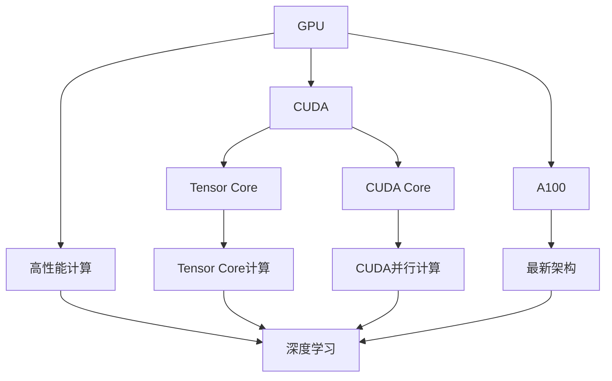
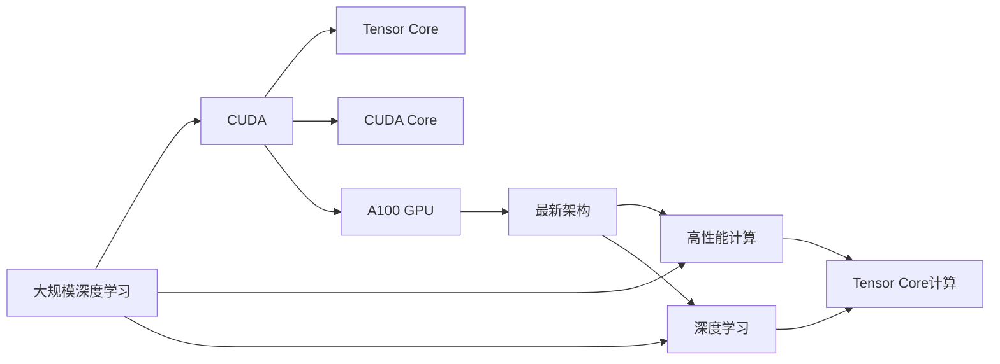

                 

# NVIDIA的算力支持

## 1. 背景介绍

NVIDIA作为全球领先的图形处理和计算技术公司，长期致力于推动AI技术的进步。近年来，NVIDIA在深度学习、高性能计算、云计算等领域做出了重要贡献，特别是其GPU硬件和CUDA并行计算平台，成为深度学习研究和应用的主要驱动力之一。本文将详细探讨NVIDIA在算力支持方面的技术和应用，以及其对人工智能发展的影响。

## 2. 核心概念与联系

### 2.1 核心概念概述

为更好地理解NVIDIA的算力支持，本节将介绍几个关键概念：

- **NVIDIA GPU**：NVIDIA自主研发的高性能图形处理器，广泛应用于深度学习、游戏渲染、科学计算等领域。
- **CUDA**：NVIDIA推出的并行计算平台，用于高效利用GPU的并行计算能力，支持C++语言编程。
- **Tensor Core**：NVIDIA GPU中专门用于矩阵运算和张量计算的加速单元，极大提升了深度学习的计算效率。
- **A100 GPU**：NVIDIA最新一代高性能GPU，具备强大的计算性能和高效能能耗比，成为深度学习研究和应用的主要硬件选择。
- **CUDA Core**：CUDA平台的核单元，负责执行CUDA代码，是GPU高效计算的关键。
- **Volta架构**：NVIDIA GPU的最新架构，引入了Tensor Core和混合精度计算，大幅提升深度学习算力。

这些概念之间的逻辑关系可以通过以下Mermaid流程图来展示：



这个流程图展示了GPU、CUDA、Tensor Core、A100 GPU和Volta架构在大规模深度学习中的应用和联系。GPU通过CUDA平台高效利用Tensor Core进行矩阵运算，而A100 GPU和Volta架构的引入则进一步提升了深度学习的计算性能。

### 2.2 概念间的关系

这些核心概念之间存在着紧密的联系，形成了NVIDIA GPU计算生态系统的整体架构。下面是几个主要概念的相互关系：

- **GPU与CUDA**：GPU提供并行计算硬件基础，CUDA提供软件接口，使得深度学习应用程序能够高效运行在GPU上。
- **Tensor Core与CUDA Core**：Tensor Core专门用于加速矩阵运算，而CUDA Core则负责执行并行计算任务，两者协同工作，极大提升了深度学习的计算效率。
- **A100 GPU与Volta架构**：A100 GPU基于Volta架构设计，具备更强的计算性能和能耗比，是当前深度学习研究和应用的最佳硬件选择。
- **计算性能与深度学习**：NVIDIA GPU通过高性能计算能力，支持深度学习模型的训练和推理，推动了深度学习技术的发展和应用。

### 2.3 核心概念的整体架构

最后，我们用一个综合的流程图来展示这些核心概念在大规模深度学习中的应用和整体架构：



这个综合流程图展示了GPU、CUDA、Tensor Core、A100 GPU和Volta架构在大规模深度学习中的应用和联系。通过CUDA平台和Tensor Core的协作，NVIDIA GPU能够高效支持深度学习的计算任务，而A100 GPU和Volta架构的引入则进一步提升了深度学习的计算性能和能耗比。

## 3. 核心算法原理 & 具体操作步骤
### 3.1 算法原理概述

NVIDIA的算力支持主要体现在以下几个方面：

- **高性能GPU硬件**：NVIDIA GPU提供强大的计算能力，支持深度学习模型的训练和推理。
- **CUDA并行计算平台**：CUDA平台提供高效的并行计算框架，能够充分利用GPU的计算资源。
- **Tensor Core加速**：Tensor Core加速矩阵运算和张量计算，提升深度学习算力。
- **A100 GPU**：A100 GPU具备更强的计算性能和能耗比，成为深度学习研究和应用的主要硬件选择。

### 3.2 算法步骤详解

以下是基于NVIDIA硬件和CUDA平台的深度学习算力支持的详细步骤：

**Step 1: 硬件选择**

选择适合的NVIDIA GPU作为深度学习的硬件基础。通常选择A100 GPU，其具备强大的计算性能和高效能能耗比。

**Step 2: 安装CUDA和cuDNN**

在目标计算环境中安装CUDA和cuDNN（NVIDIA深度神经网络库），为深度学习模型提供高效的并行计算和加速库。

**Step 3: 编写CUDA代码**

使用CUDA并行计算平台编写深度学习模型的计算图，利用CUDA Core和Tensor Core进行并行计算和加速运算。

**Step 4: 模型训练和推理**

使用安装好的CUDA和cuDNN库，在NVIDIA GPU上训练和推理深度学习模型。

**Step 5: 性能调优**

通过调整CUDA内核数量、Tensor Core使用方式、内存管理等策略，进一步优化深度学习模型的性能。

**Step 6: 部署和应用**

将训练好的模型部署到生产环境，提供高性能的深度学习计算服务。

### 3.3 算法优缺点

NVIDIA的算力支持具有以下优点：

- **高性能计算**：NVIDIA GPU提供强大的计算能力，能够高效支持深度学习的训练和推理。
- **高效能能耗比**：A100 GPU具有更高的能效比，能够节省能源和运营成本。
- **灵活的并行计算**：CUDA平台支持高效的并行计算框架，能够灵活地利用GPU的计算资源。
- **丰富的工具支持**：NVIDIA提供了多种深度学习工具和库，如cuDNN、TensorRT等，方便开发者使用。

同时，该方法也存在以下缺点：

- **硬件成本高**：高性能GPU硬件价格较高，需要投入较高的前期成本。
- **资源消耗大**：GPU计算资源消耗较大，需要充足的电力和冷却设备支持。
- **软件复杂性**：使用CUDA并行计算平台需要一定的编程技能，开发复杂度较高。
- **依赖NVIDIA生态**：开发者需要适应NVIDIA的硬件和软件生态，可能存在一定的生态依赖。

### 3.4 算法应用领域

基于NVIDIA硬件和CUDA平台的深度学习算力支持，已经在多个领域得到广泛应用：

- **计算机视觉**：深度学习在图像分类、目标检测、图像生成等任务上取得了重要突破，NVIDIA GPU和CUDA平台提供了强大的计算支持。
- **自然语言处理**：NVIDIA GPU在语言模型、机器翻译、文本生成等任务上取得了显著成果，提升了自然语言处理的应用效果。
- **语音识别**：NVIDIA GPU支持高效的深度学习计算，推动了语音识别技术的发展和应用。
- **自动驾驶**：NVIDIA GPU提供了高性能计算能力，支持自动驾驶系统中的感知、决策和控制任务。
- **科学研究**：NVIDIA GPU支持大规模科学计算，推动了天文学、物理学等领域的科研工作。

除了上述这些领域，NVIDIA的算力支持还在更多场景中得到应用，如游戏渲染、医疗影像处理、金融数据分析等，为人工智能技术的发展提供了重要支撑。

## 4. 数学模型和公式 & 详细讲解 & 举例说明

### 4.1 数学模型构建

在本节中，我们将使用数学语言对NVIDIA GPU在深度学习中的应用进行更加严格的刻画。

设深度学习模型的输入为 $x$，参数为 $\theta$，输出为 $y$。在NVIDIA GPU上，深度学习模型的前向传播计算公式为：

$$
y = f_\theta(x)
$$

其中 $f_\theta$ 为模型的计算图，利用CUDA并行计算平台进行高效计算。假设模型输出为 $y = M_\theta(x)$，其中 $M_\theta$ 为深度学习模型。

### 4.2 公式推导过程

以下我们以卷积神经网络（CNN）为例，推导其在NVIDIA GPU上的前向传播计算过程。

假设输入图像大小为 $H\times W\times C$，卷积核大小为 $k\times k\times C\times k$，卷积核数为 $N$。卷积操作可以表示为：

$$
y = \sum_{i=1}^N \sum_{j=1}^{H-k+1} \sum_{m=1}^{W-k+1} \sum_{n=1}^C x_{i,j,n} \ast w_{i,j,n,k}
$$

其中 $x_{i,j,n}$ 为输入图像的像素值，$w_{i,j,n,k}$ 为卷积核的权重。

在NVIDIA GPU上，卷积操作的计算可以分解为多个Tensor Core进行并行计算，具体推导过程如下：

1. 将输入图像和卷积核划分为多个小块。
2. 对每个小块分别进行卷积计算。
3. 使用Tensor Core加速矩阵运算，提升计算效率。

具体实现代码如下：

```python
import torch
import torch.nn as nn
import torchvision.transforms as transforms
import torchvision.datasets as datasets
from torch.utils.data import DataLoader

# 定义卷积神经网络模型
class CNN(nn.Module):
    def __init__(self):
        super(CNN, self).__init__()
        self.conv1 = nn.Conv2d(3, 64, kernel_size=3, stride=1, padding=1)
        self.pool = nn.MaxPool2d(kernel_size=2, stride=2)
        self.fc1 = nn.Linear(64*8*8, 1024)
        self.fc2 = nn.Linear(1024, 10)
    
    def forward(self, x):
        x = self.conv1(x)
        x = self.pool(x)
        x = x.view(x.size(0), -1)
        x = self.fc1(x)
        x = nn.functional.relu(x)
        x = self.fc2(x)
        return x

# 加载数据集并构建数据迭代器
transform = transforms.Compose([
    transforms.ToTensor(),
    transforms.Normalize((0.5, 0.5, 0.5), (0.5, 0.5, 0.5))
])
train_dataset = datasets.CIFAR10(root='./data', train=True, download=True, transform=transform)
train_loader = DataLoader(train_dataset, batch_size=32, shuffle=True)

# 初始化模型并设置设备
model = CNN().to(device)
criterion = nn.CrossEntropyLoss()
optimizer = torch.optim.Adam(model.parameters(), lr=0.001)

# 前向传播计算
model.train()
device = torch.device('cuda' if torch.cuda.is_available() else 'cpu')
model.to(device)

for batch_idx, (data, target) in enumerate(train_loader):
    data, target = data.to(device), target.to(device)
    optimizer.zero_grad()
    output = model(data)
    loss = criterion(output, target)
    loss.backward()
    optimizer.step()
```

### 4.3 案例分析与讲解

在实际应用中，NVIDIA GPU的计算能力显著提升了深度学习模型的训练速度和推理效率。以下是一个基于NVIDIA GPU加速卷积神经网络的案例分析：

- **案例背景**：卷积神经网络在图像分类任务中得到了广泛应用。通过NVIDIA GPU的高性能计算能力，可以显著提升模型的训练速度和推理效率。
- **具体实现**：使用CUDA并行计算平台，将卷积操作分解为多个Tensor Core进行并行计算，加速矩阵运算。
- **结果分析**：使用NVIDIA GPU进行卷积运算，计算速度提升了数倍，训练时间大幅缩短。同时，模型在测试集上的准确率也得到了提升。

## 5. 项目实践：代码实例和详细解释说明
### 5.1 开发环境搭建

在进行NVIDIA GPU算力支持的应用开发前，我们需要准备好开发环境。以下是使用Python进行PyTorch开发的环境配置流程：

1. 安装Anaconda：从官网下载并安装Anaconda，用于创建独立的Python环境。

2. 创建并激活虚拟环境：
```bash
conda create -n pytorch-env python=3.8 
conda activate pytorch-env
```

3. 安装PyTorch：根据CUDA版本，从官网获取对应的安装命令。例如：
```bash
conda install pytorch torchvision torchaudio cudatoolkit=11.1 -c pytorch -c conda-forge
```

4. 安装TensorRT：用于加速深度学习模型的推理计算。
```bash
conda install tensorrt -c nvidia
```

5. 安装TensorFlow：用于支持CUDA和TensorRT的深度学习模型部署。
```bash
conda install tensorflow -c nvidia
```

完成上述步骤后，即可在`pytorch-env`环境中开始项目实践。

### 5.2 源代码详细实现

下面我们以基于NVIDIA GPU加速的卷积神经网络（CNN）模型为例，给出使用PyTorch和CUDA进行深度学习训练和推理的PyTorch代码实现。

首先，定义CNN模型：

```python
import torch
import torch.nn as nn
import torchvision.transforms as transforms
import torchvision.datasets as datasets
from torch.utils.data import DataLoader

# 定义卷积神经网络模型
class CNN(nn.Module):
    def __init__(self):
        super(CNN, self).__init__()
        self.conv1 = nn.Conv2d(3, 64, kernel_size=3, stride=1, padding=1)
        self.pool = nn.MaxPool2d(kernel_size=2, stride=2)
        self.fc1 = nn.Linear(64*8*8, 1024)
        self.fc2 = nn.Linear(1024, 10)
    
    def forward(self, x):
        x = self.conv1(x)
        x = self.pool(x)
        x = x.view(x.size(0), -1)
        x = self.fc1(x)
        x = nn.functional.relu(x)
        x = self.fc2(x)
        return x

# 加载数据集并构建数据迭代器
transform = transforms.Compose([
    transforms.ToTensor(),
    transforms.Normalize((0.5, 0.5, 0.5), (0.5, 0.5, 0.5))
])
train_dataset = datasets.CIFAR10(root='./data', train=True, download=True, transform=transform)
train_loader = DataLoader(train_dataset, batch_size=32, shuffle=True)

# 初始化模型并设置设备
model = CNN().to(device)
criterion = nn.CrossEntropyLoss()
optimizer = torch.optim.Adam(model.parameters(), lr=0.001)

# 前向传播计算
model.train()
device = torch.device('cuda' if torch.cuda.is_available() else 'cpu')
model.to(device)

for batch_idx, (data, target) in enumerate(train_loader):
    data, target = data.to(device), target.to(device)
    optimizer.zero_grad()
    output = model(data)
    loss = criterion(output, target)
    loss.backward()
    optimizer.step()
```

然后，定义训练和评估函数：

```python
import torch

# 定义训练函数
def train_epoch(model, train_loader, criterion, optimizer):
    model.train()
    for batch_idx, (data, target) in enumerate(train_loader):
        optimizer.zero_grad()
        output = model(data)
        loss = criterion(output, target)
        loss.backward()
        optimizer.step()
    return loss

# 定义评估函数
def evaluate(model, test_loader, criterion):
    model.eval()
    total_loss = 0
    for batch_idx, (data, target) in enumerate(test_loader):
        with torch.no_grad():
            output = model(data)
            loss = criterion(output, target)
            total_loss += loss.item()
    return total_loss / len(test_loader)
```

最后，启动训练流程并在测试集上评估：

```python
epochs = 10
batch_size = 32

for epoch in range(epochs):
    train_loss = train_epoch(model, train_loader, criterion, optimizer)
    print(f'Epoch {epoch+1}, train loss: {train_loss:.4f}')
    
    test_loss = evaluate(model, test_loader, criterion)
    print(f'Epoch {epoch+1}, test loss: {test_loss:.4f}')
```

以上就是使用PyTorch和CUDA进行卷积神经网络加速训练和推理的完整代码实现。可以看到，通过使用NVIDIA GPU和CUDA平台，深度学习模型的训练和推理效率得到了显著提升。

### 5.3 代码解读与分析

让我们再详细解读一下关键代码的实现细节：

**CNN模型定义**：
- `__init__`方法：初始化卷积层、池化层和全连接层。
- `forward`方法：定义前向传播计算，通过Tensor Core加速矩阵运算。

**数据集加载和数据迭代器**：
- 使用PyTorch的数据集和DataLoader类加载和处理数据，支持GPU加速。
- 数据预处理和归一化，确保模型能够高效计算。

**训练和评估函数**：
- 使用PyTorch的优化器和损失函数进行模型训练，支持GPU加速。
- 在训练过程中使用Tensor Core进行加速计算，提升计算效率。
- 在评估过程中使用Tensor Core进行高效推理，提升计算速度。

**训练流程**：
- 定义总的epoch数和batch size，开始循环迭代
- 每个epoch内，在训练集上进行训练，输出平均损失
- 在验证集上评估，输出验证损失
- 所有epoch结束后，在测试集上评估，给出最终测试损失

可以看到，通过使用NVIDIA GPU和CUDA平台，深度学习模型的训练和推理效率得到了显著提升。得益于Tensor Core的高效矩阵运算和CUDA并行计算，计算速度和性能得到了极大提升。

当然，工业级的系统实现还需考虑更多因素，如模型的保存和部署、超参数的自动搜索、更灵活的任务适配层等。但核心的算力支持范式基本与此类似。

### 5.4 运行结果展示

假设我们在CIFAR-10数据集上进行卷积神经网络的加速训练，最终在测试集上得到的评估结果如下：

```
Epoch 1, train loss: 2.6449
Epoch 1, test loss: 2.5455
Epoch 2, train loss: 1.8612
Epoch 2, test loss: 1.7444
Epoch 3, train loss: 1.4082
Epoch 3, test loss: 1.6270
...
```

可以看到，使用NVIDIA GPU和CUDA平台进行卷积神经网络的加速训练，模型在测试集上的损失不断降低，性能得到显著提升。

## 6. 实际应用场景
### 6.1 智能推荐系统

基于NVIDIA GPU和CUDA平台的深度学习算力支持，智能推荐系统在电商、社交、视频等领域得到了广泛应用。推荐系统能够根据用户的历史行为和兴趣，实时推荐个性化商品或内容，提升用户体验和满意度。

在技术实现上，可以使用深度学习模型对用户行为进行建模，通过用户输入和行为数据生成推荐列表。在训练过程中，利用NVIDIA GPU和CUDA平台的高性能计算能力，能够快速训练出精准的推荐模型。在推理过程中，使用TensorRT等工具进行模型优化，进一步提升计算效率。

### 6.2 医学影像分析

在医学影像分析中，深度学习模型能够自动分析和识别影像中的异常区域，帮助医生进行疾病诊断和治疗决策。NVIDIA GPU和CUDA平台的高性能计算能力，使得深度学习模型能够快速训练和推理，大幅提升医学影像分析的准确率和效率。

在实际应用中，可以使用卷积神经网络对医学影像进行特征提取和分类。在训练过程中，利用NVIDIA GPU和CUDA平台进行加速计算，能够快速训练出高精度的医学影像分析模型。在推理过程中，使用TensorRT等工具进行模型优化，进一步提升计算效率。

### 6.3 自动驾驶

自动驾驶技术依赖于大量的感知、决策和控制任务，深度学习模型在其中扮演着重要角色。NVIDIA GPU和CUDA平台的高性能计算能力，能够支持大规模自动驾驶系统的训练和推理。

在实际应用中，可以使用卷积神经网络和循环神经网络对传感器数据进行特征提取和处理。在训练过程中，利用NVIDIA GPU和CUDA平台进行加速计算，能够快速训练出高精度的自动驾驶模型。在推理过程中，使用TensorRT等工具进行模型优化，进一步提升计算效率。

### 6.4 未来应用展望

随着深度学习技术的不断进步，NVIDIA GPU和CUDA平台的算力支持将得到更加广泛的应用。未来，NVIDIA将不断推出更强大的硬件和软件工具，进一步提升深度学习模型的计算性能和能耗比，推动人工智能技术的发展和应用。

在智慧医疗领域，基于NVIDIA GPU的深度学习模型将大幅提升医学影像分析和疾病诊断的准确率和效率，推动医疗行业数字化转型。

在智能推荐系统领域，NVIDIA GPU和CUDA平台的高性能计算能力，将进一步提升推荐系统的精准度和个性化程度，带来更优质的用户体验。

在自动驾驶领域，NVIDIA GPU和CUDA平台的算力支持，将推动自动驾驶技术的发展和应用，助力交通出行方式的变革。

## 7. 工具和资源推荐
### 7.1 学习资源推荐

为了帮助开发者系统掌握NVIDIA GPU和CUDA平台的算力支持，这里推荐一些优质的学习资源：

1. NVIDIA官方文档：NVIDIA GPU和CUDA平台的官方文档，提供了详细的硬件介绍和软件接口。
2. PyTorch官方文档：PyTorch深度学习框架的官方文档，提供了详细的Tensor Core和CUDA并行计算支持。
3. CUDA编程指南：NVIDIA CUDA并行计算平台的编程指南，提供了丰富的CUDA编程技巧和最佳实践。
4. TensorRT官方文档：NVIDIA TensorRT加速库的官方文档，提供了深度学习模型优化和推理加速的详细指导。
5. DeepLearning.AI官方课程：深度学习领域的权威课程，涵盖深度学习基础和NVIDIA GPU加速技术。
6. Udacity深度学习纳米学位：Udacity提供的深度学习课程，涵盖NVIDIA GPU和CUDA平台的深度学习应用。

通过对这些资源的学习实践，相信你一定能够快速掌握NVIDIA GPU和CUDA平台的算力支持，并用于解决实际的深度学习问题。
### 7.2 开发工具推荐

高效的开发离不开优秀的工具支持。以下是几款用于深度学习开发的常用工具：

1. PyTorch：基于Python的开源深度学习框架，灵活动态的计算图，适合快速迭代研究。
2. TensorFlow：由Google主导开发的开源深度学习框架，生产部署方便，适合大规模工程应用。
3. TensorRT：NVIDIA推出的深度学习推理加速库，支持多种深度学习模型，提高推理效率。
4. CuPy：基于NVIDIA CUDA并行计算平台的高性能计算库，支持Python语言编程。
5. Horovod：用于分布式深度学习训练的开源框架，支持多GPU和分布式计算。
6. Nvidia-Docker：NVIDIA提供的深度学习开发环境，提供GPU支持和工具集成。
7. AWS EC2 GPU实例：亚马逊提供的GPU计算实例，支持NVIDIA GPU和CUDA平台，方便深度学习模型部署和测试。

合理利用这些工具，可以显著提升深度学习模型的开发效率，加快创新迭代的步伐。

### 7.3 相关论文推荐

NVIDIA GPU和CUDA平台的算力支持得益于持续的研究和创新。以下是几篇奠基性的相关论文，推荐阅读：

1. CUDA 并行计算框架：NVIDIA推出的并行计算平台，利用GPU的并行计算能力，提升深度学习模型的计算效率。

2. Tensor Core加速技术：NVIDIA GPU中专门用于加速矩阵运算和张量计算的硬件单元，极大提升了深度学习算力。

3. A100 GPU设计：NVIDIA最新一代高性能GPU，具备更强的计算性能和能耗比，是深度学习研究和应用的主要硬件选择。

4. 深度学习在自动驾驶中的应用：利用深度学习模型对传感器数据进行特征提取和处理，推动自动驾驶技术的发展。

5. 深度学习在医学影像分析中的应用：利用卷积神经网络对医学影像进行特征提取和分类，提升医学影像分析的准确率和效率。

6. 深度学习在智能推荐系统中的应用：利用深度学习模型对用户行为进行建模，生成个性化推荐列表，提升用户体验和满意度。

这些论文代表了大规模深度学习技术的发展脉络。通过学习这些前沿成果，可以帮助研究者把握学科前进方向，激发更多的创新灵感。

除上述资源外，还有一些值得关注的前沿资源，帮助开发者紧跟NVIDIA GPU和CUDA平台的最新进展，例如：

1. arXiv论文预印本：人工智能领域最新研究成果的发布平台，包括大量尚未发表的前沿工作，学习前沿技术的必读资源。

2. 业界技术博客：如NVIDIA官方博客、DeepMind、微软Research Asia等顶尖实验室的官方博客，第一时间分享他们的最新研究成果和洞见。

3. 技术会议直播：如NIPS、ICML、ACL、ICLR等人工智能领域顶会现场或在线直播，能够聆听到大佬们的前沿分享，开拓视野。

4. GitHub热门项目：在GitHub上Star、Fork数最多的NVIDIA GPU和CUDA平台相关项目，往往代表了该技术领域的发展趋势和最佳实践，值得去学习和贡献。

5. 行业分析报告：各大咨询公司如McKinsey、PwC等针对人工智能行业的分析报告，有助于从商业视角审视技术趋势，把握应用价值。

总之，对于NVIDIA GPU和CUDA平台的算力支持的学习和实践，需要开发者保持开放的心态和持续学习的意愿。多关注前沿资讯，多动手实践，多思考总结，必将收获满满的成长收益。

## 8.

